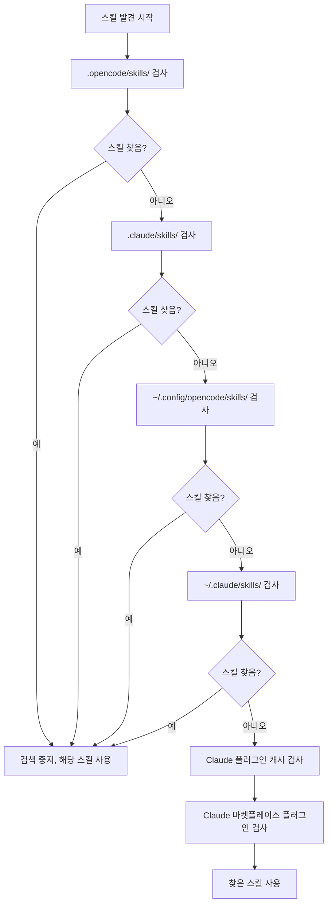

# 스킬 발견 메커니즘 상세 설명

## 학습 후 할 수 있는 것

- 플러그인이 어떤 위치에서 스킬을 자동으로 발견하는지 이해
- 스킬 발견의 우선순위 규칙 마스터
- 프로젝트 수준 스킬이 사용자 수준 스킬을 덮어쓰는 방법 알기
- Claude Code 스킬 호환 메커니즘 이해

## 현재 겪고 있는 문제점

스킬을 만들었지만 AI가 계속 "스킬을 찾을 수 없습니다"라고 말합니다. 플러그인이 어디서 스킬을 찾는지 모르고, 동일한 이름의 스킬이 어떻게 되는지도 모릅니다. 결과적으로 스킬이 잘못된 위치에 있거나 다른 위치의 스킬에 의해 덮어쓰이게 됩니다.

## 이 기술을 언제 사용해야 하나요?

- 특정 스킬을 프로젝트에서 적용해야 할 때
- 사용자 수준 또는 플러그인 기본 스킬을 덮어쓰고 싶을 때
- Claude Code의 스킬을 재사용할 때

## 🎒 시작 전 준비

::: warning 사전 지식
먼저 [OpenCode Agent Skills 설치](../../start/installation/)를 완료하세요.
:::

## 핵심 개념

OpenCode Agent Skills는 여러 위치에서 스킬을 자동으로 발견하고 우선순위 순서로 검색합니다. **첫 번째로 발견된 스킬이 적용되고, 이후 동일한 이름의 스킬은 무시됩니다**. 이를 통해 프로젝트에서 사용자 수준 스킬을 덮어써서 사용자 정의를 구현할 수 있습니다.

### 발견 경로 개요



::: info 스킬 이름 유일성
동일한 이름의 스킬은 첫 번째로 발견된 것만 유지되고, 이후의 것은 무시됩니다. 즉, 프로젝트 수준의 `git-helper`가 사용자 수준의 `git-helper`를 덮어씁니다.
:::

## 따라해 보세요

### 1단계: 스킬 발견 로직 확인

**이유**
플러그인이 스킬 디렉토리를 어떻게 스캔하는지 알면 문제 해결에 도움이 됩니다.

소스 코드의 발견 경로 정의 확인:

```typescript
// src/skills.ts:241-246
const discoveryPaths: DiscoveryPath[] = [
  { path: path.join(directory, '.opencode', 'skills'), label: 'project', maxDepth: 3 },
  { path: path.join(directory, '.claude', 'skills'), label: 'claude-project', maxDepth: 1 },
  { path: path.join(homedir(), '.config', 'opencode', 'skills'), label: 'user', maxDepth: 3 },
  { path: path.join(homedir(), '.claude', 'skills'), label: 'claude-user', maxDepth: 1 }
];
```

**확인해야 할 내용**:
- 4개의 로컬 발견 경로, 각각 `label`(소스 식별자)과 `maxDepth`(최대 재귀 깊이)가 있음
- 2개의 Claude 플러그인 경로(캐시 및 마켓플레이스 플러그인)가 있으며 `discoverPluginCacheSkills()`와 `discoverMarketplaceSkills()`를 통해 발견됨
- `directory`는 프로젝트 루트 디렉토리, `homedir()`은 사용자 홈 디렉토리

### 2단계: 재귀 검색 메커니즘 이해

**이유**
재귀 깊이 제한을 이해하면 스킬을 너무 깊이 넣어 찾지 못하는 것을 방지할 수 있습니다.

재귀 검색 함수는 디렉토리 트리를 순회하며 `SKILL.md` 파일을 찾습니다:

```typescript
// src/skills.ts:182-207
async function recurse(dir: string, depth: number, relPath: string) {
  if (depth > maxDepth) return;  // 깊이 제한 초과, 검색 중지

  const entries = await fs.readdir(dir, { withFileTypes: true });
  for (const entry of entries) {
    const fullPath = path.join(dir, entry.name);
    const stats = await fs.stat(fullPath);

    if (!stats.isDirectory()) continue;  // 파일 건너뛰기

    const newRelPath = relPath ? `${relPath}/${entry.name}` : entry.name;
    const found = await findFile(fullPath, newRelPath, 'SKILL.md');

    if (found) {
      results.push({ ...found, label });  // 스킬 찾음, 결과 추가
    } else {
      await recurse(fullPath, depth + 1, newRelPath);  // 하위 디렉토리 재귀 검색
    }
  }
}
```

**확인해야 할 내용**:
- 각 디렉토리 깊이는 0부터 시작하며 `maxDepth`를 초과하면 중지
- `SKILL.md`를 찾으면 반환하고, 아니면 하위 디렉토리 계속 검색

**위치별 재귀 깊이**:

| 위치                | Label           | 최대 깊이 | 설명                       |
|--- | --- | --- | ---|
| `.opencode/skills/` | project         | 3        | 중첩 디렉토리 구조 지원           |
| `.claude/skills/`   | claude-project  | 1        | 첫 번째 레벨만 스캔               |
| `~/.config/opencode/skills/` | user   | 3        | 중첩 디렉토리 구조 지원           |
| `~/.claude/skills/` | claude-user     | 1        | 첫 번째 레벨만 스캔               |

### 3단계: 중복 제거 규칙 이해

**이유**
동일한 이름의 스킬은 하나만 유지되므로, 이 규칙을 알면 스킬이 덮어쓰이는 것을 방지할 수 있습니다.

중복 제거 로직은 `discoverAllSkills` 함수에 있습니다:

```typescript
// src/skills.ts:255-262
const skillsByName = new Map<string, Skill>();
for (const { filePath, relativePath, label } of allResults) {
  const skill = await parseSkillFile(filePath, relativePath, label);
  if (!skill || skillsByName.has(skill.name)) continue;  // 이미 존재하는 동일 이름 스킬 건너뛰기
  skillsByName.set(skill.name, skill);
}
```

**확인해야 할 내용**:
- `Map`을 사용하여 `skill.name`으로 저장하여 유일성 보장
- `skillsByName.has(skill.name)`로 동일 이름 스킬 존재 여부 확인
- 이후 동일 이름 스킬은 무시됨(`continue`)

**시나리오 예시**:

```
프로젝트 구조:
.opencode/skills/git-helper/SKILL.md  ← 첫 번째 발견, 적용됨
~/.config/opencode/skills/git-helper/SKILL.md  ← 동일한 이름, 무시됨
```

### 4단계: SKILL.md 파일 파싱

**이유**
SKILL.md의 파싱 규칙을 이해하면 형식 오류를 방지할 수 있습니다.

플러그인은 SKILL.md의 YAML frontmatter를 파싱합니다:

```typescript
// src/skills.ts:132-152
const frontmatterMatch = content.match(/^---\n([\s\S]*?)\n---\n([\s\S]*)$/);
if (!frontmatterMatch?.[1] || !frontmatterMatch?.[2]) {
  return null;  // 형식 오류, 건너뛰기
}

const frontmatterText = frontmatterMatch[1];
const skillContent = frontmatterMatch[2].trim();

let frontmatterObj: unknown;
try {
  frontmatterObj = parseYamlFrontmatter(frontmatterText);
} catch {
  return null;  // YAML 파싱 실패, 건너뛰기
}

let frontmatter: SkillFrontmatter;
try {
  frontmatter = SkillFrontmatterSchema.parse(frontmatterObj);
} catch (error) {
  return null;  // 검증 실패, 건너뛰기
}
```

**확인해야 할 내용**:
- Frontmatter는 `---`로 감싸야 함
- YAML 내용은 Zod Schema 검증을 통과해야 함
- 파싱 실패한 스킬은 무시됨(오류를 내지 않고 다른 스킬 발견 계속)

**Frontmatter 검증 규칙**:

```typescript
// src/skills.ts:106-114
const SkillFrontmatterSchema = z.object({
  name: z.string()
    .regex(/^[\p{Ll}\p{N}-]+$/u, { message: "Name must be lowercase alphanumeric with hyphens" })
    .min(1, { message: "Name cannot be empty" }),
  description: z.string()
    .min(1, { message: "Description cannot be empty" }),
  license: z.string().optional(),
  "allowed-tools": z.array(z.string()).optional(),
  metadata: z.record(z.string(), z.string()).optional()
});
```

**이름 규칙**:
- 소문자, 숫자, 하이픈(`-`)만 허용
- 공백, 대문자, 밑줄 허용 안 함

| ❌ 잘못된 스킬 이름  | ✅ 올바른 스킬 이름 |
|--- | ---|
| `MySkill`        | `my-skill`       |
| `git_helper`     | `git-helper`     |
| `Git Helper`     | `git-helper`     |

### 5단계: 실행 가능한 스크립트 발견

**이유**
스킬은 자동화 스크립트를 포함할 수 있으며, 스크립트 발견 메커니즘을 이해하면 올바르게 구성할 수 있습니다.

플러그인은 스킬 디렉토리를 재귀적으로 스캔하여 실행 가능한 파일을 찾습니다:

```typescript
// src/skills.ts:61-93
const scripts: Script[] = [];
const skipDirs = new Set(['node_modules', '__pycache__', '.git', '.venv', 'venv', '.tox', '.nox']);

async function recurse(dir: string, depth: number, relPath: string) {
  if (depth > maxDepth) return;

  const entries = await fs.readdir(dir, { withFileTypes: true });
  for (const entry of entries) {
    if (entry.name.startsWith('.')) continue;  // 숨겨진 디렉토리 건너뛰기
    if (skipDirs.has(entry.name)) continue;    // 의존성 디렉토리 건너뛰기

    const fullPath = path.join(dir, entry.name);
    const stats = await fs.stat(fullPath);

    if (stats.isDirectory()) {
      await recurse(fullPath, depth + 1, newRelPath);
    } else if (stats.isFile()) {
      if (stats.mode & 0o111) {  // 실행 가능 비트 확인
        scripts.push({
          relativePath: newRelPath,
          absolutePath: fullPath
        });
      }
    }
  }
}
```

**확인해야 할 내용**:
- 실행 가능 비트(`0o111`)가 있는 파일만 스캔
- 숨겨진 디렉토리와 일반적인 의존성 디렉토리는 자동 건너뜀
- 최대 재귀 깊이 10레벨

**스크립트 발견 규칙**:

| 규칙              | 설명                                    |
|--- | ---|
| 실행 가능 비트 확인      | 파일에 실행 권한이 있어야 함(`chmod +x`)       |
| 숨겨진 디렉토리 건너뛰기      | `.git`, `.venv` 등 디렉토리 스캔 안 함           |
| 의존성 디렉토리 건너뛰기      | `node_modules`, `__pycache__` 등 스캔 안 함 |
| 최대 깊이 10레벨    | 10레벨 이상 중첩은 스캔되지 않음              |

### 6단계: Claude Code 플러그인 호환

**이유**
Claude Code 플러그인 호환 메커니즘을 이해하면 기존 스킬을 재사용할 수 있습니다.

플러그인은 Claude Code의 플러그인 캐시와 마켓플레이스 설치 디렉토리를 스캔합니다:

```typescript
// src/claude.ts:115-145
async function discoverMarketplaceSkills(): Promise<LabeledDiscoveryResult[]> {
  const claudeDir = path.join(homedir(), ".claude", "plugins");
  const installedPath = path.join(claudeDir, "installed_plugins.json");

  let installed: InstalledPlugins;
  try {
    const content = await fs.readFile(installedPath, "utf-8");
    installed = JSON.parse(content);
  } catch {
    return [];
  }

  const isV2 = installed.version === 2;

  for (const pluginKey of Object.keys(installed.plugins || {})) {
    const pluginData = installed.plugins[pluginKey];
    if (!pluginData) continue;

    if (isV2 || Array.isArray(pluginData)) {
      // v2 format: use installPath directly from each installation entry
      const installPaths = getPluginInstallPaths(pluginData);
      for (const installPath of installPaths) {
        const skills = await discoverSkillsFromPluginDir(installPath);
        results.push(...skills);
      }
    } else {
      // v1 format: use marketplace manifest to find skills
      // ...
    }
  }
}
```

**확인해야 할 내용**:
- Claude Code의 `installed_plugins.json` 파일 읽기
- v1과 v2 두 가지 플러그인 형식 지원
- 플러그인 설치 경로에서 `SKILL.md` 파일 스캔

**Claude Code 플러그인 구조**:

캐시 디렉토리 구조(플러그인 캐시):

```
~/.claude/plugins/
├── cache/                    # 플러그인 캐시
│   ├── plugin-name/         # v1 구조
│   │   └── skills/
│   │       └── skill-name/SKILL.md
│   └── marketplace-name/    # v2 구조
│       └── plugin-name/
│           └── version/
│               └── skills/
│                   └── skill-name/SKILL.md
└── installed_plugins.json   # 플러그인 설치 목록
```

**마켓플레이스 플러그인(v2)**:
- 플러그인의 실제 경로는 `installed_plugins.json`의 `installPath` 필드에서 읽음
- 경로가 고정되어 있지 않음, `managed`, `user`, `project` 또는 `local` 범위의 임의 위치일 수 있음
- 각 플러그인 디렉토리 하위에 `skills/` 하위 디렉토리가 있으며, 각 스킬이 포함됨

## 체크포인트 ✅

스킬 발견 메커니즘을 마스터했는지 확인하세요:

- [ ] 6개의 스킬 발견 경로 우선순위 순서 알기
- [ ] 동일한 이름의 스킬은 첫 번째로 발견된 것만 유지됨 이해
- [ ] 다른 위치의 재귀 깊이 제한 알기
- [ ] SKILL.md 검증 규칙 이해
- [ ] 프로젝트 수준 스킬이 사용자 수준 스킬을 덮어쓰는 방법 알기

## 함정 주의

### ❌ 스킬을 잘못된 위치에 배치

**문제**: 스킬을 `~/.config/opencode/skills/`에 배치했지만, 프로젝트에 동일한 이름의 스킬이 있어 덮어씀.

**해결**: 프로젝트 특정 스킬을 `.opencode/skills/`에 배치하여 최우선순위를 보장.

### ❌ 스킬 이름이 규칙을 준수하지 않음

**문제**: SKILL.md의 `name` 필드에 대문자나 공백이 포함되어 파싱 실패.

**해결**: 스킬 이름이 `lowercase-alphanumeric-with-hyphens` 규칙을 준수하는지 확인(예: `git-helper`).

### ❌ 스크립트에 실행 권한 없음

**문제**: 스킬 스크립트가 `run_skill_script` 도구로 실행되지 않음.

**해결**: 스크립트에 실행 권한 추가:
```bash
chmod +x tools/build.sh
```

### ❌ 스킬을 너무 깊이 배치하여 찾지 못함

**문제**: 스킬을 `~/.config/opencode/skills/category/subcategory/skill/`에 배치하여 재귀 깊이 제한 초과.

**해결**: 스킬 디렉토리 깊이가 해당 위치의 `maxDepth` 제한을 초과하지 않도록 확인.

## 이번 수업 요약

OpenCode Agent Skills는 여러 위치에서 스킬을 자동으로 발견하고 우선순위 순서로 검색합니다:

1. **우선순위 순서**(높은 순서에서 낮은 순서): `.opencode/skills/` → `.claude/skills/` → `~/.config/opencode/skills/` → `~/.claude/skills/` → Claude 플러그인 캐시(`~/.claude/plugins/cache/`) → Claude 마켓플레이스 플러그인(`installed_plugins.json`에서 설치 경로 읽기)

2. **중복 제거 규칙**: 동일한 이름의 스킬은 첫 번째로 발견된 것만 유지되며, 프로젝트 수준 스킬이 사용자 수준 스킬을 덮어씁니다.

3. **재귀 깊이**: 위치에 따라 재귀 깊이가 다르며, 스킬을 너무 깊이 배치하면 찾을 수 없습니다.

4. **형식 검증**: SKILL.md의 frontmatter는 Zod Schema 검증을 통과해야 하며, 그렇지 않으면 무시됩니다.

5. **스크립트 발견**: 실행 가능 비트가 있는 파일만 스크립트로 인식됩니다.

## 다음 수업 예고

> 다음 수업에서는 **[사용 가능한 스킬 조회 및 나열](../listing-available-skills/)**을 학습합니다.
>
> 학습할 내용:
> - `get_available_skills` 도구를 사용하여 모든 사용 가능한 스킬 보기
> - 스킬 네임스페이스 사용 방법 이해
> - 퍼지 매칭으로 스킬 찾는 방법

---

## 부록: 소스 코드 참조

<details>
<summary><strong>소스 코드 위치 보기 펼치기</strong></summary>

> 업데이트: 2026-01-24

| 기능           | 파일 경로                                                                                      | 행 번호    |
|--- | --- | ---|
| 발견 경로 정의   | [`src/skills.ts`](https://github.com/joshuadavidthomas/opencode-agent-skills/blob/main/src/skills.ts#L241-L246)     | 241-246 |
| 모든 스킬 발견   | [`src/skills.ts`](https://github.com/joshuadavidthomas/opencode-agent-skills/blob/main/src/skills.ts#L240-L263)     | 240-263 |
| 재귀 스킬 검색   | [`src/skills.ts`](https://github.com/joshuadavidthomas/opencode-agent-skills/blob/main/src/skills.ts#L176-L218)     | 176-218 |
| SkillLabel 열거형 | [`src/skills.ts`](https://github.com/joshuadavidthomas/opencode-agent-skills/blob/main/src/skills.ts#L30)              | 30      |
| 중복 제거 로직       | [`src/skills.ts`](https://github.com/joshuadavidthomas/opencode-agent-skills/blob/main/src/skills.ts#L255-L262)     | 255-262 |
| Frontmatter 파싱 | [`src/skills.ts`](https://github.com/joshuadavidthomas/opencode-agent-skills/blob/main/src/skills.ts#L122-L167)      | 122-167 |
| Schema 검증    | [`src/skills.ts`](https://github.com/joshuadavidthomas/opencode-agent-skills/blob/main/src/skills.ts#L105-L114)     | 105-114 |
| 스크립트 발견       | [`src/skills.ts`](https://github.com/joshuadavidthomas/opencode-agent-skills/blob/main/src/skills.ts#L59-L99)       | 59-99   |
| Claude 마켓플레이스 플러그인 발견 | [`src/claude.ts`](https://github.com/joshuadavidthomas/opencode-agent-skills/blob/main/src/claude.ts#L115-L180)     | 115-180 |
| Claude 캐시 플러그인 발견 | [`src/claude.ts`](https://github.com/joshuadavidthomas/opencode-agent-skills/blob/main/src/claude.ts#L193-L253)     | 193-253 |

**주요 상수**:
- `maxDepth`(위치에 따라 다른 값): 재귀 깊이 제한

**주요 함수**:
- `discoverAllSkills()`: 모든 경로에서 스킬 발견
- `findSkillsRecursive()`: 스킬 디렉토리 재귀 검색
- `parseSkillFile()`: SKILL.md 파일 파싱
- `discoverMarketplaceSkills()`: Claude 마켓플레이스 플러그인 발견
- `discoverPluginCacheSkills()`: Claude 캐시 플러그인 발견

</details>
