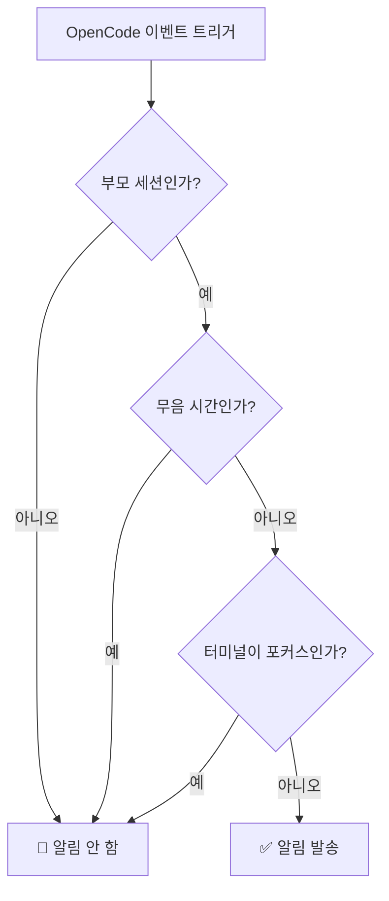

# 무음 시간 상세 가이드: 특정 시간대 방지

## 배우게 될 내용

- 설정 파일에서 무음 시간을 활성화하여 휴식 중 방해 방지
- 무음 시간의 작동 원리와 시간 계산 로직 이해
- 자정을 넘는 시간대 설정(예: 22:00 - 08:00)
- 무음 시간과 다른 스마트 필터링 메커니즘 간의 우선순위 관계 이해

## 현재 직면한 문제

다음과 같은 상황을 겪어본 적이 있나요? 밤 10시에 AI에게 작업을 위임하고 잠자리에 들었습니다. 그런데 새벽 2시에 AI가 작업을 완료하고 "딩" 소리의 알림이 잠을 깨웠습니다. 또는 점심 휴식 중 AI에게 파일 처리를 맡겼는데 12시 5분에 알림이 울려 휴식을 방해했습니다.

::: info 무음 시간이란?
무음 시간은 시간대 설정으로, 이 시간대 내에서 opencode-notify는 모든 알림 발송을 중단하여 원치 않는 시간에 알림을 받지 않도록 합니다.
:::

## 이 기능을 사용하는 시기

- **야간 휴식**: 22:00 - 08:00을 설정하여 수면 중 방지
- **점심 휴식 시간**: 12:00 - 13:00을 설정하여 점심 휴식 중 방지
- **집중 업무 시간**: 09:00 - 12:00을 설정하여 회의 중 알림 방지
- **주말 근무 없음**: 주말 전체를 무음 시간으로 설정

무음 시간은 휴식 시간이나 집중 업무 시간을 보호하는 데 가장 적합합니다. AI가 백그라운드에서 조용히 작업을 완료하도록 하고, 준비가 되었을 때 결과를 확인하세요.

## 핵심 개념

무음 시간의 작동 원리는 매우 간단합니다:

1. **시간 확인**: 알림 발송이 필요할 때마다 플러그인이 현재 시간이 설정된 무음 시간 내에 있는지 확인
2. **시간대 지원**: 자정을 넘는 시간대를 포함한 모든 시간대 지원(예: 22:00 - 08:00)
3. **중간 우선순위**: 무음 시간 확인은 부모 세션 확인보다 우선순위가 낮지만, 터미널 포커스 감지보다는 높습니다. 현재가 하위 세션이고 `notifyChildSessions`가 false인 경우, 무음 시간 확인을 걸러뜁니다.

::: tip 무음 시간 vs 임시 비활성화
무음 시간은**정기적으로 반복**되는 시간 설정입니다(예: 매일 밤 10시부터 아침 8시까지). **임시로**알림을 비활성화하려는 경우(예: 다음 1시간 동안 알림 없음), 설정 파일에서 `"enabled": false`를 설정하거나, 기본값으로 되돌리기 위해 설정 파일을 삭제하세요.
:::

## 단계별 가이드

### 1단계: 설정 파일 열기

설정 파일 위치: `~/.config/opencode/kdco-notify.json`

파일이 없는 경우 먼저 생성할 수 있습니다:

::: code-group

```bash [macOS/Linux]
vim ~/.config/opencode/kdco-notify.json
```

```powershell [Windows]
notepad $env:USERPROFILE\.config\opencode\kdco-notify.json
```

:::

설정 파일 내용(있는 경우) 또는 빈 파일을 보게 됩니다.

### 2단계: 무음 시간 설정 추가

설정 파일에 `quietHours` 부분을 추가하거나 수정:

```json
{
  "quietHours": {
    "enabled": true,
    "start": "22:00",
    "end": "08:00"
  }
}
```

**설정 항목 설명**:

| 설정 항목 | 타입 | 기본값 | 설명 |
| --- | --- | --- | --- |
| `enabled` | boolean | `false` | 무음 시간 활성화 여부 |
| `start` | string | `"22:00"` | 무음 시작 시간, `"HH:MM"` 형식 |
| `end` | string | `"08:00"` | 무음 종료 시간, `"HH:MM"` 형식 |

### 3단계: 설정 파일 저장

파일을 저장하고 편집기를 종료합니다.

**체크포인트 ✅**: 다음 명령을 실행하여 설정 파일 형식이 올바른지 확인:

```bash
cat ~/.config/opencode/kdco-notify.json | jq .
```

형식이 지정된 JSON 내용이 표시되고 오류 메시지가 없어야 합니다.

::: tip jq가 설치되지 않았나요?
시스템에 `jq` 명령이 없는 경우 이 확인을 걸러뛰거나, 브라우저에서 JSON 내용을 복사하여 [JSON 검증기](https://jsonlint.com/)에서 확인하세요.
:::

### 4단계: OpenCode 재시작

설정 파일 수정 후 OpenCode를 재시작해야 적용됩니다.

**체크포인트 ✅**: 재시작 후 OpenCode가 자동으로 설정을 다시 로드합니다.

### 5단계: 무음 시간 테스트

무음 시간이 제대로 작동하는지 확인하려면:

1. `start`와 `end`를 현재 시간 근처의 값으로 설정(예: 현재가 14:00이면 13:55 - 14:05 설정)
2. AI에게 간단한 작업 위임
3. 작업 완료 대기

**무음 시간 내에서는 어떤 알림도 받지 않아야 합니다**.

**참고**: 현재 시간이 무음 시간 내에 없거나 `enabled`가 `false`인 경우, 정상적으로 알림을 받습니다.

### 6단계: 일반 설정으로 복원

테스트 완료 후, 설정을 일반적으로 사용하는 시간대(예: 22:00 - 08:00)로 변경:

```json
{
  "quietHours": {
    "enabled": true,
    "start": "22:00",
    "end": "08:00"
  }
}
```

설정 파일을 저장하고 OpenCode를 재시작합니다.

## 자주 하는 실수

### 일반적인 오류 1: 무음 시간 활성화를 잊음

**문제**: `start`와 `end`를 설정했지만 여전히 알림을 받습니다.

**원인**: `enabled` 필드가 `false`이거나 설정되지 않았습니다.

**해결책**: `enabled`가 `true`로 설정되어 있는지 확인:

```json
{
  "quietHours": {
    "enabled": true,
    "start": "22:00",
    "end": "08:00"
  }
}
```

### 일반적인 오류 2: 시간 형식 오류

**문제**: 설정 후 작동하지 않거나 시작 시 오류가 발생합니다.

**원인**: 시간 형식이 `"HH:MM"` 형식이 아니거나 12시간제(AM/PM)를 사용했습니다.

**잘못된 예**:
```json
{
  "start": "10 PM",  // ❌ 오류: AM/PM 미지원
  "end": "8:00"      // ⚠️ 작동 가능하지만 일관성을 위해 "08:00" 사용 권장
}
```

**올바른 예**:
```json
{
  "start": "22:00",  // ✅ 올바름: 24시간제, 선행 0 사용 권장
  "end": "08:00"     // ✅ 올바름: 24시간제, 선행 0 사용 권장
}
```

### 일반적인 오류 3: 자정을 넘는 시간 이해 오류

**문제**: 22:00 - 08:00을 설정했는데 낮의 특정 시간대도 무음 처리됩니다.

**원인**: `start`가 `end`보다 작아야 한다고 오해하여 시간대 계산 오류.

**올바른 이해**:
- 22:00 - 08:00은 의미:**밤 10시부터 다음 날 아침 8시까지**
- 이는 자정을 넘는 시간대이며, 플러그인이 자동으로 인식합니다
- 08:00 - 22:00이 아님(이렇게 설정하면 낮 전체가 무음 처리됨)

::: tip 자정을 넘는 시간대 검증
자정을 넘는 시간대가 올바르게 설정되었는지 확인하려면, 설정 파일에서 짧은 테스트 시간(예: 10분)을 설정하고 예상된 시간대에 알림이 오지 않는지 관찰하세요.
:::

### 일반적인 오류 4: OpenCode를 재시작하지 않음

**문제**: 설정 파일을 수정했지만 무음 시간이 이전 설정대로 작동합니다.

**원인**: 설정 파일은 플러그인 시작 시 한 번 로드되며, 파일 변경을 실시간으로 감시하지 않습니다.

**해결책**: 설정 파일을 수정할 때마다 OpenCode를 재시작해야 적용됩니다.

## 무음 시간과 다른 필터링 메커니즘의 관계

스마트 필터링 메커니즘에서 무음 시간의 위치:



**핵심 포인트**:

1. **무음 시간 중간 우선순위**: 부모 세션 확인이 가장 높은 우선순위를 가지고, 무음 시간이 그 다음입니다. 현재가 하위 세션이고 `notifyChildSessions`가 false인 경우, 무음 시간 확인을 걸러뜁니다. 하지만 부모 세션 확인을 통과하면(현재가 부모 세션이거나 `notifyChildSessions`가 true), 터미널이 포커스되어 있어도 무음 시간 내에서는 알림을 발송하지 않습니다.
2. **터미널 포커스 감지와 무관**: 터미널이 포커스되어 있지 않아도 무음 시간 내에서는 알림을 발송하지 않습니다
3. **실행 순서**: 부모 세션 확인이 무음 시간보다 먼저 실행됩니다. 부모 세션 확인이 통과되면(현재가 부모 세션이거나 `notifyChildSessions`가 true), 무음 시간 확인을 계속합니다.

::: warning 특수 상황: 권한 요청 및 질문 문의
권한 요청(`permission.updated`) 및 질문 문의(`tool.execute.before`)는 소스 코드에서**무음 시간의 영향을 받습니다**. 이는 무음 시간 내에서도 AI가 권한 부여나 답변을 기다리고 있어도 알림이 발송되지 않음을 의미합니다.
:::

## 일반적인 설정 예시

### 예시 1: 야간 휴식

밤 10시부터 아침 8시까지를 무음 시간으로 설정:

```json
{
  "quietHours": {
    "enabled": true,
    "start": "22:00",
    "end": "08:00"
  }
}
```

### 예시 2: 점심 휴식 시간

낮 12시부터 오후 1시까지를 무음 시간으로 설정:

```json
{
  "quietHours": {
    "enabled": true,
    "start": "12:00",
    "end": "13:00"
  }
}
```

### 예시 3: 집중 업무 시간

오전 9시부터 낮 12시까지를 무음 시간으로 설정(예: 회의 중 알림 방지):

```json
{
  "quietHours": {
    "enabled": true,
    "start": "09:00",
    "end": "12:00"
  }
}
```

### 예시 4: 완전한 설정

무음 시간을 다른 설정 항목과 함께 사용:

```json
{
  "enabled": true,
  "notifyChildSessions": false,
  "suppressWhenFocused": true,
  "sounds": {
    "idle": "Glass",
    "error": "Basso",
    "permission": "Submarine"
  },
  "quietHours": {
    "enabled": true,
    "start": "22:00",
    "end": "08:00"
  },
  "terminal": "ghostty"
}
```

## 본 강의 요약

무음 시간은 opencode-notify의 중요한 기능으로, 특정 시간대에 방해를 받지 않도록 합니다:

1. **설정 방법**: `~/.config/opencode/kdco-notify.json`에서 `quietHours` 부분을 설정
2. **시간 형식**: 24시간제 `"HH:MM"` 형식 사용, 예: `"22:00"` 및 `"08:00"`
3. **자정 넘기 지원**: `"22:00" - "08:00"`과 같이 자정을 넘는 시간대 지원, 즉 밤 10시부터 다음 날 아침 8시까지
4. **실행 순서**: 부모 세션 확인 → 무음 시간 → 터미널 포커스 감지. 무음 시간은 부모 세션 확인을 통과한 후에만 작동합니다
5. **재시작 필요**: 설정 파일 수정 후 OpenCode를 재시작해야 적용됩니다

무음 시간을 적절히 설정하면 AI가 휴식 시간이나 집중 업무 시간에 조용히 작업을 완료하도록 하고, 준비가 되었을 때 결과를 확인할 수 있습니다.

## 다음 강의 예고

> 다음 강의에서는 **[터미널 감지 원리](../terminal-detection/)**를 학습합니다.
>
> 학습 내용:
> - opencode-notify가 사용 중인 터미널을 자동으로 감지하는 방법
> - 지원하는 37+ 터미널 에뮬레이터 목록
> - 수동으로 터미널 유형을 지정하는 방법
> - macOS 포커스 감지의 구현 원리

---

## 부록: 소스 코드 참조

<details>
<summary><strong>소스 코드 위치 보기</strong></summary>

> 업데이트 시간: 2026-01-27

| 기능 | 파일 경로 | 라인 번호 |
| --- | --- | --- |
| 무음 시간 확인 | [`src/notify.ts`](https://github.com/kdcokenny/opencode-notify/blob/main/src/notify.ts#L181-L199) | 181-199 |
| 설정 인터페이스 정의 | [`src/notify.ts`](https://github.com/kdcokenny/opencode-notify/blob/main/src/notify.ts#L30-L48) | 30-48 |
| 기본 설정 | [`src/notify.ts`](https://github.com/kdcokenny/opencode-notify/blob/main/src/notify.ts#L56-L68) | 56-68 |
| 작업 완료 처리의 무음 확인 | [`src/notify.ts`](https://github.com/kdcokenny/opencode-notify/blob/main/src/notify.ts#L262) | 262 |
| 오류 알림 처리의 무음 확인 | [`src/notify.ts`](https://github.com/kdcokenny/opencode-notify/blob/main/src/notify.ts#L300) | 300 |
| 권한 요청 처리의 무음 확인 | [`src/notify.ts`](https://github.com/kdcokenny/opencode-notify/blob/main/src/notify.ts#L323) | 323 |
| 질문 문의 처리의 무음 확인 | [`src/notify.ts`](https://github.com/kdcokenny/opencode-notify/blob/main/src/notify.ts#L341) | 341 |

**주요 상수**:

- `DEFAULT_CONFIG.quietHours`: 기본 무음 시간 설정(63-67라인)
  - `enabled: false`: 기본적으로 무음 시간 비활성화
  - `start: "22:00"`: 기본 무음 시작 시간
  - `end: "08:00"`: 기본 무음 종료 시간

**주요 함수**:

- `isQuietHours(config: NotifyConfig): boolean`: 현재 시간이 무음 시간 내에 있는지 확인(181-199라인)
  - 먼저 `config.quietHours.enabled`가 `true`인지 확인
  - 현재 시간을 분 단위로 변환
  - 시작 및 종료 시간을 분 단위로 변환
  - 자정을 넘는 시간대 처리(`startMinutes > endMinutes`)
  - `true` 반환 시 무음 시간 내, `false` 반환 시 무음 시간 외

**비즈니스 규칙**:

- BR-1-3: 무음 시간 내 알림 발송 금지(`notify.ts:262`)
- BR-3-2: 무음 시간은 자정을 넘는 시간대 지원(예: 22:00-08:00)(`notify.ts:193-196`)
- BR-4-1: 현재 시간이 무음 시간 내일 때 알림 발송 금지(`notify.ts:182-198`)
- BR-4-2: 자정을 넘는 시간대 지원(예: 22:00-08:00)(`notify.ts:194-196`)

</details>
