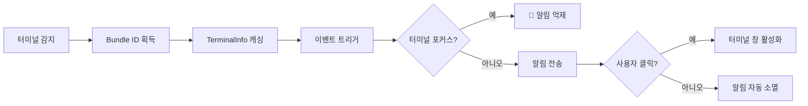
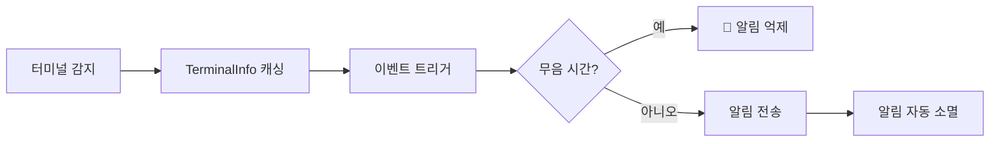

# 터미널 감지 원리: 자동 식별 메커니즘과 macOS 포커스 감지 상세 설명

## 배우면 할 수 있는 것

- 터미널 자동 감지의 작동 메커니즘과 구현 원리를 심도 있게 이해
- macOS 포커스 감지와 Bundle ID 동적 획득의 기술적 세부 사항을 파악
- 감지 실패 문제를 해결하기 위한 터미널 유형 수동 재정의 방법을 학습
- 다양한 플랫폼(macOS/Windows/Linux)의 감지 차이점을 이해
- 터미널 감지와 관련된 소스코드 구현을 분석

## 현재의 어려움

opencode-notify가 37개 이상의 터미널을 지원하고, 수동으로 터미널 유형을 지정할 수 있다는 것을 알고 있습니다. 하지만 더 깊이 알고 싶습니다:

- 터미널 감지가 하위에서 어떻게 구현되는가?
- macOS의 포커스 감지는 어떤 메커니즘을 통해 구현되는가?
- 왜 macOS는 Bundle ID를 획득해야 하지만 Windows/Linux는 필요하지 않은가?
- 자동 감지 실패 시 플러그인은 어떻게 처리하는가?
- tmux 등의 터미널 멀티플렉서는 어떻게 식별되는가?

이 과정은 소스코드를 깊이 있게 분석하여 이러한 기술적 세부 사항을 해결합니다.

## 핵심 아이디어

터미널 감지 구현은 세 가지 계층으로 나뉩니다:

```
1. 자동 감지 계층: detect-terminal 라이브러리가 터미널 유형 식별
    ↓
2. 플랫폼 어댑터 계층: macOS/Windows/Linux 특정 처리
    ↓
3. 기능 강화 계층: 포커스 감지, 클릭 포커스, Bundle ID 획득
```

**핵심 설계 원칙**:

- **시작 시 한 번 감지**: 플러그인 시작 시 터미널을 감지하고, 결과를 후속 모든 알림에 캐시(성능 최적화)
- **구성 재정의 우선**: 수동으로 지정한 `terminal` 구성은 자동 감지보다 우선
- **실패 시 하위 처리**: 감지 실패 시 알림 전송을 차단하지 않고, 스마트 필터링 기능만 비활성화
- **플랫폼 차이 어댑터**: macOS는 전체 기능 지원, Windows/Linux는 기본 알림 지원

::: info 왜 시작 시 한 번 감지하나요?
터미널 감지는 프로세스 스캔, osascript 호출 등의 작업을 포함하며, 알림 전에 매번 감지하면 상당한 성능 오버헤드가 발생합니다. 따라서 플러그인은 시작 시 한 번 감지하고 `TerminalInfo` 객체를 캐시하여 후속 모든 알림이 이 캐시를 재사용합니다.
:::

## 터미널 감지의 완전한 흐름

### 소스코드 분석: detectTerminalInfo()

핵심 감지 함수를 한 줄씩 분석해 보겠습니다:

```typescript
// src/notify.ts:145-164
async function detectTerminalInfo(config: NotifyConfig): Promise<TerminalInfo> {
    // Use config override if provided
    const terminalName = config.terminal || detectTerminal() || null

    if (!terminalName) {
        return { name: null, bundleId: null, processName: null }
    }

    // Get process name for focus detection
    const processName = TERMINAL_PROCESS_NAMES[terminalName.toLowerCase()] || terminalName

    // Dynamically get bundle ID from macOS (no hardcoding!)
    const bundleId = await getBundleId(processName)

    return {
        name: terminalName,
        bundleId,
        processName,
    }
}
```

**단계 분해**:

| 단계 | 코드 | 설명 |
| --- | --- | --- |
| 1 | `config.terminal \|\| detectTerminal()` | 구성 재정의를 우선으로 사용하고, 그렇지 않으면 자동 감지 |
| 2 | `!terminalName ? return {...}` | 감지 실패 시 빈 객체 반환 |
| 3 | `TERMINAL_PROCESS_NAMES[...]` | 매핑 테이블에서 macOS 프로세스 이름 조회 |
| 4 | `await getBundleId()` | macOS에서 동적으로 Bundle ID 획득 |
| 5 | `return { name, bundleId, processName }` | 완전한 터미널 정보 반환 |

**반환되는 `TerminalInfo` 구조**:

```typescript
interface TerminalInfo {
    name: string | null       // 터미널 이름, 예: "ghostty"
    bundleId: string | null   // macOS Bundle ID, 예: "com.mitchellh.ghostty"
    processName: string | null // macOS 프로세스 이름, 예: "Ghostty"
}
```

::: details 왜 macOS에 세 가지 필드가 필요한가요?
- **name**: 터미널의 일반적인 이름(detect-terminal 라이브러리에서 반환)
- **processName**: macOS 프로세스 관리자의 프로세스 이름(포커스 감지에 사용)
- **bundleId**: macOS 애플리케이션의 고유 식별자(클릭 포커스에 사용)

예시:
- `name = "ghostty"`(detect-terminal에서 반환)
- `processName = "Ghostty"`(매핑 테이블에서 조회)
- `bundleId = "com.mitchellh.ghostty"`(osascript로 동적 쿼리)
:::

## detect-terminal 라이브러리의 작동 원리

### detect-terminal이란?

`detect-terminal`은 터미널 에뮬레이터를 식별하기 위한 전문 Node.js 라이브러리로, 시스템 프로세스를 스캔하여 현재 실행 중인 터미널을 식별합니다.

**감지 방법**:

1. **프로세스 스캔**: 현재 프로세스의 부모 프로세스 체인 검사
2. **환경 변수 감지**: `TERM`, `TERM_PROGRAM` 등의 환경 변수 확인
3. **알려진 프로세스 이름 매칭**: 37개 이상의 알려진 터미널의 프로세스 이름과 비교

**지원하는 감지 방식**:

```typescript
// detect-terminal 내부 로직(간략화)
function detect() {
    // 1. 환경 변수 확인
    if (process.env.TERM_PROGRAM) {
        return process.env.TERM_PROGRAM
    }

    // 2. 부모 프로세스 체인 스캔
    const parentProcess = getParentProcess()
    if (isKnownTerminal(parentProcess.name)) {
        return parentProcess.name
    }

    // 3. 특정 환경 변수 확인
    if (process.env.TMUX) return 'tmux'
    if (process.env.VSCODE_PID) return 'vscode'

    return null
}
```

**지원하는 터미널 수**: 37개 이상([전체 목록](https://github.com/jonschlinkert/detect-terminal#supported-terminals) 참조)

## macOS 특수 처리

### 1. 프로세스 이름 매핑 테이블

소스코드에 터미널 이름에서 macOS 프로세스 이름으로의 매핑이 정의되어 있습니다:

```typescript
// src/notify.ts:71-84
const TERMINAL_PROCESS_NAMES: Record<string, string> = {
    ghostty: "Ghostty",
    kitty: "kitty",
    iterm: "iTerm2",
    iterm2: "iTerm2",
    wezterm: "WezTerm",
    alacritty: "Alacritty",
    terminal: "Terminal",
    apple_terminal: "Terminal",
    hyper: "Hyper",
    warp: "Warp",
    vscode: "Code",
    "vscode-insiders": "Code - Insiders",
}
```

**왜 매핑 테이블이 필요한가요?**

- detect-terminal에서 반환하는 터미널 이름은 소문자나 약어일 수 있습니다(예: `"ghostty"`)
- macOS 프로세스 관리자의 프로세스 이름은 대소문자 차이가 있을 수 있습니다(예: `"Ghostty"`)
- 일부 터미널은 여러 표기법이 있습니다(예: `"iterm"`과 `"iterm2"` 모두 `"iTerm2"`에 해당)

**매핑 로직**:

```typescript
const processName = TERMINAL_PROCESS_NAMES[terminalName.toLowerCase()] || terminalName
```

- 터미널 이름을 소문자로 변환하여 매핑 테이블에서 조회
- 찾으면 매핑된 프로세스 이름 사용
- 찾지 못하면 원래 터미널 이름 사용

### 2. 동적 Bundle ID 획득

**소스코드 구현**:

```typescript
// src/notify.ts:135-137
async function getBundleId(appName: string): Promise<string | null> {
    return runOsascript(`id of application "${appName}"`)
}
```

**osascript 명령어**:

```applescript
id of application "Ghostty"
-- 반환: com.mitchellh.ghostty
```

**왜 Bundle ID를 하드코딩하지 않나요?**

하드코딩의 단점:
- ❌ 터미널 업데이트 시 Bundle ID가 변경될 수 있음
- ❌ 37개 이상의 터미널의 Bundle ID 목록을 수동으로 유지 관리해야 함
- ❌ 새 터미널 릴리스 시 코드 업데이트 필요

동적 획득의 장점:
- ✅ 터미널 버전 변경에 자동으로 적응
- ✅ 유지 관리 비용 감소
- ✅ 이론상 모든 macOS 터미널 지원

### 3. 포커스 감지 구현

**소스코드 구현**:

```typescript
// src/notify.ts:139-143
async function getFrontmostApp(): Promise<string | null> {
    return runOsascript(
        'tell application "System Events" to get name of first application process whose frontmost is true',
    )
}

// src/notify.ts:166-175
async function isTerminalFocused(terminalInfo: TerminalInfo): Promise<boolean> {
    if (!terminalInfo.processName) return false
    if (process.platform !== "darwin") return false

    const frontmost = await getFrontmostApp()
    if (!frontmost) return false

    // Case-insensitive comparison
    return frontmost.toLowerCase() === terminalInfo.processName.toLowerCase()
}
```

**osascript 명령어**:

```applescript
tell application "System Events" to get name of first application process whose frontmost is true
-- 반환: Ghostty
```

**감지 흐름**:

```
1. 플랫폼 확인: macOS가 아니면 바로 false 반환
    ↓
2. processName 확인: 프로세스 이름이 없으면 바로 false 반환
    ↓
3. 포그라운드 앱 획득: osascript로 쿼리
    ↓
4. 프로세스 이름 비교: 대소문자 구분 없이 비교
    ↓
5. 결과 반환: 같으면 포커스, 다르면 비포커스
```

**알림 전송 흐름에서의 사용**:

```typescript
// src/notify.ts:264-265
// Check if terminal is focused (suppress notification if user is already looking)
if (await isTerminalFocused(terminalInfo)) return
```

터미널이 포그라운드에 있을 때 플러그인은 알림 전송을 억제하여 중복 알림을 방지합니다.

## 구성 재정의 메커니즘

### 언제 수동 재정의가 필요한가요?

**적용 시나리오**:

1. **자동 감지 실패**: detect-terminal이 터미널을 인식할 수 없음
2. **중첩 터미널 시나리오**: tmux에서 Alacritty를 사용하고 tmux로 인식되길 원함
3. **감지 결과 부정확**: 잘못된 터미널로 잘못 인식됨

### 구성 방법

**구성 파일**: `~/.config/opencode/kdco-notify.json`

```json
{
  "terminal": "ghostty"
}
```

**우선순위 로직**(소스코드 147번째 줄):

```typescript
const terminalName = config.terminal || detectTerminal() || null
```

**우선순위 순서**:

1. **구성 재정의**(`config.terminal`): 최고 우선순위
2. **자동 감지**(`detectTerminal()`): 차선 우선순위
3. **하위 처리**(`null`): 감지 실패 시 null 사용

::: tip 구성 재정의의 적용 시나리오
터미널이 올바르게 인식될 수 있다면, **수동 재정의를 권장하지 않습니다**. 구성 재정의는 주로 감지 실패 또는 특수 시나리오 문제를 해결하는 데 사용됩니다.
:::

## 플랫폼 차이 비교

### macOS

| 기능 | 지원 여부 | 구현 방식 |
| --- | --- | ---|
| 기본 알림 | ✅ | node-notifier (NSUserNotificationCenter) |
| 터미널 감지 | ✅ | detect-terminal 라이브러리 |
| 포커스 감지 | ✅ | osascript로 포그라운드 앱 쿼리 |
| 클릭 포커스 | ✅ | node-notifier activate 매개변수 |
| Bundle ID 획득 | ✅ | osascript 동적 쿼리 |
| 사용자 정의 효과음 | ✅ | node-notifier sound 매개변수 |

**전체 지원 흐름**:



### Windows

| 기능 | 지원 여부 | 구현 방식 |
| --- | --- | ---|
| 기본 알림 | ✅ | node-notifier (SnoreToast) |
| 터미널 감지 | ✅ | detect-terminal 라이브러리 |
| 포커스 감지 | ❌ | 시스템 제한 |
| 클릭 포커스 | ❌ | 시스템 제한 |
| Bundle ID 획득 | ❌ | Windows에 이 개념 없음 |
| 사용자 정의 효과음 | ❌ | 시스템 기본 소리 사용 |

**간소화된 흐름**:



### Linux

| 기능 | 지원 여부 | 구현 방식 |
| --- | --- | ---|
| 기본 알림 | ✅ | node-notifier (notify-send) |
| 터미널 감지 | ✅ | detect-terminal 라이브러리 |
| 포커스 감지 | ❌ | 시스템 제한 |
| 클릭 포커스 | ❌ | 시스템 제한 |
| Bundle ID 획득 | ❌ | Linux에 이 개념 없음 |
| 사용자 정의 효과음 | ❌ | 데스크톱 환경 기본 소리 사용 |

**흐름은 Windows와 동일**하고, 알림 백엔드만 `notify-send`를 사용합니다.

## 감지 실패 처리

### 소스코드 로직

감지 실패 시 `detectTerminalInfo()`는 빈 객체를 반환합니다:

```typescript
if (!terminalName) {
    return { name: null, bundleId: null, processName: null }
}
```

### 알림 기능에 미치는 영향

| 기능 | 감지 실패 후 동작 |
| --- | ---|
| 기본 알림 | ✅ **정상 작동**(터미널 감지에 의존하지 않음) |
| 포커스 감지 | ❌ **비활성화**(`isTerminalFocused()`가 바로 false 반환) |
| 클릭 포커스 | ❌ **비활성화**(`bundleId`가 null이면 activate 매개변수 설정 안 함) |
| 무음 시간 | ✅ **정상 작동**(터미널 감지와 독립) |
| 부모 세션 확인 | ✅ **정상 작동**(터미널 감지와 독립) |

**예시 코드**:

```typescript
// src/notify.ts:166-175
async function isTerminalFocused(terminalInfo: TerminalInfo): Promise<boolean> {
    if (!terminalInfo.processName) return false  // ← 감지 실패 시 바로 false 반환
    if (process.platform !== "darwin") return false
    // ...
}

// src/notify.ts:238-240
if (process.platform === "darwin" && terminalInfo.bundleId) {
    notifyOptions.activate = terminalInfo.bundleId  // ← bundleId가 null이면 설정 안 함
}
```

### 감지 상태를 어떻게 확인하나요?

**임시 디버깅 방법**(소스코드 수정 필요):

```typescript
// notify.ts의 플러그인 export에 추가
export const NotifyPlugin: Plugin = async (ctx) => {
    const { client } = ctx
    const config = await loadConfig()
    const terminalInfo = await detectTerminalInfo(config)

    // 👇 디버그 로그 추가
    console.log("Terminal Info:", JSON.stringify(terminalInfo, null, 2))

    return {
        // ...
    }
}
```

**정상 출력 예시**:

```json
{
  "name": "ghostty",
  "bundleId": "com.mitchellh.ghostty",
  "processName": "Ghostty"
}
```

**감지 실패 예시**:

```json
{
  "name": null,
  "bundleId": null,
  "processName": null
}
```

## 특수 시나리오: tmux 터미널

### tmux의 특수성

tmux는 터미널 멀티플렉서(terminal multiplexer)로, 하나의 터미널 창에서 여러 세션과 창을 만들 수 있게 합니다.

**감지 방식**:

```typescript
// detect-terminal 라이브러리가 환경 변수로 tmux 감지
if (process.env.TMUX) return 'tmux'
```

**tmux의 작업 흐름 영향**:

`terminals/index.md`에서 언급된 바와 같이, tmux 작업 흐름에서는 포커스 감지를 수행하지 않습니다. 그 이유는:

1. **다중 창 시나리오**: tmux가 여러 터미널 창에서 실행될 수 있음
2. **포커스 의미 모호**: 사용자가 어떤 tmux 창을 보고 있는지 알 수 없음
3. **사용자 경험 고려**: 중요한 알림이 억제되는 것을 방지

**소스코드 증거**(`handleQuestionAsked` 함수):

```typescript
// src/notify.ts:340-341
// Guard: quiet hours only (no focus check for questions - tmux workflow)
if (isQuietHours(config)) return
```

참고: `question` 유형 이벤트의 경우, 소스코드에 "no focus check for questions - tmux workflow"라고 명시적으로 주석되어 있습니다.

## 터미널 유형 수동 구성의 모범 사례

### 적절한 터미널 이름 선택

**원칙**: detect-terminal 라이브러리가 인식하는 표준 이름을 사용합니다.

**일반적인 대조표**:

| 당신의 터미널 | 구성값 | 감지 결과(detect-terminal) |
| --- | --- | ---|
| Ghostty | `"ghostty"` | ✅ |
| iTerm2 | `"iterm2"` 또는 `"iterm"` | ✅ |
| Kitty | `"kitty"` | ✅ |
| WezTerm | `"wezterm"` | ✅ |
| Alacritty | `"alacritty"` | ✅ |
| macOS Terminal.app | `"terminal"` 또는 `"apple_terminal"` | ✅ |
| Hyper | `"hyper"` | ✅ |
| Warp | `"warp"` | ✅ |
| VS Code Stable | `"vscode"` | ✅ |
| VS Code Insiders | `"vscode-insiders"` | ✅ |
| Windows Terminal | `"windows-terminal"` 또는 `"Windows Terminal"` | ⚠️ 두 가지 모두 시도 필요 |

### 구성이 적용되었는지 확인

**방법 1: 로그 확인**

디버그 로그가 활성화된 경우(위에서 언급), 다음을 확인해야 합니다:

```json
{
  "name": "ghostty",  // ← 구성한 터미널 이름이어야 함
  "bundleId": "com.mitchellh.ghostty",
  "processName": "Ghostty"
}
```

**방법 2: 기능 테스트**

1. 터미널 유형을 구성한 후 OpenCode 재시작
2. AI 작업 시작
3. 다른 창으로 전환(터미널이 포커스를 잃도록)
4. 작업 완료 대기

다음을 확인해야 합니다: 알림이 수신되고, 클릭 시(macOS) 터미널 창에 포커스가 이동합니다.

## 함정 주의

### 일반적인 문제 1: 구성 후에도 감지 여전히 실패

**현상**: `"terminal": "ghostty"`를 설정했지만 알림 기능이 비정상입니다.

**검증 단계**:

1. **JSON 형식 확인**:

```bash
cat ~/.config/opencode/kdco-notify.json | jq .
```

2. **터미널 이름 철자 확인**:

- 소문자 사용 확인(예: `"ghostty"` 대신 `"Ghostty"` 금지)
- detect-terminal에서 지원하는 이름인지 확인

3. **OpenCode 재시작 여부 확인**:

구성 파일 수정 후 OpenCode를 재시작해야 적용됩니다.

### 일반적인 문제 2: macOS 포커스 감지가 부정확함

**현상**: 터미널이 포그라운드에 있을 때도 알림이 팝업되거나, 터미널이 백그라운드에 있을 때 알림이 팝업되지 않습니다.

**가능한 원인**:

1. **프로세스 이름 불일치**:

매핑 테이블에 터미널 프로세스 이름이 있는지 확인:

```typescript
const TERMINAL_PROCESS_NAMES: Record<string, string> = {
    // ... 터미널이 목록에 있는지 확인
}
```

2. **osascript 실행 실패**:

터미널에서 수동으로 테스트:

```bash
osascript -e 'tell application "System Events" to get name of first application process whose frontmost is true'
```

현재 포그라운드 앱 이름(예: `Ghostty`)이 반환되어야 합니다.

3. **대소문자 구분**:

소스코드는 대소문자 구분 없이 비교:

```typescript
return frontmost.toLowerCase() === terminalInfo.processName.toLowerCase()
```

매핑 테이블의 프로세스 이름이 실제 프로세스 이름과 대소문자가 일치하는지 확인.

### 일반적인 문제 3: Windows/Linux 수동 구성이 무효임

**현상**: Windows/Linux에서 `"terminal": "xxx"`를 구성했지만 감지가 여전히 실패합니다.

**설명**:

Windows/Linux의 터미널 감지는 detect-terminal 라이브러리에 의존하며, 구성 재정의 기능은 소스코드에서 크로스 플랫폼으로 구현됩니다. 구성이 무효하면 다음이 원인일 수 있습니다:

1. **터미널 이름이 올바르지 않음**: detect-terminal에서 지원하는 이름인지 확인
2. **터미널이 지원 목록에 없음**: [detect-terminal 전체 목록](https://github.com/jonschlinkert/detect-terminal#supported-terminals) 확인

**참고**: Windows/Linux은 포커스 감지와 클릭 포커스를 지원하지 않으며, 구성이 올바르더라도 터미널 감지에만 영향을 미치고 이러한 기능을 활성화하지는 않습니다.

### 일반적인 문제 4: 중첩 터미널 시나리오 감지 오류

**시나리오**: tmux에서 Alacritty를 사용하고 tmux로 인식되길 원합니다.

**현상**: 자동 감지가 `"alacritty"`로 인식되지만 `"tmux"`로 인식되길 원합니다.

**해결 방법**:

수동으로 `"terminal": "tmux"` 구성:

```json
{
  "terminal": "tmux"
}
```

**참고**: 이렇게 구성하면 플러그인은 tmux를 사용 중으로 인식하고 포커스 감지를 수행하지 않습니다(tmux 작업 흐름에 적합).

## 본 강의 요약

터미널 감지는 opencode-notify의 스마트 필터링 기능의 기초입니다:

1. **감지 흐름**: 시작 시 detect-terminal 라이브러리로 터미널을 자동 감지하고 결과를 캐싱
2. **macOS 특수 처리**:
   - 프로세스 이름 매핑 테이블(`TERMINAL_PROCESS_NAMES`)
   - 동적 Bundle ID 획득(osascript 사용)
   - 포커스 감지(포그라운드 앱 프로세스 쿼리)
3. **구성 재정의**: 수동 터미널 유형 지정이 자동 감지보다 우선
4. **플랫폼 차이**:
   - macOS: 전체 기능(알림 + 포커스 감지 + 클릭 포커스)
   - Windows/Linux: 기본 알림 기능
5. **실패 처리**: 감지 실패 시 알림을 차단하지 않고 스마트 필터링만 비활성화
6. **특수 시나리오**: tmux 작업 흐름은 포커스 감지를 지원하지 않으며 중요한 알림 억제를 방지

**핵심 소스코드 위치**:

- `detectTerminalInfo()`: 터미널 감지 주 함수(145-164번째 줄)
- `TERMINAL_PROCESS_NAMES`: macOS 프로세스 이름 매핑 테이블(71-84번째 줄)
- `getBundleId()`: 동적 Bundle ID 획득(135-137번째 줄)
- `isTerminalFocused()`: 포커스 감지 구현(166-175번째 줄)

## 다음 강의 예고

> 다음 강의에서는 **[고급 사용법](../advanced-usage/)**을 학습합니다.
>
> 배울 내용:
> - 구성 팁과 모범 사례
> - 다중 터미널 환경 구성
> - 성능 최적화 제안
> - 다른 OpenCode 플러그인과의 협업 사용

---

## 부록: 소스코드 참조

<details>
<summary><strong>클릭하여 소스코드 위치 확인</strong></summary>

> 업데이트 시간: 2026-01-27

| 기능 | 파일 경로 | 줄 번호 |
| --- | --- | ---|
| 터미널 감지 주 함수 | [`src/notify.ts`](https://github.com/kdcokenny/opencode-notify/blob/main/src/notify.ts#L145-L164) | 145-164 |
| macOS 프로세스 이름 매핑 테이블 | [`src/notify.ts`](https://github.com/kdcokenny/opencode-notify/blob/main/src/notify.ts#L71-L84) | 71-84 |
| macOS Bundle ID 획득 | [`src/notify.ts`](https://github.com/kdcokenny/opencode-notify/blob/main/src/notify.ts#L135-L137) | 135-137 |
| macOS 포그라운드 앱 감지 | [`src/notify.ts`](https://github.com/kdcokenny/opencode-notify/blob/main/src/notify.ts#L139-L143) | 139-143 |
| macOS 포커스 감지 | [`src/notify.ts`](https://github.com/kdcokenny/opencode-notify/blob/main/src/notify.ts#L166-L175) | 166-175 |
| osascript 실행 래퍼 | [`src/notify.ts`](https://github.com/kdcokenny/opencode-notify/blob/main/src/notify.ts#L120-L133) | 120-133 |
| 구성 인터페이스 정의 | [`src/notify.ts`](https://github.com/kdcokenny/opencode-notify/blob/main/src/notify.ts#L30-L54) | 30-54 |
| 작업 완료 처리의 포커스 감지 | [`src/notify.ts`](https://github.com/kdcokenny/opencode-notify/blob/main/src/notify.ts#L265) | 265 |
| 오류 알림 처리의 포커스 감지 | [`src/notify.ts`](https://github.com/kdcokenny/opencode-notify/blob/main/src/notify.ts#L303) | 303 |
| 권한 요청 처리의 포커스 감지 | [`src/notify.ts`](https://github.com/kdcokenny/opencode-notify/blob/main/src/notify.ts#L326) | 326 |
| macOS 클릭 포커스 설정 | [`src/notify.ts`](https://github.com/kdcokenny/opencode-notify/blob/main/src/notify.ts#L238-L240) | 238-240 |
| 플러그인 시작 시 터미널 감지 | [`src/notify.ts`](https://github.com/kdcokenny/opencode-notify/blob/main/src/notify.ts#L364) | 364 |

**핵심 상수**:

- `TERMINAL_PROCESS_NAMES`: 터미널 이름에서 macOS 프로세스 이름으로의 매핑 테이블(71-84번째 줄)
  - `ghostty: "Ghostty"`
  - `kitty: "kitty"`
  - `iterm: "iTerm2"` / `iterm2: "iTerm2"`
  - `wezterm: "WezTerm"`
  - `alacritty: "Alacritty"`
  - `terminal: "Terminal"` / `apple_terminal: "Terminal"`
  - `hyper: "Hyper"`
  - `warp: "Warp"`
  - `vscode: "Code"` / `"vscode-insiders": "Code - Insiders"`

**핵심 함수**:

- `detectTerminalInfo(config: NotifyConfig): Promise<TerminalInfo>`: 터미널 감지 주 함수(145-164번째 줄)
  - 구성 재정의 우선 사용(`config.terminal`)
  - detect-terminal 라이브러리로 자동 감지 호출
  - 프로세스 이름 매핑 테이블 조회
  - Bundle ID 동적 획득(macOS)
  - 완전한 터미널 정보 객체 반환

- `isTerminalFocused(terminalInfo: TerminalInfo): Promise<boolean>`: 터미널 포커스 여부 감지(166-175번째 줄)
  - 플랫폼 확인(오직 macOS)
  - processName 존재 여부 확인
  - 현재 포그라운드 앱 획득(osascript)
  - 대소문자 구분 없이 프로세스 이름 비교
  - true 반환 시 터미널이 포그라운드

- `getBundleId(appName: string): Promise<string | null>`: macOS 애플리케이션 Bundle ID 동적 획득(135-137번째 줄)
  - osascript로 애플리케이션 식별자 쿼리
  - `"com.mitchellh.ghostty"`와 같은 형식 반환

- `getFrontmostApp(): Promise<string | null>`: macOS 포그라운드 애플리케이션 이름 획득(139-143번째 줄)
  - osascript로 System Events 쿼리
  - 포그라운드 앱의 프로세스 이름 반환

- `runOsascript(script: string): Promise<string | null>`: AppleScript 명령어 실행(120-133번째 줄)
  - 플랫폼 확인(오직 macOS)
  - Bun.spawn으로 osascript 실행
  - 출력 캡처 및 반환
  - 예외 처리 시 null 반환

**비즈니스 규칙**:

- BR-2-1: detect-terminal 라이브러리로 37개 이상의 터미널 식별(`notify.ts:147`)
- BR-2-2: 터미널 이름에서 macOS 프로세스 이름으로의 매핑 테이블(`notify.ts:71-84`)
- BR-2-3: Bundle ID 동적 획득, 하드코딩 없음(`notify.ts:135-137`)
- BR-2-4: TMUX 환경 변수로 tmux 세션 감지(감지 라이브러리 구현)
- BR-1-2: 터미널 포커스 시 알림 억제(`notify.ts:265`)
- BR-1-6: macOS에서 알림 클릭 시 터미널 포커스 지원(`notify.ts:238-240`)

**외부 의존성**:

- [detect-terminal](https://github.com/jonschlinkert/detect-terminal): 터미널 감지 라이브러리, 37개 이상의 터미널 에뮬레이터 지원
- [node-notifier](https://github.com/mikaelbr/node-notifier): 크로스 플랫폼 기본 알림 라이브러리
- macOS osascript: AppleScript를 실행하는 시스템 명령줄 도구

</details>
