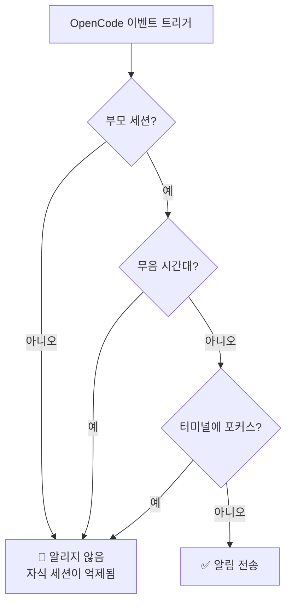
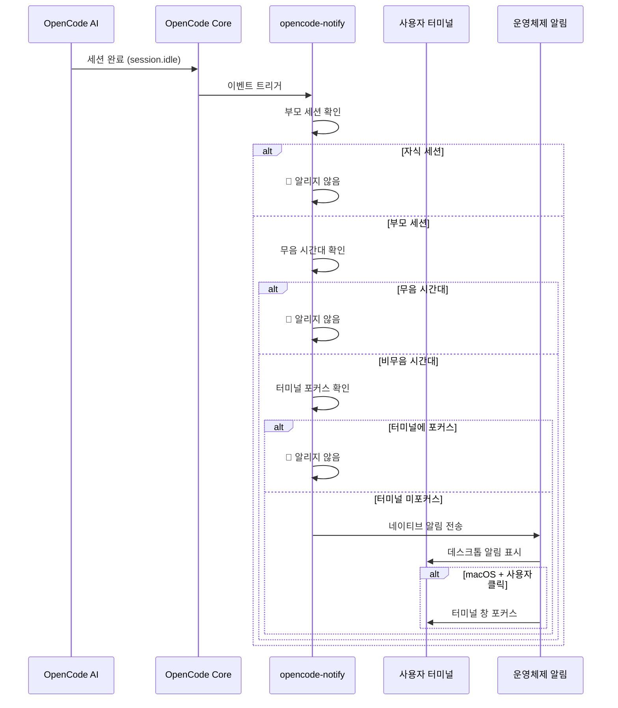

# 작동 원리: 알림, 필터링, 그리고 트리거 메커니즘

## 배운 후 할 수 있는 것

- opencode-notify의 4가지 알림 유형과 각각의 트리거 타이밍 이해하기
- 스마트 필터링 메커니즘의 작동 원리 파악하기(왜 너무 많은 알림을 받지 않는지)
- 알림이 트리거되어 표시되는 전체 흐름 파악하기
- 설정을 통해 알림 동작을 조정하는 방법 알기

## 핵심 아이디어

::: tip 디자인 철학
opencode-notify는 하나의 핵심 원칙을 따릅니다: **"사용자가 알림이 필요할 때만 알리고, 작은 이벤트마다 알리지 않는다"**.
:::

이 플러그인의 작동 방식은 세 가지 핵심 단계로 분해할 수 있습니다:

1. **리스닝** - OpenCode에서 중요한 이벤트가 발생할 때까지 대기
2. **필터링** - 이 이벤트를 알려야 하는지 여부 결정
3. **전송** - 운영 체제의 네이티브 알림을 통해 알림

이 흐름을 이해하면 플러그인이 어떻게 적시에 알림을 제공하면서도 스팸처럼 자주 방해하지 않는지 알 수 있습니다.

## 4가지 알림 유형

opencode-notify은 4가지 OpenCode 이벤트를 리스닝하며, 각각은 명확한 트리거 시나리오를 가지고 있습니다:

### 1. 작업 완료 알림 (session.idle)

**트리거 타이밍**: AI 세션이 유휴 상태가 될 때(작업 완료)

| 항목 | 설명 |
| --- | --- |
| 알림 제목 | Ready for review |
| 알림 내용 | 세션 제목(최대 50자) |
| 기본 사운드 | Glass (macOS) |

**중요성**: 가장 일반적으로 사용되는 알림으로, AI가 작업을 완료했을 때 결과를 확인하러 갈 수 있음을 알려줍니다.

### 2. 오류 알림 (session.error)

**트리거 타이밍**: AI 세션 실행 중 오류가 발생할 때

| 항목 | 설명 |
| --- | --- |
| 알림 제목 | Something went wrong |
| 알림 내용 | 오류 요약(최대 100자) |
| 기본 사운드 | Basso (macOS) |

**중요성**: 오류는 즉시 처리되어야 하며, 그렇지 않으면 후속 작업이 정상적으로 진행되지 않을 수 있습니다.

### 3. 권한 요청 알림 (permission.updated)

**트리거 타이밍**: AI가 특정 작업 수행을 위해 사용자 권한이 필요할 때(예: 파일 읽기, 네트워크 액세스)

| 항목 | 설명 |
| --- | --- |
| 알림 제목 | Waiting for you |
| 알림 내용 | OpenCode needs your input |
| 기본 사운드 | Submarine (macOS) |

**중요성**: AI가 차단되어 수동 권한 부여를 기다리고 있으므로, 처리하지 않으면 작업이 멈추게 됩니다.

### 4. 질문 알림 (tool.execute.before)

**트리거 타이밍**: AI가 `question` 도구를 사용하여 질문할 때

| 항목 | 설명 |
| --- | --- |
| 알림 제목 | Question for you |
| 알림 내용 | OpenCode needs your input |
| 기본 사운드 | Submarine (macOS) |

**중요성**: AI가 더 많은 정보가 필요하여, 예를 들어 특정 결정을 확인하거나 요구사항을 명확히 하려고 합니다.

::: info 4가지 알림의 우선순위
권한 요청과 질문 알림이 가장 높은 우선순위를 가지는데, AI는 이러한 이벤트에서 완전히 차단됩니다; 오류 알림은 그 다음으로 작업이 이미 실패했기 때문입니다; 작업 완료 알림은 편의에 따라 나중에 확인할 수 있으므로 상대적으로 낮은 우선순위를 가집니다.
:::

## 스마트 필터링 메커니즘

이것이 opencode-notify의 가장 큰 강점입니다 — 여러 계층의 필터링을 통해 진정으로 주의가 필요한 알림만 받을 수 있습니다.

### 필터링 계층 개요



### 레벨 1: 부모 세션 확인

**규칙**: 기본적으로 부모 세션(루트 세션)에만 알림을 보내고 자식 세션에는 보내지 않습니다.

**원리**: OpenCode의 작업은 중첩될 수 있습니다. 예를 들어 AI에게 "코드베이스 최적화"를 요청하면 여러 하위 작업으로 분할될 수 있습니다:
- 부모 세션: "전체 코드베이스 최적화"
- 자식 세션 1: "src/components 디렉터리 최적화"
- 자식 세션 2: "src/utils 디렉터리 최적화"

모든 자식 세션이 알림을 보내면 알림이 쇄도할 것입니다. opencode-notify는 부모 세션이 완료될 때만 한 번 알립니다.

::: tip 언제 자식 세션 알림이 필요한가?
단일 AI의 여러 동시 작업을 모니터링하는 경우 설정에서 `notifyChildSessions: true`를 설정하여 자식 세션 알림을 활성화할 수 있습니다.
:::

**특별 예외**:
- **권한 요청 알림**: 항상 알림, 부모 세션 확인 없음(권한 문제는 처리해야 함)
- **질문 알림**: 항상 알림, 부모 세션 확인 없음

### 레벨 2: 무음 시간대 확인

**규칙**: 구성된 무음 시간대 내에서는 알림을 보내지 않습니다.

**원리**: 야간이나 휴식 시간에 방해받지 않도록 합니다. 구성 예시:

```json
{
  "quietHours": {
    "enabled": true,
    "start": "22:00",
    "end": "08:00"
  }
}
```

**자정 넘어 지원**: 무음 시간대는 자정을 넘을 수 있습니다. 예를 들어 `22:00 - 08:00`은 밤 10시부터 다음 날 아침 8시까지로 올바르게 인식됩니다.

::: info 무음 시간대 확인 우선순위
무음 시간대의 우선순위는 다른 모든 확인보다 높습니다. 무음 시간대 내에서라면 터미널이 초점에 없거나 부모 세션 등의 조건을 우회할 수 없습니다.
:::

### 레벨 3: 터미널 포커스 감지

**규칙**: 터미널 창이 현재 활성 창일 때 알림을 보내지 않습니다.

**원리**: 터미널을 보고 있을 때 AI가 작업을 완료하면 화면에 바로 표시되므로 추가 알림이 필요 없습니다.

**플랫폼 지원**:
- ✅ **macOS**: 완전 지원, `osascript`를 통해 전경 앱 감지
- ❌ **Windows**: 지원하지 않음
- ❌ **Linux**: 지원하지 않음

**감지 메커니즘** (macOS):
1. `detect-terminal` 라이브러리를 사용하여 터미널 식별(37개 이상의 터미널 에뮬레이터 지원)
2. macOS에 현재 전경 앱 쿼리
3. 터미널 프로세스 이름과 일치하는지 비교
4. 일치하면 알림 억제

**특별 예외**:
- **질문 알림**: 포커스 확인 없음(tmux 워크플로우 지원)

::: tip tmux 워크플로우 지원
여러 창을 사용하는 tmux에서 작업하는 경우, 질문 알림은 포커스 감지로 인해 억제되지 않으므로 다른 창에서 작업할 때도 알림을 받을 수 있습니다.
:::

### macOS 특수 기능: 알림 클릭 시 터미널 포커스

macOS에서는 알림에 추가 기능이 있습니다: **알림을 클릭하면 터미널 창이 자동으로 최상위로 이동**합니다.

**원리**:
1. 플러그인이 `osascript`를 통해 터미널 Bundle ID 가져오기(예: `com.ghostty.Ghostty`)
2. 알림 전송 시 해당 Bundle ID로 `activate` 옵션 설정
3. 알림 클릭 시 시스템이 자동으로 해당 앱에 포커스

**지원 터미널**: Ghostty, Kitty, iTerm2, WezTerm, Alacritty, macOS Terminal, Hyper, Warp, VS Code 통합 터미널 등.

::: info 자동 터미널 감지
플러그인이 자동으로 사용 중인 터미널을 감지하므로 수동 구성이 필요 없습니다. 자동 감지에 실패한 경우 설정 파일에서 `terminal` 필드를 수동으로 지정할 수 있습니다.
:::

## 알림 트리거 흐름

### 전체 흐름도



### 이벤트 처리 우선순위

여러 이벤트가 동시에 트리거될 때, 플러그인은 다음 우선순위에 따라 처리합니다:

1. **최고 우선순위**: 권한 요청 (`permission.updated`) - AI가 차단되어 반드시 처리 필요
2. **차선 우선순위**: 오류 알림 (`session.error`) - 작업이 이미 실패했으므로 주의 필요
3. **낮은 우선순위**: 작업 완료 (`session.idle`) - 나중에 확인 가능
4. **특수**: 질문 (`tool.execute.before`) - 실제 요구사항에 따라 우선순위 결정

::: tip 일괄 알림 처리
여러 작업이 동시에 완료되면 플러그인은 개별 알림을 별도로 보내지 않고 하나의 알림만 보냅니다(부모 세션 확인 기반). 이렇게 하면 알림 폭탄을 방지할 수 있습니다.
:::

## 설정 영향

설정 파일을 통해 필터링 메커니즘의 각 계층을 조정할 수 있습니다:

| 설정 항목 | 영향 계층 | 기본값 | 설명 |
| --- | --- | --- | ---|
| `notifyChildSessions` | 부모 세션 확인 | `false` | `true`로 설정하면 자식 세션 알림 활성화 |
| `quietHours.enabled` | 무음 시간대 확인 | `false` | `true`로 설정하면 무음 시간대 활성화 |
| `quietHours.start` | 무음 시간대 확인 | `"22:00"` | 무음 시작 시간 |
| `quietHours.end` | 무음 시간대 확인 | `"08:00"` | 무음 종료 시간 |
| `terminal` | 터미널 감지 | 미설정 | 터미널 유형 수동 지정(자동 감지 덮어쓰기) |

::: details 설정 예시

```json
{
  "enabled": true,
  "notifyChildSessions": false,
  "sounds": {
    "idle": "Glass",
    "error": "Basso",
    "permission": "Submarine"
  },
  "quietHours": {
    "enabled": true,
    "start": "22:00",
    "end": "08:00"
  },
  "terminal": "ghostty"
}
```

:::

## 강의 요약

opencode-notify의 작동 원리는 다음과 같이 요약할 수 있습니다:

1. **4가지 알림 유형**: 작업 완료, 오류, 권한 요청, 질문
2. **3단계 스마트 필터링**: 부모 세션 확인 → 무음 시간대 확인 → 터미널 포커스 확인
3. **플랫폼 차이**: macOS는 포커스 감지 및 클릭 포커스 지원, Windows/Linux는 기본 알림만 지원
4. **유연한 설정**: JSON 설정 파일을 통해 필터링 계층 및 동작 조정

이 디자인은 알림의 적시성과 낮은 방해성을 보장합니다 — 진정으로 필요할 때만 알리며, 또 다른 자주 확인해야 하는 알림 센터가 되지 않습니다.

## 다음 강의 예고

> 다음 강의에서는 **[macOS 플랫폼 특성](../../platforms/macos/)**를 배웁니다.
>
> 배울 내용:
> - macOS만의 포커스 감지 메커니즘
> - 클릭 포커스 기능 구성 방법
> - 커스텀 사운드의 전체 목록
> - macOS 네이티브 시스템과의 통합 세부 정보

---

## 부록: 소스코드 참조

<details>
<summary><strong>소스코드 위치 확인하기</strong></summary>

> 업데이트 날짜: 2026-01-27

| 기능 | 파일 경로 | 라인 번호 |
| --- | --- | ---|
| 플러그인 메인 진입점 | [`src/notify.ts`](https://github.com/kdcokenny/opencode-notify/blob/main/src/notify.ts#L357-L406) | 357-406 |
| 설정 로드 | [`src/notify.ts`](https://github.com/kdcokenny/opencode-notify/blob/main/src/notify.ts#L90-L114) | 90-114 |
| 기본 설정 | [`src/notify.ts`](https://github.com/kdcokenny/opencode-notify/blob/main/src/notify.ts#L56-L68) | 56-68 |
| 터미널 감지 | [`src/notify.ts`](https://github.com/kdcokenny/opencode-notify/blob/main/src/notify.ts#L145-L164) | 145-164 |
| 터미널 포커스 감지 | [`src/notify.ts`](https://github.com/kdcokenny/opencode-notify/blob/main/src/notify.ts#L166-L175) | 166-175 |
| 무음 시간대 확인 | [`src/notify.ts`](https://github.com/kdcokenny/opencode-notify/blob/main/src/notify.ts#L181-L199) | 181-199 |
| 부모 세션 감지 | [`src/notify.ts`](https://github.com/kdcokenny/opencode-notify/blob/main/src/notify.ts#L205-L214) | 205-214 |
| 작업 완료 처리 | [`src/notify.ts`](https://github.com/kdcokenny/opencode-notify/blob/main/src/notify.ts#L249-L284) | 249-284 |
| 오류 알림 처리 | [`src/notify.ts`](https://github.com/kdcokenny/opencode-notify/blob/main/src/notify.ts#L286-L313) | 286-313 |
| 권한 요청 처리 | [`src/notify.ts`](https://github.com/kdcokenny/opencode-notify/blob/main/src/notify.ts#L315-L334) | 315-334 |
| 질문 알림 처리 | [`src/notify.ts`](https://github.com/kdcokenny/opencode-notify/blob/main/src/notify.ts#L336-L351) | 336-351 |
| 알림 전송 | [`src/notify.ts`](https://github.com/kdcokenny/opencode-notify/blob/main/src/notify.ts#L227-L243) | 227-243 |
| macOS 포그라운드 앱 감지 | [`src/notify.ts`](https://github.com/kdcokenny/opencode-notify/blob/main/src/notify.ts#L139-L143) | 139-143 |
| Bundle ID 가져오기 | [`src/notify.ts`](https://github.com/kdcokenny/opencode-notify/blob/main/src/notify.ts#L135-L137) | 135-137 |
| 터미널 프로세스 이름 매핑 | [`src/notify.ts`](https://github.com/kdcokenny/opencode-notify/blob/main/src/notify.ts#L71-L84) | 71-84 |

**핵심 상수**:

- `DEFAULT_CONFIG`: 기본 설정(56-68행)
  - `notifyChildSessions: false`: 기본적으로 자식 세션에 알리지 않음
  - `sounds.idle: "Glass"`: 작업 완료 사운드
  - `sounds.error: "Basso"`: 오류 사운드
  - `sounds.permission: "Submarine"`: 권한 요청 사운드
  - `quietHours.start: "22:00"`, `quietHours.end: "08:00"`: 기본 무음 시간대

- `TERMINAL_PROCESS_NAMES`: 터미널 이름에서 macOS 프로세스 이름으로의 매핑(71-84행)

**핵심 함수**:

- `loadConfig()`: 설정 파일을 로드하여 기본 설정과 병합
- `detectTerminalInfo()`: 터미널 정보 감지(이름, Bundle ID, 프로세스 이름)
- `isTerminalFocused()`: 터미널이 현재 포그라운드 앱인지 확인(macOS)
- `isQuietHours()`: 현재 시간이 무음 시간대 내인지 확인
- `isParentSession()`: 세션이 부모 세션인지 확인
- `sendNotification()`: 네이티브 알림 전송, macOS 클릭 포커스 지원
- `handleSessionIdle()`: 작업 완료 이벤트 처리
- `handleSessionError()`: 오류 이벤트 처리
- `handlePermissionUpdated()`: 권한 요청 이벤트 처리
- `handleQuestionAsked()`: 질문 이벤트 처리

**비즈니스 규칙**:

- BR-1-1: 기본적으로 부모 세션에만 알리고 자식 세션에는 알리지 않음(`notify.ts:256-259`)
- BR-1-2: 터미널에 포커스가 있을 때 알림 억제(`notify.ts:265`)
- BR-1-3: 무음 시간대에는 알림 전송 안 함(`notify.ts:262`)
- BR-1-4: 권한 요청은 항상 알리며 부모 세션 확인 불필요(`notify.ts:319`)
- BR-1-5: 질문은 포커스 확인 없음, tmux 워크플로우 지원(`notify.ts:340`)
- BR-1-6: macOS는 알림 클릭 시 터미널 포커스 지원(`notify.ts:238-240`)

</details>
