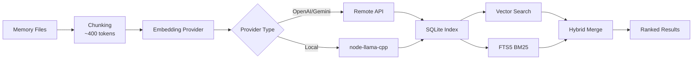

# 메모리 시스템 및 벡터 검색 완전 가이드

## 학습 후 달성 목표

이 과정을 마치면 다음을 수행할 수 있습니다:

- Clawdbot 메모리 시스템의 파일 구조 및 인덱싱 메커니즘 이해
- 벡터 검색 제공자 구성 (OpenAI, Gemini, 로컬)
- 하이브리드 검색 (BM25 + 벡터)을 사용하여 검색 정확도 향상
- CLI를 통한 메모리 인덱스 및 검색 관리
- Embedding 캐싱 및 인덱스 성능 조정

## 현재 어려움

다음과 같은 상황에 직면하고 있을 수 있습니다:

- AI가 새 세션에서 이전 대화 내용을 "잊어버리는" 문제
- AI에 지속적인 지식과 선호도를 기억하게 하고 싶음
- AI가 "학습"하고 중요한 정보를 기억하는 방법이 불확실
- 과거 대화를 검색할 때 관련 컨텍스트를 찾지 못함

## 언제 사용하나요

**메모리 시스템**은 다음 시나리오에 적합합니다:

| 시나리오 | 예시 | 저장 위치 |
|--- | --- | ---|
| 지속적인 지식 | "채식주의자다, 이걸 기억해줘" | MEMORY.md |
| 일일 메모 | "오늘의 작업 진도 및 할 일" | memory/YYYY-MM-DD.md |
| 세션 검색 | "이전에 논의한 API 엔드포인트는?" | 벡터 인덱스 |
| 구성 정보 | "Gateway는 포트 18789에서 실행 중" | MEMORY.md |

---

## 핵심 개념

### 메모리 시스템의 2계층 구조

Clawdbot은 장기 메모리를 관리하기 위해 **2계층 데이터**를 사용합니다:

| 계층 | 파일 경로 | 용도 | 로드 타이밍 |
|--- | --- | --- | ---|
| **장기 메모리** | `MEMORY.md` | 선별된 지식, 선호도, 중요한 사실 | 메인 세션 시작 시 로드 |
| **매일 로그** | `memory/YYYY-MM-DD.md` | 일일 메모, 실행 컨텍스트 | 오늘 + 어제의 것을 로드 |

::: info 왜 2계층인가요?
`MEMORY.md`는 "지식베이스"와 유사하며 메인 세션에만 로드되어 민감한 정보가 그룹 대화로 누출되지 않도록 합니다. `memory/*.md`는 "일기장"으로 일상적인 기록을 저장하여 나중에 쉽게 되돌아볼 수 있습니다.
:::

### 벡터 인덱싱의 워크플로우



### 하이브리드 검색: BM25 + 벡터

벡터 검색은 "의미 매칭"에 강하지만 "정확한 매칭"에는 약합니다:

| 쿼리 유형 | 벡터 검색 | BM25 전체 텍스트 | 하이브리드 검색 |
|--- | --- | --- | ---|
| "서버 IP 주소" | ❌ 약함 | ✅ 강함 | ✅ 최적 |
| "Gateway 배포 방법" | ✅ 강함 | ⚠️ 중간 | ✅ 최적 |
| "API 엔드포인트 a828e60" | ❌ 약함 | ✅ 강함 | ✅ 최적 |

**결합 공식**:
```javascript
finalScore = vectorWeight × vectorScore + textWeight × textScore
```

- `vectorWeight + textWeight`는 자동으로 1.0으로 정규화됩니다
- 기본값: 70% 벡터 + 30% 키워드
- `agents.defaults.memorySearch.query.hybrid.*`로 조정 가능

---

## 🎒 시작 전 준비

시작하기 전에 다음을 확인하세요:

::: warning 사전 확인
- [ ] Gateway가 실행 중입니다 ( [Gateway 시작](../../start/gateway-startup/) )
- [ ] AI 모델이 구성되었습니다 ( [AI 모델 구성](../models-auth/) )
- [ ] 기본 Markdown 파일 편집 방법을 알고 있습니다
:::

::: tip 권장 설정
- OpenAI 또는 Gemini embeddings를 우선 사용 (빠르고 고품질)
- 로컬 embeddings는 `pnpm rebuild node-llama-cpp` 필요
- 초기 인덱싱에는 몇 분이 소요될 수 있지만 이후 증분 업데이트는 빠릅니다
:::

---

## 따라하기

### 1단계: 메모리 파일 만들기

**이유**: AI는 기존 파일만 인덱싱하므로 먼저 메모리 콘텐츠를 만듭니다

Agent 작업 디렉터리 (기본 `~/clawd`)에 파일을 만듭니다:

```bash
# 장기 메모리 파일 만들기
cat > ~/clawd/MEMORY.md << 'EOF'
# 개인 선호도

- 식사 선호: 채식주의자, 매운 음식 안 먹음
- 근무 시간: 오전 9시부터 오후 6시까지
- 자주 사용하는 명령어: `clawdbot gateway status`

# 중요 구성

- Gateway 포트: 18789
- 데이터베이스: PostgreSQL 15
EOF

# 오늘의 로그 만들기
cat > ~/clawd/memory/$(date +%Y-%m-%d).md << 'EOF'
# 오늘의 작업 진도

- Gateway 구성 완료
- 메모리 시스템 학습
- 할 일: 모델 인증 문서 읽기
EOF
```

**예상되는 출력**:

```bash
# 파일 구조 확인
tree ~/clawd/
# 또는
ls -la ~/clawd/
ls -la ~/clawd/memory/

# 출력 예시
~/clawd/
├── MEMORY.md
└── memory/
    └── 2026-01-27.md
```

### 2단계: 메모리 시스템 상태 확인

**이유**: Embedding 제공자 및 인덱스 상태 확인

```bash
# 기본 상태 확인
clawdbot memory status

# 깊이 있는 확인 (프로바이더 사용 가능성 탐지)
clawdbot memory status --deep

# 깊이 있는 확인 + 강제 재인덱싱
clawdbot memory status --deep --index
```

**예상되는 출력**:

```bash
✓ Memory Search enabled
  Store: ~/.clawdbot/memory/main.sqlite
  Provider: openai
  Model: text-embedding-3-small
  Fallback: openai
  Hybrid: enabled (vectorWeight: 0.7, textWeight: 0.3)
  Cache: enabled (maxEntries: 50000)
  Sources: memory
  Indexed: 2 files, 5 chunks
```

::: tip 깊이 있는 확인
- `--deep`는 OpenAI/Gemini/Local embeddings 사용 가능 여부를 탐지합니다
- `--index`는 "더티" 인덱스를 감지하면 자동으로 재인덱싱합니다
- 첫 실행 시 인덱싱에 몇 분이 소요될 수 있습니다
:::

### 3단계: 인덱스 수동 트리거

**이유**: 새로 만든 메모리 파일이 인덱싱되는지 확인

```bash
# 인덱스 수동 트리거
clawdbot memory index

# 상세 로그 포함
clawdbot memory index --verbose

# 특정 에이전트만
clawdbot memory index --agent main
```

**예상되는 출력**:

```bash
Indexing memory for agent: main
  Provider: openai (text-embedding-3-small)
  Sources: memory
  - MEMORY.md (2 chunks)
  - memory/2026-01-27.md (3 chunks)
✓ Indexed 2 files, 5 chunks
```

### 4단계: 시맨틱 검색 테스트

**이유**: 벡터 검색 및 하이브리드 검색이 정상 작동하는지 확인

```bash
# 기본 검색
clawdbot memory search "채식주의자"

# 정확한 일치 검색 (BM25 테스트)
clawdbot memory search "Gateway 포트"

# 모호한 의미 검색 (벡터 테스트)
clawdbot memory search "무엇을 좋아하는지"

# 상세한 결과 보기
clawdbot memory search "Gateway" --verbose
```

**예상되는 출력**:

```bash
Searching memory for: "채식주의자"

Results (2):

[1] MEMORY.md:3-5 (score: 0.842)
  - 식사 선호: 채식주의자, 매운 음식 안 먹음

[2] memory/2026-01-27.md:1-3 (score: 0.615)
  - Gateway 구성 완료
  - 메모리 시스템 학습
```

### 5단계: Embedding 제공자 구성

**이유**: 요구사항에 따라 가장 적합한 제공자 선택 (원격 vs 로컬)

#### 옵션 A: OpenAI embeddings (권장)

구성 파일 `~/.clawdbot/clawdbot.json`을 편집:

```json
{
  "agents": {
    "defaults": {
      "memorySearch": {
        "enabled": true,
        "provider": "openai",
        "model": "text-embedding-3-small",
        "fallback": "openai",
        "remote": {
          "apiKey": "YOUR_OPENAI_API_KEY",
          "batch": {
            "enabled": true,
            "concurrency": 2
          }
        }
      }
    }
  }
}
```

**장점**:
- 빠르고 고품질
- 배치 인덱싱 지원 (저렴함)
- 대규모 백필에 적합

#### 옵션 B: Gemini embeddings

```json
{
  "agents": {
    "defaults": {
      "memorySearch": {
        "provider": "gemini",
        "model": "gemini-embedding-001",
        "remote": {
          "apiKey": "YOUR_GEMINI_API_KEY"
        },
        "fallback": "openai"
      }
    }
  }
}
```

#### 옵션 C: 로컬 embeddings (프라이버시 우선)

```json
{
  "agents": {
    "defaults": {
      "memorySearch": {
        "provider": "local",
        "local": {
          "modelPath": "hf:ggml-org/embeddinggemma-300M-GGUF/embeddinggemma-300M-Q8_0.gguf",
          "modelCacheDir": "~/.cache/embeddings"
        },
        "fallback": "none"
      }
    }
  }
}
```

**주의사항**:

```bash
# 첫 로컬 embeddings 사용 시 빌드 필요
pnpm approve-builds
# node-llama-cpp 선택
pnpm rebuild node-llama-cpp
```

**예상되는 출력**:

```bash
✓ node-llama-cpp installed
✓ Local embedding model ready
```

::: warning 로컬 embeddings
- 첫 실행 시 모델 자동 다운로드 (~600MB)
- node-llama-cpp 컴파일 필요 (시스템 환경 의존)
- 원격보다 느리지만 완전히 오프라인이며 프라이버시 우선
:::

### 6단계: 하이브리드 검색 가중치 구성

**이유**: 사용 사례에 따라 의미와 키워드 가중치 비율 조정

구성 편집:

```json
{
  "agents": {
    "defaults": {
      "memorySearch": {
        "query": {
          "hybrid": {
            "enabled": true,
            "vectorWeight": 0.7,
            "textWeight": 0.3,
            "candidateMultiplier": 4
          }
        }
      }
    }
  }
}
```

**매개변수 설명**:

| 매개변수 | 기본값 | 설명 | 조정 제안 |
|--- | --- | --- | ---|
| `vectorWeight` | 0.7 | 의미 검색 가중치 | "자연어" 쿼리에는 0.8로 상향 |
| `textWeight` | 0.3 | 키워드 검색 가중치 | "코드/ID" 쿼리에는 0.5로 상향 |
| `candidateMultiplier` | 4 | 후보 배수 | 재현율 향상을 위해 6으로 증가 |

**효과 비교**:

```bash
# 의미 쿼리 테스트
clawdbot memory search "Gateway 배포 방법"
# vectorWeight: 0.7 → 의미와 관련된 결과 찾기
# textWeight: 0.5 → "배포", "Gateway" 키워드 찾기

# 정확한 쿼리 테스트
clawdbot memory search "API 엔드포인트 a828e60"
# vectorWeight: 0.3 → 의미 무시, 우선 매칭
# textWeight: 0.7 → "a828e60" 정확히 매칭
```

### 7단계: SQLite-vec 가속 활성화

**이유**: 벡터 쿼리를 SQLite로 푸시다운하여 모든 embeddings 로드 방지

구성 편집:

```json
{
  "agents": {
    "defaults": {
      "memorySearch": {
        "store": {
          "vector": {
            "enabled": true,
            "extensionPath": "/path/to/sqlite-vec"
          }
        }
      }
    }
  }
}
```

**sqlite-vec 사용 가능 여부 확인**:

```bash
# 인덱스 상태 확인
clawdbot memory status --deep

# 사용 가능한 경우 다음과 같이 표시됩니다
✓ SQLite-vec extension loaded
  Vector table: chunks_vec
```

::: info SQLite-vec
- 기본적으로 자동 로드를 시도합니다
- 로드 실패 시 자동으로 JS 계산으로 폴백 (기능에 영향 없음)
- 사용자 정의 경로는 특별 빌드 또는 비표준 설치에만 사용됩니다
:::

---

## 체크포인트 ✅

위 단계를 완료한 후 다음을 확인하세요:

| 확인 항목 | 검증 방법 | 예상 결과 |
|--- | --- | ---|
| 메모리 파일 존재 | `ls ~/clawd/` | MEMORY.md 및 memory/ 디렉터리 존재 |
| 인덱스 생성됨 | `clawdbot memory status` | Indexed > 0 chunks 표시 |
| 검색 정상 | `clawdbot memory search "..."` | 관련 결과 반환 |
| Provider 정상 | `clawdbot memory status --deep` | Provider 유형 표시 |

---

## 문제 해결

### 문제 1: Embedding 제공자 실패

**현상**:

```bash
✗ Memory Search disabled
  Error: No API key found for provider
```

**해결**:

```bash
# 구성 확인
cat ~/.clawdbot/clawdbot.json | grep -A 5 "memorySearch"

# apiKey 존재 확인
# 또는 환경 변수 설정
export OPENAI_API_KEY="sk-..."
export GEMINI_API_KEY="..."
```

### 문제 2: 로컬 embeddings를 로드할 수 없음

**현상**:

```bash
✗ Local embedding provider failed
  Error: Cannot find module 'node-llama-cpp'
```

**해결**:

```bash
# 빌드 승인
pnpm approve-builds

# 재빌드
pnpm rebuild node-llama-cpp
```

### 문제 3: 인덱스가 업데이트되지 않음

**현상**:

```bash
# MEMORY.md를 수정함
# 하지만 검색 결과는 여전히 이전 것
```

**해결**:

```bash
# 방법 1: 인덱스 수동 트리거
clawdbot memory index

# 방법 2: Gateway 재시작 (onSessionStart 인덱싱 트리거)
clawdbot gateway restart

# 방법 3: 파일 감시 확인
clawdbot memory status --verbose
# "Watch: true" 확인
```

### 문제 4: 검색 결과가 관련 없음

**현상**: "Gateway"를 검색했는데 "작업 진도"가 반환됨

**가능한 원인**:

1. **하이브리드 가중치가 부적절**:
   - 의미 쿼리 ("배포 방법") → `vectorWeight` 상향
   - 키워드 쿼리 ("API 엔드포인트") → `textWeight` 상향

2. **인덱스가 완전히 업데이트되지 않음**:
   ```bash
   # 강제 재인덱싱
   rm ~/.clawdbot/memory/main.sqlite
   clawdbot memory index
   ```

3. **청크 단위 문제**:
   - 기본 400 토큰, 컨텍스트가 잘릴 수 있음
   - `agents.defaults.memorySearch.chunking.tokens` 조정

---

## 레슨 요약

이 레슨에서 다음을 학습했습니다:

1. **메모리 시스템 아키텍처**
   - 2계층 데이터 구조 (MEMORY.md + memory/*.md)
   - 벡터 인덱스 + FTS5 전체 텍스트 검색
   - 하이브리드 검색 (BM25 + 벡터)

2. **Embedding 제공자 구성**
   - OpenAI/Gemini/로컬 세 가지 옵션
   - 배치 인덱싱으로 가속화
   - 폴백 메커니즘

3. **CLI 도구 사용**
   - `clawdbot memory status` 상태 확인
   - `clawdbot memory index` 인덱스 트리거
   - `clawdbot memory search` 검색 테스트

4. **성능 최적화**
   - SQLite-vec 벡터 가속
   - Embedding 캐싱
   - 하이브리드 가중치 튜닝

---

## 다음 레슨 미리보기

> 다음 레슨에서는 **[보안 및 샌드박스 격리](../security-sandbox/)**를 학습합니다.
>
> 학습할 내용:
> - 도구 권한 제어 및 allowlist
> - 샌드박스 세션 격리
> - Exec 승인 메커니즘
> - Docker 배포
> - Tailscale 인증

---

## 부록: 소스 코드 참조

<details>
<summary><strong>클릭하여 소스 코드 위치 표시</strong></summary>

> 업데이트: 2026-01-27

| 기능 | 파일 경로 | 행 번호 |
|--- | --- | ---|
| 메모리 관리자 | [`src/memory/manager.ts`](https://github.com/moltbot/moltbot/blob/main/src/memory/manager.ts) | 1-200 |
| 하이브리드 검색 | [`src/memory/hybrid.ts`](https://github.com/moltbot/moltbot/blob/main/src/memory/hybrid.ts) | 1-112 |
| Embedding 제공자 | [`src/memory/embeddings.ts`](https://github.com/moltbot/moltbot/blob/main/src/memory/embeddings.ts) | 1-80 |
| OpenAI embeddings | [`src/memory/embeddings-openai.ts`](https://github.com/moltbot/moltbot/blob/main/src/memory/embeddings-openai.ts) | 전체 |
| Gemini embeddings | [`src/memory/embeddings-gemini.ts`](https://github.com/moltbot/moltbot/blob/main/src/memory/embeddings-gemini.ts) | 전체 |
| 로컬 embeddings | [`src/memory/node-llama.ts`](https://github.com/moltbot/moltbot/blob/main/src/memory/node-llama.ts) | 전체 |
| SQLite-vec | [`src/memory/sqlite-vec.ts`](https://github.com/moltbot/moltbot/blob/main/src/memory/sqlite-vec.ts) | 전체 |
| 배치 인덱싱 (OpenAI) | [`src/memory/batch-openai.ts`](https://github.com/moltbot/moltbot/blob/main/src/memory/batch-openai.ts) | 전체 |
| 배치 인덱싱 (Gemini) | [`src/memory/batch-gemini.ts`](https://github.com/moltbot/moltbot/blob/main/src/memory/batch-gemini.ts) | 전체 |
| 검색 관리자 | [`src/memory/manager-search.ts`](https://github.com/moltbot/moltbot/blob/main/src/memory/manager-search.ts) | 전체 |
| Memory Schema | [`src/memory/memory-schema.ts`](https://github.com/moltbot/moltbot/blob/main/src/memory/memory-schema.ts) | 전체 |

**중요한 구성**:
- `agents.defaults.memorySearch.enabled`: 메모리 검색 활성화/비활성화
- `agents.defaults.memorySearch.provider`: Embedding 제공자 ("openai", "gemini", "local")
- `agents.defaults.memorySearch.query.hybrid.vectorWeight`: 벡터 검색 가중치 (기본 0.7)
- `agents.defaults.memorySearch.query.hybrid.textWeight`: BM25 검색 가중치 (기본 0.3)
- `agents.defaults.memorySearch.cache.enabled`: Embedding 캐시 (기본 true)
- `agents.defaults.memorySearch.store.vector.enabled`: SQLite-vec 가속 (기본 true)

**중요한 함수**:
- `mergeHybridResults()`: 벡터 + BM25 결과 병합 (`src/memory/hybrid.ts:39-111`)
- `bm25RankToScore()`: BM25 랭킹을 점수로 변환 (`src/memory/hybrid.ts:34-37`)
- `createEmbeddingProvider()`: Embedding 제공자 생성 (`src/memory/embeddings.ts`)
- `getMemorySearchManager()`: 메모리 검색 관리자 가져오기 (`src/memory/search-manager.ts`)

**CLI 명령**:
- `clawdbot memory status`: 상태 확인 (`src/cli/commands/memory-cli.ts`)
- `clawdbot memory index`: 인덱스 트리거 (`src/cli/commands/memory-cli.ts`)
- `clawdbot memory search`: 메모리 검색 (`src/cli/commands/memory-cli.ts`)

</details>
