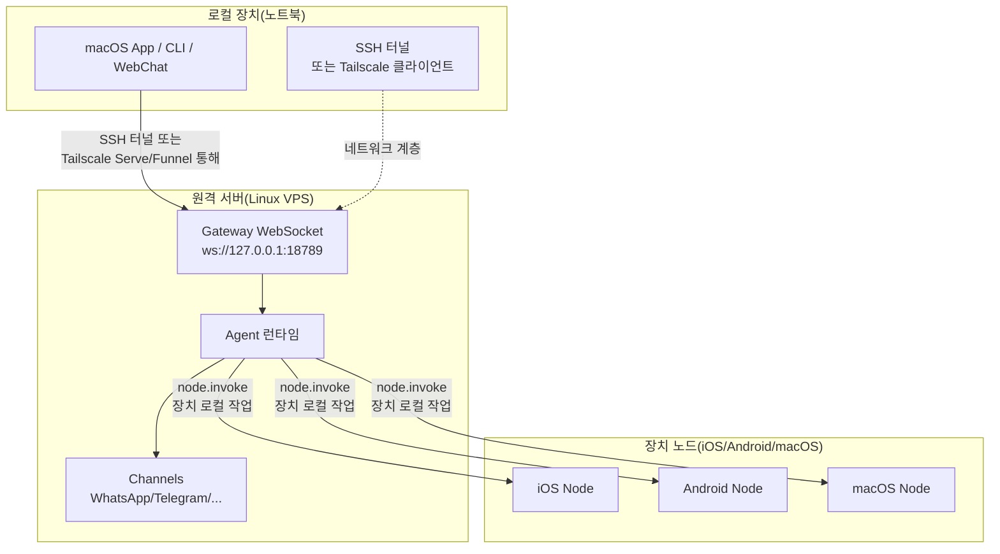

# 원격 Gateway: Tailscale 및 SSH 터널을 통한 Clawdbot 액세스 | Clawdbot 튜토리얼

## 이 과정을 완료하면 할 수 있는 것

**원격 Gateway**는 장치 제약에서 벗어나 AI 어시스턴트를 Always-on Linux 서버에 배포할 수 있게 해줍니다. 이 과정을 완료하면 다음을 수행할 수 있습니다:

- ✅ Linux 서버 또는 VPS에서 Clawdbot Gateway 실행
- ✅ Tailscale Serve/Funnel을 통해 안전하게 Gateway를 네트워크에 노출
- ✅ SSH 터널을 사용하여 클라이언트에서 원격 Gateway에 연결
- ✅ Gateway와 Node의 아키텍처 차이 이해(exec가 어디서 실행되고, 장치 작업이 어디서 실행되는지)
- ✅ 안전한 원격 액세스 정책 구성

## 현재 겪고 있는 문제

다음과 같은 문제가 있을 수 있습니다:

- 🤔 "노트북이 자주 절전 모드로 들어가지만, AI 어시스턴트를 항상 온라인 상태로 유지하고 싶어요"
- 🤔 "저렴한 VPS에서 Gateway를 실행하고 싶지만, 안전하게 액세스하는 방법을 모르겠어요"
- 🤔 "Tailscale Serve와 Funnel의 차이점은 무엇인가요? 어느 것을 사용해야 하나요?"
- 🤔 "SSH 터널이 너무 복잡한데, 더 자동화된 솔루션이 있나요?"

## 언제 이 방법을 사용해야 하나요

**원격 Gateway**는 다음 시나리오에 적합합니다:

| 시나리오 | 추천 솔루션 | 이유 |
|--- | --- | ---|
| 노트북이 자주 절전 모드로 들어가며 AI 상주가 필요한 경우 | **Tailscale Serve + Linux VPS** | VPS는 절전 모드로 들어가지 않으며, tailnet을 통해 안전하게 액세스 |
| 가정용 데스크톱에서 Gateway를 실행하고 노트북에서 원격 제어 | **SSH 터널** 또는 **Tailscale Serve** | Gateway 세션 및 구성 통합 |
| 공용 네트워크에서 액세스해야 하는 경우(임시 테스트) | **Tailscale Funnel + 비밀번호** | 빠른 노출, 비밀번호 보호 필요 |
| 여러 장치에서 하나의 AI 어시스턴트 공유 | **Always-on Gateway** | 모든 세션, 구성, 기록 중앙 관리 |

::: warning 권장하지 않는 시나리오
장치가 하나만 있고 자주 휴대하는 경우 **원격 Gateway가 필요하지 않습니다**. 로컬에서 직접 Gateway를 실행하면 됩니다.
:::

## 🎒 시작 전 준비

시작 전에 다음을 확인하세요:

- [ ] **[Gateway 시작](/ko/clawdbot/clawdbot/start/gateway-startup/)** 과정 완료
- [ ] 기본 SSH 명령 이해(SSH 터널 사용 시 선택 사항)
- [ ] (Tailscale 사용 시) Tailscale CLI가 설치되고 로그인되어 있음
- [ ] 원격 Linux 서버 또는 VPS 준비(Ubuntu/Debian 권장)

---

## 핵심 개념

### 원격 Gateway 아키텍처

원격 Gateway의 핵심 개념은 다음과 같습니다: **Gateway는 제어 센터이며, 클라이언트는 터미널입니다**.



### 세 가지 핵심 개념

| 개념 | 설명 | 예시 |
|--- | --- | ---|
| **Gateway 호스트** | Gateway 서비스를 실행하는 시스템, 세션, 인증, 채널, 상태 보유 | Linux VPS, 가정용 데스크톱 |
| **클라이언트** | Gateway에 연결하는 도구(macOS App, CLI, WebChat) | 노트북, 휴대폰 |
| **장치 노드** | Gateway WebSocket을 통해 연결된 외부 장치, 장치 로컬 작업 실행 | iOS 장치, Android 장치, macOS 노드 모드 |

### 명령은 어디에서 실행되나요?

가장 흔히 혼동되는 부분입니다:

| 작업 유형 | 실행 위치 | 이유 |
|--- | --- | ---|
| `exec` 도구 | **Gateway 호스트** | Shell 명령이 Gateway 시스템에서 실행됨 |
| `browser` 도구 | **Gateway 호스트**(또는 별도의 브라우저 제어 서버) | 브라우저가 Gateway 시스템에서 시작됨 |
| 노드 작업(`camera.snap`, `system.run`)| **장치 노드** | 장치 로컬 리소스 액세스 필요 |

**한 문장으로 기억하기**:
- Gateway 호스트 → 일반 명령 및 AI 실행
- 장치 노드 → 장치 특정 로컬 작업 실행

---

## 따라해보기

### 1단계: 원격 서버에 Clawdbot 설치

**이유**
Linux 서버는 장기간 온라인인 Gateway 서비스를 실행하기에 더 적합합니다.

원격 서버에서 다음을 실행하세요:

```bash
# 1. Node.js 설치 (≥22)
curl -fsSL https://deb.nodesource.com/setup_22.x | sudo -E bash -
sudo apt-get install -y nodejs

# 2. Clawdbot 설치
npm install -g @clawdbot/cli

# 3. 설치 확인
clawdbot --version
```

**다음이 표시되어야 합니다**:
```
clawdbot CLI v<version>
```

### 2단계: 온보딩 마법사 실행

**이유**
대화형 마법사를 통해 기본 설정을 빠르게 구성합니다.

```bash
clawdbot onboard
```

마법사를 따라 다음을 완료하세요:
- 채널 선택(예: Telegram)
- AI 모델 구성(예: OpenAI, Anthropic)
- Gateway 인증 설정(Token 또는 Password)

::: tip 권장
원격 연결 시 비밀번호 인증을 사용할 수 있도록 `gateway.auth.mode: "password"`를 구성하세요:
```bash
export CLAWDBOT_GATEWAY_PASSWORD="your-secure-password"
```
:::

**다음이 표시되어야 합니다**:
```
✅ Gateway configured successfully
✅ Channels configured: telegram
✅ AI model configured: openai:gpt-4o-mini
```

### 3단계: Gateway 데몬 시작

**이유**
Gateway는 백그라운드에서 지속적으로 실행되어야 합니다.

```bash
# Gateway 시작(기본적으로 loopback: 127.0.0.1:18789에 바인딩)
clawdbot gateway start
```

**다음이 표시되어야 합니다**:
```
🚀 Gateway starting...
📡 WebSocket: ws://127.0.0.1:18789
🔒 Auth mode: password
```

::: tip systemd를 사용한 자동 시작(Linux)
서비스 파일 `/etc/systemd/system/clawdbot.service` 생성:

```ini
[Unit]
Description=Clawdbot Gateway
After=network.target

[Service]
Type=simple
User=your-user
ExecStart=/usr/bin/clawdbot gateway start
Restart=on-failure
RestartSec=5s
Environment="CLAWDBOT_GATEWAY_PASSWORD=your-secure-password"

[Install]
WantedBy=multi-user.target
```

서비스 시작:
```bash
sudo systemctl enable clawdbot
sudo systemctl start clawdbot
sudo systemctl status clawdbot
```
:::

---

### 솔루션 A: Tailscale Serve 사용(권장)

#### 4단계: Tailscale 설치 및 로그인

**이유**
Tailscale Serve는 공용 IP 없이 안전한 HTTPS 액세스를 제공합니다.

```bash
# Tailscale CLI 설치
curl -fsSL https://tailscale.com/install.sh | sh

# Tailscale 로그인
sudo tailscale up
```

**다음이 표시되어야 합니다**:
```
To authenticate, visit:

    https://login.tailscale.com/a/xxxxx

----------------------------------------------------
Copy the URL and open it in your browser.
```

#### 5단계: Tailscale Serve 구성

**이유**
Tailscale Serve를 통해 Gateway를 tailnet에 노출하고 Gateway를 loopback-only로 유지(가장 안전).

구성 파일 `~/.clawdbot/clawdbot.json` 수정:

```json5
{
  "gateway": {
    "bind": "loopback",
    "tailscale": {
      "mode": "serve",
      "resetOnExit": true
    },
    "auth": {
      "mode": "password"
    }
  }
}
```

**구성 설명**:
- `bind: "loopback"`: Gateway는 로컬 루프백만 수신(가장 안전)
- `tailscale.mode: "serve"`: Tailscale Serve를 통해 tailnet에 노출
- `resetOnExit: true`: 종료 시 Serve 구성 취소

#### 6단계: Gateway 재시작

**이유**
새 Tailscale 구성을 적용합니다.

```bash
# systemd 사용 시
sudo systemctl restart clawdbot

# 또는 직접 재시작(포그라운드에서 실행 중인 경우)
clawdbot gateway restart
```

**다음이 표시되어야 합니다**:
```
🚀 Gateway starting...
📡 WebSocket: ws://127.0.0.1:18789
🌐 Tailscale Serve: https://your-tailnet-name.tailnet-name.ts.net/
🔒 Auth mode: password
```

#### 7단계: 클라이언트에서 연결

**이유**
원격 Gateway에 액세스할 수 있는지 확인합니다.

클라이언트 시스템에서:

1. **같은 Tailscale tailnet에 가입되어 있는지 확인**
2. **Control UI 액세스**:
    ```
    https://<magicdns>/  # 또는 https://<tailnet-ip>:18789/
    ```
3. **WebSocket 연결**:
    ```bash
    # 연결 확인
    clawdbot health --url ws://<tailnet-ip>:18789 --password your-secure-password
    ```

**다음이 표시되어야 합니다**:
```
✅ Gateway is healthy
✅ Authenticated successfully
✅ Channels: telegram (connected)
```

---

### 솔루션 B: SSH 터널 사용(일용 후백)

#### 4단계: SSH 키 인증 구성

**이유**
SSH 키 인증은 비밀번호보다 안전하며 연결을 자동화할 수 있습니다.

클라이언트 시스템에서 키 쌍 생성:

```bash
# 키 쌍 생성(아직 없는 경우)
ssh-keygen -t rsa -b 4096 -f ~/.ssh/clawdbot_gateway
```

**다음이 표시되어야 합니다**:
```
Generating public/private rsa key pair.
Enter passphrase (empty for no passphrase): [엔터 키 누름]
Enter same passphrase again: [엔터 키 누름]
Your identification has been saved in ~/.ssh/clawdbot_gateway
Your public key has been saved in ~/.ssh/clawdbot_gateway.pub
```

#### 5단계: 공개 키를 원격 서버로 복사

**이유**
원격 서버가 클라이언트 키를 신뢰하도록 합니다.

```bash
# 공개 키를 원격 서버로 복사
ssh-copy-id -i ~/.ssh/clawdbot_gateway.pub your-user@remote-server-ip
```

**다음이 표시되어야 합니다**:
```
Number of key(s) added: 1
Now try logging into the machine with:   "ssh 'your-user@remote-server-ip'"
```

#### 6단계: SSH 구성 생성

**이유**
SSH 연결 명령을 간소화하여 후속 사용에 편리하게 합니다.

클라이언트 시스템의 `~/.ssh/config` 편집:

```txt
Host clawdbot-remote
    HostName <remote-server-ip>
    User your-user
    IdentityFile ~/.ssh/clawdbot_gateway
    LocalForward 18789 127.0.0.1:18789
    ServerAliveInterval 60
    ServerAliveCountMax 3
```

**구성 설명**:
- `LocalForward 18789 127.0.0.1:18789`: 로컬 18789 포트를 원격의 18789로 포워드
- `ServerAliveInterval 60`: 60초마다 하트비트 전송, 연결 활성 유지

#### 7단계: SSH 터널 생성

**이유**
로컬에서 원격 Gateway로의 안전한 채널을 생성합니다.

```bash
# SSH 터널 시작(백그라운드 실행)
ssh -N -f clawdbot-remote
```

**다음이 표시되어야 합니다**:
(출력 없음, 명령이 백그라운드에서 실행)

#### 8단계: 연결 확인

**이유**
SSH 터널과 Gateway가 모두 정상 작동하는지 확인합니다.

```bash
# 로컬 포트 포워드 성공 여부 확인
lsof -i :18789

# Gateway 연결 테스트
clawdbot health --url ws://127.0.0.1:18789 --password your-secure-password
```

**다음이 표시되어야 합니다**:
```
COMMAND   PID   USER   FD   TYPE DEVICE SIZE/OFF NODE NAME
ssh      12345  user   4u  IPv4  0x1234      0t0 TCP *:18789 (LISTEN)

✅ Gateway is healthy
✅ Authenticated successfully
```

#### 9단계: SSH 터널 자동 시작(macOS)

**이유**
시스템 시작 시 자동으로 시작되어 수동 작업이 필요 없습니다.

`~/Library/LaunchAgents/com.clawdbot.ssh-tunnel.plist` 생성:

```xml
<?xml version="1.0" encoding="UTF-8"?>
<!DOCTYPE plist PUBLIC "-//Apple//DTD PLIST 1.0//EN" "http://www.apple.com/DTDs/PropertyList-1.0.dtd">
<plist version="1.0">
<dict>
    <key>Label</key>
    <string>com.clawdbot.ssh-tunnel</string>
    <key>ProgramArguments</key>
    <array>
        <string>/usr/bin/ssh</string>
        <string>-N</string>
        <string>-f</string>
        <string>clawdbot-remote</string>
    </array>
    <key>KeepAlive</key>
    <true/>
    <key>RunAtLoad</key>
    <true/>
</dict>
</plist>
```

Launch Agent 로드:

```bash
launchctl bootstrap gui/$UID ~/Library/LaunchAgents/com.clawdbot.ssh-tunnel.plist
```

**다음이 표시되어야 합니다**:
(출력 없음, 터널이 백그라운드에서 자동 실행)

::: tip Linux 자동 시작(systemd 사용자 서비스)
`~/.config/systemd/user/clawdbot-ssh-tunnel.service` 생성:

```ini
[Unit]
Description=Clawdbot SSH Tunnel
After=network.target

[Service]
Type=simple
ExecStart=/usr/bin/ssh -N clawdbot-remote
Restart=on-failure
RestartSec=5s

[Install]
WantedBy=default.target
```

서비스 시작:
```bash
systemctl --user enable clawdbot-ssh-tunnel
systemctl --user start clawdbot-ssh-tunnel
```
:::

---

### 솔루션 C: Tailscale Funnel 사용(공용 액세스, 비밀번호 필요)

::: danger 보안 경고
Tailscale Funnel은 Gateway를 공용 네트워크에 노출합니다!
- **반드시** 비밀번호 인증을 사용해야 합니다(`gateway.auth.mode: "password"`)
- **임시 테스트용으로만 권장**되며, 프로덕션 환경에는 적합하지 않습니다
:::

#### 4단계: Funnel 구성

**이유**
Tailscale Funnel을 통해 공용 HTTPS 액세스를 제공합니다.

구성 파일 `~/.clawdbot/clawdbot.json` 수정:

```json5
{
  "gateway": {
    "bind": "loopback",
    "tailscale": {
      "mode": "funnel",
      "resetOnExit": true
    },
    "auth": {
      "mode": "password",
      "password": "${CLAWDBOT_GATEWAY_PASSWORD}"
    }
  }
}
```

**중요**:
- `tailscale.mode: "funnel"`: Tailscale Funnel 사용(공용 액세스)
- `auth.mode: "password"`: Funnel은 비밀번호 필수(그렇지 않으면 시작 거부)

#### 5단계: Gateway 재시작

```bash
sudo systemctl restart clawdbot
```

**다음이 표시되어야 합니다**:
```
🚀 Gateway starting...
🌐 Tailscale Funnel: https://your-funnel-url.ts.net/
🔒 Auth mode: password
```

#### 6단계: 공용 네트워크에서 연결

```bash
clawdbot health --url wss://your-funnel-url.ts.net --password your-secure-password
```

---

## 체크포인트 ✅

위 솔루션 중 하나를 완료한 후 다음을 확인하세요:

| 확인 항목 | 명령 | 예상 결과 |
|--- | --- | ---|
| Gateway 실행 중 | `clawdbot gateway status` | ✅ Running |
| WebSocket 액세스 가능 | `clawdbot health --url <url>` | ✅ Healthy |
| Channels 연결됨 | `clawdbot channels status` | ✅ connected |
| 노드 페어링 가능 | `clawdbot nodes list` | 노드 목록 표시 |

---

## 주의 사항

### 함정 1: Gateway가 loopback이 아닌 곳에 바인딩됨

**문제**:
```json5
{
  "gateway": {
    "bind": "lan"  // ❌ 위험!
  }
}
```

**결과**:
- Gateway가 LAN 공용 IP에서 수신하며 누구나 연결할 수 있음
- 인증을 구성하지 않은 경우 **심각한 보안 위험**

**올바른 방법**:
```json5
{
  "gateway": {
    "bind": "loopback",  // ✅ 가장 안전
    "tailscale": {
      "mode": "serve"  // ✅ Tailscale Serve를 통해 노출
    }
  }
}
```

### 함정 2: Tailscale Funnel에 비밀번호 미설정

**문제**:
```json5
{
  "gateway": {
    "auth": {
      "mode": "token"  // ❌ Funnel에서 허용되지 않음!
    },
    "tailscale": {
      "mode": "funnel"
    }
  }
}
```

**결과**:
- Gateway 시작 거부(Funnel은 비밀번호 필수)

**올바른 방법**:
```json5
{
  "gateway": {
    "auth": {
      "mode": "password",  // ✅ Funnel은 반드시 비밀번호 사용
      "password": "${CLAWDBOT_GATEWAY_PASSWORD}"
    },
    "tailscale": {
      "mode": "funnel"
    }
  }
}
```

### 함정 3: SSH 터널 포트 충돌

**문제**:
```
channel_setup_fwd: listen 127.0.0.1:18789: cannot listen to port: Address already in use
```

**원인**: 로컬 18789 포트가 이미 사용 중

**해결**:
```bash
# 포트를 사용 중인 프로세스 찾기
lsof -i :18789

# 충돌하는 프로세스 종료
kill -9 <PID>

# 또는 다른 포트 포워드 사용(클라이언트 URL도 함께 수정 필요)
ssh -N -L 18790:127.0.0.1:18789 clawdbot-remote
```

### 함정 4: macOS App Remote over SSH 작동 안 함

**문제**: macOS App이 "Unable to connect to Gateway" 표시

**확인**:
1. SSH 터널 실행 중:
    ```bash
    ps aux | grep "ssh -N clawdbot-remote" | grep -v grep
    ```
2. Gateway Token 설정됨:
    ```bash
    launchctl getenv CLAWDBOT_GATEWAY_TOKEN
    ```
3. App 설정 올바름:
    - Settings → General → "Clawdbot runs" → "On a remote machine over SSH"

**해결**:
- SSH 터널 재시작
- macOS App 종료 후 재시작

---

## 과정 요약

### 핵심 요점

- ✅ **원격 Gateway**는 AI 어시스턴트를 항상 온라인 상태로 유지하며 클라이언트는 언제든 연결할 수 있음
- ✅ **Tailscale Serve**는 가장 안전한 솔루션(tailnet-only + HTTPS + loopback)
- ✅ **SSH 터널**은 일용 후백 솔루션(Tailscale 불필요)
- ✅ **Tailscale Funnel**은 임시 공용 액세스에 적합(비밀번호 필수)
- ✅ **Gateway 호스트**는 `exec` 및 일반 명령을 실행하고, **장치 노드**는 장치 로컬 작업을 실행

### 구성 비교

| 솔루션 | 보안성 | 액세스 범위 | 구성 복잡도 | 권장 시나리오 |
|--- | --- | --- | --- | ---|
| Tailscale Serve | ⭐⭐⭐⭐⭐ | Tailnet | 중 | **권장**: Always-on Gateway |
| SSH 터널 | ⭐⭐⭐⭐ | SSH 연결 가능 | 낮 | 일용 후백, 가정용 데스크톱 원격 제어 |
| Tailscale Funnel | ⭐⭐ | 공용 | 낮 | 임시 테스트, Demo |

### 보안 체크리스트

- [ ] Gateway가 `loopback`에 바인딩됨
- [ ] Tailscale Funnel은 비밀번호 인증 사용
- [ ] SSH 키 구성됨(SSH 터널 사용 시)
- [ ] 비밀번호가 환경 변수를 통해 설정됨(구성 파일에 직접 작성하지 않음)
- [ ] 정기적으로 `clawdbot security audit` 실행

---

## 다음 과정 예고

> 다음 과정에서는 **[스킬 플랫폼 및 ClawdHub](../skills-platform/)**에 대해 학습합니다.
>
> 다음을 학습하게 됩니다:
> - 스킬 시스템의 개념(Bundled/Managed/Workspace)
> - ClawdHub에서 타사 스킬을 설치하는 방법
> - 사용자 정의 스킬을 생성하고 관리하는 방법
> - 스킬의 권한 및 격리 메커니즘

---

## 부록: 소스 코드 참조

<details>
<summary><strong>클릭하여 소스 코드 위치 보기</strong></summary>

> 업데이트: 2026-01-27

| 기능 | 파일 경로 | 행 번호 |
|--- | --- | ---|
| Gateway 원격 구성 스키마 | [`src/config/types.gateway.ts`](https://github.com/clawdbot/clawdbot/blob/main/src/config/types.gateway.ts) | 200-220 |
| Gateway Tailscale 구성 스키마 | [`src/config/types.gateway.ts`](https://github.com/clawdbot/clawdbot/blob/main/src/config/types.gateway.ts) | 150-180 |
| Tailscale 통합 | [`src/infra/tailscale.ts`](https://github.com/clawdbot/clawdbot/blob/main/src/infra/tailscale.ts) | 1-100 |
| 원격 Gateway 문서 | [`docs/gateway/remote.md`](https://github.com/clawdbot/clawdbot/blob/main/docs/gateway/remote.md) | 1-123 |
| Tailscale 문서 | [`docs/gateway/tailscale.md`](https://github.com/clawdbot/clawdbot/blob/main/docs/gateway/tailscale.md) | 1-147 |
| macOS App 원격 액세스 문서 | [`docs/gateway/remote-gateway-readme.md`](https://github.com/clawdbot/clawdbot/blob/main/docs/gateway/remote-gateway-readme.md) | 1-154 |
| 보안 문서 | [`docs/gateway/security.md`](https://github.com/clawdbot/clawdbot/blob/main/docs/gateway/security.md) | 1-100 |

**핵심 구성 필드**:

- `gateway.bind`: Gateway 바인딩 주소(`loopback`/`lan`/`tailnet`/`auto`)
- `gateway.tailscale.mode`: Tailscale 모드(`off`/`serve`/`funnel`)
- `gateway.auth.mode`: 인증 모드(`token`/`password`)
- `gateway.auth.allowTailscale`: Tailscale identity 헤더 허용 여부(`true`/`false`)
- `gateway.remote.url`: 원격 Gateway URL(CLI 기본값)
- `gateway.remote.token`: 원격 Gateway Token(CLI 인증)
- `gateway.tailscale.resetOnExit`: 종료 시 Serve/Funnel 구성 취소(`true`/`false`)

**핵심 비즈니스 규칙**:

- Gateway는 기본적으로 loopback(`127.0.0.1`)에 바인딩됨【사실】
- Tailscale Serve는 tailnet-only HTTPS 액세스를 제공함【사실】
- Tailscale Funnel은 비밀번호 인증을 강제로 요구함(`gateway.auth.mode: "password"`)【사실】
- `gateway.remote.token`은 원격 CLI 호출에만 사용되며, 로컬 인증을 활성화하지 않음【사실】
- `gateway.bind: "tailnet"`은 Tailnet IP에 직접 바인딩(Serve/Funnel 불필요)【사실】

**보안 규칙**:

- Loopback + SSH/Tailscale Serve는 가장 안전한 기본 구성【사실】
- 비바인딩 구성(`lan`/`tailnet`/`custom`)은 인증 토큰 또는 비밀번호를 사용해야 함【사실】
- Tailscale Serve는 identity 헤더를 통해 인증할 수 있음(`gateway.auth.allowTailscale: true`)【사실】
- Funnel은 Tailscale identity 헤더를 주입하지 않음【사실】

</details>
