# 보안 및 샌드박스 격리: AI 어시스턴트 보호

## 학습 후 달성 목표

이 과정을 마치면 다음을 수행할 수 있습니다:

- 액세스 제어부터 도구 권한까지 다층 보안 정책 구성
- 샌드박스 격리로 AI 어시스턴트의 파일 시스템 및 네트워크 액세스 제한
- 보안 감사를 실행하여 일반적인 보안 취약점 발견 및 수정
- 다양한 시나리오(개인/가족/공개)에 따른 보안 레벨 조정

## 현재 어려움

Clawdbot은 AI 어시스턴트를 강력하게 만들지만, 새로운 보안 문제도 발생시킵니다:

- **Shell 액세스**: AI가 임의 명령을 실행하고 파일을 읽기/쓰기할 수 있음
- **네트워크 액세스**: AI가 임의 URL 및 서비스에 액세스할 수 있음
- **메시지 전송**: AI가 누구에게나 메시지를 전송할 수 있음(WhatsApp 구성 시)
- **원격 제어**: 브라우저 도구를 통해 로컬 브라우저 제어
- **데이터 노출**: 모든 대화 기록이 디스크에 저장됨

적절한 보호가 없으면 조작된 AI 모델로 인해 재앙적인 결과가 발생할 수 있습니다.

## 언제 사용하나요

- ✅ 자체 장치에서 AI 어시스턴트를 실행해야 하며 보안 위험을 우려하는 경우
- ✅ AI 어시스턴트를 여러 사용자(가족 구성원, 팀)에게 공유하려는 경우
- ✅ AI가 특정 파일 또는 디렉토리에만 액세스하도록 제한해야 하는 경우
- ✅ 다른 사용자/세션의 액세스 범위를 격리하려는 경우
- ✅ AI 어시스턴트를 제한된 환경(샌드박스)에서 실행해야 하는 경우

::: info
**중요 개념**: 보안은 계층적입니다. "누가 액세스할 수 있는지"에서 "무엇을 할 수 있는지"로, 마지막으로 "모델 보안"으로 이어집니다.
:::

## 🎒 시작 전 준비

### 사전 확인

- [x] [빠른 시작](../../start/getting-started/)을 완료하여 Gateway 시작 방법 이해
- [ ] 최소 하나의 AI 모델(Anthropic, OpenAI 또는 Ollama) 구성 완료
- [ ] 사용 시나리오 이해(개인 사용, 가족 공유, 공개 서비스)
- [ ] Linux 파일 권한 개념(chmod) 이해

### 추천 도구

- 명령줄 도구: Terminal 또는 SSH
- 에디터: 선호하는 코드 에디터
- Docker: 샌드박스 컨테이너 실행용(선택 사항)

---

## 핵심 개념

Clawdbot의 보안 모델은 하나의 핵심 철학에 기반합니다: **액세스 제어 우선, 제한 후 보안**.

### 보안 계층

```mermaid
graph TB
    A[액세스 제어] --> B[권한 제어]
    B --> C[도구 제한]
    C --> D[샌드박스 격리]
    D --> E[감사 및 수정]
```



1. **액세스 제어**: 누가 AI 어시스턴트와 대화할 수 있는지 결정
2. **권한 제어**: AI 어시스턴트가 어떤 도구를 호출할 수 있는지 결정
3. **샌드박스 격리**: 도구가 어떤 환경(호스트 또는 컨테이너)에서 실행되는지 결정
4. **감사 및 수정**: 보안 구성을 지속적으로 확인하고 수정

이 계층 설계는 모델이 조작되더라도 공격 범위가 정의된 경계 내로 제한되도록 합니다.

### 액세스 제어의 3계층 보호

Clawdbot은 3계층 액세스 제어를 제공합니다:

| 계층 | 보호 내용 | 구성 위치 |
|--- | --- | ---|
| **Gateway 인증** | WebSocket 연결 | `gateway.auth` |
| **DM 정책** | 개인 메시지 | `channels.*.dmPolicy` |
| **Group 정책** | 그룹 메시지 | `channels.*.groupPolicy` / `channels.*.groups` |

각 계층은 독립적으로 구성할 수 있어 심층 방어를 형성합니다.

---

## 보안 감사: 위험 발견

Clawdbot은 일반적인 보안 취약점을 빠르게 발견할 수 있는 내장 보안 감사 도구를 제공합니다.

### 감사 실행

```bash
# 기본 감사
clawdbot security audit

# 심층 감사(Gateway 탐지 포함)
clawdbot security audit --deep

# 보안 제안 자동 수정
clawdbot security audit --fix
```

### 감사 검사 항목

감사 도구는 다음 측면을 검사합니다:

| 검사 카테고리 | 구체적 항목 | 위험 레벨 |
|--- | --- | ---|
| **인바운드 액세스** | Gateway 인증, DM 정책, Group 정책 | Critical / Warn |
| **도구 액세스** | Elevated exec 허용 목록, 도구 allow/deny | Critical / Warn |
| **네트워크 노출** | Gateway 바인드 모드, Tailscale Serve/Funnel | Critical / Info |
| **브라우저 제어** | 원격 브라우저 제어 인증, URL 프로토콜 | Critical / Warn |
| **파일 권한** | 구성 파일 권한, 상태 디렉토리 권한 | Critical / Warn |
| **플러그인 신뢰** | 명시적으로 허용되지 않은 플러그인 | Warn |

### 감사 출력 이해

감사 보고서는 심각도 수준별로 분류됩니다:

- **Critical(빨간색)**: 즉시 수정 필요, 원격 코드 실행 또는 데이터 유출 가능
- **Warn(노란색)**: 수정 권장, 보안 경계 감소
- **Info(파란색)**: 정보 알림, 보안 문제 아님

### 자동 수정

`--fix` 플래그를 사용하면 감사 도구가 안전하게 다음 수정을 적용합니다:

- `groupPolicy="open"`을 `allowlist`로 변경
- `logging.redactSensitive="off"`를 `"tools"`로 변경
- 파일 권한 수정(구성 파일 600, 디렉토리 700)

::: tip
**모범 사례**: 구성을 변경하거나 Gateway를 업데이트한 후 정기적으로 감사를 실행하세요.
:::

---

## 액세스 제어: AI 어시스턴트에 액세스할 수 있는 사람

액세스 제어는 누가 AI 어시스턴트와 상호작용할 수 있는지 결정하는 첫 번째 방어선입니다.

### Gateway 인증

기본적으로 Gateway는 인증이 필요해야 WebSocket 연결을 수락합니다.

#### 인증 방식 구성

```json5
{
  "gateway": {
    "auth": {
      "mode": "token",  // 또는 "password"
      "token": "your-long-random-token-please-change-me"
    }
  }
}
```

**인증 모드**:

| 모드 | 용도 | 추천 시나리오 |
|--- | --- | ---|
| `token` | 공유 bearer token | 대부분의 경우, 추천 |
| `password` | 비밀번호 인증 | 로컬 개발, 빠른 테스트용 편리 |
| Tailscale Identity | Tailscale Serve | Tailscale을 통한 원격 액세스 |

::: warning
**중요**: `gateway.bind`가 non-loopback(예: `lan`, `tailnet`)으로 설정된 경우 인증을 구성해야 하며, 그렇지 않으면 연결이 거부됩니다.
:::

### DM 정책: 개인 메시지 보호

DM 정책은 익명 사용자가 AI 어시스턴트와 직접 대화할 수 있는지 여부를 제어합니다.

| 정책 | 동작 | 추천 시나리오 |
|--- | --- | ---|
| `pairing`(기본값) | 알 수 없는 발신자가 페어링 코드를 받고, 페어링 전에는 처리되지 않음 | 개인 사용, 추천 |
| `allowlist` | 알 수 없는 발신자가 거부됨 | 신뢰할 수 있는 다인 환경 |
| `open` | 모두 허용 | 공개 서비스(`allowFrom`에 `"*"` 포함 필요) |
| `disabled` | 모든 개인 메시지 무시 | 그룹 기능만 사용 |

#### 구성 예시

```json5
{
  "channels": {
    "whatsapp": {
      "dmPolicy": "pairing"
    },
    "telegram": {
      "dmPolicy": "allowlist",
      "allowFrom": ["user123", "user456"]
    }
  }
}
```

#### 페어링 관리

```bash
# 승인 대기 중인 페어링 요청 보기
clawdbot pairing list whatsapp

# 페어링 승인
clawdbot pairing approve whatsapp <페어링 코드>
```

::: tip
**모범 사례**: 기본 `pairing` 모드는 사용자 경험과 보안의 좋은 균형을 제공합니다. 모든 사용자를 명시적으로 신뢰할 때만 `allowlist` 또는 `open`을 사용하세요.
:::

### Group 정책: 그룹 메시지 제어

Group 정책은 AI 어시스턴트가 그룹에서 메시지에 어떻게 응답하는지 결정합니다.

| 정책 | 동작 | 구성 위치 |
|--- | --- | ---|
| `allowlist` | 허용 목록의 그룹만 수락 | `channels.whatsapp.groups` |
| `disabled` | 모든 그룹 메시지 무시 | `channels.telegram.groups` |
| `requireMention` | @멘션 또는 명령으로만 트리거 시 응답 | `channels.*.groups.*` |

#### 구성 예시

```json5
{
  "channels": {
    "whatsapp": {
      "groups": {
        "*": {
          "requireMention": true
        }
      }
    },
    "discord": {
      "guilds": {
        "your-guild-id": {
          "users": ["user1", "user2"]
        }
      }
    }
  }
}
```

::: tip
**모범 사례**: 공개 그룹에서 `requireMention`을 활성화하여 악의적인 사용자가 AI 어시스턴트를 조작하는 것을 방지하세요.
:::

### 세션 격리: 컨텍스트 유출 방지

기본적으로 모든 개인 메시지는 동일한 메인 세션으로 라우팅됩니다. 여러 사용자가 AI 어시스턴트에 액세스할 수 있는 경우 컨텍스트 유출이 발생할 수 있습니다.

```json5
{
  "session": {
    "dmScope": "per-channel-peer"  // 각 채널-발신자마다 독립 세션 생성
  }
}
```

---

## 도구 권한 제어: AI가 수행할 수 있는 작업 제한

도구 권한 제어는 AI 어시스턴트가 어떤 도구를 호출할 수 있는지 결정하는 두 번째 방어선입니다.

### 도구 Allow/Deny 목록

전역 또는 각 Agent별로 도구의 허용 목록과 차단 목록을 구성할 수 있습니다.

```json5
{
  "agents": {
    "defaults": {
      "tools": {
        "allow": ["read", "write", "web_search"],
        "deny": ["exec", "browser", "web_fetch"]
      }
    },
    "list": [
      {
        "id": "read-only",
        "tools": {
          "allow": ["read"],
          "deny": ["write", "edit", "apply_patch", "exec", "browser"]
        }
      }
    ]
  }
}
```

### 일반적인 도구 분류

| 도구 카테고리 | 구체적 도구 | 위험 레벨 |
|--- | --- | ---|
| **파일 작업** | `read`、`write`、`edit`、`apply_patch` | 중간 |
| **Shell 실행** | `exec`、`process` | 높음 |
| **브라우저 제어** | `browser` | 높음 |
| **네트워크 액세스** | `web_search`、`web_fetch` | 중간 |
| **Canvas 시각화** | `canvas` | 중간 |
| **노드 작업** | `nodes_invoke` | 높음 |
| **Cron 예약 작업** | `cron` | 중간 |
| **메시지 전송** | `message`、`sessions_*` | 낮음 |

### Elevated 모드: 호스트 실행의 탈출구

Elevated exec는 샌드박스를 우회하여 도구가 호스트에서 실행할 수 있는 특수한 탈출구입니다.

```json5
{
  "tools": {
    "elevated": {
      "enabled": true,
      "allowFrom": {
        "whatsapp": ["your-trusted-user-id"]
      },
      "security": "allowlist",
      "ask": "on"  // 실행할 때마다 확인 요청
    }
  }
}
```

::: danger
**중요 경고**: Elevated exec는 샌드박스 제한을 우회합니다. 허용된 사용자와 시나리오를 완전히 신뢰할 때만 활성화하세요.
:::

::: tip
**모범 사례**: 대부분의 시나리오에서 elevated exec를 비활성화하고 샌드박스 격리와 엄격한 도구 허용 목록에 의존하세요.
:::

---

## 샌드박스 격리: 제한된 환경에서 실행

샌드박스 격리는 도구가 Docker 컨테이너에서 실행되도록 하여 파일 시스템 및 네트워크 액세스를 제한합니다.

### 샌드박스 모드

| 모드 | 동작 | 추천 시나리오 |
|--- | --- | ---|
| `off` | 모든 도구가 호스트에서 실행 | 개인 신뢰 환경 |
| `non-main`(추천) | 메인 세션은 호스트, 다른 세션은 샌드박스 | 성능과 보안 균형 |
| `all` | 모든 세션은 샌드박스 | 다인 환경, 공개 서비스 |

```json5
{
  "agents": {
    "defaults": {
      "sandbox": {
        "mode": "non-main"
      }
    }
  }
}
```

### 작업 공간 액세스

작업 공간 액세스는 샌드박스 컨테이너가 호스트의 어떤 디렉토리를 볼 수 있는지 결정합니다.

| 액세스 레벨 | 동작 | 추천 시나리오 |
|--- | --- | ---|
| `none`(기본값) | 샌드박스 작업 공간 `~/.clawdbot/sandboxes` | 최대 격리 |
| `ro` | 에이전트 작업 공간을 `/agent`에 읽기 전용으로 마운트 | 파일을 읽지만 쓰지 않음 |
| `rw` | 에이전트 작업 공간을 `/workspace`에 읽기/쓰기로 마운트 | 파일을 써야 하는 Agent |

```json5
{
  "agents": {
    "defaults": {
      "sandbox": {
        "workspaceAccess": "none"
      }
    }
  }
}
```

### 샌드박스 범위

샌드박스 범위는 컨테이너 격리의 세분성을 결정합니다.

| 범위 | 동작 | 컨테이너 수 |
|--- | --- | ---|
| `session`(기본값) | 각 세션마다 하나의 컨테이너 | 더 많은 컨테이너, 더 나은 격리 |
| `agent` | 각 Agent마다 하나의 컨테이너 | 격리와 리소스 균형 |
| `shared` | 모든 세션이 하나의 컨테이너 공유 | 리소스 절약, 격리 최소 |

### Docker 구성

```json5
{
  "agents": {
    "defaults": {
      "sandbox": {
        "docker": {
          "image": "clawdbot-sandbox:bookworm-slim",
          "containerPrefix": "clawdbot-sbx-"
        }
      }
    }
  }
}
```

### 사용자 정의 마운트

호스트의 추가 디렉토리를 샌드박스 컨테이너에 마운트할 수 있습니다.

```json5
{
  "agents": {
    "defaults": {
      "sandbox": {
        "docker": {
          "binds": [
            "/home/user/source:/source:ro",
            "/var/run/docker.sock:/var/run/docker.sock"
          ]
        }
      }
    }
  }
}
```

::: warning
**보안 팁**: 마운트는 샌드박스 파일 시스템 격리를 우회합니다. 민감한 마운트(docker.sock 등)는 `:ro`(읽기 전용) 모드를 사용해야 합니다.
:::

### 샌드박스 브라우저

샌드박스 브라우저는 Chrome 인스턴스를 컨테이너에서 실행하여 브라우저 작업을 격리합니다.

```json5
{
  "agents": {
    "defaults": {
      "sandbox": {
        "browser": {
          "enabled": true,
          "autoStart": true,
          "autoStartTimeoutMs": 10000
        }
      }
    }
  }
}
```

::: tip
**모범 사례**: 샌드박스 브라우저는 AI 어시스턴트가 일일 브라우저의 로그인 세션 및 민감한 데이터에 액세스하는 것을 방지할 수 있습니다.
:::

---

## 다중 Agent 보안 구성

다른 Agent는 다른 보안 구성을 가질 수 있습니다.

### 시나리오 예시

#### 시나리오 1: 개인 Agent(완전 신뢰)

```json5
{
  "agents": {
    "list": [
      {
        "id": "personal",
        "sandbox": { "mode": "off" },
        "tools": {
          "allow": ["*"],
          "deny": []
        }
      }
    ]
  }
}
```

#### 시나리오 2: 가족 Agent(읽기 전용)

```json5
{
  "agents": {
    "list": [
      {
        "id": "family",
        "workspace": "~/clawd-family",
        "sandbox": {
          "mode": "all",
          "scope": "agent",
          "workspaceAccess": "ro"
        },
        "tools": {
          "allow": ["read"],
          "deny": ["write", "edit", "apply_patch", "exec", "browser"]
        }
      }
    ]
  }
}
```

#### 시나리오 3: 공개 Agent(샌드박스 + 엄격한 제한)

```json5
{
  "agents": {
    "list": [
      {
        "id": "public",
        "workspace": "~/clawd-public",
        "sandbox": {
          "mode": "all",
          "scope": "agent",
          "workspaceAccess": "none"
        },
        "tools": {
          "allow": ["web_search", "sessions_list"],
          "deny": ["read", "write", "edit", "apply_patch", "exec", "browser", "web_fetch", "canvas", "nodes", "cron", "gateway", "image"]
        }
      }
    ]
  }
}
```

---

## Docker화: 완전 격리 Gateway

도구 수준 샌드박스 외에 전체 Gateway를 Docker 컨테이너에서 실행할 수도 있습니다.

### 완전 Docker화의 이점

- Gateway 프로세스 완전 격리
- 호스트에 종속성 설치 방지
- 배포 및 관리 용이
- 추가 보안 경계 제공

::: tip
Docker화 vs 도구 샌드박스 언제 사용:
- **도구 샌드박스**: 대부분의 시나리오, 성능과 보안 균형
- **Docker화**: 프로덕션 환경, 다중 테넌트 배포, 완전 격리 필요
:::

### Docker 설치 참조

상세한 Docker 설치 설명은 [배포 옵션](../../appendix/deployment/)을 참조하세요.

---

## 주의 사항

### 일반적인 오류

#### ❌ Gateway 인증 구성을 잊음

**잘못된 구성**:
```json5
{
  "gateway": {
    "bind": "lan"  // 위험!
    "auth": {}
  }
}
```

**결과**: 귀하의 로컬 네트워크에 연결할 수 있는 모든 사람이 AI 어시스턴트를 제어할 수 있습니다.

**올바른 구성**:
```json5
{
  "gateway": {
    "bind": "loopback",  // 또는 강력한 인증 구성
    "auth": {
      "mode": "token",
      "token": "your-secure-token"
    }
  }
}
```

#### ❌ `dmPolicy: "open"` 사용하지만 `allowFrom` 잊음

**잘못된 구성**:
```json5
{
  "channels": {
    "whatsapp": {
      "dmPolicy": "open"  // 위험!
    }
  }
}
```

**결과**: 누구나 AI 어시스턴트에 메시지를 보낼 수 있습니다.

**올바른 구성**:
```json5
{
  "channels": {
    "whatsapp": {
      "dmPolicy": "open",
      "allowFrom": ["*"]  // 명시적 허용 필요
    }
  }
}
```

#### ❌ Elevated exec 활성화하지만 allowFrom 구성하지 않음

**잘못된 구성**:
```json5
{
  "tools": {
    "elevated": {
      "enabled": true  // 위험!
    }
  }
}
```

**결과**: 모든 사용자가 호스트 명령을 실행할 수 있습니다.

**올바른 구성**:
```json5
{
  "tools": {
    "elevated": {
      "enabled": true,
      "allowFrom": {
        "discord": ["your-user-id"]  // 허용된 사용자 제한
      },
      "security": "allowlist",
      "ask": "on"  // 확인 요청
    }
  }
}
```

#### ❌ 민감한 마운트에 읽기/쓰기 모드 사용

**잘못된 구성**:
```json5
{
  "agents": {
    "defaults": {
      "sandbox": {
        "docker": {
          "binds": [
            "/var/run/docker.sock:/var/run/docker.sock"  // 위험!
          ]
        }
      }
    }
  }
}
```

**결과**: 샌드박스가 Docker 데몬을 제어할 수 있습니다.

**올바른 구성**:
```json5
{
  "agents": {
    "defaults": {
      "sandbox": {
        "docker": {
          "binds": [
            "/var/run/docker.sock:/var/run/docker.sock:ro"  // 읽기 전용
          ]
        }
      }
    }
  }
}
```

### 모범 사례 요약

| 사례 | 이유 |
|--- | ---|
| 기본적으로 `pairing` 모드 사용 | 사용자 경험과 보안 균형 |
| 그룹 메시지에 `requireMention` 사용 | 조작 방지 |
| 도구 차단 목록 대신 허용 목록 사용 | 최소 권한 원칙 |
| 샌드박스 활성화하지만 `workspaceAccess: "none"` 설정 | 작업 공간 액세스 격리 |
| 정기적으로 보안 감사 실행 | 지속적인 보안 모니터링 |
| 민감한 키를 환경 변수 또는 구성 파일에 저장 | 코드 유출 방지 |

---

## 이 과정 요약

이 과정에서는 Clawdbot의 보안 모델과 샌드박스 격리 기능을 소개했습니다:

**핵심 요점**:

1. **보안 계층**: 액세스 제어 → 권한 제어 → 샌드박스 격리 → 감사 및 수정
2. **액세스 제어**: Gateway 인증, DM 정책, Group 정책
3. **도구 권한**: allow/deny 목록, Elevated 모드
4. **샌드박스 격리**: 모드, 범위, 작업 공간 액세스, Docker 구성
5. **보안 감사**: `clawdbot security audit`로 문제 발견 및 수정

**보안 우선 원칙**:
- 최소 권한부터 시작하고 필요할 때만 완화
- 샌드박스 격리로 공격 범위 제한
- 정기적으로 감사하고 구성 업데이트
- 민감한 기능(Elevated exec 등)에 주의 유지

---

## 다음 과정 예고

> 다음 과정에서는 **[원격 Gateway 및 Tailscale](../remote-gateway/)**를 학습합니다.
>
> 다음을 배우게 됩니다:
> - Tailscale Serve를 통해 Gateway를 Tailnet에 노출
> - Tailscale Funnel을 통한 공개 액세스(주의 필요)
> - SSH 터널 및 리버스 프록시 구성
> - 원격 액세스 보안 모범 사례

---

## 부록: 소스 코드 참조

<details>
<summary><strong>클릭하여 소스 코드 위치 보기</strong></summary>

> 업데이트 시간: 2026-01-27

| 기능 | 파일 경로 | 행 번호 |
|--- | --- | ---|
| 보안 감사 | [`src/security/audit.ts`](https://github.com/clawdbot/clawdbot/blob/main/src/security/audit.ts#L1-L910) | 1-910 |
| 보안 수정 | [`src/security/fix.ts`](https://github.com/clawdbot/clawdbot/blob/main/src/security/fix.ts#L1-L385) | 1-385 |
| 파일 권한 확인 | [`src/security/audit-fs.ts`](https://github.com/clawdbot/clawdbot/blob/main/src/security/audit-fs.ts) | 전체 파일 |
| Gateway 구성 Schema | [`src/config/zod-schema.core.ts`](https://github.com/clawdbot/clawdbot/blob/main/src/config/zod-schema.core.ts) | 전체 파일 |
| Agent Defaults Schema | [`src/config/zod-schema.agent-defaults.ts`](https://github.com/clawdbot/clawdbot/blob/main/src/config/zod-schema.agent-defaults.ts) | 1-172 |
| Sandbox Schema | [`src/config/zod-schema.agent-runtime.ts`](https://github.com/clawdbot/clawdbot/blob/main/src/config/zod-schema.agent-runtime.ts) | 82-511 |
| 샌드박스 관리 | [`src/agents/sandbox.ts`](https://github.com/clawdbot/clawdbot/blob/main/src/agents/sandbox.ts) | 전체 파일 |
| 샌드박스 구성 분석 | [`src/agents/sandbox/config.js`](https://github.com/clawdbot/clawdbot/blob/main/src/agents/sandbox/config.js) | 전체 파일 |
| Docker 설정 | [`src/agents/sandbox/docker.js`](https://github.com/clawdbot/clawdbot/blob/main/src/agents/sandbox/docker.js) | 전체 파일 |
| 보안 문서 | [`docs/gateway/security.md`](https://github.com/clawdbot/clawdbot/blob/main/docs/gateway/security.md) | 전체 파일 |
| 샌드박스 문서 | [`docs/gateway/sandboxing.md`](https://github.com/clawdbot/clawdbot/blob/main/docs/gateway/sandboxing.md) | 전체 파일 |
| 샌드박스 CLI | [`docs/cli/sandbox.md`](https://github.com/clawdbot/clawdbot/blob/main/docs/cli/sandbox.md) | 전체 파일 |

**핵심 구성 필드**:

```typescript
// 샌드박스 구성
sandbox: {
  mode: "off" | "non-main" | "all",  // 샌드박스 모드
  workspaceAccess: "none" | "ro" | "rw",  // 작업 공간 액세스
  scope: "session" | "agent" | "shared",  // 샌드박스 범위
  docker: {
    image: string,  // Docker 이미지
    binds: string[],  // 호스트 마운트
    network: "bridge" | "none" | "custom"  // 네트워크 모드
  },
  browser: {
    enabled: boolean,  // 브라우저 샌드박싱 여부
    autoStart: boolean,  // 자동 시작
  },
  prune: {
    idleHours: number,  // 유휴 후 자동 삭제
    maxAgeDays: number,  // 최대 보유 일수
  }
}

// 도구 권한
tools: {
  allow: string[],  // 허용된 도구
  deny: string[],  // 거부된 도구
  elevated: {
    enabled: boolean,  // 호스트 실행 활성화 여부
    allowFrom: {  // 채널별 허용 목록
      [provider: string]: string[] | number[]
    },
    security: "deny" | "allowlist" | "full",  // 보안 정책
    ask: "off" | "on-miss" | "always",  // 확인 정책
  }
}

// DM 정책
dmPolicy: "pairing" | "allowlist" | "open" | "disabled"

// Group 정책
groupPolicy: "allowlist" | "open" | "disabled"
```

**핵심 상수**:

- `DEFAULT_SANDBOX_IMAGE`: `"clawdbot-sandbox:bookworm-slim"` - 기본 샌드박스 이미지
- `DEFAULT_SANDBOX_COMMON_IMAGE`: 기본 일반 샌드박스 이미지

**핵심 함수**:

- `runSecurityAudit()`: 보안 감사 실행
- `fixSecurityFootguns()`: 보안 수정 적용
- `resolveSandboxConfigForAgent()`: Agent의 샌드박스 구성 분석
- `buildSandboxCreateArgs()`: 샌드박스 컨테이너 생성 매개변수 구축

</details>
