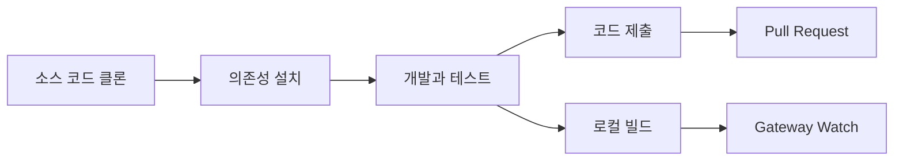

# 개발 가이드: 소스 코드 빌드에서 기여까지

## 배우고 나면 할 수 있는 것

- 소스 코드에서 Clawdbot을 빌드하고 실행하기
- 커스텀 플러그인 개발하기 (채널, 도구, RPC 메서드)
- 유닛 테스트와 엔드투엔드 테스트 실행하기
- 프로젝트에 Pull Request를 제출하고 코드 기여하기
- 프로젝트 아키텍처와 플러그인 시스템 이해하기

## 지금 겪고 있는 어려움

당신은 개발자로서 다음과 같은 것들을 원합니다:
- Clawdbot의 기능을 커스터마이즈하거나 확장하기
- 프로젝트의 내부 작동 메커니즘 이해하기
- 오픈소스 커뮤니티에 코드 기여하기
- 하지만 어디서부터 시작해야 할지 모름: 빌드, 테스트, 제출 절차는?

## 언제 이 가이드를 사용하나요

- 소스 코드를 수정하거나 새로운 기능을 추가할 때
- 커스텀 플러그인이나 채널을 개발할 때
- 버그를 디버깅하거나 수정할 때
- 프로젝트에 코드를 기여하고 싶을 때

## 🎒 시작하기 전 준비물

::: warning 전제 조건
이 튜토리얼은 다음 조건들을 충족했다고 가정합니다:
:::

- **Node.js ≥22**가 설치되어 있음 (프로젝트 요구사항)
- **pnpm** 패키지 매니저가 설치되어 있음 (소스 코드 빌드에 권장됨)
- **Git** 기본 작업 지식
- **TypeScript** 개발 경험
- **터미널** 명령어 조작 능력

권장 환경:
- macOS / Linux (주요 개발 플랫폼)
- Windows는 WSL2를 통해 사용 가능

## 핵심 개념

### 개발 프로세스 개요

Clawdbot의 개발 프로세스는 네 가지 주요 단계로 구성됩니다:



### 핵심 개념

- **빌드 시스템**: TypeScript 컴파일을 사용, `dist/` 디렉토리에 출력
- **플러그인 아키텍처**: 런타임에 로드되는 TypeScript 모듈, 기능 확장 지원
- **Gateway 데몬**: 싱글톤 패턴, 제어 평면과 메시지 라우팅
- **테스트 프레임워크**: Vitest를 사용한 유닛 테스트, Docker를 사용한 엔드투엔드 테스트

### 프로젝트 구조 요점

| 디렉토리 | 용도 |
|--- | ---|
| `src/` | 모든 소스 코드 (2475개 TypeScript 파일) |
| `src/gateway/` | Gateway WebSocket 서버 |
| `src/channels/` | 채널 플러그인 시스템 |
| `src/agents/` | AI Agent 런타임 |
| `src/plugin-sdk/` | 플러그인 개발 SDK |
| `extensions/` | 내장 플러그인 (예: voice-call) |
| `tests/` | 테스트 파일 |

## 따라하기

### 1단계: 소스 코드 클론과 의존성 설치

**이유**
최신 소스 코드를 가져오고 모든 의존성을 설치하는 것은 개발의 첫 번째 단계입니다.

```bash
## 저장소 클론
git clone https://github.com/clawdbot/clawdbot.git
cd clawdbot

## 의존성 설치 (pnpm 권장)
pnpm install
```

**확인할 사항**: 의존성 설치 성공, 오류 메시지 없음.

::: info Bun 지원
Bun을 사용하는 경우 TypeScript를 빌드 없이 직접 실행할 수 있습니다 (`tsx` 사용).
:::

### 2단계: 프로젝트 빌드

**이유**
TypeScript를 JavaScript로 컴파일하여 배포 가능한 `dist/` 디렉토리를 생성합니다.

```bash
## 전체 빌드
pnpm build
```

**확인할 사항**:
```
src/cli/entry.ts → dist/cli/entry.js
src/gateway/server.ts → dist/gateway/server.js
...
Build completed in X seconds
```

::: tip UI 빌드
처음 `pnpm ui:build`를 실행하면 UI 의존성이 자동으로 설치됩니다.
:::

### 3단계: 개발 모드 시작

**이유**
개발 모드는 자동 재로드를 지원하여 수동으로 다시 빌드할 필요가 없습니다.

```bash
## Gateway 개발 모드 시작 (자동 재로드)
pnpm gateway:watch

## 또는 CLI 개발 모드 시작
CLAWDBOT_PROFILE=dev pnpm clawdbot --dev
```

**확인할 사항**:
- Gateway가 `ws://127.0.0.1:18789`에서 시작 및 수신 대기
- 파일 수정 시 자동으로 다시 컴파일 및 재시작

::: tip 채널 로딩 건너뛰기
개발 시 `CLAWDBOT_SKIP_CHANNELS=1`을 사용하여 채널 초기화를 건너뛰고 시작 속도를 높일 수 있습니다.
:::

**체크포인트 ✅**
- Gateway가 포트 18789에서 성공적으로 시작됨
- TypeScript 파일 수정 후 자동으로 다시 컴파일됨

### 4단계: 테스트 실행

**이유**
코드 수정이 기존 기능을 손상시키지 않았는지 확인합니다.

#### 유닛 테스트

```bash
## 모든 테스트 실행
pnpm test

## 테스트 실행 및 변경 감시
pnpm test:watch

## 커버리지 보고서 생성
pnpm test:coverage
```

**확인할 사항**: 테스트 통과율과 커버리지 통계.

#### 엔드투엔드 테스트

```bash
## Docker 엔드투엔드 테스트 실행
pnpm test:docker:all

## 또는 개별 테스트 스위트 실행
pnpm test:docker:live-models
```

**확인할 사항**: 모든 Docker 테스트 컨테이너가 성공적으로 실행 및 종료됨.

::: warning 테스트 요구사항
엔드투엔드 테스트에는 Docker가 설치되어 실행 중이어야 합니다.
:::

**체크포인트 ✅**
- 모든 유닛 테스트 통과
- 테스트 커버리지가 요구사항에 부합 (≥70%)
- 엔드투엔드 테스트 통과

### 5단계: 코드 검사 및 포맷팅

**이유**
코드 스타일을 일관되게 유지하고 타입 안전성을 확보합니다.

```bash
## linter 실행
pnpm lint

## 코드 포맷팅
pnpm format:fix

## Swift linter 실행 (macOS/iOS 개발)
pnpm lint:swift
```

**확인할 사항**: lint 오류 없음, 코드가 포맷팅됨.

::: tip 자동 포맷팅
프로젝트는 pre-commit git hooks를 구성하여 커밋 전에 자동으로 스테이징된 파일을 포맷팅합니다.
:::

### 6단계: 플러그인 개발 (선택)

**이유**
Clawdbot의 기능을 확장하거나 외부 서비스와 통합합니다.

#### 플러그인 빠르게 생성하기

1. 플러그인 디렉토리 생성:
```bash
mkdir extensions/my-plugin
cd extensions/my-plugin
```

2. `clawdbot.plugin.json` 생성:
```json
{
  "id": "my-plugin",
  "name": "My Plugin",
  "version": "1.0.0",
  "configSchema": {
    "type": "object",
    "properties": {
      "apiKey": { "type": "string" }
    }
  }
}
```

3. 플러그인 엔트리 `index.ts` 생성:
```typescript
export default function (api) {
  console.log("My plugin loaded!");
  
  // 도구 등록
  api.registerTool({
    name: "my_tool",
    description: "My custom tool",
    execute: async (params) => {
      return { result: "Hello from my tool!" };
    }
  });
  
  // RPC 메서드 등록
  api.registerGatewayMethod("myplugin.status", ({ respond }) => {
    respond({ ok: true, status: "running" });
  });
}
```

4. 설치 및 테스트:
```bash
## 개발 모드: 플러그인 링크
clawdbot plugins install -l extensions/my-plugin

## Gateway 재시작
pnpm gateway:watch
```

::: details 플러그인 유형
Clawdbot은 다음과 같은 플러그인 유형을 지원합니다:

- **Agent Tools**: AI가 호출할 수 있는 도구
- **Channel Plugins**: 새로운 메시지 채널 (WhatsApp, Telegram 등)
- **Gateway RPC**: WebSocket 엔드포인트
- **CLI Commands**: 명령줄 도구
- **Background Services**: 백그라운드 작업
- **Auto-reply Commands**: AI 없는 빠른 명령

자세한 내용은 [플러그인 문서](https://github.com/moltbot/moltbot/blob/main/docs/plugin.md)를 참조하세요.
:::

**체크포인트 ✅**
- 플러그인이 성공적으로 로드됨
- CLI 또는 Gateway를 통해 플러그인 기능 호출 가능
- 플러그인 설정이 정상 작동함

### 7단계: 코드 제출 및 Pull Request

**이유**
귀하의 기여를 커뮤니티에 제출합니다.

```bash
## 기능 브랜치 생성
git checkout -b feature/my-feature

## 변경 사항 커밋
git add .
git commit -m "feat: add my new feature"

## GitHub에 푸시
git push origin feature/my-feature
```

그런 다음 GitHub에서 Pull Request를 생성하세요.

::: tip PR 규범
PR 설명에 다음을 포함하세요:
- **무엇을 했는지**: 기능 또는 수정에 대한 설명
- **왜**: 어떤 문제를 해결하는지
- **테스트 상태**: untested / lightly tested / fully tested
- **AI 보조**: AI 도구를 사용하여 개발에 도움을 받았는지 여부
:::

**체크포인트 ✅**
- 코드가 GitHub에 푸시됨
- Pull Request가 성공적으로 생성됨
- CI/CD 검사를 통과함 (있는 경우)

## 문제 해결

### 일반적인 오류

| 오류 | 원인 | 해결 방법 |
|--- | --- | ---|
| `Cannot find module 'xxx'` | 의존성이 설치되지 않음 | `pnpm install` 실행 |
| `Port 18789 already in use` | Gateway가 이미 실행 중임 | 이전 인스턴스 확인 및 종료 |
| TypeScript 컴파일 오류 | 타입 정의 문제 | `pnpm lint` 실행하여 확인 |
| 테스트 시간 초과 | Docker가 시작되지 않았거나 네트워크 문제 | Docker 상태 확인 |

### 개발 모범 사례

- **작은 단위로 커밋**: 각 PR은 한 가지 일만 하여 검토가 용이하도록 함
- **테스트 작성**: 새로운 기능은 반드시 테스트 커버리지를 가져야 함
- **스타일 준수**: 프로젝트의 linter와 formatter 설정을 따름
- **문서 업데이트**: 코드를 수정할 때 관련 문서도 함께 업데이트함
- **AI 표기**: AI 보조 개발을 사용할 경우 PR에 표기함

## 본 수업 요약

이 튜토리얼은 Clawdbot의 완전한 개발 프로세스를 다룹니다:

✅ **소스 코드 빌드**: `pnpm install`과 `pnpm build` 사용
✅ **개발 모드**: `pnpm gateway:watch`로 자동 재로드
✅ **테스트 프레임워크**: Vitest 유닛 테스트 + Docker 엔드투엔드 테스트
✅ **플러그인 개발**: TypeScript 기반 확장 가능한 플러그인 시스템
✅ **기여 프로세스**: Git 워크플로우와 Pull Request 규범

핵심 명령어 빠른 참조:

| 작업 | 명령어 |
|--- | ---|
| 의존성 설치 | `pnpm install` |
| 빌드 | `pnpm build` |
| 개발 모드 | `pnpm gateway:watch` |
| 유닛 테스트 | `pnpm test` |
| 코드 검사 | `pnpm lint` |
| 포맷팅 | `pnpm format:fix` |

## 다음 수업 예고

개발 가이드 학습을 완료한 것을 축하합니다! 이제 다음 능력을 갖추었습니다:

- 소스 코드에서 Clawdbot을 빌드하고 실행하는 능력
- 커스텀 플러그인 개발의 기초
- 테스트 실행 및 코드 기여 프로세스

다음으로 깊이 있게 알아보고 싶은 주제:

- [설정 참조](../config-reference/) - 완전한 설정 항목 문서
- [Gateway API 프로토콜](../api-protocol/) - WebSocket 프로토콜 사양
- [배포 옵션](../deployment/) - Docker, Nix 등의 배포 방법

계속 탐색하여 Clawdbot이 당신을 위해 일하도록 하세요!

---

## 부록: 소스 코드 참조

<details>
<summary><strong>클릭하여 소스 코드 위치 보기</strong></summary>

> 업데이트 시간: 2026-01-27

| 기능 | 파일 경로 | 라인 번호 |
|--- | --- | ---|
| 빌드 스크립트 | [`package.json`](https://github.com/moltbot/moltbot/blob/main/package.json) | 77-44 |
| 소스 코드 설치 | [`README.md`](https://github.com/moltbot/moltbot/blob/main/README.md) | 83-99 |
| 플러그인 문서 | [`docs/plugin.md`](https://github.com/moltbot/moltbot/blob/main/docs/plugin.md) | 1-639 |
| 기여 가이드 | [`CONTRIBUTING.md`](https://github.com/moltbot/moltbot/blob/main/CONTRIBUTING.md) | 1-53 |
| 아키텍처 문서 | [`docs/concepts/architecture.md`](https://github.com/moltbot/moltbot/blob/main/docs/concepts/architecture.md) | 1-123 |

**핵심 명령어**:
- `pnpm build` - 완전한 빌드 (package.json:85)
- `pnpm gateway:watch` - 개발 모드 자동 재로드 (package.json:93)
- `pnpm test` - 유닛 테스트 실행 (package.json:118)
- `pnpm lint` - 코드 검사 (package.json:110)

**핵심 디렉토리**:
- `src/` - 소스 코드 루트 디렉토리 (2475개 TypeScript 파일)
- `src/plugin-sdk/` - 플러그인 개발 SDK
- `extensions/` - 내장 플러그인
- `tests/` - 테스트 파일
- `dist/` - 빌드 출력 디렉토리

**플러그인 관련**:
- 플러그인 manifest 형식: `clawdbot.plugin.json` (plugin.md:8-10)
- 플러그인 API: `api.registerTool()`, `api.registerGatewayMethod()` (plugin.md:591-600)
- 플러그인 설정 Schema: JSON Schema + `uiHints` (plugin.md:36-48)

</details>
