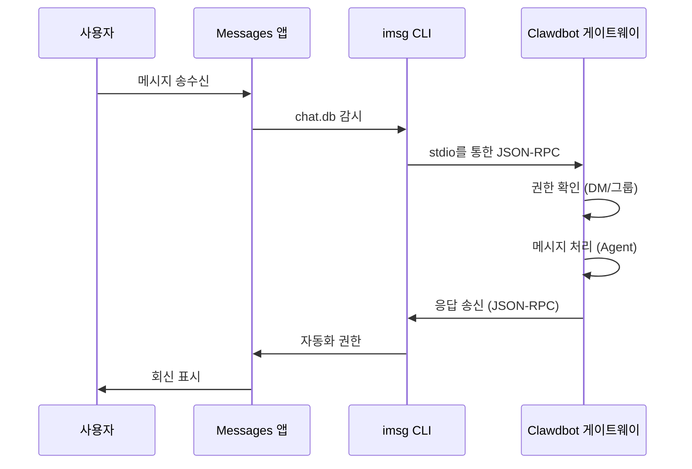

# iMessage 채널 구성

## 학습 완료 후 할 수 있는 것

- macOS에서 iMessage를 통해 AI 어시스턴트와 1:1 개인 채팅
- iMessage 그룹에서 AI 어시스턴트 사용(@멘션 지원)
- 봇 ID를 분리하기 위해 전용 Mac 사용자 구성
- SSH/Tailscale을 통해 원격 Mac의 iMessage에 액세스
- DM 페어링 및 그룹 허용 목록 액세스 제어 마스터

## 현재 겪고 있는 문제

macOS에서 iMessage를 통해 AI 어시스턴트와 상호작용하고 싶지만 다음 방법을 모릅니다:

- `imsg` CLI 도구 설치 및 구성
- Clawdbot에 전체 디스크 액세스 및 자동화 권한 부여
- iMessage 게이트웨이로 로컬 또는 원격 Mac 구성
- 여러 iMessage 계정 설정
- 봇에 누가 메시지를 보낼 수 있는지 제어

## 언제 이 방법을 사용해야 하나요

**iMessage 채널 사용에 적합한 시나리오**:

- 주로 macOS에서 iMessage를 사용
- 로컬 iMessage를 사용하고 싶음(제3자 서버에 의존하지 않음)
- iMessage를 통해 AI 어시스턴트와 텍스트 및 미디어 상호작용 필요
- 다른 채널(WhatsApp, Telegram)과 동일한 대화 환경 유지하고 싶음

**적합하지 않은 시나리오**:

- macOS가 아닌 시스템(iMessage 채널은 macOS만 지원)
- 크로스 플랫폼 동기화 필요(WebChat, Telegram 고려)
- 그룹 @멘션 기능 필요(iMessage에는 원래 멘션 메커니즘이 없으며 수동 구성 필요)

## 핵심 개념

iMessage 채널의 워크플로우:



**핵심 개념**:

| 개념 | 설명 |
|--- | ---|
| **imsg CLI** | stdio를 통한 JSON-RPC로 Messages와 상호작용하는 제3자 도구 |
| **전체 디스크 액세스** | Clawdbot이 Messages chat.db를 읽도록 허용하는 macOS 권한 |
| **자동화 권한** | imsg가 자동화 API를 통해 메시지를 보낼 수 있도록 허용하는 macOS 권한 |
| **chat_id** | 라우팅 및 대화 세분화에 사용되는 안정적인 채팅 식별자 |
| **페어링** | 기본 DM 보호 메커니즘, 낯선 발신자는 승인 필요 |

::: tip
iMessage 채널은 Messages API를 직접 호출하는 대신 `imsg` CLI를 통해 구현됩니다. `imsg`는 stdio를 통한 JSON-RPC로 Clawdbot과 통신하므로 원격 Mac에서 실행할 수 있습니다(SSH를 통해).
:::

## 🎒 시작 전 준비

다음을 완료했는지 확인하세요:

- ✅ [빠른 시작](../../start/getting-started/)을 완료하고 Clawdbot을 설치
- ✅ Gateway가 실행 중(`clawdbot gateway --port 18789`)
- ✅ macOS에서 Messages에 로그인(iMessage 활성화)
- ✅ Homebrew 액세스 권한 있음(`imsg` 설치용)

::: warning
iMessage 채널은 macOS만 지원합니다. Gateway가 macOS에서 실행되고 있거나 SSH/Tailscale을 통해 원격 Mac에 연결되어 있는지 확인하세요.
:::

## 따라해 보세요

### 1단계: imsg CLI 설치

**이유**
`imsg`는 iMessage 채널의 핵심 의존성이며, stdio를 통한 JSON-RPC로 Messages 앱과 상호작용합니다.

1. Homebrew로 설치:
    ```bash
    brew install steipete/tap/imsg
    ```

**다음을 볼 수 있어야 합니다**:
- 설치 성공 후 `imsg` 명령을 사용할 수 있음
- `imsg --version` 실행 시 버전 정보 표시

**설치 확인**:

```bash
# imsg를 사용할 수 있는지 테스트
imsg chats --limit 1
```

**다음을 볼 수 있어야 합니다**:
- 최소 하나의 채팅 기록 출력(있는 경우)
- 또는 전체 디스크 액세스 권한 부여 필요 메시지

### 2단계: 전체 디스크 액세스 권한 부여

**이유**
Clawdbot은 새 메시지를 감시하기 위해 Messages의 `chat.db` 데이터베이스를 읽어야 합니다.

1. **시스템 설정** > **개인 정보 보안 및 보안** 열기
2. **전체 디스크 액세스** 클릭
3. **+** 클릭하여 다음 앱 추가:
    - `/Applications/Clawdbot.app`(macOS 앱을 사용하는 경우)
    - `/usr/local/bin/imsg` 또는 `imsg`의 실제 경로
4. Gateway 재시작

::: warning
권한 변경 후 반드시 Gateway를 재시작해야 효력이 발생합니다!
:::

**다음을 볼 수 있어야 합니다**:
- Gateway 시작 로그에 권한 오류 없음
- `imsg chats --limit 1`이 정상적으로 채팅 목록을 출력

### 3단계: 자동화 권한 부여

**이유**
`imsg`는 Apple Events 자동화 API를 통해 메시지를 보내며 사용자 승인이 필요합니다.

1. 메시지를 처음 보낼 때 macOS에 권한 프롬프트가 표시됩니다
2. **허용** 또는 **확인** 클릭
3. 전용 Mac 사용자를 사용하는 경우 해당 사용자 세션에서 테스트를 한 번 실행

**자동화 권한 테스트**:

```bash
# 테스트 메시지 전송(실제 수신자로 대체)
imsg send --to "+15555550123" "Test message"
```

**다음을 볼 수 있어야 합니다**:
- macOS 권한 프롬프트 표시(처음)
- 권한 부여 후 메시지 성공적으로 전송
- Messages 앱에 테스트 메시지 표시

### 4단계: Clawdbot 구성

**이유**
Clawdbot에 사용할 `imsg` 경로 및 Messages 데이터베이스 위치를 알려줍니다.

**방법 A: 간단한 구성(로컬 Mac)**

`~/.clawdbot/clawdbot.json` 편집:

```json5
{
  channels: {
    imessage: {
      enabled: true,
      cliPath: "/usr/local/bin/imsg",
      dbPath: "/Users/<your-username>/Library/Messages/chat.db",
      dmPolicy: "pairing",
      groupPolicy: "allowlist"
    }
  }
}
```

::: info
`<your-username>`을 실제 macOS 사용자 이름으로 대체하세요.
:::

**방법 B: 다중 계정 구성**

```json5
{
  channels: {
    imessage: {
      enabled: true,
      accounts: {
        main: {
          name: "Main Account",
          enabled: true,
          cliPath: "/usr/local/bin/imsg",
          dbPath: "/Users/alice/Library/Messages/chat.db"
        },
        bot: {
          name: "Bot Account",
          enabled: true,
          cliPath: "/path/to/imsg-bot-wrapper",  // 5단계 참조
          dbPath: "/Users/botuser/Library/Messages/chat.db"
        }
      }
    }
  }
}
```

**Gateway 재시작**:

```bash
clawdbot gateway restart
```

**다음을 볼 수 있어야 합니다**:
- Gateway가 시작되고 "iMessage default: enabled, configured, ..." 표시
- 권한 또는 경로 오류 로그 없음

### 5단계: 테스트 메시지 전송

**이유**
구성이 올바른지 메시지가 정상적으로 전달되는지 확인합니다.

1. CLI를 사용하여 테스트 메시지 전송:
    ```bash
    clawdbot message --to imessage:+15555550123 "Hello from Clawdbot!"
    ```

**다음을 볼 수 있어야 합니다**:
- Messages 앱에 메시지 수신
- Gateway 로그에 메시지 전송됨 표시
- AI 모델을 구성한 경우 AI 응답 수신

::: info
`imessage:+15555550123` 형식은 전화번호 `+15555550123`로 iMessage 채널을 통해 전송함을 나타냅니다. 이메일 주소 `imessage:user@example.com`도 사용할 수 있습니다.
:::

## 체크포인트 ✅

구성 성공 여부 확인:

```bash
# 채널 상태 확인
clawdbot channels status

# 다음을 표시해야 함:
# iMessage default: enabled, configured, rpc listening
```

::: info
오류가 표시되면 `clawdbot channels status --probe`를 실행하여 자세한 진단 정보를 확인하세요.
:::

## 고급 구성

### 전용 Mac 사용자 구성(선택 사항)

별도의 iMessage ID를 사용하고 싶은 경우(개인 Messages를 오염시키지 않음), 전용 Mac 사용자를 만들 수 있습니다.

**단계**:

1. **전용 Apple ID 만들기**:
    - [appleid.apple.com](https://appleid.apple.com) 방문
    - 새 Apple ID 만들기(예: `my-cool-bot@icloud.com`)

2. **macOS 사용자 만들기**:
    - **시스템 설정** > **사용자 및 그룹** 열기
    - **+** 클릭하여 새 사용자 만들기(예: `botuser`)
    - 자동 로그인 또는 암호 저장 설정

3. **전용 iMessage 계정에 로그인**:
    - `botuser` 사용자로 전환
    - Messages 앱 열기
    - 전용 Apple ID로 iMessage에 로그인

4. **원격 로그인 활성화**:
    - **시스템 설정** > **일반** > **공유** 열기
    - **원격 로그인** 활성화

5. **SSH 비밀번호 없는 로그인 설정**:
    ```bash
    # 메인 사용자에서 SSH 테스트
    ssh botuser@localhost true

    # 암호가 필요한 경우 SSH 키 구성:
    ssh-keygen -t ed25519
    ssh-copy-id botuser@localhost
    ```

6. **SSH wrapper 스크립트 만들기**:

    `~/.clawdbot/scripts/imsg-bot` 만들기(`chmod +x`):

    ```bash
    #!/usr/bin/env bash
    set -euo pipefail

    # 대화형 SSH를 한 번 실행하여 호스트 키 수락:
    #   ssh botuser@localhost true
    exec /usr/bin/ssh -o BatchMode=yes -o ConnectTimeout=5 -T botuser@localhost \
      "/usr/local/bin/imsg" "$@"
    ```

7. **Clawdbot 구성**:

    ```json5
    {
      channels: {
        imessage: {
          enabled: true,
          accounts: {
            bot: {
              name: "Bot",
              enabled: true,
              cliPath: "/Users/<your-username>/.clawdbot/scripts/imsg-bot",
              dbPath: "/Users/botuser/Library/Messages/chat.db"
            }
          }
        }
      }
    }
    ```

::: tip
처음 구성할 때 `botuser` 세션에서 `imsg chats --limit 1` 또는 `imsg send ...`를 한 번 실행하여 자동화 권한을 부여하세요.
:::

### 원격 Mac 구성(선택 사항)

Gateway가 Linux/VM에서 실행되지만 iMessage가 Mac에서 필요한 경우 SSH 원격 연결을 사용할 수 있습니다.

**아키텍처**:

```
┌──────────────────────────────┐          SSH (imsg rpc)          ┌──────────────────────────┐
│ Gateway 호스트 (Linux/VM)     │──────────────────────────────────▶│ Mac with Messages + imsg │
│ - clawdbot gateway           │          SCP (attachments)        │ - Messages signed in     │
│ - channels.imessage.cliPath  │◀──────────────────────────────────│ - Remote Login enabled   │
└──────────────────────────────┘                                   └──────────────────────────┘
               ▲
               │ Tailscale tailnet (hostname or 100.x.y.z)
               ▼
         user@remote-mac
```

**구성 단계**:

1. **SSH wrapper 만들기**(`~/.clawdbot/scripts/imsg-ssh`):

    ```bash
    #!/usr/bin/env bash
    exec ssh -T bot@remote-mac imsg "$@"
    ```

2. **Clawdbot 구성**:

    ```json5
    {
      channels: {
        imessage: {
          enabled: true,
          cliPath: "/Users/<your-username>/.clawdbot/scripts/imsg-ssh",
          remoteHost: "bot@remote-mac",
          includeAttachments: true,
          dbPath: "/Users/bot/Library/Messages/chat.db"
        }
      }
    }
    ```

::: info
`remoteHost`는 SCP 첨부 파일 전송에 사용됩니다. 설정하지 않으면 Clawdbot이 SSH 명령에서 자동으로 감지하려고 시도합니다. 명시적 구성이 더 신뢰할 수 있습니다.
:::

**Tailscale 구성 예시**:

```bash
# SSH wrapper
#!/usr/bin/env bash
exec ssh -T bot@mac-mini.tailnet-1234.ts.net imsg "$@"
```

```json5
{
  channels: {
    imessage: {
      enabled: true,
      cliPath: "~/.clawdbot/scripts/imsg-ssh",
      remoteHost: "bot@mac-mini.tailnet-1234.ts.net",
      includeAttachments: true,
      dbPath: "/Users/bot/Library/Messages/chat.db"
    }
  }
}
```

## 구성 상세

### 기본 구성

| 구성 항목 | 타입 | 기본값 | 설명 |
|--- | --- | --- | ---|
| `enabled` | boolean | false | iMessage 채널 활성화 여부 |
| `cliPath` | string | "imsg" | imsg CLI 경로(SSH wrapper 가능) |
| `dbPath` | string | - | Messages chat.db 경로 |
| `remoteHost` | string | - | SSH 호스트(SCP 첨부 파일 전송용) |

### DM 정책

| 구성 항목 | 타입 | 기본값 | 설명 |
|--- | --- | --- | ---|
| `dmPolicy` | "pairing"|"allowlist"|"open"|"disabled" | "pairing" | DM 액세스 정책 |
| `allowFrom` | array | [] | 허용된 발신자 목록(handles, 이메일, E.164, `chat_id:*`) |

**새 발신자 페어링**:

```bash
# 대기 중인 페어링 코드 나열
clawdbot pairing list imessage

# 페어링 승인
clawdbot pairing approve imessage <CODE>
```

::: tip
iMessage에는 사용자 이름 개념이 없으며 handles(전화번호 또는 이메일 주소) 또는 chat targets(`chat_id`, `chat_guid`, `chat_identifier`)를 사용합니다.
:::

### 그룹 정책

| 구성 항목 | 타입 | 기본값 | 설명 |
|--- | --- | --- | ---|
| `groupPolicy` | "allowlist"|"open"|"disabled" | "allowlist" | 그룹 액세스 정책 |
| `groupAllowFrom` | array | [] | 그룹에서 AI를 트리거할 수 있는 발신자 |
| `groups` | object | {} | chat_id별 그룹 구성 |

**그룹 구성 예시**:

```json5
{
  channels: {
    imessage: {
      groupPolicy: "allowlist",
      groupAllowFrom: ["+15555550123", "alice@example.com"],
      groups: {
        "42": {
          requireMention: false,
          allowFrom: ["bob@example.com"]
        }
      }
    }
  }
}
```

### 미디어 및 텍스트 제한

| 구성 항목 | 타입 | 기본값 | 설명 |
|--- | --- | --- | ---|
| `includeAttachments` | boolean | false | 첨부 파일을 컨텍스트에 포함할지 여부 |
| `mediaMaxMb` | number | 16 | 최대 미디어 파일 크기(MB) |
| `textChunkLimit` | number | 4000 | 발신 텍스트 청크 크기(문자) |
| `chunkMode` | "length"|"newline" | "length" | 청크 모드: 길이별 또는 빈 줄별 |

### 기록

| 구성 항목 | 타입 | 기본값 | 설명 |
|--- | --- | --- | ---|
| `historyLimit` | number | - | 그룹 최대 기록 메시지 수(0은 비활성화) |
| `dmHistoryLimit` | number | - | DM 기록 제한(사용자 턴 수) |
| `dms["<handle>"].historyLimit` | number | - | handle별 DM 기록 제한 덮어쓰기 |

## 문제 해결

### imsg rpc 명령을 사용할 수 없음

**증상**: Gateway 로그에 "imsg CLI does not support 'rpc' subcommand" 표시

**원인**: `imsg` 버전이 너무 오래되어 `rpc` 하위 명령을 지원하지 않음

**해결 방법**:

1. `imsg` 업데이트:
    ```bash
    brew upgrade steipete/tap/imsg
    ```

2. 버전 확인:
    ```bash
    imsg rpc --help
    ```

### 전체 디스크 액세스 권한 문제

**증상**: `imsg chats --limit 1`에 출력이 없거나 "Permission denied" 오류

**해결 방법**:

1. Clawdbot과 `imsg`를 전체 디스크 액세스에 추가했는지 확인
2. Gateway 재시작
3. 문제가 지속되면 Mac 재시작 시도

### 자동화 권한 문제

**증상**: 메시지를 보낼 때 반응이 없고 Gateway 로그에 시간 초과 표시

**원인**: macOS에서 자동화 권한을 부여하지 않음

**해결 방법**:

1. Messages 앱에서 메시지를 수동으로 전송
2. macOS에 권한 프롬프트가 표시되어야 함
3. **허용** 클릭
4. 전용 Mac 사용자를 사용하는 경우 해당 사용자로 전환하여 단계 반복

### 원격 Mac 연결 실패

**증상**: SSH wrapper 시간 초과 또는 연결 거부

**해결 방법**:

1. SSH 연결 테스트:
    ```bash
    ssh -T bot@remote-mac imsg --version
    ```

2. 원격 로그인이 활성화되어 있는지 확인(원격 Mac)

3. 방화벽 및 포트 설정 확인

4. Tailscale를 사용하여 내부 네트워크 터널링 단순화

## 요약

- `imsg` CLI 도구 설치 완료
- 전체 디스크 액세스 및 자동화 권한 구성
- 로컬 및 원격 Mac 구성 방법 학습
- DM 페어링 및 그룹 허용 목록 메커니즘 마스터
- chat_id, chat_guid, chat_identifier 차이점 이해
- 1:1 및 그룹 메시지 테스트 완료

## 다음 과정 예고

> 다음 과정에서는 **[LINE 채널](../line/)**을 학습합니다.
>
> 다음을 배우게 됩니다:
> - LINE Messaging API 자격 증명 가져오기 방법
> - LINE Bot 웹훅 엔드포인트 구성
> - LINE 채널의 메시지 형식 및 제한 사항
> - iMessage 채널과의 구성 차이점

---

## 부록: 소스 코드 참조

<details>
<summary><strong>클릭하여 소스 코드 위치 펼치기</strong></summary>

> 업데이트 날짜: 2026-01-27

| 기능 | 파일 경로 | 행 번호 |
|--- | --- | ---|
| iMessage 구성 타입 정의 | [`src/config/types.imessage.ts`](https://github.com/moltbot/moltbot/blob/main/src/config/types.imessage.ts) | 1-80 |
| iMessage 계정 구문 분석 | [`src/imessage/accounts.ts`](https://github.com/moltbot/moltbot/blob/main/src/imessage/accounts.ts) | 1-83 |
| iMessage 프로브 | [`src/imessage/probe.ts`](https://github.com/moltbot/moltbot/blob/main/src/imessage/probe.ts) | 1-92 |
| iMessage 전송 | [`src/imessage/send.ts`](https://github.com/moltbot/moltbot/blob/main/src/imessage/send.ts) | 1-135 |
| iMessage 모니터링 제공자 | [`src/imessage/monitor/monitor-provider.ts`](https://github.com/moltbot/moltbot/blob/main/src/imessage/monitor/monitor-provider.ts) | 1-600+ |
| 대상 주소 구문 분석 | [`src/imessage/targets.ts`](https://github.com/moltbot/moltbot/blob/main/src/imessage/targets.ts) | 1-200+ |
| 온보딩 어댑터 | [`src/channels/plugins/onboarding/imessage.ts`](https://github.com/moltbot/moltbot/blob/main/src/channels/plugins/onboarding/imessage.ts) | 1-262 |
| iMessage 문서 | [`docs/channels/imessage.md`](https://github.com/moltbot/moltbot/blob/main/docs/channels/imessage.md) | 1-262 |

**핵심 타입**:
- `IMessageConfig`: 완전한 iMessage 구성 인터페이스
- `IMessageAccountConfig`: 단일 계정 구성
- `IMessageService`: "imessage" | "sms" | "auto"
- `IMessageTargetKind`: "chat_id" | "chat_guid" | "chat_identifier" | "handle"

**핵심 구성 필드**:
- `cliPath`: imsg CLI 경로, 로컬 경로 또는 SSH wrapper 스크립트일 수 있음
- `dbPath`: Messages chat.db 데이터베이스 경로
- `remoteHost`: SSH 호스트(SCP 첨부 파일 전송용), 자동 감지 또는 명시적 구성
- `dmPolicy`: 기본 "pairing", 낯선 DM 액세스 제어
- `groupPolicy`: 그룹 액세스 정책, "allowlist" 또는 "open"
- `groups`: `chat_id`별 그룹 구성, 세분화된 대화 및 사용자 지정 정책 지원

**핵심 함수**:
- `probeIMessage()`: imsg CLI를 사용할 수 있고 rpc 하위 명령을 지원하는지 프로브(`probe.ts`)
- `sendMessageIMessage()`: iMessage 메시지 전송, 텍스트 및 미디어 지원(`send.ts`)
- `monitorIMessageProvider()`: iMessage 이벤트 스트림 모니터링(`monitor-provider.ts`)
- `parseIMessageTarget()`: 대상 주소 구문 분석(chat_id, handle, 이메일 등)(`targets.ts`)

**통신 메커니즘**:
- `imsg rpc` 하위 명령을 통해 stdio를 통한 JSON-RPC 통신 구현
- 각 계정에는 독립적인 RPC 클라이언트 인스턴스 있음(`createIMessageRpcClient`)
- 메시지 이벤트는 `monitor-provider.ts`를 통해 Gateway로 스트리밍됨
- 메시지 전송 시 `chat_id`(권장), `chat_guid`, `chat_identifier` 또는 직접 handle 지원

**다중 계정 지원**:
- `channels.imessage.accounts` 맵을 사용하여 여러 계정 구성
- 각 계정은 독립적인 `cliPath`, `dbPath` 및 정책 구성 있음
- 기본 계정 ID는 "default"이며 `accountId` 필드로 지정 가능

</details>
