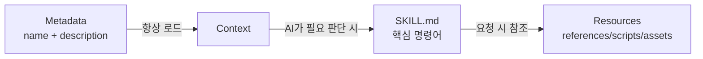

# 스킬 구조 상세 설명

## 학습 후 할 수 있는 것

- SKILL.md의 모든 필드 요구사항과 형식 사양을 정확하게 이해
- references/, scripts/, assets/의 설계 원리와 사용 시나리오 마스터
- 스킬의 토큰 사용 및 로딩 성능 최적화
- 일반적인 형식 오류 및 경로 해석 문제 방지
- 점진적 로딩을 사용하여 AI 컨텍스트 효율성 향상

## 현재 겪고 있는 문제

기본 스킬을 생성하는 방법은 배웠지만, SKILL.md의 전체 사양에 대해 아직 완전히 이해하지 못하고 있습니다. 스킬에서 다음 문제가 발생할 수 있습니다.

- SKILL.md가 너무 길어 토큰 소모가 과도하게 높음
- references/에 넣어야 할 내용인지 SKILL.md에 넣어야 할 내용인지 불확실
- AI 에이전트가 scripts/ 또는 assets/의 리소스를 올바르게 로드하지 못함
- YAML frontmatter 형식 오류로 인해 설치 실패

## 이 기능을 사용해야 할 때

- **스킬 검토**: 기존 스킬이 Anthropic 사양을 준수하는지 확인
- **성능 최적화**: 스킬 로딩이 느리거나 토큰 초과 문제 해결
- **리소스 리팩토링**: 대형 스킬을 SKILL.md + bundled resources로 분리
- **복잡한 스킬 개발**: API 문서 및 실행 가능한 스크립트가 포함된 완전한 스킬 작성

## 🎒 시작 전 준비

::: warning 사전 점검

시작하기 전에 다음을 확인하세요.

- ✅ [사용자 정의 스킬 생성](../create-skills/)을 읽음
- ✅ 최소 하나 이상의 스킬을 설치함 (기본 프로세스 이해)
- ✅ YAML 및 Markdown 기본 문법에 익숙함

:::

## 핵심 개념

### SKILL.md의 설계 철학

**SKILL.md**는 Anthropic 스킬 시스템의 핵심으로, **점진적 로딩(Progressive Loading)** 설계를 채택합니다.



**3계층 로딩의 장점**:

1. **Metadata 계층**: 모든 스킬의 `name`과 `description`이 항상 컨텍스트에 있어 AI가 사용 가능한 스킬을 빠르게 이해
2. **SKILL.md 계층**: 관련이 있을 때만 로드되며, 핵심 명령어 포함 (< 5,000 단어)
3. **Resources 계층**: 상세 문서 및 실행 가능한 파일이 요청 시 로드되어 토큰 낭비 방지

### Bundled Resources의 분류

| 디렉터리 | 컨텍스트 로드 여부 | 사용 시나리오 | 예시 유형 |
| --- | --- | --- | --- |
| `references/` | ✅ 요청 시 로드 | 상세 문서, API 설명 | API docs, 데이터베이스 schema |
| `scripts/` | ❌ 로드하지 않음 | 실행 가능한 코드 | Python/Bash 스크립트 |
| `assets/` | ❌ 로드하지 않음 | 템플릿, 출력 파일, 이미지 | JSON 템플릿, 보일러플레이트 코드 |

## 함께 따라 하기

### 1단계: YAML Frontmatter 전체 사양 이해

**이유**: YAML frontmatter는 스킬의 메타데이터로, 엄격한 사양을 준수해야 합니다.

SKILL.md는 `---`로 시작하고 끝나야 합니다.

```yaml
---
name: my-skill
description: Use this skill when you need to demonstrate proper format.
---
```

**필수 필드**:

| 필드 | 유형 | 형식 요구사항 | 예시 |
| --- | --- | --- | --- |
| `name` | string | 하이픈 형식(kebab-case), 공백 불가 | `pdf-editor`, `api-client` |
| `description` | string | 1-2문장, 3인칭 | `Use this skill to edit PDF files` |

::: danger 일반적인 오류

| 오류 예시 | 문제점 | 수정 방법 |
| --- | --- | --- |
| `name: My Skill` | 공백 포함 | `name: my-skill`로 변경 |
| `name: my_skill` | 밑줄 형식 | `name: my-skill`로 변경 |
| `description: You should use this when...` | 2인칭 | `description: Use this skill when...`으로 변경 |
| `description:` 너무 김 | 100단어 초과 | 1-2문장으로 요약 |
| 끝부분 `---` 누락 | YAML이 올바르게 닫히지 않음 | 닫는 구분자 추가 |

:::

**소스 코드 검증**: OpenSkills는 비탐욕적 정규 표현식으로 형식을 검증합니다.

```typescript
// src/utils/yaml.ts
export function hasValidFrontmatter(content: string): boolean {
  return content.trim().startsWith('---');
}

export function extractYamlField(content: string, field: string): string {
  const match = content.match(new RegExp(`^${field}:\\s*(.+?)$`, 'm'));
  return match ? match[1].trim() : '';
}
```

---

### 2단계: SKILL.md 본문 작성 (명령형)

**이유**: AI 에이전트는 대화식 설명이 아닌 명령형 지시를 기대합니다.

**올바른 접근 방식**:

```markdown
## Instructions

To execute this task:

1. Read the input file
2. Process data using the algorithm
3. Generate output in specified format
```

**잘못된 접근 방식** (피해야 함):

```markdown
## Instructions

You should execute this task by:

1. Reading the input file
2. Processing data using the algorithm
3. Generating output in specified format
```

**비교표**:

| ✅ 올바름 (Imperative/Infinitive) | ❌ 잘못됨 (Second Person) |
| --- | --- |
| "Load this skill when X" | "If you need Y" |
| "To accomplish Z, execute A" | "You should do Z" |
| "See references/guide.md" | "When you want to Z" |

**작성 요령**:

1. **동사로 시작**: `Create` → `Use` → `Return`
2. **"You" 생략**: "You should"라고 말하지 않음
3. **명확한 경로**: 리소스를 참조할 때 `references/`, `scripts/`, `assets/` 접두사 사용

---

### 3단계: references/를 사용하여 상세 문서 관리

**이유**: SKILL.md를 간결하게 유지하고, 상세 문서는 요청 시 로드합니다.

**사용 시나리오**:

- API 문서 (500단어가 넘는 엔드포인트 설명)
- 데이터베이스 스키마 (테이블 구조, 필드 정의)
- 상세 가이드 (구성 항목 설명, 자주 묻는 질문)
- 코드 예제 (대형 코드 조각)

**디렉터리 구조**:

```
my-skill/
├── SKILL.md              (~2,000 단어, 핵심 명령어)
└── references/
    ├── api-docs.md       (상세 API 문서)
    ├── database-schema.md (데이터베이스 구조)
    └── troubleshooting.md (문제 해결 가이드)
```

**SKILL.md에서의 참조 방식**:

```markdown
## Instructions

To interact with the API:

1. Read the request parameters
2. Call the API endpoint
3. For detailed response format, see `references/api-docs.md`
4. Parse the response
5. Handle errors (see `references/troubleshooting.md`)
```

**references/api-docs.md 예제**:

```markdown
# API Documentation

## Overview

This API provides endpoints for data processing.

## Endpoints

### POST /api/process

**Request:**
```json
{
  "input": "data to process",
  "options": {
    "format": "json"
  }
}
```

**Response:**
```json
{
  "status": "success",
  "result": {
    "output": "processed data"
  }
}
```

**Error Codes:**
- `400`: Invalid input format
- `500`: Server error
```

::: tip 모범 사례

**references/ 파일 크기 권장사항**:
- 단일 파일: < 10,000 단어 권장
- 전체 크기: < 50,000 단어 권장 (여러 파일로 분리)
- 명명: 하이픈 형식 사용 (`api-docs.md`가 아닌 `API_Docs.md`)

:::

---

### 4단계: scripts/를 사용하여 결정론적 작업 실행

**이유**: 실행 가능한 스크립트는 컨텍스트에 로드할 필요가 없으며, 반복 작업에 적합합니다.

**사용 시나리오**:

- 데이터 변환 (JSON → CSV, 형식 변환)
- 파일 처리 (압축, 압축 해제, 이름 변경)
- 코드 생성 (템플릿에서 코드 생성)
- 테스트 실행 (단위 테스트, 통합 테스트)

**디렉터리 구조**:

```
my-skill/
├── SKILL.md
└── scripts/
    ├── process.py       (Python 스크립트)
    ├── transform.sh     (Bash 스크립트)
    └── validate.js     (Node.js 스크립트)
```

**SKILL.md에서의 참조 방식**:

```markdown
## Instructions

To process the input data:

1. Validate the input file format
2. Execute the processing script:
    ```bash
    python scripts/process.py --input data.json --output result.json
    ```
3. Verify the output file
4. If validation fails, see `scripts/validate.py` for error messages
```

**scripts/process.py 예제**:

```python
#!/usr/bin/env python3
import json
import sys

def main():
    input_file = sys.argv[1]
    output_file = sys.argv[2]

    with open(input_file, 'r') as f:
        data = json.load(f)

    # Processing logic
    result = transform_data(data)

    with open(output_file, 'w') as f:
        json.dump(result, f, indent=2)

    print(f"✅ Processed {input_file} → {output_file}")

if __name__ == "__main__":
    main()
```

::: info scripts/의 장점

SKILL.md에 코드를 인라인으로 포함하는 것과 비교:

| 기능 | 인라인 코드 | scripts/ |
| --- | --- | --- |
| 토큰 소모 | ✅ 높음 | ❌ 낮음 |
| 재사용성 | ❌ 나쁨 | ✅ 좋음 |
| 테스트 가능성 | ❌ 어려움 | ✅ 쉬움 |
| 복잡도 제한 | ❌ 토큰 제한 있음 | ✅ 제한 없음 |

:::

---

### 5단계: assets/를 사용하여 템플릿 및 출력 파일 저장

**이유**: 템플릿 및 출력 파일은 컨텍스트에 로드할 필요가 없어 토큰을 절약합니다.

**사용 시나리오**:

- 출력 템플릿 (JSON, XML, Markdown 템플릿)
- 보일러플레이트 코드 (프로젝트 스캐폴딩, 구성 파일)
- 이미지 및 다이어그램 (플로우차트, 아키텍처 다이어그램)
- 테스트 데이터 (샘플 입력, 예상 출력)

**디렉터리 구조**:

```
my-skill/
├── SKILL.md
└── assets/
    ├── template.json    (JSON 템플릿)
    ├── boilerplate.js   (보일러플레이트 코드)
    └── diagram.png     (플로우차트)
```

**SKILL.md에서의 참조 방식**:

```markdown
## Instructions

To generate the output file:

1. Load the template: `assets/template.json`
2. Replace placeholders with actual data
3. Write to output file
4. For boilerplate code, see `assets/boilerplate.js`
```

**assets/template.json 예제**:

```json
{
  "title": "{{ title }}",
  "description": "{{ description }}",
  "version": "{{ version }}",
  "author": "{{ author }}",
  "created_at": "{{ timestamp }}"
}
```

**스크립트에서 템플릿 사용**:

```python
import json
from string import Template

def generate_output(data, template_path):
    with open(template_path, 'r') as f:
        template_str = f.read()

    template = Template(template_str)
    output = template.safe_substitute(data)

    return output
```

::: warning assets/의 주의사항

- **컨텍스트에 로드되지 않음**: AI 에이전트가 직접 내용을 읽을 수 없으며 스크립트를 통해 로드해야 함
- **경로 해석**: `assets/template.json`과 같은 상대 경로 사용
- **파일 크기**: 단일 파일 < 10MB 권장 (전송 지연 방지)

:::

---

### 6단계: 파일 크기 및 성능 최적화

**이유**: 파일 크기는 AI 컨텍스트의 토큰 소모 및 로딩 속도에 직접적인 영향을 미칩니다.

**파일 크기 가이드** (공식 권장사항):

| 디렉터리 | 크기 제한 | 로딩 동작 |
| --- | --- | --- |
| SKILL.md | < 5,000 단어 | 항상 로드 (필요 시) |
| references/ | 엄격한 제한 없음 | 요청 시 로드 |
| scripts/ | 토큰에 포함되지 않음 | 로드하지 않고 실행만 |
| assets/ | 컨텍스트에 로드되지 않음 | 로드하지 않고 복사만 |

**성능 최적화 팁**:

1. **references/ 분리**:
   ```bash
   # ❌ 단일 대용량 파일 (20,000 단어)
   references/all-docs.md

   # ✅ 여러 소형 파일로 분리 (각각 < 5,000 단어)
   references/
   ├── api-docs.md
   ├── database-schema.md
   └── troubleshooting.md
   ```

2. **scripts/를 사용한 데이터 처리**:
   ```markdown
   # ❌ SKILL.md에 대용량 코드 블록 인라인 (토큰 소모)
   ## Instructions
   Execute this code:
   ```python
   # 500 lines of code...
   ```

   # ✅ scripts/ 참조 (토큰 소모 없음)
   ## Instructions
   Execute: `python scripts/processor.py`
   ```

3. **SKILL.md 간소화**:
   - 핵심 명령어 및 단계만 유지
   - 상세 설명은 `references/`로 이동
   - 간결한 명령형 언어 사용

**파일 크기 검증**:

```bash
# SKILL.md 단어 수 계산
wc -w my-skill/SKILL.md

# references/ 전체 단어 수 계산
find my-skill/references -name "*.md" -exec wc -w {} + | tail -1

# scripts/ 파일 크기 확인
du -sh my-skill/scripts/
```

---

### 7단계: 리소스 해석 메커니즘 이해

**이유**: 경로 해석 규칙을 이해하여 참조 오류를 방지합니다.

**base directory 개념**:

AI 에이전트가 스킬을 로드할 때 `openskills read`는 base directory를 출력합니다.

```
Reading: my-skill
Base directory: /path/to/project/.claude/skills/my-skill
```

**상대 경로 해석 규칙**:

| 참조 경로 | 해석 결과 |
| --- | --- |
| `references/api.md` | `/base/directory/references/api.md` |
| `scripts/process.py` | `/base/directory/scripts/process.py` |
| `assets/template.json` | `/base/directory/assets/template.json` |

**소스 코드 검증**:

```typescript
// src/commands/read.ts
export function readSkill(skillNames: string[] | string): void {
  const skill = findSkill(name);
  const content = readFileSync(skill.path, 'utf-8');

  // AI가 상대 경로를 해석할 수 있도록 base directory 출력
  console.log(`Base directory: ${skill.baseDir}`);
  console.log(content);
}
```

::: danger 경로 오류 예시

| ❌ 잘못된 작성법 | 문제점 | ✅ 올바른 작성법 |
| --- | --- | --- |
| `/absolute/path/to/api.md` | 절대 경로 사용 | `references/api.md` |
| `../other-skill/references/api.md` | 스킬 간 참조 | `references/api.md` |
| `~/references/api.md` | 틸드 확장 사용 | `references/api.md` |

:::

---

### 8단계: 스킬 형식 검증

**이유**: 설치 전 형식을 검증하여 런타임 오류를 방지합니다.

**openskills를 사용한 검증**:

```bash
npx openskills install ./my-skill
```

**다음을 볼 수 있어야 합니다**:

```
✔ Found skill: my-skill
  Description: Use this skill when you need to demonstrate proper format.
  Size: 2.1 KB

? Select skills to install: (Use arrow keys)
❯ ☑ my-skill
```

**검증 체크리스트**:

- [ ] SKILL.md가 `---`로 시작
- [ ] `name` 필드 포함 (하이픈 형식)
- [ ] `description` 필드 포함 (1-2문장)
- [ ] YAML이 `---`로 끝남
- [ ] 본문이 imperative/infinitive 형식 사용
- [ ] 모든 `references/`, `scripts/`, `assets/` 참조가 상대 경로 사용
- [ ] SKILL.md 단어 수 < 5,000 단어
- [ ] references/ 파일 명명이 하이픈 형식 사용

**YAML frontmatter 수동 검증**:

```bash
# ---로 시작하는지 확인
head -1 my-skill/SKILL.md

# YAML 필드 검증 (yq 또는 다른 도구 사용)
yq eval '.name' my-skill/SKILL.md
```

---

### 9단계: 스킬 로딩 테스트

**이유**: 스킬이 AI 컨텍스트에 올바르게 로드되는지 확인합니다.

**openskills read를 사용한 테스트**:

```bash
npx openskills read my-skill
```

**다음을 볼 수 있어야 합니다**:

```
Reading: my-skill
Base directory: /path/to/project/.claude/skills/my-skill

---
name: my-skill
description: Use this skill when you need to demonstrate proper format.
---

# My Skill

## Instructions

To execute this task...

## Bundled Resources

For detailed information: see `references/skill-format.md`

Skill read: my-skill
```

**검증 지점**:

- ✅ 출력에 `Base directory` 포함 (경로 해석용)
- ✅ SKILL.md 내용 완전 (YAML 및 본문 포함)
- ✅ "Invalid SKILL.md" 오류 없음
- ✅ 모든 참조 경로가 올바르게 표시됨

## 검증 지점 ✅

위 단계를 완료한 후 다음을 할 수 있어야 합니다.

- ✅ SKILL.md의 전체 필드 사양 이해
- ✅ references/, scripts/, assets/ 사용 시나리오 마스터
- ✅ 스킬의 파일 크기 및 로딩 성능 최적화 가능
- ✅ 스킬 형식 검증 및 로딩 테스트 방법 이해
- ✅ 리소스 해석 메커니즘 및 base directory 이해

## 주의 사항

### 문제 1: SKILL.md가 5000단어를 초과하여 토큰 초과

**원인**: SKILL.md에 너무 많은 상세 문서가 포함됨

**해결 방법**:
1. 상세 내용을 `references/` 디렉터리로 이동
2. SKILL.md에서 참조: `See references/guide.md for details`
3. `wc -w SKILL.md`로 단어 수 확인

---

### 문제 2: scripts/ 스크립트가 실행되지 않음

**원인**:
- 스크립트에 실행 권한이 없음
- 상대 경로 대신 절대 경로 사용

**해결 방법**:
```bash
# 실행 권한 추가
chmod +x my-skill/scripts/*.sh

# SKILL.md에서 상대 경로 사용
## Instructions
Execute: `python scripts/process.py`  # ✅ 올바름
Execute: `/path/to/my-skill/scripts/process.py`  # ❌ 잘못됨
```

---

### 문제 3: references/ 파일이 요청 시 로드되지만 AI가 읽지 못함

**원인**: AI 에이전트가 `references/` 경로를 올바르게 해석하지 못함

**해결 방법**:
1. `openskills read`가 `Base directory`를 출력하는지 확인
2. 참조할 때 명확하게 설명: `See references/api-docs.md in base directory`
3. 절대 경로 또는 스킬 간 참조 사용 피하기

---

### 문제 4: assets/ 파일이 너무 커서 전송 지연 발생

**원인**: assets/에 대형 바이너리 파일 저장 (> 10MB)

**해결 방법**:
- 이미지 압축: BMP 대신 PNG 사용, JPEG 품질 최적화
- 데이터 분리: 대형 데이터셋을 여러 소형 파일로 분리
- 외부 저장소 사용: 초대형 파일의 경우 직접 포함 대신 다운로드 링크 제공

---

### 문제 5: YAML frontmatter 형식 오류

**원인**:
- 끝부분 `---` 누락
- 필드 값에 특수 문자(콜론, 해시)가 있지만 따옴표로 감싸지 않음

**해결 방법**:
```yaml
# ❌ 잘못됨: 끝부분 --- 누락
---
name: my-skill
description: Use this skill: for testing
# --- 누락

# ✅ 올바름: 완전하게 닫힘
---
name: my-skill
description: "Use this skill: for testing"
---
```

---

### 문제 6: 지시어에서 2인칭(Second Person) 사용

**원인**: 습관적으로 "You should", "When you want" 사용

**해결 방법**:
- 동사로 시작하는 명령형 언어 사용
- "You should do Y" 대신 "To do X, execute Y" 사용
- "If you need Z" 대신 "Load this skill when Z" 사용

**비교표**:

| 2인칭(❌ 피할 것) | 명령형(✅ 권장) |
| --- | --- |
| "You should execute..." | "To execute X, run..." |
| "When you want to..." | "Load this skill when..." |
| "If you need..." | "Use X to accomplish Y" |

## 이 강의 요약

스킬 구조의 핵심 포인트:

1. **YAML frontmatter**: 필수 필드 `name`(하이픈 형식) 및 `description`(1-2문장)
2. **본문 형식**: imperative/infinitive 형식 사용, 2인칭 피하기
3. **references/**: 상세 문서 저장, 요청 시 컨텍스트에 로드 (< 10,000 단어/파일)
4. **scripts/**: 실행 가능한 스크립트 저장, 컨텍스트에 로드하지 않음, 결정론적 작업에 적합
5. **assets/**: 템플릿 및 출력 파일 저장, 컨텍스트에 로드하지 않음
6. **파일 크기**: SKILL.md < 5,000 단어, references/ 분리 가능, scripts/ 제한 없음
7. **경로 해석**: 상대 경로 사용(`references/`, `scripts/`, `assets/`), base directory 기반 해석
8. **검증 방법**: `openskills install`로 형식 검증, `openskills read`로 로딩 테스트

## 다음 강의 예고

> 다음 강의에서는 **[CI/CD 통합](../ci-integration/)**을 학습합니다.
>
> 학습할 내용:
> - CI/CD 환경에서 `-y/--yes` 플래그 사용 방법
> - 스킬 설치 및 동기화 자동화 프로세스
> - GitHub Actions, GitLab CI에서 OpenSkills 통합

---

## 부록: 소스 코드 참조

<details>
<summary><strong>소스 코드 위치 보기 클릭</strong></summary>

> 업데이트 시간: 2026-01-24

| 기능 | 파일 경로 | 행 번호 |
| --- | --- | --- |
| YAML frontmatter 검증 | [`src/utils/yaml.ts`](https://github.com/numman-ali/openskills/blob/main/src/utils/yaml.ts) | 12-14 |
| YAML 필드 추출 | [`src/utils/yaml.ts`](https://github.com/numman-ali/openskills/blob/main/src/utils/yaml.ts) | 4-7 |
| 스킬 읽기 명령 | [`src/commands/read.ts`](https://github.com/numman-ali/openskills/blob/main/src/commands/read.ts) | 1-49 |
| Base directory 출력 | [`src/commands/read.ts`](https://github.com/numman-ali/openskills/blob/main/src/commands/read.ts) | 42 |
| 설치 시 형식 검증 | [`src/commands/install.ts`](https://github.com/numman-ali/openskills/blob/main/src/commands/install.ts) | 242, 291, 340 |

**예제 스킬 파일**:
- [`examples/my-first-skill/SKILL.md`](https://github.com/numman-ali/openskills/blob/main/examples/my-first-skill/SKILL.md) - 완전한 구조 예제
- [`examples/my-first-skill/references/skill-format.md`](https://github.com/numman-ali/openskills/blob/main/examples/my-first-skill/references/skill-format.md) - 형식 사양 참조

**주요 함수**:
- `hasValidFrontmatter(content: string): boolean` - SKILL.md가 `---`로 시작하는지 검증
- `extractYamlField(content: string, field: string): string` - YAML 필드 값 추출 (비탐욕적 매칭)
- `readSkill(skillNames: string[] | string): void` - 스킬을 표준 출력으로 읽기 (AI 사용용)

</details>
