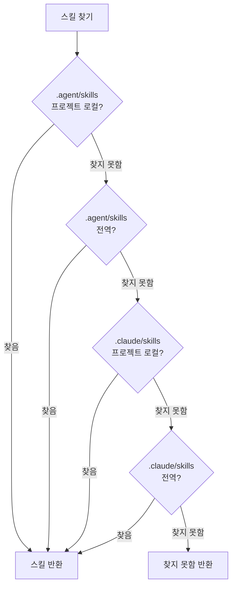

# Universal 모드: 다중 에이전트 환경

## 학습 후 할 수 있는 것

- Universal 모드의 핵심 가치와 설계 목적 이해
- `--universal` 플래그 사용법 마스터
- `.agent/skills`와 `.claude/skills`의 차이 이해
- 4단계 검색 우선순위 규칙 이해
- 다중 에이전트 환경에서 스킬 통합 관리 및 충돌 방지
- Claude Code, Cursor, Windsurf, Aider 등 다중 에이전트에서 동일한 스킬 세트 공유

::: info 사전 지식

본 튜토리얼은 [전역 설치 vs 프로젝트 로컬 설치](../../platforms/global-vs-project/)과 [스킬 동기화 to AGENTS.md](../../start/sync-to-agents/)을 이미 이해하고 있다고 가정합니다. 기본적인 설치 위치와 동기화 프로세스를 알고 있어야 합니다.

:::

---

## 지금 당신의 곤란한 상황

스킬 설치와 동기화 방법은 이미 배웠지만:

- **여러 에이전트가 스킬을 공유하려면?**: Claude Code와 Cursor를 동시에 사용하지만, 각각 스킬을 설치하면 관리가 복잡해짐
- **Claude Code Marketplace 충돌**: 스킬 설치 후 Claude Code 네이티브 플러그인 마켓과 충돌 발생
- **AGENTS.md 위치 불일치**: 서로 다른 에이전트에 필요한 AGENTS.md 경로가 달라 유지 관리 어려움
- **스킬 중복 설치**: 모든 에이전트가 스킬을 각각 설치해야 하므로 디스크 공간 낭비

사실 OpenSkills는 다중 에이전트 환경의 스킬 관리 문제를 해결하기 위해 Universal 모드를 제공합니다.

---

## 언제 이 기법을 사용할 것인가

**Universal 모드 적용 시나리오**:

| 시나리오 | Universal 모드 필요 여부 | 예시 |
|--- | --- | ---|
| **단일 에이전트**(Claude Code만) | ❌ 아니오 | Claude Code만 사용하는 경우, 기본 `.claude/skills` 사용 |
| **다중 에이전트**(Claude Code + 다른 에이전트) | ✅ 예 | Claude Code와 Cursor/Windsurf/Aider를 동시에 사용 |
| **Marketplace 충돌 방지** | ✅ 예 | Claude Code 네이티브 플러그인 마켓과 충돌 피하기 |
| **AGENTS.md 통합 관리** | ✅ 예 | 여러 에이전트가 동일한 AGENTS.md 파일 공유 |

::: tip 권장 방법

- **단일 에이전트는 기본 모드 사용**: Claude Code만 사용할 때, 기본 `.claude/skills`로 설치
- **다중 에이전트는 Universal 모드 사용**: 여러 에이전트를 동시에 사용할 때, `--universal`로 `.agent/skills`에 설치
- **팀 협업 통합 표준**: 팀 내에서 사용할 모드를 명확히 약속하여 혼란 방지

:::

---

## 핵심 아이디어: 통합 디렉토리, 다중 에이전트 공유

OpenSkills는 두 가지 스킬 디렉토리 모드를 제공합니다:

**기본 모드(`.claude/skills`)**:
- Claude Code 전용 설계
- Claude Code Marketplace와 호환
- 설치 위치: `./.claude/skills/` 또는 `~/.claude/skills/`

**Universal 모드(`.agent/skills`)**:
- 다중 에이전트 환경 전용 설계
- Claude Code Marketplace 충돌 방지
- 설치 위치: `./.agent/skills/` 또는 `~/.agent/skills/`

::: info 중요 개념

**Universal 모드**: `--universal` 플래그를 사용하여 스킬을 `.agent/skills/` 디렉토리에 설치하면, 여러 AI 코딩 에이전트(Claude Code, Cursor, Windsurf, Aider 등)가 동일한 스킬 세트를 공유하고 AGENTS.md를 통해 통합 관리할 수 있습니다.

:::

**4단계 검색 우선순위**(소스 `dirs.ts:18-24`):

```typescript
export function getSearchDirs(): string[] {
  return [
    join(process.cwd(), '.agent/skills'),   // 1. Project universal (최고 우선순위)
    join(homedir(), '.agent/skills'),        // 2. Global universal
    join(process.cwd(), '.claude/skills'),  // 3. Project claude
    join(homedir(), '.claude/skills'),       // 4. Global claude
  ];
}
```

**우선순위 설명**:
1. **Project Universal**(최고): `.agent/skills/`가 `.claude/skills/`보다 우선
2. **Global Universal**: 다음으로 전역 `.agent/skills/` 검색
3. **Project Claude**: 그 다음으로 프로젝트 로컬 `.claude/skills/`
4. **Global Claude**(최하): 마지막으로 전역 `.claude/skills/`

---

## 따라해 보세요

### 1단계: Universal 모드로 스킬 설치

**이유**
`--universal` 플래그를 사용하여 스킬을 설치하는 방법을 먼저 익히세요.

터미널을 열고, 모든 프로젝트에서 다음을 실행하세요:

```bash
# Universal 모드로 스킬 설치
npx openskills install anthropics/skills --universal -y

# 스킬 목록 보기
npx openskills list
```

**예상되는 결과**: 스킬 목록의 각 스킬 뒤에 `(project)` 태그가 표시됩니다.

```
  codebase-reviewer         (project)
    Review code changes for issues...

Summary: 3 project, 0 global (3 total)
```

**설명**:
- `--universal` 플래그를 사용하면 스킬이 `./.agent/skills/` 디렉토리에 설치됩니다.
- `list` 명령은 여전히 `(project)` 또는 `(global)` 태그를 표시합니다.
- `.agent/skills/`는 기본 `.claude/skills/`와 충돌하지 않습니다.

---

### 2단계: 스킬 설치 위치 확인

**이유**
스킬 파일의 실제 저장 위치를 확인하고 Universal 모드의 디렉토리 구조를 이해하세요.

프로젝트 루트 디렉토리에서 다음을 실행하세요:

```bash
# Universal 모드의 스킬 디렉토리 보기
ls -la .agent/skills/

# 스킬 디렉토리 내용 보기
ls -la .agent/skills/codebase-reviewer/
```

**예상되는 결과**:

```
.agent/skills/
├── codebase-reviewer/
│   ├── SKILL.md
│   └── .openskills.json    # 설치 메타데이터
├── file-writer/
│   ├── SKILL.md
│   └── .openskills.json
└── ...
```

**설명**:
- Universal 모드의 스킬은 `.agent/skills/` 디렉토리에 설치됩니다.
- 각 스킬은 자체 디렉토리와 메타데이터를 가집니다.
- 이는 기본 `.claude/skills/` 구조와 완전히 동일합니다.

---

### 3단계: 두 모드의 디렉토리 구조 비교

**이유**
실제 비교를 통해 `.claude/skills`와 `.agent/skills`의 차이를 이해하세요.

다음 명령을 실행하세요:

```bash
# 두 모드의 스킬 디렉토리 보기
echo "=== .claude/skills (기본 모드) ==="
ls -la .claude/skills/ 2>/dev/null || echo "디렉토리 존재하지 않음"

echo "=== .agent/skills (Universal 모드) ==="
ls -la .agent/skills/

# 전역 설치 디렉토리 보기
echo "=== ~/.claude/skills (전역 기본) ==="
ls -la ~/.claude/skills/ 2>/dev/null || echo "디렉토리 존재하지 않음"

echo "=== ~/.agent/skills (전역 Universal) ==="
ls -la ~/.agent/skills/ 2>/dev/null || echo "디렉토리 존재하지 않음"
```

**예상되는 결과**:

```
=== .claude/skills (기본 모드) ===
디렉토리 존재하지 않음

=== .agent/skills (Universal 모드) ===
codebase-reviewer
file-writer

=== ~/.claude/skills (전역 기본) ===
git-helper
test-generator

=== ~/.agent/skills (전역 Universal) ===
디렉토리 존재하지 않음
```

**설명**:
- `.claude/skills/`와 `.agent/skills/`는 두 개의 독립적인 디렉토리입니다.
- 동시에 존재할 수 있으며 서로 간섭하지 않습니다.
- 프로젝트 로컬과 전역 두 가지 설치 방식을 지원합니다.

---

### 4단계: 전역 Universal 설치

**이유**
모든 프로젝트에서 사용할 수 있는 전역 Universal 스킬을 설치하는 방법을 이해하세요.

다음을 실행하세요:

```bash
# 전역 Universal로 스킬 설치
npx openskills install anthropics/skills --universal --global -y

# 스킬 목록 보기
npx openskills list
```

**예상되는 결과**:

```
  codebase-reviewer         (project)
    Review code changes for issues...
  file-writer              (global)
    Write files with format...

Summary: 1 project, 2 global (3 total)
```

**설명**:
- `--universal`과 `--global` 플래그를 조합할 수 있습니다.
- `~/.agent/skills/` 디렉토리에 설치됩니다.
- 모든 프로젝트에서 이 스킬들을 사용할 수 있습니다.

---

### 5단계: 4단계 검색 우선순위 확인

**이유**
OpenSkills가 4개의 디렉토리에서 스킬을 찾는 방법을 이해하세요.

다음을 실행하세요:

```bash
# 4개의 위치에 동일한 이름의 스킬 설치(다른 버전)
# 1. Project Universal
npx openskills install anthropics/skills --universal -y
# 2. Global Universal
npx openskills install anthropics/skills --universal --global -y
# 3. Project Claude
npx openskills install anthropics/skills -y
# 4. Global Claude
npx openskills install anthropics/skills --global -y

# 스킬 읽기(Project Universal 버전 우선 사용)
npx openskills read codebase-reviewer | head -5
```

**예상되는 결과**: `.agent/skills/`(Project Universal) 버전의 스킬 내용이 출력됩니다.

**검색 우선순위 시각화**:



**설명**:
- `.agent/skills/`의 우선순위가 `.claude/skills/`보다 높습니다.
- 프로젝트 로컬 우선순위가 전역보다 높습니다.
- 동일한 이름의 스킬이 동시에 존재할 때 Project Universal 버전이 우선 사용됩니다.
- 이렇게 "Universal 우선"의 유연한 구성을 구현할 수 있습니다.

---

### 6단계: Claude Code Marketplace 충돌 방지

**이유**
Universal 모드가 Claude Code Marketplace 충돌을 해결하는 방법을 이해하세요.

다음을 실행하세요:

```bash
# Universal 모드로 스킬 설치
npx openskills install anthropics/skills --universal -y

# AGENTS.md로 동기화
npx openskills sync

# AGENTS.md 보기
cat AGENTS.md
```

**예상되는 결과**: AGENTS.md에 스킬 목록이 포함되어 있으며, Claude Code Marketplace와 충돌하지 않습니다.

**설명**:
- Universal 모드는 `.agent/skills/`를 사용하며, Claude Code의 `.claude/skills/`와 분리됩니다.
- OpenSkills로 설치한 스킬과 Claude Code Marketplace 플러그인 간의 충돌을 방지합니다.
- 여러 에이전트가 동일한 AGENTS.md를 공유할 수 있어 통합 관리가 가능합니다.

---

## 확인점 ✅

다음 확인 항목을 완료하여 본 과정 내용을 마스터했는지 확인하세요:

- [ ] `.claude/skills`와 `.agent/skills` 두 모드를 구분할 수 있음
- [ ] `--universal` 플래그의 기능을 알고 있음
- [ ] 4단계 검색 우선순위 규칙을 이해함
- [ ] 시나리오에 따라 적절한 설치 모드를 선택할 수 있음
- [ ] 다중 에이전트 환경에서 스킬을 통합 관리하는 방법을 알고 있음
- [ ] Universal 모드가 Marketplace 충돌을 방지하는 방법을 이해함

---

## 주의할 점

### 흔한 오류 1: 단일 에이전트에서 Universal 모드 오용

**오류 시나리오**: Claude Code만 사용하는데 Universal 모드를 사용함

```bash
# ❌ 오류: 단일 에이전트에는 Universal 모드가 필요 없음
npx openskills install anthropics/skills --universal
```

**문제**:
- 불필요한 복잡성 증가
- Claude Code Marketplace 플러그인과 협업 불가
- AGENTS.md 위치가 Claude Code의 기대와 다를 수 있음

**올바른 방법**:

```bash
# ✅ 올바름: 단일 에이전트는 기본 모드 사용
npx openskills install anthropics/skills
```

---

### 흔한 오류 2: 다중 에이전트에서 Universal 모드 미사용

**오류 시나리오**: 여러 에이전트를 동시에 사용하는데 Universal 모드를 사용하지 않음

```bash
# ❌ 오류: 각 에이전트가 독립적으로 스킬 설치, 관리 복잡
npx openskills install anthropics/skills  # Claude Code용
npx openskills install anthropics/skills --global  # Cursor용
```

**문제**:
- 스킬 중복 설치, 디스크 공간 낭비
- 다른 에이전트가 사용하는 스킬 버전이 일치하지 않을 수 있음
- AGENTS.md를 각각 유지 관리해야 함

**올바른 방법**:

```bash
# ✅ 올바름: 다중 에이전트는 Universal 모드로 통합 관리
npx openskills install anthropics/skills --universal
# 모든 에이전트가 동일한 스킬 세트와 AGENTS.md를 공유
```

---

### 흔한 오류 3: Universal 모드 검색 우선순위 잊음

**오류 시나리오**: `.claude/skills`와 `.agent/skills`에 동일한 이름의 스킬이 설치되어 있지만, `.claude/skills` 버전을 사용하려고 함

```bash
# .agent/skills와 .claude/skills에 모두 codebase-reviewer가 있음
# .claude/skills 버전을 사용하려고 함
npx openskills install anthropics/skills --universal  # .agent/skills에 새 버전 설치
npx openskills install anthropics/skills  # .claude/skills에 구 버전 설치
npx openskills read codebase-reviewer  # ❌ 여전히 .agent/skills 버전을 읽음
```

**문제**:
- `.agent/skills`의 우선순위가 `.claude/skills`보다 높음
- `.claude/skills`에 새 버전이 설치되어도 여전히 `.agent/skills` 버전을 읽음

**올바른 방법**:

```bash
# 방법 1: .agent/skills 버전 삭제
npx openskills remove codebase-reviewer  # .agent/skills 버전 삭제
npx openskills read codebase-reviewer  # ✅ 이제 .claude/skills 버전을 읽음

# 방법 2: .agent/skills 버전 업데이트
npx openskills update codebase-reviewer  # .agent/skills 버전 업데이트
```

---

### 흔한 오류 4: AGENTS.md 경로 설정 오류

**오류 시나리오**: 여러 에이전트에 필요한 AGENTS.md 경로가 다름

```bash
# Claude Code는 AGENTS.md가 루트 디렉토리에 있기를 기대
# Cursor는 AGENTS.md가 .cursor/ 디렉토리에 있기를 기대
# Windsurf는 AGENTS.md가 .windsurf/ 디렉토리에 있기를 기대
npx openskills sync  # 하나의 AGENTS.md만 생성
```

**문제**:
- 다른 에이전트가 AGENTS.md를 찾지 못함
- 스킬 로드 실패

**올바른 방법**:

```bash
# 다른 에이전트를 위해 다른 위치의 AGENTS.md 생성
npx openskills sync -o AGENTS.md           # Claude Code
npx openskills sync -o .cursor/AGENTS.md    # Cursor
npx openskills sync -o .windsurf/AGENTS.md  # Windsurf
```

---

## 수업 요약

**핵심 요점**:

1. **Universal 모드는 다중 에이전트 환경용**: `--universal`로 `.agent/skills/`에 설치
2. **4단계 검색 우선순위**: Project Universal > Global Universal > Project Claude > Global Claude
3. **Marketplace 충돌 방지**: `.agent/skills/`가 Claude Code의 `.claude/skills/`와 분리
4. **AGENTS.md 통합 관리**: 여러 에이전트가 동일한 AGENTS.md 파일 공유
5. **권장 원칙**: 단일 에이전트는 기본 모드, 다중 에이전트는 Universal 모드

**의사결정 흐름**:

```
[스킬 설치 필요] → [여러 에이전트 사용 중인가?]
                      ↓ 예
              [Universal 모드 사용(--universal)]
                      ↓ 아니오
              [Claude Code만 사용 중인가?]
                      ↓ 예
              [기본 모드 사용(.claude/skills)]
                      ↓ 아니오
              [구체적인 에이전트 문서 확인, 적절한 모드 선택]
```

**기억 팁**:

- **단일 에이전트**: 기본 모드가 가장 간단, Claude Code는 `.claude` 사용
- **다중 에이전트**: Universal 모드로 통합 관리, `.agent/skills`로 충돌 방지

---

## 다음 수업 예고

> 다음 수업에서는 **[사용자 지정 출력 경로](../custom-output-path/)**를 학습합니다.
>
> 배우게 될 내용:
> - `--output/-o` 플래그를 사용하여 AGENTS.md 출력 경로 사용자 지정
> - 다른 에이전트를 위해 다른 위치의 AGENTS.md 생성
> - CI/CD 환경에서 사용자 지정 출력 경로 사용
> - 기존 문서 시스템 통합

---

## 부록: 소스 코드 참조

<details>
<summary><strong>클릭하여 소스 코드 위치 펼치기</strong></summary>

> 업데이트: 2026-01-24

| 기능        | 파일 경로                                                                                          | 행 번호    |
|--- | --- | ---|
| 디렉토리 경로 도구 | [`src/utils/dirs.ts`](https://github.com/numman-ali/openskills/blob/main/src/utils/dirs.ts#L7-L25)     | 7-25    |
| 설치 위치 판단 | [`src/commands/install.ts`](https://github.com/numman-ali/openskills/blob/main/src/commands/install.ts#L84-L92) | 84-92   |
| 명령줄 인자 정의 | [`src/cli.ts`](https://github.com/numman-ali/openskills/blob/main/src/cli.ts#L48)                    | 48      |

**핵심 상수**:
- `.claude/skills`: 기본 스킬 디렉토리(Claude Code 호환)
- `.agent/skills`: 범용 스킬 디렉토리(다중 에이전트 환경)

**핵심 함수**:
- `getSkillsDir(projectLocal, universal)`: 플래그에 따라 스킬 디렉토리 경로 반환
- `getSearchDirs()`: 스킬 검색 디렉토리 목록 반환(4단계 우선순위)

**비즈니스 규칙**:
- Universal 모드는 `.agent/skills/` 디렉토리 사용
- 4단계 검색 우선순위: Project Universal > Global Universal > Project Claude > Global Claude
- `--universal`과 `--global` 플래그 조합 가능

</details>
