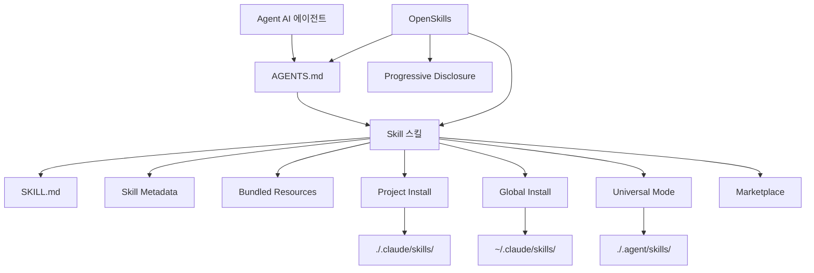

# 용어 사전

본 용어 사전은 OpenSkills와 AI 스킬 시스템의 핵심 개념을 설명하여 전문 용어를 빠르게 이해할 수 있도록 돕습니다.

::: info 안내
본 용어 사전은 알파벳 순으로 정렬되어 있으며, 용어 간 관련성은 정의 내에서 표시됩니다.
:::

---

## A

### Agent (AI 에이전트)

**정의**: AI 에이전트는 코딩 작업을 수행할 수 있는 AI 도구로, Claude Code, Cursor, Windsurf, Aider 등이 있습니다.

**특징**:
- `AGENTS.md` 설정 파일을 읽을 수 있음
- SKILL.md 형식의 스킬 로딩을 지원
- 명령줄을 통해 외부 도구 호출 가능 (예: `npx openskills read`)

**OpenSkills에서의 역할**: OpenSkills를 통해 AGENTS.md를 읽을 수 있는 모든 에이전트가 Anthropic의 스킬 형식을 사용할 수 있습니다.

**관련 용어**: [Skill](#skill), [AGENTS.md](#agentsmd)

---

## B

### Base Directory (기본 디렉토리)

**정의**: 스킬 디렉토리의 전체 경로로, 스킬 내 상대 경로 참조를 해석하는 데 사용됩니다.

**기능**:
- 스킬 디렉토리의 절대 경로 제공
- `references/`, `scripts/`, `assets/` 등 번들 리소스의 상대 경로 해석에 사용

**예시**:
```
Base directory: /path/to/my-first-skill
```

스킬이 `references/skill-format.md`를 참조할 때, 실제 경로는 다음과 같이 해석됩니다:
```
/path/to/my-first-skill/references/skill-format.md
```

**관련 용어**: [Skill](#skill), [Bundled Resources](#bundled-resources)

---

### Bundled Resources (번들 리소스)

**정의**: 스킬 디렉토리에 포함된 리소스 파일로, 스킬 실행에 필요한 상세 정보 또는 도구를 제공합니다.

**유형**:
- **`references/`** - 참조 문서, API 문서 등
- **`scripts/`** - 실행 가능한 스크립트 파일
- **`assets/`** - 템플릿, 예시 파일 등

**용도**:
- 상세 문서를 `references/`로 이동하여 SKILL.md를 간결하게 유지
- 실행 가능한 코드를 `scripts/`에 배치하여 호출이 용이하도록 함
- 템플릿과 예시를 `assets/`에 배치하여 사용자 참조 제공

**예시**:
```
my-skill/
├── SKILL.md
├── references/
│   └── api-docs.md
├── scripts/
│   └── helper.py
└── assets/
    └── template.json
```

**관련 용어**: [Skill](#skill), [SKILL.md](#skillmd)

---

## G

### Global Install (전역 설치)

**정의**: 스킬을 사용자 홈 디렉토리의 `.claude/skills` 디렉토리에 설치하여 모든 프로젝트에서 해당 스킬에 접근할 수 있도록 하는 방법입니다.

**명령 예시**:
```bash
npx openskills install anthropics/skills --global
```

**대상 경로**:
- macOS/Linux: `~/.claude/skills/`
- Windows: `%USERPROFILE%\.claude\skills\`

**적용 시나리오**:
- 여러 프로젝트에서 동일한 스킬을 사용하려는 경우
- 스킬이 프로젝트 저장소에 버전 관리되지 않기를 원하는 경우

**우선순위**: 스킬을 조회할 때, 전역 설치된 스킬은 프로젝트 로컬 설치보다 우선순위가 낮습니다 ([Skill 查找优先级](#skill-查找优先级) 참조).

**관련 용어**: [Project Install](#project-install), [Skill 查找优先级](#skill-查找优先级)

---

## M

### Marketplace (마켓플레이스)

**정의**: 스킬을 게시하고 발견하는 GitHub 저장소입니다.

**Anthropic Marketplace**:
- 공식 스킬 저장소: `anthropics/skills`
- 공식 유지보수 스킬 제공 (예: pdf, git-workflow, skill-creator 등)

**제3자 마켓플레이스**:
- 모든 GitHub 저장소는 스킬 소스로 사용할 수 있음
- 비공개 저장소 지원

**마켓플레이스에서 설치**:
```bash
# Anthropic 공식 마켓플레이스에서 설치
npx openskills install anthropics/skills

# 제3자 저장소에서 설치
npx openskills install your-org/your-skills

# 비공개 저장소에서 설치
npx openskills install git@github.com:your-org/private-skills.git
```

**관련 용어**: [Skill](#skill), [Global Install](#global-install)

---

## O

### OpenSkills

**정의**: OpenSkills는 Anthropic의 스킬 시스템을 위한 범용 로더로, 모든 AI 코딩 에이전트가 표준 SKILL.md 형식의 스킬을 사용할 수 있도록 합니다.

**핵심 가치**:
- **통일된 표준** - 모든 에이전트가 동일한 스킬 형식과 AGENTS.md 설명을 사용
- **점진적 로딩** - 필요할 때만 스킬을 로딩하여 컨텍스트를 간결하게 유지
- **다중 에이전트 지원** - 한 세트의 스킬로 여러 에이전트 서비스
- **오픈소스 친화적** - 로컬 경로와 비공개 git 저장소 지원
- **호환성 강력** - Claude Code 형식과 완전히 호환

**주요 명령**:
- `install` - 스킬 설치
- `list` - 설치된 스킬 목록
- `read` - 스킬 내용 읽기 (AI 에이전트용)
- `sync` - AGENTS.md에 스킬 동기화
- `update` - 설치된 스킬 업데이트
- `manage` / `remove` - 스킬 삭제

**공식 저장소**: https://github.com/numman-ali/openskills

**관련 용어**: [Skill](#skill), [SKILL.md](#skillmd), [AGENTS.md](#agentsmd)

---

## P

### Progressive Disclosure (점진적 공개)

**정의**: 필요할 때만 스킬을 로딩하여 모든 스킬을 한 번에 로딩함으로써 발생하는 컨텍스트 팽창을 피하는 방식입니다.

**작동 방식**:
1. 스킬 정보는 짧은 설명으로 AGENTS.md에 저장됨
2. 사용자가 특정 작업을 요청하면, AI 에이전트가 일치하는 스킬이 있는지 확인
3. 있으면 `npx openskills read <skill-name>`을 통해 전체 스킬 내용을 로딩
4. 스킬 내용은 현재 작업 컨텍스트에서만 유효함

**장점**:
- AI 에이전트의 컨텍스트를 간결하게 유지
- 토큰 사용량 감소
- 응답 속도 향상

**예시**:
```xml
<!-- AGENTS.md에는 짧은 설명만 포함 -->
<available_skills>
  <skill>
    <name>pdf</name>
    <description>Comprehensive PDF manipulation toolkit...</description>
  </skill>
</available_skills>

<!-- 사용자가 PDF 처리를 요청할 때만 전체 내용 로딩 -->
npx openskills read pdf
```

**관련 용어**: [AGENTS.md](#agentsmd), [Skill](#skill)

---

### Project Install (프로젝트 로컬 설치)

**정의**: 스킬을 프로젝트 디렉토리의 `.claude/skills` 또는 `.agent/skills` 디렉토리에 설치하여 스킬이 프로젝트 저장소와 함께 버전 관리되도록 하는 방법입니다.

**명령 예시**:
```bash
# 프로젝트 로컬 설치 (기본)
npx openskills install anthropics/skills

# .agent/skills로 프로젝트 로컬 설치 (범용 모드)
npx openskills install anthropics/skills --universal
```

**대상 경로**:
- 기본: `./.claude/skills/`
- Universal 모드: `./.agent/skills/`

**적용 시나리오**:
- 프로젝트에 특정 스킬이 필요한 경우
- 스킬이 프로젝트 저장소와 함께 버전 관리되기를 원하는 경우
- 팀 협업 시 통일된 스킬 버전 유지

**우선순위**: 스킬을 조회할 때, 프로젝트 로컬 설치된 스킬은 전역 설치보다 우선순위가 높습니다 ([Skill 查找优先级](#skill-查找优先级) 참조).

**관련 용어**: [Global Install](#global-install), [Universal Mode](#universal-mode), [Skill 查找优先级](#skill-查找优先级)

---

## S

### Skill (스킬)

**정의**: AI 에이전트에 특정 작업 수행 지침을 제공하는 문서로, 상세 지침, 단계 및 번들 리소스를 포함합니다.

**핵심 특징**:
- **정적 지침** - 동적 로직이 아닌 텍스트와 리소스만 포함
- **조합 가능** - 여러 스킬을 조합하여 사용 가능
- **버전 관리 가능** - 프로젝트 저장소와 함께 관리

**스킬 구성**:
```
skill-name/
├── SKILL.md              # 스킬 메인 파일
├── .openskills.json      # 설치 메타데이터 (자동 생성)
├── references/           # 참조 문서 (선택)
├── scripts/             # 실행 가능한 스크립트 (선택)
└── assets/              # 템플릿 및 예시 (선택)
```

**사용 시나리오**:
- 사용자가 작업을 요청하면, AI 에이전트가 일치하는 스킬이 있는지 확인
- 있으면 `npx openskills read <name>`으로 스킬을 로딩
- AI 에이전트가 스킬 지침에 따라 작업 완료

**예시 스킬**:
- `pdf` - PDF 처리 도구
- `git-workflow` - Git 워크플로우
- `check-branch-first` - 브랜치 체크

**관련 용어**: [SKILL.md](#skillmd), [Bundled Resources](#bundled-resources), [Agent](#agent)

---

### Skill Metadata (스킬 메타데이터)

**정의**: 스킬 설치 출처 정보를 기록하는 JSON 파일(`.openskills.json`)로, 스킬 업데이트를 지원합니다.

**파일 위치**: 스킬 디렉토리 내 `.openskills.json`

**필드 설명**:
```json
{
  "source": "anthropics/skills",
  "sourceType": "github",
  "repoUrl": "https://github.com/anthropics/skills",
  "subpath": "skills/pdf",
  "installedAt": "2025-01-24T10:30:00.000Z"
}
```

**역할**:
- 스킬 출처 기록 (GitHub, 로컬 경로 등)
- `openskills update` 명령을 통해 소스에서 스킬 새로고침 지원
- 출처가 기록되지 않은 업데이트 필요 스킬 식별

**관련 용어**: [Skill](#skill), [Global Install](#global-install), [Project Install](#project-install)

---

### Skill 조회 우선순위

**정의**: OpenSkills가 스킬을 조회할 때, 여러 디렉토리에서 고정된 우선순위 순서로 검색하는 방식입니다.

**우선순위 순서** (높음에서 낮음):

| 우선순위 | 디렉토리                 | 설치 방식           | 적용 시나리오                     |
| --- | --- | --- | ---|
| 1     | `./.agent/skills/`   | `--universal`      | 다중 에이전트 환경, Claude Code와 충돌 방지 |
| 2     | `~/.agent/skills/`   | `--universal --global` | 다중 에이전트 환경 전역 스킬           |
| 3     | `./.claude/skills/`  | 기본 (프로젝트 로컬)   | 프로젝트 로컬 스킬 (기본 선택)      |
| 4     | `~/.claude/skills/`   | `--global`         | 전역 스킬                     |

**조회 규칙**:
- 우선순위 순서대로 검색
- 첫 번째로 일치하는 스킬을 찾으면 중지
- 프로젝트 로컬 스킬이 동일 이름의 전역 스킬을 덮어씀

**예시**:
```bash
# "pdf"라는 이름의 스킬을 조회
# 1. 먼저 ./.agent/skills/pdf를 확인
# 2. 그다음 ~/.agent/skills/pdf를 확인
# 3. 그다음 ./.claude/skills/pdf를 확인
# 4. 마지막으로 ~/.claude/skills/pdf를 확인
```

**관련 용어**: [Project Install](#project-install), [Global Install](#global-install), [Universal Mode](#universal-mode)

---

### SKILL.md

**정의**: 스킬의 표준 형식 파일로, YAML frontmatter와 Markdown 콘텐츠를 사용하여 스킬의 메타데이터와 지침을 정의합니다.

**파일 형식**:
```markdown
---
name: my-skill
description: When to use this skill
---

# Skill Instructions

Detailed instructions for the AI agent...

## Bundled Resources

See `references/skill-format.md` for details.
```

**필수 필드**:
- `name` - 스킬 이름 (고유 식별자)
- `description` - 스킬 설명 (AGENTS.md에 표시됨)

**선택 필드**:
- `context` - 컨텍스트 힌트 (AI 에이전트가 스킬을 사용하는 방법 안내)

**모범 사례**:
- 명령형/부정형 사용: `"To do X, execute Y"`
- 2인칭 피하기: `"You should..."`로 작성하지 말 것
- 5,000단어 이내로 유지
- 상세 콘텐츠는 `references/` 디렉토리로 이동

**관련 용어**: [Skill](#skill), [AGENTS.md](#agentsmd), [Bundled Resources](#bundled-resources)

---

## U

### Universal Mode (범용 모드)

**정의**: 다중 에이전트 환경에서의 설치 모드로, 스킬을 `.agent/skills/` 디렉토리에 설치하여 Claude Code의 Marketplace와의 충돌을 피합니다.

**명령 예시**:
```bash
npx openskills install anthropics/skills --universal
```

**대상 경로**: `./.agent/skills/` 또는 `~/.agent/skills/` (`--global`과 함께 사용)

**적용 시나리오**:
- Claude Code와 다른 AI 에이전트(예: Cursor, Windsurf)를 동시에 사용하는 경우
- 모든 에이전트가 동일한 스킬 세트를 공유하기를 원하는 경우
- 스킬 설치 충돌을 피하고자 하는 경우

**조회 우선순위**: Universal 모드로 설치된 스킬은 가장 높은 우선순위를 가집니다 ([Skill 查找优先级](#skill-查找优先级) 참조).

**관련 용어**: [Project Install](#project-install), [Skill 查找优先级](#skill-查找优先级)

---

## A

### AGENTS.md

**정의**: AI 에이전트가 읽는 설정 파일로, 사용 가능한 스킬 목록과 사용 안내를 포함하며 XML 형식을 사용합니다.

**파일 위치**: 프로젝트 루트 또는 사용자 정의 경로 (기본값은 프로젝트 루트)

**파일 형식**:
```xml
<skills_system priority="1">

## Available Skills

<!-- SKILLS_TABLE_START -->
<usage>
When users ask you to perform tasks, check if any of the available skills below can help complete the task more effectively.

How to use skills:
- Invoke: `npx openskills read <skill-name>` (run in your shell)
- The skill content will load with detailed instructions
- Base directory provided in output for resolving bundled resources
</usage>

<available_skills>

<skill>
<name>pdf</name>
<description>Comprehensive PDF manipulation toolkit...</description>
<location>project</location>
</skill>

</available_skills>
<!-- SKILLS_TABLE_END -->

</skills_system>
```

**역할**:
- 사용 가능한 스킬 목록 선언
- 스킬 사용 안내 제공
- 스킬 업데이트 시 사용자 정의 콘텐츠 보존 지원

**생성 방식**:
```bash
npx openskills sync
```

**업데이트 방식**:
```bash
# AGENTS.md 재생성 (기존 콘텐츠 덮어씀)
npx openskills sync -y

# 사용자 정의 파일로 출력
npx openskills sync -o custom-agents.md
```

**관련 용어**: [OpenSkills](#openskills), [Skill](#skill), [Progressive Disclosure](#progressive-disclosure)

---

## 용어 관계도

다음은 핵심 용어 간의 연관 관계입니다:



---

## 다음 강의 예고

> 용어 사전이 여기서 마무리됩니다. OpenSkills의 핵심 개념을 이해하셨습니다.
>
> 다음 단계:
> - [빠른 시작](../../start/quick-start/)으로 돌아가 실습하세요
> - [CLI API 참조](../cli-api/)에서 전체 명령을 확인하세요
> - [문제 해결](../../faq/troubleshooting/)에서 일반적인 문제 해결법을 읽어보세요

---

## 부록: 소스 코드 참조

<details>
<summary><strong>클릭하여 소스 코드 위치 보기</strong></summary>

> 업데이트 시간: 2026-01-24

| 용어/기능            | 파일 경로                                                                 | 라인 번호    |
| --- | --- | ---|
| Skill 타입 정의       | [`src/types.ts`](https://github.com/numman-ali/openskills/blob/main/src/types.ts#L1-L6) | 1-6     |
| SkillLocation 타입   | [`src/types.ts`](https://github.com/numman-ali/openskills/blob/main/src/types.ts#L8-L12) | 8-12    |
| InstallOptions 타입  | [`src/types.ts`](https://github.com/numman-ali/openskills/blob/main/src/types.ts#L14-L18) | 14-18   |
| SkillMetadata 타입   | [`src/types.ts`](https://github.com/numman-ali/openskills/blob/main/src/types.ts#L20-L24) | 20-24   |
| 스킬 조회 로직        | [`src/utils/skills.ts`](https://github.com/numman-ali/openskills/blob/main/src/utils/skills.ts) | 전체    |
| 디렉토리 경로 계산        | [`src/utils/dirs.ts`](https://github.com/numman-ali/openskills/blob/main/src/utils/dirs.ts) | 전체    |
| AGENTS.md 생성       | [`src/utils/agents-md.ts`](https://github.com/numman-ali/openskills/blob/main/src/utils/agents-md.ts) | 전체    |
| Skill Metadata 읽기/쓰기  | [`src/utils/skill-metadata.ts`](https://github.com/numman-ali/openskills/blob/main/src/utils/skill-metadata.ts) | 전체    |

**주요 상수**:
- 없음 (로직은 매개변수와 디렉토리 계산 기반)

**주요 함수**:
- `findAllSkills()` - 모든 설치된 스킬 조회
- `findSkill(name)` - 지정된 스킬 조회 (우선순위 기준)
- `getSkillsDir(options)` - 스킬 설치 디렉토리 계산
- `generateSkillsXml(skills)` - AGENTS.md XML 콘텐츠 생성

</details>
