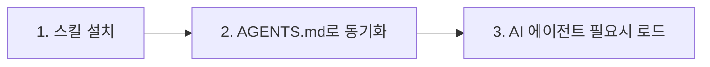

# OpenSkills 빠른 시작: 5분 안에 시작하기

## 학습 후 무엇을 할 수 있나요

이 수업을 완료하면 다음을 수행할 수 있습니다:

- 5분 안에 OpenSkills 설치와 첫 번째 스킬 배포 완료
- `openskills install` 및 `openskills sync` 명령어로 스킬 관리
- AI 에이전트(Claude Code, Cursor, Windsurf 등)가 설치된 스킬을 인식하고 사용하도록 설정
- OpenSkills의 핵심 가치 이해: 통합 스킬 형식, 점진적 로딩, 다중 에이전트 지원

## 현재 겪고 계신 문제점

다음과 같은 문제를 겪어보셨을 수 있습니다:

- **스킬이 에이전트 간에 재사용되지 않음**: Claude Code의 스킬을 Cursor나 Windsurf에서 재사용할 수 없음
- **컨텍스트 폭발**: 너무 많은 스킬을 로드하면 AI 에이전트의 토큰 소모가 너무 빠름
- **스킬 형식 혼란**: 다른 에이전트가 서로 다른 스킬 정의 방식을 사용하여 학습 비용이 높음
- **프라이빗 스킬 공유 불가**: 회사 내부 스킬을 팀원들에게 쉽게 배포할 수 없음

OpenSkills가 이러한 문제를 해결합니다.

## 언제 사용해야 하나요

다음과 같은 경우에 사용합니다:

- AI 코딩 에이전트를 위한 전용 스킬 설치(PDF 처리, Git 워크플로우, 코드 리뷰 등)
- 여러 AI 에이전트 간에 스킬 관리 통일
- 프라이빗 또는 커스텀 스킬 저장소 사용
- AI가 필요에 따라 스킬을 로드하도록 하여 컨텍스트 간결하게 유지

## 🎒 시작 전 준비

::: warning 사전 확인

시작하기 전에 다음을 확인하세요:

1. **Node.js 20.6 이상 버전**
   ```bash
   node --version
   ```
   출력이 `v20.6.0` 이상이어야 합니다

2. **Git 설치됨**(GitHub 저장소에서 스킬을 클론하기 위해 필요)
   ```bash
   git --version
   ```

:::

## 핵심 원리

OpenSkills의 작동 원리는 세 단계로 요약할 수 있습니다:



### 단계 1: 스킬 설치

`openskills install`을 사용하여 GitHub, 로컬 경로 또는 프라이빗 저장소에서 스킬을 설치합니다. 스킬은 프로젝트의 `.claude/skills/` 디렉터리로 복사됩니다.

### 단계 2: AGENTS.md로 동기화

`openskills sync`를 사용하여 AGENTS.md 파일을 생성합니다. 이 파일에는 스킬 목록의 XML 태그가 포함됩니다. AI 에이전트는 이 파일을 읽어 사용 가능한 스킬을 파악합니다.

### 단계 3: AI 에이전트 필요시 로드

사용자가 특정 작업을 요청할 때 AI 에이전트는 `npx openskills read <skill-name>`을 통해 해당 스킬 내용을 동적으로 로드합니다. 모든 스킬을 한 번에 로드하는 것이 아닙니다.

::: info 왜 "점진적 로딩"인가요?

전통적인 방식: 모든 스킬을 컨텍스트에 미리 로드 → 토큰 소모 큼, 응답 느림
OpenSkills: 필요 시 로드 → 필요한 스킬만 로드 → 컨텍스트 간결, 응답 빠름

:::

---

## 따라해 보세요

이제 설치 및 사용 프로세스를 단계별로 완료해 봅시다.

### 1단계: 프로젝트 디렉터리로 이동

먼저 개발 중인 프로젝트 디렉터리로 이동합니다:

```bash
cd /path/to/your/project
```

**이유**

OpenSkills는 기본적으로 스킬을 프로젝트의 `.claude/skills/` 디렉터리에 설치합니다. 이렇게 하면 스킬이 프로젝트 버전 관리와 함께 저장되고 팀원들도 공유할 수 있습니다.

**다음을 확인해야 합니다**:

프로젝트 디렉터리에는 다음 중 하나가 포함되어 있어야 합니다:

- `.git/` (Git 저장소)
- `package.json` (Node.js 프로젝트)
- 기타 프로젝트 파일

::: tip 권장 사항

새 프로젝트인 경우에도 먼저 Git 저장소를 초기화하는 것이 좋습니다. 스킬 파일을 더 잘 관리할 수 있습니다.

:::

---

### 2단계: 첫 번째 스킬 설치

다음 명령어를 사용하여 Anthropic 공식 스킬 저장소에서 스킬을 설치합니다:

```bash
npx openskills install anthropics/skills
```

**이유**

`anthropics/skills`는 Anthropic이 공식적으로 관리하는 스킬 저장소로, 고품질 스킬 예제가 포함되어 있어 처음 체험하기에 적합합니다.

**다음을 확인해야 합니다**:

명령어가 대화형 선택 인터페이스를 시작합니다:

```
? Select skills to install: (Press <space> to select, <a> to toggle all, <i> to invert selection, and <enter> to proceed)
❯ ◉ pdf                 Comprehensive PDF manipulation toolkit for extracting text and tables...
  ◯ check-branch-first  Git workflow: Always check current branch before making changes...
  ◯ git-workflow        Git workflow: Best practices for commits, branches, and PRs...
  ◯ skill-creator       Guide for creating effective skills...
```

스페이스바를 사용하여 설치할 스킬을 선택한 다음 Enter 키를 눌러 확인합니다.

::: tip 팁

처음에는 1-2개의 스킬(예: `pdf`와 `git-workflow`)만 선택하는 것이 좋습니다. 프로세스에 익숙해진 후 더 많은 스킬을 설치하세요.

:::

**다음을 확인해야 합니다**(설치 성공 후):

```
✓ Installed: pdf
✓ Installed: git-workflow

Skills installed to: /path/to/your/project/.claude/skills/

Next steps:
  Run: npx openskills sync
  This will update AGENTS.md with your installed skills
```

---

### 3단계: 스킬을 AGENTS.md로 동기화

이제 동기화 명령어를 실행합니다:

```bash
npx openskills sync
```

**이유**

`sync` 명령어는 AGENTS.md 파일을 생성합니다. 이 파일에는 스킬 목록의 XML 태그가 포함됩니다. AI 에이전트는 이 파일을 읽어 사용 가능한 스킬을 파악합니다.

**다음을 확인해야 합니다**:

```
? Select skills to sync: (Press <space> to select, <a> to toggle all, <i> to invert selection, and <enter> to proceed)
❯ ◉ pdf                 [project]
  ◯ git-workflow        [project]
```

마찬가지로 스페이스바를 사용하여 동기화할 스킬을 선택한 다음 Enter 키를 눌러 확인합니다.

**다음을 확인해야 합니다**(동기화 성공 후):

```
✓ Synced: pdf
✓ Synced: git-workflow

Updated: AGENTS.md
```

---

### 4단계: AGENTS.md 파일 확인

생성된 AGENTS.md 파일을 확인합니다:

```bash
cat AGENTS.md
```

**다음을 확인해야 합니다**:

```xml
<skills_system priority="1">

## Available Skills

<!-- SKILLS_TABLE_START -->
<usage>
When users ask you to perform tasks, check if any of available skills below can help complete task more effectively.

How to use skills:
- Invoke: `npx openskills read <skill-name>` (run in your shell)
- The skill content will load with detailed instructions
- Base directory provided in output for resolving bundled resources

Usage notes:
- Only use skills listed in <available_skills> below
- Do not invoke a skill that is already loaded in your context
</usage>

<available_skills>

<skill>
<name>pdf</name>
<description>Comprehensive PDF manipulation toolkit for extracting text and tables...</description>
<location>project</location>
</skill>

<skill>
<name>git-workflow</name>
<description>Git workflow: Best practices for commits, branches, and PRs...</description>
<location>project</location>
</skill>

</available_skills>
<!-- SKILLS_TABLE_END -->

</skills_system>
```

---

### 5단계: 설치된 스킬 보기

`list` 명령어를 사용하여 설치된 스킬을 확인합니다:

```bash
npx openskills list
```

**다음을 확인해야 합니다**:

```
Installed Skills:

pdf              [project]
  Comprehensive PDF manipulation toolkit for extracting text and tables...

git-workflow     [project]
  Git workflow: Best practices for commits, branches, and PRs...

Total: 2 skills (project: 2, global: 0)
```

**다음을 확인해야 합니다**(설명):

- 왼쪽에 스킬 이름
- `[project]` 태그는 프로젝트 로컬에 설치된 스킬임을 나타냄
- 아래에 스킬 설명이 표시됨

---

## 체크포인트 ✅

위 단계를 완료한 후 다음을 확인하세요:

- [ ] `.claude/skills/` 디렉터리가 생성되었고 설치한 스킬이 포함되어 있음
- [ ] `AGENTS.md` 파일이 생성되었고 스킬 목록의 XML 태그가 포함되어 있음
- [ ] `openskills list`를 실행하면 설치된 스킬을 볼 수 있음

모든 검사를 통과하면 축하합니다! OpenSkills를 성공적으로 설치하고 구성했습니다.

---

## 문제 해결

### 문제 1: `npx` 명령어를 찾을 수 없음

**오류 메시지**:

```
command not found: npx
```

**원인**: Node.js가 설치되지 않았거나 PATH에 구성되지 않음

**해결 방법**:

1. Node.js를 다시 설치합니다([nvm](https://github.com/nvm-sh/nvm)을 사용하여 Node.js 버전을 관리하는 것이 좋습니다)
2. 설치 후 터미널을 다시 시작합니다

---

### 문제 2: 설치 시 네트워크 시간 초과

**오류 메시지**:

```
Error: git clone failed
```

**원인**: GitHub 액세스가 제한되었거나 네트워크가 불안정함

**해결 방법**:

1. 네트워크 연결 확인
2. 필요한 경우 프록시 구성:
   ```bash
   git config --global http.proxy http://proxy.example.com:8080
   ```
3. 미러 사용(있는 경우)

---

### 문제 3: 권한 오류

**오류 메시지**:

```
Error: EACCES: permission denied
```

**원인**: 대상 디렉터리에 쓰기 권한이 없음

**해결 방법**:

1. 디렉터리 권한 확인:
   ```bash
   ls -la .claude/
   ```
2. 디렉터리가 없으면 먼저 생성:
   ```bash
   mkdir -p .claude/skills
   ```
3. 권한이 부족하면 권한 수정(주의해서 사용):
   ```bash
   chmod -R 755 .claude/
   ```

---

## 요약

이 수업에서는 다음을 학습했습니다:

1. **OpenSkills의 핵심 가치**: 통합 스킬 형식, 점진적 로딩, 다중 에이전트 지원
2. **3단계 워크플로우**: 스킬 설치 → AGENTS.md로 동기화 → AI 에이전트 필요시 로드
3. **기본 명령어**:
   - `npx openskills install <source>` - 스킬 설치
   - `npx openskills sync` - 스킬을 AGENTS.md로 동기화
   - `npx openskills list` - 설치된 스킬 보기
4. **일반적인 문제 해결**: 네트워크 문제, 권한 문제 등

이제 AI 에이전트가 이러한 스킬을 사용할 수 있습니다. AI 에이전트가 PDF 처리나 Git 작업을 수행해야 할 때 `npx openskills read <skill-name>`을 자동으로 호출하여 해당 스킬 내용을 로드합니다.

---

## 다음 수업 미리보기

> 다음 수업에서는 **[OpenSkills란 무엇인가요?](../what-is-openskills/)**를 학습합니다.
>
> 다음을 학습하게 됩니다:
> - OpenSkills와 Claude Code의 관계
> - 스킬 시스템의 핵심 개념
> - MCP가 아닌 CLI를 선택한 이유

---

## 부록: 소스 코드 참조

<details>
<summary><strong>클릭하여 소스 코드 위치 확인</strong></summary>

> 업데이트 날짜: 2026-01-24

### 핵심 기능

| 기능            | 파일 경로                                                                                     | 행 번호      |
|--- | --- | ---|
| 스킬 설치        | [`src/commands/install.ts`](https://github.com/numman-ali/openskills/blob/main/src/commands/install.ts) | 83-424    |
| AGENTS.md로 동기화 | [`src/commands/sync.ts`](https://github.com/numman-ali/openskills/blob/main/src/commands/sync.ts)     | 18-109    |
| 스킬 목록        | [`src/commands/list.ts`](https://github.com/numman-ali/openskills/blob/main/src/commands/list.ts)     | 7-43      |
| 모든 스킬 찾기    | [`src/utils/skills.ts`](https://github.com/numman-ali/openskills/blob/main/src/utils/skills.ts)     | 30-64     |
| XML 생성        | [`src/utils/agents-md.ts`](https://github.com/numman-ali/openskills/blob/main/src/utils/agents-md.ts) | 23-93     |
| 디렉터리 경로 도구    | [`src/utils/dirs.ts`](https://github.com/numman-ali/openskills/blob/main/src/utils/dirs.ts)        | 18-25     |

### 핵심 함수

**install.ts**
- `installSkill(source, options)` - 메인 설치 함수, GitHub, 로컬 경로 및 프라이빗 저장소 지원
- `isLocalPath(source)` - 로컬 경로인지 확인
- `isGitUrl(source)` - Git URL인지 확인
- `getRepoName(repoUrl)` - Git URL에서 저장소 이름 추출
- `isPathInside(targetPath, targetDir)` - 경로 순회 보안 검사

**sync.ts**
- `syncAgentsMd(options)` - 스킬을 AGENTS.md로 동기화, 대화형 선택 지원
- 사용자 정의 출력 경로 지원(`--output` 플래그)
- 현재 파일에서 이미 활성화된 스킬 사전 선택

**agents-md.ts**
- `parseCurrentSkills(content)` - AGENTS.md에서 현재 스킬 구문 분석
- `generateSkillsXml(skills)` - Claude Code 형식의 XML 생성
- `replaceSkillsSection(content, xml)` - 파일의 스킬 섹션 교체

**skills.ts**
- `findAllSkills()` - 모든 설치된 스킬 찾기, 우선순위별 중복 제거
- `findSkill(skillName)` - 지정된 스킬 찾기
- 심볼릭 링크 감지 및 중복 제거 지원

**dirs.ts**
- `getSkillsDir(projectLocal, universal)` - 스킬 디렉터리 경로 가져오기
- `getSearchDirs()` - 검색 디렉터리 목록 반환(우선순위: .agent 프로젝트 → .agent 전역 → .claude 프로젝트 → .claude 전역)

### 중요한 상수

- `.claude/skills/` - 기본 프로젝트 로컬 설치 경로
- `.agent/skills/` - 유니버설 모드 설치 경로
- `~/.claude/skills/` - 전역 설치 경로
- `AGENTS.md` - 기본 동기화 출력 파일

</details>
