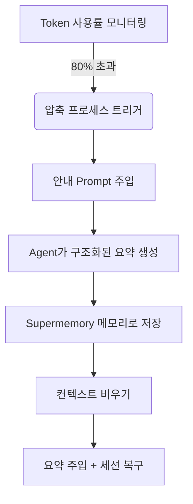

# 선점형 압축 원리: 컨텍스트 망각 방지

## 학습 완료 후 할 수 있는 것

이 수업을 완료하면 다음을 수행할 수 있습니다:
1.  **이해**: 왜 긴 세션에서 Agent가 "둔해지는"지와 Supermemory가 이 문제를 어떻게 해결하는지.
2.  **마스터**: 선점형 압축(Preemptive Compaction)의 트리거 조건과 워크플로우.
3.  **설정**: 프로젝트에 적합한 압축 임계값을 설정하여 비용과 메모리 품질을 균형 있게.
4.  **확인**: 압축이 정상 작동하는지 확인하고, 생성된 세션 요약을 보기.

## 현재 상황

AI와 페어 프로그래밍을 할 때 다음 상황을 겪을 수 있습니다:
*   **대화하다가 "망각"**: 긴 리팩토링 작업 중 Agent가 갑자기 처음에 정한 변수 명명 규칙을 잊음.
*   **세션 재시작 강요**: 컨텍스트 윈도우(Context Window)가 꽉 차서, IDE가 기록을 지워야 한다고 알려줌. 완료된 모든 작업의 컨텍스트를 잃게 됨.
*   **요약 품질 저하**: 일반적인 자동 압축은 단순히 잘라내거나 불명확한 요약만 하여, "다음 단계가 무엇인가"에 대한 핵심 정보를 잃음.

## 언제 이 방법을 사용할까요

*   **대형 리팩토링** 또는 **복잡한 기능 개발**을 수행하며 세션이 길어질 것으로 예상될 때.
*   사용하는 모델의 컨텍스트 윈도우가 작을 때(예: 32k/128k), 오버플로우 발생하기 쉬울 때.
*   컨텍스트를 지운 후에도 Agent가 "우리가 어디까지 왔나"를 정확히 기억하기를 바랄 때.

---

## 핵심 아이디어: 선점형 vs 수동형

전통적인 컨텍스트 관리는 종종 **수동**입니다: 컨텍스트가 완전히 꽉 차면(100%)에야 이전 메시지를 삭제하도록 강제됩니다. 이는 하드 디스크가 꽉 차야 파일을 지우는 것과 같아, 늦을 수 있습니다.

Supermemory는 **선점형 압축(Preemptive Compaction)**을 채택:

1.  **미리 개입**: 기본적으로 Token 사용률이 **80%**에 도달할 때 트리거하여, 생각하고 요약할 충분한 공간 확보.
2.  **구조화된 안내**: Agent가 요약을 아무렇게나 작성하도록 두지 않고, 특정 Prompt를 주입하여 "목표-진행-할 일" 형식으로 요약을 강제.
3.  **메모리 영구 저장**: 생성된 요약은 현재 세션 복구뿐만 아니라, `conversation` 유형의 메모리로 저장되어 향후 검색 가능.

### 워크플로우 다이어그램



---

## 트리거 메커니즘 상세

Supermemory는 각 세션의 Token 사용 상황을 실시간 모니터링합니다. 압축 프로세스는 다음 세 가지 강력한 조건에 의해 트리거:

### 1. Token 사용률 임계값
기본적으로, 총 Token 수(입력 + 출력 + 캐시)가 모델 상한의 **80%**를 초과할 때 트리거.

*   **설정 항목**: `compactionThreshold`
*   **기본값**: `0.80`
*   **소스 코드**: [`src/services/compaction.ts`](https://github.com/supermemoryai/opencode-supermemory/blob/main/src/services/compaction.ts#L11)

### 2. 최소 Token 제한
짧은 세션에서 오작동을 방지하기 위해(예: 모델 컨텍스트가 크지만 몇 문장만 대화), 시스템은 하한을 하드코딩했습니다. 사용량이 **50,000 Tokens**를 초과할 때만 압축을 고려.

*   **상수**: `MIN_TOKENS_FOR_COMPACTION`
*   **값**: `50,000`
*   **소스 코드**: [`src/services/compaction.ts`](https://github.com/supermemoryai/opencode-supermemory/blob/main/src/services/compaction.ts#L12)

### 3. 쿨다운 시간
연속 트리거로 인한 무한 루프를 방지하기 위해, 두 번의 압축 간에 최소 **30초** 간격 유지.

*   **상수**: `COMPACTION_COOLDOWN_MS`
*   **값**: `30,000` (ms)
*   **소스 코드**: [`src/services/compaction.ts`](https://github.com/supermemoryai/opencode-supermemory/blob/main/src/services/compaction.ts#L13)

---

## 구조화된 요약 템플릿

압축이 트리거될 때, Supermemory는 Agent에 특수한 System Prompt(`[COMPACTION CONTEXT INJECTION]`)를 주입하여 요약이 다음 5개 부분을 포함하도록 강제:

| 섹션 | 내용 설명 | 목적 |
|--- | --- | ---|
| **1. User Requests** | 사용자의 원래 요구사항(원문 유지) | 요구사항 드리프트 방지 |
| **2. Final Goal** | 최종적으로 달성하려는 목표 | 최종 상태 명확히 |
| **3. Work Completed** | 완료된 작업, 수정된 파일 | 중복 노동 방지 |
| **4. Remaining Tasks** | 남은 할 일 | 다음 행동 명확히 |
| **5. MUST NOT Do** | 명시적으로 금지된 사항, 실패한 시도 | 동일한 실수 방지 |

::: details 주입된 Prompt 소스 코드 보기
```typescript
// src/services/compaction.ts

return `[COMPACTION CONTEXT INJECTION]

When summarizing this session, you MUST include the following sections in your summary:

## 1. User Requests (As-Is)
- List all original user requests exactly as they were stated
...

## 2. Final Goal
...

## 3. Work Completed
...

## 4. Remaining Tasks
...

## 5. MUST NOT Do (Critical Constraints)
...
This context is critical for maintaining continuity after compaction.
`;
```
:::

---

## 함께 따라하세요: 설정과 확인

### 1단계: 압축 임계값 조정(선택)

80%가 너무 빠르거나 늦다고 느껴지면, `~/.config/opencode/supermemory.jsonc`에서 조정 가능.

```jsonc
// ~/.config/opencode/supermemory.jsonc
{
  // ... 기타 설정
  "compactionThreshold": 0.90
}
```

::: warning 충돌 경고
`oh-my-opencode` 또는 다른 컨텍스트 관리 플러그인이 설치된 경우, 내장된 압축 기능(예: `context-window-limit-recovery`)을 **반드시 비활성화**해야 합니다. 그렇지 않으면 이중 압축 또는 로직 충돌이 발생할 수 있습니다.
:::

### 2단계: 압축 트리거 관찰

긴 세션에서 임계값에 도달하면, IDE 우하단의 Toast 알림에 주목하세요.

**다음을 보아야 합니다**:

1.  **경고 알림**:
    > "Preemptive Compaction: Context at 81% - compacting with Supermemory context..."
    
    이때 시스템이 요약을 생성 중.

2.  **완료 알림**:
    > "Compaction Complete: Session compacted with Supermemory context. Resuming..."
    
    이때 컨텍스트가 비워지고, 새로운 요약이 주입됨.

### 3단계: 메모리 저장 확인

압축 완료 후, 생성된 요약은 자동으로 Supermemory에 저장됩니다. CLI로 확인 가능.

**작업**:
터미널에서 다음 명령어를 실행하여 최근 메모리 확인:

```bash
opencode run supermemory list --scope project --limit 1
```

**다음을 보아야 합니다**:
유형이 `conversation`인 메모리 하나가 보이며, 내용은 방금 생성된 구조화된 요약.

```json
{
  "id": "mem_123abc",
  "content": "[Session Summary]\n## 1. User Requests\n...",
  "type": "conversation",
  "scope": "opencode_project_..."
}
```

---

## 자주 묻는 질문(FAQ)

### Q: 세션이 긴데 압축이 트리거되지 않는 이유는 무엇인가요?
**A**: 다음을 확인:
1.  **총 Token 수**: 50,000 Tokens를 초과했나요? (짧은 세션은 비율이 높아도 트리거되지 않음)
2.  **모델 제한**: OpenCode가 현재 모델의 컨텍스트 상한을 올바르게 인식했나요? 인식 실패 시 기본값 200k로 되돌아가 비율 계산이 낮아질 수 있음.
3.  **쿨다운 시간**: 마지막 압축으로부터 30초 미만인가요?

### Q: 압축 후 요약이 Token을 얼마나 차지하나요?
**A**: 요약의 상세도에 따라 달라지지만, 보통 500-2000 Tokens 사이. 원본 100k+ 컨텍스트에 비하면 상당한 절약.

### Q: 압축을 수동으로 트리거할 수 있나요?
**A**: 현재 버전(v1.0)에서는 수동 트리거를 지원하지 않으며, 알고리즘에 의해 자동 관리.

---

## 이 수업 요약

선점형 압축은 Supermemory의 "장거리 비밀"입니다. **미리 개입**과 **구조화된 요약**을 통해 선형적인 대화 흐름을 정밀한 메모리 스냅샷으로 변환합니다. 이는 컨텍스트 오버플로우 문제를 해결할 뿐만 아니라, Agent가 "망각"(컨텍스트 비우기) 후에도 스냅샷을 읽어 이전 작업을 원활하게 이어갈 수 있게 합니다.

## 다음 수업 예고

> 다음 수업에서 **[심층 설정 상세](../configuration/index.md)**를 학습합니다.
>
> 배우게 될 내용:
> - 메모리 저장 경로 사용자 정의
> - 검색 결과 수 제한 설정
> - 프라이버시 필터링 규칙 조정

---

## 부록: 소스 코드 참조

<details>
<summary><strong>소스 코드 위치 보려면 클릭</strong></summary>

> 업데이트: 2026-01-23

| 기능 | 파일 경로 | 행 번호 |
|--- | --- | ---|
| 임계값 상수 정의 | [`src/services/compaction.ts`](https://github.com/supermemoryai/opencode-supermemory/blob/main/src/services/compaction.ts#L11-L14) | 11-14 |
| 안내 Prompt 생성 | [`src/services/compaction.ts`](https://github.com/supermemoryai/opencode-supermemory/blob/main/src/services/compaction.ts#L58-L98) | 58-98 |
| 트리거 감지 로직 | [`src/services/compaction.ts`](https://github.com/supermemoryai/opencode-supermemory/blob/main/src/services/compaction.ts#L317-L358) | 317-358 |
| 요약 저장 로직 | [`src/services/compaction.ts`](https://github.com/supermemoryai/opencode-supermemory/blob/main/src/services/compaction.ts#L294-L315) | 294-315 |
| 설정 항목 정의 | [`src/config.ts`](https://github.com/supermemoryai/opencode-supermemory/blob/main/src/config.ts#L22) | 22 |

**핵심 상수**:
- `DEFAULT_THRESHOLD = 0.80`: 기본 트리거 임계값
- `MIN_TOKENS_FOR_COMPACTION = 50_000`: 최소 트리거 Token 수
- `COMPACTION_COOLDOWN_MS = 30_000`: 쿨다운 시간(밀리초)

</details>
