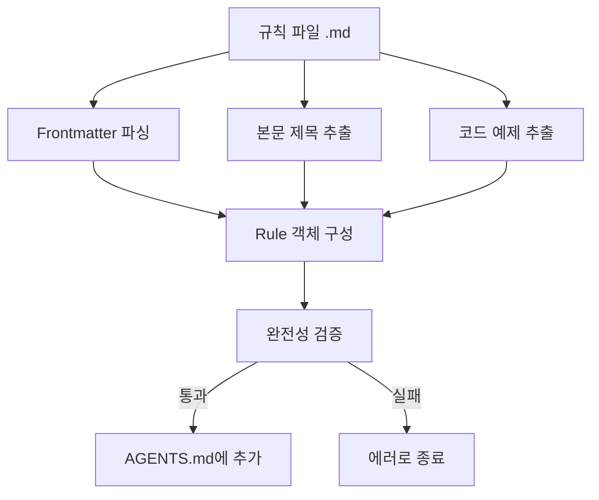

# React 최적 규칙 작성

## 학습 후 할 수 있는 것

- 처음부터 Agent Skills 규격에 맞는 React 성능 최적화 규칙 작성
- _template.md 템플릿을 사용하여 빠르게 규칙 파일 생성
- 규칙 분류를 위해 impact 레벨(CRITICAL/HIGH/MEDIUM) 올바르게 선택
- 이해하기 쉬운 Incorrect/Correct 코드 비교 예제 작성
- `pnpm validate`로 규칙 완전성 검증

## 현재 문제점

이미 Agent Skills의 React 성능 최적화 규칙 라이브러리를 사용하여 코드를 감사했지만, 일부 성능 최적화 패턴이 커버되지 않는 것을 발견했습니다. 자신의 규칙을 기여하고 싶지만:

- 규칙 파일이 어떤 형식이어야 하는지 모름
- impact 레벨을 어떻게 선택해야 할지 불확실
- 작성한 코드 예제가 표준을 따르지 않아 검증 실패
- 규칙이 거부되거나 올바르게 파싱되지 않을까 걱정

## 언제 이 방법을 사용해야 하는가

규칙 작성에 적합한 시나리오:

- 프로젝트에서 성능 문제를 발견하여 재사용 가능한 규칙으로 만들고 싶을 때
- 팀에 특정 React 최적화 패턴이 있어 Agent가 적용하길 원할 때
- React 공식 문서나 Vercel 엔지니어링 팀에서 새로운 기술을 배워 커뮤니티와 공유하고 싶을 때

적합하지 않은 시나리오:

- 간단한 코드 스타일 문제(ESLint 규칙 사용)
- 성능과 관련 없는 기능적 제안(문서나 주석 사용)

## 핵심 개념

규칙 파일은 Markdown 형식이며 **3단 구조**를 따릅니다:

1. **Frontmatter**: 규칙의 메타데이터(title, impact, tags)
2. **본문 제목**: 규칙의 표시 이름과 impact 설명
3. **코드 예제**: `**Incorrect:**`와 `**Correct:**` 비교 표시



**핵심 개념**:

::: info Impact Level(영향 레벨)
Impact는 규칙이 문서에서 정렬되는 위치를 결정합니다. 레벨은 높음에서 낮음:
- **CRITICAL**: 중요한 병목(폭포 제거, 번들 최적화)
- **HIGH**: 중요한 개선(서버 측 성능)
- **MEDIUM-HIGH**: 중-높은 우선순위(클라이언트 측 데이터 가져오기)
- **MEDIUM**: 중간 개선(re-render 최적화)
- **LOW-MEDIUM**: 낮-중 우선순위(JavaScript 마이크로 최적화)
- **LOW**: 점진적 개선(고급 모드)
:::

::: info kebab-case 명명
파일명은 하이픈으로 구분된 소문자여야 합니다(예: `async-parallel.md`). 파일명의 접두사(첫 번째 `-` 이전 부분)가 규칙이 속한 장을 결정합니다:
- `async-*` → 1장(폭포 제거)
- `bundle-*` → 2장(번들 최적화)
- `rerender-*` → 5장(re-render 최적화)
:::

## 🎒 시작 전 준비

::: warning 사전 확인
- [Agent Skills 입문](../../start/getting-started/) 완료
- 기본 React 성능 개념 이해(re-render, waterfall, bundle 등)
- 저장소 복제 완료: `cd source/vercel-labs/agent-skills`
- 의존성 설치 완료: `pnpm install`
:::

## 따라해 보세요

### 1단계: 템플릿 파일 복사

**이유**
템플릿을 사용하면 형식이 올바르고 필수 필드를 누락하지 않을 수 있습니다.

**작업**:

```bash
cd skills/react-best-practices/rules
cp _template.md my-new-rule.md
```

**확인해야 할 것**: `my-new-rule.md` 파일이 생성되고 내용이 템플릿과 동일해야 합니다.

### 2단계: Frontmatter 메타데이터 작성

**이유**
Frontmatter는 규칙의 제목, 영향 레벨, 분류 태그를 정의하며 파서의 첫 번째 관문입니다.

**`my-new-rule.md`의 frontmatter 부분 편집**:

```yaml
---
title: Use React.lazy for Code Splitting
impact: CRITICAL
impactDescription: 초기 번들 50-70% 감소
tags: bundle, code-splitting, lazy-loading, performance
---
```

**필드 설명**:

| 필드 | 필수 | 설명 | 예시 |
|--- |---|---|---|
| `title` | ✅ | 규칙의 간단한 제목 | `Promise.all() for Independent Operations` |
| `impact` | ✅ | 영향 레벨(6개 열거값) | `CRITICAL` / `HIGH` / `MEDIUM` 등 |
| `impactDescription` | ⭕ | 영향 크기 설명 | `2-10× improvement` |
| `tags` | ⭕ | 쉼표로 구분된 태그 | `async, parallelization, promises` |

**확인해야 할 것**: frontmatter가 작성한 내용으로 업데이트되어야 합니다.

### 3단계: 본문 제목과 설명 작성

**이유**
본문 제목은 최종 문서에 표시되며 설명 부분은 사용자가 규칙의 의미를 이해하도록 도와줍니다.

**frontmatter 뒤에 본문 추가**

```markdown
## Use React.lazy for Code Splitting

**Impact: CRITICAL (50-70% reduction in initial bundle)**

Code split large components using `React.lazy()` to reduce the initial bundle size. Components are loaded on-demand when needed.
```

**작성 요점**:

- H2 제목은 frontmatter의 `title` 사용
- **Impact:** 행은 `**Impact: LEVEL (description)**` 형식 사용
- 규칙의 목적과 성능 이득을 간결하게 설명

### 4단계: Incorrect 및 Correct 예제 작성

**이유**
비교 예제는 규칙의 핵심이며 "문제 코드"와 "올바른 방법"을 직접 보여줍니다.

**본문 뒤에 코드 예제 추가**

````markdown
**Incorrect (loads entire bundle on initial page):**

```typescript
import HeavyChart from './HeavyChart'

function Dashboard() {
  return <HeavyChart />
}
```

**Correct (loads on-demand when needed):**

```typescript
import { lazy, Suspense } from 'react'

const HeavyChart = lazy(() => import('./HeavyChart'))

function Dashboard() {
  return (
    <Suspense fallback={<LoadingSpinner />}>
      <HeavyChart />
    </Suspense>
  )
}
```
````

**예제 작성 표준**:

| 요구사항 | 설명 |
|--- |---|
| **레이블 형식** | `**Incorrect:**` 또는 `**Incorrect (description):**`(괄호 선택사항) |
| **괄호 내용** | 선택사항, 왜 틀렸는지/왜 맞는지 짧게 설명 |
| **코드 블록** | `\`\`\`typescript` 또는 `\`\`\`tsx` 사용 |
| **예제 수량** | 적어도 하나의 bad 또는 good 유형 예제 포함 |

**확인해야 할 것**: 코드 블록이 올바르게 렌더링되고 구문 강조가 있어야 합니다.

### 5단계: 참고문헌 추가(선택)

**이유**
참고문헌은 규칙에 권위 있는 출처를 제공하여 신뢰성을 높입니다.

**파일 끝에 추가**

```markdown
Reference: [React.lazy and Suspense](https://react.dev/reference/react/lazy)
```

**지원 형식**:

```markdown
Reference: [링크 텍스트](URL)

### 여러 참고문헌
References:
- [React.lazy documentation](https://react.dev/reference/react/lazy)
- [Code splitting patterns](https://web.dev/code-splitting-suspense/)
```

### 6단계: 규칙 파일 검증

**이유**
`pnpm validate`는 규칙의 완전성을 검사하여 올바르게 파싱될 수 있는지 확인합니다.

**검증 명령 실행**

```bash
cd packages/react-best-practices-build
pnpm validate
```

**확인해야 할 것**:

```bash
Validating rule files...
✓ All 58 rule files are valid
```

검증 실패 시 자세한 에러 메시지가 표시됩니다:

```bash
✗ Validation failed:

  my-new-rule.md: Missing or empty title
```

**일반적인 검증 에러**:

| 에러 메시지 | 원인 | 수정 방법 |
|--- |---|---|
| `Missing or empty title` | frontmatter에 `title` 필드가 없음 | `title: Your Title` 추가 |
| `Missing examples (need at least one bad and one good example)` | examples 배열이 비어 있음 | 적어도 하나의 예제(코드 블록 포함) 추가 |
| `Missing code examples` | 예제 레이블이 있지만 실제 코드가 없음 | 레이블 뒤에 코드 블록 추가(`\`\`\`typescript`) |
| `Missing bad/incorrect or good/correct examples` | 레이블에 bad/good/incorrect/correct 등 키워드가 없음 | `**Incorrect:**`, `**Correct:**`, `**Example:**` 등 적법한 레이블 사용 |
| `Invalid impact level: &lt;value&gt;...` | `impact` 값이 열거값에 없음 | 전체 대문자 사용: `CRITICAL`/`HIGH`/`MEDIUM-HIGH`/`MEDIUM`/`LOW-MEDIUM`/`LOW` |
| `Failed to parse` | Markdown 형식 에러 | frontmatter가 `---`로 둘러싸여 있는지 확인 |

### 7단계: 빌드하고 결과 확인

**이유**
`pnpm build`는 모든 규칙을 `AGENTS.md`로 컴파일하며 문서에서 규칙이 어떻게 표시되는지 볼 수 있습니다.

**빌드 명령 실행**

```bash
pnpm build
```

**확인해야 할 것**:

```bash
Building rules...
Validating rule files...
✓ All 58 rule files are valid
✓ Built 8 sections with 58 rules
✓ Generated test-cases.json with 172 test cases
```

**생성된 문서 확인**

```bash
cat skills/react-best-practices/AGENTS.md
```

**확인해야 할 것**: 새 규칙이 해당 장에 나타나고 다음 형식이어야 합니다:

```markdown
### 2.1 Use React.lazy for Code Splitting

**Impact: CRITICAL (50-70% reduction in initial bundle)**

Code split large components using `React.lazy()` to reduce...
```

## 검사점 ✅

다음 작업을 완료했는지 확인하세요:

- [ ] `_template.md`를 복사하고 `my-new-rule.md`로 명명
- [ ] Frontmatter에 `title`, `impact`, `impactDescription`, `tags` 포함
- [ ] 본문 제목이 frontmatter의 `title`과 일치
- [ ] 적어도 하나의 Incorrect 또는 Correct 코드 예제 포함
- [ ] `pnpm validate` 검증 통과
- [ ] `pnpm build`로 AGENTS.md 성공 생성

## 주의사항

#### 일반적인 에러 1: Impact 레벨 철자 오류

```yaml
# ❌ 오류: 소문자로 인해 검증 실패
# impact: critical

# ✅ 올바름: 전체 대문자 사용(필수)
impact: CRITICAL
```

**원인**: `ImpactLevel` 유형 정의는 전체 대문자 열거값만 허용합니다(`types.ts:5`).

#### 일반적인 에러 2: 파일명 접두사 오류

```bash
# ❌ 오류: 접두사가 sectionMap에 없어서 추론 실패
# use-react-lazy.md  # 접두사는 "use", 장을 추론할 수 없음

# ✅ 올바름: 8개 표준 접두사 사용
bundle-lazy-loading.md  # 접두사는 "bundle", 2장에 속함
```

**원인**: 파서는 파일명 접두사에서 장을 추론합니다(`parser.ts:201-210`). 접두사가 `sectionMap`과 일치하지 않으면 규칙은 0장에 분류됩니다.

#### 일반적인 에러 3: Frontmatter 미종료

```markdown
---
title: My Rule
impact: MEDIUM
# ❌ 끝에 ---가 없음

## My Rule
```

**원인**: Frontmatter는 `---`로 둘러싸여야 합니다(`parser.ts:42`).

#### 일반적인 에러 4: 예제 레이블 형식 오류

````markdown
# ❌ 오류: 콜론이 없음
# **Incorrect**

```typescript
const bad = code
```

# ✅ 올바름: 콜론이 있어야 함
# **Incorrect:**

```typescript
const bad = code
```

# ✅ 괄호 설명 있음(권장)
# **Incorrect (reason why it's wrong):**

```typescript
const bad = code
```
````

**원인**: 파서는 정규식 `^\*\*([^:]+?):\*?\*?$`으로 레이블을 일치시킵니다(`parser.ts:125`). 콜론은 필수지만 괄호 설명은 선택사항입니다.

## 이 장 요약

규칙 파일 작성은 **템플릿 기반** 방식을 따르며 핵심은 다음과 같습니다:

1. **Frontmatter**는 메타데이터 정의(title, impact, tags)
2. **본문**은 제목, impact 설명, 코드 예제 포함
3. **예제**는 `**Incorrect:**`와 `**Correct:**` 레이블 사용
4. **검증**은 `pnpm validate`로 형식 올바름 확인

이 5가지 핵심 사항을 기억하세요:
- ✅ `_template.md`를 시작점으로 사용
- ✅ impact 레벨은 전체 대문자 사용(CRITICAL/HIGH/MEDIUM)
- ✅ 파일명 접두사가 장 소속 결정(async-/bundle-/rerender- 등)
- ✅ 예제 레이블 형식: `**Incorrect (description):**`
- ✅ 제출 전 `pnpm validate` 실행

## 다음 장 예고

> 다음 장에서는 **[빌드 도구 체인 사용](../build-toolchain/)**을 학습합니다.
>
> 배울 내용:
> - `pnpm build`가 규칙 문서를 컴파일하는 방법
> - `pnpm extract-tests`가 테스트 케이스를 추출하는 방법
> - GitHub Actions 자동 검증 구성 방법
> - LLM 자동 평가 작동 원리

---

## 부록: 소스 코드 참조

<details>
<summary><strong>클릭하여 소스 코드 위치 펼치기</strong></summary>

> 업데이트 시간: 2026-01-25

| 기능 | 파일 경로 | 행 번호 |
|--- |---|---|
| 규칙 템플릿 파일 | [`skills/react-best-practices/rules/_template.md`](https://github.com/vercel-labs/agent-skills/blob/main/skills/react-best-practices/rules/_template.md) | 1-29 |
| 규칙 유형 정의 | [`packages/react-best-practices-build/src/types.ts`](https://github.com/vercel-labs/agent-skills/blob/main/packages/react-best-practices-build/src/types.ts) | 5-26 |
| 규칙 검증 논리 | [`packages/react-best-practices-build/src/validate.ts`](https://github.com/vercel-labs/agent-skills/blob/main/packages/react-best-practices-build/src/validate.ts) | 21-66 |
| Frontmatter 파싱 | [`packages/react-best-practices-build/src/parser.ts`](https://github.com/vercel-labs/agent-skills/blob/main/packages/react-best-practices-build/src/parser.ts) | 42-63 |
| 장 매핑(section 추론) | [`packages/react-best-practices-build/src/parser.ts`](https://github.com/vercel-labs/agent-skills/blob/main/packages/react-best-practices-build/src/parser.ts) | 201-210 |
| 코드 예제 추출 | [`packages/react-best-practices-build/src/parser.ts`](https://github.com/vercel-labs/agent-skills/blob/main/packages/react-best-practices-build/src/parser.ts) | 130-194 |
| 장 정의 파일 | [`skills/react-best-practices/rules/_sections.md`](https://github.com/vercel-labs/agent-skills/blob/main/skills/react-best-practices/rules/_sections.md) | 1-47 |

**핵심 유형 정의**:

```typescript
export type ImpactLevel = 'CRITICAL' | 'HIGH' | 'MEDIUM-HIGH' | 'MEDIUM' | 'LOW-MEDIUM' | 'LOW'

export interface Rule {
  id: string
  title: string
  section: number // 1-8
  impact: ImpactLevel
  explanation: string
  examples: CodeExample[]
  references?: string[]
  tags?: string[]
}
```

**핵심 검증 규칙**:

- title 비어 있지 않음(`validate.ts:26-28`)
- examples 수량 ≥ 1(`validate.ts:34-58`)
- impact는 합법적인 열거값이어야 함(`validate.ts:60-63`)

**장 매핑**(파일명 접두사 → 장 ID):

```typescript
const sectionMap: Record<string, number> = {
  async: 1,      // 폭포 제거
  bundle: 2,     // 번들 최적화
  server: 3,     // 서버 측 성능
  client: 4,     // 클라이언트 측 데이터 가져오기
  rerender: 5,   // Re-render 최적화
  rendering: 6,  // 렌더링 성능
  js: 7,         // JavaScript 성능
  advanced: 8,   // 고급 모드
}
```

</details>
