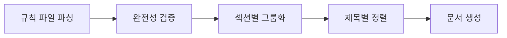

# 아키텍처 및 구현 상세

## 이 튜토리얼을 통해 할 수 있는 것

- Agent Skills 빌드 도구 체인의 작동 원리 이해
- 규칙 파일 파싱의 핵심 로직 마스터
- 타입 시스템 및 데이터 흐름 설계 이해
- 프레임워크 감지 알고리즘의 구현 상세 학습

## 핵심 아키텍처 개요

Agent Skills는 주요 세 부분으로 구성됩니다:

**1. 빌드 도구 체인**（`packages/react-best-practices-build/`）
- 규칙 파일 파싱
- AGENTS.md 생성
- 테스트 케이스 추출

**2. 규칙 파일**（`skills/react-best-practices/rules/`）
- 57개의 React 성능 최적화 규칙
- Markdown 형식, 템플릿 규격 준수

**3. 배포 스크립트**（`skills/claude.ai/vercel-deploy-claimable/`）
- 원클릭 Vercel 배포
- 자동 프레임워크 감지

::: info 아키텍처를 이해해야 하는 이유?
Agent Skills를 단순히 사용만 한다면 이러한 세부 사항을 깊이 이해할 필요가 없을 수 있습니다. 하지만 다음 작업을 하려는 경우:
- 커스텀 스킬 개발
- 새로운 성능 최적화 규칙 작성
- 빌드 또는 배포 문제 디버깅

아키텍처 이해가 큰 도움이 됩니다.
:::

## 빌드 프로세스 상세

빌드 프로세스는 분산된 규칙 파일을 AIAgent가 읽을 수 있는 AGENTS.md 문서로 컴파일합니다. 프로세스는 다섯 단계로 나뉩니다:



### 단계 1: 규칙 파일 파싱（parse）

각 규칙 파일（`.md`）은 `parseRuleFile()` 함수를 통해 `Rule` 객체로 파싱됩니다.

**파싱 순서**（소스 코드 위치：`parser.ts:18-238`）:

1. **Frontmatter 추출**（존재하는 경우）
   - YAML 형식의 메타데이터 파싱
   - 지원 필드：`title`、`impact`、`tags`、`section`、`explanation`、`references`

2. **제목 추출**
   - 첫 번째 `##` 또는 `###` 제목 검색
   - Frontmatter에 title이 없는 경우 여기의 내용 사용

3. **Impact 추출**
   - `**Impact:**` 행 매칭
   - 형식：`**Impact:** CRITICAL (2-10× improvement)`
   - 레벨 및 설명 추출

4. **코드 예제 추출**
   - `**Label:**` 마커 검색（예：`**Incorrect:**`、`**Correct:**`）
   - 후속 코드 블록 수집
   - 코드 블록 뒤의 추가 설명 캡처

5. **참고 문헌 추출**
   - `Reference:` 또는 `References:` 행 검색
   - Markdown 링크 `[text](url)` 파싱

6. **섹션 추론**
   - 파일 이름 접두사에서 추출（소스 코드 위치：`parser.ts:201-210`）
   - 매핑 테이블：
     - `async-*` → 섹션 1（폭포 제거）
     - `bundle-*` → 섹션 2（번들 최적화）
     - `server-*` → 섹션 3（서버 사이드 성능）
     - `client-*` → 섹션 4（클라이언트 사이드 데이터 가져오기）
     - `rerender-*` → 섹션 5（Re-render 최적화）
     - `rendering-*` → 섹션 6（렌더링 성능）
     - `js-*` → 섹션 7（JavaScript 성능）
     - `advanced-*` → 섹션 8（고급 패턴）

### 단계 2: 완전성 검증（validate）

검증 로직은 `validate.ts`에 구현되어 있으며, 규칙 파일이 규격을 준수하는지 확인합니다.

**검증 항목**：

| 검증 항목   | 설명                                   | 실패 시 출력                         |
|--- | --- | ---|
| Title 비어있지 않음   | 제목 필수（Frontmatter 또는 `##` 제목） | `Missing or empty title`             |
| 최소 하나의 예제 | `examples` 배열이 비어있지 않음                  | `At least one code example required` |
| Impact 유효  | 유효한 `ImpactLevel` 열거형 값 필수      | `Invalid impact level`               |
| Code 비어있지 않음    | 각 예제에 코드 내용 필수                 | `Empty code block`                   |

### 단계 3: 섹션별 그룹화（group）

모든 규칙을 섹션별로 그룹화하며, 각 섹션은 다음을 포함합니다:

- `number`：섹션 번호（1-8）
- `title`：섹션 제목（`_sections.md`에서 읽음）
- `impact`：전체 영향 레벨
- `introduction`：섹션 소개（선택 사항）
- `rules[]`：포함된 규칙 배열

（소스 코드 위치：`build.ts:156-169`）

### 단계 4: 제목별 정렬（sort）

각 섹션 내의 규칙은 제목 알파벳 순으로 정렬됩니다.

**정렬 규칙**（소스 코드 위치：`build.ts:172-175`）：
```typescript
section.rules.sort((a, b) =>
  a.title.localeCompare(b.title, 'en-US', { sensitivity: 'base' })
)
```

`en-US` 로케일을 사용하여 환경 간 일관된 정렬을 보장합니다.

**ID 할당**（소스 코드 위치：`build.ts:178-180）：
```typescript
section.rules.forEach((rule, index) => {
  rule.id = `${section.number}.${index + 1}`
  rule.subsection = index + 1
})
```

정렬 후 ID를 할당하며, 예：`1.1`、`1.2`...

### 단계 5: 문서 생성（generate）

`generateMarkdown()` 함수는 `Section[]` 배열을 Markdown 문서로 변환합니다.

**출력 구조**（소스 코드 위치：`build.ts:29-126`）：

```markdown
# React Best Practices
**Version 1.0**
Vercel Engineering
January 25, 2026

## Abstract
...

## Table of Contents
1. 폭포 제거 - CRITICAL
   - 1.1 [병렬 요청](#11-parallel-requests)
   - 1.2 [Defer Await](#12-defer-await)
...

## 1. 폭포 제거
**Impact: CRITICAL**

### 1.1 병렬 요청
**Impact: CRITICAL**

**Incorrect:**
```typescript
// 코드
```
```

## 규칙 파서 상세

### Frontmatter 파싱

Frontmatter는 Markdown 파일 상단의 YAML 블록입니다:

```markdown
---
title: 병렬 요청
impact: CRITICAL
impactDescription: 2-10× improvement
tags: async, waterfall
---
```

**파싱 로직**（소스 코드 위치：`parser.ts:28-41`）:
- `---`로 시작하고 두 번째 `---`로 끝나는지 감지
- `:`로 키-값 쌍 분할
- 따옴표 감싸기 제거
- `frontmatter` 객체에 저장

### 코드 예제 파싱

각 규칙은 `**Label:**`로 표시된 여러 코드 예제를 포함합니다.

**파싱 상태 머신**（소스 코드 위치：`parser.ts:66-188`）：

```
초기 상태 → **Label:** 읽음 → currentExample.label = "라벨"
          → ``` 읽음 → inCodeBlock = true, 코드 수집
          → ``` 읽음 → inCodeBlock = false, currentExample.code = 수집된 코드
          → 텍스트 읽음 → afterCodeBlock인 경우 additionalText에 저장
          → **Reference:** 읽음 → currentExample를 examples[]에 푸시
```

**지원되는 라벨 유형**：
- `Incorrect`：잘못된 예제
- `Correct`：올바른 예제
- `Example`：일반 예제
- `Usage`：사용법 예제
- `Implementation`：구현 예제

**추가 설명 캡처**（소스 코드 위치：`parser.ts:182-186`）：
```typescript
// 코드 블록 뒤의 텍스트, 또는 코드 블록이 없는 섹션의 텍스트
// (예：코드 대신 불릿 포인트가 있는 "When NOT to use this pattern:")
else if (currentExample && (afterCodeBlock || !hasCodeBlockForCurrentExample)) {
  additionalText.push(line)
}
```

이는 코드 블록 뒤에 추가 설명을 추가하거나, 순수 텍스트 예제（예：목록）를 지원합니다.

### 참고 문헌 파싱

참고 문헌은 파일 끝부분에 있으며 형식은 다음과 같습니다:

```markdown
Reference: [React 문서](https://react.dev), [Next.js 가이드](https://nextjs.org/docs)
```

**파싱 로직**（소스 코드 위치：`parser.ts:154-174`）：
- 정규 표현식 `[text](url)` 패턴 매칭
- 모든 URL을 `references[]` 배열에 추출

## 타입 시스템

타입 정의는 `types.ts`에 있습니다（소스 코드 위치：`types.ts:1-54`）。

### ImpactLevel 열거형

```typescript
export type ImpactLevel =
  | 'CRITICAL'
  | 'HIGH'
 |---|
  | 'MEDIUM'
 |---|
  | 'LOW'
```

**레벨 설명**：

| 레벨        | 영향               | 예제 규칙                     |
|--- | --- | ---|
| CRITICAL    | 중요한 병목, 반드시 수정 | async-parallel               |
| HIGH        | 중요한 개선, 우선 권장 | server-cache-react           |
| MEDIUM-HIGH | 중-고 우선순위         | client-data-fetch            |
| MEDIUM      | 중등 개선           | rerender-memo                |
| LOW-MEDIUM  | 저-중 우선순위         | js-use-memo                  |
| LOW         | 점진적 개선, 선택 사항     | advanced-suspense-boundaries |

### Rule 인터페이스

```typescript
export interface Rule {
  id: string                    // 자동 생성, 예 "1.1"
  title: string                 // 규칙 제목
  section: number              // 소속 섹션（1-8）
  subsection?: number          // 하위 섹션 번호
  impact: ImpactLevel          // 영향 레벨
  impactDescription?: string  // 영향 설명, 예 "2-10× improvement"
  explanation: string          // 규칙 설명
  examples: CodeExample[]      // 코드 예제 배열
  references?: string[]        // 참고 링크
  tags?: string[]              // 태그
}
```

### CodeExample 인터페이스

```typescript
export interface CodeExample {
  label: string              // "Incorrect", "Correct", "Example"
  description?: string       // 라벨 설명（선택 사항）
  code: string              // 코드 내용
  language?: string         // 코드 언어, 기본값 typescript
  additionalText?: string   // 코드 뒤의 추가 설명
}
```

### Section 인터페이스

```typescript
export interface Section {
  number: number              // 섹션 번호（1-8）
  title: string              // 섹션 제목
  impact: ImpactLevel        // 전체 영향 레벨
  impactDescription?: string // 영향 설명
  introduction?: string      // 섹션 소개
  rules: Rule[]             // 포함된 규칙
}
```

### GuidelinesDocument 인터페이스

```typescript
export interface GuidelinesDocument {
  version: string          // 버전 번호, 예 "1.0"
  organization: string     // 조직 이름
  date: string            // 날짜
  abstract: string        // 요약
  sections: Section[]     // 섹션
  references?: string[]   // 전역 참고 문헌
}
```

### TestCase 인터페이스

LLM 자동 평가를 위한 테스트 케이스.

```typescript
export interface TestCase {
  ruleId: string          // 규칙 ID, 예 "1.1"
  ruleTitle: string       // 규칙 제목
  type: 'bad' | 'good'   // 예제 유형
  code: string           // 코드 내용
  language: string       // 코드 언어
  description?: string   // 설명
}
```

## 테스트 케이스 추출 메커니즘

테스트 케이스 추출 기능은 규칙의 코드 예제를 평가 가능한 테스트 케이스로 변환하여 LLM 자동 평가에서 규칙 준수도를 평가합니다.

### 추출 로직（소스 코드 위치：`extract-tests.ts:15-38`）

```typescript
function extractTestCases(rule: Rule): TestCase[] {
  const testCases: TestCase[] = []

  rule.examples.forEach((example, index) => {
    const isBad = example.label.toLowerCase().includes('incorrect') ||
                  example.label.toLowerCase().includes('wrong') ||
                  example.label.toLowerCase().includes('bad')
    const isGood = example.label.toLowerCase().includes('correct') ||
                   example.label.toLowerCase().includes('good')

    if (isBad || isGood) {
      testCases.push({
        ruleId: rule.id,
        ruleTitle: rule.title,
        type: isBad ? 'bad' : 'good',
        code: example.code,
        language: example.language || 'typescript',
        description: example.description || `${example.label} example for ${rule.title}`
      })
    }
  })

  return testCases
}
```

**지원되는 예제 유형**：
- `Incorrect` / `Wrong` / `Bad` → type = 'bad'
- `Correct` / `Good` → type = 'good'

**출력 파일**：`test-cases.json`

**데이터 구조**：
```json
[
  {
    "ruleId": "1.1",
    "ruleTitle": "병렬 요청",
    "type": "bad",
    "code": "const data = await fetch(url);\nconst result = await process(data);",
    "language": "typescript",
    "description": "Incorrect example for 병렬 요청"
  },
  {
    "ruleId": "1.1",
    "ruleTitle": "병렬 요청",
    "type": "good",
    "code": "const [data, processed] = await Promise.all([\n  fetch(url),\n  process(data)\n]);",
    "language": "typescript",
    "description": "Correct example for 병렬 요청"
  }
]
```

**통계 데이터**（소스 코드 위치：`extract-tests.ts:68-70`）：
```bash
✓ Extracted 120 test cases to test-cases.json
  - Bad examples: 60
  - Good examples: 60
```

## 배포 스크립트 프레임워크 감지

Vercel 배포 스크립트는 40개 이상의 프레임워크 자동 감지를 지원합니다.

### 감지 로직（소스 코드 위치：`deploy.sh:12-156`）

```bash
detect_framework() {
    local pkg_json="$1"
    local content=$(cat "$pkg_json")

    has_dep() {
        echo "$content" | grep -q "\"$1\""
    }

    # 우선순위 순서대로 의존성 확인
    if has_dep "blitz"; then echo "blitzjs"; return; fi
    if has_dep "next"; then echo "nextjs"; return; fi
    if has_dep "gatsby"; then echo "gatsby"; return; fi
    # ... 더 많은 프레임워크 감지
}
```

**감지 순서**：
- 특수에서 일반으로
- `dependencies` 및 `devDependencies` 확인
- `grep -q`로 빠른 매칭 사용

### 지원되는 프레임워크

| 카테고리         | 프레임워크 목록                                                      | 감지 키워드                    |
|--- | --- | ---|
| React        | Next.js, Gatsby, Create React App, Remix, React Router, Blitz | `next`, `gatsby`, `remix-run` |
| Vue          | Nuxt, Vitepress, Vuepress, Gridsome                           | `nuxt`, `vitepress`           |
| Svelte       | SvelteKit, Svelte, Sapper                                     | `@sveltejs/kit`, `svelte`     |
| Angular      | Angular, Ionic Angular                                        | `@angular/core`               |
| Node.js 백엔드 | Express, Hono, Fastify, NestJS, Elysia, h3, Nitro             | `express`, `hono`, `nestjs`   |
| 빌드 도구     | Vite, Parcel                                                  | `vite`, `parcel`              |
| 정적 HTML    | package.json 없음                                               | `null` 반환                   |

### 정적 HTML 프로젝트 처리（소스 코드 위치：`deploy.sh:192-206`）

정적 HTML 프로젝트（`package.json` 없음）는 특별한 처리가 필요합니다:

```bash
if [ ! -f "$PROJECT_PATH/package.json" ]; then
  # 루트 디렉토리의 HTML 파일 찾기
  HTML_FILES=$(find "$PROJECT_PATH" -maxdepth 1 -name "*.html" -type f)
  HTML_COUNT=$(echo "$HTML_FILES" | grep -c . || echo 0)

  # HTML 파일이 하나만 있고 index.html이 아닌 경우 index.html로 이름 변경
  if [ "$HTML_COUNT" -eq 1 ]; then
    HTML_FILE=$(echo "$HTML_FILES" | head -1)
    BASENAME=$(basename "$HTML_FILE")
    if [ "$BASENAME" != "index.html" ]; then
      echo "Renaming $BASENAME to index.html..." >&2
      mv "$HTML_FILE" "$PROJECT_PATH/index.html"
    fi
  fi
fi
```

**이름 변경이 필요한 이유?**
Vercel은 기본적으로 `index.html`을 정적 사이트의 진입 파일로 찾습니다.

### 배포 프로세스（소스 코드 위치：`deploy.sh:158-249`）

```bash
# 1. 매개변수 파싱
INPUT_PATH="${1:-.}"

# 2. 임시 디렉토리 생성
TEMP_DIR=$(mktemp -d)

# 3. 프레임워크 감지
FRAMEWORK=$(detect_framework "$PROJECT_PATH/package.json")

# 4. tarball 생성（node_modules 및 .git 제외）
tar -czf "$TARBALL" -C "$PROJECT_PATH" --exclude='node_modules' --exclude='.git' .

# 5. API에 업로드
RESPONSE=$(curl -s -X POST "$DEPLOY_ENDPOINT" -F "file=@$TARBALL" -F "framework=$FRAMEWORK")

# 6. 응답 파싱
PREVIEW_URL=$(echo "$RESPONSE" | grep -o '"previewUrl":"[^"]*"' | cut -d'"' -f4)
CLAIM_URL=$(echo "$RESPONSE" | grep -o '"claimUrl":"[^"]*"' | cut -d'"' -f4)

# 7. 결과 출력
echo "Preview URL: $PREVIEW_URL"
echo "Claim URL:   $CLAIM_URL"
echo "$RESPONSE"  # 프로그램에서 사용할 JSON 형식
```

**오류 처리**（소스 코드 위치：`deploy.sh:224-239`）：
```bash
if echo "$RESPONSE" | grep -q '"error"'; then
  ERROR_MSG=$(echo "$RESPONSE" | grep -o '"error":"[^"]*"' | cut -d'"' -f4)
  echo "Error: $ERROR_MSG" >&2
  exit 1
fi

if [ -z "$PREVIEW_URL" ]; then
  echo "Error: Could not extract preview URL from response" >&2
  exit 1
fi
```

## 다음 단계

아키텍처를 이해한 후 다음을 수행할 수 있습니다:

- [커스텀 스킬 개발](../../advanced/skill-development/)
- [React 모범 사례 규칙 작성](../../advanced/rule-authoring/)
- [API 및 명령 참조 보기](../reference/)

## 부록: 소스 코드 참조

<details>
<summary><strong>클릭하여 소스 코드 위치 펼치기</strong></summary>

> 업데이트 날짜：2026-01-25

| 기능             | 파일 경로                                                                                                                                                                         | 줄 번호    |
|--- | --- | ---|
| 타입 시스템         | [`packages/react-best-practices-build/src/types.ts`](https://github.com/vercel-labs/agent-skills/blob/main/packages/react-best-practices-build/src/types.ts)                     | 1-54    |
| 경로 설정         | [`packages/react-best-practices-build/src/config.ts`](https://github.com/vercel-labs/agent-skills/blob/main/packages/react-best-practices-build/src/config.ts)                   | 1-18    |
| 규칙 파서       | [`packages/react-best-practices-build/src/parser.ts`](https://github.com/vercel-labs/agent-skills/blob/main/packages/react-best-practices-build/src/parser.ts)                   | 18-238  |
| 빌드 스크립트         | [`packages/react-best-practices-build/src/build.ts`](https://github.com/vercel-labs/agent-skills/blob/main/packages/react-best-practices-build/src/build.ts)                     | 131-287 |
| 테스트 케이스 추출     | [`packages/react-best-practices-build/src/extract-tests.ts`](https://github.com/vercel-labs/agent-skills/blob/main/packages/react-best-practices-build/src/extract-tests.ts)     | 15-38   |
| 배포 스크립트 프레임워크 감지 | [`skills/claude.ai/vercel-deploy-claimable/scripts/deploy.sh`](https://github.com/vercel-labs/agent-skills/blob/main/skills/claude.ai/vercel-deploy-claimable/scripts/deploy.sh) | 12-156  |

**핵심 상수**：
- `ImpactLevel` 열거형 값：CRITICAL, HIGH, MEDIUM-HIGH, MEDIUM, LOW-MEDIUM, LOW（`types.ts:5`）
- `SKILL_DIR`：스킬 디렉토리 경로（`config.ts:11`）
- `RULES_DIR`：규칙 파일 디렉토리（`config.ts:13`）
- `DEPLOY_ENDPOINT`：`https://claude-skills-deploy.vercel.com/api/deploy`（`deploy.sh:9`）

**핵심 함수**：
- `parseRuleFile()`: Markdown 규칙 파일을 Rule 객체로 파싱（`parser.ts:18`）
- `extractTestCases()`: 규칙에서 테스트 케이스 추출（`extract-tests.ts:15`）
- `generateMarkdown()`: Section[]에서 Markdown 문서 생성（`build.ts:29`）
- `detect_framework()`: 프로젝트 프레임워크 감지（`deploy.sh:12`）

</details>
