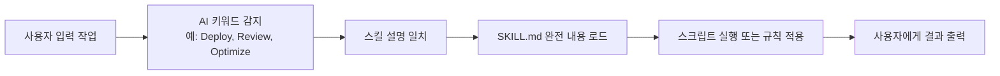

# Agent Skills 소개

## 학습 후 할 수 있는 것

- Agent Skills가 무엇이며 AI 코딩 에이전트의 기능을 어떻게 확장하는지 이해
- 세 가지 핵심 스킬 팩의 기능과 사용 시나리오 이해
- 개발 효율성을 높이기 위해 언제 Agent Skills를 사용하면 적절한지 알기

## 현재 당면한 문제

Claude, Cursor 또는 다른 AI 코딩 에이전트를 일상적으로 사용할 때 다음 문제를 겪을 수 있습니다:
- 베스트 프랙티스를 따르고 싶지만, 어떤 규칙을 기억해야 할지 모름
- 유사한 배포 작업을 반복하고, 자동화를 원함
- AI가 생성한 코드 품질이 고르지 않고, 통일된 기준 부족

## 핵심 아이디어

**Agent Skills은 스킬 팩 시스템**—AI 코딩 에이전트를 위한 확장 가능한 "플러그인"을 제공합니다. 각 스킬은 다음을 포함합니다:

- **SKILL.md**: AI 에이전트에게 언제 이 스킬을 활성화해야 하는지 알려주는 스킬 정의 파일
- **scripts/**: 보조 스크립트(예: 배포 스크립트), 구체적인 작업 실행
- **references/**: 보조 문서(선택 사항), 상세한 참고 자료 제공

::: tip 디자인 철학
스킬은 **온디맨드 로딩 메커니즘**을 사용: 시작 시 스킬 이름과 설명만 로드되며, AI가 필요하다고 판단할 때만 완전한 내용을 읽습니다. 이로 인해 컨텍스트 사용을 줄이고 효율을 높입니다.
:::

## 사용 가능한 스킬 팩

프로젝트는 세 가지 스킬 팩을 제공하며, 각각은 특정 시나리오에 맞춰져 있습니다:

### react-best-practices

React 및 Next.js 성능 최적화 가이드, Vercel Engineering 표준에서. 영향력별로 정렬된 50+ 개 규칙 포함.

**사용 시나리오**:
- 새 React 컴포넌트나 Next.js 페이지 작성
- 코드 성능 문제 감사
- 번들 크기나 로드 시간 최적화

**포함 카테고리**:
- 워터폴 제거(Critical)
- 번들 최적화(Critical)
- 서버 측 성능(High)
- 클라이언트 측 데이터 가져오기(Medium-High)
- Re-render 최적화(Medium)
- 렌더링 성능(Medium)
- JavaScript 마이크로 최적화(Low-Medium)
- 고급 모드(Low)

### web-design-guidelines

웹 인터페이스 디자인 가이드 감사, 100개 가까운 베스트 프랙티스 규칙을 사용하여 코드가 준수하는지 확인.

**사용 시나리오**:
- 프롬프트: "Review my UI"
- 접근성(Accessibility) 확인
- 디자인 일관성 감사
- 성능 및 UX 확인

**포함 카테고리**:
- 접근성(aria-labels, 시맨틱 HTML, 키보드 핸들링)
- Focus 상태(가시 포커스, focus-visible 모드)
- 폼(autocomplete, 검증, 오류 핸들링)
- 애니메이션(prefers-reduced-motion, composition-friendly transforms)
- 이미지(크기, 지연 로딩, alt 텍스트)
- 타이포그래피, 성능, 탐색 등

### vercel-deploy-claimable

Vercel에 앱 및 웹사이트를 원클릭 배포, 미리보기 링크 및 소유권 이전 링크 반환.

**사용 시나리오**:
- 프롬프트: "Deploy my app"
- 프로젝트 미리보기 빠르게 공유
- 구성 불필요, 인증 없는 배포

**핵심 기능**:
- 40+ 개 프레임워크 자동 감지(Next.js, Vite, Astro 등)
- 미리보기 URL(라이브 사이트) 및 claim URL(소유권 이전) 반환
- 정적 HTML 프로젝트 자동 처리
- 업로드 시 `node_modules` 및 `.git` 제외

## 스킬 작동 원리

Claude 또는 다른 AI 에이전트를 사용할 때, 스킬 활성화 플로우는 다음과 같습니다:



**플로우 예시**:

1. **사용자 입력**: "Deploy my app"
2. **AI 감지**: 키워드 "Deploy" 인식, `vercel-deploy` 스킬 일치
3. **스킬 로드**: SKILL.md 완전 내용 읽기
4. **배포 실행**:
   - `deploy.sh` 스크립트 실행
   - 프레임워크 감지(package.json 읽기)
   - 프로젝트를 tarball로 패키징
   - Vercel API에 업로드
5. **결과 반환**:
   ```json
   {
     "previewUrl": "https://skill-deploy-abc123.vercel.app",
     "claimUrl": "https://vercel.com/claim-deployment?code=..."
   }
   ```

## 언제 이 기술 사용

Agent Skills 사용을 위한 최적 시나리오:

| 시나리오 | 사용할 스킬 | 프롬프트 예시 |
| ---- | ---------- | -------------- |
| React 컴포넌트 작성 | react-best-practices | "Review this React component for performance issues" |
| Next.js 페이지 최적화 | react-best-practices | "Help me optimize this Next.js page" |
| UI 품질 확인 | web-design-guidelines | "Check accessibility of my site" |
| 프로젝트 배포 | vercel-deploy-claimable | "Deploy my app to production" |

## 보안 모델

::: info 보안 설명
- **로컬 실행**: 모든 스킬이 로컬에서 실행, 타사 서비스로 데이터 업로드 없음(Vercel 배포 API 제외)
- **온디맨드 활성화**: 스킬은 AI가 관련하다고 판단할 때만 상세 내용을 로드하여 개인 유출 위험 감소
- **오픈 소스 투명성**: 모든 스킬 및 스크립트 오픈 소스로 감사 가능
:::

## 일반적인 문제 해결

### 스킬 활성화 안 됨

스킬이 활성화되지 않은 경우 확인:
- 프롬프트에 충분한 키워드 포함(예: "Deploy", "Review")
- 스킬이 `~/.claude/skills/` 디렉토리에 올바르게 설치되었는지
- claude.ai 사용 시 프로젝트 지식 베이스에 스킬이 추가되었는지

### 네트워크 권한

일부 스킬은 네트워크 액세스 필요:
- `vercel-deploy-claimable`은 Vercel 배포 API 액세스 필요
- `web-design-guidelines`은 GitHub에서 최신 규칙 가져오기 필요

**해결 방법**: claude.ai/settings/capabilities에서 필요한 도메인 추가.

## 이 과정 요약

Agent Skills은 AI 코딩 에이전트를 위한 스킬 팩 시스템으로 제공:
- **react-best-practices**: 50+ 개 React/Next.js 성능 최적화 규칙
- **web-design-guidelines**: 100개 가까운 웹 디자인 베스트 프랙티스
- **vercel-deploy-claimable**: Vercel 원클릭 배포

스킬은 온디맨드 로딩 메커니즘을 사용하여 컨텍스트 사용 최소화. 설치 후, AI 에이전트는 관련 작업에서 자동으로 해당 스킬을 활성화.

## 다음 과정 예고

> 다음 과정에서는 **[Agent Skills 설치](../installation/)**을 학습합니다.
>
> 배우게 될 것:
> - 두 가지 설치 방법: Claude Code 및 claude.ai
> - 네트워크 권한 구성
> - 스킬이 올바르게 설치되었는지 확인

---

## 부록: 소스 참고

<details>
<summary><strong>클릭하여 소스 코드 위치 펼치기</strong></summary>

> 업데이트 날짜: 2026-01-25

| 기능        | 파일 경로                                                              | 행번호    |
| ----------- | --------------------------------------------------------------------- | ------- |
| 스킬 팩 목록   | [`README.md`](https://github.com/vercel-labs/agent-skills/blob/main/README.md#L7-L80) | 7-80    |
| 스킬 구조 설명 | [`README.md`](https://github.com/vercel-labs/agent-skills/blob/main/README.md#L103-L110) | 103-110 |
| AGENTS.md 스펙 | [`AGENTS.md`](https://github.com/vercel-labs/agent-skills/blob/main/AGENTS.md) | 전체    |
| 스킬 디렉토리 구조 | [`AGENTS.md`](https://github.com/vercel-labs/agent-skills/blob/main/AGENTS.md#L11-L20) | 11-20   |
| SKILL.md 형식 | [`AGENTS.md`](https://github.com/vercel-labs/agent-skills/blob/main/AGENTS.md#L29-L68) | 29-68   |
| 스킬 패키징 명령 | [`AGENTS.md`](https://github.com/vercel-labs/agent-skills/blob/main/AGENTS.md#L93-L96) | 93-96   |
| 사용자 설치 방법 | [`AGENTS.md`](https://github.com/vercel-labs/agent-skills/blob/main/AGENTS.md#L98-L110) | 98-110  |
| 온디맨드 로딩 메커니즘 | [`AGENTS.md`](https://github.com/vercel-labs/agent-skills/blob/main/AGENTS.md#L72-L78) | 72-78   |
| 빌드 툴 스크립트 | [`packages/react-best-practices-build/package.json`](https://github.com/vercel-labs/agent-skills/blob/main/packages/react-best-practices-build/package.json) | 전체    |

**핵심 상수**:
- 하드코드된 상수 없음

**핵심 함수**:
- `build.ts`: AGENTS.md 및 테스트 케이스 빌드
- `validate.ts`: 규칙 파일 완전성 검증
- `extract-tests.ts`: 규칙에서 테스트 케이스 추출

</details>
