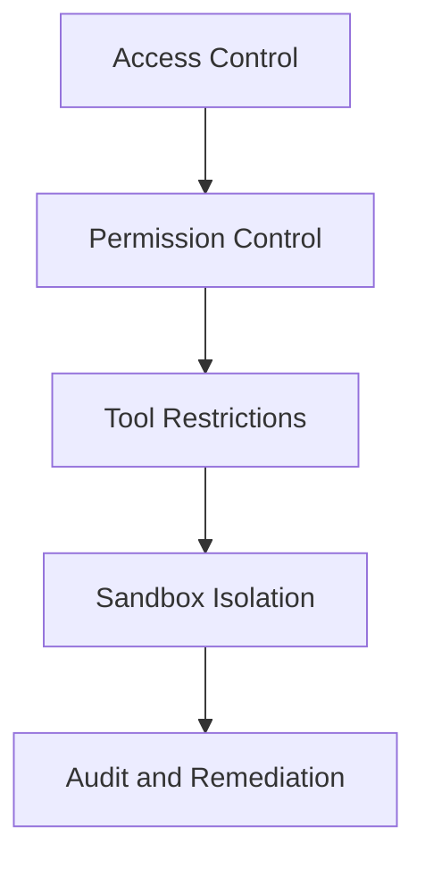

# Security and Sandbox Isolation: Protecting Your AI Assistant

## What You'll Learn

After completing this lesson, you will be able to:

- Configure multi-layer security policies, from access control to tool permissions
- Use sandbox isolation to restrict AI assistant file system and network access
- Run security audits to identify and fix common security vulnerabilities
- Adjust security levels based on different scenarios (personal/family/public)

## Your Current Challenge

Clawdbot makes your AI assistant powerful, but it also introduces new security challenges:

- **Shell Access**: AI can execute arbitrary commands, read and write files
- **Network Access**: AI can access any URL and service
- **Message Sending**: AI can send messages to anyone (if WhatsApp is configured)
- **Remote Control**: Control local browser through browser tools
- **Data Exposure**: All conversation history is stored on disk

Without proper protection, a compromised AI model could lead to catastrophic consequences.

## When to Use This

- ✅ You need to run an AI assistant on your own device and worry about security risks
- ✅ You want to expose your AI assistant to multiple users (family members, team)
- ✅ You need to restrict AI access to specific files or directories
- ✅ You want to isolate access scope for different users/sessions
- ✅ You need to run the AI assistant in a restricted environment (sandbox)

::: info
**Key Concept**: Security is layered, from "who can access" to "what they can do", and finally "model safety".
:::

## 🎒 Prerequisites

### Pre-flight Checks

- [x] Completed [Quick Start](../../start/getting-started/), learned how to start Gateway
- [ ] Configured at least one AI model (Anthropic, OpenAI, or Ollama)
- [ ] Understand your use case (personal use, family sharing, public service)
- [ ] Understand Linux file permission concepts (chmod)

### Recommended Tools

- Command-line tools: Terminal or SSH
- Editor: Your preferred code editor
- Docker: For running sandbox containers (optional)

---

## Core Philosophy

Clawdbot's security model is based on a core philosophy: **access control first, security by restriction**.

### Security Layers



1. **Access Control**: Decides who can talk to your AI assistant
2. **Permission Control**: Decides which tools the AI assistant can call
3. **Sandbox Isolation**: Decides the environment where tools run (host or container)
4. **Audit and Remediation**: Continuously check and fix security configurations

This layered design ensures that even if the model is compromised, the attack scope is limited within defined boundaries.

### Three-Layer Access Control Protection

Clawdbot provides three layers of access control:

| Layer | Protection Content | Configuration Location |
|--- | --- | ---|
| **Gateway Authentication** | WebSocket connection | `gateway.auth` |
| **DM Policy** | Private messages | `channels.*.dmPolicy` |
| **Group Policy** | Group messages | `channels.*.groupPolicy` / `channels.*.groups` |

Each layer can be configured independently, forming defense-in-depth.

---

## Security Audit: Identify Risks

Clawdbot provides built-in security audit tools to quickly identify common security vulnerabilities.

### Running Audit

```bash
# Basic audit
clawdbot security audit

# Deep audit (includes Gateway probing)
clawdbot security audit --deep

# Auto-fix security recommendations
clawdbot security audit --fix
```

### What Audit Checks

The audit tool checks the following aspects:

| Check Category | Specific Items | Risk Level |
|--- | --- | ---|
| **Inbound Access** | Gateway authentication, DM policy, Group policy | Critical / Warn |
| **Tool Access** | Elevated exec allowlist, tool allow/deny | Critical / Warn |
| **Network Exposure** | Gateway bind mode, Tailscale Serve/Funnel | Critical / Info |
| **Browser Control** | Remote browser control authentication, URL protocol | Critical / Warn |
| **File Permissions** | Config file permissions, state directory permissions | Critical / Warn |
| **Plugin Trust** | Plugins not explicitly allowed | Warn |

### Understanding Audit Output

Audit reports are classified by severity level:

- **Critical (red)**: Fix immediately, may lead to remote code execution or data leakage
- **Warn (yellow)**: Recommended to fix, reduces security boundary
- **Info (blue)**: Informational message, not a security issue

### Auto-fix

When using the `--fix` flag, the audit tool safely applies the following fixes:

- Change `groupPolicy="open"` to `allowlist`
- Change `logging.redactSensitive="off"` to `"tools"`
- Fix file permissions (config files 600, directories 700)

::: tip
**Best Practice**: Run audits regularly, especially after changing configurations or updating Gateway.
:::

---

## Access Control: Who Can Access Your AI Assistant

Access control is the first line of defense, deciding who can interact with your AI assistant.

### Gateway Authentication

By default, Gateway requires authentication to accept WebSocket connections.

#### Configure Authentication Mode

```json5
{
  "gateway": {
    "auth": {
      "mode": "token",  // or "password"
      "token": "your-long-random-token-please-change-me"
    }
  }
}
```

**Authentication Modes**:

| Mode | Purpose | Recommended Scenario |
|--- | --- | ---|
| `token` | Shared bearer token | Most cases, recommended |
| `password` | Password authentication | Local development, convenient for quick testing |
| Tailscale Identity | Tailscale Serve | Remote access via Tailscale |

::: warning
**Important**: If `gateway.bind` is set to non-loopback (such as `lan`, `tailnet`), authentication must be configured, otherwise connections are rejected.
:::

### DM Policy: Private Message Protection

DM policy controls whether unknown users can directly talk to your AI assistant.

| Policy | Behavior | Recommended Scenario |
|--- | --- | ---|
| `pairing` (default) | Unknown sender receives pairing code, doesn't process until paired | Personal use, recommended |
| `allowlist` | Unknown senders are rejected | Multi-user trusted environment |
| `open` | Allow anyone | Public service (requires `allowFrom` to include `"*"`) |
| `disabled` | Ignore all private messages | Use group features only |

#### Configuration Example

```json5
{
  "channels": {
    "whatsapp": {
      "dmPolicy": "pairing"
    },
    "telegram": {
      "dmPolicy": "allowlist",
      "allowFrom": ["user123", "user456"]
    }
  }
}
```

#### Managing Pairing

```bash
# View pending pairing requests
clawdbot pairing list whatsapp

# Approve pairing
clawdbot pairing approve whatsapp <pairing-code>
```

::: tip
**Best Practice**: Default `pairing` mode provides a good balance of user experience and security. Only use `allowlist` or `open` when you explicitly trust all users.
:::

### Group Policy: Group Message Control

Group policy decides how the AI assistant responds to messages in groups.

| Policy | Behavior | Configuration Location |
|--- | --- | ---|
| `allowlist` | Only accept groups in the allowlist | `channels.whatsapp.groups` |
| `disabled` | Ignore all group messages | `channels.telegram.groups` |
| `requireMention` | Only respond when @mentioned or triggered by commands | `channels.*.groups.*` |

#### Configuration Example

```json5
{
  "channels": {
    "whatsapp": {
      "groups": {
        "*": {
          "requireMention": true
        }
      }
    },
    "discord": {
      "guilds": {
        "your-guild-id": {
          "users": ["user1", "user2"]
        }
      }
    }
  }
}
```

::: tip
**Best Practice**: Enable `requireMention` in public groups to prevent the AI assistant from being manipulated by malicious users.
:::

### Session Isolation: Prevent Context Leakage

By default, all private messages are routed to the same main session. When multiple users can access the AI assistant, this can lead to context leakage.

```json5
{
  "session": {
    "dmScope": "per-channel-peer"  // Create separate sessions for each channel-sender
  }
}
```

---

## Tool Permission Control: Limiting What AI Can Do

Tool permission control is the second line of defense, deciding which tools the AI assistant can call.

### Tool Allow/Deny Lists

You can configure tool whitelists and blacklists globally or per agent.

```json5
{
  "agents": {
    "defaults": {
      "tools": {
        "allow": ["read", "write", "web_search"],
        "deny": ["exec", "browser", "web_fetch"]
      }
    },
    "list": [
      {
        "id": "read-only",
        "tools": {
          "allow": ["read"],
          "deny": ["write", "edit", "apply_patch", "exec", "browser"]
        }
      }
    ]
  }
}
```

### Common Tool Categories

| Tool Category | Specific Tools | Risk Level |
|--- | --- | ---|
| **File Operations** | `read`, `write`, `edit`, `apply_patch` | Medium |
| **Shell Execution** | `exec`, `process` | High |
| **Browser Control** | `browser` | High |
| **Network Access** | `web_search`, `web_fetch` | Medium |
| **Canvas Visualization** | `canvas` | Medium |
| **Node Operations** | `nodes_invoke` | High |
| **Cron Scheduled Tasks** | `cron` | Medium |
| **Message Sending** | `message`, `sessions_*` | Low |

### Elevated Mode: Escape Hatch for Host Execution

Elevated exec is a special escape hatch that allows tools to run on the host, bypassing the sandbox.

```json5
{
  "tools": {
    "elevated": {
      "enabled": true,
      "allowFrom": {
        "whatsapp": ["your-trusted-user-id"]
      },
      "security": "allowlist",
      "ask": "on"  // Ask for confirmation before each execution
    }
  }
}
```

::: danger
**Important Warning**: Elevated exec bypasses sandbox restrictions. Only enable when you completely trust the allowed users and scenarios.
:::

::: tip
**Best Practice**: For most scenarios, disable elevated exec and rely on sandbox isolation and strict tool whitelists.
:::

---

## Sandbox Isolation: Running in Restricted Environment

Sandbox isolation runs tools in Docker containers, restricting file system and network access.

### Sandbox Modes

| Mode | Behavior | Recommended Scenario |
|--- | --- | ---|
| `off` | All tools run on host | Personal trusted environment |
| `non-main` (recommended) | Main session on host, other sessions in sandbox | Balance performance and security |
| `all` | All sessions in sandbox | Multi-user environment, public service |

```json5
{
  "agents": {
    "defaults": {
      "sandbox": {
        "mode": "non-main"
      }
    }
  }
}
```

### Workspace Access

Workspace access determines which host directories the sandbox container can see.

| Access Level | Behavior | Recommended Scenario |
|--- | --- | ---|
| `none` (default) | Sandbox workspace `~/.clawdbot/sandboxes` | Maximum isolation |
| `ro` | Agent workspace mounted read-only at `/agent` | Read but don't write files |
| `rw` | Agent workspace mounted read-write at `/workspace` | Agents that need to write files |

```json5
{
  "agents": {
    "defaults": {
      "sandbox": {
        "workspaceAccess": "none"
      }
    }
  }
}
```

### Sandbox Scope

Sandbox scope determines container isolation granularity.

| Scope | Behavior | Container Count |
|--- | --- | ---|
| `session` (default) | One container per session | More containers, better isolation |
| `agent` | One container per agent | Balance isolation and resources |
| `shared` | All sessions share one container | Save resources, lowest isolation |

### Docker Configuration

```json5
{
  "agents": {
    "defaults": {
      "sandbox": {
        "docker": {
          "image": "clawdbot-sandbox:bookworm-slim",
          "containerPrefix": "clawdbot-sbx-"
        }
      }
    }
  }
}
```

### Custom Mounts

You can mount additional host directories to the sandbox container.

```json5
{
  "agents": {
    "defaults": {
      "sandbox": {
        "docker": {
          "binds": [
            "/home/user/source:/source:ro",
            "/var/run/docker.sock:/var/run/docker.sock"
          ]
        }
      }
    }
  }
}
```

::: warning
**Security Tip**: Mounting bypasses sandbox file system isolation. Sensitive mounts (like docker.sock) should use `:ro` (read-only) mode.
:::

### Sandboxed Browser

Sandboxed browser runs Chrome instances in containers, isolating browser operations.

```json5
{
  "agents": {
    "defaults": {
      "sandbox": {
        "browser": {
          "enabled": true,
          "autoStart": true,
          "autoStartTimeoutMs": 10000
        }
      }
    }
  }
}
```

::: tip
**Best Practice**: Sandboxed browser prevents the AI assistant from accessing your daily browser login sessions and sensitive data.
:::

---

## Multi-Agent Security Configuration

Different agents can have different security configurations.

### Scenario Examples

#### Scenario 1: Personal Agent (Fully Trusted)

```json5
{
  "agents": {
    "list": [
      {
        "id": "personal",
        "sandbox": { "mode": "off" },
        "tools": {
          "allow": ["*"],
          "deny": []
        }
      }
    ]
  }
}
```

#### Scenario 2: Family Agent (Read-Only)

```json5
{
  "agents": {
    "list": [
      {
        "id": "family",
        "workspace": "~/clawd-family",
        "sandbox": {
          "mode": "all",
          "scope": "agent",
          "workspaceAccess": "ro"
        },
        "tools": {
          "allow": ["read"],
          "deny": ["write", "edit", "apply_patch", "exec", "browser"]
        }
      }
    ]
  }
}
```

#### Scenario 3: Public Agent (Sandbox + Strict Restrictions)

```json5
{
  "agents": {
    "list": [
      {
        "id": "public",
        "workspace": "~/clawd-public",
        "sandbox": {
          "mode": "all",
          "scope": "agent",
          "workspaceAccess": "none"
        },
        "tools": {
          "allow": ["web_search", "sessions_list"],
          "deny": ["read", "write", "edit", "apply_patch", "exec", "browser", "web_fetch", "canvas", "nodes", "cron", "gateway", "image"]
        }
      }
    ]
  }
}
```

---

## Dockerization: Complete Gateway Isolation

In addition to tool-level sandboxing, you can also run the entire Gateway in a Docker container.

### Advantages of Complete Dockerization

- Completely isolate the Gateway process
- Avoid installing dependencies on the host
- Easy deployment and management
- Provide additional security boundaries

::: tip
When to use Dockerization vs Tool Sandbox:
- **Tool Sandbox**: Most scenarios, balances performance and security
- **Dockerization**: Production environment, multi-tenant deployment, requires complete isolation
:::

### Docker Installation Reference

For detailed Docker installation instructions, please refer to: [Deployment Options](../../appendix/deployment/).

---

## Common Pitfalls

### Common Errors

#### ❌ Forgetting to Configure Gateway Authentication

**Incorrect Configuration**:
```json5
{
  "gateway": {
    "bind": "lan"  // Dangerous!
    "auth": {}
  }
}
```

**Consequence**: Anyone who can connect to your LAN can control your AI assistant.

**Correct Configuration**:
```json5
{
  "gateway": {
    "bind": "loopback",  // Or configure strong authentication
    "auth": {
      "mode": "token",
      "token": "your-secure-token"
    }
  }
}
```

#### ❌ Using `dmPolicy: "open"` But Forgetting `allowFrom`

**Incorrect Configuration**:
```json5
{
  "channels": {
    "whatsapp": {
      "dmPolicy": "open"  // Dangerous!
    }
  }
}
```

**Consequence**: Anyone can send messages to your AI assistant.

**Correct Configuration**:
```json5
{
  "channels": {
    "whatsapp": {
      "dmPolicy": "open",
      "allowFrom": ["*"]  // Must explicitly allow
    }
  }
}
```

#### ❌ Enabling Elevated exec Without Configuring allowFrom

**Incorrect Configuration**:
```json5
{
  "tools": {
    "elevated": {
      "enabled": true  // Dangerous!
    }
  }
}
```

**Consequence**: Any user can execute host commands.

**Correct Configuration**:
```json5
{
  "tools": {
    "elevated": {
      "enabled": true,
      "allowFrom": {
        "discord": ["your-user-id"]  // Restrict to allowed users
      },
      "security": "allowlist",
      "ask": "on"  // Require confirmation
    }
  }
}
```

#### ❌ Sensitive Mounts Using Read-Write Mode

**Incorrect Configuration**:
```json5
{
  "agents": {
    "defaults": {
      "sandbox": {
        "docker": {
          "binds": [
            "/var/run/docker.sock:/var/run/docker.sock"  // Dangerous!
          ]
        }
      }
    }
  }
}
```

**Consequence**: Sandbox can control the Docker daemon.

**Correct Configuration**:
```json5
{
  "agents": {
    "defaults": {
      "sandbox": {
        "docker": {
          "binds": [
            "/var/run/docker.sock:/var/run/docker.sock:ro"  // Read-only
          ]
        }
      }
    }
}
```

### Best Practices Summary

| Practice | Reason |
|--- | ---|
| Default to `pairing` mode | Balance user experience and security |
| Use `requireMention` for group messages | Avoid manipulation |
| Use tool whitelists instead of blacklists | Principle of least privilege |
| Enable sandbox but set `workspaceAccess: "none"` | Isolate workspace access |
| Run security audits regularly | Continuous security monitoring |
| Store sensitive keys in environment variables or config files | Avoid code leakage |

---

## Lesson Summary

This lesson covered Clawdbot's security model and sandbox isolation features:

**Key Points**:

1. **Security Layers**: Access Control → Permission Control → Sandbox Isolation → Audit and Remediation
2. **Access Control**: Gateway authentication, DM policy, Group policy
3. **Tool Permissions**: allow/deny lists, Elevated mode
4. **Sandbox Isolation**: Modes, scopes, workspace access, Docker configuration
5. **Security Audit**: `clawdbot security audit` to identify and fix issues

**Security First Principles**:
- Start with least privilege, relax only when necessary
- Use sandbox isolation to limit attack scope
- Regularly audit and update configurations
- Be cautious with sensitive features (like Elevated exec)

---

## Next Lesson Preview

> In the next lesson, we will learn **[Remote Gateway and Tailscale](../remote-gateway/)**.
>
> You will learn:
> - Expose Gateway to your Tailnet via Tailscale Serve
> - Public access via Tailscale Funnel (use with caution)
> - SSH tunnel and reverse proxy configuration
> - Security best practices for remote access

---

## Appendix: Source Code Reference

<details>
<summary><strong>Click to expand source code locations</strong></summary>

> Updated: 2026-01-27

| Feature | File Path | Line Numbers |
|--- | --- | ---|
| Security Audit | [`src/security/audit.ts`](https://github.com/moltbot/moltbot/blob/main/src/security/audit.ts#L1-L910) | 1-910 |
| Security Fixes | [`src/security/fix.ts`](https://github.com/moltbot/moltbot/blob/main/src/security/fix.ts#L1-L385) | 1-385 |
| File Permission Checks | [`src/security/audit-fs.ts`](https://github.com/moltbot/moltbot/blob/main/src/security/audit-fs.ts) | Full file |
| Gateway Config Schema | [`src/config/zod-schema.core.ts`](https://github.com/moltbot/moltbot/blob/main/src/config/zod-schema.core.ts) | Full file |
| Agent Defaults Schema | [`src/config/zod-schema.agent-defaults.ts`](https://github.com/moltbot/moltbot/blob/main/src/config/zod-schema.agent-defaults.ts) | 1-172 |
| Sandbox Schema | [`src/config/zod-schema.agent-runtime.ts`](https://github.com/moltbot/moltbot/blob/main/src/config/zod-schema.agent-runtime.ts) | 82-511 |
| Sandbox Management | [`src/agents/sandbox.ts`](https://github.com/moltbot/moltbot/blob/main/src/agents/sandbox.ts) | Full file |
| Sandbox Config Parsing | [`src/agents/sandbox/config.js`](https://github.com/moltbot/moltbot/blob/main/src/agents/sandbox/config.js) | Full file |
| Docker Setup | [`src/agents/sandbox/docker.js`](https://github.com/moltbot/moltbot/blob/main/src/agents/sandbox/docker.js) | Full file |
| Security Documentation | [`docs/gateway/security.md`](https://github.com/moltbot/moltbot/blob/main/docs/gateway/security.md) | Full file |
| Sandbox Documentation | [`docs/gateway/sandboxing.md`](https://github.com/moltbot/moltbot/blob/main/docs/gateway/sandboxing.md) | Full file |
| Sandbox CLI | [`docs/cli/sandbox.md`](https://github.com/moltbot/moltbot/blob/main/docs/cli/sandbox.md) | Full file |

**Key Configuration Fields**:

```typescript
// Sandbox configuration
sandbox: {
  mode: "off" | "non-main" | "all",  // Sandbox mode
  workspaceAccess: "none" | "ro" | "rw",  // Workspace access
  scope: "session" | "agent" | "shared",  // Sandbox scope
  docker: {
    image: string,  // Docker image
    binds: string[],  // Host mounts
    network: "bridge" | "none" | "custom"  // Network mode
  },
  browser: {
    enabled: boolean,  // Whether to sandbox browser
    autoStart: boolean,  // Auto-start
  },
  prune: {
    idleHours: number,  // Auto-delete after idle
    maxAgeDays: number,  // Maximum retention days
  }
}

// Tool permissions
tools: {
  allow: string[],  // Allowed tools
  deny: string[],  // Denied tools
  elevated: {
    enabled: boolean,  // Whether to enable host execution
    allowFrom: {  // Allowlist per channel
      [provider: string]: string[] | number[]
    },
    security: "deny" | "allowlist" | "full",  // Security policy
    ask: "off" | "on-miss" | "always",  // Confirmation policy
  }
}

// DM policy
dmPolicy: "pairing" | "allowlist" | "open" | "disabled"

// Group policy
groupPolicy: "allowlist" | "open" | "disabled"
```

**Key Constants**:

- `DEFAULT_SANDBOX_IMAGE`: `"clawdbot-sandbox:bookworm-slim"` - Default sandbox image
- `DEFAULT_SANDBOX_COMMON_IMAGE`: Default common sandbox image

**Key Functions**:

- `runSecurityAudit()`: Run security audit
- `fixSecurityFootguns()`: Apply security fixes
- `resolveSandboxConfigForAgent()`: Resolve sandbox configuration for agent
- `buildSandboxCreateArgs()`: Build sandbox container creation arguments

</details>
