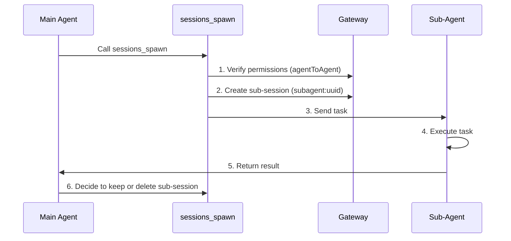

# Session Management and Multi-Agent: Session Isolation, Sub-Agent Collaboration, and Context Compression

## What You'll Learn

- Understand Clawdbot's session model and session key structure
- Configure session isolation between different Agents
- Use sub-agents to complete isolated tasks
- Manage context windows to avoid exceeding model limits
- Master best practices for session reset and compression

## Your Current Challenge

When your AI assistant serves multiple users and multiple channels simultaneously, you may encounter these problems:

- **Session Crosstalk**: Messages from different users get mixed together, and the AI can't remember their respective histories
- **Context Explosion**: After long conversations, the model starts "forgetting" or responding slowly
- **Subtask Confusion**: When the main Agent calls subtasks, there are no clear isolation boundaries
- **Resource Waste**: All Agents share the same session, making it impossible to effectively utilize storage and computing resources

Clawdbot's **Session Management System** is designed to solve these problems.

## Core Concepts

A **session** is Clawdbot's core abstraction unit—each session represents an independent conversation history, with its own message records, metadata, and lifecycle.

Clawdbot uses **session keys** to identify and isolate different sessions. Session keys not only distinguish different conversation participants (users, groups, channels), but also distinguish different Agent instances.

::: info What is a Session Key?

A session key is a string identifier used to uniquely identify a session. Format examples:
- `agent:main:main` (main session of the main Agent)
- `agent:work:main` (main session of the work Agent)
- `agent:main:whatsapp:group:123` (WhatsApp group session)
- `cron:job-id` (scheduled task session)

Clawdbot routes messages to the correct Agent based on the session key and maintains independent conversation histories.
:::

## Session Model

### Session Key Composition

Clawdbot uses structured session keys to identify different types of sessions:

| Session Type | Key Format | Example | Description |
|--- | --- | --- | ---|
| **Main Session** | `agent:<agentId>:<mainKey>` | `agent:main:main` | Default main session for each Agent |
| **Direct Message** | `agent:<agentId>:dm:<peerId>` | `agent:main:dm:+15551234567` | Isolated by `dmScope` configuration |
| **Group/Channel** | `agent:<agentId>:<channel>:group:<id>` | `agent:main:whatsapp:group:123` | Automatic isolation for groups and channels |
| **Sub-Agent** | `agent:<agentId>:subagent:<uuid>` | `agent:main:subagent:a1b2c3d4` | Isolated session for sub-agents |
| **Scheduled Task** | `cron:<jobId>` | `cron:daily-report` | Dedicated session for Cron tasks |
| **Webhook** | `hook:<uuid>` | `hook:xyz789` | Session triggered by Webhook |

### Session Storage

Session data is stored in two locations:

```bash
# Session index (metadata)
~/.clawdbot/agents/<agentId>/sessions/sessions.json

# Message history (one file per session)
~/.clawdbot/agents/<agentId>/sessions/<sessionId>.jsonl
```

**sessions.json** is a mapping table that records:
- Session key → Session metadata (sessionId, updatedAt, model, tokens, etc.)
- Deleting these entries is safe; they will be automatically rebuilt when needed

**JSONL files** store complete conversation histories, with one message record per line.

::: tip Gateway is the Single Source of Truth

All session states are owned by Gateway. UI clients (macOS app, WebChat) must query session lists and token counts from Gateway, rather than directly reading local files.

In remote mode, the sessions you care about are stored on the remote Gateway host, not on your Mac.
:::

## Session Isolation Mechanism

### Single Agent Mode (Default)

If no configuration is made, Clawdbot runs a single Agent:
- `agentId` defaults to `main`
- All DM sessions share the main session key (`agent:main:main`)
- This means **messages from the same user across different channels will enter the same session**

### Multi-Agent Mode

**Multiple Agents = Multiple Isolated Brains**

Each Agent has its own independent:
- **Workspace** (workspace files, AGENTS.md, SOUL.md)
- **State directory** (auth configuration, model registry)
- **Session store** (chat history and routing state)

#### Why Multiple Agents?

| Scenario | Solution |
|--- | ---|
| **Multi-user shared server** | Each user has an independent Agent, sessions completely isolated |
| **Different channels, different personas** | WhatsApp for daily Agent, Telegram for deep work Agent |
| **Permission separation** | Family Agent with restricted tools, personal Agent with full access |
| **Different environments** | Development Agent, production Agent completely isolated |

#### Configuring Multiple Agents

**Step 1: Add New Agent**

```bash
clawdbot agents add work
```

This creates a new Agent directory at `~/.clawdbot/agents/work/`.

**Step 2: Configure Routing Rules**

Add `bindings` to `~/.clawdbot/clawdbot.json`:

```json5
{
  agents: {
    list: [
      { id: "home", workspace: "~/clawd-home", name: "Home" },
      { id: "work", workspace: "~/clawd-work", name: "Work" }
    ]
  },
  bindings: [
    { agentId: "home", match: { channel: "whatsapp", accountId: "personal" } },
    { agentId: "work", match: { channel: "whatsapp", accountId: "biz" } }
  ]
}
```

**Step 3: Verify Configuration**

```bash
clawdbot agents list --bindings
```

#### Routing Rules (Deterministic Matching)

When a message arrives, Clawdbot matches rules in **most specific first** order:

1. **peer** match (exact DM/group/channel id)
2. **guildId** (Discord)
3. **teamId** (Slack)
4. **accountId** match
5. Channel level match (`accountId: "*"`)
6. Fallback to default Agent

::: warning Note Binding Order

The order in the bindings list is important! More specific rules should be placed first.

For example, if you want to route a specific DM to the `work` Agent and other WhatsApp DMs to the `home` Agent, you must write the peer rule first:
```json5
{
  bindings: [
    { agentId: "work", match: { channel: "whatsapp", peer: { kind: "dm", id: "+15551234567" } } },
    { agentId: "home", match: { channel: "whatsapp" } }
  ]
}
```
:::

### DM Scope Control

Use `session.dmScope` to control how direct messages are grouped:

| Option | Behavior | Use Case |
|--- | --- | ---|
| `main` (default) | All DMs share the main session | Single user, multiple channels |
| `per-peer` | Isolated by sender ID | Multi-user environment |
| `per-channel-peer` | Isolated by channel + sender | Shared inbox |

Configuration example:

```json5
{
  session: {
    dmScope: "per-channel-peer"  // Separate session for each user on each channel
  }
}
```

### Identity Links

If the same user uses multiple platforms (e.g., WhatsApp and Telegram), you can use `session.identityLinks` to let them share a session:

```json5
{
  session: {
    identityLinks: {
      alice: ["telegram:123456789", "discord:987654321012345678"]
    }
  }
}
```

This way, messages from Alice via Telegram or Discord will all enter the `agent:<agentId>:dm:alice` session.

## Sub-Agent Collaboration

### What is a Sub-Agent

A **sub-agent** is an Agent instance running in an isolated session, used to execute specific tasks without affecting the main session's context.

Typical use cases:
- **Code review**: Sub-agent analyzes code, returns a summary
- **Data extraction**: Sub-agent extracts information from long documents
- **Parallel tasks**: Sub-agent runs in the background while the main Agent waits
- **Sandbox isolation**: Execute untrusted tasks in a restricted environment

### sessions_spawn Tool

Use the `sessions_spawn` tool to create a sub-agent:

```json
{
  "task": "Analyze this document and extract key points",
  "label": "Document Analysis",
  "model": "anthropic/claude-opus-4-5",
  "thinking": "detailed",
  "runTimeoutSeconds": 300,
  "cleanup": "keep"
}
```

Parameter description:

| Parameter | Type | Required | Description |
|--- | --- | --- | ---|
| `task` | string | ✅ | Task description for the sub-agent |
| `label` | string | ❌ | Readable task label (for tracking) |
| `agentId` | string | ❌ | Target Agent ID (default: current Agent) |
| `model` | string | ❌ | Model override |
| `thinking` | string | ❌ | Thinking level (`minimal`/`standard`/`detailed`) |
| `runTimeoutSeconds` | number | ❌ | Timeout (seconds) |
| `cleanup` | string | ❌ | Cleanup strategy after task completion (`keep`/`delete`) |

### Sub-Agent Lifecycle



**Lifecycle steps**:

1. **Permission check**: If cross-Agent call, verify `tools.agentToAgent.allow` configuration
2. **Create sub-session**: Generate a unique `agent:<agentId>:subagent:<uuid>` key
3. **Execute task**: Sub-agent completes the task in an isolated session
4. **Return result**: Result is streamed back to the main Agent
5. **Cleanup strategy**:
   - `cleanup: "keep"`: Keep sub-session for subsequent inspection
   - `cleanup: "delete"`: Automatically delete sub-session

### Configuring Agent-to-Agent Communication

By default, Agent-to-Agent communication is disabled. You need to explicitly enable it:

```json5
{
  tools: {
    agentToAgent: {
      enabled: true,
      allow: ["home", "work", "family"]
    }
  }
}
```

Permission explanation:
- `enabled: false`: Completely disable Agent-to-Agent communication
- `allow: ["*"]`: Allow any Agent
- `allow: ["home", "work"]`: Allow only specific Agents

::: danger Security Reminder

Sub-agents inherit partial context from the parent Agent, but **do not** get the complete parent session history. This is both a feature (saves tokens) and a limitation (sub-agent doesn't know the full context).

For sensitive operations, consider completing them in the main session rather than through a sub-agent.
:::

## Context Compression

### What is a Context Window

Every AI model has a **context window**—the maximum number of tokens it can see in a single inference.

Long conversations accumulate messages and tool results. Once close to the model limit, Clawdbot will **compact** the history to free up space.

### Automatic Compression

When a session approaches or exceeds the context window, Clawdbot automatically triggers compression:

- **Before compression**: First run a **silent memory refresh**, prompting the model to write persistent notes to disk (if the workspace is writable)
- **Compression process**: Summarize old conversations into a compacted summary, preserving recent messages
- **Persistence**: Write compression results to JSONL history file
- **Retry**: Retry the original request with the compressed context

You'll see:
- `🧹 Auto-compaction complete` (in verbose mode)
- `/status` shows `🧹 Compactions: <count>`

### Manual Compression

Use the `/compact` command to manually trigger compression:

```
/compact
```

You can add compression instructions:

```
/compact Focus on decisions and open questions
```

This guides the AI to focus on specific content when summarizing.

### Compression vs Pruning

| Operation | Purpose | Persistence | Location |
|--- | --- | --- | ---|
| **Compression** | Summarize old conversations | ✅ | Written to JSONL |
| **Pruning** | Remove old tool results | ❌ | In memory only |

::: tip Compression Strategy Recommendations

- **Compression**: Save information summary, suitable when you need to review history
- **Pruning**: Temporary cleanup, suitable for reducing token usage in a single request
- **/new**: Completely clear the session, used when starting a new topic

Choose the appropriate strategy based on your usage habits.
:::

### Compression Configuration

Configure compression behavior in `~/.clawdbot/clawdbot.json`:

```json5
{
  agents: {
    defaults: {
      compaction: {
        enabled: true,
        threshold: 0.9,  // Trigger when context usage reaches 90%
        trigger: "auto"  // auto/manual
      }
    }
  }
}
```

## Follow Along: Configuring Session Management

Let's configure session management through a practical scenario.

### Scenario

You have a WhatsApp number and want to:
1. Personal contacts use the `home` Agent (daily conversations)
2. Work groups use the `work` Agent (professional responses)
3. Enable sub-agents for isolated tasks

### Step 1: Add Two Agents

```bash
# Add home Agent
clawdbot agents add home

# Add work Agent
clawdbot agents add work
```

**You should see**: A prompt asking you to enter the workspace path and other information.

### Step 2: Edit Configuration File

Open `~/.clawdbot/clawdbot.json` and add the Agent list and binding rules:

```json5
{
  agents: {
    list: [
      {
        id: "home",
        name: "Home",
        workspace: "~/clawd-home",
        model: "anthropic/claude-sonnet-4-5"
      },
      {
        id: "work",
        name: "Work",
        workspace: "~/clawd-work",
        model: "anthropic/claude-opus-4-5"
      }
    ]
  },
  bindings: [
    // Personal messages route to home Agent
    { agentId: "home", match: { channel: "whatsapp", peer: { kind: "dm", id: "+15551230001" } } },
    // Work groups route to work Agent
    { agentId: "work", match: { channel: "whatsapp", peer: { kind: "group", id: "120363999999999999@g.us" } } },
    // Other WhatsApp messages route to home Agent (default)
    { agentId: "home", match: { channel: "whatsapp" } }
  ],
  tools: {
    agentToAgent: {
      enabled: true,
      allow: ["home", "work"]
    }
  }
}
```

### Step 3: Restart Gateway

```bash
clawdbot gateway restart
```

**You should see**: Gateway startup logs, showing loaded Agents and binding rules.

### Step 4: Test Sub-Agent Call

Send this in the `home` Agent's session:

```
Please use a sub-agent to analyze this PDF document and extract key information: /path/to/file.pdf
```

The Agent should automatically call the `sessions_spawn` tool, and you'll see:
- Sub-agent creation notification
- Task execution process
- Result return

### Step 5: Check Session Status

Send in chat:

```
/status
```

**You should see**:
- Token usage of the current session
- Number of compactions
- Model information

## Checkpoint ✅

After completing the configuration, verify the following:

- [ ] `clawdbot agents list --bindings` shows correct binding rules
- [ ] Personal DMs route to the `home` Agent
- [ ] Work groups route to the `work` Agent
- [ ] Sub-agent calls work properly
- [ ] `/status` shows correct session information

## Common Pitfalls

### Common Errors

| Error | Cause | Solution |
|--- | --- | ---|
| **Agent-to-Agent call forbidden** | `tools.agentToAgent.enabled` not enabled or `allow` list doesn't include target Agent | Check configuration, ensure it's enabled and add the allowed list |
| **Sub-agent creation failed** | When calling across Agents, the target Agent is not in the allowed list | Check `tools.agentToAgent.allow` configuration |
| **Session key conflict** | Binding rule order is wrong, more specific rules are overridden | Place peer rules before channel rules |
| **Compression failed** | Context too small or model doesn't support compression | Check the model context window and compression configuration |

### Configuration Recommendations

- **Start simple**: Test with a single Agent first, then add multi-Agent after confirming functionality works
- **Use labels**: Add clear `label` to sub-agent tasks for easy tracking
- **Monitor token usage**: Regularly check `/status` to understand context usage
- **Backup configuration**: Backup `clawdbot.json` before modifying

## Lesson Summary

This lesson introduced Clawdbot's session management system:

- **Session model**: Session keys, storage location, lifecycle
- **Session isolation**: Multi-Agent mode, DM scope control, identity links
- **Sub-agent collaboration**: `sessions_spawn` tool, permission control, cleanup strategies
- **Context compression**: Automatic/manual compression, compression vs pruning

By properly configuring session management, you can let Clawdbot serve multiple users and scenarios simultaneously, each with their own isolated context and history.

## Next Lesson Preview

> In the next lesson, we'll learn **[Browser Automation Tools](../tools-browser/)**.
>
> You'll learn:
> - How to configure and use browser tools
> - Security limits of browser automation
> - Screenshots and form operations

---

## Appendix: Source Code Reference

<details>
<summary><strong>Click to expand source code locations</strong></summary>

> Last updated: 2026-01-27

| Feature | File Path | Lines |
|--- | --- | ---|
| Session key parsing | [`src/routing/session-key.ts`](https://github.com/moltbot/moltbot/blob/main/src/routing/session-key.ts) | 1-100 |
| Session configuration schema | [`src/config/zod-schema.session.ts`](https://github.com/moltbot/moltbot/blob/main/src/config/zod-schema.session.ts) | 11-83 |
|--- | --- | ---|
| Session tool helper functions | [`src/agents/tools/sessions-helpers.ts`](https://github.com/moltbot/moltbot/blob/main/src/agents/tools/sessions-helpers.ts) | 1-328 |
| Session management documentation | [`docs/concepts/session.md`](https://github.com/moltbot/moltbot/blob/main/docs/concepts/session.md) | 1-151 |
|--- | --- | ---|
| Context compression documentation | [`docs/concepts/compaction.md`](https://github.com/moltbot/moltbot/blob/main/docs/concepts/compaction.md) | 1-50 |

**Key Constants**:
- `SESSION_ID_RE = /^[0-9a-f]{8}-[0-9a-f]{4}-[0-9a-f]{4}-[0-9a-f]{4}-[0-9a-f]{12}$/i`: Session ID regex (`sessions-helpers.ts:96`)

**Key Types**:
- `SessionKind = "main" | "group" | "cron" | "hook" | "node" | "other"`: Session type enum (`sessions-helpers.ts:11`)
- `SessionListRow`: Session list row structure (`sessions-helpers.ts:19-41`)

**Key Functions**:
- `createSessionsSpawnTool()`: Create sub-agent spawn tool (`sessions-spawn-tool.ts:60-269`)
- `resolveSessionReference()`: Resolve session reference (`sessions-helpers.ts:215-253`)
- `classifySessionKind()`: Classify session type (`sessions-helpers.ts:255-271`)
- `createAgentToAgentPolicy()`: Create Agent-to-Agent communication policy (`sessions-helpers.ts:72-94`)

</details>
