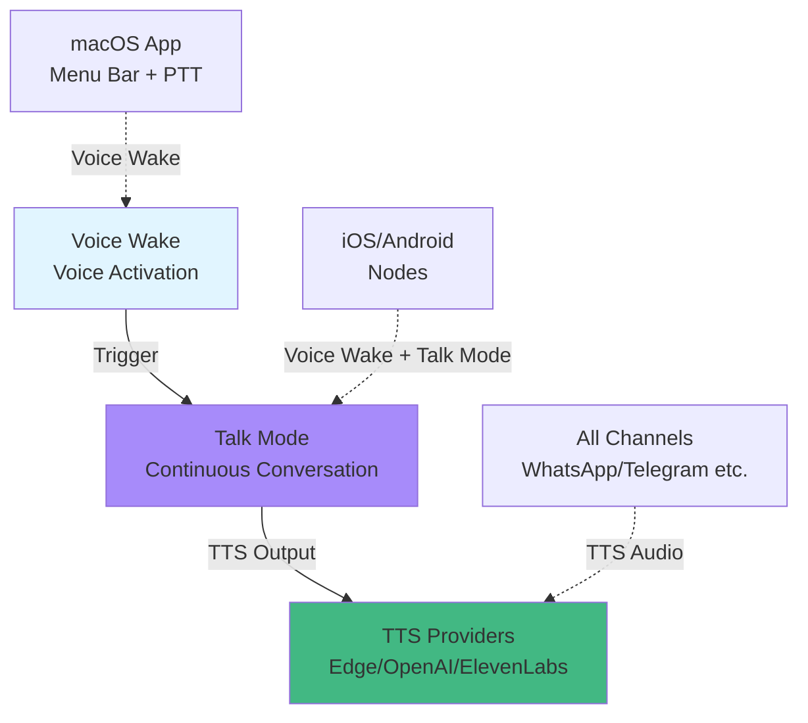

# Voice Wake and Text-to-Speech

## What You'll Learn

- Configure Voice Wake voice activation, supporting macOS/iOS/Android nodes
- Use Talk Mode for continuous voice conversation (voice input → AI → voice output)
- Configure multiple TTS providers (Edge, OpenAI, ElevenLabs) with automatic failover
- Customize wake words, TTS voices, and conversation parameters
- Troubleshoot common voice issues (permissions, audio formats, API errors)

## Your Current Struggles

Voice interaction is convenient, but configuration can be confusing:

- Which TTS provider should you use? Edge is free but average quality, ElevenLabs is high quality but requires payment
- What's the difference between Voice Wake and Talk Mode? When should you use each?
- How do you set up a custom wake word instead of the default "clawd"?
- How do you sync voice configuration across different devices (macOS, iOS, Android)?
- Why does TTS output format matter? Why does Telegram use Opus while other channels use MP3?

## When to Use This Feature

- **Voice Wake**: When you need a hands-free voice assistant experience. For example, wake AI directly by speaking on macOS or iOS/Android without keyboard input.
- **Talk Mode**: When you need continuous voice conversation. For example, have multi-turn voice conversations with AI while driving, cooking, or walking.
- **TTS Configuration**: When you want AI replies to be played via voice. For example, providing voice assistants for elderly or visually impaired users, or personal voice assistant experience.
- **Custom Voice**: When you're not satisfied with the default voice. For example, adjust speed, pitch, stability, or switch to Chinese voice models.

## 🎒 Prerequisites

::: warning Prerequisites
This tutorial assumes you've completed [Quick Start](../../start/getting-started/) and have installed and started Gateway.
::

- Gateway daemon is running
- At least one AI model provider configured (Anthropic or OpenAI)
- **For Voice Wake**: macOS/iOS/Android device installed and connected to Gateway
- **For Talk Mode**: iOS or Android node connected (macOS menu bar app only supports Voice Wake)
- **For ElevenLabs TTS**: ElevenLabs API Key ready (if high-quality voice is needed)
- **For OpenAI TTS**: OpenAI API Key ready (optional, Edge TTS is free but average quality)

::: info Permissions Reminder
Voice Wake and Talk Mode require the following permissions:
- **Microphone Permission**: Required for voice input
- **Speech Recognition Permission**: Voice-to-text
- **Accessibility Permission** (macOS): Global hotkey monitoring (e.g., Cmd+Fn push-to-talk)
::

## Core Concepts

### Three Distinct Voice Features

Clawdbot's voice features are divided into three independent modules that work together:



**Key Differences**:

| Feature | Purpose | Supported Platforms | Trigger Method | Conversation Rounds |
|--- | --- | --- | --- | ---|
| **Voice Wake** | Single voice command | macOS/iOS/Android | Wake word (e.g., "clawd") | Single |
| **Talk Mode** | Continuous voice conversation | iOS/Android | Manual start | Multiple (loop) |
| **TTS** | Text-to-speech | All channels | Auto-triggered by AI reply | None (passive) |

### Voice Wake: Global Wake Word System

**Key Design**: Wake words are **Gateway global configuration**, not node-local configuration.

- **Storage Location**: `~/.clawdbot/settings/voicewake.json` (Gateway host)
- **Default Wake Words**: `["clawd", "claude", "computer"]`
- **Sync Mechanism**: Any node/macOS App modification triggers Gateway broadcast to all devices

```json
{
  "triggers": ["clawd", "claude", "computer"],
  "updatedAtMs": 1737489200000
}
```

**Push-to-Talk**:
- macOS supports holding `Cmd+Fn` or `Right Option` key to start voice input directly, no wake word needed
- iOS/Android supports via UI button

### Talk Mode: Voice Conversation Loop

Talk Mode is a continuous voice conversation loop:

```
1) Listen to voice input (speech recognition)
2) Send text to AI model (chat.send)
3) Wait for AI reply
4) Play reply via TTS (streaming playback)
5) Return to step 1 (loop)
```

**Key Features**:

| Feature | Description | Platform Support |
|--- | --- | ---|
| **Interrupt Playback** | Immediately stop TTS playback when user speaks | iOS/Android |
| **State Transition** | Listening → Thinking → Speaking three-state loop | iOS/Android |
| **JSON Commands** | AI can embed JSON in replies to control voice parameters | All |
| **Streaming TTS** | ElevenLabs streaming API, low-latency playback | iOS/Android/macOS |

### TTS: Multi-Provider Automatic Failover

Clawdbot supports three TTS providers with automatic failover by priority:

```typescript
// Priority order (source: src/tts/tts.ts:482-484)
const providers = [primaryProvider, ...otherProviders];

// Example: Primary ElevenLabs, automatically try OpenAI on failure, then Edge
providers = ["elevenlabs", "openai", "edge"];
```

| Provider | Quality | Speed | Cost | API Key | Recommended Use |
|--- | --- | --- | --- | --- | ---|
| **ElevenLabs** | ⭐⭐⭐⭐⭐ | ⭐⭐⭐⭐ | Paid | High-quality voice, Talk Mode (streaming) |
| **OpenAI** | ⭐⭐⭐⭐ | ⭐⭐⭐ | Paid | Standard quality, stable and reliable |
| **Edge TTS** | ⭐⭐⭐ | ⭐⭐ | Free | Default free option, testing, backup |

::: info Edge TTS Note
Edge TTS uses Microsoft Edge's online neural TTS service (via `node-edge-tts`), no API Key required, but no official SLA. Suitable as a free backup, not recommended for production.
::

### Output Format: Channel Determines Format

TTS output format is determined by the **target channel**, not configuration:

| Channel | Output Format | Format Description | Reason |
|--- | --- | --- | ---|
| **Telegram** | Opus (`opus_48000_64`) | 48kHz/64kbps | Telegram voice messages require Opus |
| **Other Channels** | MP3 (`mp3_44100_128`) | 44.1kHz/128kbps | Good universal compatibility |
| **Talk Mode** | PCM (`pcm_44100` / `pcm_24000`) | Raw audio stream | iOS/Android AudioTrack playback |

::: tip Automatic Format Selection
Clawdbot automatically selects format based on channel, no manual configuration needed. But you can customize Edge TTS output via `messages.tts.edge.outputFormat`.
::

## Step-by-Step Guide

### Step 1: Configure Basic TTS (Minimum Configuration)

**Why**
Edge TTS is a zero-configuration starting point, no API Key needed, suitable for quick testing.

Edit `~/.clawdbot/clawdbot.json`:

```yaml
messages:
  tts:
    auto: "always"  # Enable automatic TTS
    provider: "edge"  # Use Edge TTS
    edge:
      enabled: true
      voice: "zh-CN-XiaoxiaoNeural"  # Chinese voice
      lang: "zh-CN"
      outputFormat: "audio-24khz-48kbitrate-mono-mp3"
```

**What You Should See**:
- AI replies automatically include audio files
- Channels (e.g., WhatsApp/Telegram) receive voice messages or audio links
- Default voice is English (`en-US-MichelleNeural`), modify `voice` field for Chinese

::: tip Chinese Voice Examples
Edge TTS supports Chinese voices, example IDs:
- `zh-CN-XiaoxiaoNeural` (female, gentle)
- `zh-CN-YunxiNeural` (male)
- `zh-CN-YunyangNeural` (male, steady)
::

**Restart Gateway**:

```bash
clawdbot gateway restart
```

### Step 2: Configure ElevenLabs TTS (Recommended for High Quality)

**Why**
ElevenLabs provides industry-leading voice quality and expressiveness, supports streaming TTS (low latency), suitable for Talk Mode.

#### 2.1 Get API Key

Visit [ElevenLabs Console](https://elevenlabs.io/app), create account and generate API Key.

#### 2.2 Configure Authentication

**Method A: Environment Variables (Recommended)**

```bash
export ELEVENLABS_API_KEY="xi_..."
# Or use alias
export XI_API_KEY="xi_..."
```

**Method B: Configuration File**

Edit `~/.clawdbot/clawdbot.json`:

```yaml
messages:
  tts:
    auto: "always"
    provider: "elevenlabs"  # Primary choice: ElevenLabs
    elevenlabs:
      apiKey: "xi_..."  # Optional, environment variable takes priority
      baseUrl: "https://api.elevenlabs.io"
      voiceId: "pMsXgVXv3BLzUgSXRplE"  # Default voice
      modelId: "eleven_multilingual_v2"  # Multilingual model
      voiceSettings:
        stability: 0.5  # Stability (0-1)
        similarityBoost: 0.75  # Similarity boost (0-1)
        style: 0.0  # Style (0-1)
        useSpeakerBoost: true
        speed: 1.0  # Speed (0.5-2.0)
```

**What You Should See**:
- AI reply audio quality significantly improved
- Telegram receives circular voice message bubbles (Opus format)
- Can switch back to backup provider via `/tts provider edge`

### Step 3: Configure OpenAI TTS as Backup

**Why**
Configuring backup providers ensures automatic failover when primary provider (e.g., ElevenLabs) encounters API errors or quota limits.

Edit `~/.clawdbot/clawdbot.json`:

```yaml
messages:
  tts:
    auto: "always"
    provider: "elevenlabs"  # Primary choice
    openai:
      apiKey: "sk-..."  # Optional, environment variable takes priority
      model: "gpt-4o-mini-tts"  # OpenAI TTS model
      voice: "alloy"  # Voice ID
```

**Automatic Failover Logic** (source: `src/tts/tts.ts:1097-1234`):

```typescript
// Attempt order
for (const provider of ["elevenlabs", "openai", "edge"]) {
  try {
    // Try provider
    if (provider === "elevenlabs") await elevenLabsTTS(...);
    if (provider === "openai") await openaiTTS(...);
    if (provider === "edge") await edgeTTS(...);
    return { success: true, ... };  // Return on success
  } catch (err) {
    lastError = `${provider}: ${err.message}`;
    // Continue trying next provider
  }
}
```

### Step 4: Configure Voice Wake Wake Words

**Why**
Custom wake words make your voice assistant more personalized, or avoid false triggers (e.g., default "computer" might conflict with daily conversation).

#### 4.1 Configure via macOS App

1. Open macOS menu bar app
2. Go to **Settings** → **Voice Wake**
3. Edit **Trigger Words** table
4. Add custom wake words (e.g., "助手", "小助")
5. Save automatically syncs to Gateway

**What You Should See**:
- `~/.clawdbot/settings/voicewake.json` updated
- All connected nodes (iOS/Android) receive new wake words
- Voice recognizer activates after speaking custom wake word

#### 4.2 Configure via Gateway RPC (Advanced)

```bash
# Get current wake words
clawdbot gateway rpc voicewake.get

# Set new wake words
clawdbot gateway rpc voicewake.set '{"triggers":["小助","助手"]}'
```

::: warning Wake Word Limitations
- Each wake word should be 2-4 syllables (e.g., "clawd" is 2 syllables)
- Overly long wake words (e.g., "hey hello my AI assistant") are hard to recognize
- Default allows maximum 10 wake words (can modify source code to adjust)
::

### Step 5: Use Talk Mode (iOS/Android)

**Why**
Talk Mode provides true voice assistant experience: continuous conversation, interrupt playback, real-time feedback.

#### 5.1 Prerequisite Check

- ✅ iOS or Android node connected to Gateway
- ✅ ElevenLabs API Key configured (recommended for streaming TTS)
- ✅ Node granted microphone and speech recognition permissions

::: info Talk Mode Platform Support
| Platform | Talk Mode | Voice Wake |
|--- | --- | ---|
| macOS | ❌ Not Supported | ✅ Supported |
| iOS | ✅ Supported | ✅ Supported |
| Android | ✅ Supported | ✅ Supported |

Talk Mode requires streaming TTS, ElevenLabs recommended. Edge TTS and OpenAI don't support streaming playback.
::

#### 5.2 Enable Talk Mode via iOS App

1. Open iOS Clawdbot app
2. Click **Talk** button to enable
3. Grant microphone permission (if first use)
4. See overlay showing **Listening** (cloud pulsating)

#### 5.3 Start Voice Conversation

**Flow Experience**:

```
Listening
  → Voice recognized
    → Thinking (AI generating reply)
      → Speaking (playing TTS, cloud expands)
        → Return to Listening (loop)
```

**Interrupt Feature**:
- While AI is playing, you can start speaking directly
- TTS automatically stops, new speech recognition starts immediately
- AI sees interrupt timestamp, knows user interrupted in next conversation round

#### 5.4 AI Voice Command Control

AI can embed JSON commands in replies to control voice parameters (source: `docs/nodes/talk.md:22-41`):

**Example Reply**:

```text
好的，这是你要的内容。
{"voice":"21m00Tcm4TlvDq8iq1X","speed":1.2}
开始讲解...
```

**Supported Parameters**:

| Parameter | Type | Description |
|--- | --- | ---|
| `voice` / `voice_id` | String | ElevenLabs Voice ID |
| `model` / `model_id` | String | TTS model ID |
| `speed` | Number | Speech speed (0.5-2.0) |
| `stability` | Number | Stability (0-1) |
| `similarityBoost` | Number | Similarity boost (0-1) |
| `once` | Boolean | Only effective for current reply |

### Step 6: Configure TTS Modes and Limits

**Why**
Control when to trigger TTS and handle long replies, avoid unnecessary costs and delays.

Edit `~/.clawdbot/clawdbot.json`:

```yaml
messages:
  tts:
    auto: "inbound"  # Trigger mode: off/always/inbound/tagged
    mode: "final"  # TTS mode: final (only final reply)/all (including tool calls)
    maxTextLength: 4000  # TTS input character limit
    summaryModel: "openai/gpt-4o-mini"  # Long text summary model
    modelOverrides:
      enabled: true  # Allow AI to send TTS commands
```

**TTS Auto Mode** (source: `docs/tts.md:198-203`):

| Mode | Description | Use Case |
|--- | --- | ---|
| `off` | Disable auto TTS | Text interaction |
| `always` | Convert all replies to voice | Voice assistant |
| `inbound` | Convert to voice only when replying to voice messages | Conversational voice |
| `tagged` | Convert to voice only when reply contains `[[tts]]` tag | Precise control |

**Long Text Auto Summarization** (source: `src/tts/tts.ts:825-903`):

When AI reply exceeds `maxLength` (default 1500 characters):
1. Call `summaryModel` to summarize (uses primary AI model by default)
2. Compress text to about `maxLength` length
3. Execute TTS on compressed text

**Disable Summarization**:

```bash
# Disable via command line
/tts summary off

# Or disable in configuration
messages:
  tts:
    auto: "always"
# Don't set summaryModel, or set summaryModel: null
```

### Step 7: Verify Configuration

**Why**
Ensure all voice features work properly, avoid permission or API issues.

#### 7.1 Verify TTS

Send test message:

```bash
clawdbot message send --to +1234567890 --message "请用中文说：你好，这是语音测试"
```

**What You Should See**:
- Channel receives voice message (not text)
- Audio quality matches configured provider
- No error logs

**Check TTS Status**:

```bash
clawdbot gateway rpc tts.status
```

#### 7.2 Verify Voice Wake (macOS)

1. Ensure microphone permission granted
2. Speak wake word (e.g., "clawd")
3. Wait to hear prompt sound (default macOS "Glass" sound)
4. See overlay showing partial text
5. Stop speaking, see text sent

**What You Should See**:
- Overlay appears immediately after wake word triggered
- Voice recognition displays partial text in real-time
- Auto-sends after stopping speaking

#### 7.3 Verify Talk Mode (iOS/Android)

1. Open node app
2. Click **Talk** button
3. See status cycle from **Listening** → **Thinking** → **Speaking**
4. Try interrupt: speak directly while AI is speaking
5. Observe if TTS stops immediately

**What You Should See**:
- Three-state cycle transitions smoothly
- Interrupt feature works properly
- AI replies played via TTS (not text)

## Checklist ✅

- [ ] Basic TTS configuration completed (Edge or ElevenLabs)
- [ ] At least one channel received AI voice reply
- [ ] Voice Wake wake words customized (if needed)
- [ ] iOS/Android Talk Mode can start and continue conversation
- [ ] TTS interrupt function works properly (Talk Mode)
- [ ] Can switch providers via `/tts` command
- [ ] Gateway logs have no TTS-related errors

## Troubleshooting Tips

### Edge TTS Not Available

**Problem**: TTS fails, logs show "edge: disabled" or "edge output format failed"

**Causes**:
- `messages.tts.edge.enabled: false`
- Configured `outputFormat` not supported by Edge service (source: `docs/tts.md:26-30`)

**Fix**:

```yaml
# ✅ Enable Edge TTS
messages:
  tts:
    edge:
      enabled: true
      outputFormat: "audio-24khz-48kbitrate-mono-mp3"  # Safe format
```

::: warning Edge Format Limitations
Edge TTS doesn't support all Microsoft Speech formats. Recommend using `audio-24khz-48kbitrate-mono-mp3` or `webm-24khz-16bit-mono-opus`.
::

### ElevenLabs API Key Invalid

**Problem**: TTS fails, logs show "ElevenLabs API error (401)"

**Causes**:
- API Key format incorrect (should be `xi_...`, not `sk-...`)
- API Key expired or revoked

**Fix**:

```bash
# 1. Verify API Key format
echo $ELEVENLABS_API_KEY | grep "^xi_"

# 2. Regenerate API Key
# Visit https://elevenlabs.io/app/settings/api-keys

# 3. Test new Key
curl -H "xi-api-key: $ELEVENLABS_API_KEY" \
  https://api.elevenlabs.io/v1/user
```

### Voice Wake Not Responding

**Problem**: No response after speaking wake word

**Causes**:
- Microphone permission not granted
- Speech recognition service not started (macOS fails after reboot)
- Wake word too complex or pronunciation unclear

**Diagnostic Steps**:

```bash
# 1. Check Gateway logs
clawdbot gateway logs

# 2. View current wake words
cat ~/.clawdbot/settings/voicewake.json

# 3. macOS: Check permissions
# System Settings → Privacy & Security → Microphone
# Ensure Clawdbot is checked

# 4. macOS: Check speech recognition
# System Settings → Keyboard → Dictation
# Ensure enabled
```

**Fix**:

```bash
# Restart Gateway daemon
clawdbot gateway restart

# Restore default wake words
clawdbot gateway rpc voicewake.set '{"triggers":[]}'

# macOS: Restart speech recognition service
sudo killall -9 speechrecognitiond
```

### Talk Mode Won't Start

**Problem**: iOS/Android click Talk button but no response or error message

**Causes**:
- No connected mobile nodes (only iOS/Android support Talk Mode)
- ElevenLabs API Key not configured (Talk Mode recommends streaming TTS)

**Check**:

```bash
# View connected nodes
clawdbot nodes list

# Test ElevenLabs API Key
clawdbot gateway rpc tts.providers
# Should see elevenlabs in available list
```

**Fix**:

1. Ensure iOS/Android node connected (on Gateway host or via macOS App)
2. Configure ElevenLabs API Key (as in Step 2 above)
3. Retry starting Talk Mode

### TTS Output Quality Poor

**Problem**: Voice quality blurry, stuttering, or noisy

**Causes**:
- Using Edge TTS (free but average quality)
- Output format mismatch (e.g., low bitrate)
- Network latency causing streaming playback stutter

**Optimization Suggestions**:

```yaml
# ✅ Use high-quality provider
messages:
  tts:
    provider: "elevenlabs"
    elevenlabs:
      voiceId: "21m00Tcm4TlvDq8iq1X"  # Try different voices
      voiceSettings:
        stability: 0.7  # Increase stability (reduce stutter)
        useSpeakerBoost: true  # Enhance clarity
```

::: tip Voice Selection
ElevenLabs provides voices in different languages and styles:
- **Chinese**: `21m00Tcm4TlvDq8iq1X` (female), `ErXwobaKq9rZ5Q4FmQ` (male)
- **English**: `pMsXgVXv3BLzUgSXRplE` (neutral), `XB0fD4X1Wf7Jq3hF9I` (warm)
Visit [ElevenLabs Voice Lab](https://elevenlabs.io/app/speech-synthesis/voices) to preview.
::

### Summarization Causes Information Loss

**Problem**: Long replies are over-summarized, key information lost

**Causes**:
- `maxLength` set too low (default 1500 characters)
- Summary model understanding偏差

**Adjustment**:

```yaml
messages:
  tts:
    maxTextLength: 4000  # Increase limit
    summaryModel: "anthropic/claude-opus-4-5"  # Use stronger model for summarization
```

Or disable summarization (but may cause TTS failure):

```bash
# Disable via command line
/tts summary off
```

::: info Summarization Trigger Conditions
Only summarize when text exceeds `maxLength` AND `summarize` is enabled. If summarization fails, TTS is skipped, returns original text.
::

## Advanced Configuration

### AI-Driven TTS Commands

**Why**
Let AI dynamically adjust voice parameters based on content (e.g., low speed for serious content, high speed for humorous content).

**Enable AI Commands** (source: `docs/tts.md:232-274`):

```yaml
messages:
  tts:
    modelOverrides:
      enabled: true  # Default on
      allowText: true  # Allow AI to provide expression tags
      allowVoice: true  # Allow AI to switch voices
      allowSpeed: true  # Allow AI to adjust speed
```

**AI Command Examples**:

```text
好的，让我严肃地回答这个问题。
[[tts:speed=0.8 stability=0.8]]
这是一个非常重要的决定...
[[tts:text]](笑声) 当然，开个玩笑啦。[[/tts:text]]
```

**Command Parsing** (source: `src/tts/tts.ts:553-752`):

- `[[tts:speed=0.8]]`: Set current reply speed to 0.8 (default 1.0)
- `[[tts:text]]...[[/tts:text]]`: Expressive text (e.g., laughter, sound effect description), only appears in TTS, doesn't affect text reply

### Disable Specific Commands (Security)

**Reason**: Limit AI's control scope, prevent accidental voice switching or parameter adjustment.

```yaml
messages:
  tts:
    modelOverrides:
      enabled: true
      allowProvider: false  # Forbid AI from switching providers
      allowVoice: false  # Forbid AI from switching voice ID
      allowSeed: false  # Forbid AI from setting random seed
```

### Push-to-Talk Hotkeys (macOS)

**Why**
Push-to-Talk is more precise than voice wake, avoids false triggers.

Configuration (source: `docs/platforms/mac/voicewake.md:10-38`):

1. Open macOS App Settings
2. Enable **Hold Cmd+Fn to talk** (requires macOS ≥ 26)
3. Or use **Right Option** key (enabled by default)

**Usage**:
1. Hold `Cmd+Fn` or `Right Option`
2. See overlay showing real-time speech recognition text
3. Release key, text auto-sends to AI

::: info Permission Requirements
Push-to-Talk requires **Accessibility** permission to monitor global hotkeys.
::

### Environment Variable Priority

**Why**
Manage API Keys via environment variables, avoid committing sensitive info to Git.

**Priority Order** (source: `src/tts/tts.ts:467-477`):

```typescript
// 1. API Key in config file
config.elevenlabs.apiKey

// 2. Environment variables
process.env.ELEVENLABS_API_KEY || process.env.XI_API_KEY
process.env.OPENAI_API_KEY

// 3. OpenAI TTS custom endpoint (for Kokoro and other compatible services)
process.env.OPENAI_TTS_BASE_URL
```

**Example Configuration**:

```bash
# ~/.zshrc or ~/.bashrc
export ELEVENLABS_API_KEY="xi_..."
export OPENAI_API_KEY="sk-..."
export CLAWDBOT_TTS_PREFS="~/.clawdbot/settings/tts.json"
```

## FAQ

### What's the Difference Between Voice Wake and Talk Mode?

**Voice Wake**:
- Single trigger
- Speak wake word → recognize → send → end
- Supports macOS/iOS/Android
- Suitable for quick commands (e.g., "clawd, today's weather")

**Talk Mode**:
- Continuous loop
- Recognize → AI → play → recognize → AI → play...
- Only supports iOS/Android
- Suitable for multi-turn conversation (e.g., "hello → AI replies → ask again → AI replies...")

### How to Choose TTS Provider?

| Scenario | Recommended Provider |
|--- | ---|
| **Free Testing** | Edge TTS (no API Key needed) |
| **High-Quality Voice** | ElevenLabs (best expressiveness) |
| **Stable and Reliable** | OpenAI (standard quality, stable API) |
| **Talk Mode** | ElevenLabs (streaming TTS) |
| **Production Environment** | ElevenLabs or OpenAI (SLA support) |

::: tip Recommended Configuration
Most users configure:
- Primary: ElevenLabs (high quality)
- Secondary: OpenAI (stable)
- Emergency: Edge TTS (free)
::

### Why Are Telegram Voice Messages Circular Bubbles While Other Channels Are Links?

**Telegram Requirements**:
- Voice messages must be **Opus format** (`opus_48000_64`)
- Only Opus format triggers circular voice bubble UX

**Other Channels**:
- Use standard **MP3 format** (`mp3_44100_128`)
- Display as downloadable audio file links

**Auto-Processing**:
Clawdbot automatically selects format based on channel, no manual configuration needed (source: `src/tts/tts.ts:454-457`).

### How Long Does TTS Take?

| Provider | Typical Latency |
|--- | ---|
| Edge TTS | 1-3 seconds (depends on network) |
| OpenAI | 2-4 seconds (standard API) |
| ElevenLabs (streaming) | < 1 second (Talk Mode real-time playback) |

**Factors Affecting Latency**:
- Network speed (especially Edge TTS)
- Text length
- Provider server load
- Streaming playback buffering (Talk Mode)

### How to View TTS Debug Info?

```bash
# View Gateway logs (includes TTS conversion time)
clawdbot gateway logs | grep TTS

# View last TTS attempt status
clawdbot gateway rpc tts.status

# Check TTS configuration
cat ~/.clawdbot/clawdbot.json | grep -A 20 "messages.tts"
```

**Log Examples**:

```
TTS: converting text (120 chars) with provider elevenlabs
TTS: conversion successful in 847ms
TTS: skipped long text (2500 > 1500), summarization disabled
```

### Is Edge TTS Free?

**Official Status**: Edge TTS is Microsoft's online service, pricing and quota limits not publicly disclosed.

**Clawdbot Documentation** (source: `docs/tts.md:27-30`):
- No official SLA
- No quota guarantee
- Recommended as **best-effort** backup

**Practical Advice**:
- Use OpenAI or ElevenLabs for testing and production
- Edge TTS only for development debugging or emergency backup

## Summary

- Clawdbot voice features divided into three modules: Voice Wake (activation), Talk Mode (continuous conversation), TTS (text-to-speech)
- TTS supports three providers: Edge (free), OpenAI (stable), ElevenLabs (high quality), automatic failover
- Voice Wake uses global wake word configuration, stored in Gateway, synced to all nodes
- Talk Mode only supports iOS/Android, provides Listening → Thinking → Speaking three-state loop and interrupt feature
- TTS output format determined by channel (Telegram Opus, others MP3, Talk Mode PCM)
- AI can embed TTS commands in replies to dynamically adjust voice parameters
- Long text auto-summarization can be controlled or disabled
- Recommended configuration: primary ElevenLabs, secondary OpenAI, emergency Edge TTS

## Next Up

> Next lesson: **[Memory System and Vector Search](../memory-system/)**.
>
> You'll learn:
> - Vector storage and semantic search principles
> - SQLite-vec and FTS5 hybrid search
> - Memory system configuration and management
> - Cross-session knowledge persistence

---

## Appendix: Source Code References

<details>
<summary><strong>Click to expand source code locations</strong></summary>

> Last Updated: 2026-01-27

| Feature | File Path | Line Numbers |
|--- | --- | ---|
| TTS Core Logic | [`src/tts/tts.ts`](https://github.com/clawdbot/clawdbot/blob/main/src/tts/tts.ts) | 1-1472 |
| TTS Configuration Parsing | [`src/tts/tts.ts`](https://github.com/clawdbot/clawdbot/blob/main/src/tts/tts.ts) | 248-303 |
| ElevenLabs TTS | [`src/tts/tts.ts`](https://github.com/clawdbot/clawdbot/blob/main/src/tts/tts.ts) | 916-991 |
| OpenAI TTS | [`src/tts/tts.ts`](https://github.com/clawdbot/clawdbot/blob/main/src/tts/tts.ts) | 993-1037 |
| Edge TTS | [`src/tts/tts.ts`](https://github.com/clawdbot/clawdbot/blob/main/src/tts/tts.ts) | 1050-1069 |
| TTS Auto Summarization | [`src/tts/tts.ts`](https://github.com/clawdbot/clawdbot/blob/main/src/tts/tts.ts) | 825-903 |
| TTS Command Parsing | [`src/tts/tts.ts`](https://github.com/clawdbot/clawdbot/blob/main/src/tts/tts.ts) | 553-752 |
| Voice Wake Configuration Management | [`src/infra/voicewake.ts`](https://github.com/clawdbot/clawdbot/blob/main/src/infra/voicewake.ts) | 1-91 |
| Voice Wake Gateway Methods | [`src/gateway/server-methods/voicewake.ts`](https://github.com/clawdbot/clawdbot/blob/main/src/gateway/server-methods/voicewake.ts) | 1-35 |
| Talk Mode Gateway Methods | [`src/gateway/server-methods/talk.ts`](https://github.com/clawdbot/clawdbot/blob/main/src/gateway/server-methods/talk.ts) | 1-39 |

**Key Constants**:
- `DEFAULT_ELEVENLABS_VOICE_ID = "pMsXgVXv3BLzUgSXRplE"` (default voice ID)
- `DEFAULT_OPENAI_MODEL = "gpt-4o-mini-tts"` (default OpenAI TTS model)
- `DEFAULT_EDGE_VOICE = "en-US-MichelleNeural"` (default Edge voice)
- `DEFAULT_TTS_MAX_LENGTH = 1500` (default TTS summarization threshold)
- `DEFAULT_TIMEOUT_MS = 30_000` (default TTS timeout 30 seconds)

**Key Functions**:
- `resolveTtsConfig()`: Parse and merge TTS configuration (`src/tts/tts.ts:248-303`)
- `textToSpeech()`: Main TTS function, supports multi-provider failover (`src/tts/tts.ts:1071-1240`)
- `maybeApplyTtsToPayload()`: Automatically add TTS to replies (`src/tts/tts.ts:1336-1458`)
- `parseTtsDirectives()`: Parse AI's TTS commands (`src/tts/tts.ts:553-752`)
- `summarizeText()`: Long text summarization (`src/tts/tts.ts:825-903`)
- `loadVoiceWakeConfig()`: Load wake word configuration (`src/infra/voicewake.ts:61-74`)
- `setVoiceWakeTriggers()`: Set wake words and broadcast (`src/infra/voicewake.ts:76-90`)

**Configuration File Locations**:
- `~/.clawdbot/clawdbot.json`: Main configuration (TTS settings)
- `~/.clawdbot/settings/voicewake.json`: Wake word configuration (Gateway-owned)
- `~/.clawdbot/settings/tts.json`: TTS user preferences (can override configuration)

</details>
