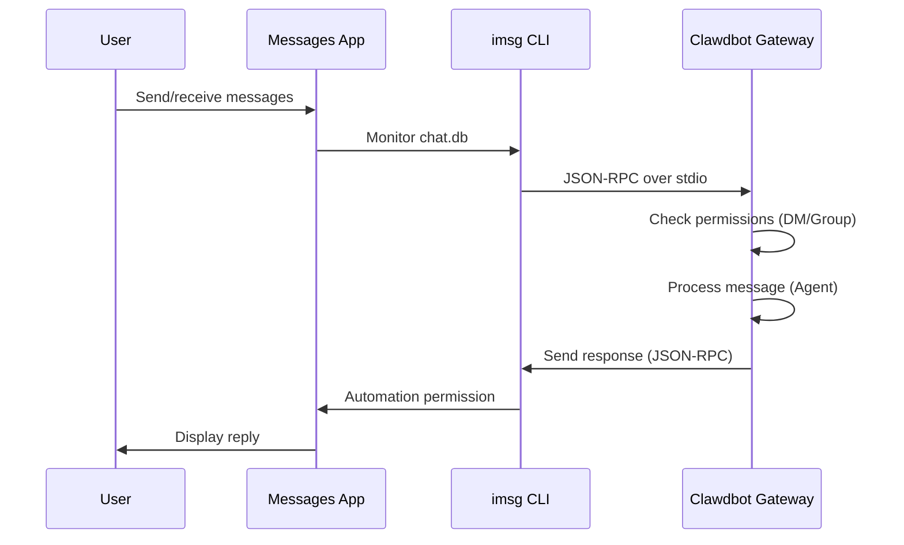

# iMessage Channel Configuration

## What You'll Learn

- 📱 Chat 1:1 with AI assistant via iMessage on macOS
- 👥 Use AI assistant in iMessage groups (supports @mentions)
- 👤 Configure dedicated Mac user to isolate bot identity
- 🌐 Access iMessage on remote Mac via SSH/Tailscale
- 🔒 Master DM pairing and group allowlist access control

## Your Current Situation

You want to use iMessage on macOS to interact with an AI assistant, but you don't know how to:

- Install and configure the `imsg` CLI tool
- Grant Clawdbot Full Disk Access and Automation permissions
- Configure local or remote Mac as iMessage gateway
- Set up multiple iMessage accounts
- Control who can send messages to the bot

## When to Use This

**Suitable scenarios for using iMessage channel**:

- ✅ You primarily use iMessage on macOS
- ✅ Want to use local iMessage (no third-party server dependency)
- ✅ Need text and media interactions with AI assistant via iMessage
- ✅ Want to maintain consistent session experience with other channels (WhatsApp, Telegram)

**Unsuitable scenarios**:

- ❌ Non-macOS systems (iMessage channel only supports macOS)
- ❌ Need cross-platform sync (consider using WebChat, Telegram)
- ❌ Need group @mention functionality (iMessage lacks native mention mechanism, manual configuration required)

## Core Concepts

**iMessage channel workflow**:



**Key concepts**:

| Concept | Description |
|--- | ---|
| **imsg CLI** | Third-party tool, interacts with Messages via JSON-RPC over stdio |
| **Full Disk Access** | macOS permission, allows Clawdbot to read Messages chat.db |
| **Automation permission** | macOS permission, allows imsg to send messages via Automation API |
| **chat_id** | Stable chat identifier, used for routing and session isolation |
| **pairing** | Default DM protection mechanism, unknown senders require approval |

::: tip
The iMessage channel is implemented through `imsg` CLI, not by calling Messages API directly. `imsg` communicates with Clawdbot via JSON-RPC over stdio, which means it can run on a remote Mac (via SSH).
:::

## 🎒 Prerequisites

Ensure you have:

- ✅ Completed [Quick Start](../../start/getting-started/) and installed Clawdbot
- ✅ Gateway is running (`clawdbot gateway --port 18789`)
- ✅ Logged into Messages on macOS (iMessage enabled)
- ✅ Homebrew access (for installing `imsg`)

::: warning
The iMessage channel only supports macOS. Ensure your Gateway runs on macOS, or connects to a remote Mac via SSH/Tailscale.
:::

## Follow Along

### Step 1: Install imsg CLI

**Why**
`imsg` is the core dependency for iMessage channel, interacting with the Messages app via JSON-RPC over stdio.

1. Install using Homebrew:
   ```bash
   brew install steipete/tap/imsg
   ```

**You Should See**:
- `imsg` command available after successful installation
- Running `imsg --version` displays version information

**Verify Installation**:

```bash
# Test if imsg is available
imsg chats --limit 1
```

**You Should See**:
- Output at least one chat record (if any exists)
- Or prompt to grant Full Disk Access permission

### Step 2: Grant Full Disk Access Permission

**Why**
Clawdbot needs to read Messages' `chat.db` database to monitor for new messages.

1. Open **System Settings** > **Privacy & Security**
2. Click **Full Disk Access**
3. Click **+** to add the following applications:
   - `/Applications/Clawdbot.app` (if using macOS app)
   - `/usr/local/bin/imsg` or the actual path to `imsg`
4. Restart Gateway

::: warning
You must restart Gateway for permission changes to take effect!
:::

**You Should See**:
- No permission errors in Gateway startup logs
- `imsg chats --limit 1` outputs chat list normally

### Step 3: Grant Automation Permission

**Why**
`imsg` sends messages via Apple Events Automation API, requiring user authorization.

1. When sending a message for the first time, macOS will show a permission prompt
2. Click **Allow** or **OK**
3. If using a dedicated Mac user, execute a test once in that user's session

**Test Automation Permission**:

```bash
# Send test message (replace with actual recipient)
imsg send --to "+15555550123" "Test message"
```

**You Should See**:
- macOS permission prompt (first time)
- Message sent successfully after granting permission
- Test message displayed in Messages app

### Step 4: Configure Clawdbot

**Why**
Tell Clawdbot which `imsg` path and Messages database location to use.

**Option A: Simple Configuration (Local Mac)**

Edit `~/.clawdbot/clawdbot.json`:

```json5
{
  "channels": {
    "imessage": {
      "enabled": true,
      "cliPath": "/usr/local/bin/imsg",
      "dbPath": "/Users/<your-username>/Library/Messages/chat.db",
      "dmPolicy": "pairing",
      "groupPolicy": "allowlist"
    }
  }
}
```

::: info
Replace `<your-username>` with your actual macOS username.
:::

**Option B: Multi-Account Configuration**

```json5
{
  "channels": {
    "imessage": {
      "enabled": true,
      "accounts": {
        "main": {
          "name": "Main Account",
          "enabled": true,
          "cliPath": "/usr/local/bin/imsg",
          "dbPath": "/Users/alice/Library/Messages/chat.db"
        },
        "bot": {
          "name": "Bot Account",
          "enabled": true,
          "cliPath": "/path/to/imsg-bot-wrapper",  // See Step 5
          "dbPath": "/Users/botuser/Library/Messages/chat.db"
        }
      }
    }
  }
}
```

**Restart Gateway**:

```bash
clawdbot gateway restart
```

**You Should See**:
- Gateway starts and displays "iMessage default: enabled, configured, ..."
- No permission or path error logs

### Step 5: Send Test Message

**Why**
Verify configuration is correct and messages are delivered properly.

1. Send test message using CLI:
   ```bash
   clawdbot message --to imessage:+15555550123 "Hello from Clawdbot!"
   ```

**You Should See**:
- Message received in Messages app
- Gateway logs show message sent
- AI reply received if AI model is configured

::: info
The `imessage:+15555550123` format indicates sending via iMessage channel to phone number `+15555550123`. You can also use email address `imessage:user@example.com`.
:::

## Checkpoint ✅

Verify configuration is successful:

```bash
# Check channel status
clawdbot channels status

# Should display:
# iMessage default: enabled, configured, rpc listening
```

::: info
If you see errors, run `clawdbot channels status --probe` for detailed diagnostic information.
:::

## Advanced Configuration

### Configure Dedicated Mac User (Optional)

If you want to use an independent iMessage identity (without polluting your personal Messages), you can create a dedicated Mac user.

**Steps**:

1. **Create dedicated Apple ID**:
   - Visit [appleid.apple.com](https://appleid.apple.com)
   - Create new Apple ID (e.g., `my-cool-bot@icloud.com`)

2. **Create macOS user**:
   - Open **System Settings** > **Users & Groups**
   - Click **+** to create new user (e.g., `botuser`)
   - Set up auto-login or remember password

3. **Log into dedicated iMessage account**:
   - Switch to `botuser` user
   - Open Messages app
   - Log into iMessage using dedicated Apple ID

4. **Enable Remote Login**:
   - Open **System Settings** > **General** > **Sharing**
   - Enable **Remote Login**

5. **Set up SSH key-based login**:
   ```bash
   # Test SSH from main user
   ssh botuser@localhost true

   # If password is required, configure SSH key:
   ssh-keygen -t ed25519
   ssh-copy-id botuser@localhost
   ```

6. **Create SSH wrapper script**:

   Create `~/.clawdbot/scripts/imsg-bot` (`chmod +x`):

   ```bash
   #!/usr/bin/env bash
   set -euo pipefail

   # Run interactive SSH once to accept host keys:
   #   ssh botuser@localhost true
   exec /usr/bin/ssh -o BatchMode=yes -o ConnectTimeout=5 -T botuser@localhost \
     "/usr/local/bin/imsg" "$@"
   ```

7. **Configure Clawdbot**:

   ```json5
   {
     "channels": {
       "imessage": {
         "enabled": true,
         "accounts": {
           "bot": {
             "name": "Bot",
             "enabled": true,
             "cliPath": "/Users/<your-username>/.clawdbot/scripts/imsg-bot",
             "dbPath": "/Users/botuser/Library/Messages/chat.db"
           }
         }
       }
     }
   }
   ```

::: tip
On first-time configuration, run `imsg chats --limit 1` or `imsg send ...` once in `botuser` session to grant Automation permission.
:::

### Remote Mac Configuration (Optional)

If Gateway runs on Linux/VM but iMessage must be on Mac, you can connect remotely via SSH.

**Architecture**:

```
┌──────────────────────────────┐          SSH (imsg rpc)          ┌──────────────────────────┐
│ Gateway host (Linux/VM)      │──────────────────────────────────▶│ Mac with Messages + imsg │
│ - clawdbot gateway           │          SCP (attachments)        │ - Messages signed in     │
│ - channels.imessage.cliPath  │◀──────────────────────────────────│ - Remote Login enabled   │
└──────────────────────────────┘                                   └──────────────────────────┘
              ▲
              │ Tailscale tailnet (hostname or 100.x.y.z)
              ▼
        user@remote-mac
```

**Configuration Steps**:

1. **Create SSH wrapper** (`~/.clawdbot/scripts/imsg-ssh`):

   ```bash
   #!/usr/bin/env bash
   exec ssh -T bot@remote-mac imsg "$@"
   ```

2. **Configure Clawdbot**:

   ```json5
   {
     "channels": {
       "imessage": {
         "enabled": true,
         "cliPath": "/Users/<your-username>/.clawdbot/scripts/imsg-ssh",
         "remoteHost": "bot@remote-mac",
         "includeAttachments": true,
         "dbPath": "/Users/bot/Library/Messages/chat.db"
       }
     }
   }
   ```

::: info
`remoteHost` is used for SCP attachment transfer. If not set, Clawdbot will attempt to auto-detect from SSH command. Explicit configuration is more reliable.
:::

**Tailscale Configuration Example**:

```bash
# SSH wrapper
#!/usr/bin/env bash
exec ssh -T bot@mac-mini.tailnet-1234.ts.net imsg "$@"
```

```json5
{
  "channels": {
    "imessage": {
      "enabled": true,
      "cliPath": "~/.clawdbot/scripts/imsg-ssh",
      "remoteHost": "bot@mac-mini.tailnet-1234.ts.net",
      "includeAttachments": true,
      "dbPath": "/Users/bot/Library/Messages/chat.db"
    }
  }
}
```

## Configuration Reference

### Basic Configuration

| Setting | Type | Default | Description |
|--- | --- | --- | ---|
| `enabled` | boolean | false | Whether to enable iMessage channel |
| `cliPath` | string | "imsg" | imsg CLI path (can be SSH wrapper) |
| `dbPath` | string | - | Messages chat.db path |
| `remoteHost` | string | - | SSH host (for SCP attachment transfer) |

### DM Policy

| Setting | Type | Default | Description |
|--- | --- | --- | ---|
| `dmPolicy` | "pairing"|"allowlist"|"open"|"disabled" | "pairing" | DM access policy |
| `allowFrom` | array | [] | Allowed sender list (handles, emails, E.164, `chat_id:*`) |

**Pairing new senders**:

```bash
# List pending pairing codes
clawdbot pairing list imessage

# Approve pairing
clawdbot pairing approve imessage <CODE>
```

::: tip
iMessage has no username concept, using handles (phone numbers or email addresses) or chat targets (`chat_id`, `chat_guid`, `chat_identifier`).
:::

### Group Policy

| Setting | Type | Default | Description |
|--- | --- | --- | ---|
| `groupPolicy` | "allowlist"|"open"|"disabled" | "allowlist" | Group access policy |
| `groupAllowFrom` | array | [] | Allowed senders who can trigger AI in groups |
| `groups` | object | {} | Group configuration by chat_id |

**Group Configuration Example**:

```json5
{
  "channels": {
    "imessage": {
      "groupPolicy": "allowlist",
      "groupAllowFrom": ["+15555550123", "alice@example.com"],
      "groups": {
        "42": {
          "requireMention": false,
          "allowFrom": ["bob@example.com"]
        }
      }
    }
  }
}
```

### Media and Text Limits

| Setting | Type | Default | Description |
|--- | --- | --- | ---|
| `includeAttachments` | boolean | false | Whether to include attachments in context |
| `mediaMaxMb` | number | 16 | Maximum media file size (MB) |
| `textChunkLimit` | number | 4000 | Outbound text chunk size (characters) |
| `chunkMode` | "length"|"newline" | "length" | Chunk mode: by length or by blank lines |

### History

| Setting | Type | Default | Description |
|--- | --- | --- | ---|
| `historyLimit` | number | - | Maximum history messages for groups (0 to disable) |
| `dmHistoryLimit` | number | - | DM history message limit (user rounds) |
| `dms["<handle>"].historyLimit` | number | - | Override DM history limit by handle |

## Common Pitfalls

### imsg rpc command not available

**Symptom**: Gateway logs show "imsg CLI does not support 'rpc' subcommand"

**Cause**: `imsg` version too old, does not support `rpc` subcommand

**Solution**:

1. Update `imsg`:
   ```bash
   brew upgrade steipete/tap/imsg
   ```

2. Verify version:
   ```bash
   imsg rpc --help
   ```

### Full Disk Access permission issues

**Symptom**: `imsg chats --limit 1` has no output or reports "Permission denied"

**Solution**:

1. Ensure Clawdbot and `imsg` are added to Full Disk Access
2. Restart Gateway
3. If issue persists, try restarting Mac

### Automation permission issues

**Symptom**: Sending message has no response, Gateway logs show timeout

**Cause**: macOS did not grant Automation permission

**Solution**:

1. Manually send a message in Messages app
2. macOS should show permission prompt
3. Click **Allow**
4. If using dedicated Mac user, switch to that user and repeat steps

### Remote Mac connection failure

**Symptom**: SSH wrapper times out or connection refused

**Solution**:

1. Test SSH connection:
   ```bash
   ssh -T bot@remote-mac imsg --version
   ```

2. Ensure Remote Login is enabled (on remote Mac)

3. Check firewall and port settings

4. Use Tailscale to simplify NAT traversal

## Lesson Summary

- Installed `imsg` CLI tool
- Configured Full Disk Access and Automation permissions
- Learned local and remote Mac configuration methods
- Mastered DM pairing and group allowlist mechanisms
- Understood differences between chat_id, chat_guid, chat_identifier
- Tested 1:1 and group messages

## Next Lesson Preview

> In the next lesson, we'll learn about **[LINE Channel](../line/)**.
>
> You'll learn:
> - How to get LINE Messaging API credentials
> - Configure LINE Bot's Webhook endpoint
> - Message formats and limits for LINE channel
> - Configuration differences with iMessage channel

---

## Appendix: Source Code Reference

<details>
<summary><strong>Click to expand source code locations</strong></summary>

> Last updated: 2026-01-27

| Feature | File Path | Lines |
|--- | --- | ---|
| iMessage configuration type definition | [`src/config/types.imessage.ts`](https://github.com/moltbot/moltbot/blob/main/src/config/types.imessage.ts) | 1-80 |
| iMessage account resolution | [`src/imessage/accounts.ts`](https://github.com/moltbot/moltbot/blob/main/src/imessage/accounts.ts) | 1-83 |
| iMessage probing | [`src/imessage/probe.ts`](https://github.com/moltbot/moltbot/blob/main/src/imessage/probe.ts) | 1-92 |
| iMessage sending | [`src/imessage/send.ts`](https://github.com/moltbot/moltbot/blob/main/src/imessage/send.ts) | 1-135 |
| iMessage monitor provider | [`src/imessage/monitor/monitor-provider.ts`](https://github.com/moltbot/moltbot/blob/main/src/imessage/monitor/monitor-provider.ts) | 1-600+ |
| Target address resolution | [`src/imessage/targets.ts`](https://github.com/moltbot/moltbot/blob/main/src/imessage/targets.ts) | 1-200+ |
| Onboarding adapter | [`src/channels/plugins/onboarding/imessage.ts`](https://github.com/moltbot/moltbot/blob/main/src/channels/plugins/onboarding/imessage.ts) | 1-262 |
| iMessage documentation | [`docs/channels/imessage.md`](https://github.com/moltbot/moltbot/blob/main/docs/channels/imessage.md) | 1-262 |

**Key Types**:
- `IMessageConfig`: Complete iMessage configuration interface
- `IMessageAccountConfig`: Single account configuration
- `IMessageService`: "imessage" | "sms" | "auto"
- `IMessageTargetKind`: "chat_id" | "chat_guid" | "chat_identifier" | "handle"

**Key Configuration Fields**:
- `cliPath`: imsg CLI path, can be local path or SSH wrapper script
- `dbPath`: Messages chat.db database path
- `remoteHost`: SSH host (for SCP attachment transfer), auto-detected or explicitly configured
- `dmPolicy`: Default "pairing", controls unknown DM access
- `groupPolicy`: Group access policy, "allowlist" or "open"
- `groups`: Group configuration by `chat_id`, supports session isolation and custom policies

**Key Functions**:
- `probeIMessage()`: Probe if imsg CLI is available and supports rpc subcommand (`probe.ts`)
- `sendMessageIMessage()`: Send iMessage message, supports text and media (`send.ts`)
- `monitorIMessageProvider()`: Monitor iMessage event stream (`monitor-provider.ts`)
- `parseIMessageTarget()`: Parse target address (chat_id, handle, email, etc.) (`targets.ts`)

**Communication Mechanism**:
- JSON-RPC over stdio communication via `imsg rpc` subcommand
- Each account has independent RPC client instance (`createIMessageRpcClient`)
- Message events are streamed to Gateway via `monitor-provider.ts`
- Sending messages supports `chat_id` (recommended), `chat_guid`, `chat_identifier`, or direct handle

**Multi-Account Support**:
- Use `channels.imessage.accounts` map to configure multiple accounts
- Each account has independent `cliPath`, `dbPath`, and policy configuration
- Default account ID is "default", can be specified via `accountId` field

</details>
