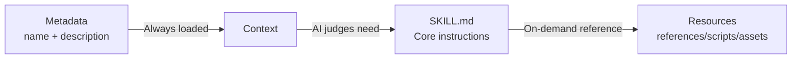

# Skill Structure Explained

## What You'll Learn

- Precisely understand all SKILL.md field requirements and format specifications
- Master the design principles and use cases for references/, scripts/, assets/
- Optimize skill token usage and loading performance
- Avoid common format errors and path resolution issues
- Use progressive loading to improve AI context efficiency

## Current Challenges

You've learned to create basic skills, but your understanding of the complete SKILL.md specification is limited. Your skills may encounter these problems:

- SKILL.md is too long, causing excessive token consumption
- Uncertain about what content belongs in references/ versus SKILL.md
- AI agents cannot correctly load resources from scripts/ or assets/
- YAML frontmatter format errors causing installation failures

## When to Use This

- **Skill review**: Check if existing skills meet Anthropic specifications
- **Performance optimization**: Resolve slow skill loading or token limit issues
- **Resource refactoring**: Split large skills into SKILL.md + bundled resources
- **Complex skill development**: Write complete skills with API docs and executable scripts

## 🎒 Prerequisites

::: warning Prerequisites Check

Before starting, ensure:

- ✅ Read [Create Custom Skills](../create-skills/)
- ✅ Installed at least one skill (understand the basic workflow)
- ✅ Familiar with YAML and Markdown basic syntax

:::

## Core Concepts

### SKILL.md Design Philosophy

**SKILL.md** is the core of the Anthropic skill system, designed with **progressive loading**:



**Three-layer loading advantages**:

1. **Metadata layer**: All skills' `name` and `description` are always in context, enabling AI to quickly understand available skills
2. **SKILL.md layer**: Loaded only when relevant, containing core instructions (< 5000 words)
3. **Resources layer**: Detailed documentation and executable files loaded on-demand, avoiding token waste

### Bundled Resources Classification

| Directory   | Loaded to Context | Use Cases                | Example Types               |
| ----------- | ----------------- | ------------------------ | --------------------------- |
| `references/` | ✅ On-demand      | Detailed docs, API specs | API docs, database schemas  |
| `scripts/`  | ❌ Not loaded     | Executable code         | Python/Bash scripts        |
| `assets/`   | ❌ Not loaded     | Templates, output files, images | JSON templates, boilerplate code |

## Follow Along

### Step 1: Understand Complete YAML Frontmatter Specification

**Why**: YAML frontmatter is skill metadata and must meet strict specifications

SKILL.md must start and end with `---`:

```yaml
---
name: my-skill
description: Use this skill when you need to demonstrate proper format.
---
```

**Required fields**:

| Field       | Type     | Format Requirements                    | Example                    |
| ----------- | -------- | -------------------------------------- | -------------------------- |
| `name`      | string   | kebab-case, no spaces                  | `pdf-editor`, `api-client` |
| `description` | string | 1-2 sentences, third person            | `Use this skill to edit PDF files` |

::: danger Common Errors

| Error Example | Problem | Fix Method |
| ------------- | ------- | ---------- |
| `name: My Skill` | Contains spaces | Change to `name: my-skill` |
| `name: my_skill` | Underscore format | Change to `name: my-skill` |
| `description: You should use this when...` | Second person | Change to `description: Use this skill when...` |
| `description:` Too long | Over 100 words | Simplify to 1-2 sentence overview |
| Missing ending `---` | YAML not properly closed | Add ending delimiter |

:::

**Source verification**: OpenSkills uses non-greedy regex to validate format

```typescript
// src/utils/yaml.ts
export function hasValidFrontmatter(content: string): boolean {
  return content.trim().startsWith('---');
}

export function extractYamlField(content: string, field: string): string {
  const match = content.match(new RegExp(`^${field}:\\s*(.+?)$`, 'm'));
  return match ? match[1].trim() : '';
}
```

---

### Step 2: Write SKILL.md Body (Imperative Form)

**Why**: AI agents expect imperative instructions, not conversational descriptions

**Correct approach**:

```markdown
## Instructions

To execute this task:

1. Read the input file
2. Process data using the algorithm
3. Generate output in specified format
```

**Incorrect approach** (avoid):

```markdown
## Instructions

You should execute this task by:

1. Reading the input file
2. Processing data using the algorithm
3. Generating output in specified format
```

**Comparison table**:

| ✅ Correct (Imperative/Infinitive) | ❌ Incorrect (Second Person) |
| ---------------------------------- | ---------------------------- |
| "Load this skill when X"          | "If you need Y"              |
| "To accomplish Z, execute A"      | "You should do Z"            |
| "See references/guide.md"        | "When you want to Z"         |

**Writing guidelines**:

1. **Start with verbs**: `Create` → `Use` → `Return`
2. **Omit "You"**: Don't say "You should"
3. **Clear paths**: Use `references/`, `scripts/`, `assets/` prefixes when referencing resources

---

### Step 3: Use references/ for Detailed Documentation

**Why**: Keep SKILL.md concise, load detailed documentation on-demand

**Applicable scenarios**:

- API documentation (endpoint descriptions over 500 words)
- Database schemas (table structures, field definitions)
- Detailed guides (configuration options, FAQ)
- Code examples (large code snippets)

**Directory structure**:

```
my-skill/
├── SKILL.md              (~2,000 words, core instructions)
└── references/
    ├── api-docs.md       (Detailed API documentation)
    ├── database-schema.md (Database structure)
    └── troubleshooting.md (Troubleshooting guide)
```

**Reference method in SKILL.md**:

```markdown
## Instructions

To interact with the API:

1. Read the request parameters
2. Call the API endpoint
3. For detailed response format, see `references/api-docs.md`
4. Parse the response
5. Handle errors (see `references/troubleshooting.md`)
```

**references/api-docs.md example**:

```markdown
# API Documentation

## Overview

This API provides endpoints for data processing.

## Endpoints

### POST /api/process

**Request:**
```json
{
  "input": "data to process",
  "options": {
    "format": "json"
  }
}
```

**Response:**
```json
{
  "status": "success",
  "result": {
    "output": "processed data"
  }
}
```

**Error Codes:**
- `400`: Invalid input format
- `500`: Server error
```

::: tip Best Practice

**references/ file size recommendations**:
- Single file: Recommend < 10,000 words
- Total size: Recommend < 50,000 words (split across multiple files)
- Naming: Use kebab-case (`api-docs.md` not `API_Docs.md`)

:::

---

### Step 4: Use scripts/ for Deterministic Tasks

**Why**: Executable scripts don't need to be loaded into context, suitable for repetitive tasks

**Applicable scenarios**:

- Data transformation (JSON → CSV, format conversion)
- File processing (compression, decompression, renaming)
- Code generation (generate code from templates)
- Test execution (unit tests, integration tests)

**Directory structure**:

```
my-skill/
├── SKILL.md
└── scripts/
    ├── process.py       (Python script)
    ├── transform.sh     (Bash script)
    └── validate.js     (Node.js script)
```

**Reference method in SKILL.md**:

```markdown
## Instructions

To process the input data:

1. Validate the input file format
2. Execute the processing script:
   ```bash
   python scripts/process.py --input data.json --output result.json
   ```
3. Verify the output file
4. If validation fails, see `scripts/validate.py` for error messages
```

**scripts/process.py example**:

```python
#!/usr/bin/env python3
import json
import sys

def main():
    input_file = sys.argv[1]
    output_file = sys.argv[2]

    with open(input_file, 'r') as f:
        data = json.load(f)

    # Processing logic
    result = transform_data(data)

    with open(output_file, 'w') as f:
        json.dump(result, f, indent=2)

    print(f"✅ Processed {input_file} → {output_file}")

if __name__ == "__main__":
    main()
```

::: info Advantages of scripts/

Compared to inlining code in SKILL.md:

| Feature      | Inline Code    | scripts/            |
| ------------ | -------------- | ------------------ |
| Token usage  | ✅ High        | ❌ Low             |
| Reusability  | ❌ Poor        | ✅ Good            |
| Testability  | ❌ Difficult   | ✅ Easy            |
| Complexity   | ❌ Token limit | ✅ No limit        |

:::

---

### Step 5: Use assets/ for Templates and Output Files

**Why**: Templates and output files don't need to be loaded into context, saving tokens

**Applicable scenarios**:

- Output templates (JSON, XML, Markdown templates)
- Boilerplate code ( project scaffolding, config files)
- Images and diagrams (flowcharts, architecture diagrams)
- Test data (sample inputs, expected outputs)

**Directory structure**:

```
my-skill/
├── SKILL.md
└── assets/
    ├── template.json    (JSON template)
    ├── boilerplate.js   (Boilerplate code)
    └── diagram.png     (Flowchart)
```

**Reference method in SKILL.md**:

```markdown
## Instructions

To generate the output file:

1. Load the template: `assets/template.json`
2. Replace placeholders with actual data
3. Write to output file
4. For boilerplate code, see `assets/boilerplate.js`
```

**assets/template.json example**:

```json
{
  "title": "{{ title }}",
  "description": "{{ description }}",
  "version": "{{ version }}",
  "author": "{{ author }}",
  "created_at": "{{ timestamp }}"
}
```

**Using templates in scripts**:

```python
import json
from string import Template

def generate_output(data, template_path):
    with open(template_path, 'r') as f:
        template_str = f.read()

    template = Template(template_str)
    output = template.safe_substitute(data)

    return output
```

::: warning assets/ Considerations

- **Not loaded to context**: AI agents cannot directly read content, must load via scripts
- **Path resolution**: Use relative paths, like `assets/template.json`
- **File size**: Recommend single file < 10MB (avoid transfer delays)

:::

---

### Step 6: Optimize File Size and Performance

**Why**: File size directly affects AI context token consumption and loading speed

**File size guidelines** (official recommendations):

| Directory   | Size Limit      | Loading Behavior      |
| ----------- | --------------- | --------------------- |
| SKILL.md    | < 5,000 words   | Always loaded (when needed) |
| references/ | No strict limit | Loaded on-demand     |
| scripts/    | Not counted     | Not loaded, only executed |
| assets/     | Not loaded      | Not loaded, only copied |

**Performance optimization tips**:

1. **Split references/**:
   ```bash
   # ❌ Single large file (20,000 words)
   references/all-docs.md

   # ✅ Split into multiple small files (each < 5,000 words)
   references/
   ├── api-docs.md
   ├── database-schema.md
   └── troubleshooting.md
   ```

2. **Use scripts/ for data processing**:
   ```markdown
   # ❌ Inline large code blocks in SKILL.md (consumes tokens)
   ## Instructions
   Execute this code:
   ```python
   # 500 lines of code...
   ```

   # ✅ Reference scripts/ (no token consumption)
   ## Instructions
   Execute: `python scripts/processor.py`
   ```

3. **Streamline SKILL.md**:
   - Keep only core instructions and steps
   - Move detailed explanations to `references/`
   - Use concise imperative language

**Verify file size**:

```bash
# Count SKILL.md words
wc -w my-skill/SKILL.md

# Count references/ total words
find my-skill/references -name "*.md" -exec wc -w {} + | tail -1

# Check scripts/ file size
du -sh my-skill/scripts/
```

---

### Step 7: Understand Resource Resolution Mechanism

**Why**: Understand path resolution rules to avoid reference errors

**Base directory concept**:

When AI agents load a skill, `openskills read` outputs the base directory:

```
Reading: my-skill
Base directory: /path/to/project/.claude/skills/my-skill
```

**Relative path resolution rules**:

| Reference Path          | Resolved Result                                          |
| ----------------------- | -------------------------------------------------------- |
| `references/api.md`     | `/base/directory/references/api.md`                     |
| `scripts/process.py`    | `/base/directory/scripts/process.py`                    |
| `assets/template.json`  | `/base/directory/assets/template.json`                  |

**Source verification**:

```typescript
// src/commands/read.ts
export function readSkill(skillNames: string[] | string): void {
  const skill = findSkill(name);
  const content = readFileSync(skill.path, 'utf-8');

  // Output base directory for AI to resolve relative paths
  console.log(`Base directory: ${skill.baseDir}`);
  console.log(content);
}
```

::: danger Path Error Examples

| ❌ Incorrect Method           | Problem                | ✅ Correct Method         |
| ---------------------------- | ---------------------- | ------------------------ |
| `/absolute/path/to/api.md`   | Uses absolute path     | `references/api.md`       |
| `../other-skill/references/api.md` | Cross-skill reference | `references/api.md`       |
| `~/references/api.md`        | Uses tilde expansion   | `references/api.md`       |

:::

---

### Step 8: Validate Skill Format

**Why**: Validate format before installation to avoid runtime errors

**Use openskills to validate**:

```bash
npx openskills install ./my-skill
```

**You should see**:

```
✔ Found skill: my-skill
  Description: Use this skill when you need to demonstrate proper format.
  Size: 2.1 KB

? Select skills to install: (Use arrow keys)
❯ ☑ my-skill
```

**Validation checklist**:

- [ ] SKILL.md starts with `---`
- [ ] Contains `name` field (kebab-case)
- [ ] Contains `description` field (1-2 sentences)
- [ ] YAML ends with `---`
- [ ] Body uses imperative/infinitive form
- [ ] All `references/`, `scripts/`, `assets/` references use relative paths
- [ ] SKILL.md word count < 5,000 words
- [ ] references/ file naming uses kebab-case

**Manual YAML frontmatter validation**:

```bash
# Check if starts with ---
head -1 my-skill/SKILL.md

# Verify YAML fields (using yq or other tools)
yq eval '.name' my-skill/SKILL.md
```

---

### Step 9: Test Skill Loading

**Why**: Ensure skills can be correctly loaded into AI context

**Use openskills read to test**:

```bash
npx openskills read my-skill
```

**You should see**:

```
Reading: my-skill
Base directory: /path/to/project/.claude/skills/my-skill

---
name: my-skill
description: Use this skill when you need to demonstrate proper format.
---

# My Skill

## Instructions

To execute this task...

## Bundled Resources

For detailed information: see `references/skill-format.md`

Skill read: my-skill
```

**Checkpoints**:

- ✅ Output includes `Base directory` (for path resolution)
- ✅ SKILL.md content is complete (including YAML and body)
- ✅ No "Invalid SKILL.md" error
- ✅ All reference paths display correctly

## Checkpoint ✅

After completing the above steps, you should:

- ✅ Understand the complete SKILL.md field specifications
- ✅ Master the use cases for references/, scripts/, assets/
- ✅ Be able to optimize skill file size and loading performance
- ✅ Know how to validate skill format and test loading
- ✅ Understand resource resolution mechanism and base directory

## Common Pitfalls

### Issue 1: SKILL.md Exceeds 5000 Words Causing Token Limit

**Cause**: SKILL.md contains too much detailed documentation

**Solution**:
1. Move detailed content to `references/` directory
2. Reference in SKILL.md: `See references/guide.md for details`
3. Use `wc -w SKILL.md` to check word count

---

### Issue 2: scripts/ Scripts Cannot Execute

**Cause**:
- Scripts lack execute permissions
- Using absolute paths instead of relative paths

**Solution**:
```bash
# Add execute permissions
chmod +x my-skill/scripts/*.sh

# Use relative paths in SKILL.md
## Instructions
Execute: `python scripts/process.py`  # ✅ Correct
Execute: `/path/to/my-skill/scripts/process.py`  # ❌ Incorrect
```

---

### Issue 3: references/ Files Loaded On-Demand But AI Cannot Read

**Cause**: AI agents did not correctly parse `references/` paths

**Solution**:
1. Confirm `openskills read` outputs `Base directory`
2. Clearly state when referencing: `See references/api-docs.md in base directory`
3. Avoid using absolute paths or cross-skill references

---

### Issue 4: assets/ Files Too Large Causing Transfer Delays

**Cause**: assets/ stores large binary files (> 10MB)

**Solution**:
- Compress images: Use PNG instead of BMP, optimize JPEG quality
- Split data: Split large datasets into multiple small files
- Use external storage: For extra-large files, provide download links instead of including directly

---

### Issue 5: YAML Frontmatter Format Errors

**Cause**:
- Missing ending `---`
- Field values contain special characters (colons, hashes) without quotes

**Solution**:
```yaml
# ❌ Incorrect: Missing ending ---
---
name: my-skill
description: Use this skill: for testing
# Missing ---

# ✅ Correct: Complete closure
---
name: my-skill
description: "Use this skill: for testing"
---
```

---

### Issue 6: Instructions Use Second Person

**Cause**: Habitual use of "You should", "When you want"

**Solution**:
- Use imperative language starting with verbs
- Use "To do X, execute Y" instead of "You should do Y"
- Use "Load this skill when Z" instead of "If you need Z"

**Comparison table**:

| Second Person (❌ Avoid)   | Imperative (✅ Recommend)      |
| ------------------------- | ------------------------------ |
| "You should execute..."   | "To execute X, run..."        |
| "When you want to..."     | "Load this skill when..."      |
| "If you need..."          | "Use X to accomplish Y"       |

## Summary

Key points of skill structure:

1. **YAML frontmatter**: Required fields `name` (kebab-case) and `description` (1-2 sentences)
2. **Body format**: Use imperative/infinitive form, avoid second person
3. **references/**: Store detailed documentation, loaded on-demand to context (< 10,000 words/file)
4. **scripts/**: Store executable scripts, not loaded to context, suitable for deterministic tasks
5. **assets/**: Store templates and output files, not loaded to context
6. **File size**: SKILL.md < 5,000 words, references/ can be split, scripts/ no limit
7. **Path resolution**: Use relative paths (`references/`, `scripts/`, `assets/`), resolved based on base directory
8. **Validation methods**: Use `openskills install` to validate format, `openskills read` to test loading

## Next Lesson Preview

> In the next lesson, we'll learn **[CI/CD Integration](../ci-integration/)**.
>
> You'll learn:
> - How to use the `-y/--yes` flag in CI/CD environments
> - Automate skill installation and sync workflows
> - Integrate OpenSkills in GitHub Actions, GitLab CI

---

## Appendix: Source Reference

<details>
<summary><strong>Click to expand source code locations</strong></summary>

> Last updated: 2026-01-24

| Feature                   | File Path                                                                  | Line   |
| ------------------------- | -------------------------------------------------------------------------- | ------ |
| YAML frontmatter validation | [`src/utils/yaml.ts`](https://github.com/numman-ali/openskills/blob/main/src/utils/yaml.ts) | 12-14  |
| YAML field extraction      | [`src/utils/yaml.ts`](https://github.com/numman-ali/openskills/blob/main/src/utils/yaml.ts) | 4-7    |
| Skill read command         | [`src/commands/read.ts`](https://github.com/numman-ali/openskills/blob/main/src/commands/read.ts) | 1-49   |
| Base directory output      | [`src/commands/read.ts`](https://github.com/numman-ali/openskills/blob/main/src/commands/read.ts) | 42     |
| Format validation on install | [`src/commands/install.ts`](https://github.com/numman-ali/openskills/blob/main/src/commands/install.ts) | 242, 291, 340 |

**Example skill files**:
- [`examples/my-first-skill/SKILL.md`](https://github.com/numman-ali/openskills/blob/main/examples/my-first-skill/SKILL.md) - Complete structure example
- [`examples/my-first-skill/references/skill-format.md`](https://github.com/numman-ali/openskills/blob/main/examples/my-first-skill/references/skill-format.md) - Format specification reference

**Key functions**:
- `hasValidFrontmatter(content: string): boolean` - Validate if SKILL.md starts with `---`
- `extractYamlField(content: string, field: string): string` - Extract YAML field value (non-greedy matching)
- `readSkill(skillNames: string[] | string): void` - Read skill to standard output (for AI use)

</details>
