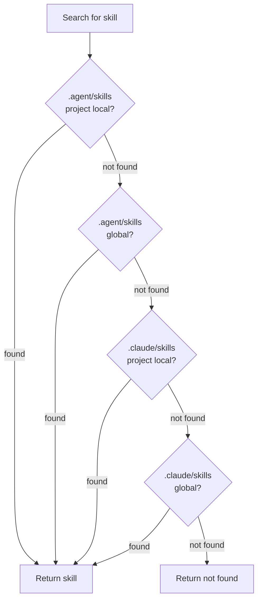

# Universal Mode: Multi-Agent Environments

## What You'll Learn

After completing this lesson, you will be able to:

- Understand the core value and design purpose of Universal mode
- Master the usage of the `--universal` flag
- Understand the difference between `.agent/skills` and `.claude/skills`
- Understand the 4-level search priority rules
- Unify skill management in multi-agent environments and avoid conflicts
- Share the same set of skills across multiple agents like Claude Code, Cursor, Windsurf, Aider, etc.

::: info Prerequisites

This tutorial assumes you already understand [global vs project installation](../../platforms/global-vs-project/) and [syncing skills to AGENTS.md](../../start/sync-to-agents/), including basic installation locations and sync workflows.

:::

---

## Your Current Challenges

You may have learned how to install and sync skills, but:

- **How do multiple agents share skills?**: Using both Claude Code and Cursor simultaneously, but each installs skills separately, causing management chaos
- **Claude Code Marketplace conflicts**: After installing skills, conflicts arise with Claude Code's native plugin marketplace
- **Inconsistent AGENTS.md locations**: Different agents expect AGENTS.md in different paths, making maintenance difficult
- **Duplicate skill installations**: Each agent needs to install a separate set of skills, wasting disk space

Actually, OpenSkills provides Universal mode, specifically designed to solve skill management issues in multi-agent environments.

---

## When to Use This Approach

**Universal mode is suitable for these scenarios**:

| Scenario | Need Universal Mode? | Example |
|--- | --- | ---|
| **Single agent** (Claude Code only) | ❌ No | Only using Claude Code, use default `.claude/skills` directly |
| **Multiple agents** (Claude Code + others) | ✅ Yes | Using Claude Code and Cursor/Windsurf/Aider simultaneously |
| **Avoid Marketplace conflicts** | ✅ Yes | Want to avoid conflicts with Claude Code's native plugin marketplace |
| **Unified AGENTS.md management** | ✅ Yes | Multiple agents share the same AGENTS.md file |

::: tip Recommended Practice

- **Single agent: use default mode**: When only using Claude Code, install to default `.claude/skills`
- **Multiple agents: use Universal mode**: When using multiple agents simultaneously, install to `.agent/skills` with `--universal`
- **Team collaboration: unified standards**: Agree on which mode to use as a team to avoid confusion

:::

---

## Core Concept: Unified Directory, Multi-Agent Sharing

OpenSkills provides two skill directory modes:

**Default mode (`.claude/skills`)**:
- Designed specifically for Claude Code
- Compatible with Claude Code Marketplace
- Installation location: `./.claude/skills/` or `~/.claude/skills/`

**Universal mode (`.agent/skills`)**:
- Designed specifically for multi-agent environments
- Avoids conflicts with Claude Code Marketplace
- Installation location: `./.agent/skills/` or `~/.agent/skills/`

::: info Important Concept

**Universal mode**: Use the `--universal` flag to install skills to the `.agent/skills/` directory, allowing multiple AI coding agents (Claude Code, Cursor, Windsurf, Aider, etc.) to share the same set of skills, managed uniformly through AGENTS.md.

:::

**4-level search priority** (source code `dirs.ts:18-24`):

```typescript
export function getSearchDirs(): string[] {
  return [
    join(process.cwd(), '.agent/skills'),   // 1. Project universal (highest priority)
    join(homedir(), '.agent/skills'),        // 2. Global universal
    join(process.cwd(), '.claude/skills'),  // 3. Project claude
    join(homedir(), '.claude/skills'),       // 4. Global claude
  ];
}
```

**Priority explanation**:
1. **Project Universal** (highest): `.agent/skills/` takes priority over `.claude/skills/`
2. **Global Universal**: Next searches global `.agent/skills/`
3. **Project Claude**: Then searches project-local `.claude/skills/`
4. **Global Claude** (lowest): Finally searches global `.claude/skills/`

---

## Follow Along

### Step 1: Install Skills Using Universal Mode

**Why**
First learn how to use the `--universal` flag to install skills.

Open a terminal and run in any project:

```bash
# Install skills using Universal mode
npx openskills install anthropics/skills --universal -y

# View skill list
npx openskills list
```

**What You Should See**: Each skill in the skill list has a `(project)` tag

```
  codebase-reviewer         (project)
    Review code changes for issues...

Summary: 3 project, 0 global (3 total)
```

**Explanation**:
- After using the `--universal` flag, skills are installed in the `./.agent/skills/` directory
- The `list` command still shows `(project)` or `(global)` tags
- `.agent/skills/` does not conflict with the default `.claude/skills/`

---

### Step 2: View Skill Installation Location

**Why**
Confirm the actual storage location of skill files and understand the directory structure of Universal mode.

Run in the project root directory:

```bash
# View Universal mode skill directory
ls -la .agent/skills/

# View skill directory contents
ls -la .agent/skills/codebase-reviewer/
```

**What You Should See**:

```
.agent/skills/
├── codebase-reviewer/
│   ├── SKILL.md
│   └── .openskills.json    # Installation metadata
├── file-writer/
│   ├── SKILL.md
│   └── .openskills.json
└── ...
```

**Explanation**:
- Universal mode skills are installed in the `.agent/skills/` directory
- Each skill has its own directory and metadata
- This structure is exactly the same as the default `.claude/skills/`

---

### Step 3: Compare Directory Structures of Both Modes

**Why**
Through actual comparison, understand the difference between `.claude/skills` and `.agent/skills`.

Run the following commands:

```bash
# View skill directories for both modes
echo "=== .claude/skills (default mode) ==="
ls -la .claude/skills/ 2>/dev/null || echo "Directory does not exist"

echo "=== .agent/skills (Universal mode) ==="
ls -la .agent/skills/

# View globally installed directories
echo "=== ~/.claude/skills (global default) ==="
ls -la ~/.claude/skills/ 2>/dev/null || echo "Directory does not exist"

echo "=== ~/.agent/skills (global Universal) ==="
ls -la ~/.agent/skills/ 2>/dev/null || echo "Directory does not exist"
```

**What You Should See**:

```
=== .claude/skills (default mode) ===
Directory does not exist

=== .agent/skills (Universal mode) ===
codebase-reviewer
file-writer

=== ~/.claude/skills (global default) ===
git-helper
test-generator

=== ~/.agent/skills (global Universal) ===
Directory does not exist
```

**Explanation**:
- `.claude/skills/` and `.agent/skills/` are two independent directories
- They can coexist without interfering with each other
- Both project-local and global installation methods are supported

---

### Step 4: Global Universal Installation

**Why**
Learn how to globally install Universal skills to serve all projects.

Run:

```bash
# Global Universal installation of skills
npx openskills install anthropics/skills --universal --global -y

# View skill list
npx openskills list
```

**What You Should See**:

```
  codebase-reviewer         (project)
    Review code changes for issues...
  file-writer              (global)
    Write files with format...

Summary: 1 project, 2 global (3 total)
```

**Explanation**:
- `--universal` and `--global` can be combined
- Installs to the `~/.agent/skills/` directory
- All projects can use these skills

---

### Step 5: Verify 4-Level Search Priority

**Why**
Understand how OpenSkills searches for skills across 4 directories.

Run:

```bash
# Install skills with the same name in 4 locations (different versions)
# 1. Project Universal
npx openskills install anthropics/skills --universal -y
# 2. Global Universal
npx openskills install anthropics/skills --universal --global -y
# 3. Project Claude
npx openskills install anthropics/skills -y
# 4. Global Claude
npx openskills install anthropics/skills --global -y

# Read skill (will prioritize using Project Universal version)
npx openskills read codebase-reviewer | head -5
```

**What You Should See**: The output shows the skill content from `.agent/skills/` (Project Universal) version.

**Search priority visualization**:



**Explanation**:
- `.agent/skills/` has higher priority than `.claude/skills/`
- Project-local has higher priority than global
- When skills with the same name exist simultaneously, the Project Universal version is used first
- This enables flexible "Universal first" configuration

---

### Step 6: Avoid Claude Code Marketplace Conflicts

**Why**
Understand how Universal mode resolves conflicts with Claude Code Marketplace.

Run:

```bash
# Install skills using Universal mode
npx openskills install anthropics/skills --universal -y

# Sync to AGENTS.md
npx openskills sync

# View AGENTS.md
cat AGENTS.md
```

**What You Should See**: AGENTS.md contains a skill list and does not conflict with Claude Code Marketplace.

**Explanation**:
- Universal mode uses `.agent/skills/`, separated from Claude Code's `.claude/skills/`
- Avoids conflicts between OpenSkills-installed skills and Claude Code Marketplace plugins
- Multiple agents can share the same AGENTS.md for unified management

---

## Checklist ✅

Complete the following checks to confirm you've mastered this lesson:

- [ ] Able to distinguish between `.claude/skills` and `.agent/skills` modes
- [ ] Know the purpose of the `--universal` flag
- [ ] Understand the 4-level search priority rules
- [ ] Able to choose the appropriate installation mode based on the scenario
- [ ] Know how to unify skill management in multi-agent environments
- [ ] Understand how Universal mode avoids Marketplace conflicts

---

## Common Pitfalls

### Common Error 1: Single Agent Misusing Universal Mode

**Error scenario**: Only using Claude Code, but using Universal mode

```bash
# ❌ Wrong: Single agent doesn't need Universal mode
npx openskills install anthropics/skills --universal
```

**Problem**:
- Adds unnecessary complexity
- Cannot work with Claude Code Marketplace plugins
- AGENTS.md location may not meet Claude Code's expectations

**Correct approach**:

```bash
# ✅ Correct: Single agent uses default mode
npx openskills install anthropics/skills
```

---

### Common Error 2: Multiple Agents Not Using Universal Mode

**Error scenario**: Using multiple agents simultaneously, but not using Universal mode

```bash
# ❌ Wrong: Each agent installs skills separately, management chaos
npx openskills install anthropics/skills  # For Claude Code
npx openskills install anthropics/skills --global  # For Cursor
```

**Problem**:
- Duplicate skill installations, wasting disk space
- Skill versions may be inconsistent across different agents
- AGENTS.md needs to be maintained separately

**Correct approach**:

```bash
# ✅ Correct: Multiple agents use Universal mode for unified management
npx openskills install anthropics/skills --universal
# All agents share the same set of skills and AGENTS.md
```

---

### Common Error 3: Forgetting Universal Mode Search Priority

**Error scenario**: Installed skills with the same name in both `.claude/skills` and `.agent/skills`, but expect to use the `.claude/skills` version

```bash
# Both .agent/skills and .claude/skills have codebase-reviewer
# But want to use the .claude/skills version
npx openskills install anthropics/skills --universal  # Install new version to .agent/skills
npx openskills install anthropics/skills  # Install old version to .claude/skills
npx openskills read codebase-reviewer  # ❌ Still reads .agent/skills version
```

**Problem**:
- `.agent/skills` has higher priority than `.claude/skills`
- Even if `.claude/skills` has a newer version installed, still reads the `.agent/skills` version

**Correct approach**:

```bash
# Option 1: Delete .agent/skills version
npx openskills remove codebase-reviewer  # Delete .agent/skills version
npx openskills read codebase-reviewer  # ✅ Now reads .claude/skills version

# Option 2: Update .agent/skills version
npx openskills update codebase-reviewer  # Update .agent/skills version
```

---

### Common Error 4: AGENTS.md Path Configuration Error

**Error scenario**: Multiple agents expect AGENTS.md in different paths

```bash
# Claude Code expects AGENTS.md in root directory
# Cursor expects AGENTS.md in .cursor/ directory
# Windsurf expects AGENTS.md in .windsurf/ directory
npx openskills sync  # Only generates one AGENTS.md
```

**Problem**:
- Different agents cannot find AGENTS.md
- Skill loading fails

**Correct approach**:

```bash
# Generate AGENTS.md in different locations for different agents
npx openskills sync -o AGENTS.md           # Claude Code
npx openskills sync -o .cursor/AGENTS.md    # Cursor
npx openskills sync -o .windsurf/AGENTS.md  # Windsurf
```

---

## Lesson Summary

**Key points**:

1. **Universal mode is for multi-agent environments**: Use `--universal` to install to `.agent/skills/`
2. **4-level search priority**: Project Universal > Global Universal > Project Claude > Global Claude
3. **Avoid Marketplace conflicts**: `.agent/skills/` is separated from Claude Code's `.claude/skills/`
4. **Unified AGENTS.md management**: Multiple agents share the same AGENTS.md file
5. **Recommended principle**: Single agent uses default mode, multiple agents use Universal mode

**Decision flow**:

```
[Need to install skills] → [Using multiple agents?]
                      ↓ Yes
              [Use Universal mode (--universal)]
                      ↓ No
              [Only using Claude Code?]
                      ↓ Yes
              [Use default mode (.claude/skills)]
                      ↓ No
              [Check specific agent documentation, choose appropriate mode]
```

**Memory tips**:

- **Single agent**: Default mode is simplest, Claude Code uses `.claude`
- **Multiple agents**: Universal mode for unified management, `.agent/skills` avoids conflicts

---

## Up Next

> In the next lesson, we'll learn **[Custom Output Path](../custom-output-path/)**.
>
> You will learn:
> - How to use the `--output/-o` flag to customize AGENTS.md output path
> - How to generate AGENTS.md in different locations for different agents
> - How to use custom output paths in CI/CD environments
> - How to integrate into existing documentation systems

---

## Appendix: Source Code Reference

<details>
<summary><strong>Click to expand source code locations</strong></summary>

> Updated: 2026-01-24

| Function | File Path | Line Numbers |
|--- | --- | ---|
| Directory path utilities | [`src/utils/dirs.ts`](https://github.com/numman-ali/openskills/blob/main/src/utils/dirs.ts#L7-L25) | 7-25 |
| Installation location judgment | [`src/commands/install.ts`](https://github.com/numman-ali/openskills/blob/main/src/commands/install.ts#L84-L92) | 84-92 |
| Command line argument definition | [`src/cli.ts`](https://github.com/numman-ali/openskills/blob/main/src/cli.ts#L48) | 48 |

**Key constants**:
- `.claude/skills`: Default skill directory (Claude Code compatible)
- `.agent/skills`: Universal skill directory (multi-agent environments)

**Key functions**:
- `getSkillsDir(projectLocal, universal)`: Returns skill directory path based on flags
- `getSearchDirs()`: Returns list of skill search directories (4-level priority)

**Business rules**:
- Universal mode uses `.agent/skills/` directory
- 4-level search priority: Project Universal > Global Universal > Project Claude > Global Claude
- `--universal` and `--global` can be combined

</details>
