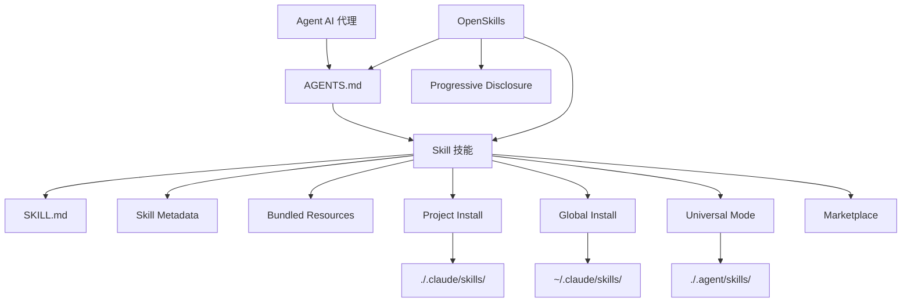

# Glossary

This glossary explains key concepts in OpenSkills and AI skill systems to help you quickly understand technical terminology.

::: info Note
This glossary is organized alphabetically. Relationships between terms are noted in their definitions.
:::

---

## A

### Agent (AI 代理)

**Definition**: AI agents are AI tools capable of executing coding tasks, such as Claude Code, Cursor, Windsurf, Aider, etc.

**Features**:
- Can read `AGENTS.md` configuration files
- Supports loading skills in SKILL.md format
- Can invoke external tools via command line (e.g., `npx openskills read`)

**Role in OpenSkills**: OpenSkills enables any agent that supports reading AGENTS.md to use Anthropic's skill format.

**Related Terms**: [Skill](#skill), [AGENTS.md](#agentsmd)

---

## B

### Base Directory (基础目录)

**Definition**: The complete path to the skill directory, used to resolve relative path references within the skill.

**Purpose**:
- Provides the absolute path to the skill directory
- Used to resolve relative paths for bundled resources such as `references/`, `scripts/`, `assets/`

**Example**:
```
Base directory: /path/to/my-first-skill
```

When a skill references `references/skill-format.md`, it is resolved to:
```
/path/to/my-first-skill/references/skill-format.md
```

**Related Terms**: [Skill](#skill), [Bundled Resources](#bundled-resources)

---

### Bundled Resources (捆绑资源)

**Definition**: Resource files included in the skill directory that provide detailed information or tools required for skill execution.

**Types**:
- **`references/`** - Reference documentation, API docs, etc.
- **`scripts/`** - Executable script files
- **`assets/`** - Templates, example files, etc.

**Use Cases**:
- Move detailed documentation to `references/` to keep SKILL.md concise
- Place executable code in `scripts/` for easy invocation
- Store templates and examples in `assets/` for user reference

**Example**:
```
my-skill/
├── SKILL.md
├── references/
│   └── api-docs.md
├── scripts/
│   └── helper.py
└── assets/
    └── template.json
```

**Related Terms**: [Skill](#skill), [SKILL.md](#skillmd)

---

## G

### Global Install (全局安装)

**Definition**: Installing a skill to the `.claude/skills` directory in the user's home directory, making it accessible to all projects.

**Command Example**:
```bash
npx openskills install anthropics/skills --global
```

**Target Path**:
- macOS/Linux: `~/.claude/skills/`
- Windows: `%USERPROFILE%\.claude\skills\`

**Use Cases**:
- Want to use the same skill across multiple projects
- Don't want skills versioned with the project repository

**Priority**: When searching for skills, globally installed skills have lower priority than project-local installations (see [Skill Search Priority](#skill-search-priority)).

**Related Terms**: [Project Install](#project-install), [Skill Search Priority](#skill-search-priority)

---

## M

### Marketplace (市场)

**Definition**: GitHub repositories that store skills, used for publishing and discovering skills.

**Anthropic Marketplace**:
- Official skills repository: `anthropics/skills`
- Provides officially maintained skills (e.g., pdf, git-workflow, skill-creator, etc.)

**Third-Party Marketplaces**:
- Any GitHub repository can serve as a skills source
- Supports private repositories

**Installing from Marketplace**:
```bash
# Install from Anthropic official marketplace
npx openskills install anthropics/skills

# Install from third-party repository
npx openskills install your-org/your-skills

# Install from private repository
npx openskills install git@github.com:your-org/private-skills.git
```

**Related Terms**: [Skill](#skill), [Global Install](#global-install)

---

## O

### OpenSkills

**Definition**: OpenSkills is a universal loader for Anthropic's skill system, enabling any AI coding agent to use standard SKILL.md format skills.

**Core Value**:
- **Unified Standard** - All agents use the same skill format and AGENTS.md descriptions
- **Progressive Disclosure** - Load skills on demand, keeping context concise
- **Multi-Agent Support** - One set of skills serves multiple agents
- **Open Source Friendly** - Supports local paths and private git repositories
- **Strong Compatibility** - Fully compatible with Claude Code format

**Main Commands**:
- `install` - Install skills
- `list` - List installed skills
- `read` - Read skill content (for AI agents)
- `sync` - Sync skills to AGENTS.md
- `update` - Update installed skills
- `manage` / `remove` - Remove skills

**Official Repository**: https://github.com/numman-ali/openskills

**Related Terms**: [Skill](#skill), [SKILL.md](#skillmd), [AGENTS.md](#agentsmd)

---

## P

### Progressive Disclosure (渐进式加载)

**Definition**: Loading skills only when actually needed, avoiding context bloat from loading all skills at once.

**How It Works**:
1. Skill information is stored as brief descriptions in AGENTS.md
2. When a user requests a task, the AI agent checks if a matching skill exists
3. If yes, load the complete skill content via `npx openskills read <skill-name>`
4. Skill content is only valid for the current task context

**Advantages**:
- Keeps AI agent context concise
- Reduces token usage
- Improves response speed

**Example**:
```xml
<!-- AGENTS.md only contains brief descriptions -->
<available_skills>
  <skill>
    <name>pdf</name>
    <description>Comprehensive PDF manipulation toolkit...</description>
  </skill>
</available_skills>

<!-- Complete content loaded only when user requests PDF processing -->
npx openskills read pdf
```

**Related Terms**: [AGENTS.md](#agentsmd), [Skill](#skill)

---

### Project Install (项目本地安装)

**Definition**: Installing a skill to the `.claude/skills` or `.agent/skills` directory in the project directory, versioning the skill with the project repository.

**Command Example**:
```bash
# Project-local install (default)
npx openskills install anthropics/skills

# Project-local install to .agent/skills (universal mode)
npx openskills install anthropics/skills --universal
```

**Target Path**:
- Default: `./.claude/skills/`
- Universal mode: `./.agent/skills/`

**Use Cases**:
- Project requires specific skills
- Want skills versioned with the project repository
- Unify skill versions for team collaboration

**Priority**: When searching for skills, project-local installations have higher priority than global installations (see [Skill Search Priority](#skill-search-priority)).

**Related Terms**: [Global Install](#global-install), [Universal Mode](#universal-mode), [Skill Search Priority](#skill-search-priority)

---

## S

### Skill (技能)

**Definition**: Documents that provide specific task execution guidance for AI agents, containing detailed instructions, steps, and bundled resources.

**Core Features**:
- **Static Instructions** - Contains only text and resources, no dynamic logic
- **Composable** - Multiple skills can be combined
- **Versionable** - Managed with project repository

**Skill Structure**:
```
skill-name/
├── SKILL.md              # Main skill file
├── .openskills.json      # Installation metadata (auto-generated)
├── references/           # Reference documentation (optional)
├── scripts/             # Executable scripts (optional)
└── assets/              # Templates and examples (optional)
```

**Usage Scenario**:
- When a user requests a task, the AI agent checks if a matching skill exists
- If yes, load the skill via `npx openskills read <name>`
- AI agent completes the task following skill instructions

**Example Skills**:
- `pdf` - PDF processing tool
- `git-workflow` - Git workflow
- `check-branch-first` - Branch checking

**Related Terms**: [SKILL.md](#skillmd), [Bundled Resources](#bundled-resources), [Agent](#agent)

---

### Skill Metadata (技能元数据)

**Definition**: A JSON file (`.openskills.json`) that records skill installation source information, used to support skill updates.

**File Location**: `.openskills.json` in the skill directory

**Field Description**:
```json
{
  "source": "anthropics/skills",
  "sourceType": "github",
  "repoUrl": "https://github.com/anthropics/skills",
  "subpath": "skills/pdf",
  "installedAt": "2025-01-24T10:30:00.000Z"
}
```

**Purpose**:
- Record skill source (GitHub, local path, etc.)
- Support `openskills update` command to refresh skills from source
- Identify skills that need updates but have no recorded source

**Related Terms**: [Skill](#skill), [Global Install](#global-install), [Project Install](#project-install)

---

### Skill Search Priority (Skill 查找优先级)

**Definition**: When searching for skills, OpenSkills follows a fixed priority order across multiple directories.

**Priority Order** (highest to lowest):

| Priority | Directory                 | Installation Method           | Use Case                                  |
| -------- | ------------------------- | ----------------------------- | ----------------------------------------- |
| 1        | `./.agent/skills/`        | `--universal`                 | Multi-agent environment, avoid conflicts with Claude Code |
| 2        | `~/.agent/skills/`        | `--universal --global`        | Multi-agent environment global skills     |
| 3        | `./.claude/skills/`       | Default (project-local)       | Project-local skills (default choice)    |
| 4        | `~/.claude/skills/`       | `--global`                    | Global skills                            |

**Search Rules**:
- Search in priority order
- Stop at the first matching skill
- Project-local skills override global skills with the same name

**Example**:
```bash
# Search for skill named "pdf"
# 1. First check ./.agent/skills/pdf
# 2. Then check ~/.agent/skills/pdf
# 3. Then check ./.claude/skills/pdf
# 4. Finally check ~/.claude/skills/pdf
```

**Related Terms**: [Project Install](#project-install), [Global Install](#global-install), [Universal Mode](#universal-mode)

---

### SKILL.md

**Definition**: The standard format file for skills, using YAML frontmatter and Markdown content to define skill metadata and instructions.

**File Format**:
```markdown
---
name: my-skill
description: When to use this skill
---

# Skill Instructions

Detailed instructions for the AI agent...

## Bundled Resources

See `references/skill-format.md` for details.
```

**Required Fields**:
- `name` - Skill name (unique identifier)
- `description` - Skill description (displayed in AGENTS.md)

**Optional Fields**:
- `context` - Context hints (guide AI agents on how to use the skill)

**Best Practices**:
- Use imperative/infinitive verbs: `"To do X, execute Y"`
- Avoid second person: Don't write `"You should..."`
- Keep under 5,000 characters
- Move detailed content to `references/` directory

**Related Terms**: [Skill](#skill), [AGENTS.md](#agentsmd), [Bundled Resources](#bundled-resources)

---

## U

### Universal Mode (通用模式)

**Definition**: Installation mode for multi-agent environments, installing skills to the `.agent/skills/` directory to avoid conflicts with Claude Code's Marketplace.

**Command Example**:
```bash
npx openskills install anthropics/skills --universal
```

**Target Path**: `./.agent/skills/` or `~/.agent/skills/` (with `--global`)

**Use Cases**:
- Using Claude Code and other AI agents simultaneously (e.g., Cursor, Windsurf)
- Want all agents to share the same set of skills
- Avoid skill installation conflicts

**Search Priority**: Skills installed in Universal mode have the highest priority (see [Skill Search Priority](#skill-search-priority)).

**Related Terms**: [Project Install](#project-install), [Skill Search Priority](#skill-search-priority)

---

## A

### AGENTS.md

**Definition**: Configuration file read by AI agents, containing a list of available skills and usage instructions, in XML format.

**File Location**: Project root directory or user-defined path (default is project root)

**File Format**:
```xml
<skills_system priority="1">

## Available Skills

<!-- SKILLS_TABLE_START -->
<usage>
When users ask you to perform tasks, check if any of the available skills below can help complete the task more effectively.

How to use skills:
- Invoke: `npx openskills read <skill-name>` (run in your shell)
- The skill content will load with detailed instructions
- Base directory provided in output for resolving bundled resources
</usage>

<available_skills>

<skill>
<name>pdf</name>
<description>Comprehensive PDF manipulation toolkit...</description>
<location>project</location>
</skill>

</available_skills>
<!-- SKILLS_TABLE_END -->

</skills_system>
```

**Purpose**:
- Declare list of available skills
- Provide skill usage instructions
- Support preserving custom content during skill updates

**Generation Method**:
```bash
npx openskills sync
```

**Update Method**:
```bash
# Regenerate AGENTS.md (overwrites existing content)
npx openskills sync -y

# Output to custom file
npx openskills sync -o custom-agents.md
```

**Related Terms**: [OpenSkills](#openskills), [Skill](#skill), [Progressive Disclosure](#progressive-disclosure)

---

## Terminology Relationship Diagram

Here are the relationships between core terms:



---

## Next Lesson Preview

> This concludes the glossary. You now understand OpenSkills's core concepts.
>
> Next, you can:
> - Return to [Quick Start](../../start/quick-start/) to practice installation and usage
> - Check [CLI API Reference](../cli-api/) for complete commands
> - Read [Troubleshooting](../../faq/troubleshooting/) to solve common issues

---

## Appendix: Source Code Reference

<details>
<summary><strong>Click to expand source code locations</strong></summary>

> Last Updated: 2026-01-24

| Term/Function            | File Path                                                                 | Line #  |
| ------------------------ | ------------------------------------------------------------------------- | ------- |
| Skill Type Definition    | [`src/types.ts`](https://github.com/numman-ali/openskills/blob/main/src/types.ts#L1-L6) | 1-6     |
| SkillLocation Type       | [`src/types.ts`](https://github.com/numman-ali/openskills/blob/main/src/types.ts#L8-L12) | 8-12    |
| InstallOptions Type      | [`src/types.ts`](https://github.com/numman-ali/openskills/blob/main/src/types.ts#L14-L18) | 14-18   |
| SkillMetadata Type       | [`src/types.ts`](https://github.com/numman-ali/openskills/blob/main/src/types.ts#L20-L24) | 20-24   |
| Skill Search Logic       | [`src/utils/skills.ts`](https://github.com/numman-ali/openskills/blob/main/src/utils/skills.ts) | Entire  |
| Directory Path Calc      | [`src/utils/dirs.ts`](https://github.com/numman-ali/openskills/blob/main/src/utils/dirs.ts) | Entire  |
| AGENTS.md Generation     | [`src/utils/agents-md.ts`](https://github.com/numman-ali/openskills/blob/main/src/utils/agents-md.ts) | Entire  |
| Skill Metadata R/W       | [`src/utils/skill-metadata.ts`](https://github.com/numman-ali/openskills/blob/main/src/utils/skill-metadata.ts) | Entire  |

**Key Constants**:
- None (logic based on parameters and directory calculation)

**Key Functions**:
- `findAllSkills()` - Find all installed skills
- `findSkill(name)` - Find specified skill (by priority)
- `getSkillsDir(options)` - Calculate skill installation directory
- `generateSkillsXml(skills)` - Generate AGENTS.md XML content

</details>
