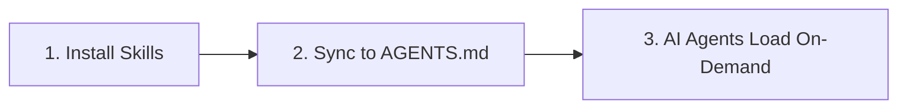

# OpenSkills Quick Start: Get Started with AI Skills in 5 Minutes

## What You'll Learn

After completing this lesson, you will be able to:

- Complete OpenSkills installation and deploy your first skill within 5 minutes
- Use `openskills install` and `openskills sync` commands to manage skills
- Enable AI agents (Claude Code, Cursor, Windsurf, etc.) to recognize and use installed skills
- Understand the core value of OpenSkills: unified skill format, progressive loading, multi-agent support

## Your Current Challenges

You may have encountered these problems:

- **Skills cannot be used across agents**: Claude Code skills cannot be reused in Cursor or Windsurf
- **Context explosion**: Loading too many skills causes AI agents to consume tokens too quickly
- **Inconsistent skill formats**: Different agents use different skill definition methods, leading to high learning costs
- **Private skills cannot be shared**: Internal company skills cannot be easily distributed to team members

OpenSkills solves these problems.

## When to Use This Approach

When you need to:

- Install specialized skills for AI coding agents (such as PDF processing, Git workflows, code review, etc.)
- Unify skill management across multiple AI agents
- Use private or custom skill repositories
- Let AI load skills on-demand to keep context concise

## 🎒 Before You Start

::: warning Prerequisites

Before starting, please confirm:

1. **Node.js 20.6 or higher**
   ```bash
   node --version
   ```
   Output should show `v20.6.0` or higher

2. **Git is installed** (used to clone skills from GitHub repositories)
   ```bash
   git --version
   ```

:::

## Core Concepts

OpenSkills can be summarized in three steps:



### Step 1: Install Skills

Use `openskills install` to install skills from GitHub, local paths, or private repositories. Skills are copied to the project's `.claude/skills/` directory.

### Step 2: Sync to AGENTS.md

Use `openskills sync` to generate an AGENTS.md file containing XML markup for the skill list. AI agents read this file to understand available skills.

### Step 3: AI Agents Load On-Demand

When users request specific tasks, AI agents dynamically load the corresponding skill content through `npx openskills read <skill-name>`, rather than loading all skills at once.

::: info Why "Progressive Loading"?

Traditional approach: All skills preloaded into context → high token consumption, slow response
OpenSkills: Load on-demand → only load needed skills → concise context, fast response

:::

---

## Follow Along

Now let's complete the installation and usage process step by step.

### Step 1: Navigate to Your Project Directory

First, navigate to your development project directory:

```bash
cd /path/to/your/project
```

**Why**

OpenSkills installs skills to the project's `.claude/skills/` directory by default, allowing skills to be version-controlled with the project and shared among team members.

**What You Should See**:

Your project directory should contain one of the following:

- `.git/` (Git repository)
- `package.json` (Node.js project)
- Other project files

::: tip Recommended Practice

Even for a new project, it's recommended to initialize a Git repository first to better manage skill files.

:::

---

### Step 2: Install Your First Skill

Use the following command to install skills from the Anthropic official skill repository:

```bash
npx openskills install anthropics/skills
```

**Why**

`anthropics/skills` is the official skill repository maintained by Anthropic, containing high-quality skill examples suitable for first-time experience.

**What You Should See**:

The command will launch an interactive selection interface:

```
? Select skills to install: (Press <space> to select, <a> to toggle all, <i> to invert selection, and <enter> to proceed)
❯ ◉ pdf                 Comprehensive PDF manipulation toolkit for extracting text and tables...
  ◯ check-branch-first  Git workflow: Always check current branch before making changes...
  ◯ git-workflow        Git workflow: Best practices for commits, branches, and PRs...
  ◯ skill-creator       Guide for creating effective skills...
```

Use the spacebar to select the skills you want to install, then press Enter to confirm.

::: tip Pro Tip

For the first time, it's recommended to select only 1-2 skills (such as `pdf` and `git-workflow`), then install more after getting familiar with the process.

:::

**What You Should See** (after successful installation):

```
✓ Installed: pdf
✓ Installed: git-workflow

Skills installed to: /path/to/your/project/.claude/skills/

Next steps:
  Run: npx openskills sync
  This will update AGENTS.md with your installed skills
```

---

### Step 3: Sync Skills to AGENTS.md

Now run the sync command:

```bash
npx openskills sync
```

**Why**

The `sync` command generates an AGENTS.md file containing XML markup for the skill list. AI agents read this file to understand available skills.

**What You Should See**:

```
? Select skills to sync: (Press <space> to select, <a> to toggle all, <i> to invert selection, and <enter> to proceed)
❯ ◉ pdf                 [project]
  ◯ git-workflow        [project]
```

Again, use the spacebar to select the skills to sync, then press Enter to confirm.

**What You Should See** (after successful sync):

```
✓ Synced: pdf
✓ Synced: git-workflow

Updated: AGENTS.md
```

---

### Step 4: Check the AGENTS.md File

View the generated AGENTS.md file:

```bash
cat AGENTS.md
```

**What You Should See**:

```xml
<skills_system priority="1">

## Available Skills

<!-- SKILLS_TABLE_START -->
<usage>
When users ask you to perform tasks, check if any of available skills below can help complete task more effectively.

How to use skills:
- Invoke: `npx openskills read <skill-name>` (run in your shell)
- The skill content will load with detailed instructions
- Base directory provided in output for resolving bundled resources

Usage notes:
- Only use skills listed in <available_skills> below
- Do not invoke a skill that is already loaded in your context
</usage>

<available_skills>

<skill>
<name>pdf</name>
<description>Comprehensive PDF manipulation toolkit for extracting text and tables...</description>
<location>project</location>
</skill>

<skill>
<name>git-workflow</name>
<description>Git workflow: Best practices for commits, branches, and PRs...</description>
<location>project</location>
</skill>

</available_skills>
<!-- SKILLS_TABLE_END -->

</skills_system>
```

---

### Step 5: View Installed Skills

Use the `list` command to view installed skills:

```bash
npx openskills list
```

**What You Should See**:

```
Installed Skills:

pdf              [project]
  Comprehensive PDF manipulation toolkit for extracting text and tables...

git-workflow     [project]
  Git workflow: Best practices for commits, branches, and PRs...

Total: 2 skills (project: 2, global: 0)
```

**What You Should See** (explanation):

- Skill name is on the left
- `[project]` tag indicates this is a project-local installed skill
- Skill description is displayed below

---

## Checklist ✅

After completing the above steps, you should confirm:

- [ ] `.claude/skills/` directory created with your installed skills
- [ ] `AGENTS.md` file generated with XML markup for skill list
- [ ] Running `openskills list` shows installed skills

If all checks pass, congratulations! You have successfully installed and configured OpenSkills.

---

## Common Pitfalls

### Problem 1: `npx` command not found

**Error Message**:

```
command not found: npx
```

**Cause**: Node.js is not installed or not configured in PATH

**Solution**:

1. Reinstall Node.js (recommend using [nvm](https://github.com/nvm-sh/nvm) to manage Node.js versions)
2. Restart terminal after installation

---

### Problem 2: Network timeout during installation

**Error Message**:

```
Error: git clone failed
```

**Cause**: GitHub access restricted or network instability

**Solution**:

1. Check network connection
2. Configure proxy (if needed):
   ```bash
   git config --global http.proxy http://proxy.example.com:8080
   ```
3. Use mirror source (if available)

---

### Problem 3: Permission error

**Error Message**:

```
Error: EACCES: permission denied
```

**Cause**: Target directory lacks write permission

**Solution**:

1. Check directory permissions:
   ```bash
   ls -la .claude/
   ```
2. If directory doesn't exist, create it first:
   ```bash
   mkdir -p .claude/skills
   ```
3. If permissions are insufficient, modify permissions (use cautiously):
   ```bash
   chmod -R 755 .claude/
   ```

---

## Lesson Summary

In this lesson, we learned:

1. **Core value of OpenSkills**: unified skill format, progressive loading, multi-agent support
2. **Three-step workflow**: Install skills → Sync to AGENTS.md → AI agents load on-demand
3. **Basic commands**:
   - `npx openskills install <source>` - Install skills
   - `npx openskills sync` - Sync skills to AGENTS.md
   - `npx openskills list` - View installed skills
4. **Common troubleshooting**: network issues, permission issues, etc.

Now you can let AI agents use these skills. When AI agents need to perform PDF processing or Git operations, they will automatically call `npx openskills read <skill-name>` to load the corresponding skill content.

---

## Up Next

> In the next lesson, we'll learn **[What is OpenSkills?](../what-is-openskills/)**
>
> You will learn:
> - The relationship between OpenSkills and Claude Code
> - Core concepts of the skills system
> - Why choose CLI over MCP

---

## Appendix: Source Code Reference

<details>
<summary><strong>Click to expand source code locations</strong></summary>

> Updated: 2026-01-24

### Core Functions

| Function        | File Path                                                                                     | Line Numbers |
|--- | --- | ---|
| Install skills  | [`src/commands/install.ts`](https://github.com/numman-ali/openskills/blob/main/src/commands/install.ts) | 83-424       |
| Sync to AGENTS.md | [`src/commands/sync.ts`](https://github.com/numman-ali/openskills/blob/main/src/commands/sync.ts)     | 18-109       |
| List skills     | [`src/commands/list.ts`](https://github.com/numman-ali/openskills/blob/main/src/commands/list.ts)     | 7-43         |
| Find all skills | [`src/utils/skills.ts`](https://github.com/numman-ali/openskills/blob/main/src/utils/skills.ts)     | 30-64        |
| Generate XML    | [`src/utils/agents-md.ts`](https://github.com/numman-ali/openskills/blob/main/src/utils/agents-md.ts) | 23-93        |
| Directory path utilities | [`src/utils/dirs.ts`](https://github.com/numman-ali/openskills/blob/main/src/utils/dirs.ts)        | 18-25        |

### Key Functions

**install.ts**
- `installSkill(source, options)` - Main installation function, supports GitHub, local paths, and private repositories
- `isLocalPath(source)` - Check if source is a local path
- `isGitUrl(source)` - Check if source is a Git URL
- `getRepoName(repoUrl)` - Extract repository name from Git URL
- `isPathInside(targetPath, targetDir)` - Path traversal security check

**sync.ts**
- `syncAgentsMd(options)` - Sync skills to AGENTS.md, supports interactive selection
- Supports custom output path (`--output` flag)
- Pre-selects skills already enabled in current file

**agents-md.ts**
- `parseCurrentSkills(content)` - Parse current skills from AGENTS.md
- `generateSkillsXml(skills)` - Generate Claude Code format XML
- `replaceSkillsSection(content, xml)` - Replace skills section in file

**skills.ts**
- `findAllSkills()` - Find all installed skills, deduplicate by priority
- `findSkill(skillName)` - Find specific skill
- Supports symlink detection and deduplication

**dirs.ts**
- `getSkillsDir(projectLocal, universal)` - Get skills directory path
- `getSearchDirs()` - Returns list of search directories (priority: .agent project → .agent global → .claude project → .claude global)

### Important Constants

- `.claude/skills/` - Default project-local installation path
- `.agent/skills/` - Universal mode installation path
- `~/.claude/skills/` - Global installation path
- `AGENTS.md` - Default sync output file

</details>
