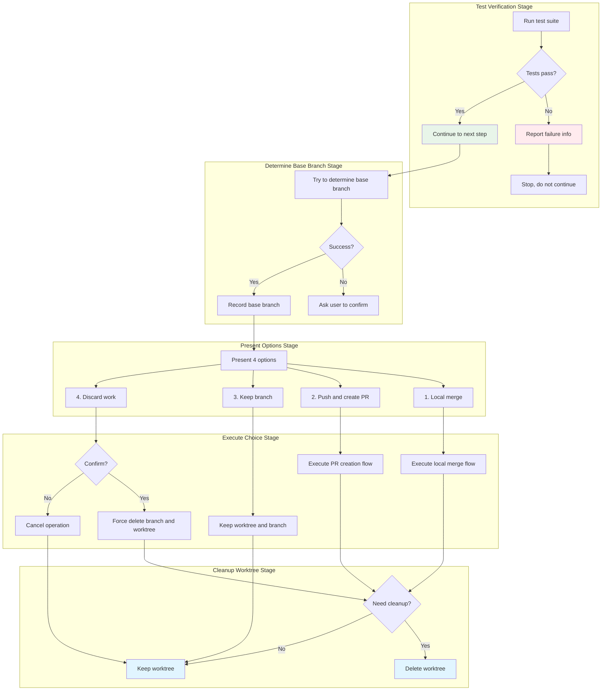

# Branch Completion Workflow

## What You'll Learn

- Systematically verify test status after development completion
- Choose clearly between merging, creating PR, keeping, or discarding branches
- Execute branch merging and clean up Git worktree
- Create standardized Pull Requests
- Safely discard unneeded work

## Your Current Struggles

**Branch management chaos, haphazard wrap-up**

Have you encountered these problems after completing development?

Merging in a hurry before tests pass, causing main branch code corruption. Not knowing what to write when creating a PR, with messy commit history. Wanting to keep the current work branch but forgetting to clean up the worktree, wasting disk space. Worst of all, accidentally deleting important commits when trying to discard a failed experiment.

Common chaotic scenarios:
- ❌ Merging despite test failures, breaking the main branch
- ❌ Leaving PR description blank or filling it randomly
- ❌ Keeping worktree long after development completion, occupying space
- ❌ Not confirming before discarding work, accidentally deleting important code
- ❌ Forgetting to delete branches after merging, causing branch accumulation

**Core problem**: Lack of a systematic branch completion workflow.

::: info What is the branch completion workflow?

The `finishing-a-development-branch` skill is a workflow that helps you systematically handle branch wrap-up after all development tasks are complete.

It covers these scenarios:
- **Local merge**: Directly merge feature branch into main branch
- **Create PR**: Push branch and create Pull Request
- **Keep branch**: Temporarily keep branch and worktree, continue working
- **Discard work**: Abandon current experiment or failed attempt

Core benefits:
1. **Forced test verification**: Only passing code can be merged
2. **Clear option presentation**: 4 fixed options, no omissions
3. **Safe worktree cleanup**: Only clean up worktree at appropriate times
4. **Standardized PR template**: Automatically generate PR description structure

::

## When to Use This Approach

The `finishing-a-development-branch` skill applies to these scenarios:

| Condition | Description |
| ---- | ---- |
| **All tasks complete** | Already completed all tasks through `subagent-driven-development` or `executing-plans` |
| **Tests passing** | Development work complete, all tests passing |
| **Need to decide how to integrate** | Unsure whether to merge, create PR, or keep/discard branch |

::: tip Workflow Integration Point

In Superpowers' complete development workflow, `finishing-a-development-branch` is called in the following stages:

1. **subagent-driven-development** (Step 7) - After all tasks complete
2. **executing-plans** (Step 5) - After all batches complete

Core principle: **Use whenever you need to decide how to integrate completed work**.
::

::: warning Essential Prerequisites

Before using the finishing-a-development-branch skill, you must:
1. ✅ Completed development work in a Git worktree
2. ✅ All tasks marked as complete
3. ✅ Tests passing (or ready to handle test failures)

::

## Core Approach

The core flow of the finishing-a-development-branch skill is divided into five stages: test verification, determine base branch, present options, execute choice, and clean up worktree:



### Forced Test Verification

Before presenting any options, **must** verify that tests pass first.

**Why important**:
- Ensures only verified code enters the main branch
- Prevents corrupted code from polluting the main branch or creating failed PRs
- Aligns with TDD and evidence-first principles

**Verification method**:
```bash
# Run project test suite
npm test  # or cargo test, pytest, go test ./...
```

**If tests fail**:
- Report failure count and specific failure information
- Stop flow, **do not** present merge options
- Require fixing before re-invoking the skill

### Four Options Design

The skill presents exactly these 4 options without adding explanations:

```
Implementation complete. What would you like to do?

1. Merge back to <base-branch> locally
2. Push and create a Pull Request
3. Keep the branch as-is (I'll handle it later)
4. Discard this work

Which option?
```

**Option characteristics**:

| Option | Merge | Push | Keep Worktree | Cleanup Branch |
| ---- | ---- | ---- | ------------ | -------- |
| 1. Local merge | ✓ | - | - | ✓ |
| 2. Create PR | - | ✓ | ✓ | - |
| 3. Keep | - | - | ✓ | - |
| 4. Discard | - | - | - | ✓ (force) |

### Worktree Cleanup Strategy

Based on the selected option, worktree cleanup strategy varies:

- **Option 1 (Local merge)**: Clean up worktree
- **Option 2 (Create PR)**: Keep worktree (may need to follow up on PR review)
- **Option 3 (Keep)**: Keep worktree
- **Option 4 (Discard)**: Clean up worktree

## Follow Along

### Step 1: Preparation - Trigger Skill

**Why**
Confirm that the AI agent has correctly loaded the `finishing-a-development-branch` skill.

**Operation Example**

```
You: All tasks complete, ready to finish development work.

AI Agent: I will use the finishing-a-development-branch skill to complete this work.
```

**You should see**: AI agent declares it's using this skill.

### Step 2: Test Verification - Run Test Suite

**Why**
Ensure only passing test code enters the main branch.

**Operation Example**

```
AI Agent: [Running project test suite]
npm test
```

**You should see**:

**Tests Passing Example**:
```
AI Agent:
✅ Verifying test status...
npm test

PASS  src/auth.test.js
  ✓ testLoginSuccess()
  ✓ testLoginFailure()
  ✓ testSessionManagement()

Test Suites: 1 passed, 1 total
Tests:       3 passed, 3 total
```

**Tests Failing Example**:
```
AI Agent:
❌ Test verification failed
Tests passing: 2 tests, 1 failure
Failure: testSessionManagement() - expected session to be active, got inactive

Cannot proceed with merge/PR until tests pass.
```

::: warning Checkpoint

Test verification must report:
- [ ] Number of tests passing
- [ ] Number of tests failing (if any)
- [ ] Specific failure information (if any)

If tests fail, **must** stop flow, do not present merge options.
::

### Step 3: Determine Base Branch

**Why**
Need to know which base branch the feature branch split from to merge correctly.

**Operation Example**

```
AI Agent: [Attempting to determine base branch]
git merge-base HEAD main 2>/dev/null || git merge-base HEAD master 2>/dev/null
```

**Successfully Determined Example**:
```
AI Agent:
✅ Base branch: main
```

**Unable to Determine Example**:
```
AI Agent:
This branch split from main - is that correct?
```

**You should see**:
- If automatically determined successfully: Base branch name
- If unable to determine: Confirmation prompt

### Step 4: Present Options

**Why**
Let users clearly choose how to integrate completed work.

**Operation Example**

```
AI Agent:
Implementation complete. What would you like to do?

1. Merge back to main locally
2. Push and create a Pull Request
3. Keep the branch as-is (I'll handle it later)
4. Discard this work

Which option?
```

::: tip Option Explanation

**Don't add extra explanations**, keep options concise:
- ❌ Wrong: "Option 1 merges the branch locally..." (too long)
- ✅ Correct: "1. Merge back to main locally" (concise)
::

**User Response Example**:

```
You: 2
```

### Step 5: Execute Choice - Option 1 (Local Merge)

**Why**
Directly merge feature branch into main branch to complete integration quickly.

**Operation Example**

```
AI Agent:
Executing local merge...

[Switch to base branch]
git checkout main

[Pull latest code]
git pull

[Merge feature branch]
git merge feature/auth

[Verify tests]
npm test
```

**You should see**:
```
AI Agent:
✅ Switched to main
✅ Pulled latest code
✅ Merged feature/auth

Merge made by the 'ort' strategy.
  src/auth.js    | 45 +++++++++++++++++++++++++++++
  1 file changed, 45 insertions(+)

✅ Post-merge tests passing: 3 tests, 0 failures
```

**If post-merge tests fail**:
```
AI Agent:
❌ Post-merge tests failed
Tests passing: 2 tests, 1 failure

Must fix before continuing.
```

**Cleanup Branch**:
```
AI Agent:
[Delete feature branch]
git branch -d feature/auth
Deleted branch feature/auth (was abc1234).
```

### Step 5: Execute Choice - Option 2 (Create PR)

**Why**
Use PR process for code review to ensure code quality.

**Operation Example**

```
AI Agent:
Creating Pull Request...

[Push branch]
git push -u origin feature/auth

[Create PR]
gh pr create --title "Add user authentication" --body "$(cat <<'EOF'
## Summary
- Implemented user login/logout functionality
- Added session management with JWT tokens
- Created authentication middleware

## Test Plan
- [x] Unit tests for login/logout
- [x] Session management tests
- [ ] Manual testing in dev environment
EOF
)"
```

**You should see**:
```
AI Agent:
✅ Pushed branch: feature/auth
✅ PR created: https://github.com/owner/repo/pull/42

Pull Request #42: Add user authentication
```

::: tip PR Description Guidelines

Use standardized PR description template:
- **Summary**: 2-3 bullet points describing changes
- **Test Plan**: Verification steps checklist
- Keep under 200 words, be concise
::

### Step 5: Execute Choice - Option 3 (Keep Branch)

**Why**
Temporarily keep branch and worktree, may need further work.

**Operation Example**

```
AI Agent:
Keeping branch feature/auth.
Worktree preserved at /Users/jesse/project/.worktrees/auth.

No cleanup performed. Branch and worktree remain available.
```

**You should see**:
- Branch keep confirmation
- Worktree path

**Notes**:
- **Do not clean up worktree**
- Branch remains available
- Can re-invoke skill later to handle

### Step 5: Execute Choice - Option 4 (Discard Work)

**Why**
Abandon current experiment or failed attempt, clean up related resources.

**Operation Example**

```
AI Agent:
⚠️ About to permanently delete:

- Branch: feature/auth
- Commits: abc1234 (Add auth), def5678 (Fix login)
- Worktree at: /Users/jesse/project/.worktrees/auth

Type 'discard' to confirm.
```

**You should see**:
- Clear deletion list
- Specific commit hashes and messages
- Full worktree path

**User Confirmation**:
```
You: discard
```

**Execute Deletion**:
```
AI Agent:
[Switch to base branch]
git checkout main

[Force delete feature branch]
git branch -D feature/auth
Deleted branch feature/auth (was def5678).
```

::: danger Never Delete Without Confirmation

Discard operation must require user to input explicit confirmation:
- ❌ Wrong: Execute deletion directly without asking
- ❌ Wrong: Accept arbitrary input (e.g., "yes", "ok")
- ✅ Correct: Require input "discard" to confirm
::

### Step 6: Cleanup Worktree (Options 1, 2, 4)

**Why**
Clean up no-longer-needed Git worktree to free disk space.

**Operation Example**

```
AI Agent: [Check if in worktree]
git worktree list | grep $(git branch --show-current)
```

**If cleanup needed**:
```
AI Agent:
[Delete worktree]
git worktree remove /Users/jesse/project/.worktrees/auth

✅ Worktree deleted
```

**Check Command** (internal execution):
```bash
# Check if in worktree
git worktree list | grep $(git branch --show-current)

# Delete worktree
git worktree remove <worktree-path>
```

**For option 3**:
- Do not clean up worktree
- Branch and worktree remain available

::: warning Checkpoint

Worktree cleanup must follow:
- [ ] Option 1 (local merge): Clean up worktree
- [ ] Option 2 (create PR): Keep worktree (need to follow up on PR)
- [ ] Option 3 (keep): Keep worktree
- [ ] Option 4 (discard): Clean up worktree
::

## Checkpoint ✅

**Verify finishing-a-development-branch skill execution is complete**

- [ ] AI agent declares using `finishing-a-development-branch` skill
- [ ] Test suite run to verify status
- [ ] If tests failed, stopped flow and reported failure info
- [ ] Base branch determined (or asked user to confirm)
- [ ] Presented exact 4 options
- [ ] Executed user-selected option
- [ ] If option 1 selected: Switched to base branch, pulled, merged, verified tests, deleted feature branch
- [ ] If option 2 selected: Pushed branch, created PR, reported PR URL
- [ ] If option 3 selected: Reported branch and worktree keep location
- [ ] If option 4 selected: Listed deletion list, required user confirmation, executed deletion
- [ ] Cleaned up or kept worktree based on option

If any of the above doesn't match, the flow is incomplete and needs supplementation.

## Common Pitfalls

### ❌ Pitfall 1: Skip Test Verification

**Symptom**: Present merge options directly without verifying test status.

**Problem**:
- May merge corrupted code
- Breaks main branch stability
- Creates failed PR

**Solution**:
- Must run tests before presenting options
- If tests fail, report failure and stop
- Don't allow "test later" excuses

### ❌ Pitfall 2: Open-Ended Questions

**Symptom**: Ask "What should I do next?", no clear options.

**Problem**:
- Users don't know what choices exist
- May miss important steps
- Inconsistent flow

**Solution**:
- Present exactly 4 options
- Don't add extra explanations
- Keep option format consistent

### ❌ Pitfall 3: Auto-Cleanup All Worktrees

**Symptom**: Clean up worktree regardless of which option is selected.

**Problem**:
- Option 2 (create PR) needs to keep worktree to follow up on review
- Option 3 (keep) explicitly says to keep temporarily
- Violates user intent

**Solution**:
- Option 1: Clean up worktree
- Option 2: Keep worktree
- Option 3: Keep worktree
- Option 4: Clean up worktree

### ❌ Pitfall 4: Discard Without Confirmation

**Symptom**: Delete branch and worktree directly without requiring confirmation.

**Problem**:
- May accidentally delete important work
- Can't recover lost code
- Violates safety principles

**Solution**:
- List everything to be deleted (branch, commits, worktree path)
- Require user to input explicit confirmation ("discard")
- Execute deletion after confirmation

### ❌ Pitfall 5: Don't Verify Tests After Merge

**Symptom**: Don't run tests after merging, clean up branch directly.

**Problem**:
- Merge may introduce conflicts or breakage
- Main branch enters unstable state
- Other developers affected

**Solution**:
- Must run tests after merge
- Verify tests pass before cleaning up feature branch
- If tests fail, report failure and stop

### ❌ Pitfall 6: Fill PR Description Randomly

**Symptom**: PR description is blank or content is random when creating PR.

**Problem**:
- Reviewers unclear about changes
- Doesn't meet team standards
- May lead to PR rejection

**Solution**:
- Use standardized PR description template
- Include Summary (2-3 bullet points)
- Include Test Plan (verification steps)
- Keep concise (under 200 words)

### ❌ Pitfall 7: Incorrect Base Branch Judgment

**Symptom**: Assume base branch is main by default, don't verify.

**Problem**:
- Project may use master as main branch
- Merge into wrong branch
- Breaks branch structure

**Solution**:
- Try to auto-determine base branch (main or master)
- If unable to determine, ask user to confirm
- Don't assume branch name

## Red Flags - Must Avoid

The following behaviors will cause the finishing-a-development-branch skill to fail:

**Absolutely Forbidden**:
- ❌ Continue presenting merge options when tests fail
- ❌ Merge without verifying tests
- ❌ Delete work without confirmation
- ❌ Force push without explicit request
- ❌ Auto-cleanup all worktrees
- ❌ Use open-ended questions
- ❌ Fill PR description randomly

**Always Must**:
- ✅ Verify tests pass before presenting options
- ✅ Present exactly 4 options
- ✅ Option 4 requires input "discard" to confirm
- ✅ Options 1 and 4 clean up worktree
- ✅ Options 2 and 3 keep worktree
- ✅ Verify tests after merge
- ✅ Use standardized PR template

## Integration with Other Skills

### Callers

The **finishing-a-development-branch** skill is called by these skills:

- **subagent-driven-development** (Step 7) - After all tasks complete
- **executing-plans** (Step 5) - After all batches complete

### Works With

The **finishing-a-development-branch** skill works with these skills:

- **using-git-worktrees** - Clean up worktree created by this skill
- **test-driven-development** - Ensure all tests pass
- **verification-before-completion** - Verify work completion

## Branch Completion Decision Tree

```
Development complete
    ↓
finishing-a-development-branch skill triggered
    ↓
[Test verification]
    ├─ Tests fail → Stop, report failure
    └─ Tests pass → Continue
            ↓
        [Determine base branch]
            ├─ Auto-determined → Record base branch
            └─ Unable to determine → Ask user to confirm
                    ↓
                [Present options]
                    ├─ 1. Local merge
                    │   ├─ Switch to base branch
                    │   ├─ Pull latest code
                    │   ├─ Merge feature branch
                    │   ├─ Verify tests
                    │   ├─ Delete feature branch
                    │   └─ Clean up worktree
                    ├─ 2. Create PR
                    │   ├─ Push branch
                    │   ├─ Create PR (use template)
                    │   └─ Keep worktree
                    ├─ 3. Keep
                    │   └─ Keep branch and worktree
                    └─ 4. Discard
                        ├─ List deletion items
                        ├─ Require confirmation (input "discard")
                        ├─ Delete feature branch
                        └─ Clean up worktree
```

## FAQ

### Q: When should I use this skill?

A: Use after all development tasks are complete and all tests pass. This is the final step of development, used to decide how to integrate completed work.

### Q: Why can't I skip test verification?

A: Test verification is the core defense for code quality. Skipping test verification may cause corrupted code to enter the main branch, affecting the entire project's stability.

### Q: When should I delete the worktree after creating a PR with option 2?

A: Usually after the PR is merged. You can re-invoke this skill (choose option 3 at that time) to clean up the worktree, or manually use the `git worktree remove` command.

### Q: Can I recover if I accidentally select option 4?

A: No. Git worktree and branch deletion operations are permanent. That's why the skill requires explicit confirmation (input "discard"), ensuring this is your true intention.

### Q: Can I customize the PR template?

A: Yes. The template provided by the skill is default. You can ask the AI agent to adjust the PR description format before execution, or modify the skill itself to meet team standards.

## Chapter Summary

The finishing-a-development-branch skill achieves systematic management of branch completion through these mechanisms:

1. **Forced test verification**: Only passing code can be merged or create PR
2. **Clear option presentation**: 4 fixed options cover all common scenarios
3. **Safe worktree cleanup**: Intelligently clean up or keep worktree based on choice
4. **Standardized PR template**: Automatically generate compliant PR descriptions
5. **Safe discard flow**: Requires explicit confirmation to prevent accidental deletion

**Remember**: Branch completion workflow is the final step of development, ensuring code quality and a clean working environment. Use this skill whenever you need to decide how to integrate completed work.

## Next Lesson Preview

> In the next lesson, we'll learn **[Complete Development Workflow in Practice](../complete-workflow/)**.
>
> You'll learn:
> - How to comprehensively use all Superpowers skills
> - Complete development workflow from design to deployment
> - Workflow selection in different scenarios
> - Common problems and solutions in practice

---

## Appendix: Source Code Reference

<details>
<summary><strong>Click to expand source code locations</strong></summary>

> Last updated: 2026-02-01

| Feature | File Path | Line Numbers |
| ----------- | --------------------------------------------------------------------------------------------- | ------- |
| Branch completion skill | [`skills/finishing-a-development-branch/SKILL.md`](https://github.com/obra/superpowers/blob/main/skills/finishing-a-development-branch/SKILL.md) | 1-201   |
| Workflow overview | [`README.md`](https://github.com/obra/superpowers/blob/main/README.md) | 80-96   |

**Core Principles**:
- Verify tests → Present options → Execute choice → Clean up worktree
- Start by declaring: "I'm using the finishing-a-development-branch skill to complete this work."

**Step 1: Verify Tests** (source lines 18-38):
```bash
# Run project test suite
npm test / cargo test / pytest / go test ./...

# If tests fail
Tests failing (<N> failures). Must fix before completing:
[Show failures]

Cannot proceed with merge/PR until tests pass.

# Stop, do not continue
```

**Step 2: Determine Base Branch** (source lines 40-48):
```bash
# Try to determine base branch
git merge-base HEAD main 2>/dev/null || git merge-base HEAD master 2>/dev/null

# Or ask
This branch split from main - is that correct?
```

**Step 3: Present Options** (source lines 50-64):
```
Implementation complete. What would you like to do?

1. Merge back to <base-branch> locally
2. Push and create a Pull Request
3. Keep the branch as-is (I'll handle it later)
4. Discard this work

Which option?
```

**Don't add explanations** - keep options concise.

**Step 4: Execute Choice - Option 1 (Local Merge)** (source lines 68-87):
```bash
# Switch to base branch
git checkout <base-branch>

# Pull latest
git pull

# Merge feature branch
git merge <feature-branch>

# Verify tests
<test command>

# If tests pass
git branch -d <feature-branch>
```

**Step 4: Execute Choice - Option 2 (Create PR)** (source lines 89-106):
```bash
# Push branch
git push -u origin <feature-branch>

# Create PR
gh pr create --title "<title>" --body "$(cat <<'EOF'
## Summary
<2-3 bullets of what changed>

## Test Plan
- [ ] <verification steps>
EOF
)"
```

**Step 4: Execute Choice - Option 3 (Keep)** (source lines 108-112):
```
Keeping branch <name>. Worktree preserved at <path>.

Don't cleanup worktree.
```

**Step 4: Execute Choice - Option 4 (Discard)** (source lines 114-134):
```
This will permanently delete:
- Branch <name>
- All commits: <commit-list>
- Worktree at <path>

Type 'discard' to confirm.

[Wait for exact confirmation]

If confirmed:
git checkout <base-branch>
git branch -D <feature-branch>
```

**Step 5: Clean up Worktree** (source lines 136-150):
```bash
# Check if in worktree
git worktree list | grep $(git branch --show-current)

# If yes
git worktree remove <worktree-path>

# Option 3: Keep worktree
```

**Quick Reference Table** (source lines 152-159):
| Option | Merge | Push | Keep Worktree | Cleanup Branch |
|--------|-------|------|---------------|----------------|
| 1. Merge locally | ✓ | - | - | ✓ |
| 2. Create PR | - | ✓ | ✓ | - |
| 3. Keep as-is | - | - | ✓ | - |
| 4. Discard | - | - | - | ✓ (force) |

**Common Errors** (source lines 161-177):
- **Skip test verification**: Problem - merge corrupted code; Fix - always verify tests
- **Open-ended questions**: Problem - ambiguous; Fix - present exactly 4 options
- **Auto worktree cleanup**: Problem - delete worktree that needs to be kept; Fix - only cleanup options 1 and 4
- **Discard without confirmation**: Problem - accidentally delete work; Fix - require input "discard"

**Red Flags** (source lines 179-191):
**Never**:
- Continue when tests fail
- Merge without verifying test results
- Delete work without confirmation
- Force push without explicit request

**Always**:
- Verify tests before presenting options
- Present exactly 4 options
- Option 4 requires input "discard" to confirm
- Only cleanup worktree for options 1 and 4

**Integration** (source lines 193-201):
**Called by**:
- **subagent-driven-development** (Step 7) - After all tasks complete
- **executing-plans** (Step 5) - After all batches complete

**Pairs with**:
- **using-git-worktrees** - Clean up worktree created by this skill

</details>
