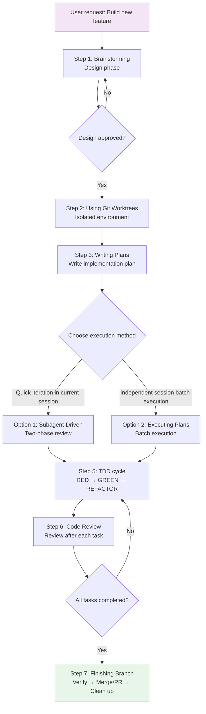

# Complete Development Workflow in Practice: From Design to Deployment

::: warning Prerequisites
This tutorial assumes you understand the following:
- [How to Use Skills](../../start/using-skills/)
- [Design Workflow: Brainstorming](../../core-workflows/design-workflow/)
- [Planning Workflow: Writing Plans](../../core-workflows/planning-workflow/)
- [Test-Driven Development: TDD Iron Law](../../core-workflows/tdd-workflow/)
- [Subagent-Driven Development](../subagent-development/)
::

## What You'll Learn

- Master Superpowers' seven core steps for a complete workflow from requirements to deployment
- Understand the purpose and trigger conditions for each step
- Learn to choose the right execution approach at key decision points
- Practice the complete development workflow through real-world scenarios
- Avoid common workflow shortcuts and wrong decisions

## Your Current Dilemma

**AI agent development easily "goes off track"**

Have you encountered this situation: You ask an AI agent to implement a feature, and it starts writing code directly, only to find halfway through that it misunderstood the requirements, or the code doesn't follow project standards, or lacks tests and needs rework.

Common problems:
- ❌ Jump straight to implementation without design thinking
- ❌ No isolated environment, polluting the main branch
- ❌ Tasks too large, progress untrackable
- ❌ No test-driven development, quality can't be guaranteed
- ❌ No code review, issues discovered late
- ❌ Don't know how to merge or clean up after completion

These problems lead to: long development cycles, unstable code quality, frequent rework.

**Core problem**: Lack of a systematic development workflow.

::: info What is the Complete Development Workflow?

The complete development workflow is the core of Superpowers, defining seven steps from requirements to deployment, ensuring AI agents follow best practices at every step.

**Seven Core Steps**:
1. **Brainstorming (Design)** - Understand requirements, explore solutions, present design
2. **Using Git Worktrees (Isolation)** - Create isolated workspace, protect main branch
3. **Writing Plans (Planning)** - Break down into small tasks, write detailed implementation plan
4. **Subagent-Driven / Executing Plans (Execution)** - Two-phase review or batch execution
5. **Test-Driven Development (Testing)** - RED-GREEN-REFACTOR cycle
6. **Requesting Code Review (Review)** - Review after each task to ensure quality
7. **Finishing a Development Branch (Completion)** - Verify tests, choose merge method, clean up environment

**Core principle**: Each step is mandatory, not optional.
::

## When to Use This Approach

The complete development workflow applies to the following scenarios:

| Condition | Description |
| ---- | ---- |
| **New Feature Development** | Implementing new features or components |
| **Bug Fixes** | Fixing complex bugs or issues |
| **Code Refactoring** | Refactoring existing code or architecture |
| **Integration Work** | Integrating third-party services or modules |

::: tip Workflow vs. Single Skill

**Complete Workflow**: Applicable to the entire development cycle, from requirements to deployment
**Single Skill**: Applicable to specific stages, such as debugging, review, etc.

If you just need to debug an issue, use the `systematic-debugging` skill. If you need to complete the entire development cycle, use the complete workflow.
::

## Core Approach

The core flow of the complete development workflow:



### Seven Steps Overview

| Step | Skill | Purpose | Time |
| ---- | ---- | ---- | ---- |
| **1. Design** | brainstorming | Understand requirements, explore solutions | 10-30 min |
| **2. Isolation** | using-git-worktrees | Create isolated workspace | 2-5 min |
| **3. Planning** | writing-plans | Break down into small tasks | 10-20 min |
| **4. Execution** | subagent-driven or executing-plans | Two-phase review or batch execution | Varies |
| **5. Testing** | test-driven-development | RED-GREEN-REFACTOR | Continuous |
| **6. Review** | requesting-code-review | Review after each task | Per task |
| **7. Completion** | finishing-a-development-branch | Verify, merge, clean up | 5-10 min |

### Key Decision Points

**Decision Point 1: Execution Method Selection**

At Step 4, you need to choose an execution method:

| Dimension | Subagent-Driven | Executing Plans |
| ---- | -------------- | -------------- |
| **Session** | Current session (no switching) | Independent session (switching required) |
| **Context** | Controller managed | Independent for each task |
| **Review** | Automatic two-phase | Manual or single-phase |
| **Task count** | Few (< 10) | Many (> 10) |
| **Speed** | Fast (no waiting) | Medium (switching required) |

**Selection recommendations**:
- Few tasks (< 10) → Subagent-Driven Development
- Many tasks (> 10) → Executing Plans (batch execution)

::: tip View detailed tutorials

- **Subagent-Driven Development** → [Subagent-Driven Development](../subagent-development/)
- **Executing Plans** → [Planning Workflow](../../core-workflows/planning-workflow/)
::

## Follow Along

### Scenario: Building a User Comment System

Assume you need to add a user comment feature to a blog system, including:
- Users can post comments
- Comments need moderation
- Support replies and likes

### Step 1: Brainstorming - Design Phase

**Why**
Before implementation, you must understand requirements, explore solutions, present design to avoid later rework.

**Example**

```
You: I want to add a user comment feature to the blog system, including posting, moderation, replies, and likes.

AI: Okay, I need to understand some details.

Question 1: Do users need to log in to post comments?

You: Yes, login is required.

AI: Understood.

Question 2: Is comment moderation done manually by administrators, or automatically filtered for sensitive words?

You: Manual moderation.

AI: Understood.

Question 3: Do replies support unlimited nesting, or only one-level replies?

You: Support unlimited nesting, but display at most 3 levels.

AI: Got it. I understand your requirements now. Here's my design proposal:

[Design Document - Part 1: Data Model]

The comment system needs the following data models:
- Comment: id, content, userId, postId, parentId, status, createdAt
- User: id, name, email
- Post: id, title

The status field has three values: pending (awaiting moderation), approved (moderated), rejected (rejected).

Does this look correct so far?

You: Yes, continue.

AI: [Design Document - Part 2: API Endpoints]

The following API endpoints are needed:
- POST /api/posts/:postId/comments - Create comment
- GET /api/posts/:postId/comments - Get comment list
- PUT /api/comments/:id/approve - Approve moderation
- PUT /api/comments/:id/reject - Reject moderation
- POST /api/comments/:id/replies - Reply to comment
- POST /api/comments/:id/like - Like comment

Does this look correct so far?

You: Yes, continue.

AI: [Design Document - Part 3: Frontend Components]

The following React components are needed:
- CommentForm - Comment form
- CommentList - Comment list
- CommentItem - Single comment
- AdminPanel - Admin moderation panel

Does this look correct so far?

You: Yes, continue.

AI: [Design Document - Part 4: Permission Control]

- Only logged-in users can post comments and like
- Only administrators can moderate comments
- Authors can delete their own comments

Does this look correct so far?

You: Yes, that's good.

AI: Good, I'll now save the design document.

[Save to: docs/plans/2026-02-01-comment-system-design.md]
[Commit design document]
```

**You should see**: AI asks questions, presents design in sections for confirmation, and finally saves the design document.

::: warning Checkpoint

After Brainstorming, you must:
- [ ] Requirements are clear (all key questions answered)
- [ ] Design presented in sections and confirmed
- [ ] Design document saved to `docs/plans/`
- [ ] Design document committed to git

If any of the above is missing, don't continue—complete it first.
::

### Step 2: Using Git Worktrees - Isolated Environment

**Why**
Create an isolated workspace to protect the main branch and avoid pollution.

**Example**

```
You: Ready to start implementation.

AI: Good, I'll create an isolated workspace now.

[Use using-git-worktrees skill]

Creating worktree...
Worktree created successfully: /path/to/project-worktree

Switching to worktree...

Running project setup...
npm install
npm run setup

Verifying test baseline...
npm test

Test baseline passed: 100/100

Workspace is ready.
```

**You should see**:
- New worktree created
- Project set up (dependencies installed)
- Test baseline passed (ensuring existing functionality isn't broken)

::: warning Checkpoint

After Git Worktrees, you must:
- [ ] Worktree created
- [ ] Switched to worktree
- [ ] Project setup completed (dependencies installed)
- [ ] Test baseline passed

If the test baseline fails, it must be fixed before continuing.
::

### Step 3: Writing Plans - Writing Implementation Plan

**Why**
Break down large features into small tasks (each 2-5 minutes), write detailed implementation plans to ensure even engineers without context can execute.

**Example**

```
AI: Good, I'll now write a detailed implementation plan.

[Use writing-plans skill]

[Save to: docs/plans/2026-02-01-comment-system-implementation.md]

```markdown
# User Comment System Implementation Plan

**For Claude:** REQUIRED SUB-SKILL: Use superpowers:executing-plans to implement this plan task-by-task.

**Goal:** Implement user comment system, including posting, moderation, replies, and likes.

**Architecture:** Use RESTful API, data stored in PostgreSQL, frontend uses React components.

**Tech Stack:** Node.js + Express + PostgreSQL + React

---

## Task List

### Task 1: Create comment data model
- Create `models/Comment.js`
- Define fields: id, content, userId, postId, parentId, status, createdAt
- Define status enum: pending, approved, rejected
- Migrate to database

### Task 2: Create comment API endpoints
- Create `routes/comments.js`
- Implement POST /api/posts/:postId/comments
- Implement GET /api/posts/:postId/comments
- Add parameter validation

### Task 3: Implement comment moderation API
- Implement PUT /api/comments/:id/approve
- Implement PUT /api/comments/:id/reject
- Add permission check (admin only)

### Task 4: Implement reply and like APIs
- Implement POST /api/comments/:id/replies
- Implement POST /api/comments/:id/like
- Handle nesting logic

### Task 5: Create comment form component
- Create `components/CommentForm.jsx`
- Implement form validation
- Integrate comment API

### Task 6: Create comment list component
- Create `components/CommentList.jsx`
- Implement comment display
- Support nested display (max 3 levels)

### Task 7: Create admin moderation panel
- Create `components/AdminPanel.jsx`
- Display pending comments
- Implement moderation buttons
```
```

**You should see**: Detailed implementation plan saved to `docs/plans/`.

::: warning Checkpoint

After Writing Plans, you must:
- [ ] Implementation plan saved to `docs/plans/`
- [ ] Each task is small enough (2-5 min to complete)
- [ ] Each task includes complete code and test steps
- [ ] Implementation plan committed to git

If tasks are too large, continue breaking them down.
::

### Step 4: Choose Execution Method

**Why**
Choose the appropriate execution method based on task count and scenario.

**Example**

```
AI: Implementation plan completed with 7 tasks.

There are now two execution methods:

**Option 1: Subagent-Driven Development (current session)**
- Dispatch a new subagent for each task
- Automatic two-phase review (spec compliance + code quality)
- Suitable for few tasks (< 10)
- No session switching required

**Option 2: Executing Plans (independent session)**
- Batch execute tasks
- Need to switch to independent session
- Suitable for many tasks (> 10)
- Manual review checkpoints

Which method would you like to use?

You: Use Option 1, Subagent-Driven Development.

AI: Good, I'll use Subagent-Driven Development to execute this plan.
```

::: tip How to choose?

**Choose Subagent-Driven Development, if**:
- Few tasks (< 10)
- Want to complete in current session
- Need automatic two-phase review

**Choose Executing Plans, if**:
- Many tasks (> 10)
- Can switch to independent session
- Need to batch process tasks
::

### Step 5: Subagent-Driven Development - Two-Phase Review

**Why**
Dispatch a new subagent for each task to avoid context pollution, execute two-phase review to ensure quality.

**Example**

```
AI: Starting to execute task 1: Create comment data model.

[Dispatch implementer subagent]

Task: Create comment data model

Requirements:
- Create `models/Comment.js`
- Define fields: id, content, userId, postId, parentId, status, createdAt
- Define status enum: pending, approved, rejected
- Migrate to database
- Strictly follow TDD (RED-GREEN-REFACTOR)

[After some time]

Implementer subagent:
- ✅ Created `models/Comment.js`
- ✅ Defined all fields and enums
- ✅ Added 5 tests, all passing
- ✅ Migration script created and executed
- ✅ Self-review: Found missing index, added it
- ✅ Committed: abc123

[Dispatch spec review subagent]

Spec review subagent:
✅ Spec compliant
- Implemented all required fields
- Defined status enum
- Migration script created
- No extra features
- No spec details missed

[Dispatch code quality review subagent]

Code quality review subagent:
Strengths:
- Good test coverage (5/5)
- Clear code, reasonable structure
- Added necessary indexes

Issues:
None

Result: ✅ Approved

[Mark task 1 as complete]
```

**You should see**: Each task goes through implement → spec review → code quality review.

::: tip View detailed tutorial

Complete Subagent-Driven Development flow → [Subagent-Driven Development](../subagent-development/)
::

### Step 6: Test-Driven Development - TDD Cycle

**Why**
Enforce RED-GREEN-REFACTOR cycle to ensure every feature has tests, avoiding writing untested code.

**Example**

During implementation, subagents will automatically follow the TDD process:

```
Implementer subagent:
Now starting to implement task 1: Create comment data model.

[Step 1: RED - Write failing test]

Create `tests/Comment.test.js`:
```javascript
describe('Comment Model', () => {
  it('should create a comment with required fields', async () => {
    const comment = await Comment.create({
      content: 'Test comment',
      userId: 1,
      postId: 1
    });
    expect(comment.content).toBe('Test comment');
  });
});
```

Run tests:
```
npm test

Test failed: ReferenceError: Comment is not defined
```

[Step 2: GREEN - Write minimum code to make tests pass]

Create `models/Comment.js`:
```javascript
const { DataTypes } = require('sequelize');

const Comment = sequelize.define('Comment', {
  content: DataTypes.TEXT,
  userId: DataTypes.INTEGER,
  postId: DataTypes.INTEGER,
  status: DataTypes.ENUM('pending', 'approved', 'rejected')
});

module.exports = Comment;
```

Run tests:
```
npm test

Tests passed: ✅
```

[Step 3: REFACTOR - Refactor code]

Code is already clean, no refactoring needed.

[Commit]

git commit -m "Create Comment model with required fields"
```

**You should see**: Subagents strictly follow the RED-GREEN-REFACTOR cycle.

::: tip View detailed tutorial

Complete TDD flow → [Test-Driven Development: TDD Iron Law](../../core-workflows/tdd-workflow/)
::

### Step 7: Requesting Code Review - Code Review

**Why**
Perform code review after each task completion to ensure code quality and spec compliance.

**Example**

```
AI: Task 1 completed, now performing code review.

[Use requesting-code-review skill]

Review task: Create comment data model

Commit: abc123

Spec review:
✅ Spec compliant
- Implemented all required fields
- Defined status enum
- Migration script created

Code quality review:
Strengths:
- Test coverage 100% (5/5)
- Clear code structure
- Added necessary indexes (userId, postId)

Suggestions:
None

Result: ✅ Approved
```

**You should see**: Detailed code review after each task completion.

::: tip View detailed tutorial

Complete code review flow → [Code Review Workflow](../code-review-workflow/)
::

### Step 8: Repeat Process, Complete All Tasks

**Why**
Repeat the same process for each task until all tasks are complete.

**Example**

```
Task 2: Create comment API endpoints
[Implementer subagent] → [Spec review] → [Code quality review] → ✅ Complete

Task 3: Implement comment moderation API
[Implementer subagent] → [Spec review] → [Code quality review] → ✅ Complete

Task 4: Implement reply and like APIs
[Implementer subagent] → [Spec review] → [Code quality review] → ✅ Complete

Task 5: Create comment form component
[Implementer subagent] → [Spec review] → [Code quality review] → ✅ Complete

Task 6: Create comment list component
[Implementer subagent] → [Spec review] → [Code quality review] → ✅ Complete

Task 7: Create admin moderation panel
[Implementer subagent] → [Spec review] → [Code quality review] → ✅ Complete

All tasks completed.
```

**You should see**: All tasks passed two-phase review.

### Step 9: Finishing a Development Branch - Complete Branch

**Why**
Verify all tests pass, choose to merge or create PR, clean up worktree.

**Example**

```
AI: All tasks completed, now using finishing-a-development-branch skill to finish the work.

[Use finishing-a-development-branch skill]

Verifying tests...

npm test

Test results:
✅ 100% passed (150/150)

All tests passed.

[Step 1: Determine base branch]

Current branch: feature/comment-system
Base branch: main

[Step 2: Present options]

Please choose next action:

1. **Merge to main branch**
   - Directly merge to main branch
   - Suitable for small projects or personal projects

2. **Create Pull Request**
   - Create PR for review
   - Suitable for team projects or open source projects

3. **Keep branch for further work**
   - Keep branch to continue working
   - Suitable when more development is needed

4. **Discard branch**
   - Delete branch and worktree
   - Suitable when abandoning this feature

You: Choose 2, create Pull Request.

AI: Good, creating Pull Request...

PR created: https://github.com/your-repo/pull/123

[Step 3: Clean up worktree]

Worktree cleaned up.
```

**You should see**: Options to merge or create PR, worktree cleaned up.

::: tip View detailed tutorial

Complete Finishing a Development Branch flow → [Branch Completion Workflow](../branch-completion/)
::

## Checkpoints ✅

**Verify if the complete development workflow is complete**

- [ ] **Step 1: Brainstorming** - Requirements clear, design saved
- [ ] **Step 2: Using Git Worktrees** - Worktree created, test baseline passed
- [ ] **Step 3: Writing Plans** - Implementation plan saved, tasks small enough
- [ ] **Step 4: Execution method** - Appropriate execution method chosen
- [ ] **Step 5: Subagent-Driven / Executing Plans** - All tasks completed
- [ ] **Step 6: TDD** - Every feature has tests, follows RED-GREEN-REFACTOR
- [ ] **Step 7: Code Review** - Review after each task
- [ ] **Step 8: Repeat process** - All tasks passed review
- [ ] **Step 9: Finishing Branch** - Tests verified, merged or PR created, worktree cleaned

If any of the above doesn't meet requirements, the workflow is incomplete and needs to be supplemented.

## Pitfall Alerts

### ❌ Skipping Brainstorming

**Symptoms**: Starting implementation directly without understanding requirements and design.

**Problems**:
- May misunderstand requirements, leading to rework
- Lack design thinking, unreasonable code structure
- No design document to reference later

**Solutions**:
- Must use brainstorming before any creative work
- Clarify requirements, explore solutions, present design
- Save design document to `docs/plans/`

### ❌ Skipping Git Worktrees

**Symptoms**: Implementing directly on the main branch or existing branch.

**Problems**:
- May pollute main branch
- Cannot develop multiple features in parallel
- Code confusion, hard to trace

**Solutions**:
- Use using-git-worktrees before each feature
- Create isolated workspace
- Ensure test baseline passes

### ❌ Tasks Too Large

**Symptoms**: Tasks in implementation plan take more than 30 minutes to complete.

**Problems**:
- Progress hard to track
- Difficult to locate errors
- Subagents easily get lost

**Solutions**:
- Each task takes 2-5 minutes to complete
- Continue breaking down large tasks
- Each task has only one action

### ❌ Skipping Code Review

**Symptoms**: Moving directly to next task after completion without review.

**Problems**:
- Code quality cannot be guaranteed
- Issues discovered late, high fix cost
- Doesn't follow best practices

**Solutions**:
- Must perform code review after each task
- Two-phase review (spec compliance + code quality)
- Issues found in review must be fixed

### ❌ Violating TDD

**Symptoms**: Writing code first, then tests.

**Problems**:
- May miss tests
- Insufficient test coverage
- Code quality cannot be guaranteed

**Solutions**:
- Strictly follow RED-GREEN-REFACTOR
- Write failing test first, then code
- Delete code written before tests

### ❌ Test Baseline Fails

**Symptoms**: Test baseline fails after creating worktree, but implementation continues.

**Problems**:
- May break existing functionality
- Difficult to locate issues later
- Doesn't follow best practices

**Solutions**:
- Test baseline failure must be fixed
- Ensure existing functionality works
- Cannot continue with problems

### ❌ Worktree Not Cleaned Up

**Symptoms**: Worktree not cleaned up after feature completion.

**Problems**:
- Wastes disk space
- Confuses branch status
- Errors likely in future development

**Solutions**:
- Use finishing-a-development-branch skill
- Clean up worktree after completion
- Choose to merge or create PR

## Red Flags - Must Avoid

The following behaviors cause the complete development workflow to fail:

**Absolutely prohibited**:
- ❌ Skipping any step (Brainstorming, Git Worktrees, Writing Plans, etc.)
- ❌ Starting implementation on main or master branch (unless user explicitly agrees)
- ❌ Tasks too large (> 5 minutes)
- ❌ Skipping code review
- ❌ Violating TDD (writing code first, then tests)
- ❌ Continuing implementation when test baseline fails
- ❌ Worktree not cleaned up
- ❌ Skipping re-review (must re-review after fixes)

**If problems occur**:
- Stop, go back to the step where the problem occurred
- Fix the problem before continuing
- Don't jump to the next step with problems

## Lesson Summary

The complete development workflow ensures high-quality delivery through the following mechanisms:

1. **Design first** - Brainstorming ensures clear requirements, reasonable design
2. **Environment isolation** - Git Worktrees protects main branch, avoids pollution
3. **Detailed planning** - Writing Plans breaks down into small tasks, ensures executability
4. **Flexible execution** - Subagent-Driven or Executing Plans, choose based on scenario
5. **Test-driven** - TDD enforces RED-GREEN-REFACTOR, ensures test coverage
6. **Code review** - Two-phase review ensures code quality and spec compliance
7. **Complete and clean** - Finishing Branch verifies tests, chooses merge method, cleans environment

**Remember**: Each step is mandatory, not optional. Skipping any step leads to quality degradation or rework.

## Coming Next

> In the next lesson, we'll learn **[Writing Custom Skills](../../extending/writing-skills/)**.
>
> You'll learn:
> - How to write your own skills following best practices
> - Format and structure of skill files
> - How to test and validate skills
> - How to contribute skills to the Superpowers project

---

## Appendix: Source Code Reference

<details>
<summary><strong>Click to expand source code locations</strong></summary>

> Updated: 2026-02-01

| Function | File Path | Line |
| --- | --- | --- |
| Basic workflow overview | [`README.md`](https://github.com/obra/superpowers/blob/main/README.md) | 80-96 |
| Brainstorming skill | [`skills/brainstorming/SKILL.md`](https://github.com/obra/superpowers/blob/main/skills/brainstorming/SKILL.md) | 1-70+ |
| Writing Plans skill | [`skills/writing-plans/SKILL.md`](https://github.com/obra/superpowers/blob/main/skills/writing-plans/SKILL.md) | 1-100+ |
| Subagent-Driven Development skill | [`skills/subagent-driven-development/SKILL.md`](https://github.com/obra/superpowers/blob/main/skills/subagent-driven-development/SKILL.md) | 1-243 |
| TDD skill | [`skills/test-driven-development/SKILL.md`](https://github.com/obra/superpowers/blob/main/skills/test-driven-development/SKILL.md) | 1-150+ |
| Code Review skill | [`skills/requesting-code-review/SKILL.md`](https://github.com/obra/superpowers/blob/main/skills/requesting-code-review/SKILL.md) | 1-80+ |
| Finishing Branch skill | [`skills/finishing-a-development-branch/SKILL.md`](https://github.com/obra/superpowers/blob/main/skills/finishing-a-development-branch/SKILL.md) | 1-100+ |
| Git Worktrees skill | [`skills/using-git-worktrees/SKILL.md`](https://github.com/obra/superpowers/blob/main/skills/using-git-worktrees/SKILL.md) | 1-120+ |
| Executing Plans skill | [`skills/executing-plans/SKILL.md`](https://github.com/obra/superpowers/blob/main/skills/executing-plans/SKILL.md) | 1-150+ |
| Complete user journey | [`docs/zh/obra/superpowers/prd.md`](https://github.com/obra/superpowers/blob/main/docs/zh/obra/superpowers/prd.md) | 110-146 |

**Seven Core Steps** (from README.md:80-96):
1. **Brainstorming** - Activate before writing code. Refine ideas through questions, explore alternatives, present design in sections for validation. Save design document.
2. **Using Git Worktrees** - Activate after design approval. Create isolated workspace in new branch, run project setup, verify clean test baseline.
3. **Writing Plans** - Activate after design approval. Break work into small tasks (each 2-5 minutes). Each task has exact file paths, complete code, verification steps.
4. **Subagent-Driven Development or Executing Plans** - Activate when there's a plan. Dispatch new subagent for each task, perform two-phase review (spec compliance, then code quality), or use manual checkpoints in batch execution.
5. **Test-Driven Development** - Activate during implementation. Enforce RED-GREEN-REFACTOR: write failing test, watch it fail, write minimum code, watch it pass, commit. Delete code written before tests.
6. **Requesting Code Review** - Activate between tasks. Review against plan, report issues by severity. Critical issues block progress.
7. **Finishing a Development Branch** - Activate when tasks are complete. Verify tests, present options (merge/PR/keep/discard), clean up worktree.

**Key principles**:
- Agent checks relevant skills before any task
- Mandatory workflow, not optional

**Trigger conditions** (from PRD:110-146):
- User needs to build new feature
- Fix bugs
- Implement complex tasks

**Prerequisites** (from PRD:148-149):
- Plugin or configuration for corresponding platform installed

**Expected results** (from PRD:149):
- Complete implementation following best practices
- Systematically validated

</details>
