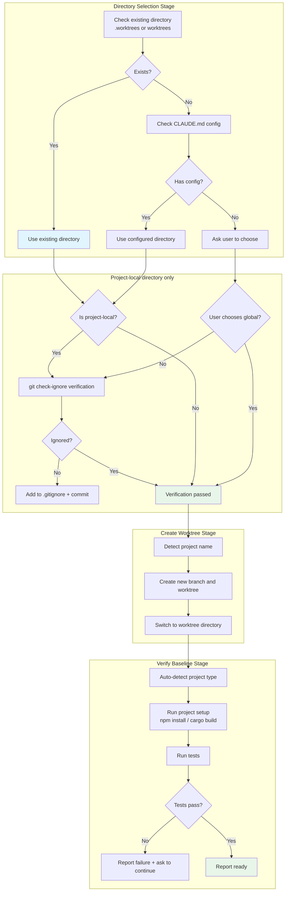

# Git Worktree Isolation

## What You'll Learn

- Create isolated Git worktrees to keep the main branch clean
- Follow directory selection priority to intelligently determine worktree location
- Execute safety verification to prevent accidental commits of worktree content
- Automatically detect and run project setup (npm install, cargo build, etc.)
- Verify test baseline to ensure the worktree starts from a clean state

## Your Current Struggles

**Traditional branch switching loses current work**

Have you encountered this situation? Developing a feature on the main branch, suddenly need to fix an urgent bug, but before switching branches you need to:

- Either commit unfinished code (pollutes commit history)
- Or use `git stash` (easy to forget to restore or overwrite)
- Or abandon current work (progress lost)

Worse, when developing multiple features in parallel, you need to frequently switch between different branches, re-setting up the environment and recompiling each time.

Common problems:
- ❌ Main branch polluted by unfinished work
- ❌ `git stash` causes code loss or overwrites
- ❌ Frequent branch switching wastes time re-setting up environment
- ❌ Context confusion when working on multiple features simultaneously

These problems lead to: low development efficiency, unstable code quality, difficulty tracking work progress.

**Core problem**: Lack of systematic environment isolation mechanism.

::: info What are Git worktrees?

Git worktrees allow you to create multiple independent working directories within the same repository, each associated with a different branch.

Core benefits:
1. **Work on multiple branches simultaneously**: No branch switching needed, multiple worktrees in parallel
2. **Share the same repository**: All worktrees share the .git directory, saving space
3. **Independent working environments**: Each worktree has independent files and uncommitted changes

Use cases:
- Developing multiple features simultaneously
- Switching work when urgent bug fixes are needed
- Need to isolate development environments to avoid polluting the main branch

::

## When to Use This Approach

The Git worktrees skill applies to these scenarios:

| Condition | Description |
| ---- | ---- |
| **Design approved** | Design document already created through `brainstorming` skill |
| **Need isolated environment** | Feature development needs to be done in an independent workspace |
| **Before execution** | Before starting `subagent-driven-development` or `executing-plans` |

::: tip Workflow Integration Point

In Superpowers' complete development workflow, `using-git-worktrees` is called in the following stages:

1. **brainstorming** (Phase 4) - After design approval, before implementation
2. **subagent-driven-development** - Before executing any task
3. **executing-plans** - Before executing any task

Core principle: **Create a worktree before any feature work requiring isolation begins**.
::

::: warning Essential Prerequisites

Before using the Git worktrees skill, you must:
1. ✅ Have a Git repository
2. ✅ Git version supports worktree (2.5+)
3. ✅ Have permission to create new branches
4. ✅ Have approved design document (if applicable)

::

## Core Approach

The core flow of the Git worktrees skill is divided into four stages: directory selection, safety verification, creating worktree, and verifying baseline:



### Directory Selection Priority

The skill follows strict directory selection priority to ensure consistency and reliability:

1. **Check existing directories** (highest priority)
   - Check `.worktrees/` (hidden directory, recommended)
   - Check `worktrees/` (visible directory)
   - If both exist, `.worktrees/` takes priority

2. **Check CLAUDE.md configuration**
   - Search for `worktree.*director` configuration
   - If user explicitly specified, use directly (don't ask)

3. **Ask user**
   - If no existing directory and no configuration
   - Provide two options for user to choose

### Safety Verification Mechanism

For project-local directories (`.worktrees/` or `worktrees/`), **must verify the directory is ignored by Git**.

**Why important**:
- If the worktree directory is not ignored, Git will attempt to track its contents
- This causes `git status` to show large amounts of unrelated files
- May accidentally commit worktree content to the repository

**Verification method**:
```bash
git check-ignore -q .worktrees 2>/dev/null || git check-ignore -q worktrees 2>/dev/null
```

**If not ignored**:
1. Immediately add to `.gitignore`
2. Commit changes (follow "fix broken things immediately" principle)
3. Only then create the worktree

### Automated Project Setup

After creating the worktree, the skill automatically detects the project type and runs the appropriate setup commands:

| Project Type | Detection File | Setup Command |
| -------- | -------- | -------- |
| Node.js | `package.json` | `npm install` |
| Rust | `Cargo.toml` | `cargo build` |
| Python | `requirements.txt` | `pip install -r requirements.txt` |
| Python (Poetry) | `pyproject.toml` | `poetry install` |
| Go | `go.mod` | `go mod download` |

### Test Baseline Verification

The worktree must start from a clean test baseline to distinguish new bugs from pre-existing issues.

**Verification process**:
1. Automatically run project test command
2. Check test results
3. If tests fail, report failure information
4. Ask user whether to continue (don't auto-decide)

## Follow Along

### Step 1: Preparation - Confirm Skill Trigger

**Why**
Confirm that the AI agent has correctly loaded the `using-git-worktrees` skill.

**Operation Example**

```
You: Help me implement user authentication feature.

AI Agent: I will use the using-git-worktrees skill to set up an isolated workspace.
```

**You should see**: AI agent declares it's using this skill.

### Step 2: Directory Selection - Check Existing Directory

**Why**
Prioritize using existing directories to maintain project consistency.

**Operation Example**

```
AI Agent: [Checking .worktrees/ - exists]
[Verifying .worktrees/ is ignored]
```

**If directory exists**:
- Use the directory directly
- Skip asking环节

**If directory doesn't exist**:
- Proceed to Step 3

**Check command** (internal execution):
```bash
ls -d .worktrees 2>/dev/null    # Priority
ls -d worktrees 2>/dev/null     # Alternative
```

### Step 3: Directory Selection - Check CLAUDE.md Configuration

**Why**
Respect user configuration preferences to reduce unnecessary questions.

**Operation Example**

```
AI Agent: [Checking worktree config in CLAUDE.md]
```

**Check command** (internal execution):
```bash
grep -i "worktree.*director" CLAUDE.md 2>/dev/null
```

**If configuration found**:
- Use configured directory (don't ask)

**If configuration not found**:
- Proceed to Step 4, ask user

### Step 4: Directory Selection - Ask User

**Why**
Give users choice to accommodate different project needs.

**Operation Example**

```
AI Agent:
No worktree directory found. Where should I create the worktree?

1. .worktrees/ (project-local, hidden)
2. ~/.config/superpowers/worktrees/<project-name>/ (global location)

Which do you prefer?
```

**You should see**: Two options with explanation of pros and cons.

**Option comparison**:

| Option | Location | Pros | Cons |
| ---- | ---- | ---- | ---- |
| `.worktrees/` | Project root directory (hidden) | Project self-contained, easy to manage | May be tracked by version control (needs .gitignore) |
| `~/.config/superpowers/worktrees/` | Global config directory | Completely independent, won't pollute project | Harder to access across projects |

**User response example**:

```
You: Use .worktrees/
```

### Step 5: Safety Verification - Check if Directory is Ignored

**Why**
Prevent worktree content from being accidentally committed to the repository.

**Operation Example**

```
AI Agent: [Executing git check-ignore -q .worktrees]
```

**Check command** (internal execution):
```bash
git check-ignore -q .worktrees 2>/dev/null
```

**If ignored**:
- Verification passed, proceed to Step 6

**If not ignored**:
- Proceed to Step 6's fix process

**Verification success example**:
```
AI Agent: .worktrees/ is ignored, safety verification passed.
```

**Verification failure example**:
```
AI Agent: ⚠️ Warning: .worktrees/ is not ignored!
Fixing...
```

::: warning Checkpoint

Safety verification must pass before creating a worktree!

- [ ] Directory confirmed ignored by `git check-ignore`
- [ ] If not ignored, added to .gitignore
- [ ] Fix commit completed

::

### Step 6: Safety Verification - Fix Unignored Directory

**Why**
Follow "fix broken things immediately" principle to ensure worktree safety.

**Operation Example**

```
AI Agent:
Adding .worktrees/ to .gitignore...

[Editing .gitignore file]
[Adding line: .worktrees/]

[Committing fix]
git add .gitignore
git commit -m "fix: add .worktrees/ to gitignore for worktree isolation"
```

**You should see**:
- .gitignore file updated
- Commit created

**Verification after fix**:
```
AI Agent: [Re-executing git check-ignore -q .worktrees]
✅ Verification passed, directory is ignored.
```

::: danger Never Skip Safety Verification

If the directory is not ignored, you **must** fix it before creating the worktree.

- ❌ Wrong: Create worktree directly, ignore warning
- ❌ Wrong: Add to .gitignore after creating (existing content will be tracked)
- ✅ Correct: Add to .gitignore first, commit, then create worktree

::

### Step 7: Create Worktree - Detect Project Name

**Why**
Automatically get project name to avoid manual input errors.

**Operation Example**

```
AI Agent: [Detecting project name]
```

**Detection command** (internal execution):
```bash
project=$(basename "$(git rev-parse --show-toplevel)")
```

**Example output**:
```
AI Agent: Project name: superpowers
```

### Step 8: Create Worktree - Create New Branch and Worktree

**Why**
Create worktree on a new branch to keep the main branch clean.

**Operation Example**

```
AI Agent:
Creating worktree and branch...

Branch name: feature/auth
Worktree path: .worktrees/auth
```

**Create command** (internal execution):
```bash
# Project-local directory
git worktree add ".worktrees/auth" -b "feature/auth"

# Global directory
git worktree add "~/.config/superpowers/worktrees/superpowers/auth" -b "feature/auth"
```

**You should see**:
```
AI Agent:
✅ Worktree created: .worktrees/auth
✅ New branch created: feature/auth
```

::: tip Branch Naming Convention

Recommend using meaningful branch names:
- `feature/<feature-name>` - New feature
- `fix/<bug-name>` - Bug fix
- `refactor/<component>` - Refactoring
- `test/<test-name>` - Test

::

### Step 9: Switch to Worktree Directory

**Why**
All subsequent operations will be performed in the worktree.

**Operation Example**

```
AI Agent: [Switching to worktree directory]
cd .worktrees/auth
```

**Current directory**:
- Original main directory: `/path/to/project/`
- New worktree: `/path/to/project/.worktrees/auth/`

### Step 10: Project Setup - Auto-Detect and Run

**Why**
Ensure the worktree has complete dependencies and build artifacts.

**Operation Example**

```
AI Agent: [Detecting project type]
[Found package.json, detected as Node.js project]

[Running npm install]
npm install
```

**You should see**:
```
AI Agent:
✅ Detected Node.js project
✅ Running npm install...
npm WARN deprecated package...
added 142 packages in 12s
✅ Project setup complete
```

**Setup examples for different project types**:

| Project Type | Setup Command | Output Example |
| -------- | -------- | -------- |
| Node.js | `npm install` | `added 142 packages in 12s` |
| Rust | `cargo build` | `Compiling project... Finished dev [unoptimized]` |
| Python (requirements.txt) | `pip install -r requirements.txt` | `Successfully installed requests-2.31.0` |
| Python (Poetry) | `poetry install` | `Installing dependencies from lock file` |
| Go | `go mod download` | `go: downloading github.com/...` |

### Step 11: Verify Baseline - Run Tests

**Why**
Ensure the worktree starts from a clean test state.

**Operation Example**

```
AI Agent: [Running tests to verify baseline]
npm test
```

**You should see**:
```
AI Agent:
✅ Verifying test baseline...
npm test

  PASS  src/utils.test.js
    ✓ testAddition()
    ✓ testSubtraction()
    ✓ testMultiplication()

Test Suites: 1 passed, 1 total
Tests:       3 passed, 3 total
```

**Tests passing example**:
```
AI Agent:
✅ Test baseline verification passed
Tests passing: 3 tests, 0 failures
Worktree ready, can start implementing feature
```

**Tests failing example**:
```
AI Agent:
❌ Test baseline verification failed
Tests passing: 2 tests, 1 failure
Failure: testDivision() - expected 2, got 2.0000001

Continue implementing feature? (Unclean baseline may make it hard to distinguish new bugs from pre-existing issues)
```

::: warning Checkpoint

Test baseline verification must report:
- [ ] Number of tests passing
- [ ] Number of tests failing (if any)
- [ ] Specific failure information (if any)
- [ ] Ask whether to continue (if tests fail)

If tests fail, **don't** auto-decide whether to continue, **must** ask user.
::

### Step 12: Report Worktree Ready

**Why**
Clearly inform user that the worktree is ready for implementation.

**Operation Example**

```
AI Agent:
🎉 Worktree is ready!

📍 Worktree location: /Users/jesse/superpowers/.worktrees/auth
🌿 Branch name: feature/auth
✅ Test baseline: 3 tests, 0 failures

Can start implementing: User authentication feature
```

**You should see**:
- Worktree full path
- Branch name
- Test baseline status
- Ready confirmation

## Checkpoint ✅

**Verify Git worktrees skill execution is complete**

- [ ] AI agent declares using `using-git-worktrees` skill
- [ ] Checked existing directory (`.worktrees/` or `worktrees/`)
- [ ] Checked CLAUDE.md configuration (if no existing directory)
- [ ] Asked user to choose (if no existing directory and configuration)
- [ ] Executed `git check-ignore` to verify directory is ignored
- [ ] If not ignored, added to .gitignore and committed
- [ ] Detected project name
- [ ] Created new branch and worktree
- [ ] Switched to worktree directory
- [ ] Auto-detected and ran project setup
- [ ] Ran tests to verify baseline
- [ ] Reported worktree location, branch, test status
- [ ] If tests failed, asked whether to continue

If any of the above doesn't match, the flow is incomplete and needs supplementation.

## Common Pitfalls

### ❌ Pitfall 1: Skip .gitignore Verification

**Symptom**: Create worktree directly without checking if directory is ignored.

**Problem**:
- Worktree content tracked by Git
- `git status` shows large amounts of unrelated files
- May accidentally commit worktree content

**Solution**:
- Before creating worktree, must execute `git check-ignore`
- If not ignored, immediately add to .gitignore and commit
- Only then create worktree

### ❌ Pitfall 2: Assume Directory Location

**Symptom**: Use `.worktrees/` or `worktrees/` directly without checking existing directories and configuration.

**Problem**:
- Violates project conventions
- Creates inconsistent worktree structure
- User needs manual fix

**Solution**:
- Follow priority: existing directory > CLAUDE.md configuration > ask user
- Don't assume user preference
- Maintain consistency

### ❌ Pitfall 3: Auto-Continue When Tests Fail

**Symptom**: Test baseline fails, AI agent continues implementing feature directly.

**Problem**:
- Can't distinguish new bugs from pre-existing issues
- May incorrectly attribute pre-existing issues to new code
- Difficult to debug

**Solution**:
- When tests fail, report failure information
- Ask user whether to continue
- Don't auto-decide

### ❌ Pitfall 4: Hardcode Project Setup Commands

**Symptom**: Always run `npm install`, don't detect project type.

**Problem**:
- Non-Node.js projects can't be set up correctly
- May run wrong commands
- Incomplete environment

**Solution**:
- Auto-detect project type (package.json, Cargo.toml, etc.)
- Run appropriate commands based on detected type
- Support multiple project types

### ❌ Pitfall 5: Create Worktree on Main Branch

**Symptom**: Create worktree on `main` or `master` branch.

**Problem**:
- Violates best practices
- Main branch may be polluted
- Violates "fix broken things immediately" principle

**Solution**:
- Create new branch (e.g., `feature/<name>`)
- Create worktree on new branch
- Keep main branch clean

### ❌ Pitfall 6: Forget to Switch to Worktree Directory

**Symptom**: After creating worktree, still operating in main directory.

**Problem**:
- Modifications in wrong location
- Worktree not used
- Environment isolation fails

**Solution**:
- After creating worktree, immediately `cd` to worktree directory
- All subsequent operations in worktree
- Confirm current directory

### ❌ Pitfall 7: Ignore Test Baseline Verification

**Symptom**: Skip test baseline verification, start implementing directly.

**Problem**:
- Can't verify worktree is clean
- Hard to trace issue sources
- May hide existing bugs

**Solution**:
- After creating worktree, must run tests
- Verify test baseline
- Report test results

## Red Flags - Must Avoid

The following behaviors will cause the Git worktrees skill to fail:

**Absolutely Forbidden**:
- ❌ Create project-local worktree without verifying .gitignore
- ❌ Auto-continue implementation when test baseline fails
- ❌ Assume directory location (don't check existing directories and configuration)
- ❌ Hardcode project setup commands (don't detect project type)
- ❌ Create worktree on main or master branch
- ❌ Don't switch to worktree directory after creating
- ❌ Skip test baseline verification
- ❌ Don't report specific failure information when tests fail
- ❌ Don't ask whether to continue when tests fail
- ❌ Don't commit fix after adding to .gitignore

**Always Must**:
- ✅ Follow directory selection priority: existing > CLAUDE.md > ask
- ✅ Verify project-local directory is ignored
- ✅ If not ignored, fix immediately and commit
- ✅ Auto-detect project type and run appropriate setup commands
- ✅ Create worktree on new branch
- ✅ Switch to worktree directory
- ✅ Run tests to verify baseline
- ✅ Report specific information when tests fail
- ✅ Ask whether to continue when tests fail
- ✅ Report worktree location, branch, test status

## Worktree Cleanup

After completing feature development, use the `finishing-a-development-branch` skill for cleanup:

::: info Related Skill

**finishing-a-development-branch** - After all tasks complete, use this skill:
- Verify tests pass
- Present options (merge/PR/keep/discard)
- Clean up worktree

::

**Cleanup command example**:
```bash
# Delete worktree (if not needed)
git worktree remove .worktrees/auth

# Or keep worktree for further work
# Don't execute delete command
```

## Git Worktrees vs. Traditional Branch Switching

| Dimension | Git Worktrees | Traditional Branch Switching |
| ---- | ------------ | ------------ |
| **Parallel work** | ✅ Work on multiple branches simultaneously | ❌ Must switch branches |
| **Context preservation** | ✅ Each worktree preserves context independently | ❌ Branch switching requires stash or commit |
| **Environment isolation** | ✅ Independent environment per worktree | ❌ Share same environment |
| **Space usage** | ✅ Share .git directory, save space | ❌ Not applicable |
| **Setup time** | ✅ Only need to create once | ❌ Need to re-setup every switch |
| **Learning curve** | ⚠️ Need to understand worktree concept | ✅ Simple and intuitive |

## Chapter Summary

The Git worktrees skill achieves environment isolation and development efficiency improvement through these mechanisms:

1. **Intelligent directory selection**: Follow priority (existing > CLAUDE.md > ask), ensure consistency
2. **Safety verification mechanism**: Force check .gitignore to prevent accidental commits of worktree content
3. **Automated project setup**: Auto-detect project type and run appropriate commands
4. **Test baseline verification**: Ensure worktree starts from clean state for easier issue tracking
5. **Clear reporting**: Report worktree location, branch, test status for user confirmation

**Remember**: Git worktrees apply to scenarios requiring feature development in isolated environments. Before creating a worktree, must verify directory is ignored and verify test baseline. After development completion, use **[finishing-a-development-branch](../branch-completion/)** skill for cleanup and merging.

## Next Lesson Preview

> In the next lesson, we'll learn **[Parallel Agent Scheduling](../parallel-agents/)**.
>
> You'll learn:
> - How to dispatch multiple sub-agents simultaneously for independent tasks
> - Applicable scenarios and limitations of concurrent scheduling
> - How to manage progress and results of concurrent tasks
> - Avoiding concurrent conflicts and dependency issues

---

## Appendix: Source Code Reference

<details>
<summary><strong>Click to expand source code locations</strong></summary>

> Last updated: 2026-02-01

| Feature | File Path | Line Numbers |
| ----------- | --------------------------------------------------------------------------------------------- | ------- |
| Git worktrees skill | [`skills/using-git-worktrees/SKILL.md`](https://github.com/obra/superpowers/blob/main/skills/using-git-worktrees/SKILL.md) | 1-219   |
| Workflow overview | [`README.md`](https://github.com/obra/superpowers/blob/main/README.md) | 80-96   |

**Core Principles**:
- Systematic directory selection + safety verification = reliable isolation
- Start by declaring: "I'm using the using-git-worktrees skill to set up an isolated workspace."

**Directory Selection Priority** (source lines 16-49):
1. Check existing directory (`.worktrees/` > `worktrees/`)
2. Check CLAUDE.md configuration
3. Ask user (if no existing directory and configuration)

**Safety Verification** (source lines 51-73):
- Project-local directory: Must execute `git check-ignore -q .worktrees` or `git check-ignore -q worktrees`
- If not ignored: Add to .gitignore + commit (follow Jesse's "fix immediately" principle)
- Global directory: No .gitignore verification needed (completely outside project)

**Creation Steps** (source lines 75-142):
1. Detect project name: `project=$(basename "$(git rev-parse --show-toplevel)")`
2. Create worktree: `git worktree add "$path" -b "$BRANCH_NAME"`
3. Switch to worktree: `cd "$path"`
4. Auto-detect and run project setup (supports Node.js, Rust, Python, Go)
5. Verify test baseline (run project test command)
6. Report location and test status

**Supported Project Types** (source lines 101-117):
| Project Type | Detection File | Setup Command |
| -------- | -------- | -------- |
| Node.js | `package.json` | `npm install` |
| Rust | `Cargo.toml` | `cargo build` |
| Python (requirements.txt) | `requirements.txt` | `pip install -r requirements.txt` |
| Python (Poetry) | `pyproject.toml` | `poetry install` |
| Go | `go.mod` | `go mod download` |

**Common Errors** (source lines 156-177):
- Skip ignore verification
- Assume directory location
- Continue when tests fail
- Hardcode setup commands

**Red Flags** (source lines 194-207):
**Never**:
- Create project-local worktree without verifying if ignored
- Skip baseline test verification
- Don't ask whether to continue when tests fail
- Assume location when directory location is unclear
- Skip CLAUDE.md check

**Always**:
- Follow directory priority: existing > CLAUDE.md > ask
- Verify project-local directory is ignored
- Auto-detect and run project setup
- Verify clean test baseline

**Integration** (source lines 209-218):
**Called by**:
- **brainstorming** (Phase 4) - REQUIRED (before implementation after design approval)
- **subagent-driven-development** - REQUIRED (before executing any task)
- **executing-plans** - REQUIRED (before executing any task)
- Any skill requiring isolated workspace

**Pairs with**:
- **finishing-a-development-branch** - REQUIRED (cleanup after work completion)

**Example Workflow** (source lines 178-192):
```
You: I'm using the using-git-worktrees skill to set up an isolated workspace.

[Check .worktrees/ - exists]
[Verify ignored - git check-ignore confirms .worktrees/ is ignored]
[Create worktree: git worktree add .worktrees/auth -b feature/auth]
[Run npm install]
[Run npm test - 47 passing]

Worktree ready at /Users/jesse/myproject/.worktrees/auth
Tests passing (47 tests, 0 failures)
Ready to implement auth feature
```

**Quick Reference Table** (source lines 144-154):
| Situation | Action |
|-----------|--------|
| `.worktrees/` exists | Use it (verify ignored) |
| `worktrees/` exists | Use it (verify ignored) |
| Both exist | Use `.worktrees/` |
| Neither exists | Check CLAUDE.md → Ask user |
| Directory not ignored | Add to .gitignore + commit |
| Tests fail during baseline | Report failures + ask |
| No package.json/Cargo.toml | Skip dependency install |

</details>
