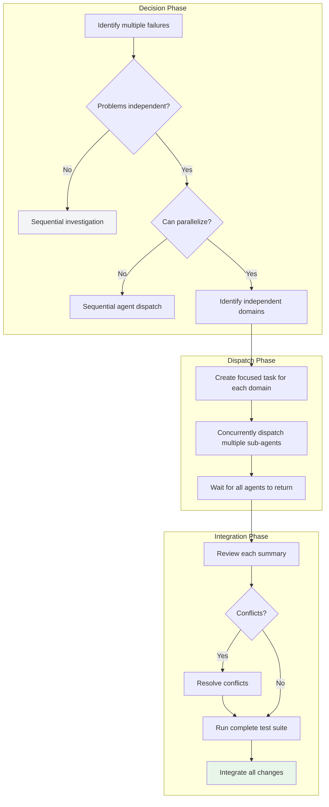

# Parallel Agent Dispatch: Multi-Task Parallel Speedup

## What You'll Learn

By the end of this chapter, you will:
- Determine when to use parallel agent dispatch vs. sequential investigation
- Identify independent failure domains to avoid task confusion
- Create focused agent tasks for efficient execution
- Dispatch multiple sub-agents concurrently to handle multiple problems simultaneously
- Review and integrate all agent fixes to ensure no conflicts

## Your Current Struggles

**AI agents are inefficient when processing multiple independent problems sequentially**

Have you encountered this situation? You have 6 test failures distributed across 3 files, and you ask the AI agent to fix them one by one, spending a lot of time, but these problems are actually independent and can be handled simultaneously.

Common issues:
- ❌ Multiple test failures, AI fixes them sequentially one by one
- ❌ Different subsystems have problems but are treated as one big issue
- ❌ AI context confusion, fixing one problem breaks another
- ❌ Time wasted on sequential processing of things that could be parallelized

These issues lead to: long debugging cycles, low efficiency, and unstable fix quality.

**Core problem**: Lacks the ability to identify independent problems and dispatch them concurrently.

::: info What is Parallel Agent Dispatch?

Parallel agent dispatch is an advanced workflow where, when facing multiple independent problems, you dispatch a sub-agent for each independent problem domain, allowing them to work simultaneously for significant efficiency improvement.

Core principles:
1. **Independent domain identification**: Determine if problems can be processed in parallel
2. **One agent per domain**: Avoid context confusion
3. **Concurrent execution**: Solve multiple problems simultaneously
4. **Review and integration**: Ensure fixes have no conflicts

:::

## When to Use This Approach

Parallel agent dispatch is suitable for the following scenarios:

| Condition | Description |
| --------- | ----------- |
| **3+ independent failures** | Multiple test files failing with different root causes |
| **Multiple subsystem issues** | Different modules independently broken, no correlation |
| **No shared state** | Fixing one doesn't affect another |
| **Parallel comprehensible** | Each problem can be understood without context from other problems |

::: tip vs. Sequential Investigation

| Dimension | Parallel Agent Dispatch | Sequential Investigation |
| --------- | ----------------------- | ------------------------ |
| **Execution** | Multiple agents work simultaneously | One agent processes sequentially |
| **Time cost** | Linearly reduced (3 problems ≈ 1 problem time) | Linearly increased (3 problems ≈ 3 problems time) |
| **Context** | Each agent focuses on one domain | Agent needs to track multiple contexts |
| **Conflict risk** | Needs post-check | Lower (sequential modifications) |
| **Applicable scenarios** | Independent problems, parallel-safe | Related problems, requires global understanding |

:::

::: warning When NOT to Use

The following scenarios are **NOT suitable** for parallel agent dispatch:
- ❌ Failures are related (fixing one might fix others)
- ❌ Need to understand complete system state
- ❌ Exploratory debugging (you don't know what's broken)
- ❌ Agents will interfere with each other (editing same files, using same resources)

:::

## Core Concept

The parallel agent dispatch process consists of decision phase, dispatch phase, and integration phase:



### Identify Independent Domains

How to determine if problems are independent? Group by "what's broken":

**Example**: 6 test failures distributed across 3 files

| File | Failures | Issue Description | Independent Domain |
| ---- | -------- | ----------------- | ------------------ |
| agent-tool-abort.test.ts | 3 | Abort timing issues | Abort logic |
| batch-completion-behavior.test.ts | 2 | Tools not executed | Batch completion |
| tool-approval-race-conditions.test.ts | 1 | Execution count is 0 | Race condition |

These three domains are independent—fixing abort logic won't affect batch completion or race condition tests.

### Create Focused Agent Tasks

Each agent task must:

1. **Focused**: A clear problem domain (one test file or subsystem)
2. **Self-contained**: All context needed to understand the problem
3. **Clear constraints**: Cannot modify other code
4. **Specific output**: Returns summary of what was discovered and fixed

## Follow Along

### Step 1: Identify Independent Domains

**Why**

Determine if problems can be processed in parallel to avoid wasting resources.

**Operation Example**

Suppose you have the following test failures:

```bash
npm test

# FAIL 1/6: agent-tool-abort.test.ts:45
#   "should abort tool with partial output capture"
#   AssertionError: expected 'interrupted at' in message

# FAIL 2/6: agent-tool-abort.test.ts:78
#   "should handle mixed completed and aborted tools"
#   AssertionError: fast tool aborted instead of completed

# FAIL 3/6: agent-tool-abort.test.ts:102
#   "should properly track pendingToolCount"
#   AssertionError: expected 3 results but got 0

# FAIL 4/6: batch-completion-behavior.test.ts:23
#   "should execute all tools in batch"
#   AssertionError: only 2/5 tools executed

# FAIL 5/6: batch-completion-behavior.test.ts:56
#   "should update batch status after completion"
#   AssertionError: status stuck at 'executing'

# FAIL 6/6: tool-approval-race-conditions.test.ts:12
#   "should track tool execution count"
#   AssertionError: expected 3 but got 0
```

**Analyze Independence**:

```markdown
Problem Domain Analysis:

1. agent-tool-abort.test.ts (3 failures)
   - Issue: Abort timing, counter errors
   - Independence: ✅ Only involves abort logic

2. batch-completion-behavior.test.ts (2 failures)
   - Issue: Tools not executed, status stuck
   - Independence: ✅ Only involves batch completion logic

3. tool-approval-race-conditions.test.ts (1 failure)
   - Issue: Execution count is 0
   - Independence: ✅ Only involves race condition

Conclusion: Three domains completely independent, can be processed concurrently
```

**You should see**: Problems clearly grouped into different independent domains.

### Step 2: Create Focused Agent Tasks

**Why**

Each agent needs a clear task to avoid getting lost due to too broad a scope.

**Operation Example**

**Domain 1: agent-tool-abort.test.ts**

```markdown
Fix the 3 failing tests in agent-tool-abort.test.ts:

1. "should abort tool with partial output capture"
   - Error: Expected message to contain 'interrupted at'
   - Actual: Message doesn't have this marker

2. "should handle mixed completed and aborted tools"
   - Error: Fast tool was aborted instead of completed
   - Actual: Should be completed but marked as aborted

3. "should properly track pendingToolCount"
   - Error: Expected 3 results, got 0
   - Actual: Counter logic has issue

These are timing/race condition issues. Your task:

1. Read the test file, understand what each test validates
2. Identify root cause—is it a timing issue or actual bug?
3. Fix approach:
   - Replace arbitrary timeouts with event-based waiting
   - If bug found in abort implementation, fix it
   - If behavior changed, adjust test expectations

Don't just increase timeouts—find the real problem.

Return: Summary of what you discovered and fixed.
```

**Domain 2: batch-completion-behavior.test.ts**

```markdown
Fix the 2 failing tests in batch-completion-behavior.test.ts:

1. "should execute all tools in batch"
   - Error: Only 2/5 tools executed
   - Actual: Tool list incorrectly modified in loop

2. "should update batch status after completion"
   - Error: Status stuck at 'executing'
   - Actual: Status not updated after completion

Your task:

1. Read the test file, understand batch completion logic
2. Identify why tool list is being modified
3. Fix status update issue
4. Ensure status correctly updated after batch completion

Return: Summary of what you discovered and fixed.
```

**Domain 3: tool-approval-race-conditions.test.ts**

```markdown
Fix the failing test in tool-approval-race-conditions.test.ts:

1. "should track tool execution count"
   - Error: Expected 3, got 0
   - Actual: Counter read before async tool completes

Your task:

1. Read the test file, understand race condition scenario
2. Add wait to ensure async tools complete before reading count
3. Ensure test correctly validates execution count

Return: Summary of what you discovered and fixed.
```

**You should see**: Each task is focused on one independent domain with clear context and constraints.

### Step 3: Concurrently Dispatch Multiple Sub-Agents

**Why**

Let multiple agents work simultaneously to significantly improve efficiency.

**Operation Example**

```markdown
[In AI environment, concurrently dispatch 3 sub-agents]

Task 1: Fix agent-tool-abort.test.ts failures
Task 2: Fix batch-completion-behavior.test.ts failures
Task 3: Fix tool-approval-race-conditions.test.ts failures

# All three tasks run concurrently
```

**You should see**: Three agents start working simultaneously.

### Step 4: Wait for All Agents to Return

**Why**

Give each agent enough time to complete tasks, don't interrupt too early.

**Operation Example**

```
[Wait for agent 1 to return]
[Wait for agent 2 to return]
[Wait for agent 3 to return]

All agents completed
```

**Example Return Results**:

**Agent 1 Returns**:

```markdown
Summary:

Root causes discovered:
1. "should abort tool with partial output capture"
   - Abort signal sent before partial output capture
   - Fix: Adjust abort timing, send signal after output capture

2. "should handle mixed completed and aborted tools"
   - Fast tool timeout set to 100ms, too short
   - Fix: Adjust timeout to 500ms, change to event-based waiting

3. "should properly track pendingToolCount"
   - Counter incremented at tool start but decremented before completion/abort
   - Fix: Move decrement logic after completion/abort handling

Fixes:
- src/agents/abort-logic.ts: Adjust abort timing
- src/agents/abort-logic.ts: Replace timeout with event wait
- src/agents/abort-logic.ts: Fix counter decrement logic

Test results: 3/3 passed
```

**Agent 2 Returns**:

```markdown
Summary:

Root causes discovered:
1. "should execute all tools in batch"
   - Used `for...of` to directly iterate tool list in loop
   - Tool objects modified (added `executed: true`) causing iteration to skip
   - Fix: Create shallow copy of tool list for iteration

2. "should update batch status after completion"
   - Batch completion status update in `finally` block
   - But some exceptions swallowed, didn't trigger finally
   - Fix: Move status update to normal flow, ensure always executed

Fixes:
- src/agents/batch-executor.ts: Create tool list copy
- src/agents/batch-executor.ts: Fix status update location

Test results: 2/2 passed
```

**Agent 3 Returns**:

```markdown
Summary:

Root causes discovered:
1. "should track tool execution count"
   - Test reads counter immediately, but tool execution is async
   - Fix: Add `await Promise.all()` to wait for all tools to complete before reading count

Fixes:
- src/agents/tool-approval.ts: Add async wait

Test results: 1/1 passed
```

**You should see**: All agents returned with summaries explaining what problems they found and how they fixed them.

### Step 5: Review Each Summary

**Why**

Understand what each agent modified to ensure fixes are reasonable.

**Operation Example**

**Checklist**:

```markdown
Review agent 1's fix:
- [ ] Modified files: src/agents/abort-logic.ts
- [ ] Modification reasons: Timing issues, timeout settings, counter logic
- [ ] Tests passed: 3/3
- [ ] Modification scope: Only involves abort logic ✅

Review agent 2's fix:
- [ ] Modified files: src/agents/batch-executor.ts
- [ ] Modification reasons: Iteration bug, status update location
- [ ] Tests passed: 2/2
- [ ] Modification scope: Only involves batch completion logic ✅

Review agent 3's fix:
- [ ] Modified files: src/agents/tool-approval.ts
- [ ] Modification reasons: Missing async wait
- [ ] Tests passed: 1/1
- [ ] Modification scope: Only involves tool approval logic ✅
```

**You should see**: All agents' modifications are focused on their respective domains, no cross-boundary changes.

### Step 6: Check for Conflicts

**Why**

Ensure modifications from different agents don't conflict with each other.

**Operation Example**

```markdown
Check conflicts:

Modified files:
1. src/agents/abort-logic.ts (agent 1)
2. src/agents/batch-executor.ts (agent 2)
3. src/agents/tool-approval.ts (agent 3)

Conflict check:
- [ ] Are files duplicated? No ✅
- [ ] Is there overlap in modified logic? No ✅
- [ ] Are there shared dependencies or functions? No ✅

Conclusion: No conflicts, safe to integrate
```

**If Conflicts Exist**:

```markdown
Conflict example:
- Agent 1 modified function A in src/agents/abort-logic.ts
- Agent 2 also modified the same function A

Solution:
1. Manually merge modifications
2. Or dispatch a merge task again
```

**You should see**: Modifications have no conflicts, safe to integrate.

### Step 7: Run Complete Test Suite

**Why**

Verify all fixes work together without introducing new problems.

**Operation Example**

```bash
npm test

# You will see:
# PASS  agent-tool-abort.test.ts (3/3)
# PASS  batch-completion-behavior.test.ts (2/2)
# PASS  tool-approval-race-conditions.test.ts (1/1)
#
# All tests passed! (15/15)
```

**If New Problems**:

```markdown
New problems discovered:
- Other tests start failing
- Possibly fixes introduced side effects

Solution:
1. Identify which fix caused the problem
2. Redispatch that agent with new failure test information
3. Let agent fix side effects
```

**You should see**: All tests pass.

### Step 8: Integrate All Changes

**Why**

Commit all fixes to Git to ensure traceability.

**Operation Example**

```bash
git add src/agents/abort-logic.ts
git add src/agents/batch-executor.ts
git add src/agents/tool-approval.ts

git commit -m "Fix 6 failing tests across 3 files

- Fix abort timing and counter logic (3 tests)
- Fix batch execution iteration bug (2 tests)
- Fix async tool execution count (1 test)

Parallel investigation:
- Agent 1: Fixed agent-tool-abort.test.ts
- Agent 2: Fixed batch-completion-behavior.test.ts
- Agent 3: Fixed tool-approval-race-conditions.test.ts

All fixes independent, no conflicts, full suite green."
```

**You should see**: All fixes committed, commit message clearly records the parallel investigation process.

## Checklist ✅

**Verify parallel agent dispatch workflow completeness**

- [ ] Identified all failures and grouped them into independent domains
- [ ] Determined if problems can be processed in parallel
- [ ] Created focused agent tasks for each domain
- [ ] Concurrently dispatched multiple sub-agents
- [ ] Waited for all agents to return
- [ ] Reviewed each agent's summary
- [ ] Checked if modifications have conflicts
- [ ] Ran complete test suite to verify all fixes
- [ ] Integrated all modifications and committed

If any item above doesn't match, the workflow is incomplete and needs to be supplemented.

## Common Pitfalls

### ❌ Pitfall 1: Task Scope Too Broad

**Symptoms**: Tell agent "fix all tests" or "fix all abort logic problems".

**Problems**:
- Agent might lose direction
- Context overload, low efficiency
- Might fix unintended problems

**Solution**:
- Specify test file explicitly
- List specific failing tests
- Provide error messages and test names

**Comparison**:

| ❌ Wrong | ✅ Correct |
| -------- | --------- |
| "Fix all tests" | "Fix agent-tool-abort.test.ts" |
| "Fix race condition" | "Fix execution count issue in tool-approval-race-conditions.test.ts" |

### ❌ Pitfall 2: No Context Provided

**Symptoms**: Tell agent "fix race condition" without providing error information or test names.

**Problems**:
- Agent doesn't know where to look for the problem
- Might fix wrong place
- Increases debugging time

**Solution**:
- Provide complete error messages
- List failing test names
- Describe expected vs. actual behavior

**Comparison**:

| ❌ Wrong | ✅ Correct |
| -------- | --------- |
| "Fix race condition" | "Fix execution count issue in tool-approval-race-conditions.test.ts: expected 3, got 0" |

### ❌ Pitfall 3: No Constraints

**Symptoms**: Agent might refactor entire module or modify production code.

**Problems**:
- Scope creep, introduces new problems
- Violates focus principle
- Increases integration complexity

**Solution**:
- Clear constraints: "Don't modify production code" or "Only fix tests"
- Limit modification scope: "Only involves this file"
- Clear boundaries: "Don't modify other related code"

**Comparison**:

| ❌ Wrong | ✅ Correct |
| -------- | --------- |
| "Fix tests" | "Only fix tests, don't modify production code" |
| "Fix abort issue" | "Only modify src/agents/abort-logic.ts, don't touch other files" |

### ❌ Pitfall 4: Vague Output

**Symptoms**: Agent reports "Fixed" but doesn't explain what was changed.

**Problems**:
- You don't know what the agent modified
- Cannot verify if fixes are reasonable
- Increases review cost

**Solution**:
- Require clear output format: "Return summary"
- Specify content requirements: "Explain discovered problems, modified files, test results"
- Require evidence: "Provide screenshot of passing tests"

**Comparison**:

| ❌ Wrong | ✅ Correct |
| -------- | --------- |
| "Fix it" | "Return summary: what you discovered and fixed" |

### ❌ Pitfall 5: Using Parallel Dispatch on Related Problems

**Symptoms**: Multiple tests fail but share a root cause, still dispatch multiple agents.

**Problems**:
- Duplicate investigation of same problem
- Fixes might conflict
- Waste resources

**Solution**:
- Determine if failures are related
- If fixing one might fix others, investigate sequentially
- Understand root cause first, then decide if concurrent

**Example**:

```markdown
Related failures:
- test 1: Expected status = 'completed'
- test 2: Expected status = 'completed'
- test 3: Expected status = 'completed'

These failures might share a root cause (status update logic)
→ Sequential investigation, find root cause then fix all together
```

### ❌ Pitfall 6: Skipping Conflict Check

**Symptoms**: Integrate directly after agents return without checking if modifications conflict.

**Problems**:
- Might overwrite each other's modifications
- Tests fail after integration
- Need to re-investigate

**Solution**:
- Check if modified files are duplicated
- Check if modified logic has overlap
- Check if there are shared dependencies or functions
- Manually merge or redispatch if conflicts exist

### ❌ Pitfall 7: Skipping Complete Test Suite

**Symptoms**: Each agent's tests pass, but didn't run complete test suite.

**Problems**:
- Fixes might introduce new problems
- Other related tests might start failing
- Problems discovered only after integration

**Solution**:
- Always run complete test suite
- Ensure no new problems introduced
- If new problems, redispatch related agent

## Red Flags - Must Avoid

The following behaviors will cause parallel agent dispatch to fail:

**Absolutely forbidden**:
- ❌ Dispatch agent tasks with too broad scope
- ❌ Don't provide sufficient context
- ❌ Don't clearly constrain agent behavior
- ❌ Accept vague output
- ❌ Use parallel dispatch on related problems
- ❌ Skip conflict check
- ❌ Skip complete test suite
- ❌ Agent modifies code outside specified scope
- ❌ Agent merges fixes from multiple independent domains

## Parallel Agent Dispatch vs. Other Methods

| Dimension | Parallel Agent Dispatch | Sub-Agent Driven Development | Sequential Investigation |
| --------- | ----------------------- | ---------------------------- | ----------------------- |
| **Applicable scenarios** | Multiple independent failures | Implement multiple independent tasks | Single problem or related problems |
| **Execution** | Concurrently dispatch multiple agents | Sequentially dispatch multiple agents (with review) | One agent handles all |
| **Time cost** | Linearly reduced | Medium (sequential but focused) | Linearly increased |
| **Context** | Each agent focuses on one domain | Each task independent context | Need to track multiple contexts |
| **Review** | Post-review | Two-stage automatic review | No or manual review |
| **Conflict risk** | Needs check | Lower (sequential execution) | Lowest (single agent) |

## Chapter Summary

Parallel agent dispatch achieves efficiency improvement through the following mechanisms:

1. **Independent domain identification**: Determine if problems can be processed in parallel
2. **Focused tasks**: Each agent focuses on one independent domain, avoiding getting lost
3. **Concurrent execution**: Solve multiple problems simultaneously, linearly reduced time cost
4. **Review and integration**: Check conflicts, run complete test suite, ensure safe integration

**Remember**: Parallel agent dispatch is suitable for scenarios with multiple independent failures. If problems are related, you should investigate sequentially to find the root cause first, then decide if concurrent. When using this skill, be sure to check for conflicts and run the complete test suite.

## Next Lesson Preview

> In the next lesson, we'll learn **[Branch Completion Workflow](../branch-completion/)**.
>
> You'll learn:
> - How to complete development branch merges, PRs, or cleanup
> - How to verify tests pass before merging
> - How to choose appropriate branch completion options

---

## Appendix: Source Code Reference

<details>
<summary><strong>Click to expand source code locations</strong></summary>

> Updated: 2026-02-01

| Feature | File Path | Line Range |
| ------- | --------- | ---------- |
| Parallel Agent Dispatch Skill | [`skills/dispatching-parallel-agents/SKILL.md`](https://github.com/obra/superpowers/blob/main/skills/dispatching-parallel-agents/SKILL.md) | 1-181 |
| Workflow Overview | [`README.md`](https://github.com/obra/superpowers/blob/main/README.md) | 80-96 |

**Core Principles**:
- Dispatch one agent per independent problem domain
- Let them work concurrently

**Usage Conditions**:
- 3+ test files failing, different root causes
- Multiple subsystems independently broken
- Each problem can be understood without context from other problems
- No shared state between investigations

**Non-Usage Conditions**:
- Failures are related (fixing one might fix others)
- Need to understand complete system state
- Exploratory debugging (you don't know what's broken)
- Agents will interfere with each other (editing same files, using same resources)

**Pattern** (4 steps):
1. Identify Independent Domains
2. Create Focused Agent Tasks
3. Dispatch in Parallel
4. Review and Integrate

**Agent Prompt Structure**:
1. Focused: A clear problem domain
2. Self-contained: All context needed to understand the problem
3. Specific about output: What should be returned

**Example Workflow** (source lines 131-156):
- Scenario: 6 test failures across 3 files after major refactor
- Failures: agent-tool-abort.test.ts (3), batch-completion-behavior.test.ts (2), tool-approval-race-conditions.test.ts (1)
- Decision: Independent domains (abort logic, batch completion, race conditions)
- Dispatch: 3 agents working concurrently
- Result: All fixes independent, no conflicts, full test suite passes

**Time Savings**: 3 problems solved in parallel vs. sequentially

**Common Errors** (source lines 110-123):
- ❌ Too broad vs ✅ Specific
- ❌ No context vs ✅ Has context
- ❌ No constraints vs ✅ Has constraints
- ❌ Vague output vs ✅ Specific output

**Key Advantages**:
1. Parallelization: Multiple investigations happen simultaneously
2. Focus: Each agent has narrow scope, tracks less context
3. Independence: Agents don't interfere with each other
4. Speed: Solve 3 problems in the time of 1 problem

**Validation** (source lines 165-171):
1. Review each summary: Understand what changed
2. Check for conflicts: Did agents edit same code?
3. Run full suite: Verify all fixes work together
4. Spot check: Agents might make systematic errors

**Real Impact** (source lines 173-180):
- 6 failures across 3 files
- 3 agents dispatched concurrently
- All investigations completed simultaneously
- All fixes successfully integrated
- Zero conflicts between agent modifications

</details>
