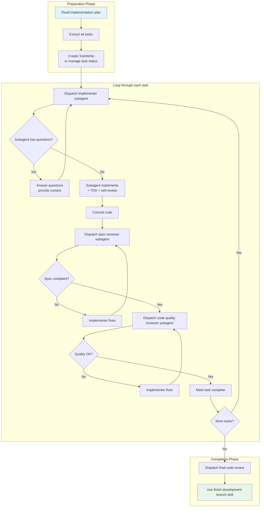

# Subagent-Driven Development

## What You'll Learn

- Rapidly iterate on multiple independent tasks using subagents
- Execute two-stage automatic review (spec compliance + code quality)
- Avoid context pollution and conflicts between subagents
- Automate TDD workflow and code review checkpoints
- Understand when to use subagent-driven development vs. executing plans (parallel sessions)

## Your Current Struggles

**AI agents get confused when handling multiple tasks**

Have you encountered this situation? You tell the AI "help me implement these 5 features," it starts working on the first task, but by the time it reaches the third, it has forgotten the context of the first task, leading to inconsistent or duplicate code.

Common problems:
- ❌ One AI session handling multiple tasks, confused context
- ❌ Missing review stage after task completion, quality not guaranteed
- ❌ Need to switch between multiple sessions, inefficient
- ❌ Code review relies on manual intervention, disjointed workflow

These problems lead to: long development cycles, unstable code quality, heavy manual review burden.

**Core problem**: Lack of systematic task dispatch and automatic review mechanism.

::: info What is subagent-driven development?

Subagent-driven development is an advanced workflow that achieves rapid iteration and high-quality delivery by dispatching new subagents for each independent task and executing two-stage automatic review after each task completion.

Core principles:
1. **Independent subagent per task**: Avoid context pollution
2. **Two-stage review**: Spec compliance review → Code quality review
3. **Automatic checkpoints**: Each task must pass review before completion
4. **Same session**: Controller stays in main session, seamless handoff

:::

## When to Use This

Subagent-driven development applies to these scenarios:

| Condition | Description |
| --------- | ----------- |
| **Have implementation plan** | Already created detailed implementation plan via `writing-plans` skill |
| **Tasks mostly independent** | Tasks in the plan have weak dependencies, can be completed independently |
| **Stay in current session** | Want to complete all tasks in one session, no need to switch sessions |

::: tip vs. Executing Plans (Parallel Sessions)

| Dimension | Subagent-Driven Development | Executing Plans (Parallel Sessions) |
| --------- | --------------------------- | ---------------------------------- |
| **Session switching** | None (same session) | Need to switch to independent sessions |
| **Context** | Managed by controller | Independent context per task |
| **Review** | Automatic two-stage review | Manual or single-stage review |
| **Iteration speed** | Fast (no waiting) | Medium (need to switch) |
| **Use case** | Independent tasks, rapid iteration | Many tasks, batch processing |

If you have many tasks (> 10) or need batch processing, consider using **[executing-plans](../../core-workflows/planning-workflow/)** to execute in independent sessions.
::

::: warning Prerequisites

Before using subagent-driven development, you must:
1. ✅ Created implementation plan (via `writing-plans` skill)
2. ✅ Set up isolated workspace (via `using-git-worktrees` skill)
3. ✅ Configured Git workflow (branches, commit conventions)

::

## Core Concept

The core flow of subagent-driven development is divided into preparation phase, task execution phase, and completion phase:



### Two-Stage Review Mechanism

**Stage 1: Spec Compliance Review**

- Review content: Whether code fully complies with specification
- Check items:
  - Whether all required features are completed
  - Whether unrequested features were added (over-implementation)
  - Whether spec details are missing

**Stage 2: Code Quality Review**

- Review content: Code implementation quality
- Check items:
  - Code structure and readability
  - Test coverage and quality
  - Potential bugs or performance issues
  - Best practices compliance

::: tip Why need two-stage review?

Single-stage review easily misses problems:
- Only looking at code quality: might not discover spec deviations (over or under implementation)
- Only looking at spec compliance: might not discover code quality problems

Two-stage ensures:
- First confirm "did it right" (spec compliant)
- Then confirm "did it well" (code quality)
::

## Follow Along

### Step 1: Preparation - Read Implementation Plan

**Why**
Extract all tasks and context at once to avoid subagents repeatedly reading files.

**Example Operation**

Assume you have the following implementation plan (`docs/plans/feature-plan.md`):

```markdown
## Feature Plan: User Comment System

### Task List

#### Task 1: Hook Installation Script
- Create CLI command for installing hooks
- Support user-level and system-level installation
- Test coverage: 5/5

#### Task 2: Recovery Mode
- Add verify mode (check installation status)
- Add repair mode (fix broken configuration)
- Test coverage: 8/8

#### Task 3: Configuration File Management
- Read ~/.config/superpowers/config.json
- Validate configuration format
- Test coverage: 6/6
```

**Execute in main session**:

```
You: I will use subagent-driven development to execute this plan.

[Read plan file: docs/plans/feature-plan.md]
[Extract complete text and context for all 3 tasks]
[Create task list using TodoWrite]
```

**You should see**: All tasks extracted, TodoWrite created.

### Step 2: Process Task 1 - Dispatch Implementer Subagent

**Why**
Dispatch new subagent for each task to avoid context pollution.

**Example Operation**

```
Task 1: Hook Installation Script

[Get complete text and context for task 1]
[Dispatch implementer subagent, providing complete task text + context]
```

**Prompt format for dispatching subagent** (from source code `implementer-prompt.md`):

```
@subagent

You are the implementer subagent. Your task is:

【Task Description】
Create CLI command for installing hooks
- Support user-level installation: ~/.config/superpowers/hooks/
- Support system-level installation: /etc/superpowers/hooks/

【Context】
- Project located at: /path/to/project
- Existing CLI command structure: lib/commands/
- Hook storage location: ~/.config/superpowers/hooks/

【Requirements】
- Strictly follow TDD (RED-GREEN-REFACTOR)
- Perform self-review before each commit
- Report test results after completion
```

**You should see**: Subagent starts working, may ask questions.

### Step 3: Answer Subagent Questions

**Why**
Subagents may ask questions before starting implementation, providing clear context reduces rework.

**Example Operation**

```
Implementer subagent: "Before starting - should hooks be installed at user level or system level?"

You: "User level (~/.config/superpowers/hooks/)"
```

**Should note**:
- Answer should be clear and complete
- Provide additional context (if subagent needs it)
- Don't rush the subagent to start implementation, resolve all doubts first

### Step 4: Subagent Implementation + TDD + Self-Review

**Why**
Subagent automatically follows TDD workflow and performs self-review before committing.

**Example Operation**

```
Implementer subagent:
"Understood. Now starting implementation..."

[After some time]

Implementer subagent:
- ✅ Implemented install-hook command
- ✅ Added 5 tests, all passing
- ✅ Self-review: found missing --force flag, added it
- ✅ Committed: abc123
```

**You should see**: Subagent reports implementation complete, tests passing, committed.

::: warning Checkpoint
Subagent must report:
- [ ] Implementation complete
- [ ] Tests passing
- [ ] Self-review results
- [ ] Git commit SHA

If any item is missing, ask subagent to supplement.
::

### Step 5: Dispatch Spec Reviewer Subagent

**Why**
Verify code fully complies with specification to prevent over or under implementation.

**Example Operation**

```
[Get Git commit SHA: abc123]
[Dispatch spec reviewer subagent, providing commit SHA and specification]
```

**Prompt format for dispatching spec review** (from source code `spec-reviewer-prompt.md`):

```
@subagent

You are the spec reviewer subagent. Your task is to review whether the following implementation complies with the specification.

【Specification】
Create CLI command for installing hooks
- Support user-level installation: ~/.config/superpowers/hooks/
- Support system-level installation: /etc/superpowers/hooks/

【Git Commit】
SHA: abc123
Repository: /path/to/project

【Review Items】
- Are all required features completed?
- Were unrequested features added?
- Are any spec details missing?

Please provide detailed review report.
```

**You should see**: Spec reviewer subagent provides review results.

**Example review result (pass)**:

```
Spec reviewer subagent:
✅ Spec compliant
- Implemented user-level installation
- Implemented system-level installation
- No extra features added
- No spec details missing
```

**Example review result (fail)**:

```
Spec reviewer subagent:
❌ Issues found:
- Missing: Progress reporting feature (spec requires "report every 100 items processed")
- Extra: Added --json flag (not requested in spec)
```

### Step 6: Handle Spec Review Issues

**Why**
If spec review fails, must let implementer subagent fix issues.

**Example Operation**

**If review fails**:

```
You: [Forward review results to implementer subagent]

Implementer subagent:
"Understood. I'm fixing the issues now..."
[Remove --json flag]
[Add progress reporting feature]
[Re-run tests]
[Re-commit: def456]
```

**If review passes**:
Proceed to next step directly.

::: warning Checkpoint
After implementer subagent fixes, must:
1. Re-dispatch spec reviewer subagent
2. Confirm review passes
3. Only then proceed to code quality review stage

Don't skip re-review!
::

### Step 7: Dispatch Code Quality Reviewer Subagent

**Why**
Verify code implementation quality, including structure, test coverage, potential issues, etc.

**Example Operation**

```
[Get latest Git commit SHA: def456]
[Dispatch code quality reviewer subagent, providing commit SHA]
```

**Prompt format for dispatching code quality review** (from source code `code-quality-reviewer-prompt.md`):

```
@subagent

You are the code quality reviewer subagent. Your task is to review the code quality of the following implementation.

【Git Commit】
SHA: def456
Repository: /path/to/project

【Review Items】
- Code structure and readability
- Test coverage and quality
- Potential bugs or performance issues
- Best practices compliance
- Naming and comments

Please provide detailed review report, marking issue importance (Important/Minor).
```

**You should see**: Code quality reviewer subagent provides review results.

**Example review result (pass)**:

```
Code quality reviewer subagent:
Strengths:
- Good test coverage (5/5)
- Clear code, reasonable structure
- Meaningful variable naming

Issues:
None

Result: ✅ Approved
```

**Example review result (fail)**:

```
Code quality reviewer subagent:
Strengths:
- Good test coverage
- Correct code logic

Issues (Important):
- Magic Number: Progress interval hardcoded as 100, should extract as constant
- Missing error handling: Will crash if directory doesn't exist

Result: ❌ Needs fixing
```

### Step 8: Handle Code Quality Issues

**Why**
After code quality review discovers issues, must let implementer subagent fix them.

**Example Operation**

**If review fails**:

```
You: [Forward review results to implementer subagent]

Implementer subagent:
"Understood. I'm fixing the issues now..."
[Extract PROGRESS_INTERVAL constant]
[Add directory check and error handling]
[Re-run tests]
[Re-commit: ghi789]
```

**If review passes**:
Mark task complete.

**Re-review**:

```
[Re-dispatch code quality reviewer subagent]
[Confirm review passes]
[Mark task complete]
```

::: warning Checkpoint
After implementer subagent fixes, must:
1. Re-dispatch code quality reviewer subagent
2. Confirm review passes
3. Only then mark task complete

Don't skip re-review!
::

### Step 9: Mark Task Complete

**Why**
Mark task complete in TodoWrite, continue to next task.

**Example Operation**

```
You: [Use TodoWrite to mark task 1 complete]
```

**You should see**: TodoWrite shows task 1 completed.

### Step 10: Process Remaining Tasks (Repeat Flow)

**Why**
Repeat the same flow for each task until all tasks complete.

**Example Operation**

```
Task 2: Recovery Mode

[Get complete text and context for task 2]
[Dispatch implementer subagent]
...
[Two-stage review]
...
[Mark task complete]

Task 3: Configuration File Management

[Get complete text and context for task 3]
[Dispatch implementer subagent]
...
[Two-stage review]
...
[Mark task complete]
```

**You should see**: All tasks pass review and complete.

### Step 11: Final Code Review

**Why**
After all tasks complete, perform final review on entire implementation to ensure overall quality.

**Example Operation**

```
[After all tasks complete]
[Dispatch final code review subagent, review entire implementation]
```

**Example result**:

```
Final code review subagent:
All requirements satisfied
- Task 1: ✅ Complete
- Task 2: ✅ Complete
- Task 3: ✅ Complete

Overall quality:
- Test coverage: 19/19
- Clear code structure
- No major issues

Result: ✅ Ready to merge
```

### Step 12: Complete Development Branch

**Why**
Use `finishing-a-development-branch` skill to complete cleanup and merge of development branch.

**Example Operation**

```
You: [Use finishing-a-development-branch skill]

System presents options:
1. Merge to main branch
2. Create Pull Request
3. Keep branch for further work
4. Discard branch
```

**You should see**: Options to merge or create PR.

## Checklist ✅

**Verify subagent-driven development flow is complete**

- [ ] Read and extracted all tasks and context
- [ ] Created TodoWrite to manage task status
- [ ] Dispatched new implementer subagent for each task
- [ ] Implementer subagent followed TDD workflow
- [ ] Implementer subagent performed self-review
- [ ] Each task completed two-stage review (spec + code quality)
- [ ] When spec review failed, implemented fixes and re-reviewed
- [ ] When code quality review failed, implemented fixes and re-reviewed
- [ ] All tasks marked complete in TodoWrite
- [ ] Final code review passed
- [ ] Used finishing-a-development-branch skill to complete branch

If any item above doesn't match, the flow is incomplete and needs supplementation.

## Common Pitfalls

### ❌ Pitfall 1: Letting Subagents Read Plan Files

**Symptom**: Controller tells subagent "go read the plan file, then complete the task."

**Problems**:
- Subagent reading files consumes tokens
- Controller already extracted task text, duplicate work
- Subagent might extract wrong context

**Solution**:
- Controller extracts all tasks and context at once
- Provide complete task text and context when dispatching subagents
- Don't let subagents read any files

### ❌ Pitfall 2: Skipping Review Stages

**Symptom**: To "save time", skip spec review or code quality review.

**Problems**:
- Spec review fails: possible over or under implementation
- Code quality review fails: possible bugs or performance issues
- Problems are more expensive to fix later

**Solution**:
- Two-stage review is mandatory
- Even if you think "no problem", must execute review
- Issues discovered by review must be fixed

### ❌ Pitfall 3: Accepting "Good Enough"

**Symptom**: Spec review discovers minor issues, but you think "acceptable."

**Problems**:
- Minor issues accumulate into major problems
- Violates spec compliance principle
- High maintenance cost later

**Solution**:
- Spec review discovering issues = fail
- Must let implementer subagent fix
- Re-review until passes

### ❌ Pitfall 4: Skipping Re-Review

**Symptom**: After implementer subagent fixes issues, you directly mark task complete without re-reviewing.

**Problems**:
- Fixes might introduce new issues
- Can't confirm fix is effective
- Violates review loop principle

**Solution**:
- Implementer fixes → re-review → confirm passes → mark complete
- Don't skip re-review

### ❌ Pitfall 5: Wrong Review Order

**Symptom**: Perform code quality review first, then spec review.

**Problems**:
- If spec fails, code quality review is wasted
- Wrong logical order

**Solution**:
- Must perform spec compliance review first
- After confirming passes, then perform code quality review
- This order cannot be reversed

### ❌ Pitfall 6: Dispatching Multiple Implementer Subagents in Parallel

**Symptom**: To "speed up", dispatch multiple implementer subagents simultaneously.

**Problems**:
- Subagents might modify same files, causing conflicts
- Context confusion
- Review workflow cannot execute correctly

**Solution**:
- Only dispatch one implementer subagent at a time
- After two-stage review completes, dispatch next one
- Execute sequentially, not in parallel

### ❌ Pitfall 7: Ignoring Subagent Questions

**Symptom**: Subagent asks question, you think "too much trouble", directly let them start implementation.

**Problems**:
- Subagent might implement based on wrong assumptions
- High rework cost later
- Reduces implementation quality

**Solution**:
- When subagent asks questions, answer clearly and completely
- Provide necessary context
- Don't rush subagent to start implementation

## Red Flags - Must Avoid

The following behaviors cause subagent-driven development to fail:

**Absolutely forbidden**:
- ❌ Start without implementation plan
- ❌ Skip spec review or code quality review
- ❌ Accept "good enough" review results
- ❌ Skip re-review (must re-review after fixes)
- ❌ Dispatch multiple implementer subagents in parallel
- ❌ Let subagents read plan files (controller should provide complete text)
- ❌ Ignore subagent questions (answer before letting them continue)
- ❌ Reverse review order (must be spec first, then code quality)
- ❌ Manually fix subagent issues (should let same subagent fix)
- ❌ Start implementation on main or master branch (unless user explicitly agrees)

**If subagent fails**:
- Don't try to fix manually (will pollute context)
- Dispatch fix subagent with specific instructions
- If unable to fix, consider abandoning task

## Subagent-Driven Development vs. Manual Execution

| Dimension | Subagent-Driven Development | Manual Execution |
| --------- | --------------------------- | --------------- |
| **TDD compliance** | Automatic (subagent naturally follows) | Relies on human supervision |
| **Context pollution** | None (each task independent) | High (multiple tasks mixed together) |
| **Parallel safety** | Safe (sequential execution) | Unsafe (easy conflicts) |
| **Question timing** | Before start and during work | Only before start (rarely) |
| **Review workflow** | Automatic two-stage review | Manual or no review |
| **Iteration speed** | Fast (no human intervention) | Slow (relies on manual review) |

## Subagent-Driven Development vs. Executing Plans

| Dimension | Subagent-Driven Development | Executing Plans (Parallel Sessions) |
| --------- | --------------------------- | ---------------------------------- |
| **Session switching** | None (same session) | Required (switch to independent sessions) |
| **Context management** | Managed by controller | Independent context per task |
| **Progress visibility** | Real-time (in main session) | Need to query |
| **Review** | Automatic two-stage | Manual or single-stage |
| **Iteration speed** | Fast (no waiting) | Medium (need to switch) |
| **Use case** | Independent tasks, rapid iteration | Many tasks, batch processing |
| **Task count** | Small (< 10) | Large (> 10) |

## Chapter Summary

Subagent-driven development achieves high-quality, rapid iteration through these mechanisms:

1. **Task isolation**: Each task dispatches new subagent, avoiding context pollution
2. **Two-stage review**: Spec compliance → Code quality, ensuring "right" and "well done"
3. **Automatic checkpoints**: Each task must pass review before completion
4. **TDD automation**: Subagent naturally follows TDD workflow
5. **Efficiency optimization**: Controller extracts all tasks at once, avoiding repeated reading
6. **Quality assurance**: Self-review + two-stage external review, multi-level verification

**Remember**: Subagent-driven development applies when you have implementation plan, tasks are mostly independent, and want rapid completion in current session. If you have many tasks or need batch processing, consider using **[executing-plans](../../core-workflows/planning-workflow/)** to execute in independent sessions.

## Next Lesson Preview

> In the next lesson, we'll learn **[Code Review Workflow](../code-review-workflow/)**.
>
> You'll learn:
> - How to request code review
> - How to receive and handle code review feedback
> - Best practices and common pitfalls for code review
> - Improve code quality through code review

---

## Appendix: Source Code Reference

<details>
<summary><strong>Click to expand source code locations</strong></summary>

> Updated: 2026-02-01

| Feature | File Path | Line Numbers |
| ------- | --------- | ------------ |
| Subagent-driven development skill | [`skills/subagent-driven-development/SKILL.md`](https://github.com/obra/superpowers/blob/main/skills/subagent-driven-development/SKILL.md) | 1-243 |
| Implementer subagent prompt | [`skills/subagent-driven-development/implementer-prompt.md`](https://github.com/obra/superpowers/blob/main/skills/subagent-driven-development/implementer-prompt.md) | - |
| Spec reviewer subagent prompt | [`skills/subagent-driven-development/spec-reviewer-prompt.md`](https://github.com/obra/superpowers/blob/main/skills/subagent-driven-development/spec-reviewer-prompt.md) | - |
| Code quality reviewer subagent prompt | [`skills/subagent-driven-development/code-quality-reviewer-prompt.md`](https://github.com/obra/superpowers/blob/main/skills/subagent-driven-development/code-quality-reviewer-prompt.md) | - |
| Workflow overview | [`README.md`](https://github.com/obra/superpowers/blob/main/README.md) | 80-96 |

**Core principles**:
- Fresh subagent per task
- Two-stage review: spec compliance → code quality
- Core formula: Independent subagent + two-stage review = high-quality, rapid iteration

**Usage conditions**:
1. Have implementation plan
2. Tasks mostly independent
3. Stay in this session

**Flowchart**:
- DOT format flowchart (source code lines 40-83)
- Complete loop for each task: implementer → spec review → code quality review → mark complete

**Prompt templates**:
- `implementer-prompt.md`: Dispatch implementer subagent
- `spec-reviewer-prompt.md`: Dispatch spec compliance reviewer subagent
- `code-quality-reviewer-prompt.md`: Dispatch code quality reviewer subagent

**Example workflow** (source code lines 91-165):
- Task 1: Hook installation script (complete example)
- Task 2: Recovery mode (example with issues and fixes)
- Demonstrates complete flow of questions, implementation, review, fixes

**Advantages** (vs. manual execution):
- Subagents naturally follow TDD
- Independent context per task (no confusion)
- Parallel-safe (subagents don't interfere)
- Subagents can ask questions (before start and during work)

**Advantages** (vs. executing plans):
- Same session (no switching)
- Continuous progress (no waiting)
- Automatic review checkpoints

**Efficiency gains**:
- No file reading overhead (controller provides complete text)
- Controller precisely locates needed context
- Subagents receive complete information upfront
- Questions surface before work starts (not after)

**Quality gates**:
- Self-review discovers issues before handoff
- Two-stage review: spec compliance, then code quality
- Review loop ensures fixes are truly effective
- Spec compliance prevents over/under building
- Code quality ensures good implementation

**Costs**:
- More subagent invocations (each task: implementer + 2 reviewers)
- Controller does more preparation work (extract all tasks upfront)
- Review loops add iterations
- But early discovery of issues (cheaper than later debugging)

**Red Flags - Absolutely forbidden**:
- Start implementation on main/master branch without explicit user consent
- Skip review (spec compliance or code quality)
- Continue with unresolved issues
- Dispatch multiple implementer subagents in parallel (conflicts)
- Let subagents read plan files (instead provide complete text)
- Skip scenario setup context (subagents need to understand task location)
- Ignore subagent questions (answer before letting them continue)
- Accept spec compliance "close enough" (reviewer finding issues = incomplete)
- Skip review loop (reviewer finds issues = implementer fixes = review again)
- Let implementer self-review substitute actual review (both needed)
- **Start code quality review before spec compliance passes ✅** (wrong order)
- Move to next task when either review has unresolved issues

**If subagent asks questions**:
- Answer clearly and completely
- Provide additional context if needed
- Don't rush them into implementation

**If reviewer discovers issues**:
- Implementer (same subagent) fixes them
- Reviewer reviews again
- Repeat until approved
- Don't skip re-review

**If subagent task fails**:
- Dispatch fix subagent with specific instructions
- Don't try to fix manually (context pollution)

**Integration - Required workflow skills**:
- `using-git-worktrees`: Required: set up isolated workspace before starting
- `writing-plans`: Create plan for this skill to execute
- `requesting-code-review`: Code review template for reviewer subagents
- `finishing-a-development-branch`: Complete development after all tasks done

**Subagents should use**:
- `test-driven-development`: Subagents follow TDD for each task

**Alternative workflows**:
- `executing-plans`: For parallel session execution instead of same-session execution

</details>
