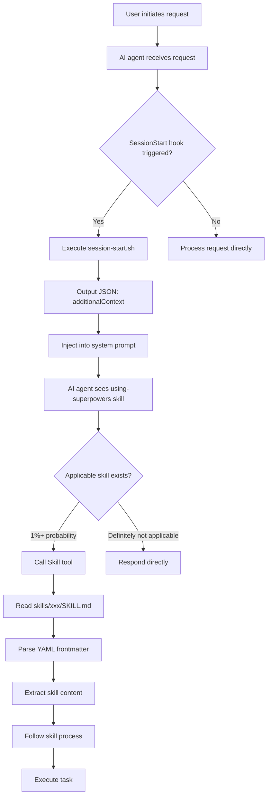
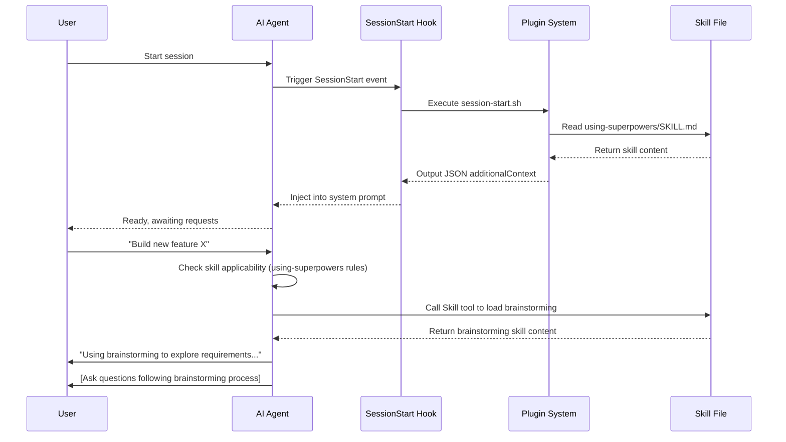

# Architecture and Implementation Principles

## What You'll Learn

- Understand the overall architecture and core components of Superpowers
- Master the implementation principles of the multi-platform integration mechanism
- Learn about the skill discovery and loading priority mechanism
- Understand how the hook system automates workflow guidance
- Build a foundation for custom skill development and platform extension

## When to Use This Approach

- You want to deeply understand how Superpowers works
- You plan to contribute code or skills to Superpowers
- You need to integrate Superpowers in a custom environment
- You want to debug skill loading or hook execution issues

## Core Philosophy

**Superpowers architecture design philosophy**: Inject software engineering best practices into AI agent workflows through composable "skills" and automated hooks.

> **Core Architecture Principles**:
> 1. **File as Skill**: Each skill is an independent Markdown file (`SKILL.md`) containing YAML frontmatter metadata and process guidance
> 2. **Platform-Independent Core**: The skill library is shared across platforms, with different AI coding agents adapted through a plugin system
> 3. **Automated Guidance**: Automatically inject skill usage guides at session startup through the hook mechanism
> 4. **Skill Priority**: Support skill overriding (personal skills > project skills > Superpowers skills)

## Overall Architecture Overview

```
┌─────────────────────────────────────────────────────────────┐
│              AI Coding Agent (Claude Code/OpenCode/Codex)  │
└─────────────────────┬───────────────────────────────────┘
                       │
                       ▼
          ┌────────────┴────────────┐
          │   Platform Adapter Layer│
          ├─────────────────────────┤
          │ • Claude Code Plugin  │
          │ • OpenCode Plugin     │
          │ • Codex CLI          │
          └──────────┬────────────┘
                     │
                     ▼
          ┌──────────┴────────────┐
          │   Superpowers Core    │
          ├─────────────────────────┤
          │ • Skill Library (skills/)   │
          │ • Hook System (hooks/)   │
          │ • Command System (commands/)│
          │ • Agent Definitions (agents/)   │
          │ • Shared Tools (lib/)     │
          └──────────────────────────┘
```

### Architecture Layers

| Layer            | Responsibility                     | Directory/File                  |
| --------------- | ------------------------ | ------------------------- |
| **Platform Adapter Layer** | Adapts to different AI coding agent APIs | `.claude-plugin/`, `.opencode/`, `.codex/` |
| **Skill Layer**     | Provides composable workflow guides     | `skills/`                  |
| **Automation Layer**   | Hooks and commands implement automated guidance   | `hooks/`, `commands/`      |
| **Utility Layer**     | Provides cross-platform shared utility functions   | `lib/skills-core.js`       |

---

## Core Components Deep Dive

### 1. Skill System

Skills are the core of Superpowers. Each skill is an independent directory containing a `SKILL.md` file.

#### Skill File Structure

```
skills/
├── brainstorming/
│   └── SKILL.md
├── test-driven-development/
│   └── SKILL.md
└── using-superpowers/
    └── SKILL.md
```

#### SKILL.md Format

Each `SKILL.md` file follows a standard format:

```yaml
---
name: skill-name
description: Use when [condition] - [what it does]
---

[Skill content: flowcharts, checklists, rules, Red Flags, etc.]
```

**Required Fields** (from `lib/skills-core.js` extraction logic):

| Field        | Type   | Purpose                           | Example                          |
| ----------- | ------ | ------------------------------ | ----------------------------- |
| `name`      | string | Unique skill identifier (kebab-case)     | `test-driven-development`        |
| `description` | string | Trigger condition description (for skill discovery)   | `Use when implementing any feature or fixing before writing code` |

#### Skill Classification

Superpowers divides 14 skills into 4 categories:

| Category       | Skill Count | Skill List                                                             |
| ---------- | --------- | -------------------------------------------------------------------- |
| **Core Skills**   | 1         | `using-superpowers`                                                    |
| **Testing Skills**   | 2         | `test-driven-development`, `verification-before-completion`                     |
| **Debugging Skills**   | 2         | `systematic-debugging`, `root-cause-tracing` (sub-technique)                     |
| **Collaboration Skills**   | 7         | `brainstorming`, `writing-plans`, `subagent-driven-development`, `using-git-worktrees`, `requesting-code-review`, `receiving-code-review`, `finishing-a-development-branch` |
| **Other Skills**   | 2         | `executing-plans`, `dispatching-parallel-agents`, `writing-skills` (meta-skill)    |

::: tip Skill Invocation Priority

When multiple skills might apply, follow this order (from the `using-superpowers` skill):

1. **Process Skills First** (brainstorming, debugging) — decide how to handle the task
2. **Implementation Skills Next** (TDD, git-worktrees) — guide specific execution

"Let's build X" → brainstorming first, then implementation skills
"Fix this bug" → systematic-debugging first, then implementation skills
:::

---

### 2. Hook System

The hook system automatically executes logic when specific events occur. Currently, only the `SessionStart` hook is implemented.

#### hooks.json Configuration

```json
{
  "hooks": {
    "SessionStart": [
      {
        "matcher": "startup|resume|clear|compact",
        "hooks": [
          {
            "type": "command",
            "command": "${CLAUDE_PLUGIN_ROOT}/hooks/session-start.sh"
          }
        ]
      }
    ]
  }
}
```

**Field Explanations**:
- `SessionStart`: Hook event name
- `matcher`: Match pattern (regex), `startup|resume|clear|compact` means triggered at session startup
- `type: "command"`: Hook type is to execute a command
- `command`: Shell script path to execute, `${CLAUDE_PLUGIN_ROOT}` is an environment variable pointing to the plugin root directory

#### session-start.sh Execution Flow

The `hooks/session-start.sh` script (lines 6-52) implements the following logic:

```bash
# 1. Determine plugin root directory
# 2. Check for old skill directory (compatibility warning)
# 3. Read using-superpowers skill content
# 4. JSON escape (handle special characters)
# 5. Output JSON format hook output
```

**Key Points**:
- Uses `cat` to directly read `SKILL.md` content without any parsing
- `escape_for_json` function (lines 21-37) handles JSON special characters (`"`, `\n`, `\t`, `\r`)
- Outputs `hookSpecificOutput` in JSON format, containing the `additionalContext` field
- `additionalContext` is injected into the AI agent's system prompt

---

### 3. Multi-Platform Integration Mechanism

Superpowers adapts to three platforms through a plugin system: Claude Code, OpenCode, and Codex.

#### 3.1 Claude Code Integration

**Components**:
- Plugin definition: `.claude-plugin/plugin.json`
- Hook configuration: `hooks/hooks.json`
- SessionStart script: `hooks/session-start.sh`
- Skill directory: `skills/`
- Command definitions: `commands/*.md`
- Agent definitions: `agents/*.md`

**Workflow**:

```
User starts Claude Code
    ↓
Claude Code loads plugin (plugin.json)
    ↓
SessionStart event triggered (matches "startup|resume|clear|compact")
    ↓
Execute hooks/session-start.sh
    ↓
Output JSON: { "hookSpecificOutput": { "additionalContext": "..." } }
    ↓
additionalContext injected into system prompt
    ↓
AI agent receives "You have superpowers" + using-superpowers skill content
    ↓
Agent starts checking skill applicability
```

**plugin.json Metadata**:

```json
{
  "name": "superpowers",
  "description": "Core skills library for Claude Code: TDD, debugging, collaboration patterns...",
  "version": "4.1.1",
  "author": { "name": "Jesse Vincent", "email": "jesse@fsck.com" },
  "homepage": "https://github.com/obra/superpowers",
  "repository": "https://github.com/obra/superpowers",
  "license": "MIT",
  "keywords": ["skills", "tdd", "debugging", "collaboration", "best-practices", "workflows"]
}
```

#### 3.2 OpenCode Integration

**Components**:
- Plugin file: `.opencode/plugins/superpowers.js`
- Skill symlink: `~/.config/opencode/skills/superpowers` → `~/.config/opencode/superpowers/skills/`

**Workflow**:

```
User starts OpenCode
    ↓
Load .opencode/plugins/superpowers.js
    ↓
Register experimental.chat.system.transform hook
    ↓
Trigger transform at start of each conversation
    ↓
Read skills/using-superpowers/SKILL.md
    ↓
Extract and remove YAML frontmatter (lines 16-34)
    ↓
Generate bootstrap content (lines 56-84)
    ↓
Inject into system prompt (lines 88-93)
    ↓
OpenCode native skill tool discovers skills
```

**Key Code in superpowers.js** (lines 88-93):

```javascript
return {
  'experimental.chat.system.transform': async (_input, output) => {
    const bootstrap = getBootstrapContent();
    if (bootstrap) {
      (output.system ||= []).push(bootstrap);
    }
  }
};
```

**Bootstrap Content Structure** (lines 75-83):

```javascript
return `<EXTREMELY_IMPORTANT>
You have superpowers.

**IMPORTANT: The using-superpowers skill content is included below. It is ALREADY LOADED - you are currently following it. Do NOT use skill tool to load "using-superpowers" again - that would be redundant.**

${content}

${toolMapping}
</EXTREMELY_IMPORTANT>`;
```

**Tool Mapping** (lines 64-73):

When a skill references Claude Code-specific tools, OpenCode provides the corresponding mapping:

| Claude Code Tool | OpenCode Corresponding Tool          |
| ---------------- | ------------------------- |
| `TodoWrite`       | `update_plan`             |
| `Task` (sub-agent)  | OpenCode's @mention system    |
| `Skill`          | OpenCode native `skill` tool |
| `Read`, `Write`, `Edit`, `Bash` | OpenCode native tools |

#### 3.3 Codex Integration

**Components**:
- CLI script: `.codex/superpowers-codex`
- Shared core module: `lib/skills-core.js`
- Bootstrap file: `.codex/superpowers-bootstrap.md`

**Workflow** (inferred from PRD):

```
User starts Codex
    ↓
Load .codex/superpowers-codex
    ↓
Execute CLI commands:
    - superpowers-codex find-skills → JSON output skill list
    - superpowers-codex use-skill → load specified skill
    - superpowers-codex bootstrap → inject complete context
    ↓
Use lib/skills-core.js shared functionality
    ↓
Skills selected via CLI parameters or interactive menu
```

**Shared Core Module Functions** (`lib/skills-core.js`):

| Function Name                     | Function                                     | Line Range |
| -------------------------- | ---------------------------------------- | -------- |
| `extractFrontmatter()`      | Extract YAML frontmatter from SKILL.md        | 16-52    |
| `findSkillsInDir()`       | Recursively find all SKILL.md files in directory          | 62-97    |
| `resolveSkillPath()`       | Resolve skill name to file path, handle skill override       | 108-140   |
| `checkForUpdates()`        | Check if Git repository has updates (3 second timeout)      | 148-170   |
| `stripFrontmatter()`       | Remove YAML frontmatter, return pure content         | 178-200   |

---

### 4. Skill Discovery and Loading Mechanism

#### 4.1 Skill Discovery Priority (OpenCode)

OpenCode uses a three-tier discovery mechanism (from `superpowers.js` lines 52-53 and `README.opencode.md:231`):

```
1. Project skills (.opencode/skills/) - Highest priority
2. Personal skills (~/.config/opencode/skills/)
3. Superpowers skills (~/.config/opencode/skills/superpowers/)
```

**Implementation Principle** (`lib/skills-core.js` lines 108-140):

```javascript
function resolveSkillPath(skillName, superpowersDir, personalDir) {
    // 1. Remove superpowers: prefix (if present)
    const forceSuperpowers = skillName.startsWith('superpowers:');
    const actualSkillName = forceSuperpowers ? skillName.replace(/^superpowers:/, '') : skillName;

    // 2. Try personal skills first (unless explicitly specified superpowers:)
    if (!forceSuperpowers && personalDir) {
        const personalSkillFile = path.join(personalDir, actualSkillName, 'SKILL.md');
        if (fs.existsSync(personalSkillFile)) {
            return { skillFile: personalSkillFile, sourceType: 'personal' };
        }
    }

    // 3. Fallback to Superpowers skills
    if (superpowersDir) {
        const superpowersSkillFile = path.join(superpowersDir, actualSkillName, 'SKILL.md');
        if (fs.existsSync(superpowersSkillFile)) {
            return { skillFile: superpowersSkillFile, sourceType: 'superpowers' };
        }
    }

    return null; // Skill not found
}
```

**Example Scenarios**:

| Skill Name             | Resolution Result                   | Actually Loaded File                          |
| -------------------- | -------------------------- | ------------------------------------- |
| `test-driven-development` | No prefix → prioritize personal skills       | `~/.config/opencode/skills/test-driven-development/SKILL.md` (if exists) |
| `superpowers:tdd`      | Force Superpowers → skip priority | `~/.config/opencode/skills/superpowers/tdd/SKILL.md` |
| `my-custom-skill`       | Personal skill                   | `~/.config/opencode/skills/my-custom-skill/SKILL.md` |

#### 4.2 Recursive Skill Discovery

The `findSkillsInDir()` function (lines 62-97) implements recursive skill discovery:

```javascript
function findSkillsInDir(dir, sourceType, maxDepth = 3) {
    const skills = [];

    function recurse(currentDir, depth) {
        if (depth > maxDepth) return; // Prevent infinite recursion

        const entries = fs.readdirSync(currentDir, { withFileTypes: true });

        for (const entry of entries) {
            const fullPath = path.join(currentDir, entry.name);

            if (entry.isDirectory()) {
                // Check if SKILL.md exists in the directory
                const skillFile = path.join(fullPath, 'SKILL.md');
                if (fs.existsSync(skillFile)) {
                    const { name, description } = extractFrontmatter(skillFile);
                    skills.push({
                        path: fullPath,
                        skillFile: skillFile,
                        name: name || entry.name,
                        description: description || '',
                        sourceType: sourceType
                    });
                }

                // Continue recursing into subdirectories
                recurse(fullPath, depth + 1);
            }
        }
    }

    recurse(dir, 0);
    return skills;
}
```

**Parameter Explanations**:
- `dir`: Root directory to search
- `sourceType`: Skill source type (`'personal'` or `'superpowers'`)
- `maxDepth`: Maximum recursion depth (default 3 levels)

---

### 5. Command System (Slash Commands)

Slash commands provide shortcuts for quick access to core skills.

#### Command Definitions

Each command is a Markdown file located in the `commands/` directory:

| Command File          | Purpose                           | Skill Dependency                      |
| ----------------- | ------------------------------ | --------------------------- |
| `brainstorm.md`    | Interactive design refinement                  | `brainstorming` skill          |
| `write-plan.md`    | Create implementation plan                    | `writing-plans` skill          |
| `execute-plan.md`  | Batch execute plan                    | `executing-plans` skill        |

#### brainstorm.md Example (lines 1-7):

```yaml
---
description: "You MUST use this before any creative work - creating features, building components, adding functionality, or modifying behavior. Explores requirements and design before implementation."
disable-model-invocation: true
---

Invoke superpowers:brainstorming skill and follow it exactly as presented to you
```

**Field Explanations**:
- `description`: Command description, displayed in `/help` output
- `disable-model-invocation: true`: Prevent the model from calling tools when executing this command (to prevent infinite loops)

---

### 6. Agent Definition System

Agent definition files (`agents/*.md`) provide role configurations for specialized AI agents for specific tasks.

#### code-reviewer.md Example

**YAML Frontmatter** (lines 1-6):

```yaml
---
name: code-reviewer
description: |
  Use this agent when a major project step has been completed and needs to be reviewed against original plan and coding standards.
model: inherit
---
```

**Agent Role Configuration** (lines 8-48):

The agent acts as a "Senior Code Reviewer", responsible for:

1. **Plan Consistency Analysis**: Compare implementation with original plan, identify deviations
2. **Code Quality Assessment**: Check error handling, type safety, test coverage, security
3. **Architecture and Design Review**: Ensure SOLID principles and patterns compliance
4. **Documentation and Standards**: Verify comments, documentation, and coding standards adherence
5. **Issue Identification and Suggestions**: Classify issues by severity (Critical/Important/Suggestions)
6. **Communication Protocol**: Interaction standards with coding agents

**Usage Scenarios** (line 4 `<example>` tag):

```
User: "I've finished implementing user authentication system as outlined in step 3 of our plan"
Agent: "Great work! Now let me use code-reviewer agent to review the implementation against our plan and coding standards"
```

---

## Data Flow

### Complete Workflow Data Flow

The following is the complete data flow from user input to skill invocation:



### Skill Loading Sequence



---

## Technical Decisions and Trade-offs

### Why Choose File System for Skill Storage?

**Advantages**:
- ✅ **Simple and Intuitive**: Skills are Markdown files, easy to read and edit
- ✅ **Version Control Friendly**: Can directly manage skill changes with Git
- ✅ **Zero Dependencies**: No database or storage service required
- ✅ **Cross-Platform Compatible**: Any AI agent that can access the file system can use it

**Disadvantages**:
- ⚠️ **No Index**: Need to traverse directories to find skills each time (optimized through recursion)
- ⚠️ **No Hot Reload**: Need to restart session to load new skills (on some platforms)

### Why Use YAML Frontmatter?

**Advantages**:
- ✅ **Standardized Format**: All skills follow a unified structure
- ✅ **Easy to Parse**: Can be extracted with simple regex
- ✅ **Tool Friendly**: IDEs and editors can highlight and validate

**Implementation Example** (`lib/skills-core.js` lines 32-44):

```javascript
for (const line of lines) {
    if (line.trim() === '---') {
        if (inFrontmatter) break;
        inFrontmatter = true;
        continue;
    }

    if (inFrontmatter) {
        const match = line.match(/^(\w+):\s*(.*)$/);
        if (match) {
            const [, key, value] = match;
            switch (key) {
                case 'name':
                    name = value.trim();
                    break;
                case 'description':
                    description = value.trim();
                    break;
            }
        }
    }
}
```

### Why Does Each Platform Need a Separate Adapter Layer?

**Reasons**:
1. **API Differences**: Different platforms have different plugin systems, hook mechanisms, and tool invocation methods
2. **Different Deployment Paths**: Claude Code (plugin marketplace), OpenCode (plugin directory), Codex (CLI)
3. **Different Skill Discovery Mechanisms**: Claude Code (Skill tool), OpenCode (symlink + native skill), Codex (CLI commands)

**Design Goals**:
- ✅ **Core Skill Library Shared Across Platforms**: `skills/` directory is shared by all platforms
- ✅ **Minimize Adapter Layer Code**: Each platform adapter only handles platform-specific logic
- ✅ **Unified Experience**: Users have consistent experience using skills across different platforms

---

## Extending Superpowers

### Adding Custom Skills

Create new skills following the guidelines in the `writing-skills` skill:

1. Create a subdirectory under `skills/`
2. Add a `SKILL.md` file containing YAML frontmatter
3. Write skill content (flowcharts, checklists, rules, etc.)
4. Test the skill (verify using sub-agents)
5. Commit to Git (if it's an official Superpowers skill)

**SKILL.md Template**:

```yaml
---
name: your-skill-name
description: Use when [condition] - [what it does]
---

[Skill content]
```

### Integrating to New Platforms

If you want to integrate Superpowers into a new AI coding agent platform:

1. **Implement Platform Adapter**:
   - Create plugin entry file (e.g., `.newplatform/plugin.js`)
   - Implement SessionStart hook (or equivalent mechanism)
   - Handle `using-superpowers` skill injection

2. **Adapt Skill Discovery**:
   - Implement skill discovery logic (reuse or reference `lib/skills-core.js`)
   - Handle skill priority and override mechanism

3. **Adapt Tool Invocation**:
   - If platform tools differ from Claude Code, provide a mapping table
   - Update tool mapping documentation in the `using-superpowers` skill

---

## Frequently Asked Questions

### Q1: Why aren't skills loading automatically?

**Possible Causes**:
1. **Hook Not Triggered**: Check if SessionStart event is correctly configured
2. **Incorrect Path**: Confirm `CLAUDE_PLUGIN_ROOT` environment variable points to the correct directory
3. **Permission Issue**: Check if `session-start.sh` has execute permission (`chmod +x`)

**Debugging Methods**:
- Add `echo "Debug: $(date)" > /tmp/superpowers-debug.log` in `session-start.sh`
- Check if the log file is generated

### Q2: Why isn't my personal skill overriding the Superpowers skill?

**Checklist**:
1. Confirm personal skill path is correct (OpenCode: `~/.config/opencode/skills/`)
2. Confirm skill directory structure is correct (`my-skill/SKILL.md`)
3. Confirm the `name` field in YAML frontmatter matches the skill directory name
4. Confirm you're not using the `superpowers:` prefix (which forces using Superpowers skills)

### Q3: How do I debug the skill loading process?

**Method 1: View Logs**
- Claude Code: Check the system prompt at session start
- OpenCode: Check if Bootstrap content is injected into the system prompt

**Method 2: Manually Test Skill Loading**
```bash
# Test skill discovery (Codex)
superpowers-codex find-skills

# Test skill path resolution (Node.js)
node -e "..."
```

---

## Summary

Superpowers' architecture design revolves around **composable skills** and **automated hooks**:

- **Skill Layer**: 14 standard skills divided into core, testing, debugging, collaboration, and meta-skills
- **Hook System**: SessionStart hook automatically injects `using-superpowers` skill content
- **Multi-Platform Adaptation**: Adapts to Claude Code, OpenCode, and Codex through a plugin layer, with shared core skill library
- **Skill Discovery**: Supports three-tier priority (project > personal > Superpowers), implemented through recursive search
- **Shared Utility Library**: `lib/skills-core.js` provides cross-platform skill parsing and path resolution functions

Understanding these principles enables you to:
- Efficiently debug skill loading issues
- Create custom skills that follow the specifications
- Integrate Superpowers into new platforms
- Contribute to the project

---

## Appendix: Source Code Reference

<details>
<summary><strong>Click to expand source code locations</strong></summary>

> Last updated: 2026-02-01

| Component         | File Path                                                                                    | Line Range    |
| ------------ | ------------------------------------------------------------------------------------------- | ----------- |
| Plugin Metadata     | [`source/obra/superpowers/.claude-plugin/plugin.json`](https://github.com/obra/superpowers/blob/main/.claude-plugin/plugin.json) | 1-14        |
| Hook Configuration     | [`source/obra/superpowers/hooks/hooks.json`](https://github.com/obra/superpowers/blob/main/hooks/hooks.json) | 1-16        |
| SessionStart Script | [`source/obra/superpowers/hooks/session-start.sh`](https://github.com/obra/superpowers/blob/main/hooks/session-start.sh) | 1-53        |
| OpenCode Plugin | [`source/obra/superpowers/.opencode/plugins/superpowers.js`](https://github.com/obra/superpowers/blob/main/.opencode/plugins/superpowers.js) | 1-96        |
| Shared Core Module   | [`source/obra/superpowers/lib/skills-core.js`](https://github.com/obra/superpowers/blob/main/lib/skills-core.js) | 1-209       |
| Entry Skill       | [`source/obra/superpowers/skills/using-superpowers/SKILL.md`](https://github.com/obra/superpowers/blob/main/skills/using-superpowers/SKILL.md) | 1-88        |
| Code Reviewer Agent   | [`source/obra/superpowers/agents/code-reviewer.md`](https://github.com/obra/superpowers/blob/main/agents/code-reviewer.md) | 1-49        |
| Brainstorm Command | [`source/obra/superpowers/commands/brainstorm.md`](https://github.com/obra/superpowers/blob/main/commands/brainstorm.md) | 1-7         |
| Write Plan Command | [`source/obra/superpowers/commands/write-plan.md`](https://github.com/obra/superpowers/blob/main/commands/write-plan.md) | Full text        |
| Execute Plan Command | [`source/obra/superpowers/commands/execute-plan.md`](https://github.com/obra/superpowers/blob/main/commands/execute-plan.md) | Full text        |

**Key Functions** (`lib/skills-core.js`):
- `extractFrontmatter(filePath)`: Extract YAML frontmatter from SKILL.md (lines 16-52)
- `findSkillsInDir(dir, sourceType, maxDepth)`: Recursively find all SKILL.md files in a directory (lines 62-97)
- `resolveSkillPath(skillName, superpowersDir, personalDir)`: Resolve skill name to file path, handle skill override (lines 108-140)
- `checkForUpdates(repoDir)`: Check if Git repository has updates (lines 148-170)
- `stripFrontmatter(content)`: Remove YAML frontmatter, return pure content (lines 178-200)

**Key Constants**:
- `maxDepth = 3`: Maximum depth for recursive skill search (default parameter of `findSkillsInDir` function)
- Timeout `3000`: Timeout for Git fetch to check for updates (3 seconds)

**Key Workflows**:
- SessionStart hook execution flow: `session-start.sh` (lines 6-52)
- OpenCode Bootstrap injection flow: `superpowers.js` (lines 88-93)
- Skill invocation priority rules: `using-superpowers/SKILL.md` (lines 69-75)

</details>
