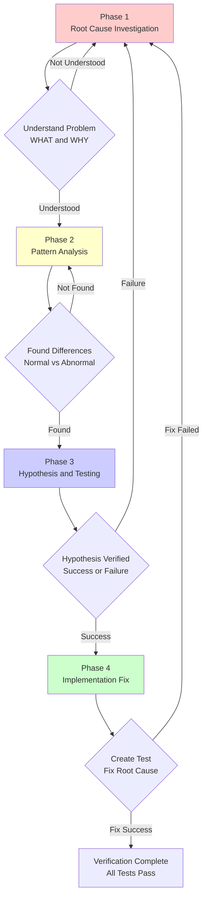

# Debugging Workflow: Systematic Debugging

## What You'll Learn

- Force AI agents to investigate root causes before fixing
- Identify and correct common debugging traps (like "quick fix", "try again")
- Apply the four-phase systematic debugging process (observe, pattern, hypothesis, implement)
- Use root cause tracing techniques to trace back from deep errors to the source
- Add diagnostic tools in multi-component systems to precisely locate failure points
- Distinguish between "fixing symptoms" and "solving problems" to avoid symptom fix failures

## Your Current Situation

**AI agents often skip investigation and directly "quick fix"**

Have you encountered this situation? Tests failed, the AI immediately starts changing code, changes it a few times "looks good", but the root cause wasn't found, and new problems appear a few days later.

Common problems:
- ❌ AI says "it should be this reason, let's try changing it"
- ❌ Fixed one bug, introduced three new bugs
- ❌ Changed multiple times with no effect, still "trying again"
- ❌ Skipped error messages at a glance, directly changing code
- ❌ "this is a small problem, no need to be so formal"

The root cause of these problems: **AI starts fixing before finding the root cause**.

::: info What is Systematic Debugging?

Systematic Debugging is a forced process that requires completing thorough root cause investigation before attempting any fix.

Core Iron Rule:
```
NO FIXES WITHOUT ROOT CAUSE INVESTIGATION FIRST
(no root cause investigation, no fixes)
```

Four-Phase Process:
1. **Root Cause Investigation** - Understand what happened, why it happened
2. **Pattern Analysis** - Compare normal vs. abnormal situations
3. **Hypothesis and Testing** - Validate hypotheses using scientific methods
4. **Implementation Fix** - Create tests, fix root cause, verify results
:::

## When to Use This

The Systematic Debugging skill automatically triggers in the following scenarios:

| Scenario | Example |
| -------- | ------- |
| **Test Failure** | "Test errored, help me fix it" |
| **Bug Report** | "User feedback: feature not working" |
| **Abnormal Behavior** | "This result doesn't match expectations" |
| **Performance Issue** | "This operation is too slow" |
| **Build Failure** | "CI build failed" |
| **Integration Issue** | "This service call failed" |

**Especially use when**:
- Under time pressure (emergency situations shouldn't be guessed)
- Looks like an "obvious quick fix"
- Tried multiple fixes but none worked
- Last fix didn't solve the problem
- You don't fully understand the problem

**Don't skip when**:
- Looks simple (simple bugs also have root causes)
- Rushing (haste leads to rework)
- Management demands "fix immediately" (systematic is faster than random attempts)

## Core Approach

The core of systematic debugging is a four-phase process, each phase has mandatory verification steps, must be completed in order:



### Core Iron Rule

```
NO FIXES WITHOUT ROOT CAUSE INVESTIGATION FIRST
(no root cause investigation, no fixes)
```

If you haven't completed Phase 1, you cannot propose a fix.

**Violating the letter of the rule means violating the spirit of the rule**. Even if you're 99% sure it's a certain cause, you must investigate and verify first.

### Four-Phase Overview

| Phase | Key Activities | Success Criteria |
| ----- | -------------- | ---------------- |
| **1. Root Cause Investigation** | Read errors, reproduce, check changes, collect evidence | Understand WHAT and WHY |
| **2. Pattern Analysis** | Find normal examples, compare reference implementations | Identify differences |
| **3. Hypothesis and Testing** | Form hypothesis, minimal test | Confirm or new hypothesis |
| **4. Implementation Fix** | Create test, fix, verify | Bug solved, tests pass |

## Follow Along

### Step 1: Root Cause Investigation - Read Error Messages

**Why**
Error messages usually contain clues to the solution, skipping them misses key information.

**Operation Example**

Suppose you encounter this error:

```
Error: Cannot find module 'lodash' from '/project/src/utils.ts'
    at resolveModule (/project/node_modules/vite/dist/node/chunks/dep-a1b2c3.js:123:45)
    at /project/src/main.ts:45:12
```

**Read the complete error message**:

1. **Error type**: `Cannot find module 'lodash'`
2. **File location**: `/project/src/utils.ts` trying to import lodash
3. **Call location**: `/project/src/main.ts:45:12` triggered the import
4. **Possible cause**: lodash not installed or wrong path

**You should see**: The error message tells you what, where, and possibly why.

::: danger Checkpoint
Don't just look at the error title and skip!
- ✅ Read the complete error stack
- ✅ Note file paths and line numbers
- ✅ Record error codes
- ✅ Don't skip warning messages (warnings are often the real problem)
:::

### Step 2: Root Cause Investigation - Reproduce the Problem

**Why**
If you can't stably reproduce it, you can't verify if a fix is effective.

**Operation Example**

```bash
# Run the failing test
npm test utils.test.ts

# Try to reproduce manually
npm run dev

# Record reproduction steps
1. npm run dev
2. Open http://localhost:3000
3. Click login button
4. Observe console error
```

**Reproduction Checklist**:
- Can it be stably triggered? Does it happen every time?
- What are the specific steps?
- Does it only happen under specific conditions? (environment, data, time)

**Should note**:
- If not stably reproducible → Collect more data, don't guess
- If intermittent → Check race conditions, environment differences, cache

### Step 3: Root Cause Investigation - Check Recent Changes

**Why**
Most bugs are caused by recent changes.

**Operation Example**

```bash
# View recent commits
git log --oneline -10

# View recent changes
git diff HEAD~5 HEAD

# Check dependency changes
git diff package.json
```

**What to check**:
- Which code changes might cause this problem?
- What dependencies were added recently?
- Were there changes to configuration files?
- Were there changes to environment variables?

**You should see**: A list of changes that might cause the problem.

### Step 4: Root Cause Investigation - Diagnostics for Multi-Component Systems

**Why**
When the system has multiple components (CI → Build → Sign, API → Service → Database), you need to precisely locate the failure point.

**Operation Example**

Suppose you're debugging a CI build failure (GitHub Actions → Build Script → Signing Script):

```bash
# Layer 1: Workflow layer
echo "=== Secrets available in workflow: ==="
echo "IDENTITY: ${IDENTITY:+SET}${IDENTITY:-UNSET}"

# Layer 2: Build script layer
echo "=== Env vars in build script: ==="
env | grep IDENTITY || echo "IDENTITY not in environment"

# Layer 3: Signing script layer
echo "=== Keychain state: ==="
security list-keychains
security find-identity -v

# Layer 4: Actual signing
codesign --sign "$IDENTITY" --verbose=4 "$APP"
```

**Analyze output after running once**:
- Layer 1 shows `IDENTITY: SET` ✓
- Layer 2 shows `IDENTITY not in environment` ✗

**Conclusion**: Problem is in Layer 2, secrets failed to pass from workflow to build.

**Should note**:
- Add logs at each component boundary
- Record data entering and exiting
- Verify environment/configuration passing
- Check the state of each layer

### Step 5: Root Cause Tracing - Deep Error Backtracking

**Why**
Errors usually appear deep in the call stack, fixing directly treats symptoms not root causes.

**Operation Example**

Suppose the error shows in a deep call:

```
Error: git init failed in /Users/jesse/project/packages/core
```

**Call chain tracing**:

```typescript
// Immediate cause (where error occurred)
await execFileAsync('git', ['init'], { cwd: projectDir });
  ↑
// What called this?
WorktreeManager.createSessionWorktree(projectDir, sessionId)
  ↑
// What called this?
Session.initializeWorkspace()
  ↑
// What called this?
Session.create()
  ↑
// What called this? (source)
Project.create('name', context.tempDir)
```

**Trace problem**:
- `projectDir = ''` (empty string!)
- Empty string as `cwd` resolves to `process.cwd()`
- That's the source code directory, not the temp directory!

**Found root cause**:
```typescript
const context = setupCoreTest(); // Returns { tempDir: '' }
Project.create('name', context.tempDir); // Accessed before beforeEach!
```

**Fix**:
```typescript
// Fix root cause (source), not symptom
private get tempDir(): string {
  if (!this._tempDir) {
    throw new Error('tempDir accessed before beforeEach');
  }
  return this._tempDir;
}
```

**You should see**: Fix at the source of the call chain, not where the error appears.

::: danger Checkpoint
Never fix only where the error appears!
- ✅ Trace to the original trigger point
- ✅ Fix root cause
- ✅ Add multiple layers of defense
- ❌ Don't "put a band-aid" on the symptom
:::

### Step 6: Pattern Analysis - Find Normal Examples

**Why**
By comparing normal and abnormal situations, you can quickly identify differences.

**Operation Example**

Suppose you're fixing a button click that doesn't work:

**Find normal working code with similar functionality**:

```typescript
// Normal working button (reference)
<Button onClick={() => console.log('clicked')}>
  Click me
</Button>

// Non-working button (problem)
<Button onClick={handleClick}>
  Click me
</Button>
```

**Compare differences**:
1. Normal: Arrow function directly calls `console.log`
2. Abnormal: Uses `handleClick` variable

**Check `handleClick` definition**:

```typescript
// Problem: handleClick not defined (typo!)
const handleClikc = () => console.log('clicked');
//      ^^^^ typo
```

**Root cause**: Function name typo.

**You should see**: Found typo through comparison.

### Step 7: Pattern Analysis - Compare Reference Implementation

**Why**
Read the reference implementation completely, don't "adapt" it.

**Operation Example**

Suppose you're implementing a new feature, referencing the official documentation example:

```typescript
// Read reference implementation completely
// Reference code (from docs)
import { useAuth } from '@auth/react';

function UserProfile() {
  const { user, loading } = useAuth();

  if (loading) return <div>Loading...</div>;
  if (!user) return <div>Please log in</div>;

  return <div>Welcome, {user.name}</div>;
}

// Your code (incomplete)
function UserProfile() {
  const { user } = useAuth(); // Missing loading
  return <div>Welcome, {user.name}</div>; // No check for loading/user
}
```

**Difference list**:
1. Didn't check `loading` state
2. Didn't check if `user` exists
3. Might access `user.name` during loading causing error

**Fix**:
```typescript
function UserProfile() {
  const { user, loading } = useAuth(); // Add loading

  if (loading) return <div>Loading...</div>; // Add check
  if (!user) return <div>Please log in</div>; // Add check

  return <div>Welcome, {user.name}</div>;
}
```

**Should note**:
- Read reference completely, don't skim
- Understand pattern before applying
- Don't "looks good enough"
- List all differences, don't assume "that's not important"

### Step 8: Hypothesis and Testing - Form Single Hypothesis

**Why**
Use scientific method to verify hypotheses, change one variable at a time.

**Operation Example**

Suppose you're debugging an API timeout issue:

**Form hypothesis**:
```
I believe the request times out because the API server's response time exceeds the client's 30-second timeout setting, because I saw server logs showing the request takes 45 seconds.
```

**Key elements**:
- ✅ Clearly state cause (API server slow response)
- ✅ Provide evidence (server logs show 45 seconds)
- ✅ Specific and verifiable

**Minimal test**:
```typescript
// Only modify timeout setting, don't change anything else
const response = await fetch(url, {
  timeout: 60000, // Changed from 30000 to 60000
  // Other parameters unchanged
});
```

**Verify hypothesis**:
```bash
# Run test
npm test api-timeout.test.ts

# Result: Request succeeded
PASS api-timeout.test.ts
  ✓ API request succeeded within 60-second timeout
```

**Should note**:
- Change one variable at a time
- Don't "incidentally" fix other problems
- Test minimal, don't make big changes
- Record hypothesis, verify success or failure

### Step 9: Implementation Fix - Create Failing Test

**Why**
You need a failing test first to prove the fix is effective.

**Operation Example**

Suppose you're fixing a bug where empty email is accepted:

```typescript
// Phase 4: Create failing test
test('reject empty email', async () => {
  const result = await submitForm({ email: '' });
  expect(result.error).toBe('Email required');
});
```

**Verify test fails**:

```bash
$ npm test submitForm.test.ts

FAIL submitForm.test.ts
  ● reject empty email

    expect(result.error).toBe('Email required')
    Received: undefined

      at Object.<anonymous> (submitForm.test.ts:3:28)
```

**You should see**: Test fails, error message matches expectations (feature missing).

::: danger Checkpoint
If test passes immediately?
This means you're testing existing behavior, need to modify test.

If test errors?
This means code has errors, fix errors first, then run test.
:::

### Step 10: Implementation Fix - Single Fix

**Why**
Fix one root cause at a time, avoid mixing in other problems.

**Operation Example**

```typescript
// Phase 4: Implement single fix
function submitForm(data: FormData) {
  // Only fix root cause (empty email validation)
  if (!data.email?.trim()) {
    return { error: 'Email required' };
  }

  // ... other logic unchanged
  // Don't "incidentally" add other validations
  // Don't refactor other code
  // Don't "optimize" performance
}
```

**Should note**:
- Only fix root cause
- Don't add extra features
- Don't refactor other code
- Don't "incidentally" do other things

### Step 11: Implementation Fix - Verify Fix

**Why**
Confirm fix is effective and doesn't break other functionality.

**Operation Example**

```bash
# Verify test passes
npm test submitForm.test.ts

PASS submitForm.test.ts
  ✓ reject empty email

Test Suites: 1 passed, 1 total
Tests:       1 passed, 1 total
```

**Verify other tests**:
```bash
# Run all tests
npm test

# Ensure no other functionality broken
Test Suites: 5 passed, 5 total
Tests:       25 passed, 25 total
```

**You should see**:
- ✅ Bug fix test passes
- ✅ All other tests pass
- ✅ No new warnings or errors

### Step 12: Fix Failed - Reanalyze

**Why**
If fix is ineffective, hypothesis is wrong, need to reinvestigate.

**Operation Example**

Suppose you tried 2 fixes, neither worked:

```bash
# Fix 1: Modify timeout setting → Still times out
# Fix 2: Retry request → Still times out
```

**Count and judge**:
- Fixes attempted: 2 times
- Result: Both ineffective
- Action: Return to Phase 1, reanalyze

**Reanalyze**:
```typescript
// New information: Timeout settings and retry didn't work
// Re-do root cause investigation

// Check network request logs
console.log('Request URL:', url);
console.log('Request headers:', headers);

// Found: URL configured incorrectly, pointing to wrong endpoint
// const apiEndpoint = 'https://wrong-api.example.com';
//                  ^^^^^^^^^^^^^^^^^^^^^^^^^^^^^^^^^^^
//                  Should be https://correct-api.example.com
```

**New hypothesis**:
```
I believe the request times out because the API endpoint is configured incorrectly (pointing to wrong URL), because I saw network logs showing request sent to wrong-api.example.com instead of correct-api.example.com.
```

**New fix**:
```typescript
const apiEndpoint = 'https://correct-api.example.com';
```

**Verify fix**:

```bash
npm test api-timeout.test.ts

PASS api-timeout.test.ts
  ✓ API request succeeded
```

::: danger Checkpoint
If tried 3 fixes but all failed?
Stop immediately, this is not a fix problem, it's an architecture problem.

Enter Phase 4.5: Question architecture.
:::

### Step 13: Architecture Questioning - Stop After 3 Failures

**Why**
If each fix reveals new problems, the underlying architecture has issues.

**Pattern Recognition**

Each fix reveals:
- ✗ New shared state problems
- ✗ New coupling problems
- ✗ Needs "major refactoring" to implement
- ✗ New symptoms appear elsewhere after fix

**This indicates**: You're trying to patch on wrong foundation, not fixing root problem.

**Operation Example**

Suppose you're fixing an authentication system issue:

- **Fix 1**: Add token verification → Found token storage insecure
- **Fix 2**: Encrypt token storage → Found key management chaotic
- **Fix 3**: Improve key management → Found multi-service sync issue

**Stop and question**:
```typescript
// Problem pattern: Each fix reveals new problems
// Root cause: Architecture design doesn't match requirements

// Questioning:
// 1. Is this pattern fundamentally reasonable?
// 2. Are we "sticking with it out of inertia"?
// 3. Should we refactor architecture instead of continuing to fix symptoms?

// Architecture problems:
// - Trying to maintain session state in stateless service
// - Multiple services share same token storage
// - No unified authentication center
```

**Action**:
1. Stop trying 4th fix
2. Discuss architecture issues with human partner
3. Decide to refactor architecture or use other approach

**This is not a failed hypothesis**, this is wrong architecture.

## Checkpoints ✅

**Verify systematic debugging process is complete**

- [ ] Read complete error messages and stack
- [ ] Can stably reproduce problem
- [ ] Checked recent code changes
- [ ] Added diagnostic tools in multi-component systems
- [ ] Used root cause tracing to find problem source
- [ ] Found normal examples and compared differences
- [ ] Formed clear single hypothesis
- [ ] Verified hypothesis through minimal test
- [ ] Created failing test (Phase 4)
- [ ] Implemented single fix
- [ ] Verified fix is effective
- [ ] Other tests still pass
- [ ] If 3 fixes failed, questioned architecture

If any of above doesn't apply, skipped systematic debugging process.

## Pitfall Warnings

### ❌ Pitfall 1: "Quick fix, investigate later"

**Symptom**: AI says "this is obvious, fix first, analyze later".

**Problem**:
- Quick fixes often only solve symptoms
- Doesn't cure root cause, problem recurs
- "Later" usually means "never"

**Solution**:
- Iron rule: No fixes without root cause investigation
- Systematic is faster when time is tight
- Remember: Symptom fix = failure

### ❌ Pitfall 2: "Try changing this, see if it works"

**Symptom**: AI says "might be X, try changing it".

**Problem**:
- No clear hypothesis
- Changed multiple places at once
- Can't tell what worked

**Solution**:
- Form hypothesis first: "I think X is root cause because Y"
- Minimal test: change one variable at a time
- Record hypothesis, verify success or failure

### ❌ Pitfall 3: "Change multiple at once, then run test"

**Symptom**: AI modifies multiple places at once, then runs test.

**Problem**:
- Can't know which change worked
- Multiple fixes might cancel each other
- Hard to locate new bugs introduced

**Solution**:
- Only make one change at a time
- Verify after each change
- Gradually approach root cause

### ❌ Pitfall 4: "Skip tests, I verified manually"

**Symptom**: AI says "no need to test, I verified manually".

**Problem**:
- Manual testing can't be repeated
- No test records, can't verify during regression
- Easy to miss edge cases

**Solution**:
- Must create automated tests
- Tests record behavior and fixes
- Manual verification doesn't replace automated tests

### ❌ Pitfall 5: "Might be X, I'll fix it"

**Symptom**: AI assumes it's some cause without investigation.

**Problem**:
- Hypothesis has no evidence
- Might come from experience bias
- Wastes time fixing wrong problem

**Solution**:
- Investigate first, then hypothesize
- Hypothesis must have evidence support
- Use scientific method to verify hypothesis

### ❌ Pitfall 6: "I don't fully understand, but this should work"

**Symptom**: AI admits not understanding, but still suggests fix.

**Problem**:
- Can't fix correctly without understanding
- Might introduce more serious problems
- Can't claim completion

**Solution**:
- Admit "I don't understand X"
- Research more first
- Ask for help, don't guess

### ❌ Pitfall 7: "Pattern says X, but I adapt in different way"

**Symptom**: AI says "reference is too long, I'll skim, implement in my way".

**Problem**:
- Partial understanding inevitably leads to bugs
- Missing details (usually most important)
- "Looks good enough" ≠ "correct implementation"

**Solution**:
- Read reference implementation completely
- Understand pattern before applying
- Don't skim, don't "adapt"

### ❌ Pitfall 8: "Try fix again" (tried 2+ times)

**Symptom**: AI tried 2-3 fixes, but says "try again".

**Problem**:
- 3 failures = architecture problem
- Not not enough fixes, wrong direction
- Continuing to fix wastes more time

**Solution**:
- Stop immediately
- Question architecture
- Discuss refactoring with human partner

### ❌ Pitfall 9: "Problem is simple, no need to be formal"

**Symptom**: AI says "this is small problem, no need for systematic debugging".

**Problem**:
- Simple problems also have root causes
- Systematic debugging is faster for small problems
- "Simple" is subjective judgment, easy to error

**Solution**:
- Systematic debugging applies to all problems
- Small problems also complete quickly
- Remember: 95% of "no root cause" cases are incomplete investigation

## Red Flags - Must Return to Phase 1

If any of the following thoughts appear, **stop immediately, return to Phase 1**:

- [ ] "Quick fix, investigate later"
- [ ] "Try changing this, see if it works"
- [ ] "Change multiple at once, then run test"
- [ ] "Skip tests, I verified manually"
- [ ] "Might be X, I'll fix it"
- [ ] "I don't fully understand, but this should work"
- [ ] "Pattern says X, but I adapt in different way"
- [ ] "Here are main issues: [list fixes, no investigation]"
- [ ] Proposing solution before tracking data flow
- [ ] **"Try fix again" (tried 2+ times)**
- [ ] **Each fix reveals new problems in different places**

**Remember**: Violating the letter of the rule means violating the spirit of the rule.

**If 3 fixes failed**: Question architecture (Phase 4.5)

## Human Partner Signals

**Watch for these correction signals**:

| Signal | Meaning | Action |
| ------ | ------ | ------ |
| "Did it not happen?" | Your assumption not verified | Verify immediately |
| "Will you show us...?" | You should add evidence collection | Add diagnostic tools |
| "Stop guessing" | You're proposing fix without understanding | Return to Phase 1 |
| "Think deeply about this" | Question foundation, not just symptoms | Question architecture |
| "Are we stuck?" (frustrated) | Your approach isn't working | Return to Phase 1 |

**When you see these**: Stop immediately, return to Phase 1.

## Common Rationalization Excuses

| Excuse | Reality |
| ------ | ------- |
| "Problem is simple, no need for process" | Simple problems also have root causes. Process is fast for small bugs. |
| "Emergency, no time for process" | Systematic debugging is faster than random fixes. |
| "Try this first, investigate later" | First fix sets pattern. Do it right from the start. |
| "Write test after confirming fix works" | Untested fixes are unreliable. Write test first to prove it. |
| "Fix multiple at once to save time" | Can't know what worked. Leads to new bugs. |
| "Reference too long, I adapt pattern" | Partial understanding inevitably bugs. Read it completely. |
| "I see the problem, let me fix" | Seeing symptoms ≠ understanding root cause. |
| "Try fix again" (after 2+ failures) | 3+ failures = architecture problem. Question pattern, don't keep fixing. |

## Lesson Summary

Systematic Debugging skill ensures through a four-phase process:

1. **Forced Investigation**: Complete root cause investigation before fixing (Phase 1)
2. **Pattern Comparison**: Find normal examples, compare reference implementations (Phase 2)
3. **Scientific Method**: Form single hypothesis, minimal test verification (Phase 3)
4. **Effective Fix**: Create failing test, implement single fix, verify results (Phase 4)
5. **Architecture Questioning**: After 3 fix failures, question underlying architecture
6. **Zero Tolerance**: Any Red Flags mean return to Phase 1

**Remember**:
- Symptom fix = failure
- Violating letter of rule = violating spirit of rule
- 95% of "no root cause" cases are incomplete investigation
- Systematic debugging is faster than blind fixes (15-30 minutes vs 2-3 hours)

## Coming Up Next

> In the next lesson, we'll learn **[Verification Workflow: Evidence First](../verification-workflow/)**.
>
> You'll learn:
> - How to provide genuine verification before claiming completion
> - 5 types of evidence in the "evidence first" principle
> - Avoid "I tried" and "should work" traps
> - Ensure work is truly complete, not "good enough"

---

## Appendix: Source Code Reference

<details>
<summary><strong>Click to expand source code locations</strong></summary>

> Updated: 2026-02-01

| Feature | File Path | Lines |
| -------- | --------- | ----- |
| Debugging skill definition | [`skills/systematic-debugging/SKILL.md`](https://github.com/obra/superpowers/blob/main/skills/systematic-debugging/SKILL.md) | 1-297 |
| Root cause tracing techniques | [`skills/systematic-debugging/root-cause-tracing.md`](https://github.com/obra/superpowers/blob/main/skills/systematic-debugging/root-cause-tracing.md) | 1-170 |
| Workflow overview | [`README.md`](https://github.com/obra/superpowers/blob/main/README.md) | 80-96 |

**Core Iron Rule**:
- No fixes without root cause investigation (NO FIXES WITHOUT ROOT CAUSE INVESTIGATION FIRST)
- Violating letter of this process is violating spirit of debugging

**Four-Phase Process**:
1. **Phase 1: Root Cause Investigation** - Root cause investigation
   - Read error messages (don't skip)
   - Stably reproduce problem
   - Check recent changes
   - Add diagnostic tools in multi-component systems
   - Root cause tracing (deep error backtracking)
2. **Phase 2: Pattern Analysis** - Pattern analysis
   - Find normal examples
   - Read reference implementation completely
   - Identify differences
   - Understand dependencies
3. **Phase 3: Hypothesis and Testing** - Hypothesis and testing
   - Form single hypothesis (clear, with evidence)
   - Minimal test (one variable at a time)
   - After verification, decide continue or new hypothesis
   - Admit "I don't know"
4. **Phase 4: Implementation** - Implementation fix
   - Create failing test (required)
   - Implement single fix (only fix root cause)
   - Verify fix (tests pass)
   - If fix fails: count and judge
   - If 3+ failures: question architecture

**Red Flags - Must Return to Phase 1**:
- "Quick fix, investigate later"
- "Try changing this, see if it works"
- "Change multiple at once, then run test"
- "Skip tests, I verified manually"
- "Might be X, I'll fix it"
- "I don't fully understand, but this should work"
- "Pattern says X, but I adapt in different way"
- "Try fix again" (tried 2+ times)
- Each fix reveals new problems in different places

**Human Partner Signals**:
- "Did it not happen?" - You assumed without verification
- "Will you show us...?" - You should add evidence collection
- "Stop guessing" - You're proposing fix without understanding
- "Think deeply about this" - Question foundation, not just symptoms
- "Are we stuck?" (frustrated) - Your approach isn't working

**Common Rationalization Excuses**:
- "Problem is simple, no need for process" - Simple problems also have root causes
- "Emergency, no time for process" - Systematic debugging is faster than blind fixes
- "Try this first, investigate later" - First fix sets pattern
- "Write test after confirming fix works" - Untested fixes are unreliable
- "Fix multiple at once to save time" - Can't know what worked
- "Reference too long, I adapt pattern" - Partial understanding inevitably bugs
- "I see the problem, let me fix" - Seeing symptoms ≠ understanding root cause
- "Try fix again" (after 2+ failures) - 3+ failures = architecture problem

**Root Cause Tracing Techniques** (root-cause-tracing.md):
- Trace back from deep errors to source
- Track call chain, find original trigger point
- Add stack trace logging (using `console.error()` and `new Error().stack`)
- Use binary search script (`find-polluter.sh`) to locate test pollution source

**Multi-Component System Diagnostics** (SKILL.md Phase 1, Step 4):
- Add logs at each component boundary
- Record data entering and exiting
- Verify environment/configuration passing
- Check state of each layer
- Run once to collect evidence, locate failure component

**Architecture Problem Identification** (Phase 4.5):
- Each fix reveals new shared state/coupling/problems
- Fix requires "major refactoring"
- Each fix creates new symptoms elsewhere
- Action: Stop, question foundation, discuss refactoring

**Supporting Techniques**:
- **root-cause-tracing.md** - Trace deep errors
- **defense-in-depth.md** - Multiple layers of defense
- **condition-based-waiting.md** - Condition waiting instead of timeouts

**Related Skills**:
- **superpowers:test-driven-development** - Create failing test (Phase 4, Step 1)
- **superpowers:verification-before-completion** - Verify fix success

**Actual Impact** (from debugging session statistics):
- Systematic approach: 15-30 minutes fix
- Random fix approach: 2-3 hours chaos
- First fix success rate: 95% vs 40%
- New bugs introduced: nearly zero vs common

**Verification Checklist**:
- [ ] Read complete error messages and stack
- [ ] Can stably reproduce problem
- [ ] Checked recent code changes
- [ ] Added diagnostic tools in multi-component systems
- [ ] Used root cause tracing to find problem source
- [ ] Found normal examples and compared differences
- [ ] Formed clear single hypothesis
- [ ] Verified hypothesis through minimal test
- [ ] Created failing test
- [ ] Implemented single fix
- [ ] Verified fix is effective
- [ ] Other tests still pass
- [ ] If 3 fixes failed, questioned architecture

</details>
