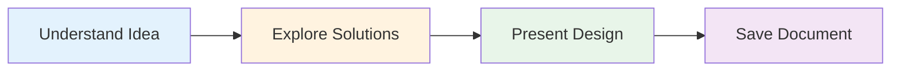

# Design Workflow: Brainstorming

## What You'll Learn

- Engage in structured design conversations with AI agents before coding
- Let AI accurately understand your requirements by asking one question at a time
- Evaluate trade-offs across 2-3 different implementation approaches
- Review design documents segment by segment to ensure each part meets expectations
- Automatically generate formatted design documents and save them to your project

## Your Current Dilemma

**AI agents often "make assumptions"**

Have you encountered this? You tell the AI "help me add user login functionality," and it immediately starts writing code, but the end result isn't what you wanted.

Common problems:
- ❌ AI skips requirement clarification and writes code directly
- ❌ No discussion of alternatives—only provides the "most common" implementation
- ❌ Discovers missing key requirements after implementation
- ❌ Realizes the approach is wrong halfway through coding

Root cause: **AI didn't fully explore and validate the design before coding.**

## When to Use This

The brainstorming skill automatically triggers in these scenarios:

| Scenario | Example |
| -------- | ------- |
| **Creating new features** | "Help me add a user comment feature" |
| **Building components** | "I need a reusable table component" |
| **Adding functionality** | "Add search filtering to existing page" |
| **Modifying behavior** | "Change this button's interaction logic" |

**Core principle**: Any creative work must start with brainstorming.

## Core Concept

The brainstorming workflow is divided into four stages:



### Stage 1: Understand Idea

AI first checks the current project state (files, documentation, recent commits), then **asks one question at a time** to refine your idea.

**Questioning principles**:
- ✅ One question at a time (avoid information overload)
- ✅ Multiple choice preferred (easier to answer)
- ✅ Focus on: purpose, constraints, success criteria

### Stage 2: Explore Solutions

AI proposes 2-3 different implementation approaches with trade-off analysis.

**Presentation approach**:
- Recommend the most suitable approach first and explain why
- List pros and cons of other approaches
- Maintain conversational style, not a technical report

### Stage 3: Present Design

Once AI believes it understands your requirements, it presents the design in segments:

**Segmentation rules**:
- 200-300 words per segment (avoid information overload)
- Ask "Does this look correct?" after each segment
- Cover: architecture, components, data flow, error handling, testing
- Can backtrack for clarification anytime if something doesn't make sense

### Stage 4: Save Document

After design confirmation, AI will:
1. Write the design to `docs/plans/YYYY-MM-DD-<topic>-design.md`
2. Use clear writing style (if `elements-of-style` skill is available)
3. Commit the design document to git

## Follow Along

### Step 1: Present Your Idea

**Why**
Let AI know what you want to do and trigger the brainstorming workflow.

**Example**

```
User input:
I want to add user authentication to this project.

AI response:
Let me first understand the project status...

(AI checks project files, existing code, documentation)

AI continues:
Okay, I see this is a web application. Let me ask a few questions to refine the requirements:

First question: What user authentication method do you expect?
A. Email + password login
B. Third-party login (Google/GitHub)
C. Phone number verification code login
```

**What you should see**: AI first checks project context, then asks the first question.

### Step 2: Answer Questions (Loop)

**Why**
Through multiple iterations, let AI precisely understand your requirements.

**Example**

```
User input:
I choose A, but also want to support B.

AI response:
Got it. Primary authentication is email + password, with Google and GitHub third-party login support.

Next question: Do you need to support "remember me" functionality?
A. Yes, users can stay logged in for 7 days
B. No, users must re-login after closing browser
```

**What you should see**: AI continues to ask the next refinement question based on your answer.

### Step 3: Explore Solutions

**Why**
After AI fully understands requirements, it proposes different implementation approaches for you to choose.

**Example**

```
AI response:
Great, I've understood your requirements. Let me analyze several implementation approaches:

**Approach 1: Self-built authentication system** (recommended)

Pros:
- Complete control over data and behavior
- No external dependencies
- Flexible for future expansion

Cons:
- Need to handle password storage, token management, security details
- Larger development effort

**Approach 2: Use Auth0-like service**

Pros:
- Ready out of the box, quick implementation
- Automatically handles security details
- Supports multiple third-party logins

Cons:
- Paid service (limited free tier)
- Data hosted by third party

I recommend Approach 1, because your project already has its own database architecture,
and long-term self-built systems are more flexible. What do you think?
```

**What you should see**: AI recommends 2-3 approaches, provides trade-off analysis, and expresses a preference.

### Step 4: Segment-by-Segment Design Review

**Why**
Presenting design in segments lets you verify step by step, avoiding information overload.

**Example**

```
User input:
Okay, let's go with Approach 1.

AI response:
Okay, I'll present the detailed design. I'll break it into several parts.

**Part 1: Architecture Design**

The authentication system will use JWT (JSON Web Token) architecture. After successful frontend login,
the backend returns a JWT containing user information and signature, which the frontend stores in localStorage.
Subsequent requests include this token in the Authorization header, and the backend validates the signature
to extract user information.

Token is set to expire in 1 hour, refresh token set to 7 days.

Does this part look correct?
```

**What you should see**: AI presents the first part of the design (architecture) and asks if it's correct.

```
User input:
This part looks good.

AI response:
**Part 2: Database Design**

Need the following tables:
- users: store user basic info (id, email, password_hash, created_at)
- refresh_tokens: store refresh tokens (id, user_id, token_hash, expires_at)
- social_accounts: store third-party account associations (id, user_id, provider, provider_id)

Passwords encrypted with bcrypt, cost factor 10.

Does this part look correct?
```

**What you should see**: AI continues to present the next part of the design (database), asking for confirmation after each part.

### Step 5: Save Design Document

**Why**
Save the confirmed design as a document for future implementation and review.

**Example**

```
User input:
Looks all good.

AI response:
Great! I'll now save the design document.

(AI writes docs/plans/2026-02-01-user-authentication-design.md)

AI continues:
Design document saved: docs/plans/2026-02-01-user-authentication-design.md

I've committed the design document to git.

Ready to set up the implementation environment?
```

**What you should see**:
1. Design document saved to `docs/plans/` directory
2. File committed to git
3. AI asks if you want to proceed to the next stage (setting up environment)

## Checkpoint ✅

**Verify brainstorming workflow is working correctly**

- [ ] AI proactively asks questions before coding
- [ ] Asks only one question at a time
- [ ] Provides multiple choice options (when applicable)
- [ ] Proposes 2-3 implementation approaches with trade-offs
- [ ] Presents design in segments, asking for confirmation after each
- [ ] Design document saved to `docs/plans/` directory
- [ ] Design document committed to git

If any of the above doesn't meet expectations, it might be a skill loading issue. Check the [Installation Guide](../../start/installation/) or [Troubleshooting](../../faq/troubleshooting/).

## Common Pitfalls

### ❌ Pitfall 1: Skipping questions and writing code directly

**Symptom**: You just stated a requirement, and AI immediately starts writing code without asking questions.

**Cause**: brainstorming skill not loaded or triggered correctly.

**Solution**:
1. Check if skill is installed: verify `skills/brainstorming/SKILL.md` exists
2. Confirm skill path is correct: different platforms have different skill discovery mechanisms
3. Manual trigger: use `/brainstorm` command to force invocation

### ❌ Pitfall 2: Asking too many questions at once

**Symptom**: AI asked 3-5 questions in one message, causing information overload.

**Cause**: AI didn't follow the "one question at a time" principle.

**Solution**:
- Remind AI: "One question at a time"
- If too many questions, answer the first few and let AI continue

### ❌ Pitfall 3: Design document not saved

**Symptom**: After design confirmation, no file generated under `docs/plans/`.

**Cause**: AI skipped the "save document" step.

**Solution**:
- Explicitly request: "Please save the design document to docs/plans/ directory"
- Check if `docs/plans/` directory exists; manually create if not

### ❌ Pitfall 4: Design is too complex

**Symptom**: Design document includes many "might need in the future" features.

**Cause**: AI didn't follow the YAGNI principle.

**Solution**:
- Remind AI: "Keep it simple, only implement what's needed now"
- During brainstorming, explicitly state "not needed for now"

## Lesson Summary

Brainstorming is one of Superpowers' core workflows, ensuring:

1. **Design before coding**: Don't skip requirement clarification and solution exploration
2. **One question at a time**: Avoid information overload, refine requirements step by step
3. **Explore alternatives**: Propose 2-3 approaches with trade-offs to make informed choices
4. **Incremental validation**: Present design in small 200-300 word segments for step-by-step confirmation
5. **Document**: Save confirmed design as a document for future implementation

**Remember**: brainstorming is not a suggestion, but a mandatory workflow. AI will automatically trigger this skill before any creative work begins.

## Next Lesson Preview

> In the next lesson, we'll learn **[Planning Workflow: Writing Plans](../planning-workflow/)**.
>
> After design confirmation, you'll learn:
> - How to break down designs into executable small tasks
> - How each task includes complete code and verification steps
> - Ensure plans are clear enough that "engineers without context can execute"

---

## Appendix: Source Code Reference

<details>
<summary><strong>Click to expand source code locations</strong></summary>

> Last updated: 2026-02-01

| Feature | File Path | Line Number |
| ------- | --------- | ----------- |
| Brainstorming skill definition | [`skills/brainstorming/SKILL.md`](https://github.com/obra/superpowers/blob/main/skills/brainstorming/SKILL.md) | 1-55 |
| /brainstorm command definition | [`commands/brainstorm.md`](https://github.com/obra/superpowers/blob/main/commands/brainstorm.md) | 1-7 |
| Workflow overview | [`README.md`](https://github.com/obra/superpowers/blob/main/README.md) | 80-96 |

**Key Principles**:
- One question at a time - Avoid information overload
- Multiple choice preferred - Easier to answer
- YAGNI (You Aren't Gonna Need It) - Remove unnecessary features
- Explore alternatives - Propose 2-3 approaches
- Incremental validation - Present design in segments
- Be flexible - Can backtrack for clarification anytime

**Key Workflows**:
- Understand idea: Check project context → Ask one question at a time
- Explore solutions: Propose 2-3 approaches with trade-offs → Recommend and explain rationale
- Present design: Present in segments (200-300 words) → Confirm after each segment
- Save document: Write to `docs/plans/YYYY-MM-DD-<topic>-design.md` → Commit to git

</details>
