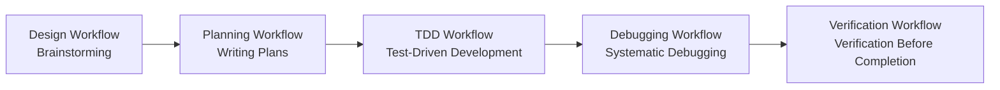

# Core Workflows: Systematic Development Process

This chapter introduces the five core workflows of Superpowers, helping you build systematic development habits. These workflows enforce best practices to ensure code quality, maintainability, and team collaboration efficiency.

::: info Why do we need core workflows?
While AI agents are powerful, without constraints they tend to "cut corners" or over-rationalize. Core workflows provide clear boundaries and processes for AI agents, ensuring every step has verification and evidence.
:::

## What This Chapter Covers

| Course | Description | Difficulty |
| --- | --- | --- |
| [Design Workflow: Brainstorming](../design-workflow/) | Clarify requirements and design before coding to avoid wrong directions | ⭐⭐ |
| [Planning Workflow: Writing Plans](../planning-workflow/) | Write detailed implementation plans that engineers without context can execute | ⭐⭐⭐ |
| [Test-Driven Development: TDD Iron Law](../tdd-workflow/) | Deep dive into the RED-GREEN-REFACTOR cycle | ⭐⭐⭐⭐ |
| [Debugging Workflow: Systematic Debugging](../debugging-workflow/) | Four-phase systematic debugging process to avoid blind fixes | ⭐⭐⭐ |
| [Verification Workflow: Evidence First](../verification-workflow/) | Emphasize the "evidence first" principle to ensure genuine verification before claiming completion | ⭐⭐ |

## Recommended Learning Path

### Recommended Order (Beginners)

1. **Start with Design Workflow**: Understand how to clarify requirements before coding
2. **Learn Planning Workflow**: Master the skills of writing executable plans
3. **Deep Dive into TDD**: This is the most core development process, focus on learning it
4. **Learn Debugging Workflow**: Learn to systematically locate and fix issues
5. **Finally Learn Verification Workflow**: Establish "evidence first" completion standards

### Advanced Learning Path

If you already have some experience, you can learn as needed:

- **Quick Start**: Design Workflow + TDD Workflow
- **Quality Improvement**: TDD Workflow + Debugging Workflow + Verification Workflow
- **Team Collaboration**: Planning Workflow + Verification Workflow

## Prerequisites

::: warning Please confirm before starting
- Completed [Quick Start](../../start/quick-start/)
- Mastered [How to Use Skills](../../start/using-skills/)
- Understand Superpowers core concepts (skills, sub-agents, hook system)
:::

## Next Steps

After completing this chapter, you can continue:

- [Advanced Workflows](../../advanced/) - Learn advanced techniques like sub-agent driven development, code reviews, etc.
- [Extending Features](../../extending/) - Write custom skills to contribute to the team
- [FAQ](../../faq/) - View best practices and troubleshooting

## Value of This Chapter

By learning core workflows, you will gain:

- **Systematic Thinking**: No longer "doing whatever comes to mind," but advancing development with a structured approach
- **Quality Assurance**: TDD iron law and verification workflows ensure code quality
- **Efficiency Improvement**: Design-first and planning workflows avoid wrong directions and rework
- **Traceability**: Each step has clear evidence and documentation

::: tip Remember
The essence of workflows is not to add process burden, but to reduce uncertainty and rework costs.
:::
