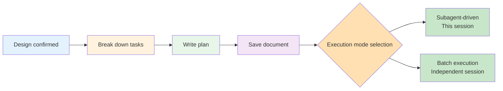

# Planning Workflow: Writing Plans

## What You'll Learn

- Break down designs into executable small tasks (2-5 minutes each)
- Write detailed plans with complete code, file paths, and validation steps
- Ensure plans are clear enough for "zero-context engineers to execute"
- Choose appropriate execution mode (subagent-driven vs batch execution)
- Automatically generate formatted plan documents and save them to your project

## Your Current Situation

**AI agents often "skip planning and write code directly"**

Have you encountered this? After the AI understands your requirements, it starts writing code immediately, but halfway through it realizes:
- No testing framework
- Missing necessary dependencies
- Incomplete test coverage
- Confusing commit messages

Common issues:
- ❌ AI treats large features as a single task, discovering too late that it's too complex
- ❌ Plans only say "implement feature" without specific code or validation steps
- ❌ Dependencies between tasks are confused, leading to wrong execution order
- ❌ Missing review checkpoints, problems only discovered late

Root cause of these issues: **The AI hasn't broken the work down into small enough tasks and recorded complete execution details.**

## When to Use This Approach

The Writing Plans skill is automatically triggered in the following scenarios:

| Scenario | Example |
| ---- | ---- |
| **Multi-step tasks with specs/requirements** | Design document confirmed, needs implementation |
| **Feature development** | "Implement user authentication system" (design completed) |
| **Bug fixes** | "Fix login timeout issue" (root cause identified) |
| **Refactoring work** | "Refactor data access layer" (goals clarified) |

**Core principle**: After design is confirmed, you must write a plan before coding.

## Core Concepts

The core assumption of the Writing Plans workflow is: **Assume the engineer executing the plan has zero context of the codebase and questionable taste.**

This means the plan must include:
- Precise file paths (which files to create, which to modify)
- Complete code (not vague instructions like "add validation")
- Exact commands and expected outputs
- Relevant documentation references (existing docs to consult)
- Detailed steps on how to test



### Task Granularity Principle

**Each task completed in 2-5 minutes**, one action per step:

| ✅ Correct Examples | ❌ Incorrect Examples |
| ---------- | ---------- |
| "Write a failing test" | "Implement user authentication" |
| "Run test to verify failure" | "Add tests" |
| "Write minimal implementation to pass test" | "Fix bug" |
| "Run test to verify pass" | "Update documentation" |
| "Commit code" |  |

### Plan Document Structure

Each plan must include the following header information:

```markdown
# [Feature Name] Implementation Plan

> **AI prompt: Required sub-skill: Use superpowers:executing-plans to execute tasks in this plan

**Goal:** [One-sentence description of what this plan builds]

**Architecture:** [2-3 sentences describing implementation approach]

**Tech Stack:** [Key technologies/libraries]

---
```

### Execution Mode Selection

After the plan is complete, the AI will offer two execution methods:

| Mode | Description | Applicable Scenarios |
| ---- | ---- | -------- |
| **Subagent-driven** | Execute in this session, dispatch new subagent for each task, iterate quickly between tasks | Needs frequent communication and feedback |
| **Batch execution** | Execute in independent session, complete tasks in batches, report and review between batches | Tasks are relatively independent and can be batched |

## Follow Along

### Step 1: Trigger Plan Writing

**Why**
After the design is confirmed, have the AI automatically trigger the writing-plans workflow to write a detailed implementation plan.

**Example**

```
User input:
The design document has been confirmed, let's start implementation.

AI response:
Good, I'll write the implementation plan. I'm using the writing-plans skill.

(AI reads design document)
(AI analyzes implementation steps)
(AI breaks down tasks)
```

**You should see**: The AI announces it's using the writing-plans skill and begins writing the plan.

### Step 2: Break Down Tasks

**Why**
Break large features into 2-5 minute small tasks to ensure each task can be completed and validated independently.

**Example**

```
AI response:
I've broken down the feature into 6 tasks:

**Task 1: Hook Installation Script** (3 minutes)
- Create hook installation script
- Add permission settings
- Write tests

**Task 2: Recovery Mode** (4 minutes)
- Implement verify mode
- Implement repair mode
- Add progress reporting

**Task 3: Error Handling** (3 minutes)
- Add exception catching
- Implement friendly error messages
- Test error scenarios

...

All tasks follow TDD workflow, each task contains complete code and validation steps.
```

**You should see**:
1. Each task has a clear time estimate (2-5 minutes)
2. Each task is a specific action (not an abstract feature)
3. Dependencies between tasks are clear

### Step 3: Write Task Details

**Why**
Zero-context engineers need precise information: file paths, complete code, validation steps, command outputs.

**Example**

```
AI response:
Now I'll write detailed steps for each task.

### Task 1: Hook Installation Script

**Files:**
- Create: `src/hooks/install-hook.js`
- Modify: `package.json:45-48` (add startup script)
- Test: `tests/hooks/test-install-hook.js`

**Step 1: Write failing test**

```javascript
describe('install-hook', () => {
  it('should create hook directory if not exists', async () => {
    await installHook();
    expect(fs.existsSync('.superpowers/hooks')).toBe(true);
  });
});
```

**Step 2: Run test to verify failure**

Run: `npm test -- tests/hooks/test-install-hook.js`
Expected: FAIL, error "install-hook is not defined"

**Step 3: Write minimal implementation**

```javascript
import fs from 'fs/promises';
import path from 'path';

export async function installHook() {
  const hooksDir = '.superpowers/hooks';
  await fs.mkdir(hooksDir, { recursive: true });
}
```

**Step 4: Run test to verify pass**

Run: `npm test -- tests/hooks/test-install-hook.js`
Expected: PASS

**Step 5: Commit**

```bash
git add src/hooks/install-hook.js tests/hooks/test-install-hook.js package.json
git commit -m "feat: add hook installation script"
```
```

**You should see**:
1. Each task lists precise file paths to create/modify/test
2. Each step has complete code (not descriptions like "add validation")
3. Each step has exact commands and expected outputs
4. TDD cycle: RED → GREEN → COMMIT

### Step 4: Save Plan Document

**Why**
Save the plan as a document for easy execution and review, and as part of the project knowledge base.

**Example**

```
AI response:
Plan writing complete, saving to docs/plans/.

(AI writes to docs/plans/2026-02-01-hook-recovery-system.md)

AI continues:
Plan saved: docs/plans/2026-02-01-hook-recovery-system.md

I'll commit this plan document now.

(AI executes git commit)
```

**You should see**:
1. Plan document saved to `docs/plans/` directory
2. File name format: `YYYY-MM-DD-<feature-name>.md`
3. Plan document committed to git

### Step 5: Choose Execution Mode

**Why**
Different execution modes suit different scenarios. Choosing the right mode improves efficiency.

**Example**

```
AI response:
Plan completed and saved to `docs/plans/2026-02-01-hook-recovery-system.md`.

There are two execution options:

**1. Subagent-driven (this session)**
- I'll dispatch a new subagent for each task
- Review between tasks
- Fast iteration, frequent feedback

**2. Batch execution (independent session)**
- Open worktree in new session
- Execute 3 tasks per batch
- Review between batches

Which method would you like to use?
```

**You should see**: The AI clearly provides two execution methods and explains their pros and cons.

```
User input:
I want to use subagent-driven because we might need frequent adjustments.

AI response:
Good, I'll use subagent-driven development to execute this plan.

I'm using the subagent-driven-development skill.
```

**Or**

```
User input:
Tasks are relatively independent, I'll use batch execution so I can handle other things in another terminal in parallel.

AI response:
Good, please open a new session in the worktree and use the /write-plan command to load this plan.

The new session will use the executing-plans skill, execute tasks in batches and report between batches.
```

**You should see**:
- Subagent-driven: AI continues execution in the current session
- Batch execution: AI guides you to open a new session and execute in a worktree

## Checkpoint ✅

**Verify that writing-plans workflow is working correctly**

- [ ] AI automatically writes plans after design is confirmed
- [ ] Task granularity is 2-5 minutes per task
- [ ] Each task includes precise file paths
- [ ] Each step has complete code (not vague instructions)
- [ ] Each step has exact commands and expected outputs
- [ ] TDD cycle: write test → verify failure → write implementation → verify pass → commit
- [ ] Plan document saved to `docs/plans/` directory
- [ ] Plan document committed to git
- [ ] AI offers two execution methods to choose from

If any of the above don't meet expectations, it may be a skill loading issue. Please check the [Installation Guide](../../start/installation/) or [Troubleshooting](../../faq/troubleshooting/).

## Common Pitfalls

### ❌ Pitfall 1: Tasks too large, cannot be completed in 2-5 minutes

**Symptoms**: Plans include tasks like "implement user authentication", "refactor data layer".

**Cause**: The AI didn't follow the "task granularity" principle.

**Solution**:
- Remind the AI: "Each task should be completed within 2-5 minutes"
- If a task is too large, ask the AI to continue breaking it down: "Please break down task 1 into smaller steps"

### ❌ Pitfall 2: Plans only say "do X" without specific code

**Symptoms**: Step content is "add validation logic", "write tests", but no code examples.

**Cause**: The AI didn't follow the "complete code" principle.

**Solution**:
- Remind the AI: "Please provide complete code examples"
- Emphasize "Assume the engineer has zero context, needs exact implementation"

### ❌ Pitfall 3: Missing file paths

**Symptoms**: Tasks don't clearly specify which files to create or modify.

**Cause**: The AI didn't follow the "precise file paths" principle.

**Solution**:
- Ask the AI to list a "Files" section in each task
- Format: `Create:`, `Modify:path:line-range`, `Test:`

### ❌ Pitfall 4: Missing validation steps

**Symptoms**: No steps to run tests or validation after writing code.

**Cause**: The AI skipped TDD validation.

**Solution**:
- Remind the AI: "Each task must include validation steps"
- Ensure "Step 2: Run test to verify failure" and "Step 4: Run test to verify pass" both exist

### ❌ Pitfall 5: Entering next task without committing code

**Symptoms**: After tests pass, immediately write code for the next task without committing.

**Cause**: The AI didn't follow the "frequent commits" principle.

**Solution**:
- Ensure the last step of the TDD cycle is "Step 5: Commit"
- Commit messages should be clear: `feat: add specific feature`

### ❌ Pitfall 6: Choosing the wrong execution mode

**Symptoms**: Using batch execution for tasks needing frequent feedback, causing rework; or using subagent-driven for independent tasks, inefficient.

**Cause**: Not choosing the appropriate execution mode based on task characteristics.

**Solution**:
- **Need frequent feedback** → Subagent-driven (quick review between tasks)
- **Tasks relatively independent** → Batch execution (report between batches, can work in parallel)

## Summary

Writing Plans is step 3 of the Superpowers core workflow. It ensures:

1. **Zero-context assumption**: Assume engineers have zero context of the codebase, record all necessary information
2. **Task granularity**: Each task 2-5 minutes, one action per step
3. **Complete code**: Don't use vague instructions like "add validation", provide exact implementation
4. **TDD cycle**: Write test → verify failure → write implementation → verify pass → commit
5. **Plan documentation**: Save to `docs/plans/` for easy execution and review
6. **Execution mode selection**: Provide both subagent-driven and batch execution options

**Remember**: writing-plans is not a suggestion, but a mandatory workflow. The AI will automatically trigger this skill after design is confirmed.

## Coming Up Next

> In the next lesson, we'll learn **[Test-Driven Development: TDD Iron Law](../tdd-workflow/)**.
>
> During plan execution, you'll learn:
> - How to follow the RED-GREEN-REFACTOR cycle
> - Correct common TDD misconceptions (e.g., "write implementation first, then tests")
> - Why "no code without tests" is an iron rule

---

## Appendix: Source Code Reference

<details>
<summary><strong>Click to expand source code locations</strong></summary>

> Updated: 2026-02-01

| Feature | File Path | Lines |
| ----------- | ------------------------------------------------------------------------------------------- | ------- |
| Writing Plans Skill Definition | [`skills/writing-plans/SKILL.md`](https://github.com/obra/superpowers/blob/main/skills/writing-plans/SKILL.md) | 1-117   |
| /write-plan Command Definition | [`commands/write-plan.md`](https://github.com/obra/superpowers/blob/main/commands/write-plan.md) | 1-7     |
| Executing Plans Skill Definition | [`skills/executing-plans/SKILL.md`](https://github.com/obra/superpowers/blob/main/skills/executing-plans/SKILL.md) | 1-85    |
| Subagent-driven Development Skill Definition | [`skills/subagent-driven-development/SKILL.md`](https://github.com/obra/superpowers/blob/main/skills/subagent-driven-development/SKILL.md) | 1-243   |
| Workflow Overview | [`README.md`](https://github.com/obra/superpowers/blob/main/README.md) | 80-96   |

**Key Principles**:
- Zero context assumption - Assume engineers have zero context of the codebase
- Bite-sized tasks - Each task completed in 2-5 minutes
- Complete code - Provide exact implementation, not vague instructions
- TDD cycle (RED-GREEN-REFACTOR) - Write test → verify failure → write implementation → verify pass → commit
- DRY (Don't Repeat Yourself) - Avoid duplicate code
- YAGNI (You Aren't Gonna Need It) - Only do features needed right now
- Frequent commits - Commit after each task completion

**Key Processes**:
- Writing plan: Read design document → Break down tasks (2-5 minutes/task) → Write detailed steps (complete code + validation) → Save to `docs/plans/YYYY-MM-DD-<feature-name>.md` → Commit to git
- Execution mode selection: Subagent-driven (this session, fast iteration) vs Batch execution (independent session, batch reports)
- Subagent-driven: Dispatch implementation subagent → Specification compliance review → Code quality review → Next task
- Batch execution: Critically review plan → Execute first batch (default 3 tasks) → Report → Next batch

**Execution Mode Comparison**:
| Dimension | Subagent-driven | Batch Execution |
| ---- | ---------- | -------- |
| Session | This session (no context switching) | Independent session (new worktree) |
| Agent | New subagent per task | Same agent executes a batch of tasks |
| Review | Auto review after each task | Report between batches, wait for human review |
| Iteration | Fast (no human intervention between tasks) | Slow (human feedback needed between batches) |
| Applicable scenarios | Need frequent adjustments | Tasks relatively independent, can parallelize |

</details>
