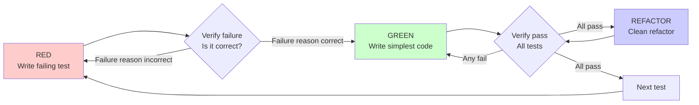

# Test-Driven Development: TDD Iron Rule

## What You'll Learn

- Force AI agents to strictly follow the RED-GREEN-REFACTOR loop
- Identify and correct common TDD rationalization excuses (like "this is simple" or "I already tested it manually")
- Correctly apply TDD in new features, bug fixes, and refactoring
- Verify that tests are actually testing the right thing (see them fail first)
- Write high-quality tests (single behavior, clear names, show intent)
- Use verification checklist to ensure TDD workflow is completely executed

## Your Current Struggles

**AI agents frequently skip tests and write code directly**

Have you encountered this situation? You tell AI "help me fix this bug," and it immediately starts changing code, but after the fix, you discover it introduced new problems.

Common problems:
- ❌ AI says "this is simple, no need to test"
- ❌ Writing tests after code is done, tests pass immediately (meaning nothing was tested)
- ❌ Fixing one bug, introducing three new bugs
- ❌ Functionality suddenly breaks after refactoring
- ❌ "I already tested it manually, don't worry"

Root cause of these problems: **AI didn't write tests before writing code.**

::: info What is TDD?

TDD (Test-Driven Development) is a development methodology that requires writing tests before writing production code.

Core loop:
1. **RED**: Write a failing test
2. **GREEN**: Write the simplest code to make it pass
3. **REFACTOR**: Clean up and refactor code

**Key principle**: If you haven't seen the test fail, you don't know if it's testing the right thing.
:::

## When to Use This Technique

The TDD skill is automatically triggered in the following scenarios:

| Scenario | Example |
| --- | --- |
| **New Feature** | "Help me add a user comment feature" |
| **Bug Fix** | "Fix the issue where empty email is accepted" |
| **Refactoring** | "Refactor this function to make it clearer" |
| **Behavior Change** | "Change the button click logic" |

**Exception cases (require manual authorization)**:
- Discarded prototype code
- Auto-generated code
- Configuration files

**Core Iron Rule**:
```
NO PRODUCTION CODE WITHOUT A FAILING TEST FIRST
(No production code without a failing test first)
```

## Core Approach

The core of TDD is the RED-GREEN-REFACTOR loop, with mandatory verification steps in each phase:



### RED Phase: Write Failing Test

Write a **minimal test** that demonstrates expected behavior.

**Test quality requirements**:
- ✅ Single behavior (split if test name contains "and")
- ✅ Clear name (describe behavior, not `test1`)
- ✅ Show intent (explain what code should do, not how)
- ✅ Use real code (don't use mock unless unavoidable)

### Verify RED: See It Fail

**Mandatory requirement, never skip.**

Check items:
- Test fails (not error)
- Failure message matches expectations
- Failure is due to missing functionality (not typo)

If test passes immediately? You're testing existing behavior, need to modify test.
If test errors? Fix error first until it fails correctly.

### GREEN Phase: Write Simplest Code

Write the **simplest code** to make the test pass.

**Key principles**:
- Don't add extra features
- Don't refactor other code
- Don't "improve" beyond test scope
- Avoid over-engineering (YAGNI principle)

### Verify GREEN: See It Pass

**Mandatory requirement.**

Check items:
- Test passes
- Other tests still pass
- Output is clean (no errors, warnings)

If other tests fail? Fix now, don't delay.

### REFACTOR Phase: Clean Up Code

While keeping tests passing:
- Remove duplicate code
- Improve naming
- Extract helper functions

**Key**: Don't add new behavior, keep all tests green.

## Follow Along

### Step 1: Fix Bug - Write Failing Test

**Why**
By having the test fail first, ensure it's actually testing this bug.

**Practical Example: Fix bug where empty email is accepted**

```typescript
// RED phase: Write failing test
test('reject empty email', async () => {
  const result = await submitForm({ email: '' });
  expect(result.error).toBe('Email required');
});
```

**You should see**: This is a clear, single test that describes expected behavior.

### Step 2: Verify RED - See Test Fail

**Why**
Confirm the test is actually testing this bug, not existing behavior.

**Operation Example**

```bash
$ npm test submitForm.test.ts

FAIL submitForm.test.ts
  ● reject empty email

    expect(result.error).toBe('Email required')
    Received: undefined

      at Object.<anonymous> (submitForm.test.ts:3:28)
```

**You should see**: Test fails, error message shows `result.error` is `undefined`, confirming functionality is indeed missing.

::: warning Checkpoint
If test **passes immediately**, you're testing existing behavior, need to modify test.
If test **errors** (like syntax error), fix error first, then run.
:::

### Step 3: GREEN - Write Simplest Code

**Why**
Write the simplest code to make test pass, avoid over-engineering.

**Operation Example**

```typescript
// GREEN phase: Write simplest code
function submitForm(data: FormData) {
  if (!data.email?.trim()) {
    return { error: 'Email required' };
  }
  // ... other logic
}
```

**Should note**:
- Only add logic to validate empty email
- Don't add other validation rules
- Don't refactor existing code
- Keep it simplest

### Step 4: Verify GREEN - See Test Pass

**Why**
Confirm fix is effective and doesn't break other functionality.

**Operation Example**

```bash
$ npm test submitForm.test.ts

PASS submitForm.test.ts
  ✓ reject empty email

Test Suites: 1 passed, 1 total
Tests:       1 passed, 1 total
```

**You should see**: Test passes, no other errors.

::: warning Checkpoint
If **other tests fail**, fix now, don't delay.
If there are **warnings or error outputs**, clean up before continuing.
:::

### Step 5: REFACTOR - Clean Up Code

**Why**
Improve code quality while keeping tests passing.

**Operation Example**

Assume need to validate multiple fields:

```typescript
// REFACTOR phase: Extract validation logic
function validateRequired(fields: Record<string, string>, fieldName: string) {
  const value = fields[fieldName]?.trim();
  if (!value) {
    return { error: `${fieldName} required` };
  }
}

function submitForm(data: FormData) {
  const emailError = validateRequired(data, 'email');
  if (emailError) return emailError;

  const passwordError = validateRequired(data, 'password');
  if (passwordError) return passwordError;

  // ... other logic
}
```

**Verify refactoring**

```bash
$ npm test

PASS submitForm.test.ts
  ✓ reject empty email
  ✓ reject empty password

Test Suites: 1 passed, 1 total
Tests:       2 passed, 2 total
```

**You should see**: All tests still pass, code is clearer.

### Step 6: New Feature - Repeat Loop

**Why**
Every new behavior starts with RED.

**Practical Example: Add email format validation**

```typescript
// RED phase: New test
test('reject invalid email format', async () => {
  const result = await submitForm({ email: 'invalid-email' });
  expect(result.error).toBe('Invalid email format');
});
```

**Verify RED**:

```bash
$ npm test submitForm.test.ts

FAIL submitForm.test.ts
  ● reject invalid email format

    expect(result.error).toBe('Invalid email format')
    Received: undefined
```

**GREEN phase**:

```typescript
function isValidEmail(email: string): boolean {
  const emailRegex = /^[^\s@]+@[^\s@]+\.[^\s@]+$/;
  return emailRegex.test(email);
}

function submitForm(data: FormData) {
  // ... validate required fields

  if (data.email && !isValidEmail(data.email)) {
    return { error: 'Invalid email format' };
  }

  // ... other logic
}
```

**Verify GREEN**:

```bash
$ npm test submitForm.test.ts

PASS submitForm.test.ts
  ✓ reject empty email
  ✓ reject invalid email format
```

## Checkpoints ✅

**Verify TDD workflow is complete**

- [ ] Every new function/method has tests
- [ ] See test fail before implementation (verify RED)
- [ ] Each test fails for correct reason (missing functionality, not typo)
- [ ] Wrote simplest code to make test pass
- [ ] All tests pass (verify GREEN)
- [ ] Output is clean (no errors, warnings)
- [ ] Tests use real code (mocks only when unavoidable)
- [ ] Edge cases and error handling covered

If any of the above doesn't match, TDD was skipped, need to start over.

::: danger Iron Rule Violation
If you discover code was written without a failing test, you must:
1. Delete the code
2. Start over from RED phase

Don't "keep as reference," don't "write tests while changing code."
Delete means delete, this is the only way to fix TDD workflow.
:::

## Common Pitfalls

### ❌ Pitfall 1: "This is simple, no need to test"

**Symptom**: AI says "this feature is only a few lines of code, not worth writing tests."

**Problem**: Simple code also has bugs, tests only take 30 seconds.

**Solution**:
- Mandatory principle: simpler code should be tested more
- Remind AI: "Follow TDD, write tests first"

### ❌ Pitfall 2: "I'll write code first, then add tests"

**Symptom**: Code is done, tests pass immediately (nothing tested).

**Problem**: Adding tests after can't verify test correctness.

**Solution**:
- Iron rule: Write failing test first
- If code already written, must delete and start over

### ❌ Pitfall 3: "Adding tests after achieves same result"

**Symptom**: AI says "tests before or after are the same, why be pedantic about order."

**Problem**:
- Adding tests after answers "what does this code do?" (verifies existing implementation)
- Writing tests first answers "what should this code do?" (defines expected behavior)
- Adding tests after is affected by implementation bias, easy to miss edge cases

**Solution**:
- Emphasize: writing tests first discovers edge cases
- Adding tests after only verifies remembered scenarios, not what should be tested

### ❌ Pitfall 4: "I already tested it manually"

**Symptom**: AI says "I tested it manually, all edge cases covered."

**Problem**:
- Manual testing is temporary, can't be repeated
- No test records, can't verify after code changes
- Easy to miss scenarios under pressure

**Solution**:
- Automated testing is systematic, same every time
- Manual testing ≠ comprehensive testing
- "I tried and it works" ≠ comprehensive coverage

### ❌ Pitfall 5: "Deleting X hours of code is wasteful"

**Symptom**: AI wrote 2 hours of code, discovers no tests, unwilling to delete.

**Problem**: Sunk cost fallacy. Time is wasted, but keeping untrusted code is technical debt.

**Solution**:
- Option 1: Delete and rewrite with TDD (X hours, high confidence)
- Option 2: Keep and add tests (30 minutes, low confidence, may still have bugs)
- Real waste is keeping untrusted code

### ❌ Pitfall 6: "TDD is too dogmatic, I'm pragmatic"

**Symptom**: AI uses "pragmatic" as excuse to skip TDD.

**Problem**: TDD itself is pragmatic:
- Discover bugs before commit (faster than debugging)
- Prevent regression (tests catch breaks immediately)
- Document behavior (tests show how to use code)
- Support refactoring (freely modify, tests catch problems)

"Pragmatic" shortcuts = production debugging = slower.

### ❌ Pitfall 7: "Passing tests don't prove anything, I'll change code directly"

**Symptom**: AI thinks writing tests first is wasteful, changing code directly is faster.

**Problem**:
- If code already passes tests, tests aren't testing anything
- Writing tests first forces you to see it fail, proving it's actually testing something
- Adding tests after, you never know if tests are correct

**Solution**:
- Core principle: If you haven't seen test fail, you don't know what it's testing
- Tests first = edge case discovery
- Tests after = remembered edge case verification

## Red Flags - Must Start Over

If any of the following occurs, **delete code, start over with TDD**:

- [ ] Wrote code before tests
- [ ] Added tests after implementation
- [ ] Tests pass immediately
- [ ] Can't explain why test fails
- [ ] Tests added "later"
- [ ] Rationalized "just this once"
- [ ] "I already tested it manually"
- [ ] "Adding tests after achieves same result"
- [ ] "It's about spirit, not ritual"
- [ ] "Keep as reference" or "modify existing code"
- [ ] "Already spent X hours, deleting is wasteful"
- [ ] "TDD is too dogmatic, I'm pragmatic"
- [ ] "This situation is different, because..."

**Remember: Violating the letter of the rules is violating the spirit of the rules.**

## Lesson Summary

The TDD skill ensures, through the RED-GREEN-REFACTOR loop:

1. **Test-Driven**: Write failing test first, see it fail, prove test is correct
2. **Simplest Implementation**: Write simplest code to make test pass, avoid over-engineering
3. **Mandatory Verification**: Each phase must be verified (RED actually fails, GREEN actually passes)
4. **Clean Refactoring**: Safely refactor under test protection, improve code quality
5. **Zero Tolerance**: Any violation of the iron rule must start over

**Remember**: TDD is not a suggestion, but a mandatory workflow. AI will automatically trigger this skill before any feature implementation, bug fix, or refactoring.

## Next Lesson Preview

> In the next lesson, we'll learn **[Debugging Workflow: Systematic Debugging](../debugging-workflow/)**.
>
> When TDD tests fail, you'll learn:
> - How to systematically locate the root cause
> - Four-phase debugging workflow (observe, hypothesize, verify, fix)
> - Common pitfalls of "blind modifications"
> - Ensure fixes truly solve problems, not just mask symptoms

---

## Appendix: Source Code Reference

<details>
<summary><strong>Click to expand source code locations</strong></summary>

> Updated: 2026-02-01

| Feature | File Path | Line Number |
| --- | --- | --- |
| TDD skill definition | [`skills/test-driven-development/SKILL.md`](https://github.com/obra/superpowers/blob/main/skills/test-driven-development/SKILL.md) | 1-372 |
| Workflow overview | [`README.md`](https://github.com/obra/superpowers/blob/main/README.md) | 80-96 |

**Key Principles**:
- Iron rule: No production code without a failing test first
- Core principle: If you haven't seen test fail, you don't know if it's testing the right thing
- Violating letter of rules is violating spirit of rules

**Iron Rule Violation Handling**:
- Wrote code without test? Delete code, start over
- Don't keep "reference code," don't "write tests while changing code"
- Delete means delete, this is the only way to fix TDD workflow

**RED-GREEN-REFACTOR Loop**:
1. **RED**: Write failing test → Verify failure correctness (not error, not already passed)
2. **GREEN**: Write simplest code → Verify all tests pass
3. **REFACTOR**: Clean refactor → Keep tests green

**Quality Standards**:
- Single behavior: Split if test name contains "and"
- Clear name: Describe behavior, not `test1`
- Show intent: Explain what should be done, not how
- Use real code: Don't use mock unless unavoidable

**Common Rationalization Excuses** (need to identify and correct):
- "This is simple, no need to test" - Simple code also has bugs
- "I'll write code first, then add tests" - Adding tests after can't verify correctness
- "Adding tests after achieves same result" - Tests first defines behavior, tests after verifies implementation
- "I already tested it manually" - Manual testing is temporary, can't be repeated
- "Deleting X hours of code is wasteful" - Sunk cost fallacy, keeping untrusted code is technical debt
- "TDD is too dogmatic, I'm pragmatic" - TDD itself is pragmatic (discover bugs earlier, prevent regression)
- "Passing tests don't prove anything" - Writing tests first can prove test correctness

**Red Flags - Must Start Over Signals**:
- Wrote code before tests
- Added tests after implementation
- Tests pass immediately
- Can't explain why test fails
- Tests added "later"
- Any form of rationalization excuses

**Exception Cases** (require manual authorization):
- Discarded prototype code
- Auto-generated code
- Configuration files

**Bug Fix Example** (extracted from source):
- Bug: Empty email is accepted
- RED: Write test `expect(result.error).toBe('Email required')`
- Verify RED: Test fails, error message `undefined`
- GREEN: Add `if (!data.email?.trim())` check
- Verify GREEN: Test passes
- REFACTOR: Extract validation logic (if needed)

**Verification Checklist**:
- [ ] Every new function/method has tests
- [ ] See test fail before implementation
- [ ] Each test fails for correct reason (missing functionality, not typo)
- [ ] Wrote simplest code to make test pass
- [ ] All tests pass
- [ ] Output is clean (no errors, warnings)
- [ ] Tests use real code (mocks only when unavoidable)
- [ ] Edge cases and error handling covered

</details>
