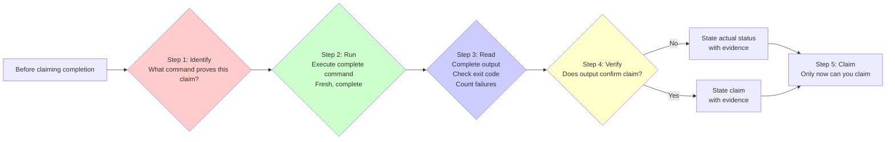

# Verification Workflow: Evidence First

## What You'll Learn

- Force AI agents to run verification commands and provide evidence before claiming completion
- Identify and prevent various "lazy" behaviors (e.g., "should pass", "looks fine")
- Correctly apply the gate function workflow (Identify → Run → Read → Verify → Claim)
- Distinguish between genuine verification and partial verification (Linter ≠ compiler, agent report ≠ actual verification)
- Avoid rationalizations (just this once, I'm confident)
- Enforce verification before commits, PR creation, and task completion

## Your Current Problem

**AI agents often claim completion without verification**

Have you encountered this situation? AI says "fixed it", but when you run the tests, they still fail. Or AI says "tests passed", but when you check the output, there are 3 failures.

Common problems:
- ❌ AI says "should be fine now" (but didn't actually run verification)
- ❌ AI relies on previous test results (didn't re-run)
- ❌ AI thinks Linter passing means build success
- ❌ AI trusts the agent's "success" report (without independent verification)
- ❌ AI expresses satisfaction before remembering to verify ("Great! Let me verify...")

Root cause of these problems: **AI did not provide genuine verification evidence before claiming completion**.

::: info What is Evidence First?

Evidence First is a workflow principle that requires running verification commands and checking output before making any completion claims.

Core iron rule:
```
NO COMPLETION CLAIMS WITHOUT VERIFICATION EVIDENCE
```

This means:
- You cannot claim it passed if you haven't run verification in this message
- Trusting agent reports = no verification
- Partial verification (e.g., only looking at Linter) ≠ complete verification
:::

## When to Use This Technique

The verification skill will automatically trigger in the following scenarios:

| Scenario | Example |
| ---- | ---- |
| **Claiming completion** | "Fix completed", "Task finished" |
| **Claiming pass** | "Tests passed", "Linter clean" |
| **Claiming success** | "Build succeeded", "Deploy successful" |
| **Expressing satisfaction** | "Great!", "Perfect!", "Done!" |
| **Before commit/PR** | "I'm committing", "Creating PR" |
| **After agent completion** | "Agent reports success" |
| **Moving to next task** | "This task is done, next one" |

**Core iron rule**:
```
NO COMPLETION CLAIMS WITHOUT FRESH VERIFICATION EVIDENCE
```

**Trigger conditions**:
- Any form of success/completion claim
- Any expression of satisfaction
- Any positive statement about work status
- Before commits, PR creation, task completion

## Core Concept

The core of the verification workflow is the **Gate Function**, which must be passed before making any status claim or expressing satisfaction.



### Gate Function 5-Step Workflow

**Step 1: Identify**
- Question: What command proves this claim?
- Example: Claim "tests pass" → Identify command `npm test`

**Step 2: Run**
- Requirement: Execute **complete** command (fresh, complete)
- Example: Run `npm test -- --coverage` (not just `npm test` for a quick look)

**Step 3: Read**
- Requirement: Read complete output, check exit code, count failures
- Example: Check output "Tests: 34 passed, 2 failed"

**Step 4: Verify**
- Requirement: Does output confirm claim?
- No: State actual status + evidence
- Yes: State claim + evidence

**Step 5: Claim**
- Requirement: Only now can you claim

**Key rule**: Skipping any step = lying, not verification

### Verification Iron Rule

```
If you haven't run the verification command in this message, you cannot claim it passed.
```

**Violation examples**:
- ❌ "Should pass" (didn't run)
- ❌ "Passed before, should be fine" (not fresh verification)
- ❌ "Linter passed" (partial verification)
- ❌ "Agent reported success" (no independent verification)
- ❌ "Looks fine" (subjective judgment, no command output)

**Correct examples**:
- ✅ `[Run npm test] [See: 34/34 pass] "All tests pass"`
- ✅ `[Run build] [See: exit 0] "Build succeeded"`
- ✅ `[Run linter] [See: 0 errors] "Code is clean"`
## Follow Along

### Step 1: Identify Verification Command

**Why**
Know what command proves your claim, avoiding blind guessing or using incorrect verification methods.

**Practical example: Claiming "tests pass"**

**Identify command**:
```bash
npm test
```

**You should see**: A clear verification command that can test what you're claiming.

::: tip Tip
Different claims require different verification commands:
- "Tests pass" → `npm test`
- "Build succeeded" → `npm run build`
- "Linter clean" → `npm run lint`
- "Bug fixed" → Test that reproduces original symptom
:::

### Step 2: Run Complete Command

**Why**
Execute complete, fresh verification, avoiding reliance on cache or partial output.

**Operation example**

```bash
$ npm test
```

**Pay attention to**:
- Run **complete** command (don't omit parameters)
- **Fresh** run (don't rely on previous output)
- Wait for complete execution to finish

**You should see**: Complete command execution process and output.

::: warning Checkpoint
Don't rely on previous test results. You must re-run verification before every completion claim.
:::

### Step 3: Read Complete Output

**Why**
Read output completely, check exit code, count failures, avoid just looking at the surface of "looks fine".

**Operation example**

```bash
$ npm test

PASS src/utils/format.test.ts
PASS src/components/Button.test.ts
FAIL src/api/user.test.ts
  ● User API
    expect(mockUser.id).toBe(1)
    Received: undefined

Test Suites: 2 passed, 1 failed, 3 total
Tests:       18 passed, 2 failed, 20 total
```

**You should see**:
- Complete test output
- Number of failed tests (2 failed)
- Specific failure reasons (`mockUser.id` is `undefined`)

**Key checks**:
- What is the exit code? (non-zero = failure)
- How many failures? (2 failed)
- What is the failure reason? (specific error message)

::: danger Warning
Don't just look at the "PASS" parts, ignore "FAIL".
Don't just check if logs "look normal", don't check exit code.
Don't just look at "mostly passed", ignore individual failures.
:::

### Step 4: Verify Output

**Why**
Confirm that output actually supports your claim, avoiding subjective judgment.

**Operation example**

**Case 1: Output doesn't support claim**

```bash
$ npm test
Tests: 18 passed, 2 failed, 20 total
```

**Correct claim**:
```
"Test run completed with 2 failures:
- User API: mockUser.id is undefined
- [another failure]

Need to fix these failures before claiming tests pass."
```

**Case 2: Output supports claim**

```bash
$ npm test
Test Suites: 1 passed, 1 total
Tests:       34 passed, 34 total
```

**Correct claim**:
```
"[Run npm test] [See: 34/34 pass] All tests pass."
```

**You should see**:
- Claim based on actual output
- Contains specific evidence (number of failures, number of passes)
- Doesn't use vague words like "should", "probably"

### Step 5: Claim Result

**Why**
Only after completing the previous 4 steps can you make a claim.

**Operation example**

**Incorrect example** (skip verification):
```
"Tests should pass now."
```

**Correct example** (complete verification):
```
"[Run npm test] [See: 34/34 pass] All tests pass."
```

**Incorrect example** (partial verification):
```
"Linter passed, so build should be fine."
```

**Correct example** (complete verification):
```
"[Run npm run build] [See: exit 0] Build succeeded."
```

**You should see**:
- Verification command run before claim
- Claim contains verification evidence
- Claim is clear and accurate

## Checkpoints ✅

**Is verification workflow complete**

- [ ] Identified verification command
- [ ] Ran complete command (fresh, complete)
- [ ] Read complete output (including failures, errors)
- [ ] Verified if output supports claim
- [ ] Claim contains specific evidence
- [ ] Didn't use vague words like "should", "probably"
- [ ] Didn't rely on previous test results
- [ ] Didn't trust agent report, verified independently

If any of the above doesn't apply, it means verification was skipped and needs to restart.

::: danger Iron Rule Violation
If found claiming completion without verification, you must:
1. Withdraw the claim
2. Run complete verification
3. Re-claim based on actual output

Don't "should be fine", don't "claim first then verify", don't "trust agent report".
Verification is a prerequisite for claiming completion, not an optional step.
:::

## Common Pitfalls

### ❌ Pitfall 1: "Should pass"

**Symptom**: AI says "code is fixed, should pass now".

**Problem**: Didn't run verification command, this is guessing not verification.

**Solution**:
- Run verification command
- Check actual output
- Re-claim based on output

**Correct example**:
```
"Let me verify... [Run npm test] [See: 34/34 pass] All tests pass."
```

### ❌ Pitfall 2: "Passed before, should be fine"

**Symptom**: AI relies on previous test results, didn't re-run.

**Problem**: Previous test results don't represent current state.

**Solution**:
- Re-run verification before every completion claim
- Don't rely on cache or historical results

**Correct example**:
```
"Let me re-verify... [Run npm test] [See: 34/34 pass] All tests pass."
```

### ❌ Pitfall 3: "Linter passed"

**Symptom**: AI uses Linter instead of complete build or test verification.

**Problem**: Linter ≠ compiler, Linter passing doesn't mean build succeeded.

**Solution**:
- Linter checks code style
- Build command checks compilation
- Test command checks functionality

**Correct example**:
```
"[Run npm run build] [See: exit 0] Build succeeded."
```

### ❌ Pitfall 4: "Agent reported success"

**Symptom**: AI trusts sub-agent's "success" report, no independent verification.

**Problem**: Agent report ≠ actual verification, needs independent confirmation.

**Solution**:
- After agent completes, check VCS diff
- Run your own verification command
- Claim status based on actual output

**Correct example**:
```
"Agent reported success. Let me verify... [Check git diff] [See: 3 files changed] [Run npm test] [See: 34/34 pass] Work complete."
```

### ❌ Pitfall 5: "Looks fine"

**Symptom**: AI based on subjective judgment, didn't run command.

**Problem**: Subjective judgment is unreliable, needs objective evidence.

**Solution**:
- Run verification command
- Check specific output
- Don't rely on "looks"

**Correct example**:
```
"Let me verify... [Run npm test] [See: 34/34 pass] Tests pass."
```

### ❌ Pitfall 6: "I'm confident"

**Symptom**: AI uses "confidence" instead of verification.

**Problem**: Confidence ≠ evidence, must verify.

**Solution**:
- Confidence is important, but verification is more important
- Run command to get evidence

**Correct example**:
```
"I'm confident about the changes, but let me verify... [Run npm test] [See: 34/34 pass] Confirmed pass."
```

### ❌ Pitfall 7: "Just this once"

**Symptom**: AI uses "special case" as excuse to skip verification.

**Problem**: No exceptions, verification is mandatory requirement.

**Solution**:
- Mandatory principle: no verification, no claim
- No special cases

**Correct example**:
```
"Even though this is a small change, I must verify... [Run npm test] [See: 1/1 pass] Confirmed pass."
```

### ❌ Pitfall 8: "I'm tired"

**Symptom**: AI uses "fatigue" as excuse to skip verification.

**Problem**: Fatigue ≠ reason, verification has no exceptions.

**Solution**:
- Verify more when tired
- Fatigue causes errors

**Correct example**:
```
"I'm tired, but must verify... [Run npm test] [See: 34/34 pass] Confirmed pass."
```

## Common Failure Cases

| Claim | What's Needed | Insufficient |
| ---- | ---- | ---- |
| Tests pass | Test command output: 0 failures | Previous run, "should pass" |
| Linter clean | Linter output: 0 errors | Partial check, inference |
| Build succeeded | Build command: exit code 0 | Linter passed, logs look normal |
| Bug fixed | Test original symptom: passed | Code changed, assumed fixed |
| Regression test works | Red-green cycle verified | Tests passed once |
| Agent completed | VCS diff shows changes | Agent report "success" |
| Requirements met | Check checklist line by line | Tests pass |

## Red Flags - Must Stop

If any of the following occur, **stop immediately and verify**:

- Using "should", "probably", "seems to"
- Expressing satisfaction before verification ("Great!", "Perfect!", "Done!")
- Preparing to commit/push/PR but haven't verified
- Trusting agent success report
- Relying on partial verification
- Thinking "just this once"
- Tired, want work to end
- **Any phrasing implying success without running verification**

## Rationalization Prevention

| Excuse | Reality |
| ---- | ---- |
| "Should work now" | Run verification |
| "I'm confident" | Confidence ≠ evidence |
| "Just this once" | No exceptions |
| "Linter passed" | Linter ≠ compiler |
| "Agent said success" | Independent verification |
| "I'm tired" | Fatigue ≠ reason |
| "Partial check is enough" | Partial proves nothing |
| "Different words so rule doesn't apply" | Spirit over literal |

## Summary

The verification skill ensures through the evidence-first principle:

1. **Iron rule enforcement**: No verification command, no completion claim
2. **Gate function workflow**: Identify → Run → Read → Verify → Claim
3. **Complete verification**: Fresh run, complete output, independent confirmation
4. **Zero tolerance**: Skipping any step = lying
5. **Reject rationalization**: No exceptions, no "should", no "just this once"

**Remember**: Verification is not a suggestion, but a mandatory workflow. AI will automatically trigger this skill before any completion claim.

## Next Up

> Next we learn **[Subagent-Driven Development](../../advanced/subagent-development/)**.
>
> When tasks become complex, you will learn:
> - How to leverage sub-agents for rapid iteration
> - Automated review and verification mechanisms
> - Scheduling multiple sub-tasks in main session
> - Maintaining code quality and best practices

---

## Appendix: Source Reference

<details>
<summary><strong>Click to expand source locations</strong></summary>

> Updated: 2026-02-01

| Feature | File Path | Line |
| ----------- | ------------------------------------------------------------------------------------------- | ------- |
| Verification skill definition | [`skills/verification-before-completion/SKILL.md`](https://github.com/obra/superpowers/blob/main/skills/verification-before-completion/SKILL.md) | 1-140   |
| Workflow overview | [`README.md`](https://github.com/obra/superpowers/blob/main/README.md) | 80-96   |

**Core principles**:
- Iron rule: No completion claims without fresh verification evidence
- Core principle: Evidence before claims, always
- Violating letter of this rule is violating spirit of this rule

**Gate function workflow**:
1. **IDENTIFY**: What command proves this claim?
2. **RUN**: Execute complete command (fresh, complete)
3. **READ**: Complete output, check exit code, count failures
4. **VERIFY**: Does output confirm claim?
   - No: State actual status + evidence
   - Yes: State claim + evidence
5. **ONLY THEN**: Only now can you claim

**Key rules**:
- Skipping any step = lying, not verification
- If you haven't run verification command in this message, you cannot claim it passed
- No exceptions, no "just this once"

**Common failure cases**:
- Tests pass: Needs test command output 0 failures (not "should pass")
- Linter clean: Needs Linter output 0 errors (not partial check)
- Build succeeded: Needs build command exit code 0 (not Linter passed)
- Bug fixed: Needs test original symptom passing (not code changed, assumed fixed)
- Regression test works: Needs red-green cycle verified (not test passed once)
- Agent completed: Needs check VCS diff (not trust agent report)
- Requirements met: Needs check checklist line by line (not tests pass)

**Red Flags - Must Stop**:
- Using "should", "probably", "seems to"
- Expressing satisfaction before verification
- Preparing to commit/push/PR but haven't verified
- Trusting agent success report
- Relying on partial verification
- Thinking "just this once"
- Tired, want work to end
- **Any phrasing implying success without running verification**

**Rationalization prevention** (excuses vs reality in source code):
- "Should work now" → RUN verification
- "I'm confident" → Confidence ≠ evidence
- "Just this once" → No exceptions
- "Linter passed" → Linter ≠ compiler
- "Agent said success" → Independent verification
- "I'm tired" → Fatigue ≠ reason
- "Partial check is enough" → Partial proves nothing
- "Different words so rule doesn't apply" → Spirit over literal

**Key patterns**:
- Tests: `✅ [Run test command] [See: 34/34 pass] "All tests pass"` / `❌ "Should pass now"`
- Regression tests (TDD red-green): `✅ Write → Run (pass) → Revert fix → Run (MUST FAIL) → Restore → Run (pass)` / `❌ "I've written a regression test"`
- Builds: `✅ [Run build] [See: exit 0] "Build passes"` / `❌ "Linter passed"`
- Requirements: `✅ Re-read plan → Create checklist → Verify each → Report gaps or completion` / `❌ "Tests pass, phase complete"`
- Agent delegation: `✅ Agent reports success → Check VCS diff → Verify changes → Report actual state` / `❌ Trust agent report`

**Why it matters** (extracted from 24 failure memories):
- Human partner says "I don't trust you" - trust broken
- Undefined function published - will crash
- Missing requirement published - incomplete feature
- Wasting time on false completions → redirect → redo
- Violation: "Honesty is a core value. If you lie, you will be replaced."

**Application scenarios**:
**ALWAYS before**:
- Any variation of success/completion claims
- Any expression of satisfaction
- Any positive statement about work status
- Commit, PR creation, task completion
- Moving to next task
- Delegating to agent

**Rule applies to**:
- Exact phrases
- Paraphrases and synonyms
- Hints of success
- Any communication implying completion/correctness

**Bottom line**:
- No shortcuts to verification
- Run command, read output, then claim result
- This is non-negotiable

</details>
