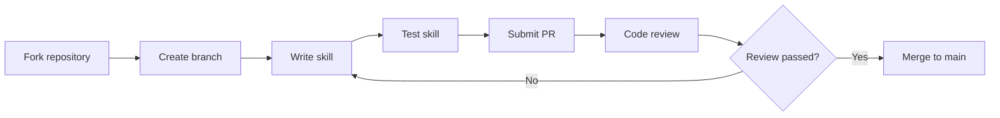

# Contributing Guide

## What You'll Learn

- Complete the skill contribution workflow (Fork → Branch → Test → PR)
- Follow skill writing specifications (frontmatter, descriptions, structure)
- Test skills using subagents (stress scenarios, validation)
- Submit compliant Pull Requests

## Your Current Struggle

**You've written a great skill and want to share it with the community**

You've followed the [Writing Custom Skills](../writing-skills/) tutorial to create a skill, and testing has passed. Now you want to share it with more people so other developers can benefit too.

Common issues:
- ❌ Don't know the PR workflow, submitted PR gets rejected
- ❌ Skill doesn't meet specifications, requires repeated revisions
- ❌ Submitted without testing, reviewer finds issues
- ❌ Don't know how to collaborate with the community, poor communication

These issues lead to: blocked contributions, wasted time, poor community feedback.

**Core problem**: Lack of systematic contribution workflow guide.

::: info What is contribution?

Contribution means submitting your written skills to the Superpowers official repository, allowing community users to use them as well.

All Superpowers skills are stored directly in the repository and accept community contributions through Fork + PR.

---

## When to Use This Approach

**You have a tested skill ready**

Consider contributing when the following conditions are met:
- ✅ Skill follows TDD methodology (RED-GREEN-REFACTOR)
- ✅ Tested using subagents, validity verified
- ✅ Skill is universally applicable (not project-specific)
- ✅ Skill documentation is complete (frontmatter, description, examples)

::: warning When NOT to contribute

PR submission is NOT recommended in the following cases:
- Project-specific skills (place in your personal skills directory)
- Untested skills (must test first)
- Skills that duplicate existing ones (check if they already exist)
- Purely documentation (reference other skills, don't reinvent the wheel)
:::

---

## 🎒 Preparation

### Prerequisites

Before starting, please confirm:

- [ ] You have a GitHub account
- [ ] You have completed the [Writing Custom Skills](../writing-skills/) tutorial
- [ ] You have completed the [Testing Skills](../testing-skills/) tutorial
- [ ] Your skill has been validated through subagent testing
- [ ] You are familiar with basic Git operations (clone, branch, commit, push)

### Skill Specification Checklist

Before submitting, ensure your skill meets the following specifications:

| Specification | Requirement | Source |
| ------------- | ----------- | ------ |
| **Frontmatter** | Only include `name` and `description` | `writing-skills/SKILL.md:96` |
| **name** | Only letters, numbers, hyphens, no special characters | `writing-skills/SKILL.md:98` |
| **description** | Third-person, starts with "Use when..." | `writing-skills/SKILL.md:99` |
| **Description length** | Frontmatter total ≤ 1024 characters | `writing-skills/SKILL.md:97` |
| **Skill length** | Common skills <200 words, others <500 words | `writing-skills/SKILL.md:217` |
| **Test validation** | Must pass subagent stress testing | `writing-skills/SKILL.md:373` |

---

## Core Concept

**The contribution workflow follows standard open-source collaboration patterns**



**Core principles**:
1. **Quality first**: Don't submit untested skills
2. **Specification compliance**: Strictly follow skill writing specifications
3. **Collaboration-friendly**: Provide clear PR descriptions and test evidence
4. **Continuous iteration**: Improve based on reviewer feedback

---

## Follow Along

### Step 1: Fork the Repository

**Why**
You need a writable copy of the repository to develop skills and submit PRs.

```bash
# Visit GitHub repository
open https://github.com/obra/superpowers
```

On the GitHub page:
1. Click the "Fork" button in the top right
2. Select your account as the destination
3. Wait for the fork to complete

**You should see**: GitHub created a `your-username/superpowers` repository.

---

### Step 2: Clone Your Fork

**Why**
Clone the forked repository locally for skill development and testing.

```bash
# Clone your fork (replace your-username)
git clone https://github.com/your-username/superpowers.git
cd superpowers
```

**You should see**: Current directory is `superpowers`, containing complete repository content.

---

### Step 3: Create Skill Branch

**Why**
Isolate development environment, keep `main` branch clean.

```bash
# Create and switch to new branch (use skill name)
git checkout -b add-your-skill-name

# For example:
git checkout -b add-condition-based-waiting
```

**You should see**: Git prompts "Switched to a new branch 'add-your-skill-name'".

::: tip Naming convention

Branch names use `add-` or `fix-` prefix + skill name:
- ✅ `add-condition-based-waiting`
- ✅ `fix-tdd-workflow-example`
- ❌ `my-skill`
- ❌ `skill-update`
:::

---

### Step 4: Write the Skill

**Why**
Create skill file, write content according to specifications.

```bash
# Create skill directory under skills/
mkdir -p skills/your-skill-name

# Create SKILL.md file
touch skills/your-skill-name/SKILL.md
```

**Write SKILL.md**:

```yaml
---
name: your-skill-name
description: Use when [specific triggering conditions and symptoms]
---

# Your Skill Name

## Overview
Core principle in 1-2 sentences.

## When to Use
- Symptom 1
- Symptom 2

## Core Pattern
[Before/after code comparison]

## Quick Reference
[Table for scanning common operations]

## Common Mistakes
- Mistake 1: description
- Mistake 2: description
```

**You should see**: `skills/your-skill-name/SKILL.md` file contains complete skill content.

::: tip Reference complete guide

For detailed skill writing specifications, refer to the [Writing Custom Skills](../writing-skills/) tutorial and `skills/writing-skills/SKILL.md` file.
:::

---

### Step 5: Test the Skill

**Why**
Ensure the skill effectively constrains AI agents and follows TDD methodology.

Refer to the [Testing Skills](../testing-skills/) tutorial, use subagents for stress testing:

```bash
# Test skill using subagents (in Claude Code or OpenCode)
# Test scenarios:
# 1. Baseline test: without skill, observe agent violations
# 2. Compliance test: with skill, verify agent follows rules
# 3. Stress test: apply time, fatigue pressure, verify skill effectiveness
```

**You should see**:
- Baseline test: agent violates rules (RED)
- Compliance test: agent follows skill (GREEN)
- Stress test: agent follows rules even under high pressure

::: warning Iron rule

**NO SKILL WITHOUT A FAILING TEST FIRST**

Refer to `writing-skills/SKILL.md:373`, you must first run baseline test to prove agents will violate rules, then write the skill.
:::

---

### Step 6: Commit Changes

**Why**
Commit skill files and test records to local repository.

```bash
# Check modification status
git status

# Add new skill files
git add skills/your-skill-name/

# Commit changes
git commit -m "Add your-skill-name: short description of what it does"

# For example:
git commit -m "Add condition-based-waiting: eliminates race conditions in async tests"
```

**You should see**: Git prompts "X files changed, X insertions(+)".

::: tip Commit message convention

Use clear commit messages:
- ✅ "Add condition-based-waiting: eliminates race conditions"
- ✅ "Fix TDD workflow: add missing refactoring step"
- ❌ "Add skill"
- ❌ "Update documentation"
:::

---

### Step 7: Push to Fork

**Why**
Push local branch to GitHub fork to prepare for PR creation.

```bash
# Push branch to remote repository
git push origin add-your-skill-name
```

**You should see**: Git outputs something like "Branch 'add-your-skill-name' set up to track remote branch...".

---

### Step 8: Create Pull Request

**Why**
Submit PR to original repository, request merging your skill.

1. Visit your fork repository:
    ```bash
    open https://github.com/your-username/superpowers
    ```

2. On GitHub page:
    - Click "Compare & pull request" button
    - Ensure base repository is `obra/superpowers` (not your fork)
    - Ensure base branch is `main`
    - Ensure compare branch is your new branch (e.g., `add-your-skill-name`)

3. Fill in PR information:

    **Title format**:
    ```
    Add skill-name: short description
    ```

    **Description template**:
    ```markdown
    ## What this skill does

    [1-2 sentences describing the skill's purpose]

    ## Testing evidence

    [Describe how you tested this skill with subagents]

    - Baseline test: [what agents did without skill]
    - Compliance test: [how agents complied with skill]
    - Pressure test: [how agents handled time/pressure constraints]

    ## Checklist

    - [ ] Skill follows frontmatter spec (name + description only)
    - [ ] Name uses only letters, numbers, hyphens
    - [ ] Description starts with "Use when..." and is third-person
    - [ ] Skill tested with subagents (RED-GREEN-REFACTOR)
    - [ ] No untested changes committed
    ```

4. Click "Create pull request"

**You should see**: GitHub created PR, shows automatic check results (if CI exists).

---

### Checkpoint ✅

**Verify correct PR submission**:

On the PR page, check:

| Check item | Expected result | Action if not met |
| ---------- | --------------- | ----------------- |
| **PR title** | Format is "Add skill-name: description" | Edit PR title |
| **Description completeness** | Contains test evidence and checklist | Supplement description |
| **File changes** | Only added `skills/your-skill-name/` | Clean up unrelated changes |
| **Skill files** | Contains SKILL.md and necessary support files | Add missing files |
| **Frontmatter** | Only name and description | Fix frontmatter |

---

## Common Pitfalls

### Common Errors

| Error | Solution |
| ----- | -------- |
| **PR submitted to own fork** | Ensure base repository is `obra/superpowers` |
| **Forgot to test skill** | Must complete [Testing Skills](../testing-skills/) tutorial first |
| **Frontmatter format error** | Check YAML syntax, wrap strings in double quotes |
| **Description doesn't meet spec** | Ensure starts with "Use when...", third-person |
| **Skill too long** | Cut redundant content, target <500 words (common <200 words) |

### Handling Review Feedback

**After reviewer points out issues**:

1. Don't be emotional, focus on technical improvements
2. Respond to reviewer's comments item by item
3. After local modifications, push to same branch
4. PR will automatically update, no need to recreate

::: tip Best practice for response

"Thanks for the feedback! I've fixed the frontmatter format issue and added stress test scenarios. Please review again."
:::

---

## Lesson Summary

Contributing skills is an important way to participate in the Superpowers community. Through the standard Fork + PR workflow, you can share TDD-tested skills with more people.

**Key takeaways**:
- ✅ Fork repository, create branch for development
- ✅ Strictly follow skill writing specifications (frontmatter, description, structure)
- ✅ Test skills using subagents (RED-GREEN-REFACTOR)
- ✅ Submit clear PR with test evidence and checklist
- ✅ Respond friendly to reviewer feedback, continuously improve

---

## Next Lesson Preview

> In the next lesson, we'll learn **[Common Questions & Troubleshooting](../../faq/troubleshooting/)**.
>
> You'll learn:
> - Common causes of skill loading failures
> - Cross-platform compatibility issues
> - Performance optimization tips
> - Community support channels

---

## Appendix: Source Code Reference

<details>
<summary><strong>Click to expand source code locations</strong></summary>

> Last updated: 2026-02-01

| Function | File Path | Line |
| -------- | --------- | ---- |
| Contribution workflow | [`README.md`](https://github.com/obra/superpowers/blob/main/README.md#L133-L142) | 133-142 |
| Skill writing specs | [`skills/writing-skills/SKILL.md`](https://github.com/obra/superpowers/blob/main/skills/writing-skills/SKILL.md) | 1-656 |
| MIT License | [`LICENSE`](https://github.com/obra/superpowers/blob/main/LICENSE) | Full text |

**Key principles**:
- **Fork → Branch → Test → PR**: Standard open-source contribution workflow
- **TDD methodology**: No skill without failing test first
- **Quality first**: Don't submit untested skills

**Reference tutorials**:
- [Writing Custom Skills](../writing-skills/): Detailed skill writing specifications
- [Testing Skills](../testing-skills/): Subagent testing methods

</details>
