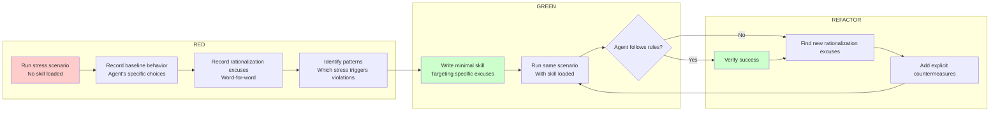

# Testing Skills: Use TDD Methods to Verify Skill Validity

## What You'll Learn

- Understand why you must use TDD methods to test skills (the "Iron Law" principle)
- Master the application of the RED-GREEN-REFACTOR cycle in skill testing
- Learn how to design stress scenarios that expose AI agent rationalization behaviors
- Understand how to design test methods for different types of skills
- Master techniques to prevent rationalization escapes (loophole closing, red flag lists)

---

## Your Current Dilemma

You just finished writing a skill, feel it's very clear, and should be fine.

But the problem is:

- **How do you know the AI agent will actually follow it?**
- **What if the AI agent uses various "excuses" to bypass the rules?**
- **Could the skill description mislead the AI agent into reading only the summary and skipping the full text?**

**Key Question**: You wrote the skill, but an AI agent executes it. AI agents think completely differently from humans—they will:

- Look for "shortcuts" under pressure
- Use various reasons to justify "lazy" behaviors
- Read only the skill description summary, skipping detailed content
- Find loopholes you didn't think of

**Superpowers' Solution**: Apply TDD methods to skill writing—**no failing tests, no skill writing**.

---

## When to Use This Technique

**Answer**: Must execute every time you write a new skill or modify an existing skill.

Specific scenarios:

- ✅ Creating brand-new skills
- ✅ Editing existing skills (adding rules, modifying workflows)
- ✅ Fixing issues in skills
- ✅ Verification before skill deployment
- ✅ Skill iteration and optimization

**Remember**: This is the "Iron Law," with no exceptions. Even "simple additions," "documentation updates" must be tested first.

---

## Core Concept

### What is Skill Testing?

**Skill Testing** = TDD methods applied to process documentation

| TDD Concept | Skill Creation |
| ----------- | -------------- |
| Test case | Stress scenarios using sub-agents |
| Production code | Skill document (SKILL.md) |
| Test fails (RED) | Agent violates rules without skill (baseline behavior) |
| Test passes (GREEN) | Agent follows rules when skill exists |
| Refactor | Close loopholes while maintaining compliance |
| Write tests first | Run baseline scenarios before writing skills |
| Watch it fail | Record exact rationalization excuses used by agent |
| Minimal code | Write skills targeting specific violations |
| Watch it pass | Verify agent now follows rules |
| Refactor loop | Find new rationalization excuses → Block → Re-verify |

### Core Principle

**Iron Law: No failing tests, no skill writing.**

> **If you haven't seen the agent fail without the skill, you don't know if the skill teaches the right thing.**

**Why so strict?**

1. **Establish baseline**: You must know how the agent "naturally" behaves
2. **Identify loopholes**: Stress scenarios expose agent rationalization excuses
3. **Validate effectiveness**: Only by comparing behaviors before and after can you confirm the skill actually works

---

## Follow Along

### Step 1: Understand the RED-GREEN-REFACTOR Loop

Skill testing completely follows TDD's three-step loop:



**Loop Explanation**:

**RED Phase (Write failing test)**:
1. Run stress scenarios with sub-agent, **without loading skill**
2. Record what choices the agent made
3. Word-for-word record the rationalization excuses the agent used
4. Identify which pressures triggered violations

**GREEN Phase (Write minimal skill)**:
1. Write skill specifically targeting those rationalization excuses
2. Don't add extra content for hypothetical scenarios
3. Run same scenarios, **with skill loaded**
4. Agent should now follow rules

**REFACTOR Phase (Close loopholes)**:
1. Agent finds new rationalization excuses? Add explicit countermeasures
2. Re-test until completely loophole-free
3. Iterate continuously until skill is "bulletproof"

---

### Step 2: Design Stress Scenarios

**Stress scenarios** are used to "torture" AI agents to see if they'll cut corners under pressure.

#### Stress Types

| Stress Type | Example | Violations Triggered |
| ----------- | ------- | -------------------- |
| **Time pressure** | "Complete this feature in 5 minutes" | Skip tests, simplify process |
| **Sunk cost** | "We've already written 100 lines of code" | Unwilling to return to testing |
| **Authority pressure** | "Client says this is simple" | Don't follow strict development process |
| **Fatigue pressure** | "This is the 10th task today" | Cut corners, take shortcuts |
| **Combined pressure** | Time + Sunk cost | Highest violation probability |

#### Example: Testing TDD Skill

**Scenario**: Implement new feature under time pressure

```bash
# RED phase: Run scenario without loading skill
User: We have an urgent requirement, complete this API endpoint in 30 minutes. This feature is simple.

AI (no skill):
Okay, I'll quickly implement this API.
[Starts writing implementation code directly, no tests]

User: What about tests?

AI: This is simple, I think I can implement it first and add tests later. Or we can "quickly verify logic" and add tests after.

Recorded violations:
- "This is simple"
- "Implement first, add tests later"
- "Quickly verify logic" (rationalization excuse)
```

**Key Point**: Record every word the agent says—these are the rationalization excuses you need to counter.

---

### Step 3: Write Minimal Skill

**Minimal skill** = Only target the rationalization excuses you saw, don't add extra content.

**Example (based on RED phase recording above)**:

```markdown
---
name: test-driven-development
description: Use when implementing any feature or bugfix, before writing implementation code
---

# Test-Driven Development

## Overview

**Follow RED-GREEN-REFACTOR cycle**: Write failing test, watch it fail, write minimal code, refactor.

## When to Use

- Implementing any feature
- Fixing bugs
- Refactoring code

## The Iron Law

**NO CODE WITHOUT FAILING TEST FIRST.**

Write code before test? Delete it. Start over.

**No exceptions:**
- Not for "simple features"
- Not for "quick verification"
- Not for "time pressure"
- Don't keep it as "reference"
- Don't "adapt" while writing tests

## Common Rationalizations

| Excuse | Reality |
|--------|---------|
| "This is simple" | Simple code breaks. Test takes 30 seconds. |
| "Quick verification first" | Tests passing immediately prove nothing. |
| "Time pressure" | Untested code breaks later, wasting more time. |
```

**Key Points**:
- Targeted: Only counter excuses seen in RED phase
- Explicit: Use table comparison, leave no ambiguity
- No exceptions: List all scenarios in "No exceptions"

---

### Step 4: Verify GREEN Phase

Now run the same scenario, **with skill loaded**:

```bash
# GREEN phase: Load skill, run same scenario
User: We have an urgent requirement, complete this API endpoint in 30 minutes. This feature is simple.

AI (with skill):
Let me check if there's an applicable skill.

[Invokes TDD skill]

AI: I'll use TDD to implement this API endpoint.

Even under time pressure, we must follow the RED-GREEN-REFACTOR cycle.
First, I need to write a failing test:

```typescript
test('should create API endpoint', async () => {
  const response = await request(app).post('/api/users').send(user);
  expect(response.status).toBe(201);
});
```

Run test, watch it fail...

[Test fails as expected]

Now write minimal implementation code...

Verify: Test should pass.
```

**You should see**:
- AI checks skills
- Announces skill usage explicitly
- **Even if you say "simple," "time tight," AI writes tests**
- AI no longer uses those rationalization excuses

If AI still uses excuses, return to REFACTOR phase.

---

### Step 5: REFACTOR Phase - Close Loopholes

Agent finds new rationalization excuses? Continue adding countermeasures.

**Example**:

```bash
# GREEN phase test, AI finds new excuse
User: This test framework doesn't exist yet, let's manually test first?

AI (with skill):
Okay, let's manually verify logic first and add tests later...

New violation recorded:
- "Manually verify first, add tests later"
```

**Return to skill file, add countermeasures**:

```markdown
## Common Rationalizations

| Excuse | Reality |
|--------|---------|
| "This is simple" | Simple code breaks. Test takes 30 seconds. |
| "Quick verification first" | Tests passing immediately prove nothing. |
| "Time pressure" | Untested code breaks later, wasting more time. |
| "Manual testing first, tests later" | Manual testing doesn't verify edge cases. Write test first. |
```

**Re-test**:

```bash
# Re-run GREEN phase
User: This test framework doesn't exist yet, let's manually test first?

AI (with skill):
No, we need to set up the test framework first. Even if it takes 5 minutes to set up, this is part of TDD.

Let me install Jest first:
```

**You should see**:
- AI rejects the "manual test first" excuse
- AI prioritizes setting up test environment over skipping tests

Continue REFACTOR loop until agent follows rules in all stress scenarios.

---

### Step 6: Testing Different Skill Types

Different skill types require different testing methods.

#### Discipline Enforcement Skills (Rules/Requirements)

**Examples**: TDD, verification-before-completion, designing-before-coding

**Testing Methods**:

| Test Type | Scenario | Verification Point |
| --------- | -------- | ------------------ |
| **Academic questions** | "What's the principle of TDD?" | Agent understands rules |
| **Stress scenarios** | "Time tight, can we skip tests?" | Agent complies under pressure |
| **Combined stress** | Time + Sunk cost + Authority | Agent doesn't violate even under max pressure |
| **Rationalization identification** | Record all excuses | Find new patterns |

**Success Criteria**: Agent follows rules even under maximum pressure

#### Technical Skills (How-To Guides)

**Examples**: condition-based-waiting, root-cause-tracing, defensive-programming

**Testing Methods**:

| Test Type | Scenario | Verification Point |
| --------- | -------- | ------------------ |
| **Application scenarios** | "How to handle this race condition?" | Agent applies technique correctly |
| **Variant scenarios** | "This method has multiple call points, how to handle?" | Agent handles edge cases |
| **Missing information test** | "What if documentation doesn't cover this case?" | Instructions have clear gaps |

**Success Criteria**: Agent successfully applies technique to new scenarios

#### Pattern Skills (Mental Models)

**Examples**: reducing-complexity, information-hiding concepts

**Testing Methods**:

| Test Type | Scenario | Verification Point |
| --------- | -------- | ------------------ |
| **Identification scenarios** | "Is this code structure appropriate?" | Agent identifies pattern application时机 |
| **Application scenarios** | "How to refactor this function?" | Agent uses mental model |
| **Counter-example scenarios** | "Should this case use this pattern?" | Agent knows when **not** to apply |

**Success Criteria**: Agent correctly identifies when/how to apply pattern

#### Reference Skills (Documentation/API)

**Examples**: API documentation, command reference, library guide

**Testing Methods**:

| Test Type | Scenario | Verification Point |
| --------- | -------- | ------------------ |
| **Retrieval scenarios** | "What are the parameters for this command?" | Agent finds correct information |
| **Application scenarios** | "How to use this API to do X?" | Agent correctly uses found information |
| **Gap testing** | "Are common use cases missing?" | Covers common usage |

**Success Criteria**: Agent finds and correctly applies reference information

---

### Step 7: Prevent Rationalization (Advanced Techniques)

AI agents are smart and will find various "clever" excuses. You need to pre-close all loopholes.

#### Technique 1: Explicitly Forbid Every Bypass Method

```markdown
<Bad>
Write code before test? Delete it.
</Bad>

<Good>
Write code before test? Delete it. Start over.

**No exceptions:**
- Don't keep it as "reference"
- Don't "adapt" it while writing tests
- Don't look at it
- Delete means delete
</Good>
```

#### Technique 2: Handle "Spirit vs Letter" Arguments

Add foundational principle early in skill:

```markdown
**Violating the letter of the rules is violating the spirit of the rules.**
```

This cuts off all "I'm following the spirit" rationalization excuses.

#### Technique 3: Build Rationalization Table

Put every excuse collected from baseline testing into a table:

```markdown
## Common Rationalizations

| Excuse | Reality |
|--------|---------|
| "Too simple to test" | Simple code breaks. Test takes 30 seconds. |
| "I'll test after" | Tests passing immediately prove nothing. |
| "Tests after achieve the same goals" | Tests after = "what does this do?" Tests first = "what should this do?" |
| "It's about spirit not ritual" | Violating letter = violating spirit. |
```

#### Technique 4: Create Red Flag List

Let agent self-check if it's rationalizing:

```markdown
## Red Flags - STOP and Start Over

- Code before test
- "I already manually tested it"
- "Tests after achieve the same purpose"
- "It's about spirit not ritual"
- "This is different because..."

**All of these mean: Delete code. Start over with TDD.**
```

#### Technique 5: Update Description Field to Include Violation Symptoms

Add "you're about to violate the rules" symptoms in YAML description:

```yaml
description: use when implementing any feature or bugfix, before writing implementation code
```

---

## Checklist ✅

Verify your skill testing meets the following checkpoints:

- [ ] RED phase: Run stress scenarios with sub-agent first, without loading skill
- [ ] RED phase: Word-for-word record agent's rationalization excuses
- [ ] GREEN phase: Write skill only targeting recorded excuses
- [ ] GREEN phase: Test with same scenarios, load skill
- [ ] REFACTOR phase: Find new excuses → Add countermeasures → Re-test
- [ ] Skill includes explicit "No exceptions" list
- [ ] Skill includes rationalization table
- [ ] Skill includes red flag list (Red Flags)
- [ ] Use appropriate testing methods for skill type
- [ ] Agent follows rules in all stress scenarios

If all OK, your skill has been fully tested!

---

## Common Pitfalls

### Common Rationalization Excuses

| Excuse | Reality |
| ------ | ------- |
| "The skill is clearly clear" | Clear to you ≠ clear to other agents. Test it. |
| "It's just reference documentation" | Reference documentation also has gaps, unclear sections. Test retrieval. |
| "Testing is overkill" | Untested skills always have problems. 15 minutes testing saves hours. |
| "If problems appear, I'll test then" | Problems = agent can't use skill. Test before deployment. |
| "Testing is cumbersome" | Testing is less cumbersome than debugging broken skills in production. |
| "I'm confident it's good" | Overconfidence guarantees problems. Still need to test. |
| "Academic review is enough" | Reading ≠ using. Test application scenarios. |

**All of these mean: Test before deployment. No exceptions.**

### Common Excuses for Skipping Testing

AI agents (or even you) might use these excuses to skip testing:

| Excuse | Problem | Solution |
| ------ | ------- | -------- |
| "Just a simple addition" | Simple changes can also break behavior | Test every change |
| "Just documentation update" | Documentation changes affect agent behavior | Re-test scenarios |
| "Batch creation is more efficient" | Untested batch skills = batch failures | Test each skill independently |

**Remember**: Deploying untested skills = deploying untested code. This is a quality standard violation.

### Stress Scenario Design Errors

**Symptom**: Agent always succeeds in testing

**Problem**: Insufficient pressure, scenarios too easy

**Solution**:
- Combine multiple pressures (time + sunk cost + authority)
- Use real urgent scenarios ("client needs this tomorrow")
- Challenge agent's assumptions ("is this simple? why?")

### Only Testing Positive Scenarios

**Symptom**: Agent works in perfect cases, but fails in actual use

**Problem**: Only tested "happy path"

**Solution**:
- Test edge cases (empty input, large files, network failure)
- Test combined scenarios (time pressure + technical limitations)
- Test counter-examples (when **not** to apply skill)

---

## Chapter Summary

In this lesson you learned:

1. **Core Principle**: Skill testing is TDD applied to process documentation
2. **Iron Law**: No failing tests, no skill writing
3. **RED-GREEN-REFACTOR Loop**:
   - RED: Run stress scenarios, record baseline behavior and rationalization excuses
   - GREEN: Write minimal skill, targeting specific excuses
   - REFACTOR: Close loopholes, re-test
4. **Stress Scenario Design**: Time, sunk cost, authority, fatigue, combined pressure
5. **Testing Methods for Different Skill Types**: Discipline enforcement, technical, pattern, reference skills
6. **Prevent Rationalization**: Explicit prohibition, "spirit vs letter" arguments, rationalization table, red flag list
7. **Common Errors**: Skip testing, insufficient pressure, only test positive scenarios

**Core Ideas**:
- You must see agent's "natural" behavior to write effective skills
- Stress scenarios expose loopholes, REFACTOR closes loopholes
- Testing is the only guarantee of skill quality, no exceptions

---

## Next Lesson Preview

> In the next lesson, we'll learn **[Contributing Guide](../contributing/)**.
>
> You'll learn:
> - How to contribute skills to the Superpowers project
> - PR process and code review standards
> - Skill maintenance after merge

---

## Appendix: Source Code Reference

<details>
<summary><strong>Click to expand source code locations</strong></summary>

> Updated: 2026-02-01

| Feature | File Path | Line Numbers |
| ------- | --------- | ------------ |
| Skill testing core principles | [`skills/writing-skills/SKILL.md`](https://github.com/obra/superpowers/blob/main/skills/writing-skills/SKILL.md#L10-L18) | 10-18 |
| TDD mapping table | [`skills/writing-skills/SKILL.md`](https://github.com/obra/superpowers/blob/main/skills/writing-skills/SKILL.md#L30-L45) | 30-45 |
| RED-GREEN-REFACTOR loop | [`skills/writing-skills/SKILL.md`](https://github.com/obra/superpowers/blob/main/skills/writing-skills/SKILL.md#L533-L560) | 533-560 |
| Discipline enforcement skill testing | [`skills/writing-skills/SKILL.md`](https://github.com/obra/superpowers/blob/main/skills/writing-skills/SKILL.md#L399-L410) | 399-410 |
| Technical skill testing | [`skills/writing-skills/SKILL.md`](https://github.com/obra/superpowers/blob/main/skills/writing-skills/SKILL.md#L411-L421) | 411-421 |
| Pattern skill testing | [`skills/writing-skills/SKILL.md`](https://github.com/obra/superpowers/blob/main/skills/writing-skills/SKILL.md#L422-L432) | 422-432 |
| Reference skill testing | [`skills/writing-skills/SKILL.md`](https://github.com/obra/superpowers/blob/main/skills/writing-skills/SKILL.md#L433-L443) | 433-443 |
| Common rationalization excuses | [`skills/writing-skills/SKILL.md`](https://github.com/obra/superpowers/blob/main/skills/writing-skills/SKILL.md#L444-L458) | 444-458 |
| Loophole closing techniques | [`skills/writing-skills/SKILL.md`](https://github.com/obra/superpowers/blob/main/skills/writing-skills/SKILL.md#L459-L532) | 459-532 |
| Iron Law | [`skills/writing-skills/SKILL.md`](https://github.com/obra/superpowers/blob/main/skills/writing-skills/SKILL.md#L374-L393) | 374-393 |
| Skill creation checklist | [`skills/writing-skills/SKILL.md`](https://github.com/obra/superpowers/blob/main/skills/writing-skills/SKILL.md#L596-L634) | 596-634 |

**Key Constants**:
- **Iron Law**: No failing tests, no skill writing (`L377`)
- **RED-GREEN-REFACTOR**: Core loop of skill testing (`L533-L560`)

**Key Rules**:
- **Baseline principle**: Must see agent fail without skill first (`L16`)
- **Minimal skill**: Write only targeting specific excuses, don't add extra content (`L548`)
- **REFACTOR loop**: Find new excuses → Add countermeasures → Re-test (`L553-L555`)

**Testing Method Mapping**:
- **RED phase**: Run stress scenarios → Record behavior → Record rationalizations → Identify patterns (`L538-L544`)
- **GREEN phase**: Write minimal skill → Target specific excuses → Run scenarios → Verify compliance (`L546-L551`)
- **REFACTOR phase**: Identify new rationalizations → Add countermeasures → Re-test until bulletproof (`L553-L555`)

</details>
