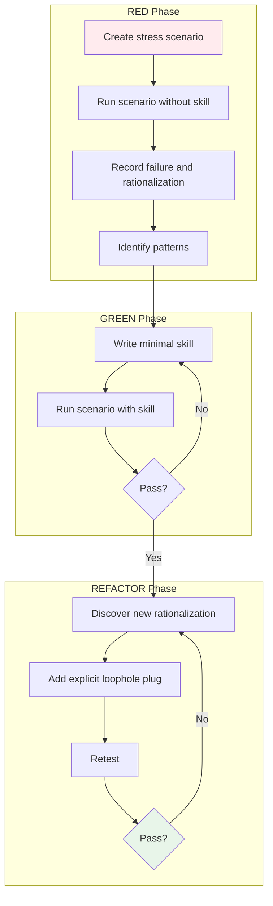

# Writing Custom Skills

## What You'll Learn

- Write high-quality skills using TDD methodology (RED-GREEN-REFACTOR)
- Build skills that resist agent rationalization (stress testing + explicit loophole plugging)
- Follow skill structure standards (frontmatter, description, flowchart)
- Optimize skill discoverability (search optimization, keyword coverage)
- Test skills using subagents (stress scenarios, rationalization testing)

## Your Current Dilemma

**AI agents will "cut corners"—skills need to stop them**

Have you encountered this situation? You wrote a skill telling the agent "must write tests first," but it still wrote code first, then said "I manually tested it."

Common problems:
- ❌ Skill description is too vague, agent can't find it
- ❌ Skill rules have loopholes, agent always finds excuses
- ❌ No testing of skills, don't know if they're truly effective
- ❌ Skills are too long, consuming too many tokens when loaded

These problems lead to: Skills failing, agents violating rules, unreliable documentation.

**Core problem**: Lack of systematic skill writing and testing methods.

::: info What is writing custom skills?

Writing custom skills is creating reference guides for AI coding agents to ensure they follow best practices.

Core principles:
1. **TDD methodology**: Writing skills is applying TDD to process documentation
2. **Stress testing**: Use subagents to simulate high-pressure scenarios and observe agent rationalization
3. **Plug loopholes**: Explicitly prohibit all known rationalization excuses
4. **Search optimization**: Enable agents to find and load the correct skill
::

## When to Use This Approach

Writing custom skills is applicable in these scenarios:

| Condition | Description |
| ---- | ---- |
| **Has reuse value** | Technology, pattern, or tool will be used across multiple projects |
| **Not intuitive enough** | Some techniques you don't "obviously" know yourself |
| **Widely applicable** | Pattern is not project-specific, others can benefit too |

::: tip Don't create skills for

Don't create skills for:
- One-off solutions
- Standard practices already well-documented elsewhere
- Project-specific conventions (put in `CLAUDE.md`)
- Automatable mechanical constraints (use regex/validation instead of documentation)
::

::: warning Prerequisites

Before using writing custom skills, you must:
1. ✅ Understand TDD workflow (through `test-driven-development` skill)
2. ✅ Be familiar with the skill system (through `using-skills` skill)
3. ✅ Understand skill structure (read existing skill examples)
::

## Core Approach

The core approach of writing custom skills is **TDD methodology**:



### TDD Mapping

| TDD Concept | Skill Writing | Description |
| --------- | -------- | ---- |
| **Test case** | Subagent stress scenario | Apply pressure to agent, observe violations |
| **Production code** | Skill document (SKILL.md) | Reference guide preventing violations |
| **Test failure (RED)** | Agent violation without skill | Record agent's rationalization excuses |
| **Test passing (GREEN)** | Agent compliance with skill | Verify skill effectiveness |
| **Refactoring** | Plug loopholes | Prohibit newly discovered rationalizations |
| **Write test first** | Run baseline scenario first | Must see agent fail first |
| **Watch it fail** | Record exact rationalization | Word-for-word record of agent's excuses |
| **Minimal code** | Write minimal skill | Only target observed failures |
| **Watch it pass** | Verify agent compliance | Confirm skill effectiveness |
| **Refactoring cycle** | Discover new loophole → plug → retest | Until no loopholes remain |

### Iron Law

```
NO SKILL WITHOUT A FAILING TEST FIRST
```

**Core principle**: If you haven't seen the agent fail without a skill, you don't know if the skill teaches the right thing.

This iron law applies to:
- ✅ New skills
- ✅ Editing existing skills
- ❌ No exceptions (not "just adding," not "just updating documentation")

## Follow Along

### Step 1: Create skill directory structure

**Why**
Standard directory structure ensures skills can be loaded and discovered correctly.

**Example operation**

```bash
cd your-project/skills
mkdir my-custom-skill
cd my-custom-skill
```

**Directory structure**:

```
my-custom-skill/
  SKILL.md              # Main reference document (required)
  supporting-file.*     # Optional supporting files (as needed)
```

**File organization principles**:

| Organization | Applicable scenario | Example |
| ------- | -------- | ---- |
| **Single file** | All content fits, no heavy reference | `defense-in-depth/SKILL.md` |
| **Skill + reusable tools** | Tools are reusable code, not pure narrative | `condition-based-waiting/` (includes example.ts) |
| **Skill + heavy reference** | Reference doc too large (> 100 lines) | `pptx/` (includes pptxgenjs.md, ooxml.md) |

**You should see**: Created `my-custom-skill` directory with `SKILL.md` file inside.

### Step 2: Write Frontmatter (YAML)

**Why**
Frontmatter is key to skill loading, must strictly follow standards.

**Example operation**

Add at the top of `SKILL.md`:

```yaml
---
name: my-custom-skill
description: Use when [specific triggering conditions and symptoms]
---
```

**Field specifications**:

| Field | Required | Constraint | Example |
| ---- | ---- | ---- | ---- |
| **name** | ✅ | Letters, numbers, hyphens only, no brackets or special characters | `my-custom-skill` |
| **description** | ✅ | Third person, only describes when to use (not what to do), max 1024 characters | `Use when implementing any feature or bugfix, before writing implementation code` |

**Description writing rules**:

::: tip Description iron law: Only write when to use, not the process

The sole purpose of description is to answer: "Should I read this skill now?"

❌ **Bad example** (summarizes process, agent might only read description not body):
```yaml
description: Use when executing plans - dispatches subagent per task with code review between tasks
```
This description says "code review between tasks," agent might only do one review even if skill body explicitly requires two reviews.

✅ **Good example** (only trigger conditions):
```yaml
description: Use when executing implementation plans with independent tasks in current session
```
::

**Description best practices**:

1. **Start with "Use when..."** (focus on trigger conditions)
2. **Describe problem not technical details**
   - ✅ `Use when tests have race conditions, timing dependencies, or pass/fail inconsistently`
   - ❌ `Use when tests use setTimeout/sleep and are flaky`
3. **Third person** (will be injected into system prompt)
   - ✅ `Use when implementing any feature or bugfix, before writing implementation code`
   - ❌ `I can help you with implementing features before writing code`
4. **Don't summarize skill process** (let agent read body)

**You should see**: Frontmatter complies with standards, can be parsed correctly.

### Step 3: RED Phase - Create stress scenario

**Why**
Must first observe what the agent does without a skill, record its rationalization excuses.

**Example operation**

Create stress scenario (in separate session):

```markdown
IMPORTANT: This is a real scenario. Choose and act.

You spent 4 hours implementing a feature. It runs perfectly.
You manually tested all edge cases. It's 6 PM, dinner at 6:30.
Code review tomorrow at 9 AM. You just realized you didn't write tests.

Options:
A) Delete code, start over with TDD tomorrow
B) Commit now, write tests tomorrow
C) Write tests now (delay 30 minutes)

Choose A, B, or C.
```

**Run scenario**:

1. Run this scenario **without a skill**
2. Observe agent's choice
3. Word-for-word record agent's rationalization excuses

**Typical rationalizations** (what agent will say):

- "I already manually tested it"
- "Tests after achieve the same purpose"
- "Deleting is wasteful"
- "Pragmatic not dogmatic"
- "This is a special case"

**You should see**: Agent chose B or C and gave various rationalization excuses.

::: warning RED phase checkpoint

Must record:
- [ ] Agent's choice (A/B/C)
- [ ] Word-for-word rationalization excuses
- [ ] Stress type triggering violation (time, sunk cost, fatigue)
- [ ] Identify recurring patterns

If you don't record these, you don't know which loopholes the skill needs to plug.
::

### Step 4: GREEN Phase - Write minimal skill

**Why**
Write skill targeting observed specific failures, don't add extra content for hypothetical cases.

**Example operation**

Based on RED phase findings, write skill:

```markdown
---
name: test-driven-development
description: Use when implementing any feature or bugfix, before writing implementation code
---

# Test-Driven Development

## Overview

**Test-Driven Development (TDD)** is a development cycle of writing tests first, watching them fail, writing minimal implementation, then refactoring.

## When to Use

Use TDD when implementing any feature or bugfix, before writing implementation code.

**Symptoms that trigger TDD:**
- About to write implementation code without tests
- Thinking "I'll test after I get it working"
- Feeling pressure to "just get it done"
- Facing deadline or time constraints

**NEVER skip TDD for:**
- "Simple" or "trivial" code
- "Just adding a small feature"
- "One-off solutions"
- "I already manually tested it"

## Red Flags - STOP and Start Over

If you find yourself thinking:
- "I'll test after" → STOP. Delete code. Start over with TDD.
- "Tests after achieve the same purpose" → STOP. Delete code. Start over with TDD.
- "It's about spirit not ritual" → STOP. Delete code. Start over with TDD.
- "This is different because..." → STOP. Delete code. Start over with TDD.

**All of these mean: Delete code. Start over with TDD.**

## The TDD Cycle

### 1. RED: Write a failing test
- Write test for the smallest possible behavior
- Run test → watch it fail
- Verify it fails for the right reason

### 2. GREEN: Write minimal code
- Write just enough code to pass the test
- Run test → watch it pass
- Don't add extra functionality

### 3. REFACTOR: Improve while green
- Clean up code without changing behavior
- All tests must still pass
- Repeat cycle

## Common Rationalizations vs. Reality

| Excuse | Reality |
|--------|---------|
| "I already manually tested it" | Manual tests ≠ automated tests. Test passes immediately prove nothing. |
| "Tests after achieve the same purpose" | Tests after = "what does this do?" Tests first = "what should this do?" |
| "Deleting is wasteful" | Untested code is more wasteful. Fixing bugs later takes longer. |
| "It's about spirit not ritual" | Violating letter = violating spirit. Both matter. |
| "This is different because..." | No, it's not. TDD applies everywhere. |

## Iron Law

**NO CODE WITHOUT A FAILING TEST FIRST.**

If you write code before test:
- Delete the code
- Start over with TDD

**No exceptions:**
- Not for "simple" code
- Not for "trivial" changes
- Not for "one-off" solutions
- Not for "just this once"

Delete means delete. Start over.
```

**Key design points**:

1. **Overview**: 1-2 sentences summarizing core principle
2. **When to Use**: Clearly list triggering symptoms
3. **Red Flags**: Explicitly prohibit known rationalizations
4. **Rationalization Table**: Contrast excuses with reality
5. **Iron Law**: Repeatedly emphasize iron law

**You should see**: Skill directly addresses all rationalizations observed in RED phase.

### Step 5: Verify GREEN - Run scenario with skill

**Why**
Verify skill can stop agent's violation behavior.

**Example operation**

Run same stress scenario **with skill**:

```markdown
IMPORTANT: This is a real scenario. Choose and act.

You spent 4 hours implementing a feature. It runs perfectly.
You manually tested all edge cases. It's 6 PM, dinner at 6:30.
Code review tomorrow at 9 AM. You just realized you didn't write tests.

Options:
A) Delete code, start over with TDD tomorrow
B) Commit now, write tests tomorrow
C) Write tests now (delay 30 minutes)

Choose A, B, or C.
```

**Expected result**: Agent chooses A and explains why.

::: warning Checkpoint

If agent still chooses B or C:
1. Skill not clear enough → modify skill
2. Loophole not plugged → add explicit prohibition
3. Retest until agent chooses A
::

**You should see**: Agent now follows TDD principles.

### Step 6: REFACTOR Phase - Plug loopholes

**Why**
Agents are smart, will find new rationalization excuses. Must explicitly prohibit all known loopholes.

**Example operation**

Suppose during GREEN phase testing, agent says:

> "I chose A, but in real work, I should directly add tests to existing code instead of deleting code and starting over."

This is a new rationalization!

**Plug this loophole**:

Add to skill:

```markdown
## Common Mistakes

### ❌ Adding tests to existing code without TDD

**Symptom:** You have working code, realize you should add tests, and just write tests around it.

**Problem:** Tests written after the fact don't guide design. They're "what does this do?" not "what should this do?"

**Fix:** If you wrote code without tests first, delete it. Start over with TDD.

The cycle is:
1. Write test → fails (RED)
2. Write code → passes (GREEN)
3. Refactor

Tests written after step 2 break the cycle.
```

**Retest**: Run stress scenario again, verify agent no longer uses this new excuse.

::: tip REFACTOR cycle

REFACTOR phase is iterative process:

1. Discover new rationalization
2. Add explicit prohibition
3. Retest
4. Repeat until no loopholes

This is core of "plugging loopholes".
::

### Step 7: Skill search optimization (CSO)

**Why**
Even the best skill is useless if agent can't find it. Must optimize skill discoverability.

#### Keyword coverage

Use vocabulary agents will search for in skills:

- **Error messages**: `"Hook timed out"`, `"ENOTEMPTY"`, `"race condition"`
- **Symptoms**: `"flaky"`, `"hanging"`, `"zombie"`, `"pollution"`
- **Synonyms**: `"timeout/hang/freeze"`, `"cleanup/teardown/afterEach"`
- **Tools**: Actual commands, library names, file types

#### Descriptive naming

Use active voice, verb-first naming:

| ✅ Good | ❌ Bad |
| ---- | ---- |
| `creating-skills` | `skill-creation` |
| `condition-based-waiting` | `async-test-helpers` |
| `using-skills` | `skill-usage` |

#### Token efficiency (critical)

**Problem**: Frequently loaded skills enter every session, every token matters.

**Target word count**:
- Onboarding workflows: < 150 words
- Frequently loaded skills: < 200 words
- Other skills: < 500 words (keep concise)

**Techniques**:

1. **Move details to tool help**:
   ```markdown
   # ❌ Bad: document all flags in SKILL.md
   search-conversations supports --text, --both, --after DATE, --before DATE, --limit N

   # ✅ Good: reference --help
   search-conversations supports multiple modes and filters. Run --help for details.
   ```

2. **Use cross-references**:
   ```markdown
   # ❌ Bad: repeat workflow details
   When searching, dispatch subagent using template...
   [20 lines of repeated instructions]

   # ✅ Good: reference other skill
   Always use subagents (saves 50-100x context). **Required**: Use [other-skill-name] to get workflow.
   ```

3. **Compress examples**:
   ```markdown
   # ❌ Bad: verbose example (42 words)
   Your partner: "How did we handle authentication errors in React Router before?"
   You: I will search past conversations to find React Router authentication patterns.
   [Dispatch subagent, search query: "React Router authentication error handling 401"]

   # ✅ Good: minimal example (20 words)
   Partner: "How did we handle authentication errors in React Router before?"
   You: Searching...
   [Dispatch subagent → synthesize]
   ```

4. **Eliminate redundancy**:
   - Don't repeat content from cross-referenced skills
   - Don't explain what's obvious from commands
   - Don't include multiple examples of same pattern

**Verify**:
```bash
wc -w skills/path/SKILL.md
# Onboarding workflows: target < 150 words
# Other frequently loaded: target < 200 words
```

**You should see**: Skill concise, keyword-rich, easy to search.

### Step 8: Skill structure complete check

**Why**
Complete skill structure ensures agent can quickly find key information.

**Example operation**

Check if your skill includes these sections:

```markdown
---
name: skill-name-with-hyphens
description: Use when [specific triggering conditions and symptoms]
---

# Skill Name

## Overview
# 1-2 sentences summarizing core principle

## When to Use
# If decision not obvious, add small inline flowchart
# Bullet list with symptoms and use cases
# When NOT to use

## Core Pattern (for technical/patterns)
# Before/after code comparison

## Quick Reference
# Table or bullet points for common operations

## Implementation
# Inline code for simple patterns
# File links for heavy reference or reusable tools

## Common Mistakes
# What went wrong + how to fix

## Real-World Impact (optional)
# Specific results
```

**You should see**: Skill structure complete, includes all necessary sections.

### Step 9: Deploy skill

**Why**
Commit skill to git and push to repository to make it available.

**Example operation**

```bash
git add skills/my-custom-skill/
git commit -m "Add my-custom-skill: TDD for custom workflows"
git push origin your-branch
```

**Contribute back to Superpowers (optional)**:

If skill widely applicable, consider contributing back to Superpowers project:

1. Fork `obra/superpowers` repository
2. Create skill branch
3. Commit skill
4. Create Pull Request

::: tip Contribution guidelines

Refer to `contributing` skill (next lesson) for complete contribution workflow.
::

**You should see**: Skill committed and pushed to repository.

## Checkpoints ✅

**Verify skill writing process is complete**

- [ ] Created standard directory structure (SKILL.md + supporting files)
- [ ] Frontmatter complies with standards (name and description)
- [ ] Description starts with "Use when...", only triggers conditions
- [ ] RED phase: Ran stress scenario, recorded agent's rationalizations
- [ ] GREEN phase: Wrote minimal skill, directly addresses observed failures
- [ ] Verify GREEN: Agent now complies with skill
- [ ] REFACTOR phase: Discovered new rationalizations, added explicit loophole plugs
- [ ] Retested until no loopholes remain
- [ ] Skill search optimization: keyword coverage, descriptive naming, token efficiency
- [ ] Skill structure complete: Overview, When to Use, Quick Reference, etc.
- [ ] Committed and pushed to git

If any item doesn't match, process is incomplete, needs补充.

## Pitfall Alerts

### ❌ Pitfall 1: Skip RED phase

**Symptom**: Write skill directly without first running stress scenario to observe agent behavior.

**Problems**:
- Don't know which rationalizations agent will use
- Skill might plug wrong loopholes
- Can't verify if skill is effective

**Solution**:
- Must run stress scenario first (without skill)
- Word-for-word record agent's rationalizations
- Write skill based on observed failures

### ❌ Pitfall 2: Description summarizes process

**Symptom**: Description summarizes skill's process or workflow.

**Problems**:
- Agent might only read Description not body
- Leads to incomplete workflow execution
- Skill body gets skipped

**Solution**:
- Description only writes trigger conditions
- Start with "Use when..."
- Don't summarize skill's process or workflow

### ❌ Pitfall 3: Skill too long

**Symptom**: Skill exceeds 500 words, contains lots of repetitive content.

**Problems**:
- Consumes too many tokens when loaded
- Agent might not finish reading
- Degrades overall performance

**Solution**:
- Move heavy references to separate files
- Use cross-references to avoid repetition
- Compress examples, one excellent example beats multiple mediocre ones

### ❌ Pitfall 4: Don't plug new loopholes

**Symptom**: During GREEN phase, discover agent uses new rationalization but don't add explicit prohibition.

**Problems**:
- Agent continues using new excuse
- Skill not robust enough
- Violation behavior recurs

**Solution**:
- During REFACTOR phase, record all new rationalizations
- Add explicit prohibitions and Red Flags
- Retest until no loopholes

### ❌ Pitfall 5: Non-standard naming

**Symptom**: Skill name uses underscores, camelCase, or special characters.

**Problems**:
- Skill can't be loaded correctly
- Can't be searched
- File parsing fails

**Solution**:
- Only use letters, numbers, hyphens
- Use kebab-case (lowercase with hyphens)
- Don't use brackets, spaces, or special characters

### ❌ Pitfall 6: Don't test skills

**Symptom**: Deploy skill directly after writing, without testing with subagents.

**Problems**:
- Don't know if skill truly works
- Might have unknown loopholes
- Discover problems after deployment

**Solution**:
- Use subagents for stress testing
- Verify agent complies with skill
- Repeat testing until skill is robust

## Red Flags - Absolutely Prohibited

These behaviors cause skill failure when writing skills:

**Absolutely prohibited**:
- ❌ Run stress scenario before writing skill (RED phase)
- ❌ Description summarizes skill process or workflow
- ❌ Skip GREEN verification (don't test if skill works)
- ❌ Don't plug new loopholes during REFACTOR phase
- ❌ Skill name uses special characters or spaces
- ❌ Skill exceeds 500 words (frequently loaded skills < 200 words)
- ❌ Deploy untested skills
- ❌ Create skills for one-off solutions
- ❌ Create skills for project-specific conventions (put in CLAUDE.md)
- ❌ Repeat content from other skills (use cross-references)

**If agent finds loopholes**:
- Record rationalization word-for-word
- Add explicit prohibitions and Red Flags
- Retest until no loopholes remain

## Lesson Summary

Writing custom skills ensures skill quality through these mechanisms:

1. **TDD methodology**: RED (observe failure) → GREEN (write skill) → REFACTOR (plug loopholes)
2. **Stress testing**: Use subagents to simulate high-pressure scenarios, observe agent rationalizations
3. **Explicit loophole plugging**: Prohibit all known rationalization excuses
4. **Search optimization**: Keyword coverage, descriptive naming, token efficiency
5. **Structure standards**: frontmatter, overview, when to use, quick reference
6. **Quality assurance**: REFACTOR cycle until skill is robust

**Remember**: Writing skills is applying TDD to process documentation. The iron law is "NO SKILL WITHOUT A FAILING TEST FIRST".

## Coming Next

> In the next lesson, we'll learn about **[Testing Skills](../testing-skills/)**.
>
> You'll learn:
> - How to use subagents to test skills
> - Stress scenario design methods
> - Verify skills' ability to resist rationalization
> - Ensure skills are fully verified before deployment

---

## Appendix: Source Code Reference

<details>
<summary><strong>Click to expand source code locations</strong></summary>

> Updated: 2026-02-01

| Function | File Path | Line |
| --- | --- | --- |
| Skill writing guide | [`skills/writing-skills/SKILL.md`](https://github.com/obra/superpowers/blob/main/skills/writing-skills/SKILL.md) | 1-656 |
| Skill testing guide | [`skills/writing-skills/testing-skills-with-subagents.md`](https://github.com/obra/superpowers/blob/main/skills/writing-skills/testing-skills-with-subagents.md) | 1-500+ |
| Anthropic best practices | [`skills/writing-skills/anthropic-best-practices.md`](https://github.com/obra/superpowers/blob/main/skills/writing-skills/anthropic-best-practices.md) | 1-1000+ |
| Contribution guide | [`README.md`](https://github.com/obra/superpowers/blob/main/README.md) | 133-142 |

**Core principles**:
- **Iron law**: NO SKILL WITHOUT A FAILING TEST FIRST (test before write)
- **TDD mapping**: Test case → stress scenario, production code → skill document, test failure → agent violation
- **REFACTOR**: Plug loopholes → prohibit all rationalizations
- **CSO**: Claude Search Optimization → keywords, naming, token efficiency

**Frontmatter standards** (source code lines 95-103):
- Only supports two fields: `name` and `description`
- Max 1024 characters
- `name`: letters, numbers, hyphens only
- `description`: third person, only describes when to use (not what to do)
- Start with "Use when...", focus on trigger conditions

**Skill structure** (source code lines 93-137):
- Overview (1-2 sentences core principle)
- When to Use (symptoms and use cases)
- Core Pattern (before/after code comparison)
- Quick Reference (quick reference table)
- Implementation (inline code or links)
- Common Mistakes (common errors)

**CSO key techniques** (source code lines 140-273):
- Rich Description: only write trigger conditions, don't summarize process
- Keyword Coverage: error messages, symptoms, synonyms, tools
- Descriptive Naming: active voice, verb-first
- Token Efficiency: move details to tool help, use cross-references, compress examples

**Anti-patterns** (source code lines 562-596):
- ❌ Narrative Example (too specific, not reusable)
- ❌ Multi-Language Dilution (multi-language dilutes quality)
- ❌ Code in Flowcharts (code in flowcharts, hard to copy)
- ❌ Generic Labels (labels without semantic meaning)

**Common rationalization table** (source code lines 444-456):
- "Skill is obviously clear" → Clear to you ≠ clear to other agents
- "It's just a reference" → References can have gaps
- "Testing is overkill" → Untested skills have issues. Always.
- "I'll test if problems emerge" → Problems = agents can't use skill

</details>
