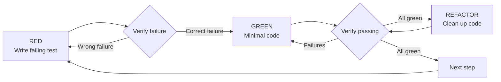

# Best Practices & Pitfall Avoidance: Use Skills Correctly, Avoid Common Traps

## What You'll Learn

- Immediately recognize AI agent rationalization excuses and prevent lazy behaviors
- Master core iron laws: TDD, systematic debugging, evidence-first
- Avoid common anti-patterns and reduce rework and debugging time
- Build efficient collaboration habits and establish quality consensus with AI agents

## Your Current Situation

You've spent hours developing with an AI agent, only to discover:
- Code has no tests, features are full of bugs
- AI says "it should work," but it errors immediately when run
- Fixed the same issue three times, each time introducing new bugs
- AI convinced you to skip skills, saying "this one is simple"
- During code review, you realize you implemented the wrong functionality

**This isn't because AI isn't smart enough—it's because you let the AI "cut corners."**

## Superpowers' Five Iron Laws

Superpowers isn't just a simple toolset—it forces AI agents to follow five iron laws:

| Iron Law | Core Content | Cost of Violation |
| -------- | ------------ | ----------------- |
| **1% Principle** | Even with 1% probability, must invoke a skill | AI skips necessary checks, leading to missed work |
| **TDD Iron Law** | No production code without a failing test | Code becomes untestable, hard to maintain, hides bugs |
| **Debugging Iron Law** | No fixes without root cause | Symptom fixes, problem recurrence, wasted time |
| **Evidence Iron Law** | No completion claims without evidence | False progress, broken trust, rework |
| **Review Iron Law** | Early, frequent reviews | Technical debt accumulation, high rework costs |

## 1. Skill Invocation Iron Law: Preventing AI from Cutting Corners

### Core Principle

**Even with 1% probability, you must invoke a skill.**

AI agents are skilled at "rationalizing"—finding various reasons to skip necessary workflows.

### Common Rationalization Excuses vs. Truth

| AI's Excuse | Truth | Countermeasure |
| ----------- | ----- | -------------- |
| "This is a simple problem" | A problem is a task, check skills | Insist on invoking skills |
| "I need more context" | Skill checks happen before clarifying problems | Invoke skill first, then ask questions |
| "Let me explore the codebase first" | Skills will tell you how to explore | Invoke skill first, follow skill's guidance |
| "I can quickly check git/files" | Files lack conversation context | Invoke skill first, then read files |
| "Let me gather information first" | Skills will tell you how to gather information | Invoke skill first, then gather |
| "This doesn't require a formal skill" | If there's a skill, use it | Insist on using it |
| "I remember this skill" | Skills update, read the latest version | Read the skill every time |
| "This doesn't count as a task" | Any action is a task | Insist on invoking skills |
| "Using a skill is overkill" | Simple things will become complex | Insist on using skills |
| "Let me do this one thing first" | Check before doing anything | Insist on invoking skills |
| "This feels efficient" | Undisciplined action wastes time | Skills prevent inefficiency |
| "I know what it means" | Knowing the concept ≠ using the skill | Must invoke the skill |

### Skill Priority

When multiple skills might apply, use this order:

1. **Process skills first** (brainstorming, debugging) — decide how to handle the task
2. **Implementation skills second** (TDD, review) — guide execution

Examples:
- "Build X" → brainstorming first, then implementation skills
- "Fix this bug" → debugging first, then TDD

## 2. TDD Iron Law: Reject Post-Hoc Testing

### Core Principle

```
NO PRODUCTION CODE WITHOUT A FAILING TEST FIRST
```

If you haven't seen a test fail before writing code, you haven't proven it tests correctly.

### RED-GREEN-REFACTOR Loop



### Common Rationalization Excuses

| AI's Excuse | Truth |
| ----------- | ----- |
| "Too simple, doesn't need tests" | Simple code breaks. Tests take 30 seconds. |
| "I'll write tests later" | Tests passing immediately proves nothing was tested. |
| "Post-hoc testing is the same" | Post-hoc tests answer "what does this do," tests first answer "what should this do" |
| "I manually tested all edge cases" | Ad-hoc testing ≠ systematic. No record, cannot rerun. |
| "Deleting X hours of work is wasteful" | Sunk cost fallacy. Keeping unverified code is technical debt. |
| "Keep as reference, write tests first" | You'll tweak it, that's testing after. Delete means delete. |
| "Need to explore first" | OK. Discard exploration code, start with TDD. |
| "Test is hard = design unclear" | Follow the test. Hard to test = hard to use. |
| "TDD slows me down" | TDD is faster than debugging. Practical = test first. |
| "Manual testing is faster" | Manual doesn't prove edge cases. Rerun for every change. |
| "Existing code has no tests" | You're improving it. Add tests to existing code. |

### Red Flags: Stop Immediately

- Writing code before tests
- Testing after implementation
- Tests pass immediately
- Cannot explain why tests failed
- "Will add tests later"
- Rationalizing "just this once"
- "I already manually tested"
- "Post-hoc testing is the same"
| "It's about mindset, not ritual"
| "Keep as reference" or "adjust existing code"
| "Already spent X hours, deleting is wasteful"
| "TDD is dogmatic, I'm practical"
| "This time is different because..."

**All these mean: delete code, restart with TDD.**

## 3. Debugging Iron Law: Reject Blind Fixes

### Core Principle

```
NO FIXES WITHOUT ROOT CAUSE INVESTIGATION FIRST
```

Don't propose fixes until you've completed root cause investigation.

### Four-Phase Systematic Debugging

| Phase | Core Activity | Success Criteria |
| ----- | -------------- | ---------------- |
| **1. Root Cause Investigation** | Read error messages, reproduce, check changes, gather evidence | Understand WHAT and WHY |
| **2. Pattern Analysis** | Find working examples, compare with references | Identify differences |
| **3. Hypothesis Testing** | Form theories, minimal tests | Confirm or new hypothesis |
| **4. Implementation** | Create tests, fix, verify | Bug fixed, tests pass |

### Common Rationalization Excuses

| AI's Excuse | Truth |
| ----------- | ----- |
| "Problem is simple, no need for process" | Simple problems have root causes too. Process is faster for simple bugs. |
| "Urgent, no time for process" | Systematic debugging is faster than guessing and trial-and-error. |
| "Try this first, then investigate" | First fix sets the pattern. Get it right from the start. |
| "I'll write tests to verify the fix" | Untested fixes aren't durable. Tests first prove it works. |
| "Multiple fixes at once saves time" | Can't isolate the effective fix. Introduces new bugs. |
| "Reference is too long, I'll adapt the pattern" | Partial understanding guarantees bugs. Read completely. |
| "I see the problem, let me fix it" | Seeing symptoms ≠ understanding root cause. |
| "Try the fix again" (after 2+ failures) | 3+ failures = architectural problem. Question the pattern, don't just fix. |

### Red Flags: Stop Immediately

- "Quick fix, investigate later"
- "Try changing X and see if it works"
- "Add multiple changes, run tests"
- "Skip tests, I'll manually verify"
| "Could be X, let me fix it"
| "I don't fully understand but this might work"
| "Pattern says X but I'll adapt differently"
| "List main issues: [list fixes, no investigation]"
| Propose solutions before tracing data flow
| **"Try the fix again"** (already tried 2+ times)
| **Each fix reveals new problems in different locations**

**All these mean: stop, go back to phase 1.**

**If 3+ fixes fail: question the architecture.**

## 4. Evidence Iron Law: Reject False Completion

### Core Principle

```
NO COMPLETION CLAIMS WITHOUT FRESH VERIFICATION EVIDENCE
```

If this message didn't run verification commands, you can't claim it passed.

### Gatekeeper Function

```
Before claiming any state or expressing satisfaction:

1. Identify: What command proves this claim?
2. Run: Execute the complete command (fresh, complete)
3. Read: Full output, check exit code, count failures
4. Verify: Does output confirm the claim?
   - No: State actual status with evidence
   - Yes: State claim with evidence
5. Only then: Issue the claim

Skipping any step = lying, not verification
```

### Common Rationalization Excuses

| AI's Excuse | Truth |
| ----------- | ----- |
| "Should work now" | Run verification |
| "I'm confident" | Confidence ≠ evidence |
| "Just this once" | No exceptions |
| "Linter passed" | Linter ≠ compiler |
| "Agent said it succeeded" | Independent verification |
| "I'm tired" | Fatigue is not an excuse |
| "Partial check is enough" | Partial proves nothing |
| "Different wording so rule doesn't apply" | Spirit over literal |

### Red Flags: Stop Immediately

- Using "should," "might," "seems like"
- Expressing satisfaction before verification ("Good!", "Perfect!", "Done!")
| Not verifying before commit/push/PR
| Trusting agent success reports
| Relying on partial verification
| Thinking "just this once"
| Tired and want work to end
| **Any wording suggesting success but not running verification**

## 5. Code Review Iron Law: Early, Frequent Reviews

### Core Principle

**Review early, review often.**

### When to Request Reviews

**Mandatory:**
- After every task in subagent-driven development
- After completing major features
- Before merging into main branch

**Optional but valuable:**
- When stuck (new perspective)
- Before refactoring (baseline check)
- After fixing complex bugs

### Red Flags: Never

- Skipping reviews because "it's simple"
- Ignoring serious issues
| Continuing with unresolved critical issues
| Arguing against valid technical feedback
| Trusting agent reports without checking VCS diff

## 6. Plan Writing: Assume Engineer Has No Context

### Core Principle

**Assume engineer has zero context and questionable taste.**

Provide all information they need: which files, code, tests, docs to change for each task, and how to test. Break down the entire plan into bite-sized tasks.

### Key Principles

- **DRY**: Don't Repeat Yourself
- **YAGNI**: You Aren't Gonna Need It
- **TDD**: Write tests first for every feature
- **Frequent commits**: Commit after completing each task

## 7. Design Phase: One Question at a Time

### Core Principle

**Ask only one question at a time. Don't overwhelm with multiple questions.**

### Key Principles

- Multiple choice is better than open-ended (when possible)
- **YAGNI is ruthless**: Remove unnecessary features from all designs
- Explore alternatives: Always present 2-3 approaches before finalizing
- Incremental validation: Present designs in segments, confirm each

## 8. Subagent-Driven: Two-Phase Reviews

### Core Principle

**Every task with fresh subagent + two-phase reviews (specs first, then code quality) = high quality, fast iteration.**

### Red Flags: Never

- Starting implementation on main/master branch without explicit user consent
- Skipping reviews (spec compliance or code quality)
| Continuing with unresolved issues
| Dispatching multiple implementation subagents concurrently (conflicts)
| Letting subagents read plan files (provide full text)
| Skipping scenario setup context
| Ignoring subagent questions
| Starting code quality review before spec compliance ✅ (wrong order)
| Moving to next task with any review unresolved

## 9. Git Worktree: Isolated Development

### Core Principle

**Use Git worktrees to create isolated development environments, keeping the main branch clean.**

Before starting any feature work that needs isolation, create a worktree:
- Don't pollute the main branch
- Parallel multiple feature branches
- Quickly discard bad experiments

## 10. Common Anti-Patterns Summary

### 12 Rationalization Excuses AI Agents Will Use

| No. | Excuse Type | Example | Response |
| --- | ----------- | ------- | -------- |
| 1 | **"Simple" excuse** | "This is simple, no skill needed" | 1% principle, must invoke |
| 2 | **"Later" excuse** | "I'll write tests/investigate later" | Do it now, later is meaningless |
| 3 | **"Quick fix" excuse** | "Quick fix this, investigate later" | No fixes without root cause |
| 4 | **"Manual test" excuse** | "I manually tested, it's fine" | Manual ≠ automatic, no record |
| 5 | **"Sunk cost" excuse** | "Already spent X hours, deleting is wasteful" | Sunk cost fallacy, delete and restart |
| 6 | **"Reference" excuse** | "Keep code as reference" | You'll tweak it, delete and restart |
| 7 | **"Pragmatic" excuse** | "TDD is dogma, I'm pragmatic" | Practical = follow the process |
| 8 | **"Explore" excuse** | "Let me explore the code first" | Skills tell you how to explore |
| 9 | **"Remember" excuse** | "I remember this skill" | Read the latest version every time |
| 10 | **"Urgent" excuse** | "Urgent, no time for process" | Process is faster, trial-and-error is slower |
| 11 | **"Partial verification" excuse** | "Linter passed" | Partial verification proves nothing |
| 12 | **"Fatigue" excuse** | "I'm tired, let's leave it" | Fatigue is not an excuse, verify before claiming |

### Immediate Stop Signals

When you hear these signals, **stop immediately and return to the correct process**:

| Signal | Meaning | Correct Action |
| ------ | ------- | -------------- |
| "Is this?" | You assumed without verification | Verify your assumption |
| "It will show us...?" | You should add evidence gathering | Return to root cause investigation |
| "Stop guessing" | You proposed solutions without understanding | Complete root cause investigation |
| "Think deeply about this problem" | Question fundamentals, not just symptoms | Return to the root problem |
| "We're stuck?" (frustrated) | Your approach isn't working | Reanalyze the problem |

## 11. Golden Rules for Collaborating with AI Agents

### Seven Guidelines for Building Trust

1. **Iron laws are non-negotiable**: TDD, debugging, evidence iron laws are not options
2. **Evidence over claims**: Don't trust any completion declarations until you see output
3. **Recognize rationalization**: AI will find various excuses, must recognize and stop them
4. **Early reviews**: Review after every task, don't pile up for PR
5. **Systematic process**: Don't skip any steps, even for "simple" tasks
6. **Respect priorities**: Process skills take precedence over implementation skills
7. **Trust verification**: Only believe completion when you see command output and evidence

### Build Efficient Work Habits

::: tip Recommended Practice

At the start of every conversation, you can tell the AI:

```
Please strictly follow Superpowers skills. Even if you think it's unnecessary,
you must invoke relevant skills first. All "simple," "quick," "later"
and other rationalization excuses are prohibited.
```

This sets expectations, letting the AI agent know you'll enforce strict discipline.
:::

## Lesson Summary

Superpowers' core value isn't making AI smarter—it's making AI "obedient":

- **1% Principle** prevents AI from skipping necessary checks
- **TDD Iron Law** ensures code is testable and maintainable
- **Debugging Iron Law** avoids blind fixes and problem recurrence
- **Evidence Iron Law** establishes trust baseline, rejects false progress
- **Review Iron Law** finds problems early, reduces late-stage rework

By recognizing and stopping the 12 common rationalization excuses used by AI agents, you'll gain:
- Higher code quality
- Faster development speed (less rework)
- More stable delivery (systematic process)
- Better collaboration experience (trust building)

## Next Lesson Preview

> In the next lesson, we'll learn **[Complete Skills Reference](../../appendix/skills-reference/)**.
>
> You'll learn:
> - Quick reference table for 14 skills
> - Trigger conditions and core points for each skill
> - How to quickly find the skills you need

---

## Appendix: Source Code Reference

<details>
<summary><strong>Click to expand source code locations</strong></summary>

> Updated: 2026-02-01

| Feature | File Path | Line Numbers |
| ------- | --------- | ------------ |
| Skill invocation iron law & 1% principle | [`skills/using-superpowers/SKILL.md`](https://github.com/obra/superpowers/blob/main/skills/using-superpowers/SKILL.md#L6-L12) | 6-12, 24, 48-66 |
| TDD iron law & RED-GREEN-REFACTOR | [`skills/test-driven-development/SKILL.md`](https://github.com/obra/superpowers/blob/main/skills/test-driven-development/SKILL.md#L31-L45) | 31-45, 47-69, 272-289 |
| Systematic debugging four-phase process | [`skills/systematic-debugging/SKILL.md`](https://github.com/obra/superpowers/blob/main/skills/systematic-debugging/SKILL.md#L16-L45) | 16-45, 50-122, 215-232 |
| Evidence-first gatekeeper function | [`skills/verification-before-completion/SKILL.md`](https://github.com/obra/superpowers/blob/main/skills/verification-before-completion/SKILL.md#L16-L38) | 16-38, 52-62, 64-75 |
| Code review iron law & Red Flags | [`skills/requesting-code-review/SKILL.md`](https://github.com/obra/superpowers/blob/main/skills/requesting-code-review/SKILL.md#L10-L12, 92-99) | 10-12, 92-99 |
| Subagent-driven two-phase reviews | [`skills/subagent-driven-development/SKILL.md`](https://github.com/obra/superpowers/blob/main/skills/subagent-driven-development/SKILL.md#L10-L11, 199-214) | 10-11, 199-214 |
| Plan writing principles (DRY, YAGNI, TDD) | [`skills/writing-plans/SKILL.md`](https://github.com/obra/superpowers/blob/main/skills/writing-plans/SKILL.md#L10-L12, 90-96) | 10-12, 90-96 |
| Design phase principles (one question at a time) | [`skills/brainstorming/SKILL.md`](https://github.com/obra/superpowers/blob/main/skills/brainstorming/SKILL.md#L16-L21, 47-54) | 16-21, 47-54 |

**Key Constants**:
- No hardcoded constants, skill system dynamically loads based on files

**Key Functions**:
- No function definitions, skill system is based on Markdown files and YAML frontmatter

</details>
