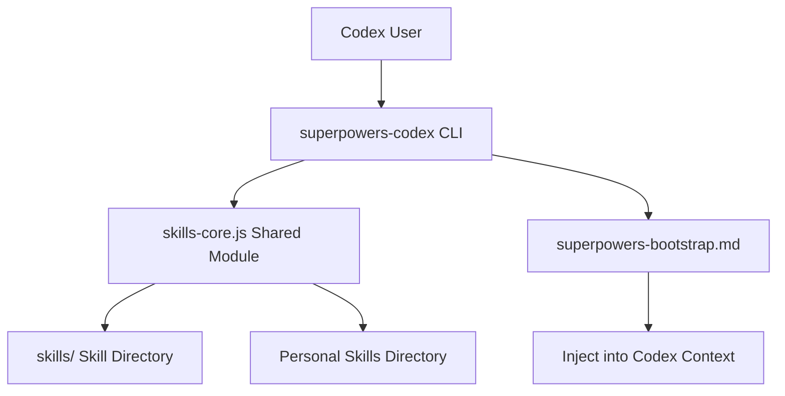
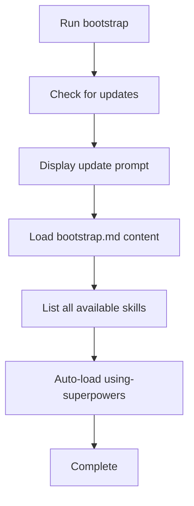

# Codex Platform Integration Guide

## What You'll Learn

- Install Superpowers CLI tool in Codex
- Use bootstrap to automatically load all skills
- Distinguish Superpowers skills from personal skills using namespaces
- Understand tool mapping rules to correctly convert Claude Code skills

## Your Current Challenge

Codex is OpenAI's powerful AI coding tool, but it lacks structured workflow guidance:
- You want Codex to follow TDD, but don't know how to enforce it
- Debugging is arbitrary when encountering bugs, lacking a systematic approach
- You want to reuse Superpowers skills from Claude Code, but the platforms are incompatible

Superpowers brings a complete skill system to Codex through CLI tools and the bootstrap mechanism.

## When to Use This

- **First-time Superpowers users**: Must install CLI tools first
- **Verify skill loading**: Check if bootstrap is correctly injected
- **Create personal skills**: Write custom skills in Codex

::: warning Experimental Feature
Codex support is currently experimental and may require adjustments based on user feedback. If you encounter issues, please [report on GitHub](https://github.com/obra/superpowers/issues).
:::

## Core Concept

Superpowers works in Codex through CLI tools and the bootstrap mechanism:

| Layer | Component | Purpose |
| --- | --- | --- |
| **CLI Layer** | superpowers-codex script | Provides skill loading, discovery, and bootstrap commands |
| **Core Layer** | skills-core.js | Shared skill discovery and parsing module (shared with OpenCode) |
| **Bootstrap Layer** | superpowers-bootstrap.md | Skill context injected at session startup |

**CLI Tool Architecture**:



**Key Advantages**:
- **Cross-platform consistency**: Uses the same `skills-core` module as OpenCode, ensuring consistent skill parsing
- **Namespace isolation**: Distinguishes official skills from personal skills with `superpowers:` prefix
- **Flexible override**: Personal skills can override Superpowers skills with the same name, enabling customization

## Follow Along: Installation and Verification

### Step 1: Quick Installation (Recommended)

**Why**
Let Codex automatically handle all installation steps, reducing manual operations.

**Action**

Run in Codex:

```
Fetch and follow instructions from https://raw.githubusercontent.com/obra/superpowers/refs/heads/main/.codex/INSTALL.md
```

**You should see**:
Codex will automatically execute the installation script, including cloning the repository, setting permissions, and other steps.

### Step 2: Manual Installation (Alternative)

**Why**
If quick installation fails, you can manually execute each step.

::: code-group

```bash [macOS/Linux]
# Create directory
mkdir -p ~/.codex/superpowers

# Clone repository
git clone https://github.com/obra/superpowers.git ~/.codex/superpowers

# Ensure script is executable
chmod +x ~/.codex/superpowers/.codex/superpowers-codex
```

```powershell [Windows]
# Create directory
New-Item -ItemType Directory -Force -Path "$env:USERPROFILE\.codex\superpowers"

# Clone repository
git clone https://github.com/obra/superpowers.git "$env:USERPROFILE\.codex\superpowers"

# Ensure script is executable
icacls "$env:USERPROFILE\.codex\superpowers\.codex\superpowers-codex.exe" /grant "$($env:USERNAME):F"
```

:::

The Bootstrap file will automatically load from the cloned location, no additional configuration needed.

**You should see**:
Repository successfully cloned to `~/.codex/superpowers/` directory.

### Step 3: Verify Installation

**Why**
Confirm that CLI tools work properly and skill directory structure is correct.

**Action**

Run in Codex:

```
Run ~/.codex/superpowers/.codex/superpowers-codex find-skills to show available skills
```

**You should see**:
```
Available skills:
=================

superpowers:brainstorming
  Interactive design refinement...

superpowers:test-driven-development
  TDD workflow for writing reliable code...

[... more skills ...]

Usage:
  superpowers-codex use-skill <skill-name>   # Load a specific skill

Skill naming:
  Superpowers skills: superpowers:skill-name (from ~/.codex/superpowers/skills/)
  Personal skills: skill-name (from ~/.codex/skills/)
  Personal skills override superpowers skills when names match.
```

### Step 4: Run Bootstrap

**Why**
Bootstrap injects the complete Superpowers context at session startup, including tool mappings and skill lists.

**Action**

Run in Codex:

```
Run ~/.codex/superpowers/.codex/superpowers-codex bootstrap
```

**You should see**:
```
# Superpowers Bootstrap for Codex
# ================================

<EXTREMELY_IMPORTANT>
You have superpowers.

**Tool for running skills:**
- `~/.codex/superpowers/.codex/superpowers-codex use-skill <skill-name>`

**Tool Mapping for Codex:**
When skills reference tools you don't have, substitute your equivalent tools:
- `TodoWrite` → `update_plan` (your planning/task tracking tool)
...

## Available Skills:
[Skill list...]

## Auto-loading superpowers:using-superpowers skill:
[using-superpowers skill content...]

# Bootstrap Complete!
# You now have access to all superpowers skills.
```

## Checkpoint ✅

| Check | Expected Result | Command |
| --- | --- | --- |
| Directory exists | `~/.codex/superpowers/` exists | `ls ~/.codex/superpowers/` |
| CLI executable | Script has execute permission | `ls -la ~/.codex/superpowers/.codex/superpowers-codex` |
| find-skills | Shows all available skills | `~/.codex/superpowers/.codex/superpowers-codex find-skills` |
| bootstrap | Injects complete skill context | `~/.codex/superpowers/.codex/superpowers-codex bootstrap` |

## Common Pitfalls

### Common Error 1: Skill Not Found

**Symptom**: "Skill not found" when running `use-skill`

**Cause**: Skill directory doesn't exist or CLI path is incorrect

**Solution**:
```
# Check skill directory
ls ~/.codex/superpowers/skills

# Check if CLI is executable
~/.codex/superpowers/.codex/superpowers-codex find-skills

# If skill directory is empty, reclone
rm -rf ~/.codex/superpowers
git clone https://github.com/obra/superpowers.git ~/.codex/superpowers
```

### Common Error 2: CLI Script Not Executable

**Symptom**: "Permission denied" when running commands

**Cause**: Script doesn't have execute permission

**Solution**:
```
chmod +x ~/.codex/superpowers/.codex/superpowers-codex
```

### Common Error 3: Node.js Version Too Low

**Symptom**: ES module errors when running CLI

**Cause**: `skills-core.js` uses ES modules and requires Node.js v14+ (v18+ recommended)

**Solution**:
```
# Check Node.js version
node --version

# If version is too low, upgrade to v18+
# Visit https://nodejs.org to download the latest LTS version
```

## Deep Dive: Core Mechanisms

### CLI Tool Commands

Superpowers provides three core commands:

| Command | Description | Use Case |
| --- | --- | --- |
| `bootstrap` | Load complete bootstrap, including all skill information | Run once at session startup |
| `use-skill <name>` | Load specific skill into context | When you need to use a skill |
| `find-skills` | List all available skills | View available skill list |

**Bootstrap Command Flow**:



### Skill Namespaces

Superpowers uses namespaces to distinguish skill sources:

| Skill Type | Naming Format | Example | Source |
| --- | --- | --- | --- |
| Superpowers skills | `superpowers:skill-name` | `superpowers:brainstorming` | `~/.codex/superpowers/skills/` |
| Personal skills | `skill-name` | `my-custom-skill` | `~/.codex/skills/` |

**Override Rules**:
- Personal skills override Superpowers skills with the same name
- For example: if you have `~/.codex/skills/brainstorming/`, it will override `superpowers:brainstorming`
- Use `superpowers:` prefix to force loading the official skill

### Tool Mapping

Superpowers skills were originally written for Claude Code and need tool mapping in Codex:

| Claude Code Tool | Codex Equivalent Tool | Description |
| --- | --- | --- |
| `TodoWrite` | `update_plan` | Task tracking and planning tool |
| `Task` (subagent) | `spawn_agent` + `wait` | If collab available, execute concurrently; otherwise sequentially |
| `Subagent` / `Agent` references | `spawn_agent` | Map to collab or sequential fallback |
| `Skill` tool | `superpowers-codex use-skill` | Skill loading command |
| `Read` / `Write` / `Edit` | Codex native tools | File operations |

::: tip Tool Mapping Example
When a skill says "use TodoWrite to record tasks", Codex should interpret it as "use update_plan to record tasks".
:::

### Shared Core Module

`lib/skills-core.js` is an ES module providing the following functionality:

| Function | Purpose | Use Case |
| --- | --- | --- |
| `extractFrontmatter(filePath)` | Extract YAML frontmatter | Parse skill metadata |
| `findSkillsInDir(dir, sourceType, maxDepth)` | Recursively find all skills | List available skills |
| `resolveSkillPath(skillName, ...)` | Resolve skill path (handle overrides) | Locate skill files |
| `checkForUpdates(repoDir)` | Check Git updates | Prompt for updates during bootstrap |
| `stripFrontmatter(content)` | Remove frontmatter | Extract pure content |

This module is also used by OpenCode plugins, ensuring cross-platform consistency.

### Creating Personal Skills

Create custom skills in the `~/.codex/skills/` directory:

```bash
# Create skill directory
mkdir -p ~/.codex/skills/my-skill
```

Create `~/.codex/skills/my-skill/SKILL.md`:

```markdown
---
name: my-skill
description: Use when [condition] - [what it does]
---

# My Skill

[Your skill content here]
```

**Naming Conventions**:
- Use lowercase letters and hyphens (kebab-case)
- The description field must be filled (used for trigger conditions)

## Summary

The Codex platform provides flexible integration of Superpowers through CLI tools:

- **Simple installation**: Both automatic and manual installation available
- **Bootstrap mechanism**: Automatically injects all skill contexts at session startup
- **Namespace isolation**: Clear distinction between official and personal skills
- **Tool mapping**: Automatically adapts Claude Code skills to Codex environment
- **Shared core**: Uses the same core modules as OpenCode, ensuring consistency

After installation, run the bootstrap command each time you start a session, and Codex will automatically gain all Superpowers skills and best practices.

## Next Up

> In the next lesson, we'll learn about **[Platform Comparison and Selection](../platform-comparison/)**.
>
> You'll learn:
> - Feature differences across the three platforms
> - Use cases for each platform
> - How to choose the right platform based on your needs

---

## Appendix: Source Reference

<details>
<summary><strong>Click to expand source code locations</strong></summary>

> Last updated: 2026-02-01

| Feature | File Path | Line |
| --- | --- | --- |
| CLI tool script | [`.codex/superpowers-codex`](https://github.com/obra/superpowers/blob/main/.codex/superpowers-codex) | Full file |
| Shared core module | [`lib/skills-core.js`](https://github.com/obra/superpowers/blob/main/lib/skills-core.js) | Full file |
| Bootstrap file | [`.codex/superpowers-bootstrap.md`](https://github.com/obra/superpowers/blob/main/.codex/superpowers-bootstrap.md) | Full file |
| Codex documentation | [`docs/README.codex.md`](https://github.com/obra/superpowers/blob/main/docs/README.codex.md) | Full file |

**Key Functions**:

- `extractFrontmatter(filePath)`: Extract YAML frontmatter from skill files (lines 16-52)
- `findSkillsInDir(dir, sourceType, maxDepth)`: Recursively find all skills in directory (lines 62-97)
- `resolveSkillPath(skillName, superpowersDir, personalDir)`: Resolve skill path, handle override logic (lines 108-140)
- `checkForUpdates(repoDir)`: Check if Git repository has updates (lines 148-170)
- `stripFrontmatter(content)`: Remove frontmatter, return pure content (lines 178-200)

**CLI Command Handling**:

- `runBootstrap()`: Bootstrap command implementation, including update check and skill list (lines 72-124)
- `runUseSkill(skillName)`: use-skill command implementation, supports namespaces (lines 126-239)
- `runFindSkills()`: find-skills command implementation, list all skills (lines 37-70)

**Key Path Configuration**:

- Superpowers skills directory: `~/.codex/superpowers/skills/`
- Personal skills directory: `~/.codex/skills/`
- CLI script: `~/.codex/superpowers/.codex/superpowers-codex`
- Bootstrap file: `~/.codex/superpowers/.codex/superpowers-bootstrap.md`

**Command Examples**:

- Quick installation: `Fetch and follow instructions from https://raw.githubusercontent.com/obra/superpowers/refs/heads/main/.codex/INSTALL.md`
- Find skills: `~/.codex/superpowers/.codex/superpowers-codex find-skills`
- Load skill: `~/.codex/superpowers/.codex/superpowers-codex use-skill superpowers:brainstorming`
- Bootstrap: `~/.codex/superpowers/.codex/superpowers-codex bootstrap`
- Update: `cd ~/.codex/superpowers && git pull`

</details>
