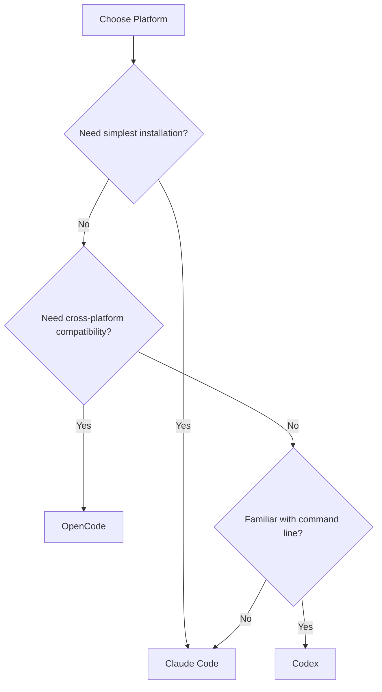
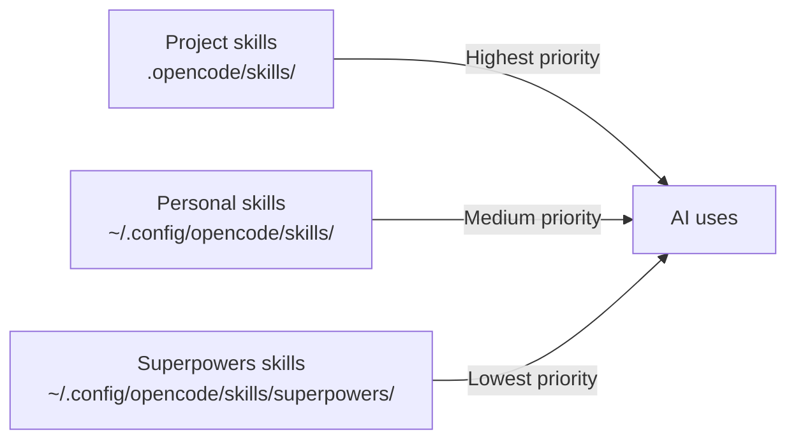

# Platform Comparison and Selection

## What You'll Learn

By the end of this chapter, you will:
- Understand the core differences and feature comparison of three platforms
- Choose the most suitable platform based on your use cases
- Understand skill discovery and loading mechanisms for each platform
- Master tool mapping and hook system principles

## Your Current Struggles

Claude Code, OpenCode, and Codex can all run Superpowers, but there are significant differences:
- **Different installation methods**: Some use plugin marketplaces, others require manual configuration
- **Different skill discovery mechanisms**: Some auto-inject, others require manual loading
- **Different tool mappings**: The same skill needs different tool adapters on different platforms
- **Different use cases**: Some are suitable for individual development, others for team collaboration

Don't know which platform to choose, and worried about wasting time with the wrong choice?

## When to Use This Approach

- **First-time Superpowers installation**: Unsure which platform to choose
- **Platform migration**: Need to understand differences and migration costs of the new platform
- **Team platform selection**: Need to evaluate which platform best fits team collaboration

## Core Concept

Superpowers integrates differently across the three platforms, but the core value remains consistent:

| Dimension | Claude Code | OpenCode | Codex |
| --- | --- | --- | --- |
| **Installation** | Plugin marketplace (simplest) | JavaScript plugin | CLI tool + Bootstrap |
| **Skill injection** | Hook auto-inject | System prompt transform | Bootstrap manual load |
| **Skill discovery** | Automatic | Native skill tool | CLI command |
| **Tool mapping** | Native support | Needs mapping rules | Needs mapping rules |
| **Skill priority** | Single | Three-level priority | Namespace isolation |
| **Best for** | Individual developers | Multi-platform users | CLI-savvy developers |

**Decision Tree**:



## Detailed Comparison: Feature Differences

### Installation Method Comparison

| Platform | Installation Complexity | Update Method | Best For |
| --- | --- | --- | --- |
| **Claude Code** | ⭐ Simplest | `/plugin update superpowers` | Users seeking convenience |
| **OpenCode** | ⭐⭐ Moderate | Git pull and relink | Multi-platform users |
| **Codex** | ⭐⭐⭐ Complex | `git pull` + permission fixes | CLI-savvy developers |

**Claude Code** (Simplest):
```bash
# Install with one command
/plugin install superpowers@superpowers-marketplace

# Update with one command
/plugin update superpowers
```

**OpenCode** (Moderate):
```bash
# Let AI help you install
Fetch and follow instructions from https://raw.githubusercontent.com/obra/superpowers/refs/heads/main/.opencode/INSTALL.md

# Update requires re-cloning
cd ~/.config/opencode/skills/superpowers
git pull
```

**Codex** (Complex):
```bash
# Quick installation (recommended)
Fetch and follow instructions from https://raw.githubusercontent.com/obra/superpowers/refs/heads/main/.codex/INSTALL.md

# Manual installation
git clone https://github.com/obra/superpowers.git ~/.codex/superpowers
chmod +x ~/.codex/superpowers/.codex/superpowers-codex
```

### Skill Discovery and Loading Mechanisms

| Platform | Skill Discovery | Skill Loading | Trigger Condition |
| --- | --- | --- | --- |
| **Claude Code** | Hook auto-inject | Hook auto-inject | Session start |
| **OpenCode** | Native skill tool | Skill tool manual load | When skill needed |
| **Codex** | CLI command search | CLI command load | Bootstrap or manual call |

**Claude Code - Auto-Injection**:

```bash
# SessionStart Hook auto-injects on session start
# No manual operation needed, skills immediately available
/superpowers:brainstorm  # Use directly
```

**OpenCode - Manual Loading**:

```bash
# Use native skill tool to list all skills
use skill tool to list skills

# Use native skill tool to load specific skill
use skill tool to load superpowers/brainstorming
```

**Codex - Bootstrap or Manual Loading**:

```bash
# Method 1: Bootstrap auto-loads all skills
~/.codex/superpowers/.codex/superpowers-codex bootstrap

# Method 2: Manually load specific skill
~/.codex/superpowers/.codex/superpowers-codex use-skill superpowers:brainstorming
```

### Skill Priority and Override Mechanisms

| Platform | Priority Levels | Override Rules | Namespace |
| --- | --- | --- | --- |
| **Claude Code** | Single | None | None |
| **OpenCode** | Three-level priority | Project > Personal > Superpowers | None (directory isolation) |
| **Codex** | Namespace isolation | Personal skills override Superpowers | `superpowers:` prefix |

**Claude Code - Single Skill Library**:
- Skills come from plugin directory, no override mechanism
- All skills treated equally

**OpenCode - Three-Level Priority**:



::: info Skill Override Example
If the project directory has `.opencode/skills/brainstorming/`, it will completely override Superpowers' brainstorming skill.
:::

**Codex - Namespace Isolation**:

```bash
# Superpowers skills (with prefix)
superpowers:brainstorming
superpowers:test-driven-development

# Personal skills (no prefix)
my-custom-skill
brainstorming  # Will override superpowers:brainstorming
```

::: tip Force Load Official Skills
Even if you have a personal skill with the same name, using the `superpowers:` prefix forces loading the official skill:
```bash
use-skill superpowers:brainstorming  # Force load official skill
```
:::

### Tool Mapping Comparison

| Claude Code Tool | OpenCode Equivalent | Codex Equivalent | Description |
| --- | --- | --- | --- |
| `Skill` tool | `skill` tool | `superpowers-codex use-skill` | Skill loading |
| `TodoWrite` | `update_plan` | `update_plan` | Task tracking |
| `Task` (subagent) | `@mention` | `spawn_agent` + `wait` | Subagent call |
| `Read` / `Write` / `Edit` | Native tools | Native tools | File operations |

**Claude Code - Native Support**:
- Skills directly use Claude Code's native tools
- No mapping needed, works out of the box

**OpenCode - Auto Mapping**:

```markdown
**Tool Mapping for OpenCode:**
When skills reference tools you don't have, substitute OpenCode equivalents:
- `TodoWrite` → `update_plan`
- `Task` tool with subagents → Use OpenCode's subagent system (@mention)
- `Skill` tool → OpenCode's native `skill` tool
- `Read`, `Write`, `Edit`, `Bash` → Your native tools
```

**Codex - Bootstrap Mapping**:

```markdown
**Tool Mapping for Codex:**
When skills reference tools you don't have, substitute your equivalent tools:
- `TodoWrite` → `update_plan` (your planning/task tracking tool)
- `Task` tool with subagents → `spawn_agent` + `wait` (if collab available, parallel; otherwise sequential)
```

### Hook System Comparison

| Platform | Hook Types | Purpose | Implementation |
| --- | --- | --- | --- |
| **Claude Code** | SessionStart | Inject skill content on session start | `hooks/session-start.sh` |
| **OpenCode** | system.transform | Modify system prompt before each request | `superpowers.js` plugin |
| **Codex** | None | Manually run Bootstrap | CLI command |

**Claude Code - SessionStart Hook**:

```json
// hooks/hooks.json
{
  "hooks": {
    "SessionStart": "bash hooks/session-start.sh"
  }
}
```

On each session start, the `session-start.sh` script automatically injects the `using-superpowers` skill content.

**OpenCode - System Transform Hook**:

```javascript
// .opencode/plugins/superpowers.js
export const SuperpowersPlugin = async ({ client, directory }) => {
  return {
    'experimental.chat.system.transform': async (_input, output) => {
      const bootstrap = getBootstrapContent();
      if (bootstrap) {
        (output.system ||= []).push(bootstrap);
      }
    }
  };
};
```

On each request, the system prompt is automatically modified to inject Superpowers context.

**Codex - Manual Bootstrap**:

```bash
# Need to manually run Bootstrap command
~/.codex/superpowers/.codex/superpowers-codex bootstrap
```

::: warning Codex No Auto Hook
Codex doesn't support automatic hooks, requiring manual Bootstrap command execution on each session start.
:::

## Use Cases and Selection Recommendations

### Claude Code: Best for Individual Developers

**Advantages**:
- ✅ Simplest installation, done with one command
- ✅ Auto-injection, no manual skill loading needed
- ✅ Slash commands intuitive and easy to use
- ✅ Official support, fast bug fixes

**Disadvantages**:
- ❌ Only supports Claude Code platform
- ❌ Limited skill override mechanism

**Best For**:
- Individual developers
- First-time AI coding agent users
- Seekers of out-of-the-box experience
- Users who don't want to fuss with configuration

### OpenCode: Best for Multi-Platform Users

**Advantages**:
- ✅ Supports multiple platforms (Claude, OpenAI, etc.)
- ✅ Three-level skill priority, flexible override
- ✅ Auto tool mapping
- ✅ Native skill tool integration

**Disadvantages**:
- ❌ Slightly complex installation, requires manual symbolic link configuration
- ❌ Requires manual skill loading

**Best For**:
- Multi-platform users
- Users needing custom skill overrides
- Team collaboration scenarios
- Users needing project-level skill isolation

### Codex: Best for Advanced Users

**Advantages**:
- ✅ CLI tool, scriptable
- ✅ Clear namespace isolation
- ✅ Shares core modules with OpenCode
- ✅ Flexible override mechanism

**Disadvantages**:
- ❌ Most complex installation, requires CLI operations
- ❌ No auto hooks, need manual Bootstrap execution
- ❌ Experimental features, potentially unstable

**Best For**:
- Advanced users familiar with command line
- Users needing scripted operations
- Users wanting deep customization and debugging
- Users willing to accept experimental features

### Quick Selection Table

| Your Needs | Recommended Platform |
| --- | --- |
| Simplest installation and use | Claude Code |
| Multi-platform support | OpenCode |
| Need project-level skill overrides | OpenCode |
| Command line enthusiast | Codex |
| Team collaboration | OpenCode |
| Individual rapid development | Claude Code |
| Deep customization and debugging | Codex |

## Platform Migration Guide

### Migrating from Claude Code to OpenCode

**Migration Steps**:

1. **Install OpenCode Plugin**
   ```bash
   Fetch and follow instructions from https://raw.githubusercontent.com/obra/superpowers/refs/heads/main/.opencode/INSTALL.md
   ```

2. **Learn Tool Mapping**
   - Slash commands → Native skill tool
   - Get familiar with OpenCode's `@mention` system

3. **Adjust Workflow**
   - Manually load skills after session start (if needed)
   - Use `use skill tool to load superpowers/brainstorming`

### Migrating from Claude Code to Codex

**Migration Steps**:

1. **Install CLI Tool**
   ```bash
   Fetch and follow instructions from https://raw.githubusercontent.com/obra/superpowers/refs/heads/main/.codex/INSTALL.md
   ```

2. **Run Bootstrap**
   ```bash
   ~/.codex/superpowers/.codex/superpowers-codex bootstrap
   ```

3. **Learn Command Line Operations**
   - Slash commands → CLI commands
   - `/superpowers:brainstorm` → `~/.codex/superpowers/.codex/superpowers-codex use-skill superpowers:brainstorming`

### Migrating from OpenCode to Claude Code

**Migration Steps**:

1. **Install Claude Code Plugin**
   ```bash
   /plugin marketplace add obra/superpowers-marketplace
   /plugin install superpowers@superpowers-marketplace
   ```

2. **Verify Skill Loading**
   ```bash
   /help
   # Should see commands like /superpowers:brainstorm
   ```

3. **Enjoy Automation**
   - No manual skill loading needed
   - Slash commands immediately available

## Chapter Summary

Each of the three platforms has its advantages, and the choice depends on your needs:

- **Claude Code**: Simplest, out-of-the-box, best for individual developers
- **OpenCode**: Multi-platform support, flexible overrides, best for team collaboration
- **Codex**: CLI tool, highly customizable, best for advanced users

Regardless of which platform you choose, Superpowers' core value and skill content remain consistent. The key is to understand the differences between platforms and choose the one that best fits your workflow.

## Next Lesson Preview

> In the next lesson, we'll learn **[Design Workflow: Brainstorming](../../core-workflows/design-workflow/)**.
>
> You'll learn:
> - How to do creative design before coding
> - Use the brainstorming skill for requirement clarification
> - Save and manage design documents

---

## Appendix: Source Code Reference

<details>
<summary><strong>Click to expand source code locations</strong></summary>

> Last updated: 2026-02-01

| Feature | File Path | Lines |
| --- | --- | --- |
| Claude Code plugin config | [`.claude-plugin/plugin.json`](https://github.com/obra/superpowers/blob/main/.claude-plugin/plugin.json) | Full file |
| Claude Code SessionStart Hook | [`hooks/session-start.sh`](https://github.com/obra/superpowers/blob/main/hooks/session-start.sh) | Full file |
| OpenCode plugin | [`.opencode/plugins/superpowers.js`](https://github.com/obra/superpowers/blob/main/.opencode/plugins/superpowers.js) | Full file |
| Codex CLI tool | [`.codex/superpowers-codex`](https://github.com/obra/superpowers/blob/main/.codex/superpowers-codex) | Full file |
| Shared core module | [`lib/skills-core.js`](https://github.com/obra/superpowers/blob/main/lib/skills-core.js) | Full file |

**Key Configurations**:

- **Claude Code Hook config**: [`hooks/hooks.json`](https://github.com/obra/superpowers/blob/main/hooks/hooks.json) - Defines SessionStart Hook
- **OpenCode System Transform**: [`.opencode/plugins/superpowers.js`](https://github.com/obra/superpowers/blob/main/.opencode/plugins/superpowers.js#L88-L94) - Injects system prompt
- **Codex Bootstrap mechanism**: [`.codex/superpowers-codex`](https://github.com/obra/superpowers/blob/main/.codex/superpowers-codex#L72-L124) - bootstrap command implementation

**Platform Documentation**:

- [Claude Code Documentation](https://github.com/obra/superpowers/blob/main/README.md#L31-L44)
- [OpenCode Documentation](https://github.com/obra/superpowers/blob/main/docs/README.opencode.md)
- [Codex Documentation](https://github.com/obra/superpowers/blob/main/docs/README.codex.md)

**Key Paths**:

| Platform | Skills Directory | Config Directory |
| --- | --- | --- |
| Claude Code | `~/.config/claude-code/skills/superpowers/` | `~/.config/claude-code/` |
| OpenCode | `~/.config/opencode/skills/superpowers/` | `~/.config/opencode/` |
| Codex | `~/.codex/superpowers/skills/` | `~/.codex/` |

</details>
