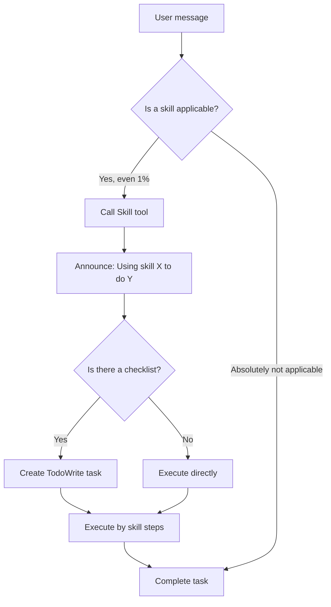

# What is Superpowers: Complete Development Workflow for AI Coding Agents

## What You'll Learn

By the end of this chapter, you will:
- Understand **what Superpowers is** and how it changes the way AI agents work
- Know **why you need it**—identify common problems and limitations of AI agents
- Master **how the skill system works**—how skills auto-trigger and priority rules
- Learn about **14 core skills**—how they cover the complete software development lifecycle

---

## Your Current Struggles

If you've used Claude Code, OpenCode, or Codex, you've likely encountered these situations:

| AI Agent Problems | Real Scenarios |
| ----------------- | -------------- |
| **Skipping design, writing code directly** | You say "add user authentication" and it starts writing code immediately without asking about JWT vs Session, or whether two-factor authentication is needed |
| **Lack of test-driven development discipline** | Writes feature code first, then remembers to write tests, or commits without tests at all |
| **Ad-hoc debugging** | Tests fail, it modifies code based on intuition, tries a few times until it "seems fixed," but the root cause isn't found |
| **Lack of collaboration standards** | When multiple tasks run in parallel, there's no clear priority. Code review becomes an afterthought |

These problems aren't because AI models aren't smart enough, but rather **lack systematic workflow constraints**. Superpowers exists to solve this problem.

---

## Core Concept

**What is Superpowers?**

Superpowers is a complete software development lifecycle workflow built from **14 composable "Skills"** and initial instructions, ensuring that AI coding agents are forced to follow best practices.

::: info What is a "Skill"?

A "Skill" is a Markdown file that defines a specific workflow, containing:
- Trigger conditions (when to use this skill)
- Workflow diagram (how to execute step by step)
- Quick reference table (key points)
- Common error warnings (Red Flags)

Skills are not "suggestions" but "mandatory rules." AI agents must check if an applicable skill exists before executing tasks.

:::

**How does it work?**

Traditional AI agent workflow:
```
User request → Generate code directly → Submit
```

Superpowers-enhanced workflow:
```
User request → Check skills → Call skill → Execute by process → Verify → Complete
```

::: tip Mandatory Skill Invocation Rule

Even if there's only a **1% chance** that a skill applies, the AI agent **must invoke it**. This is not optional, non-negotiable, and cannot be "rationalized" away.

For example, the agent thinks: "This is just a simple problem, no skill needed" → ❌ Wrong! Must check skills first.

:::

---

## How the Skill System Works

### Skill Invocation Flow

When an AI agent receives a task, it follows this workflow:



### Red Flags: Common Misconceptions

AI agents often have these "rationalized" thoughts when skipping skill checks:

| AI Agent Thoughts | Reality |
| ---------------- | ------- |
| "This is just a simple problem" | Problems are tasks too, must check skills |
| "I need more context" | Skill checking happens before asking questions |
| "Let me explore the codebase first" | Skills tell you how to explore, check skills first |
| "I can quickly check git/files" | Files lack conversation context, must check skills |
| "This skill is too heavy" | Simple things become complex, use the skill |
| "I know this skill" | Skills get updated, must read the current version |

### Skill Priority

When multiple skills might apply, select in this order:

1. **Process skills first** (like brainstorming, debugging) — determine **how** to handle the task
2. **Implementation skills second** (like frontend-design) — guide specific execution

**Examples**:
- "Let's build X" → brainstorming first, then implementation skills
- "Fix this bug" → debugging first, then domain-specific skills

### Skill Types

- **Rigid**: Like TDD, debugging — must be followed precisely, discipline cannot be adjusted
- **Flexible**: Like design patterns — can adjust principles based on context

The skill itself will tell you which type it is.

---

## Superpowers' 14 Core Skills

### Skill Library Categories

**Testing Skills**
- **test-driven-development**: RED-GREEN-REFACTOR cycle, forces writing tests first

**Debugging Skills**
- **systematic-debugging**: Four-stage root cause analysis process
- **verification-before-completion**: Ensure it's truly fixed, verification first

**Collaboration Skills**
- **brainstorming**: Socratic design refinement, clarifying requirements through questions
- **writing-plans**: Detailed implementation plans, each task 2-5 minutes
- **executing-plans**: Batch execute plans, human checkpoints
- **dispatching-parallel-agents**: Concurrent sub-agent workflows
- **requesting-code-review**: Pre-review checklists
- **receiving-code-review**: How to respond to code review feedback
- **using-git-worktrees**: Using Git worktrees to create isolated development environments
- **finishing-a-development-branch**: Branch completion workflow (merge/PR/keep/abandon)
- **subagent-driven-development**: Rapid iteration, two-stage review (spec compliance, code quality)

**Meta Skills**
- **writing-skills**: Best practices guide for creating new skills
- **using-superpowers**: Skill system entry point (this chapter is about this skill)

### Complete Development Workflow

When you say "Let's build a new feature," Superpowers will automatically trigger the following workflow:

```mermaid
graph LR
    A[User request] --> B[brainstorming]
    B --> C[using-git-worktrees]
    C --> D[writing-plans]
    D --> E[subagent-driven-development]
    E --> F[test-driven-development]
    F --> G[requesting-code-review]
    G --> H[finishing-a-development-branch]

    style A fill:#e3f2fd
    style B fill:#bbdefb
    style C fill:#bbdefb
    style D fill:#bbdefb
    style E fill:#bbdefb
    style F fill:#bbdefb
    style G fill:#bbdefb
    style H fill:#90caf9
```



**Each step triggers automatically**, no manual intervention needed.

### Philosophical Principles

Superpowers is designed based on four principles:

| Principle | Meaning |
| --------- | ------- |
| **Test-Driven Development** | Test first, always write tests first |
| **Systematic over ad-hoc** | Systematic processes beat random guessing |
| **Complexity reduction** | Simplicity is the primary goal (YAGNI principle) |
| **Evidence over claims** | Must verify before declaring success (evidence first) |

---

## Why Superpowers is Useful?

### Benefits for AI Agents

| Problem | Superpowers Solution |
| ------- | ------------------- |
| Skipping design, writing code directly | brainstorming skill forces clarifying requirements first |
| Missing tests, problems found only after commit | TDD skill forces RED-GREEN-REFACTOR cycle |
| Ad-hoc debugging, multiple fixes without finding root cause | systematic-debugging skill provides four-stage process |
| Chaotic tasks, unclear priorities | writing-plans skill breaks tasks into 2-5 minute chunks |
| Code review becomes an afterthought | requesting-code-review skill automatically reviews after each task |

### Benefits for You

- **More reliable code**: Enforced test-driven development reduces bugs
- **Clearer design**: brainstorming ensures correct requirement understanding
- **Faster iteration**: Subagent-driven development lets AI work independently for hours
- **Trackable progress**: Every step has checklists and verification requirements
- **Consistent quality**: Same workflow regardless of who uses it

---

## Chapter Summary

- **Superpowers** is a complete software development lifecycle workflow that ensures AI agents are forced to follow best practices through 14 composable skills
- **Skills are not suggestions**, but mandatory rules — AI agents must check and invoke applicable skills before executing tasks
- **The skill system** triggers automatically without manual intervention, covering the complete flow from design to deployment
- **Four principles**: TDD, systematic, simplification, evidence first are the core guidance for all skills

---

## Next Lesson Preview

> In the next lesson, we'll learn **[Quick Start: Get Started in 5 Minutes](../quick-start/)**.
>
> You'll experience hands-on:
> - Using Superpowers' basic workflow
> - Triggering brainstorming skill to clarify requirements
> - Experiencing AI agent's "auto-navigation" capability

---

## Appendix: Source Code Reference

<details>
<summary><strong>Click to expand source code locations</strong></summary>

> Updated: 2026-02-01

| Feature | File Path | Line Numbers |
| ------- | --------- | ------------ |
| Superpowers definition | [`README.md`](https://github.com/obra/superpowers/blob/main/README.md#L3) | 3 |
| Workflow description | [`README.md`](https://github.com/obra/superpowers/blob/main/README.md#L5-L15) | 5-15 |
| Basic workflow | [`README.md`](https://github.com/obra/superpowers/blob/main/README.md#L80-L96) | 80-96 |
| Skill library categories | [`README.md`](https://github.com/obra/superpowers/blob/main/README.md#L98-L122) | 98-122 |
| Philosophical principles | [`README.md`](https://github.com/obra/superpowers/blob/main/README.md#L124-L129) | 124-129 |
| Plugin metadata | [`.claude-plugin/plugin.json`](https://github.com/obra/superpowers/blob/main/.claude-plugin/plugin.json#L1-L13) | 1-13 |
| Skill invocation rule | [`skills/using-superpowers/SKILL.md`](https://github.com/obra/superpowers/blob/main/skills/using-superpowers/SKILL.md#L6-L12) | 6-12 |
| Skill invocation flow diagram | [`skills/using-superpowers/SKILL.md`](https://github.com/obra/superpowers/blob/main/skills/using-superpowers/SKILL.md#L26-L46) | 26-46 |
| Red Flags list | [`skills/using-superpowers/SKILL.md`](https://github.com/obra/superpowers/blob/main/skills/using-superpowers/SKILL.md#L48-L64) | 48-64 |
| Skill priority | [`skills/using-superpowers/SKILL.md`](https://github.com/obra/superpowers/blob/main/skills/using-superpowers/SKILL.md#L68-L75) | 68-75 |
| Skill types | [`skills/using-superpowers/SKILL.md`](https://github.com/obra/superpowers/blob/main/skills/using-superpowers/SKILL.md#L77-L83) | 77-83 |

**Key Constants**:
- Plugin version: `"version": "4.1.1"`

**Key Rules**:
- **Mandatory invocation rule**: Even with 1% possibility, must invoke skill (`using-superpowers/SKILL.md:7`)
- **No choice**: If a skill applies, AI agent has no discretion (`using-superpowers/SKILL.md:9`)

</details>
