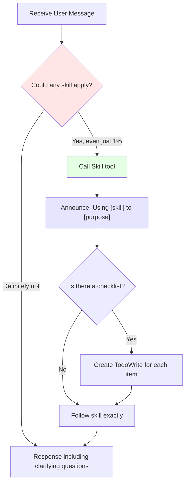

# How to Use Skills: Calling Rules and Priorities

## What You'll Learn

- Understand the core rules of the skill system (1% principle)
- Master the correct timing and flow for skill calls
- Learn skill priorities and know which skill to call first
- Distinguish between rigid and flexible skills to avoid misuse

---

## Your Current Dilemma

Do you feel like the AI agent is sometimes "too smart"?

- You ask a simple question, it gives an answer immediately, but it's incomplete
- You ask it to fix a bug, it starts changing code right away, then introduces new issues
- You want it to follow TDD, it says "this is simple, no need for testing"

**These aren't "smart" behaviors—they're "laziness"**—AI agents will try to accomplish tasks with the least effort.

**Superpowers' Solution**: Mandatory rules—even if there's only a 1% chance, you must check for skills.

---

## When to Use This Approach

**Answer: Check unconditionally before every task.**

Specific scenarios:
- ✅ Build new features
- ✅ Fix bugs
- ✅ Answer technical questions
- ✅ Refactor code
- ✅ Write tests
- ✅ Need to debug issues
- ✅ Explore codebase
- ✅ Collect information

**Remember**: Skill checks must be completed before any response or action, including before asking clarifying questions.

---

## Core Approach

### What is the Skill System?

The **skill system** is Superpowers' core mechanism that requires AI agents to first check for applicable skills before any task.

**Mandatory Rules**:

> **Even if there's only a 1% chance a skill applies, you must call it.**
>
> **If a skill applies, you have no choice—you must use it.**
>
> **This is not optional, not negotiable, and cannot be rationalized away.**

### Why So Strict?

Because AI agents have many ways to "cut corners":
- "This is simple, no need for a skill" → Could become a complex problem in 5 minutes
- "Let me check the code first" → But skills tell you how to check correctly
- "Let me gather information first" → But skills tell you what information to gather

**The skill system prevents all these lazy behaviors**, ensuring AI agents always follow best practices.

---

## Follow Along

### Step 1: Understand the Call Flow

When an AI agent receives your task, it must follow this flow:



**Flow explanation**:

1. **Receive message**: AI agent receives your task
2. **Check for skills**: Determine if any skill might apply (even 1% possibility)
3. **Call skill**: Use Skill tool to load skill content
4. **Announce usage**: Clearly tell you "Using [skill] to [purpose]"
5. **Create task list**: If the skill has a checklist, create a TodoWrite for each item
6. **Follow skill**: Execute strictly according to skill instructions

**Key points**:
- Steps 2-3 must be completed before asking clarifying questions
- Skill check must be completed before any action

---

### Step 2: Recognize "Lazy Excuses"

AI agents might use various excuses to avoid calling skills. Recognizing these excuses ensures they don't cut corners.

**Common misconceptions vs. reality**:

| AI's Thought | Reality |
| --------- | ---- |
| "This is just a simple question" | A question is still a task. Check skills. |
| "I need more context" | Skill check comes before clarifying questions. |
| "Let me check the code first" | Skills tell you how to explore code. Check skills first. |
| "I can quickly check git or files" | Files lack conversation context. Check skills first. |
| "Let me gather information first" | Skills tell you how to gather information. Check skills first. |
| "No formal skill needed" | If a skill exists, use it. |
| "I remember this skill" | Skills evolve. Read the current version. |
| "This isn't a task" | Any action = task. Check skills. |
| "Skill is too complex" | Simple things can become complex. Use the skill. |
| "Let me do this one thing first" | Before doing anything, check skills first. |
| "This feels efficient" | Undisciplined action wastes time. Skills prevent this. |
| "I know what this means" | Knowing concept ≠ using skill. Call it. |

**If the AI agent says these things, immediately require it to check for skills.**

---

### Step 3: Understand Skill Priorities

When multiple skills might apply, use this priority order:

**1. Process Skills First**

Determine how to handle the task first:
- **brainstorming** (creative design)—requires clarifying requirements
- **systematic-debugging** (systematic debugging)—requires fixing bugs

**2. Implementation Skills Second**

Determine implementation approach (examples may vary by project version):
- **test-driven-development** (TDD)
- Other implementation-related skills

**Examples**:

- "Let's build X" → brainstorming first (design), then implementation skills
- "Fix this bug" → systematic-debugging first (debugging), then domain-specific skills

**Principle**: First figure out how to do it (process), then do it (implementation).

---

### Step 4: Distinguish Rigid and Flexible Skills

Not all skills are equally strict.

**Rigid Skills**:

Must be followed exactly—don't adjust the discipline:
- **test-driven-development** (TDD)
- **systematic-debugging** (systematic debugging)

The core of these skills is strict process and discipline—changing the discipline defeats the purpose.

**Flexible Skills**:

Adjust principles based on context:
- **brainstorming** (creative design)
- **writing-plans** (writing plans)

Skill content will reflect this distinction.

**Principle**: Rigid skills must be strictly followed, flexible skills can be flexibly applied.

---

### Step 5: Practical Exercise

Now that you understand the rules, let's see how an AI agent should behave.

**Scenario**: You say "Write me a user registration feature"

**Wrong Approach** (Lazy):
```
AI: Okay, I'll write the registration feature...
[Starts writing code directly]
```

**Correct Approach** (Following Skills):
```
AI: Let me check if there are applicable skills.
[Call brainstorming skill]

AI: Using brainstorming to clarify requirements for the user registration feature.

Now, let me ask a few questions to understand your requirements:
1. What fields are needed?
2. Is email verification required?
3. What are the password requirements?
[Wait for your answer]
```

**Difference**:
- Wrong approach: Starts directly, might get it wrong
- Correct approach: Ask first to ensure requirements are met

---

## Checkpoints

Confirm the AI agent's behavior meets these checkpoints:

- [ ] Before starting a task, AI says "Let me check for skills"
- [ ] Even for simple tasks, AI checks for skills
- [ ] AI doesn't start action before asking clarifying questions
- [ ] When multiple skills apply, AI calls them in priority order
- [ ] Rigid skills (TDD, debugging) are executed strictly according to process
- [ ] AI clearly tells you "Using [skill] to [purpose]"

If all are OK, the AI agent is already following skill calling rules!

---

## Pitfall Alerts

### AI Says It Needs More Context

**Symptom**: AI says "I need more information to start"

**Problem**: Skill check should come before clarifying questions

**Solution**:
- Clearly tell AI: "Before asking questions, check skills first"
- Skills might tell you what information needs to be collected

### AI Says Task Is Simple

**Symptom**: AI says "This is simple, no need for skills"

**Problem**: Simple tasks might also need workflows

**Solution**:
- Remind AI: "Even if there's a 1% possibility, you must check for skills"
- Simple tasks often become complex during the process, skills prevent this

### AI Says It Remembers Skills

**Symptom**: AI says "I know what TDD is, no need to call skills"

**Problem**: Skills evolve, memory might be outdated

**Solution**:
- Require AI: "Use Skill tool to call the latest version of the skill"
- Skill files might be updated, AI needs to read the latest version

---

## Lesson Summary

In this lesson you learned:

1. **Core Rule**: Even if there's only a 1% possibility, you must call skills
2. **Call Flow**: Receive message → Check skills → Call Skill tool → Announce usage → Follow skills
3. **Common Excuses**: Recognize AI's "lazy" thoughts, prevent skill evasion
4. **Skill Priorities**: Process skills (brainstorming, debugging) first, implementation skills second
5. **Skill Types**: Rigid skills (TDD, debugging) strictly followed, flexible skills flexibly applied

**Core Ideas**:
- Skill system prevents AI agents from cutting corners
- Mandatory rules ensure best practices are always followed
- Skill check must be completed before any action

---

## Coming Next

> In the next lesson, we'll learn about the **[Claude Code Platform](../../platforms/claude-code/)**.
>
> You'll learn:
> - Complete Claude Code integration approach
> - How to use the Skill tool to call skills
> - Automatic loading mechanism of the hook system

---

## Appendix: Source Code Reference

<details>
<summary><strong>Click to expand source code locations</strong></summary>

> Updated: 2026-02-01

| Function | File Path | Line |
| --- | --- | --- |
| Core rule definition | [`skills/using-superpowers/SKILL.md`](https://github.com/obra/superpowers/blob/main/skills/using-superpowers/SKILL.md#L6-L12) | 6-12 |
| Skill tool invocation | [`skills/using-superpowers/SKILL.md`](https://github.com/obra/superpowers/blob/main/skills/using-superpowers/SKILL.md#L16) | 16 |
| Call flow diagram | [`skills/using-superpowers/SKILL.md`](https://github.com/obra/superpowers/blob/main/skills/using-superpowers/SKILL.md#L26-L46) | 26-46 |
| Red Flags (lazy excuses) | [`skills/using-superpowers/SKILL.md`](https://github.com/obra/superpowers/blob/main/skills/using-superpowers/SKILL.md#L48-L65) | 48-65 |
| Skill priority rules | [`skills/using-superpowers/SKILL.md`](https://github.com/obra/superpowers/blob/main/skills/using-superpowers/SKILL.md#L67-L76) | 67-76 |
| Rigid/flexible skill distinction | [`skills/using-superpowers/SKILL.md`](https://github.com/obra/superpowers/blob/main/skills/using-superpowers/SKILL.md#L77-L81) | 77-81 |
| User instruction explanation | [`skills/using-superpowers/SKILL.md`](https://github.com/obra/superpowers/blob/main/skills/using-superpowers/SKILL.md#L85-L88) | 85-88 |

**Key constants**:
- **1% principle**: Must call skill even if only 1% possibility (`L7`)

**Key rules**:
- **Mandatory rule**: If a skill applies, AI must use it, not negotiable (`L9-L12`)
- **Process first**: Process skills (brainstorming, debugging) → Implementation skills (`L71-L75`)

</details>
