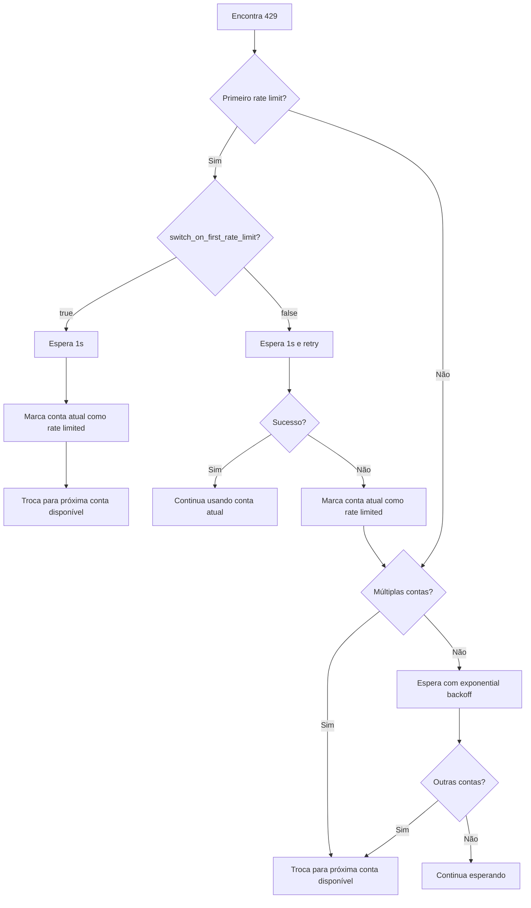

# Tratamento de Rate Limiting: Retry Automático e Mecanismo de Troca de Contas

## O Que Você Vai Aprender

Entenda e domine o mecanismo inteligente de tratamento de rate limiting do Antigravity Auth:
- Distinguir 5 tipos diferentes de erro 429 (cota esgotada, limite de taxa, capacidade esgotada, etc.)
- Compreender o algoritmo de backoff exponencial para retry automático
- Dominar a lógica de troca automática em cenários de contas múltiplas
- Configurar troca imediata no primeiro rate limit ou troca após 2 retries
- Usar o fallback de pool de cotas duplas do Gemini para melhorar a disponibilidade

Não seja mais incomodado por "todas as contas foram rate limitadas, mas a cota ainda não foi esgotada".

## Seu Dilema Atual

Ao usar contas Google múltiplas, você encontra:
- Erros 429 de rate limit frequentemente, sem saber se deve fazer retry ou trocar de conta
- Tempos de espera diferentes para diferentes tipos de 429, sem saber quanto esperar
- Todas as contas foram rate limitadas, mas a cota real não foi esgotada, porque o julgamento de rate limit não é preciso
- Momento de troca do pool de cotas duplas do Gemini não é claro, causando desperdício de cota

## Quando Usar Esta Técnica

Quando você:
- Configurou várias contas, mas encontra erros 429 frequentemente
- Quer otimizar a taxa de sucesso de requisições em cenários de contas múltiplas
- Precisa ajustar a estratégia de retry (ex: troca imediata no primeiro rate limit)
- Usa modelos Gemini e quer aproveitar o pool de cotas duplas

## Ideia Central

### O Que É Tratamento de Rate Limiting

O plugin Antigravity Auth executa automaticamente as seguintes operações ao encontrar erro 429:

1. **Detecção do Tipo de Rate Limit**: Analisa o `reason` ou `message` da resposta, distingue 5 tipos de rate limit
2. **Cálculo do Tempo de Backoff**: Calcula inteligentemente o tempo de espera com base no tipo de rate limit e número de falhas
3. **Execução da Estratégia**:
   - **Contas Múltiplas**: Prioriza a troca para contas disponíveis
   - **Conta Única**: Exponential backoff retry
4. **Registro de Estado**: Atualiza o estado de rate limit da conta para referência de requisições futuras

::: info Por Que Precisamos de Tratamento Inteligente?
O Google tem limites de taxa para cada conta. Se simplesmente "trocar ao encontrar 429", pode causar trocas frequentes, perdendo contas que se recuperam rapidamente; se simplesmente "esperar e fazer retry", pode desperdiçar cotas de outras contas disponíveis. O tratamento inteligente precisa encontrar o equilíbrio ótimo entre "trocar" e "esperar".
:::

### 5 Tipos de Rate Limit

O Antigravity Auth distingue os seguintes 5 tipos de rate limit com base no campo `reason` ou conteúdo `message` da resposta da API:

| Tipo | Causa | Estratégia de Backoff | Cenário Típico |
| --- | --- | --- | --- |
| `QUOTA_EXHAUSTED` | Cota esgotada (diária ou mensal) | Backoff progressivo: 1min → 5min → 30min → 120min | Cota diária esgotada |
| `RATE_LIMIT_EXCEEDED` | Requisições muito rápidas (limite por minuto) | Fixo 30 segundos | Muitas requisições em curto tempo |
| `MODEL_CAPACITY_EXHAUSTED` | Capacidade do servidor de modelo insuficiente | Fixo 15 segundos | Horários de pico |
| `SERVER_ERROR` | Erro interno do servidor (5xx) | Fixo 20 segundos | Serviço instável |
| `UNKNOWN` | Causa desconhecida | Fixo 60 segundos | Erro não analisável |

**Fórmula de Cálculo do Tempo de Backoff** (accounts.ts:51-75):

```typescript
// QUOTA_EXHAUSTED: backoff progressivo (baseado no número de falhas consecutivas)
// Falha 1 vez: 1min (60_000ms)
// Falha 2 vezes: 5min (300_000ms)
// Falha 3 vezes: 30min (1_800_000ms)
// Falha 4+ vezes: 120min (7_200_000ms)

// Outros tipos: backoff fixo
// RATE_LIMIT_EXCEEDED: 30s
// MODEL_CAPACITY_EXHAUSTED: 15s
// SERVER_ERROR: 20s
// UNKNOWN: 60s
```

### Algoritmo de Backoff Exponencial

O Antigravity Auth usa um algoritmo de **backoff exponencial com deduplicação**:

**Lógica Principal** (plugin.ts:509-567):

```typescript
// 1. Janela de deduplicação: 429s concorrentes em 2 segundos são considerados o mesmo evento
const RATE_LIMIT_DEDUP_WINDOW_MS = 2000;

// 2. Reset de estado: reset do contador após 2 minutos sem 429
const RATE_LIMIT_STATE_RESET_MS = 120_000;

// 3. Backoff exponencial: baseDelay * 2^(tentativa-1), máximo 60s
const expBackoff = Math.min(baseDelay * Math.pow(2, attempt - 1), 60000);
```

**Por Que Precisamos de Janela de Deduplicação?**

Suponha que você tenha 3 requisições concorrentes que disparam 429 simultaneamente:
- **Sem deduplicação**: cada requisição incrementa o contador em +1, resultando em attempt=3, backoff de 4s (2^2 × 1s)
- **Com deduplicação**: considerado como o mesmo evento, attempt=1, backoff de 1s

A janela de deduplicação evita que requisições concorrentes amplifiquem excessivamente o tempo de backoff.

### Lógica de Troca de Contas Múltiplas

O Antigravity Auth em cenários de contas múltiplas adota uma estratégia de **priorizar troca, com retry como fallback**:

**Fluxo de Decisão**:



**Configurações Principais** (config/schema.ts:256-259):

| Opção de Configuração | Padrão | Descrição |
| --- | --- | --- |
| `switch_on_first_rate_limit` | `true` | Trocar conta imediatamente no primeiro rate limit (após esperar 1s) |
| `max_rate_limit_wait_seconds` | `300` | Tempo máximo de espera quando todas as contas estão rate limitadas (5 minutos) |

**Configurações Recomendadas**:

- **Contas Múltiplas (2+)**: `switch_on_first_rate_limit: true`, troca imediata, evita desperdiçar cota
- **Conta Única**: esta configuração é inválida, usa automaticamente exponential backoff retry

### Fallback de Pool de Cotas Duplas do Gemini

Modelos Gemini suportam dois pools de cotas independentes:
- **Pool de Cotas Antigravity**: uso prioritário, mas capacidade menor
- **Pool de Cotas Gemini CLI**: uso alternativo, capacidade maior

**Lógica de Fallback** (plugin.ts:1318-1345):

```
1. Envia requisição usando pool de cotas Antigravity
2. Encontra rate limit 429
3. Verifica se há outra conta com cota Antigravity disponível
   - Sim: troca de conta, continua usando Antigravity
   - Não: se quota_fallback=true, troca para pool de cotas Gemini CLI
```

**Opções de Configuração** (config/schema.ts:179):

```json
{
  "quota_fallback": true  // padrão false
}
```

**Exemplo**:

Você tem 2 contas, ambas encontram 429:

| Status | quota_fallback=false | quota_fallback=true |
| --- | --- | ---|
| Conta 1 (Antigravity) | Rate limit | Rate limit → tenta Gemini CLI |
| Conta 2 (Antigravity) | Rate limit | Rate limit → tenta Gemini CLI |
| Resultado | Espera 5 minutos e retry | Troca para Gemini CLI, sem espera |

::: tip Vantagens do Pool de Cotas Duplas
O pool de cotas Gemini CLI geralmente é maior, o fallback pode melhorar significativamente a taxa de sucesso de requisições. Mas note:
- Modelos com sufixo `:antigravity` explícito não fazem fallback
- Só faz fallback quando todas as cotas Antigravity das contas foram esgotadas
:::

### Lógica de Retry de Conta Única

Se houver apenas uma conta, o Antigravity Auth usa **retry com backoff exponencial**:

**Fórmula de Retry** (plugin.ts:1373-1375):

```typescript
// Primeira vez：1s
// 2ª vez：2s (1s × 2^1)
// 3ª vez：4s (1s × 2^2)
// 4ª vez：8s (1s × 2^3)
// ...
// Máximo：60s
const expBackoffMs = Math.min(1000 * Math.pow(2, attempt - 1), 60000);
```

**Fluxo de Retry**:

```
1ª vez: encontra 429
  ↓ espera 1s e faz retry (retry rápido)
2ª vez: ainda 429
  ↓ espera 2s e faz retry
3ª vez: ainda 429
  ↓ espera 4s e faz retry
...
```

**Diferença com Contas Múltiplas**:

| Cenário | Estratégia | Tempo de Espera |
| --- | --- | --- |
| Conta Única | Backoff exponencial retry | 1s → 2s → 4s → 8s → ... → 60s |
| Contas Múltiplas | Troca de conta | 1s (primeira) ou 5s (2ª vez) |

## 🎒 Preparação Antes de Começar

::: warning Verificação Prévia
Certifique-se de ter completado:
- [x] Configuração de contas múltiplas (pelo menos 2 contas Google)
- [x] Entender [Estratégias de Seleção de Conta](/pt/NoeFabris/opencode-antigravity-auth/advanced/account-selection-strategies/)
- [x] Entender [Sistema de Cotas Duplas](/pt/NoeFabris/opencode-antigravity-auth/platforms/dual-quota-system/)
:::

## Siga os Passos

### Passo 1: Habilitar Logs de Debug para Observar Rate Limit

**Por Quê**
Logs de debug podem mostrar informações detalhadas de rate limit, ajudando você a entender como o plugin funciona.

**Operação**

Habilite os logs de debug:

```bash
export OPENCODE_ANTIGRAVITY_DEBUG=1
```

Inicie requisições para disparar rate limit:

```bash
# Inicie múltiplas requisições concorrentes（certifique-se de acionar 429）
for i in {1..10}; do
  opencode run "Test $i" --model=google/antigravity-gemini-3-pro &
done
wait
```

**Você deve ver**:

```
[RateLimit] 429 on Account 0 family=claude retryAfterMs=60000
  message: You have exceeded the quota for this request.
  quotaResetTime: 2026-01-23T12:00:00Z
  retryDelayMs: 60000
  reason: QUOTA_EXHAUSTED

Rate limited. Quick retry in 1s... (toast notification)
```

**Interpretação do Log**:

- `429 on Account 0 family=claude`: rate limit da conta 0 para modelo Claude
- `retryAfterMs=60000`: servidor recomenda esperar 60 segundos
- `reason: QUOTA_EXHAUSTED`: cota esgotada (tempo de backoff progressivo)

### Passo 2: Configurar Troca Imediata no Primeiro Rate Limit

**Por Quê**
Se você tem várias contas, a troca imediata no primeiro rate limit pode maximizar a utilização da cota, evitando espera.

**Operação**

Modifique o arquivo de configuração:

```bash
cat > ~/.config/opencode/antigravity.json << 'EOF'
{
  "$schema": "https://raw.githubusercontent.com/NoeFabris/opencode-antigravity-auth/main/assets/antigravity.schema.json",
  "switch_on_first_rate_limit": true
}
EOF
```

**Você deve ver**：arquivo de configuração atualizado.

**Verificar se a Configuração Está Ativa**:

Inicie múltiplas requisições e observe o comportamento após o primeiro rate limit:

```bash
export OPENCODE_ANTIGRAVITY_DEBUG=1
for i in {1..5}; do
  opencode run "Test $i" --model=google/antigravity-gemini-3-pro &
done
wait
```

**Você deve ver**:

```
[RateLimit] 429 on Account 0 family=gemini retryAfterMs=30000
Server at capacity. Switching account in 1s... (toast notification)
[AccountContext] Selected account: user2@gmail.com (index: 1)
```

**Pontos-Chave**:
- Após o primeiro 429, espera 1s
- Troca automaticamente para a próxima conta disponível（index: 1）
- Não faz mais retry na conta atual

### Passo 3: Desabilitar Troca Imediata no Primeiro Rate Limit

**Por quê**
Se desejar fazer retry na conta atual primeiro（evitando trocas frequentes）, você pode desabilitar esta opção.

**Operação**

Modifique o arquivo de configuração:

```bash
cat > ~/.config/opencode/antigravity.json << 'EOF'
{
  "$schema": "https://raw.githubusercontent.com/NoeFabris/opencode-antigravity-auth/main/assets/antigravity.schema.json",
  "switch_on_first_rate_limit": false
}
EOF
```

**Você deve ver**：arquivo de configuração atualizado.

**Verificar se a Configuração Está Ativa**:

Inicie novamente múltiplas requisições:

```bash
export OPENCODE_ANTIGRAVITY_DEBUG=1
for i in {1..5}; do
  opencode run "Test $i" --model=google/antigravity-gemini-3-pro &
done
wait
```

**Você deve ver**:

```
[RateLimit] 429 on Account 0 family=gemini retryAfterMs=30000
Rate limited. Quick retry in 1s... (toast notification)
[RateLimit] 429 on Account 0 family=gemini retryAfterMs=30000
Rate limited again. Switching account in 5s... (toast notification)
[AccountContext] Selected account: user2@gmail.com (index: 1)
```

**Pontos-Chave**:
- Primeiro 429：espera 1s e **faz retry na conta atual**
- Segundo 429：espera 5s e **troca de conta**
- Se o retry for bem-sucedido, continua usando a conta atual

### Passo 4: Habilitar Fallback de Duas Pools de Quota do Gemini

**Por quê**
Modelos Gemini suportam duas pools de quota, habilitar o fallback pode aumentar significativamente a taxa de sucesso das requisições.

**Operação**

Modifique o arquivo de configuração:

```bash
cat > ~/.config/opencode/antigravity.json << 'EOF'
{
  "$schema": "https://raw.githubusercontent.com/NoeFabris/opencode-antigravity-auth/main/assets/antigravity.schema.json",
  "quota_fallback": true
}
EOF
```

**Você deve ver**：arquivo de configuração atualizado.

**Verificar se a Configuração Está Ativa**:

Inicie uma requisição Gemini（certifique-se de acionar o rate limit da pool Antigravity）:

```bash
export OPENCODE_ANTIGRAVITY_DEBUG=1
for i in {1..5}; do
  opencode run "Test $i" --model=google/antigravity-gemini-3-pro &
done
wait
```

**Você deve ver**:

```
[RateLimit] 429 on Account 0 family=gemini retryAfterMs=30000
Antigravity quota exhausted for gemini-3-pro. Switching to Gemini CLI quota... (toast notification)
[DEBUG] quota fallback: gemini-cli
```

**Pontos-Chave**:
- Após todas as contas esgotarem a quota Antigravity
- Troca automaticamente para a pool de quota Gemini CLI
- Sem espera, retry direto

**Forçar Uso da Quota Antigravity**（sem fallback）:

```bash
# Use o sufixo explícito :antigravity
opencode run "Test" --model=google/antigravity-gemini-3-pro:antigravity
```

### Passo 5: Configurar Tempo Máximo de Espera

**Por quê**
Se todas as contas estiverem em rate limit, o plugin esperará o tempo de reset mais curto. Você pode configurar o tempo máximo de espera para evitar esperas infinitas.

**Operação**

Modifique o arquivo de configuração:

```bash
cat > ~/.config/opencode/antigravity.json << 'EOF'
{
  "$schema": "https://raw.githubusercontent.com/NoeFabris/opencode-antigravity-auth/main/assets/antigravity.schema.json",
  "max_rate_limit_wait_seconds": 60
}
EOF
```

**Você deve ver**：arquivo de configuração atualizado.

**Verificar se a Configuração Está Ativa**:

Acione o rate limit em todas as contas:

```bash
export OPENCODE_ANTIGRAVITY_DEBUG=1
for i in {1..20}; do
  opencode run "Test $i" --model=google/antigravity-claude-opus-4.5 &
done
wait
```

**Você deve ver**:

```
[RateLimit] 429 on Account 0 family=claude retryAfterMs=60000
[RateLimit] 429 on Account 1 family=claude retryAfterMs=60000
[DEBUG] All accounts rate limited. Min wait time: 60s, max wait: 60s
Rate limited. Retrying in 60s... (toast notification)
```

**Pontos-Chave**:
- Quando todas as contas estiverem em rate limit, espera o tempo de reset mais curto
- Se o tempo de reset mais curto > `max_rate_limit_wait_seconds`, usa o valor máximo
- Espera máxima padrão é 300 segundos（5 minutos）

## Checkpoint ✅

::: tip Como Verificar se a Configuração Está em Efeito?
1. Verifique o arquivo de configuração para confirmar as opções corretas
2. Habilite logs de debug: `OPENCODE_ANTIGRAVITY_DEBUG=1`
3. Observe os eventos `[RateLimit]` nos logs
4. Observe o comportamento de troca de contas (logs `AccountContext`)
5. Verifique se as notificações toast são exibidas conforme esperado
:::

## Alertas de Armadilhas

### ❌ Ignorar Janela de Deduplicação, Mal-entender Tempo de Backoff

**Comportamento Errado**:
- Inicia 10 requisições concorrentes, todas encontram 429
- Pensa que o tempo de backoff é 2^10 × 1s = 1024s
- Na verdade é 1s (por causa da janela de deduplicação)

**Maneira Correta**: Entenda a janela de deduplicação de 2 segundos, requisições concorrentes não são contadas repetidamente.

### ❌ Misturar `switch_on_first_rate_limit` e Conta Única

**Comportamento Errado**:
- Apenas 1 conta, mas configurou `switch_on_first_rate_limit: true`
- Pensa que vai trocar de conta, mas na verdade não há outras contas para trocar

**Maneira Correta**: Em cenários de conta única, esta configuração é inválida, usa automaticamente exponential backoff retry.

### ❌ Sufixo Explícito do Gemini Bloqueia Fallback

**Comportamento Errado**:
- Usa `google/antigravity-gemini-3-pro:antigravity`
- Configurou `quota_fallback: true`
- Mas ao encontrar 429, não faz fallback para Gemini CLI

**Maneira Correta**: O sufixo explícito força o uso do pool de cotas especificado, se precisar de fallback, não use o sufixo.

### ❌ Tempo de Espera Muito Longo Após Todas as Contas em Rate Limit

**Comportamento Errado**:
- Configurou `max_rate_limit_wait_seconds: 600` (10 minutos)
- Todas as contas em rate limit por 60s, mas esperou 10 minutos

**Maneira Correta**: `max_rate_limit_wait_seconds` é o **valor máximo**, o tempo de espera real é o tempo de reset mais curto, não excedendo o valor máximo.

## Resumo da Aula

| Mecanismo | Característica Principal | Cenário Aplicável |
| --- | --- | --- |
| **Detecção de Rate Limit** | Distingue 5 tipos (QUOTA_EXHAUSTED, RATE_LIMIT_EXCEEDED etc.) | Todos os cenários |
| **Backoff Exponencial** | Mais falhas, maior tempo de espera (1s → 2s → 4s → ... → 60s) | Conta única |
| **Troca de Contas** | Contas múltiplas priorizam troca, conta única faz backoff retry | Contas múltiplas |
| **Janela de Deduplicação** | 429s concorrentes em 2 segundos são o mesmo evento | Cenários concorrentes |
| **Fallback de Pool de Cotas Duplas** | Antigravity rate limitado tenta Gemini CLI | Modelos Gemini |

**Configurações Principais**:

| Configuração | Padrão | Valor Recomendado | Descrição |
| --- | --- | --- | --- |
| `switch_on_first_rate_limit` | `true` | `true` (contas múltiplas) | Troca imediata no primeiro rate limit |
| `quota_fallback` | `false` | `true` (Gemini) | Habilita fallback de pool de cotas duplas |
| `max_rate_limit_wait_seconds` | `300` | `300` | Tempo máximo de espera (segundos) |

**Métodos de Debug**:

- Habilitar logs de debug: `OPENCODE_ANTIGRAVITY_DEBUG=1`
- Visualizar eventos `[RateLimit]`: entender tipo de rate limit e tempo de backoff
- Visualizar logs `[AccountContext]`: observar comportamento de troca de contas

## Próxima Aula

> Na próxima aula aprenderemos **[Recuperação de Sessão](/pt/NoeFabris/opencode-antigravity-auth/advanced/session-recovery/)**.
>
> Você vai aprender:
> - Como recuperar automaticamente chamadas de ferramenta interrompidas
> - Mecanismo de recuperação de sessão de modelos Thinking
> - Princípio de injeção de tool_result Synthetic

---

## Apêndice: Referência de Código Fonte

<details>
<summary><strong>Clique para expandir e ver localização do código fonte</strong></summary>

> Última atualização: 2026-01-23

| Funcionalidade | Caminho do Arquivo | Linhas |
| --- | --- | --- |
| Definição de tipos de rate limit | [`src/plugin/accounts.ts`](https://github.com/NoeFabris/opencode-antigravity-auth/blob/main/src/plugin/accounts.ts#L10-L20) | 10-20 |
| Análise de causa de rate limit | [`src/plugin/accounts.ts`](https://github.com/NoeFabris/opencode-antigravity-auth/blob/main/src/plugin/accounts.ts#L29-L49) | 29-49 |
| Cálculo de tempo de backoff | [`src/plugin/accounts.ts`](https://github.com/NoeFabris/opencode-antigravity-auth/blob/main/src/plugin/accounts.ts#L51-L75) | 51-75 |
| Algoritmo de backoff exponencial | [`src/plugin.ts`](https://github.com/NoeFabris/opencode-antigravity-auth/blob/main/src/plugin.ts#L532-L567) | 532-567 |
| Marcar conta como rate limitada | [`src/plugin/accounts.ts`](https://github.com/NoeFabris/opencode-antigravity-auth/blob/main/src/plugin/accounts.ts#L434-L461) | 434-461 |
| Verificar se conta está rate limitada | [`src/plugin/accounts.ts`](https://github.com/NoeFabris/opencode-antigravity-auth/blob/main/src/plugin/accounts.ts#L134-L152) | 134-152 |
| Tratamento de erro 429 | [`src/plugin.ts`](https://github.com/NoeFabris/opencode-antigravity-auth/blob/main/src/plugin.ts#L1260-L1396) | 1260-1396 |
| Fallback de pool de cotas duplas do Gemini | [`src/plugin.ts`](https://github.com/NoeFabris/opencode-antigravity-auth/blob/main/src/plugin.ts#L1318-L1345) | 1318-1345 |
| Logs de rate limit | [`src/plugin/debug.ts`](https://github.com/NoeFabris/opencode-antigravity-auth/blob/main/src/plugin/debug.ts#L354-L396) | 354-396 |
| Schema de configuração | [`src/plugin/config/schema.ts`](https://github.com/NoeFabris/opencode-antigravity-auth/blob/main/src/plugin/config/schema.ts#L256-L221) | 256-221 |

**Constantes Principais**:

- `QUOTA_EXHAUSTED_BACKOFFS = [60_000, 300_000, 1_800_000, 7_200_000]`: tempos de backoff progressivo para cota esgotada (accounts.ts:22)
- `RATE_LIMIT_EXCEEDED_BACKOFF = 30_000`: backoff fixo de 30 segundos para rate limit (accounts.ts:23)
- `MODEL_CAPACITY_EXHAUSTED_BACKOFF = 15_000`: backoff fixo de 15 segundos para capacidade esgotada (accounts.ts:24)
- `SERVER_ERROR_BACKOFF = 20_000`: backoff fixo de 20 segundos para erro de servidor (accounts.ts:25)
- `RATE_LIMIT_DEDUP_WINDOW_MS = 2000`: janela de deduplicação de 2 segundos (plugin.ts:509)
- `RATE_LIMIT_STATE_RESET_MS = 120_000`: reset de estado em 2 minutos (plugin.ts:510)
- `FIRST_RETRY_DELAY_MS = 1000`: primeiro retry rápido de 1 segundo (plugin.ts:1304)

**Funções Principais**:

- `parseRateLimitReason(reason?, message?)`: análise de causa de rate limit (accounts.ts:29)
- `calculateBackoffMs(reason, consecutiveFailures, retryAfterMs?)`: cálculo de tempo de backoff (accounts.ts:51)
- `markRateLimitedWithReason(account, family, headerStyle, model, reason, retryAfterMs?)`: marcar conta como rate limitada (accounts.ts:445)
- `isRateLimitedForHeaderStyle(account, family, headerStyle, model?)`: verificar se conta está rate limitada (accounts.ts:536)
- `getRateLimitBackoff(accountIndex, quotaKey, serverRetryAfterMs)`: obter tempo de backoff após deduplicação (plugin.ts:532)
- `resetRateLimitState(accountIndex, quotaKey)`: resetar estado de rate limit (plugin.ts:573)

</details>
