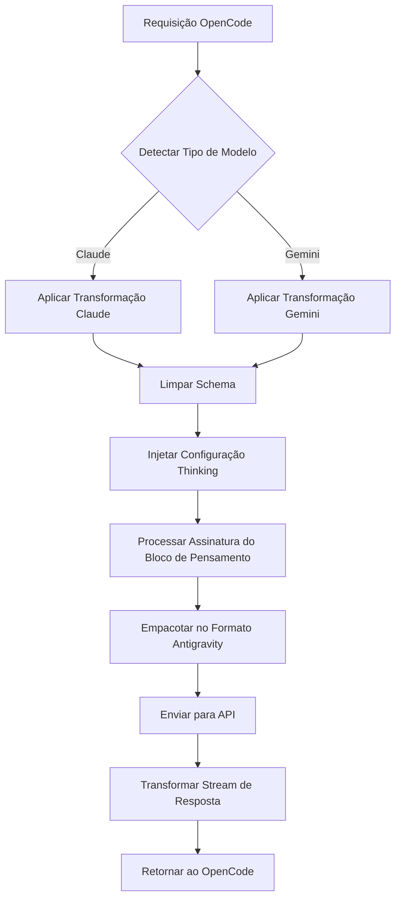

# Mecanismo de Transformação de Requisições: Compatibilidade Multi-Protocolo

## O Que Você Vai Aprender

- Entender como o plugin transforma formatos de requisição entre OpenCode e Antigravity API
- Dominar as diferenças de protocolo e regras de transformação entre modelos Claude e Gemini
- Diagnosticar erros 400 causados por incompatibilidade de Schema
- Otimizar configurações de Thinking para melhor desempenho

## Seu Problema Atual

Você pode estar enfrentando estes problemas:

- ❌ Servidor MCP retorna erro `400 Unknown name 'parameters'`
- ❌ Ao usar modelos Gemini, aparece `400 Unknown name 'const'`
- ❌ Blocos de pensamento do modelo Thinking exibidos incorretamente
- ❌ Chamadas de ferramentas falham com erro de validação de assinatura
- ❌ Não entende por que o plugin suporta Claude e Gemini simultaneamente

## Quando Usar Esta Técnica

Quando você precisa:

| Cenário | Por Que Entender o Mecanismo de Transformação |
| --- | --- |
| Desenvolver servidor MCP personalizado | Garantir que o Schema da ferramenta seja compatível com Antigravity API |
| Diagnosticar erros 400/500 | Determinar se é problema de Schema ou lógica de transformação |
| Otimizar desempenho do Thinking | Entender assinaturas de blocos de pensamento e mecanismo de cache |
| Depurar falhas em chamadas de ferramentas | Verificar atribuição de ID de ferramenta e assinaturas de parâmetros |

::: warning Verificação Prévia
Antes de iniciar este tutorial, certifique-se de que você:
- ✅ Instalou o plugin opencode-antigravity-auth
- ✅ Conhece os modelos disponíveis e suas variantes
- ✅ Entende os conceitos básicos dos modelos Thinking

[Tutorial de Lista de Modelos](../../platforms/available-models/) | [Tutorial de Modelos Thinking](../../platforms/thinking-models/)
:::

## Conceito Central

A transformação de requisições é o mecanismo central do plugin, realizando três tarefas:

1. **Interceptar requisições do OpenCode** — Intercepta chamadas `fetch(generativeLanguage.googleapis.com)`
2. **Aplicar transformação de modelo** — Transforma o formato de acordo com o tipo de modelo (Claude/Gemini)
3. **Empacotar e enviar** — Empacota no formato Antigravity e chama a API
4. **Transformar resposta** — Converte a resposta de volta para formato reconhecível pelo OpenCode

**Diagrama do Fluxo de Transformação**:



**Pontos-Chave de Transformação**:

| Tipo de Transformação | Objetivo | Localização no Código |
| --- | --- | --- |
| Limpeza de Schema | Remover campos não suportados pela Antigravity API | `src/plugin/request-helpers.ts` |
| Configuração Thinking | Injetar configuração de pensamento correta por família de modelo | `src/plugin/transform/claude.ts`, `src/plugin/transform/gemini.ts` |
| Processamento de Bloco de Pensamento | Remover blocos de pensamento históricos e injetar assinaturas | `src/plugin/request.ts` |
| Transformação de Stream de Resposta | Converter eventos SSE para formato OpenCode | `src/plugin/core/streaming.ts` |

## Passo a Passo

### Passo 1: Entender as Regras de Transformação Claude

**Por Quê**
Modelos Claude usam formato de protocolo diferente (snake_case, modo VALIDATED), exigindo tratamento especial.

**Regras-Chave de Transformação**

| Formato Original | Formato Transformado | Descrição |
| --- | --- | --- |
| `toolConfig.functionCallingConfig.mode` | `"VALIDATED"` | Força validação de chamada de ferramenta |
| `thinkingConfig.includeThoughts` | `include_thoughts` | Formato snake_case |
| `thinkingConfig.thinkingBudget` | `thinking_budget` | Formato snake_case |
| `maxOutputTokens` | Ajustado automaticamente para 64.000 | Modelos Thinking precisam de mais espaço de saída |

**Localização no Código**: [`src/plugin/transform/claude.ts:43-56`](https://github.com/NoeFabris/opencode-antigravity-auth/blob/main/src/plugin/transform/claude.ts#L43-L56)

**Exemplo**

```typescript
// Antes da transformação (formato OpenCode)
{
  "toolConfig": {
    "functionCallingConfig": {
      "mode": "AUTO"
    }
  },
  "thinkingConfig": {
    "includeThoughts": true,
    "thinkingBudget": 32000
  }
}

// Após transformação (formato Antigravity)
{
  "toolConfig": {
    "functionCallingConfig": {
      "mode": "VALIDATED"  // Forçado VALIDATED
    }
  },
  "thinkingConfig": {
    "include_thoughts": true,  // snake_case
    "thinking_budget": 32000   // snake_case
  },
  "generationConfig": {
    "maxOutputTokens": 64000   // Ajuste automático para modelos Thinking
  }
}
```

**O Que Você Deve Ver**:
- Todas as transformações de modelos Claude seguem nomenclatura snake_case
- `maxOutputTokens` é automaticamente ajustado para um valor suficientemente grande (`CLAUDE_THINKING_MAX_OUTPUT_TOKENS = 64.000`)

### Passo 2: Entender as Regras de Transformação Gemini

**Por Quê**
Modelos Gemini usam formato camelCase e têm requisitos rigorosos para JSON Schema (tipos em maiúsculas).

**Regras-Chave de Transformação**

| Formato Original | Formato Transformado | Descrição |
| --- | --- | --- |
| JSON Schema `type: "object"` | `type: "OBJECT"` | Tipo deve ser maiúsculo |
| `additionalProperties: false` | Removido | Gemini API não suporta |
| `$ref: "#/$defs/Foo"` | Convertido para `description: "See: Foo"` | Referência convertida em descrição |
| `const: "foo"` | `enum: ["foo"]` | const convertido para enum |
| `enum: ["a", "b"]` | Adiciona dica na descrição `(Allowed: a, b)` | Enums de 2-10 itens recebem dica automática |

**Localização no Código**: [`src/plugin/transform/gemini.ts:52-124`](https://github.com/NoeFabris/opencode-antigravity-auth/blob/main/src/plugin/transform/gemini.ts#L52-L124)

**Exemplo**

```json
// Antes da transformação (formato OpenCode)
{
  "parameters": {
    "type": "object",
    "properties": {
      "status": {
        "type": "string",
        "const": "active",
        "enum": ["active", "inactive"]
      }
    }
  }
}

// Após transformação (formato Gemini)
{
  "parameters": {
    "type": "OBJECT",  // Maiúsculo
    "properties": {
      "status": {
        "type": "STRING",  // Maiúsculo
        "enum": ["active", "inactive"],  // const removido
        "description": "(Allowed: active, inactive)"  // Dica adicionada automaticamente
      }
    }
  }
}
```

**O Que Você Deve Ver**:
- Todos os tipos no Schema Gemini são convertidos para maiúsculas (`STRING`, `OBJECT`, `ARRAY`)
- Campo `const` é removido e convertido para `enum`
- Campos não suportados (`$ref`, `additionalProperties`) são removidos

### Passo 3: Entender o Fluxo de Limpeza de Schema

**Por Quê**
A Antigravity API usa validação rigorosa baseada em protobuf e não suporta todos os campos do JSON Schema padrão.

**Fluxo de Limpeza em Quatro Fases**

1. **Fase 1a: Converter $ref para descrição**
   - `$ref: "#/$defs/Foo"` → `{ description: "See: Foo" }`

2. **Fase 1b: Converter const para enum**
   - `const: "foo"` → `enum: ["foo"]`

3. **Fase 1c: Adicionar dicas de enum**
   - `enum: ["a", "b"]` → Adiciona `(Allowed: a, b)` à descrição

4. **Fase 1d: Remover campos não suportados**
   - Remove: `$schema`, `$defs`, `additionalProperties`, `pattern`, `minLength`, `maxLength`, etc.

**Localização no Código**: [`src/plugin/request-helpers.ts:20-280`](https://github.com/NoeFabris/opencode-antigravity-auth/blob/main/src/plugin/request-helpers.ts#L20-L280)

**Lista de Campos Não Suportados**:

| Campo | Por Que Não é Suportado | Alternativa |
| --- | --- | --- |
| `$ref` | Referências não permitidas | Converter para dica na descrição |
| `const` | Constantes não permitidas | Usar `enum` |
| `additionalProperties` | Propriedades extras não validadas | Mencionar na descrição |
| `$schema`, `$defs` | JSON Draft não usado | Remover |
| `pattern`, `minLength`, `maxLength` | Restrições de string tratadas pelo servidor | Remover |
| `minItems`, `maxItems` | Restrições de array tratadas pelo servidor | Remover |

**O Que Você Deve Ver**:
- Schema do servidor MCP é limpo para formato compatível com Antigravity
- Erros 400 reduzidos, mensagens de erro mais claras

### Passo 4: Entender o Mecanismo de Processamento de Blocos de Pensamento

**Por Quê**
Modelos Claude e Gemini 3 precisam de assinaturas estáveis para blocos de pensamento, caso contrário ocorrem erros de validação de assinatura.

**Fluxo de Processamento em Três Passos**

1. **Remover blocos de pensamento históricos**
   - Remove recursivamente todos os blocos `thinking` históricos (evita conflitos de assinatura)
   - Usa cache para validar validade da assinatura

2. **Injetar nova assinatura de pensamento**
   - Gera assinatura estável para novos blocos de pensamento
   - Armazena assinatura em cache para conversas multi-turno

3. **Garantir ordem dos blocos de pensamento**
   - Claude: thinking deve vir antes de tool_use
   - Gemini: thinking pode aparecer em qualquer posição

**Localização no Código**:
- [`src/plugin/request.ts:711-724`](https://github.com/NoeFabris/opencode-antigravity-auth/blob/main/src/plugin/request.ts#L711-L724)

**Exemplo de Assinatura de Bloco de Pensamento**:

```typescript
// Formato de bloco Thinking do Claude
{
  "type": "thinking",
  "text": "Preciso analisar as necessidades do usuário...",
  "signature": "sig-abc123",  // Assinatura injetada pelo plugin
  "cache_control": { "type": "ephemeral" }  // Controle de cache
}

// Bloco de pensamento histórico (removido)
{
  "type": "thinking",
  "text": "Análise antiga...",  // Removido
  "signature": "sig-old456"  // Assinatura inválida
}
```

**O Que Você Deve Ver**:
- Em conversas multi-turno, blocos de pensamento históricos não são exibidos repetidamente
- Novos blocos de pensamento têm assinatura correta
- Processo de pensamento completo antes das chamadas de ferramentas

### Passo 5: Entender a Transformação de Stream de Resposta

**Por Quê**
A Antigravity API retorna stream SSE (Server-Sent Events), que precisa ser convertido para formato reconhecível pelo OpenCode.

**Regras-Chave de Transformação**

| Formato Original | Formato Transformado | Descrição |
| --- | --- | --- |
| `thought: true` | `type: "reasoning"` | Conversão de formato de bloco de pensamento |
| `text` | Mantido | Conteúdo de texto |
| `tool_use` | Mantido | Chamada de ferramenta |
| `tool_result` | Mantido | Resultado de ferramenta |

**Localização no Código**: [`src/plugin/core/streaming.ts`](https://github.com/NoeFabris/opencode-antigravity-auth/blob/main/src/plugin/core/streaming.ts)

**Exemplo de Evento SSE**:

```
// Retorno da Antigravity API
data: {"type": "thinking", "text": "Analisando...", "thought": true}

// Após transformação
data: {"type": "reasoning", "text": "Analisando..."}

// Evento de texto
data: {"type": "text", "text": "Olá"}

// Evento de chamada de ferramenta
data: {"type": "tool_use", "id": "tool-123", "name": "my_function"}
```

**O Que Você Deve Ver**:
- Blocos de pensamento exibidos corretamente na interface como tipo `reasoning`
- Resposta em streaming sem atraso, conversão linha por linha
- Formato correto de eventos de chamada de ferramenta

## Checkpoint ✅

Após completar os passos acima, você deve ser capaz de responder estas perguntas:

- [ ] Para qual valor o `toolConfig.mode` do modelo Claude é definido?
- [ ] Para o que `type: "string"` do Schema Gemini é convertido?
- [ ] Por que blocos de pensamento históricos são removidos?
- [ ] Para qual formato o campo `const` é convertido?
- [ ] Qual é a função da assinatura do bloco de pensamento?

## Armadilhas Comuns

### Armadilha 1: Schema MCP contém $ref causando erro 400

**Mensagem de Erro**: `400 Unknown name 'parameters'`

**Causa**: Servidor MCP usa referência `$ref` do JSON Schema, que a Antigravity API não suporta.

**Solução**:
- Verificar definição de Schema do servidor MCP
- Remover `$ref`, expandir estrutura do objeto diretamente
- Ou modificar código do servidor MCP

**Exemplo**:

```json
// ❌ Errado: usando $ref
{
  "properties": {
    "data": { "$ref": "#/$defs/DataModel" }
  },
  "$defs": {
    "DataModel": { "type": "string" }
  }
}

// ✅ Correto: expandido diretamente
{
  "properties": {
    "data": { "type": "string" }
  }
}
```

### Armadilha 2: Campo const causa erro 400 no modelo Gemini

**Mensagem de Erro**: `400 Unknown name 'const'`

**Causa**: Endpoint Gemini da Antigravity API não suporta campo `const`.

**Solução**:
- Converter manualmente `const` para `enum`
- Ou confiar na conversão automática do plugin (já implementada)

**Exemplo**:

```json
// ❌ Errado: usando const
{
  "properties": {
    "status": { "type": "string", "const": "active" }
  }
}

// ✅ Correto: usando enum
{
  "properties": {
    "status": { "type": "string", "enum": ["active"] }
  }
}
```

### Armadilha 3: Modelo Thinking exibe caracteres ilegíveis

**Mensagem de Erro**: Bloco de pensamento exibido como `[object Object]` ou formato incorreto

**Causa**: Bug na lógica de transformação de resposta, ou cache de assinatura inválido.

**Solução**:
1. Verificar logs de depuração: `opencode --debug`
2. Limpar cache de assinatura: deletar campo de cache em `~/.config/opencode/antigravity-accounts.json`
3. Reiniciar OpenCode

### Armadilha 4: Chamada de ferramenta falha com erro de assinatura

**Mensagem de Erro**: `tool_result_missing` ou falha na validação de assinatura

**Causa**:
- Ordem incorreta dos blocos de pensamento (thinking deve vir antes de tool_use)
- Cache de assinatura inconsistente
- Atribuição incorreta de ID de ferramenta

**Solução**:
- Plugin tentará novamente automaticamente (mecanismo de recuperação de sessão)
- Ativar modo de depuração para ver erros detalhados
- Verificar se definição da ferramenta está correta

## Resumo da Lição

Pontos-chave do mecanismo de transformação de requisições:

1. **Família do modelo determina regras de transformação** — Claude (snake_case, VALIDATED) vs Gemini (camelCase, Schema maiúsculo)
2. **Limpeza de Schema é obrigatória** — Remover campos não suportados como `$ref`, `const`, `additionalProperties`
3. **Assinatura do bloco de pensamento é crucial** — Assinaturas estáveis garantem consistência em conversas multi-turno
4. **Transformação de stream de resposta** — Converte eventos SSE em tempo real para formato OpenCode

**Localizações-Chave no Código**:
- Transformação principal de requisição: [`src/plugin/request.ts:585`](https://github.com/NoeFabris/opencode-antigravity-auth/blob/main/src/plugin/request.ts#L585)
- Transformação Claude: [`src/plugin/transform/claude.ts`](https://github.com/NoeFabris/opencode-antigravity-auth/blob/main/src/plugin/transform/claude.ts)
- Transformação Gemini: [`src/plugin/transform/gemini.ts`](https://github.com/NoeFabris/opencode-antigravity-auth/blob/main/src/plugin/transform/gemini.ts)
- Limpeza de Schema: [`src/plugin/request-helpers.ts`](https://github.com/NoeFabris/opencode-antigravity-auth/blob/main/src/plugin/request-helpers.ts)
- Transformação de streaming: [`src/plugin/core/streaming.ts`](https://github.com/NoeFabris/opencode-antigravity-auth/blob/main/src/plugin/core/streaming.ts)

## Prévia da Próxima Lição

> Na próxima lição, aprenderemos sobre **[Mecanismo de Recuperação de Sessão](../session-recovery/)**.
>
> Você aprenderá:
> - Como funciona a recuperação de sessão
> - Como tratar automaticamente falhas em chamadas de ferramentas
> - Como corrigir ordem corrompida de blocos de pensamento

---

## Apêndice: Referência do Código-Fonte

<details>
<summary><strong>Clique para expandir e ver localizações no código-fonte</strong></summary>

> Atualizado em: 2026-01-23

| Funcionalidade | Caminho do Arquivo | Linhas |
| --- | --- | --- |
| Entrada principal de transformação de requisição | [`src/plugin/request.ts`](https://github.com/NoeFabris/opencode-antigravity-auth/blob/main/src/plugin/request.ts#L585) | 585-1443 |
| Entrada de transformação de resposta | [`src/plugin/request.ts`](https://github.com/NoeFabris/opencode-antigravity-auth/blob/main/src/plugin/request.ts#L1445) | 1445-1663 |
| Detecção de modelo Claude | [`src/plugin/transform/claude.ts`](https://github.com/NoeFabris/opencode-antigravity-auth/blob/main/src/plugin/transform/claude.ts#L27) | 27-29 |
| Configuração Thinking do Claude | [`src/plugin/transform/claude.ts`](https://github.com/NoeFabris/opencode-antigravity-auth/blob/main/src/plugin/transform/claude.ts#L62) | 62-72 |
| Configuração de Tool do Claude | [`src/plugin/transform/claude.ts`](https://github.com/NoeFabris/opencode-antigravity-auth/blob/main/src/plugin/transform/claude.ts#L43) | 43-57 |
| Detecção de modelo Gemini | [`src/plugin/transform/gemini.ts`](https://github.com/NoeFabris/opencode-antigravity-auth/blob/main/src/plugin/transform/gemini.ts#L129) | 129-132 |
| Configuração Thinking do Gemini 3 | [`src/plugin/transform/gemini.ts`](https://github.com/NoeFabris/opencode-antigravity-auth/blob/main/src/plugin/transform/gemini.ts) | Procurar `buildGemini3ThinkingConfig` |
| Transformação de Schema Gemini | [`src/plugin/transform/gemini.ts`](https://github.com/NoeFabris/opencode-antigravity-auth/blob/main/src/plugin/transform/gemini.ts#L52) | 52-124 |
| --- | --- | --- |
| --- | --- | --- |
| --- | --- | --- |
| Remoção de bloco de pensamento | [`src/plugin/request-helpers.ts`](https://github.com/NoeFabris/opencode-antigravity-auth/blob/main/src/plugin/request-helpers.ts) | Procurar `deepFilterThinkingBlocks` |
| Injeção de assinatura de bloco de pensamento | [`src/plugin/request.ts`](https://github.com/NoeFabris/opencode-antigravity-auth/blob/main/src/plugin/request.ts#L715) | 715-720 |
| Transformação de resposta em streaming | [`src/plugin/core/streaming.ts`](https://github.com/NoeFabris/opencode-antigravity-auth/blob/main/src/plugin/core/streaming.ts) | Arquivo completo |

**Constantes-Chave**:
- `CLAUDE_THINKING_MAX_OUTPUT_TOKENS = 64_000` ([`src/plugin/transform/claude.ts:18`](https://github.com/NoeFabris/opencode-antigravity-auth/blob/main/src/plugin/transform/claude.ts#L18)): Limite máximo de tokens de saída para modelos Thinking do Claude
- `UNSUPPORTED_SCHEMA_FIELDS` ([`src/plugin/transform/gemini.ts:27`](https://github.com/NoeFabris/opencode-antigravity-auth/blob/main/src/plugin/transform/gemini.ts#L27)): Conjunto de campos de Schema não suportados pela API Gemini

**Funções-Chave**:
- `prepareAntigravityRequest()` ([`src/plugin/request.ts:585`](https://github.com/NoeFabris/opencode-antigravity-auth/blob/main/src/plugin/request.ts#L585)): Função principal para preparar requisição da Antigravity API
- `transformAntigravityResponse()` ([`src/plugin/request.ts:1445`](https://github.com/NoeFabris/opencode-antigravity-auth/blob/main/src/plugin/request.ts#L1445)): Função principal para transformar resposta da Antigravity API
- `toGeminiSchema()` ([`src/plugin/transform/gemini.ts:52`](https://github.com/NoeFabris/opencode-antigravity-auth/blob/main/src/plugin/transform/gemini.ts#L52)): Converte JSON Schema para formato compatível com Gemini
- `cleanJSONSchemaForAntigravity()` ([`src/plugin/request-helpers.ts`](https://github.com/NoeFabris/opencode-antigravity-auth/blob/main/src/plugin/request-helpers.ts)): Limpeza de Schema em quatro fases
- `createStreamingTransformer()` ([`src/plugin/core/streaming.ts`](https://github.com/NoeFabris/opencode-antigravity-auth/blob/main/src/plugin/core/streaming.ts)): Cria transformador de streaming SSE

</details>
