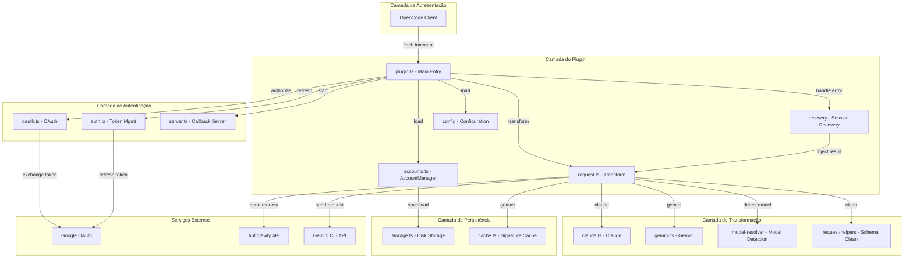
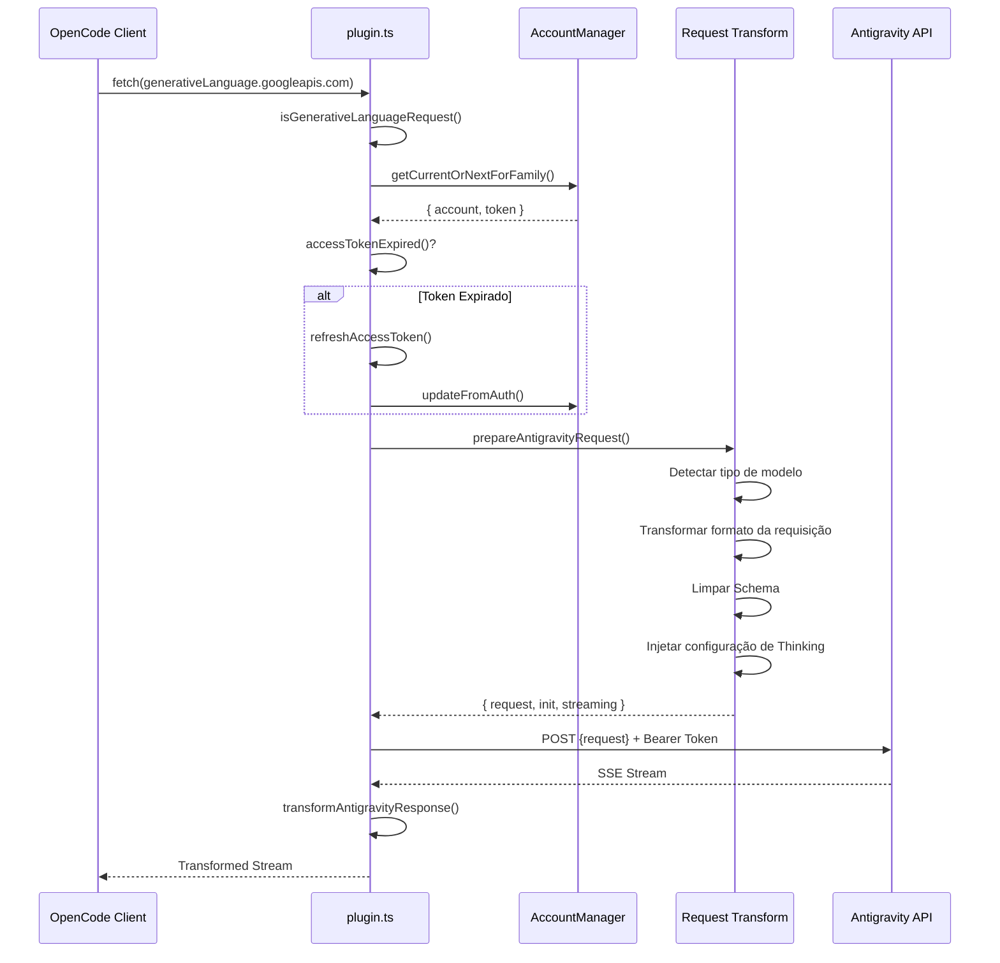
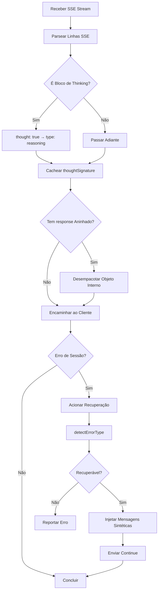

# Visão Geral da Arquitetura do Plugin: Entendendo o Design Interno do OpenCode Antigravity Auth

## O Que Você Vai Aprender

Este curso oferece uma compreensão aprofundada da arquitetura e dos mecanismos internos do plugin Antigravity Auth. Ao final, você será capaz de:

- Compreender a estrutura modular do plugin e as responsabilidades de cada módulo
- Dominar o fluxo completo de processamento de requisições do OpenCode até a API Antigravity
- Entender o mecanismo de balanceamento de carga do gerenciamento multi-conta
- Compreender como funciona a recuperação de sessão
- Dominar os detalhes técnicos da conversão de formato de requisições

## O Valor Central do Plugin

O papel central do plugin Antigravity Auth é construir uma "ponte de tradução" entre o OpenCode e a API Antigravity:

1. **Conversão de Protocolo** - Transforma o formato de requisição do OpenCode para o formato exigido pela API Antigravity
2. **Gerenciamento de Autenticação** - Obtém e atualiza tokens de acesso de forma segura via Google OAuth 2.0 PKCE
3. **Balanceamento de Carga** - Pool de múltiplas contas com rotação automática para evitar rate limiting
4. **Recuperação de Erros** - Detecção e correção automática de problemas de interrupção de sessão

::: info Por que entender a arquitetura?
Compreender a arquitetura do plugin ajuda você a:
- Localizar rapidamente o módulo onde está o problema
- Entender o escopo de cada opção de configuração
- Otimizar estratégias de uso multi-conta
- Participar do desenvolvimento e depuração do plugin
:::

## Visão Geral da Estrutura Modular

O plugin adota uma arquitetura em camadas com responsabilidades claramente definidas:



### Responsabilidades de Cada Módulo

| Módulo | Arquivo | Responsabilidade |
| --- | --- | --- |
| **Entrada Principal** | `plugin.ts` | Interceptador fetch, inicialização do plugin, tratamento de eventos |
| **Gerenciamento de Contas** | `accounts.ts` | Pool multi-conta, estratégias de balanceamento de carga, rastreamento de rate limiting |
| **Transformação de Requisições** | `request.ts` | Conversão de formato de requisição, processamento de stream de resposta |
| **Transformação de Modelos** | `transform/` | Lógica de transformação específica para Claude/Gemini |
| **Autenticação OAuth** | `antigravity/oauth.ts` | Fluxo de autenticação PKCE, troca de tokens |
| **Recuperação de Sessão** | `recovery/` | Detecção de erros, correção automática de sessões interrompidas |
| **Gerenciamento de Configuração** | `config/` | Carregamento de configuração, validação de Schema |
| **Camada de Armazenamento** | `storage.ts` | Persistência de contas (arquivo JSON) |
| **Camada de Cache** | `cache.ts` | Cache de assinaturas, redução de cálculos repetidos |
| **Logs de Depuração** | `debug.ts` | Logs estruturados, diagnóstico de falhas |

## Fluxo de Processamento de Requisições

Quando uma requisição de modelo é enviada pelo OpenCode, o plugin passa por uma cadeia completa de processamento:



### Detalhamento das Etapas

**Etapa 1: Interceptação da Requisição**
- O plugin captura todas as requisições para `generativelanguage.googleapis.com` através do interceptador `fetch`
- Usa `isGenerativeLanguageRequest()` para determinar se é uma requisição relacionada ao Antigravity
- Requisições não-alvo são passadas diretamente, evitando impacto em outras funcionalidades

**Etapa 2: Seleção de Conta**
- Seleciona uma conta disponível do pool (de acordo com a estratégia configurada: sticky/round-robin/hybrid)
- Verifica se o token expirou; se sim, atualiza automaticamente
- Aplica offset de PID (se habilitado), garantindo distribuição uniforme de contas em cenários multi-agente

**Etapa 3: Transformação da Requisição** (`request.ts`)
- **Detecção de Modelo**: Identifica se é um modelo Claude ou Gemini
- **Processamento de Thinking**:
  - Claude: Remove todos os blocos de thinking históricos para evitar conflitos de assinatura
  - Gemini: Adiciona configuração `thinkingConfig`
- **Conversão de Tools**: Converte tools do OpenCode para o formato `functionDeclarations`
- **Limpeza de Schema**: Remove campos JSON Schema não suportados (`const`, `$ref`, `$defs`, etc.)
- **Empacotamento da Requisição**: Encapsula no formato `{ project, model, request: {...} }`

**Etapa 4: Envio da Requisição**
- Adiciona headers específicos do Antigravity (User-Agent, Client-Metadata)
- Usa autenticação Bearer Token
- Suporta fallback de endpoint (daily → autopush → prod)

**Etapa 5: Transformação da Resposta**
- Recebimento em stream SSE, transformação linha por linha
- Converte `thought: true` para `type: "reasoning"`
- Armazena em cache a assinatura de thinking para requisições subsequentes
- Expande o objeto `response` interno, mantendo consistência de formato

## Fluxo de Processamento de Respostas

O processamento de respostas envolve principalmente transformação de stream e recuperação de sessão:



### Mecanismos de Processamento Principais

**1. Transformação de Blocos de Thinking**

A API Antigravity retorna blocos de thinking no formato:
```json
{ "thought": true, "text": "Conteúdo do pensamento" }
```

O plugin converte para o formato compatível com OpenCode:
```json
{ "type": "reasoning", "reasoning": "Conteúdo do pensamento" }
```

**2. Cache de Assinaturas**

Os modelos Claude e Gemini 3 precisam corresponder assinaturas de blocos de thinking em conversas multi-turno:
- Extrai `thoughtSignature` da resposta
- Armazena em memória e disco usando `cacheSignature()`
- Na próxima requisição, obtém e injeta via `getCachedSignature()`

::: tip Por que o cache de assinaturas é necessário?
As APIs Claude e Gemini 3 exigem que blocos de thinking antes de chamadas de ferramentas tenham a assinatura correta. O cache de assinaturas permite:
- Evitar falhas de requisição causadas por erros de assinatura
- Reduzir geração repetida do mesmo conteúdo de thinking
- Melhorar a continuidade de conversas multi-turno
:::

**3. Recuperação de Sessão**

Quando um erro de sessão é detectado:
1. Captura o erro através do evento `session.error`
2. Chama `detectErrorType()` para determinar se é recuperável
3. Para erros `tool_result_missing`:
   - Extrai os IDs de `tool_use` que falharam
   - Injeta mensagens sintéticas de `tool_result`
   - Envia automaticamente "continue" (se habilitado)
4. Para erros de ordem de blocos de thinking:
   - Analisa o estado da conversa
   - Fecha o turno corrompido
   - Inicia um novo turno para o modelo regenerar

## Detalhamento dos Mecanismos Principais

### Mecanismo de Autenticação OAuth

O plugin usa o fluxo OAuth 2.0 com PKCE (Proof Key for Code Exchange):

```mermaid
flowchart LR
    A[Usuário executa opencode auth login] --> B[Gerar par de chaves PKCE]
    B --> C[Construir URL de autorização]
    C --> D[Iniciar servidor local]
    D --> E[Abrir página de autorização no navegador]
    E --> F[Usuário autoriza]
    F --> G[Receber código de callback]
    G --> H[Trocar por token de acesso]
    H --> I[Obter Project ID]
    I --> J[Armazenar em antigravity-accounts.json]
```



**Segurança PKCE**:
- Gera `code_verifier` e `code_challenge` aleatórios
- A URL de autorização inclui `code_challenge`, prevenindo ataques man-in-the-middle
- Na troca de token, valida `code_verifier`, garantindo que a requisição vem do mesmo cliente

**Gerenciamento de Tokens**:
- Access Token: Expira em 1 hora por padrão, atualização automática 30 minutos antes da expiração
- Refresh Token: Válido por longo prazo, usado para obter novos Access Tokens
- Persistido em `~/.config/opencode/antigravity-accounts.json`

### Mecanismo de Gerenciamento Multi-Conta

O gerenciamento multi-conta é uma das funcionalidades principais do plugin, contendo os seguintes componentes-chave:

**1. Estrutura do Pool de Contas**

```typescript
interface AccountPool {
  version: 3;
  accounts: Account[];
  activeIndex: number;
  activeIndexByFamily: {
    claude: number;
    gemini: number;
  };
}
```

**2. Estratégias de Seleção de Conta**

| Estratégia | Descrição | Cenário de Uso |
| --- | --- | --- |
| **sticky** | Mantém a conta atual até atingir rate limit | Uso em sessão única, preserva cache de prompts |
| **round-robin** | Rotaciona para a próxima conta a cada requisição | Sessões paralelas, maximiza throughput |
| **hybrid** | Decisão combinada de health score + Token bucket + LRU | Estratégia padrão, equilibra performance e confiabilidade |

**3. Rastreamento de Rate Limiting**

Cada conta é rastreada independentemente por família de modelo:
- `claude`: Cota de modelos Claude
- `gemini-antigravity`: Cota Gemini Antigravity
- `gemini-cli`: Cota Gemini CLI

O estado de rate limiting inclui:
- `rateLimitResetTimes`: Tempo de reset de cada cota
- `cooldownEndAt`: Tempo de fim do cooldown da conta
- `consecutiveFailures`: Contagem de falhas consecutivas

**4. Pool de Cota Dupla (Específico para Gemini)**

Modelos Gemini suportam dois pools de cota independentes:
- **Cota Antigravity**: Ambiente sandbox diário
- **Cota Gemini CLI**: Ambiente de produção

Através da configuração `quota_fallback`:
- Prioriza a cota preferida (determinada pelo sufixo do modelo)
- Quando a cota preferida se esgota, tenta a cota alternativa
- Quando ambos os pools se esgotam, muda para a próxima conta

**5. Otimização de Offset de PID**

Com `pid_offset_enabled` habilitado:
- Diferentes processos (PID) de agentes começam de contas diferentes
- Evita que todos os agentes disputem a mesma conta
- Adequado para cenários de agentes paralelos

### Mecanismo de Transformação de Requisições

A transformação de requisições é a parte mais complexa do plugin, precisando lidar com diferenças de protocolo entre diferentes modelos:

**Pontos-Chave da Transformação de Modelos Claude**:

1. **Processamento de Blocos de Thinking**
   ```typescript
   // Remove todos os blocos de thinking históricos (evita conflitos de assinatura)
   const filteredContents = deepFilterThinkingBlocks(contents);

   // Constrói novo thinkingConfig
   const thinkingConfig = {
     budgetTokens: variantThinkingConfig?.budget || DEFAULT_THINKING_BUDGET,
   };
   ```

2. **Limpeza de Tool Schema**
   - Whitelist mantida: `type`, `properties`, `required`, `description`, `enum`, `items`
   - Campos removidos: `const`, `$ref`, `$defs`, `default`, `examples`, `additionalProperties`, `$schema`, `title`
   - Conversão especial: `const: "value"` → `enum: ["value"]`

3. **Injeção de Assinatura de Parâmetros em Ferramentas**
   ```typescript
   injectParameterSignatures(tool, signature) {
     tool.description += `\n\nParameters: ${signature}`;
   }
   ```

**Pontos-Chave da Transformação de Modelos Gemini**:

1. **Configuração de Thinking**
   ```typescript
   // Gemini 3 Pro/Flash
   if (isGemini3Model(model)) {
     request.thinkingConfig = {
       thinkingLevel: "high" | "medium" | "low" | "minimal",
     };
   }

   // Gemini 2.5
   else if (isGemini2Model(model)) {
     request.thinkingConfig = {
       thinkingLevel: "high" | "medium" | "low",
     };
   }
   ```

2. **Google Search Grounding**
   ```typescript
   if (webSearchConfig) {
     request.generationConfig = {
       ...request.generationConfig,
       dynamicRetrievalConfig: {
         mode: webSearchConfig.mode, // "auto" | "off"
         dynamicRetrievalConfig: {
           scoreThreshold: webSearchConfig.threshold, // 0.0 - 1.0
         },
       },
     };
   }
   ```

3. **Configuração de Geração de Imagens**
   ```typescript
   if (isImageGenerationModel(model)) {
     request.generationConfig = {
       ...request.generationConfig,
       responseModalities: ["IMAGE", "TEXT"],
     };
   }
   ```

### Mecanismo de Recuperação de Sessão

O mecanismo de recuperação de sessão garante que a conversa possa continuar após interrupções inesperadas:

**1. Detecção de Erros**

```typescript
function detectErrorType(error: unknown): RecoverableError | null {
  if (errorString.includes("tool_use ids were found without tool_result")) {
    return { type: "tool_result_missing" };
  }
  if (errorString.includes("Expected thinking but found text")) {
    return { type: "thinking_order_error" };
  }
  return null;
}
```

**2. Detecção de Limite de Turno**

```typescript
// Limite de turno = primeira mensagem do assistant após mensagem do usuário
function analyzeConversationState(messages: Message[]): ConversationState {
  const lastUserMessage = findLastMessageByRole(messages, "user");
  const firstAssistantAfterUser = messages.find(m =>
    m.role === "assistant" && m.timestamp > lastUserMessage.timestamp
  );

  return {
    isTurnStart: true,
    turnAssistantMessage: firstAssistantAfterUser,
  };
}
```

**3. Injeção de Mensagens Sintéticas**

```typescript
// Injetar tool_result sintético
function createSyntheticErrorResponse(toolUseIds: string[]): Message[] {
  return toolUseIds.map(id => ({
    type: "tool_result",
    tool_use_id: id,
    content: "Operation cancelled",
    isSynthetic: true,
  }));
}

// Fechar turno corrompido
function closeToolLoopForThinking(sessionId: string): Message[] {
  return [
    {
      type: "text",
      text: "[Conversation turn closed due to error]",
      isSynthetic: true,
    },
  ];
}
```

**4. Auto-Resume**

Com `auto_resume` habilitado, o fluxo de recuperação envia automaticamente o comando de continuação:
```typescript
await client.session.prompt({
  path: { id: sessionID },
  body: { parts: [{ type: "text", text: config.resume_text }] },
  query: { directory },
});
```

## Resumo da Lição

Esta lição analisou em profundidade a arquitetura do plugin Antigravity Auth:

**Arquitetura Principal**:
- Design modular em camadas com responsabilidades claras
- Camada do plugin, camada de autenticação, camada de transformação e camada de persistência, cada uma com sua função
- `plugin.ts` como ponto de entrada unificado coordenando todos os módulos

**Fluxo de Requisições**:
- Interceptação → Seleção de conta → Atualização de token → Transformação de requisição → Envio de requisição → Transformação de resposta
- Cada etapa possui tratamento de erros detalhado e mecanismos de retry

**Mecanismos Principais**:
- **OAuth 2.0 PKCE**: Fluxo de autenticação seguro
- **Gerenciamento Multi-Conta**: Balanceamento de carga, rastreamento de rate limiting, pool de cota dupla
- **Transformação de Requisições**: Compatibilidade de protocolo, limpeza de Schema, processamento de Thinking
- **Recuperação de Sessão**: Detecção automática de erros, injeção de mensagens sintéticas, Auto-Resume

Compreender esses mecanismos ajudará você a usar e otimizar melhor a configuração do plugin, além de participar do desenvolvimento e depuração.

## Prévia da Próxima Lição

> Na próxima lição, aprenderemos sobre a **[Especificação Interna da API Antigravity](../api-spec/)**.
>
> Você aprenderá:
> - Formatos de requisição e resposta da API Antigravity
> - Funcionalidades e parâmetros de cada endpoint
> - Significado de códigos de erro e status
> - Funcionalidades avançadas e recursos experimentais

---

## Apêndice: Referência do Código-Fonte

<details>
<summary><strong>Clique para expandir e ver a localização do código-fonte</strong></summary>

> Atualizado em: 2026-01-23

| Funcionalidade | Caminho do Arquivo | Linhas |
| --- | --- | --- |
| Entrada principal do plugin, interceptador fetch | [`src/plugin.ts`](https://github.com/NoeFabris/opencode-antigravity-auth/blob/main/src/plugin.ts) | 654-1334 |
| Gerenciador de contas, balanceamento de carga | [`src/plugin/accounts.ts`](https://github.com/NoeFabris/opencode-antigravity-auth/blob/main/src/plugin/accounts.ts) | 1-715 |
| Transformação de requisições, streaming de resposta | [`src/plugin/request.ts`](https://github.com/NoeFabris/opencode-antigravity-auth/blob/main/src/plugin/request.ts) | 1-1664 |
| Transformação de modelos Claude | [`src/plugin/transform/claude.ts`](https://github.com/NoeFabris/opencode-antigravity-auth/blob/main/src/plugin/transform/claude.ts) | Arquivo completo |
| Transformação de modelos Gemini | [`src/plugin/transform/gemini.ts`](https://github.com/NoeFabris/opencode-antigravity-auth/blob/main/src/plugin/transform/gemini.ts) | Arquivo completo |
| Recuperação de sessão | [`src/plugin/recovery/index.ts`](https://github.com/NoeFabris/opencode-antigravity-auth/blob/main/src/plugin/recovery/index.ts) | Arquivo completo |
| Recuperação de blocos de thinking | [`src/plugin/recovery/thinking-recovery.ts`](https://github.com/NoeFabris/opencode-antigravity-auth/blob/main/src/plugin/recovery/thinking-recovery.ts) | Arquivo completo |
| Autenticação OAuth | [`src/antigravity/oauth.ts`](https://github.com/NoeFabris/opencode-antigravity-auth/blob/main/src/antigravity/oauth.ts) | 1-271 |
| Gerenciamento de tokens | [`src/plugin/token.ts`](https://github.com/NoeFabris/opencode-antigravity-auth/blob/main/src/plugin/token.ts) | Arquivo completo |
| Schema de configuração | [`src/plugin/config/schema.ts`](https://github.com/NoeFabris/opencode-antigravity-auth/blob/main/src/plugin/config/schema.ts) | 1-373 |
| Armazenamento de contas | [`src/plugin/storage.ts`](https://github.com/NoeFabris/opencode-antigravity-auth/blob/main/src/plugin/storage.ts) | Arquivo completo |
| Cache de assinaturas | [`src/plugin/cache.ts`](https://github.com/NoeFabris/opencode-antigravity-auth/blob/main/src/plugin/cache.ts) | Arquivo completo |
| Logs de depuração | [`src/plugin/debug.ts`](https://github.com/NoeFabris/opencode-antigravity-auth/blob/main/src/plugin/debug.ts) | Arquivo completo |

**Constantes Principais**:
- `MAX_OAUTH_ACCOUNTS = 10`: Número máximo de contas
- `RATE_LIMIT_DEDUP_WINDOW_MS = 2000`: Janela de deduplicação de rate limit (2 segundos)
- `RATE_LIMIT_STATE_RESET_MS = 120000`: Tempo de reset do estado de rate limit (2 minutos)
- `FAILURE_COOLDOWN_MS = 30000`: Tempo de cooldown da conta (30 segundos)

**Funções Principais**:
- `createAntigravityPlugin()`: Função de entrada principal do plugin
- `prepareAntigravityRequest()`: Função principal de transformação de requisições
- `transformAntigravityResponse()`: Função de transformação de stream de resposta
- `AccountManager.getCurrentOrNextForFamily()`: Função de seleção de conta
- `handleSessionRecovery()`: Função de tratamento de recuperação de sessão
- `refreshAccessToken()`: Função de atualização de token

</details>
