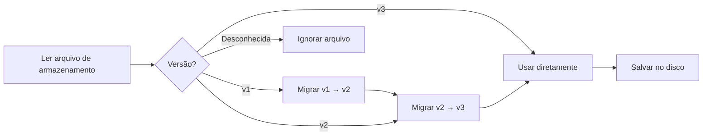

# Formato de Armazenamento de Conta e Gerenciamento de Versão

## O Que Você Poderá Fazer

- Entender a estrutura dos arquivos de armazenamento de conta e o significado de cada campo
- Editar manualmente arquivos de armazenamento (apenas quando necessário)
- Compreender o mecanismo de migração de versão e compatibilidade
- Migrar configurações de conta entre máquinas

## Seu Dilema Atual

Você pode estar enfrentando as seguintes situações:

- Deseja fazer backup ou migrar sua conta para outra máquina
- Precisa modificar manualmente o `projectId` ou remover contas inválidas
- Viu avisos de versão ou logs de migração e quer entender o que aconteceu
- Precisa sincronizar o estado da conta entre múltiplas máquinas

## Localização do Arquivo

Os arquivos de armazenamento de conta estão localizados em:

| Sistema Operacional | Caminho |
|---|---|
| macOS/Linux | `~/.config/opencode/antigravity-accounts.json` |
| Windows | `%APPDATA%\opencode\antigravity-accounts.json` |

::: warning Aviso de Segurança
Este arquivo contém **OAuth refresh tokens**, equivalentes a arquivos de senha. Não compartilhe com outras pessoas e também não faça commit em repositórios Git.
:::

## Versões do Formato de Armazenamento

O formato de armazenamento possui controle de versão, atualmente na **v3**. O plugin processa automaticamente a migração de versões, sem necessidade de intervenção manual.

### Formato v3 (Versão Atual)

```json
{
  "version": 3,
  "accounts": [
    {
      "email": "user1@gmail.com",
      "refreshToken": "1//0abc...",
      "projectId": "my-gcp-project",
      "managedProjectId": "managed-project-123",
      "addedAt": 1737600000000,
      "lastUsed": 1737603600000,
      "lastSwitchReason": "initial",
      "rateLimitResetTimes": {
        "claude": 1737607200000,
        "gemini-antigravity": 1737607200000,
        "gemini-cli": 1737607200000
      },
      "coolingDownUntil": 1737600000000,
      "cooldownReason": "auth-failure"
    }
  ],
  "activeIndex": 0,
  "activeIndexByFamily": {
    "claude": 0,
    "gemini": 0
  }
}
```

**Descrição dos campos**:

| Campo | Tipo | Obrigatório | Descrição |
|---|---|---|---|
| `version` | number | S | Versão do formato de armazenamento (fixo em 3) |
| `accounts` | array | S | Lista de contas |
| `activeIndex` | number | S | Índice da conta ativa atual (começa em 0) |
| `activeIndexByFamily` | object | N | Rastrear contas ativas separadamente por família de modelo (`claude`/`gemini`) |

**Campos do objeto de conta**:

| Campo | Tipo | Obrigatório | Descrição |
|---|---|---|---|
| `email` | string | N | E-mail da conta do Google |
| `refreshToken` | string | S | Token de atualização OAuth (identificador único) |
| `projectId` | string | N | ID do projeto GCP (necessário para modelos Gemini CLI) |
| `managedProjectId` | string | N | ID do projeto gerenciado |
| `addedAt` | number | S | Timestamp de adição (milissegundos Unix) |
| `lastUsed` | number | S | Timestamp do último uso |
| `lastSwitchReason` | string | N | Motivo da troca: `"rate-limit"` / `"initial"` / `"rotation"` |
| `rateLimitResetTimes` | object | N | Tempo de reset do limite de taxa (rastreado separadamente por pool de cota) |
| `coolingDownUntil` | number | N | Timestamp do fim do resfriamento da conta |
| `cooldownReason` | string | N | Motivo do resfriamento: `"auth-failure"` / `"network-error"` / `"project-error"` |

### Formato v2 (Versão Histórica)

O formato v2 é semelhante ao v3, mas possui as seguintes diferenças:

- `rateLimitResetTimes` possui apenas os campos `claude` e `gemini`
- Não possui `coolingDownUntil` e `cooldownReason`
- Não possui `activeIndexByFamily` (todos os modelos compartilham uma conta ativa)

Na migração, o campo `gemini` é mapeado para `gemini-antigravity`, e o pool de cota `gemini-cli` é inicializado vazio.

### Formato v1 (Versão Histórica)

O formato v1 usa marcadores booleanos e timestamp único:

```json
{
  "version": 1,
  "accounts": [
    {
      "email": "user1@gmail.com",
      "refreshToken": "1//0abc...",
      "isRateLimited": true,
      "rateLimitResetTime": 1737607200000
    }
  ],
  "activeIndex": 0
}
```

Na migração, se `isRateLimited` for `true` e `rateLimitResetTime` não tiver expirado, os tempos de reset para `claude` e `gemini` serão definidos simultaneamente.

## Mecanismo de Migração de Versão

O plugin detecta automaticamente a versão e executa a migração ao carregar o arquivo de armazenamento:



**Regras de migração**:

1. **Migração automática**: Após a migração, o novo formato é salvo automaticamente no disco
2. **Preservação de dados**: Estados de limite de taxa não expirados são preservados
3. **Degradar em caso de falha**: Se o salvamento falhar, continua usando os dados migrados na memória
4. **Compatibilidade forward**: Novas versões do plugin podem ler arquivos de formato antigo

## Detalhes do Mecanismo de Armazenamento

### Bloqueio de Arquivo

Use `proper-lockfile` para garantir acesso seguro multiprocessos:

- **Mecanismo de bloqueio**: Cria arquivo de bloqueio ao escrever (`.antigravity-accounts.json.lock`)
- **Configuração de timeout**: O arquivo de bloqueio expira após 10 segundos (evita deadlock)
- **Estratégia de retry**: Retry até 5 vezes, tempo de backoff 100ms → 1000ms
- **Escrita atômica**: Primeiro escreve arquivo temporário (`.tmp`), depois renomeia para o arquivo alvo

### Mesclagem de Contas

Quando múltiplos processos escrevem simultaneamente no arquivo de armazenamento, uma estratégia de mesclagem é executada:

```typescript
// Lógica de mesclagem
function mergeAccountStorage(existing, incoming) {
  // Mesclar contas usando refreshToken como key
  // Preservar projectId/managedProjectId configurados manualmente
  // Mesclar rateLimitResetTimes
  // Preservar o maior lastUsed
}
```

### Mecanismo de Deduplicação

Deduplicação baseada em `email`, mantendo a conta mais recente de cada e-mail (por `lastUsed`, depois por `addedAt`):

```typescript
// Regras de deduplicação
1. Contas sem email → Preservar (não é possível deduplicar)
2. Contas com mesmo email → Preservar a com maior lastUsed
3. lastUsed igual → Preservar a com maior addedAt
```

## Guia de Edição Manual

::: danger Risco de Edição Manual
Ao editar o arquivo de armazenamento, o processo do plugin não deve estar em execução, caso contrário pode ser sobrescrito. Recomenda-se parar o OpenCode antes de editar.
:::

### Adicionar Conta

Ao adicionar manualmente uma conta, é necessário fornecer pelo menos o `refreshToken`:

```json
{
  "accounts": [
    {
      "refreshToken": "Copie de outra máquina ou obtenha do fluxo OAuth",
      "email": "user@example.com",
      "addedAt": Date.now(),
      "lastUsed": Date.now()
    }
  ]
}
```

### Remover Conta

Remova a entrada correspondente do array `accounts`, depois ajuste o `activeIndex`:

```json
{
  "accounts": [
    { "email": "user1@gmail.com", "refreshToken": "..." },  // Manter
    // { "email": "user2@gmail.com", "refreshToken": "..." },  // Remover
    { "email": "user3@gmail.com", "refreshToken": "..." }   // Manter
  ],
  "activeIndex": 0  // Certifique-se de que o índice está em um intervalo válido
}
```

### Modificar projectId

Adicione ou modifique o `projectId` para uma conta:

```json
{
  "accounts": [
    {
      "email": "user@gmail.com",
      "refreshToken": "1//0abc...",
      "projectId": "your-gcp-project-id"  // Adicionar ou modificar
    }
  ]
}
```

### Limpar Estado de Limite de Taxa

Limpar manualmente marcadores de limite de taxa:

```json
{
  "accounts": [
    {
      "email": "user@gmail.com",
      "refreshToken": "1//0abc...",
      "rateLimitResetTimes": {}  // Limpar ou remover este campo
    }
  ]
}
```

## Migração Entre Máquinas

### Migração Simples

Copie diretamente o arquivo de armazenamento para o diretório de configuração da máquina alvo:

```bash
# macOS/Linux
cp ~/.config/opencode/antigravity-accounts.json /path/to/backup/

# Windows
copy %APPDATA%\opencode\antigravity-accounts.json backup\
```

### Mesclar Contas

Se a máquina alvo já possui contas, o plugin mesclará automaticamente (deduplicação baseada em `refreshToken`).

**Passos de mesclagem manual**:

1. Faça backup dos arquivos de armazenamento das duas máquinas
2. Abra os dois arquivos, copie o array de contas alvo para o arquivo de origem
3. Ajuste `activeIndex` e `activeIndexByFamily`
4. Salve e reinicie o plugin

## Perguntas Frequentes

### O que fazer se a migração falhar?

Se a migração falhar, o plugin registrará um aviso nos logs:

```
Failed to persist migrated storage: { error: "..." }
```

**Método de resolução**:

1. Verifique as permissões do arquivo
2. Confirme que há espaço suficiente no disco
3. Faça backup manual do arquivo antigo, exclua e adicione as contas novamente

### Erro de versão incompatível

Se você vir o erro "Unknown storage version":

```json
{
  "version": 99  // Versão desconhecida
}
```

**Método de resolução**:

1. Faça backup do arquivo atual
2. Mude manualmente `version` para `2` ou `3`
3. Reinicie o plugin para disparar a migração
4. Se a migração falhar, exclua o arquivo e adicione as contas novamente

### Perda de deduplicação de contas

Se você perceber que contas duplicadas foram removidas:

**Causa**: O plugin deduplica com base em `email`, mantendo a conta mais recentemente usada.

**Método de resolução**: Se você precisa manter duas contas com o mesmo e-mail (cenário raro), edite o arquivo manualmente, certificando-se de que o campo `email` esteja vazio ou diferente.

## Resumo da Lição

- Localização do arquivo de armazenamento: `~/.config/opencode/antigravity-accounts.json`
- Versão atual: v3, suporta pool de cota duplo e mecanismo de resfriamento
- Migração automática: v1/v2 é atualizado automaticamente para v3
- Bloqueio de arquivo: Usa `proper-lockfile` para garantir segurança de concorrência
- Edição manual: Recomenda-se parar o plugin antes de editar para evitar sobrescrever

## Próxima Lição

> Na próxima lição, aprenderemos **[Todas as Opções de Configuração](../all-config-options/)**.
>
> Você aprenderá:
> - Lista completa de opções de configuração
> - Valores padrão e escopo de cada opção
> - Técnicas avançadas de configuração

---

## Apêndice: Referência do Código-fonte

<details>
<summary><strong>Clique para expandir e ver a localização do código-fonte</strong></summary>

> Última atualização: 2026-01-23

| Funcionalidade | Caminho do Arquivo | Linhas |
|---|---|---|
| Definição do formato de armazenamento | [`src/plugin/storage.ts`](https://github.com/NoeFabris/opencode-antigravity-auth/blob/main/src/plugin/storage.ts) | 128-198 |
| Migração v1 → v2 | [`src/plugin/storage.ts`](https://github.com/NoeFabris/opencode-antigravity-auth/blob/main/src/plugin/storage.ts) | 366-395 |
| Migração v2 → v3 | [`src/plugin/storage.ts`](https://github.com/NoeFabris/opencode-antigravity-auth/blob/main/src/plugin/storage.ts) | 397-431 |
| Carregar contas | [`src/plugin/storage.ts`](https://github.com/NoeFabris/opencode-antigravity-auth/blob/main/src/plugin/storage.ts) | 433-518 |
| Salvar contas | [`src/plugin/storage.ts`](https://github.com/NoeFabris/opencode-antigravity-auth/blob/main/src/plugin/storage.ts) | 520-536 |
| Mecanismo de bloqueio de arquivo | [`src/plugin/storage.ts`](https://github.com/NoeFabris/opencode-antigravity-auth/blob/main/src/plugin/storage.ts) | 219-257 |
| Mesclagem de contas | [`src/plugin/storage.ts`](https://github.com/NoeFabris/opencode-antigravity-auth/blob/main/src/plugin/storage.ts) | 259-299 |
| Mecanismo de deduplicação | [`src/plugin/storage.ts`](https://github.com/NoeFabris/opencode-antigravity-auth/blob/main/src/plugin/storage.ts) | 301-364 |

**Definições de tipos principais**:

- `AccountStorageV1`: formato de armazenamento v1
- `AccountStorageV2`: formato de armazenamento v2
- `AccountStorageV3`: formato de armazenamento v3 (atual)
- `RateLimitStateV3`: estado de limite de taxa v3 (suporta múltiplos pools de cota)

**Funções principais**:

- `loadAccounts()`: carrega contas e executa migração
- `saveAccounts()`: salva contas (com bloqueio de arquivo e mesclagem)
- `migrateV1ToV2()`: migração v1 → v2
- `migrateV2ToV3()`: migração v2 → v3
- `mergeAccountStorage()`: mescla dois objetos de armazenamento
- `deduplicateAccountsByEmail()`: deduplicação baseada em email

</details>
