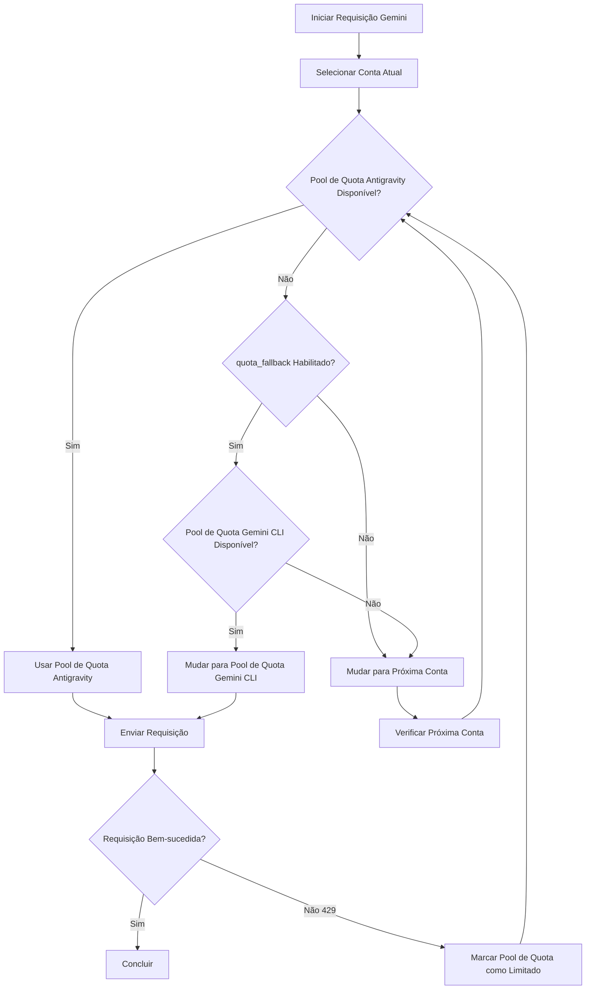

# Sistema de Dupla Quota: Entendendo os Pools de Quota Antigravity e Gemini CLI

## O que Você Vai Aprender

- Como cada conta possui dois pools de quota Gemini independentes
- Como habilitar o fallback automático entre os pools de quota Antigravity e Gemini CLI
- Como especificar explicitamente um modelo para usar um pool de quota específico
- Como maximizar a utilização da sua quota através do sistema de dupla quota

---

## Seu Dilema Atual

Você está usando o plugin Antigravity Auth para chamar modelos Gemini, frequentemente encontrando limites de quota, mas pode não entender o **sistema de dupla quota**:

- Uma requisição é limitada por taxa, precisando esperar a reposição da quota para continuar
- Mesmo configurando múltiplas contas, a quota Gemini de cada conta ainda é insuficiente
- Não está claro por que alguns modelos podem ser requisitados, enquanto outros frequentemente retornam 429

**Ponto Central**: Você pensa que cada conta tem apenas um pool de quota Gemini, mas na verdade cada conta possui **dois pools independentes** de quota. Se configurado corretamente, pode dobrar sua quota Gemini.

---

## Ideia Central

### O que é o Sistema de Dupla Quota?

O **sistema de dupla quota** é o mecanismo pelo qual o plugin Antigravity Auth mantém dois pools de quota Gemini independentes para cada conta. Os pools de quota Antigravity e Gemini CLI rastreiam o status de limitação de taxa de forma independente; quando o Antigravity atinge o limite, pode mudar para o pool CLI, realizando a duplicação da quota.

O plugin Antigravity Auth mantém **dois pools de quota Gemini independentes** para cada conta Google:

| Pool de Quota | Tipo | Prioridade | Regras de Reset |
|---|---|---|---|
| **Antigravity** | Pool de quota principal | Usado prioritariamente | Calculado dinamicamente com base no tempo de reset retornado pelo servidor |
| **Gemini CLI** | Pool de quota de reserva | Usado para fallback | Calculado dinamicamente com base no tempo de reset retornado pelo servidor |

O status de limite de taxa de cada pool de quota é rastreado de forma independente, sem afetar o outro. Isso significa:

- Quando o pool de quota Antigravity atinge o limite, se o pool Gemini CLI ainda estiver disponível, pode mudar automaticamente
- Equivalente a **dobrar** a quota Gemini de cada conta

### Especificação Explícita vs Fallback Automático

Existem duas maneiras de usar o sistema de dupla quota:

1. **Especificação Explícita**: Adicione o sufixo `:antigravity` ou `:gemini-cli` após o nome do modelo, forçando o uso de um pool de quota específico
2. **Fallback Automático**: Habilite a configuração `quota_fallback`, permitindo que o plugin alterne automaticamente entre os dois pools de quota

**Comportamento Padrão**: Não habilita o fallback automático, usa apenas o pool de quota Antigravity

---

## Guia Passo a Passo

### Passo 1: Habilitar Fallback Automático

Abra seu arquivo de configuração `~/.config/opencode/antigravity.json`:

```bash
cat ~/.config/opencode/antigravity.json
```

Adicione ou modifique a configuração `quota_fallback`:

```json
{
  "quota_fallback": true
}
```

**Por quê**: Por padrão, `quota_fallback` é `false`, o plugin usa apenas o pool de quota Antigravity. Após habilitar, quando o Antigravity atingir o limite, tentará automaticamente o pool Gemini CLI.

Você deve ver o arquivo de configuração sendo atualizado.

---

### Passo 2: Observar o Comportamento de Fallback Automático

Inicie uma requisição de modelo Gemini (por exemplo, usando Gemini 3 Flash):

```bash
opencode run "Explique o que é computação quântica" --model=google/antigravity-gemini-3-flash
```

Se o pool de quota Antigravity atingir o limite, você verá o seguinte comportamento de fallback automático:

```
[Notificação Toast] Quota Antigravity esgotada, usando quota Gemini CLI
```

O plugin irá:

1. Detectar que o pool de quota Antigravity atingiu o limite (resposta 429)
2. Tentar mudar para o pool de quota Gemini CLI (se não estiver no limite)
3. Reenviar a requisição usando o novo pool de quota
4. Exibir uma notificação toast informando sobre a mudança

**Por quê**: Esta é a lógica central do fallback automático—alternando entre os dois pools de quota da mesma conta, em vez de mudar imediatamente para a próxima conta.

Você deve ver a requisição ser concluída com sucesso, em vez de falhar devido ao limite de quota.

---

### Passo 3: Especificar o Pool de Quota Explicitamente

Se você deseja forçar o uso de um pool de quota específico, pode adicionar um sufixo após o nome do modelo:

**Usando o Pool de Quota Antigravity** (através do prefixo `antigravity-`):

```bash
opencode run "Explique o que é computação quântica" --model=google/antigravity-gemini-3-flash
```

**Usando o Pool de Quota Gemini CLI** (sem o prefixo `antigravity-`):

```bash
opencode run "Explique o que é computação quântica" --model=google/gemini-3-flash-preview
```

**Por quê**: Através do prefixo `antigravity-`, você pode especificar explicitamente o uso do pool de quota Antigravity; sem prefixo, usa o pool de quota Gemini CLI. Neste momento, o plugin irá ignorar a configuração `quota_fallback`, se o pool de quota especificado atingir o limite, mudará imediatamente para a próxima conta, em vez de tentar outro pool de quota.

Você deve ver a requisição ser roteada para o pool de quota especificado.

---

### Passo 4: Verificar o Status da Quota (Modo Debug)

Se você deseja ver o status do limite de taxa de cada pool de quota, habilite o modo de depuração:

Edite `~/.config/opencode/antigravity.json`:

```json
{
  "quota_fallback": true,
  "debug": true
}
```

Após iniciar a requisição, verifique o arquivo de log:

```bash
tail -f ~/.config/opencode/antigravity-logs/*.log
```

Você verá logs similares:

```
[DEBUG] headerStyle=antigravity explicit=false
[DEBUG] quota fallback: gemini-cli
[INFO] rate-limit triggered for account 0, family gemini, quota: gemini-antigravity
```

**Por quê**: Os logs de depuração permitem ver claramente qual pool de quota o plugin selecionou e quando o fallback foi acionado. Isso é muito útil para solucionar problemas de quota.

Você deve ver logs detalhados de mudança de quota.

---

## Pontos de Verificação ✅

### Verificar se o Fallback Automático está Habilitado

```bash
cat ~/.config/opencode/antigravity.json | grep quota_fallback
```

Você deve ver:

```json
"quota_fallback": true
```

### Verificar Sufixo de Especificação Explícita

Tente usar o nome do modelo com sufixo, confirmando que não retorna erro:

```bash
opencode run "teste" --model=google/antigravity-gemini-3-flash:gemini-cli
```

Você deve ver a requisição ser concluída com sucesso.

### Verificar Logs de Depuração

```bash
ls -la ~/.config/opencode/antigravity-logs/
```

Você deve ver os arquivos de log existirem, e conterem informações relacionadas à mudança de quota.

---

## Avisos de Armadilhas

### Armadilha 1: Fallback Não Ocorre com Sufixo de Especificação Explícita

**Problema**: Você adicionou o sufixo `:antigravity` ou `:gemini-cli` após o nome do modelo, mas o `quota_fallback` parece não funcionar.

**Causa**: Ao especificar explicitamente com sufixo, o plugin irá ignorar a configuração `quota_fallback`, forçando o uso do pool de quota especificado. Se esse pool de quota atingir o limite, mudará imediatamente para a próxima conta, em vez de tentar outro pool de quota.

**Soluções**:
- Se deseja usar fallback automático, não adicione sufixo após o nome do modelo
- Se deseja forçar o uso de um pool de quota específico, adicione o sufixo

### Armadilha 2: Modelos Claude Não Têm Sistema de Dupla Quota

**Problema**: Você habilitou o `quota_fallback`, mas os modelos Claude parecem não ter comportamento de fallback.

**Causa**: O sistema de dupla quota **só se aplica a modelos Gemini**. Modelos Claude usam apenas o pool de quota Antigravity, não têm pool de quota Gemini CLI.

**Soluções**:
- Modelos Claude não precisam configurar sistema de dupla quota
- Apenas a rotação de múltiplas contas pode aumentar a quota do Claude

### Armadilha 3: Logs de Depuração Crescem Muito Rapidamente Afetando o Desempenho

**Problema**: Habilitei o `debug: true`, mas os arquivos de log estão crescendo muito rapidamente.

**Causa**: O modo de depuração registra todos os detalhes da requisição, incluindo mudança de quota, seleção de conta, etc.

**Soluções**:
- Após concluir a depuração, desative a configuração `debug`
- Ou limpe periodicamente os arquivos de log: `rm ~/.config/opencode/antigravity-logs/*.log`

---

## Diagrama de Fluxo de Trabalho do Sistema de Dupla Quota

A seguir, o fluxo de trabalho do fallback automático:



---

## Mecanismo de Rastreamento Independente dos Pools de Dupla Quota

### Definição de Chaves de Quota

O plugin usa as seguintes chaves de quota para rastrear limites de taxa (código-fonte: `accounts.ts:77`):

| Chave de Quota | Significado |
|---|---|
| `claude` | Quota de modelos Claude |
| `gemini-antigravity` | Pool de Quota Antigravity Gemini |
| `gemini-cli` | Pool de Quota Gemini CLI |

O objeto `rateLimitResetTimes` de cada conta armazena os carimbos de tempo de reset dessas chaves de quota:

```json
{
  "rateLimitResetTimes": {
    "claude": 1234567890,
    "gemini-antigravity": 1234567890,
    "gemini-cli": 1234567890
  }
}
```

### Verificação de Disponibilidade do Pool de Quota

Ao selecionar um pool de quota, o plugin verifica na seguinte ordem (código-fonte: `accounts.ts:545-557`):

1. **Pool de Quota Antigravity**: Se não estiver limitado, usa diretamente
2. **Pool de Quota Gemini CLI**: Se Antigravity estiver limitado e este pool estiver disponível, usa este pool
3. **Retorna null**: Ambos os pools estão limitados, aciona a mudança de conta

---

## Condições de Acionamento da Mudança de Pool de Quota

O fallback automático será acionado quando as seguintes condições forem atendidas:

| Condição | Explicação | Localização do Código-Fonte |
|---|---|---|
| `quota_fallback = true` | Configuração de fallback automático habilitada | `config/schema.ts:234` |
| Pool de Quota Antigravity da conta atual limitado | Recebeu resposta 429 | `plugin.ts:1149` |
| Modelo não especificou explicitamente o pool de quota | Nome do modelo não contém sufixos `:antigravity` ou `:gemini-cli` | `plugin.ts:1151` |
| Pool de Quota Gemini CLI da conta atual disponível | Não está limitado | `accounts.ts:553` |

Se qualquer uma das condições não for atendida, o plugin mudará diretamente para a próxima conta, em vez de tentar o fallback.

---

## Resumo da Lição

Nesta lição, aprendemos sobre o sistema de dupla quota do plugin Antigravity Auth:

- **Duplos Pools de Quota**: Cada conta possui dois pools de quota Gemini independentes: Antigravity e Gemini CLI
- **Fallback Automático**: Após habilitar `quota_fallback`, quando Antigravity atingir o limite, tentará automaticamente o pool Gemini CLI
- **Especificação Explícita**: Use os sufixos `:antigravity` ou `:gemini-cli` para forçar o uso de um pool de quota específico
- **Rastreamento Independente**: O status de limite de taxa de cada pool de quota é armazenado e verificado de forma independente
- **Apenas Gemini**: O sistema de dupla quota só se aplica a modelos Gemini; modelos Claude têm apenas o pool de quota Antigravity

Ao usar o sistema de dupla quota de forma razoável, você pode dobrar a quota Gemini de cada conta, reduzindo as falhas de requisição causadas por limites de quota.

---

## Prévia da Próxima Lição

> Na próxima lição, aprenderemos **[Configuração de Múltiplas Contas: Configurando Balanceamento de Carga para Aumentar Quotas](../../advanced/multi-account-setup/)**.
>
> Você vai aprender:
> - Como adicionar múltiplas contas Google
> - Melhores práticas para configurar estratégias de seleção de contas diferentes
> - Técnicas de uso de pools de quota em cenários de múltiplas contas

---

## Apêndice: Referência do Código-Fonte

<details>
<summary><strong>Clique para expandir e ver a localização do código-fonte</strong></summary>

> Última atualização: 2026-01-23

| Funcionalidade | Caminho do Arquivo | Número da Linha |
|---|---|---|
| Definição de Chaves de Quota (BaseQuotaKey) | [`src/plugin/accounts.ts`](https://github.com/NoeFabris/opencode-antigravity-auth/blob/main/src/plugin/accounts.ts#L77-L78) | 77-78 |
| Obter Chave de Quota (getQuotaKey) | [`src/plugin/accounts.ts`](https://github.com/NoeFabris/opencode-antigravity-auth/blob/main/src/plugin/accounts.ts#L107-L116) | 107-116 |
| Verificar Status de Limitação do Pool de Quota | [`src/plugin/accounts.ts`](https://github.com/NoeFabris/opencode-antigravity-auth/blob/main/src/plugin/accounts.ts#L134-L152) | 134-152 |
| Obter Pool de Quota Disponível | [`src/plugin/accounts.ts`](https://github.com/NoeFabris/opencode-antigravity-auth/blob/main/src/plugin/accounts.ts#L545-L557) | 545-557 |
| Definição de Configuração quota_fallback | [`src/plugin/config/schema.ts`](https://github.com/NoeFabris/opencode-antigravity-auth/blob/main/src/plugin/config/schema.ts#L224-L234) | 224-234 |
| Lógica de Fallback Automático | [`src/plugin/plugin.ts`](https://github.com/NoeFabris/opencode-antigravity-auth/blob/main/src/plugin/plugin.ts#L1151-L1163) | 1151-1163 |
| Documentação do Sistema de Dupla Quota | [`docs/MULTI-ACCOUNT.md`](https://github.com/NoeFabris/opencode-antigravity-auth/blob/main/docs/MULTI-ACCOUNT.md#L21-L31) | 21-31 |

**Constantes Principais**:
- `BaseQuotaKey = "claude" | "gemini-antigravity" | "gemini-cli"`: Definição do tipo de chave de quota

**Funções Principais**:
- `getAvailableHeaderStyle()`: Retorna o pool de quota disponível com base no status do pool de quota da conta atual
- `isRateLimitedForHeaderStyle()`: Verifica se o pool de quota especificado está no limite
- `getQuotaKey()`: Gera chave de quota com base na família de modelos e headerStyle

</details>
